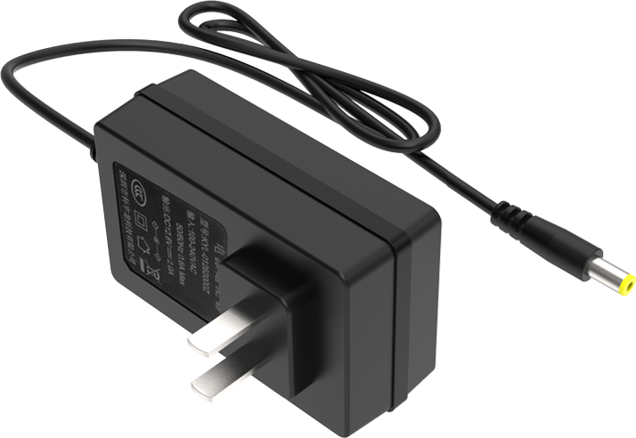
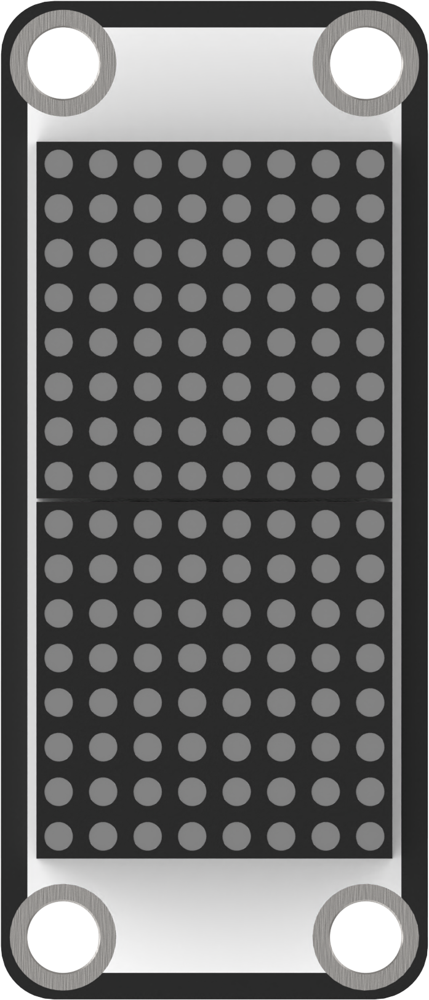
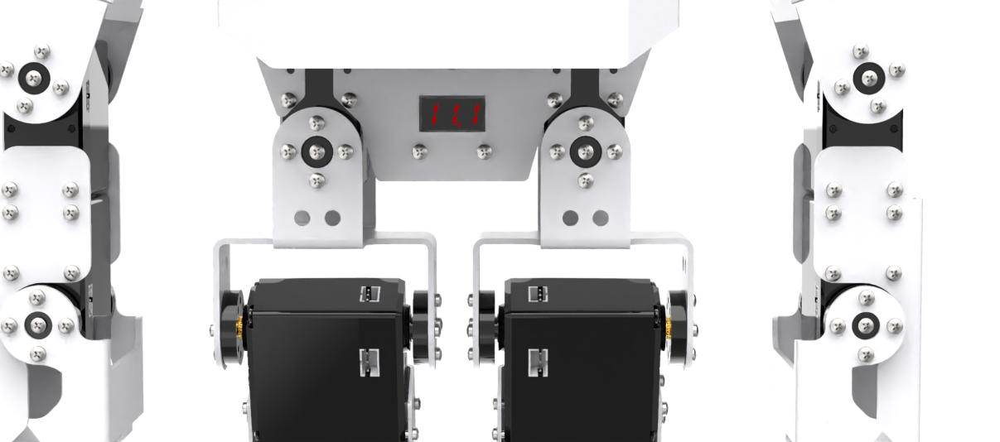

# 1. Getting Ready

## 1.1 TonyPi Pro Introduction

**1.1.1 Product Introduction**

TonyPi Pro is an AI vision humanoid robot development kit powered by Raspberry Pi 5. Upgraded from Hiwonder TonyPi advanced kit, TonyPi Pro not only retains the original functions, but extends more interesting AI creative games, including Clearing Hurdles, Going Up and Down Stair, Intelligent Picking, Mask Recognition, Group Controlling, etc.

In addition to learn and verify robot vision and kinematics algorithms, it also provides fast and easy integration scheme for sensor application, vision picking and other secondary development.

## 1.2 TonyPi Pro Packing List

<table class="docutils-nobg" border="1">
  <thead>
    <tr>
      <th style="text-align: center;">No.</th>
      <th style="text-align: center;">Components</th>
      <th style="text-align: center;">Quality</th>
      <th style="text-align: center;">Picture</th>
    </tr>
  </thead>
  <tbody>
<tr>
  <td style="text-align: center;">1</td>
  <td style="text-align: center;">TonyPi(Ready to use)</td>
  <td style="text-align: center;">1</td>
  <td style="text-align: center;"></td>
</tr>
<tr>
  <td style="text-align: center;">2</td>
  <td style="text-align: center;">12.6V Lipo battery charger</td>
  <td style="text-align: center;">1</td>
  <td style="text-align: center;"></td>
</tr>
<tr>
  <td style="text-align: center;">3</td>
  <td style="text-align: center;">Balls</td>
  <td style="text-align: center;">3</td>
  <td style="text-align: center;"></td>
</tr>
<tr>
  <td style="text-align: center;">4</td>
  <td style="text-align: center;">Tags</td>
  <td style="text-align: center;">3</td>
  <td style="text-align: center;"></td>
</tr>
<tr>
  <td style="text-align: center;">5</td>
  <td style="text-align: center;">Card Reader</td>
  <td style="text-align: center;">1</td>
  <td style="text-align: center;"></td>
</tr>
<tr>
  <td style="text-align: center;">6</td>
  <td style="text-align: center;">Screwdriver</td>
  <td style="text-align: center;">1</td>
  <td style="text-align: center;"></td>
</tr>
<tr>
  <td style="text-align: center;">7</td>
  <td style="text-align: center;">Sponge Cubes</td>
  <td style="text-align: center;">3</td>
  <td style="text-align: center;"></td>
</tr>
<tr>
  <td style="text-align: center;">8</td>
  <td style="text-align: center;">Map</td>
  <td style="text-align: center;">1</td>
  <td style="text-align: center;"></td>
</tr>
<tr>
  <td style="text-align: center;">9</td>
  <td style="text-align: center;">Accessory Bag   (M2*4 Round head screw * 5 M2*6 round head screw * 5 M3*6 Black round head screw * 2 M2*5 Round head self-tapping screw * 5 M2*6 Round head self-tapping screw * 5 A3*5*7 Round head cross-recessed washer-equipped self-tapping screw * 2 M2 nut * 5 10cm 3pin wire * 1 20cm 3pin wire * 1 Main plastic steering wheel * 2 Auxiliary plastic steering wheel * 2)</td>
  <td style="text-align: center;">1</td>
  <td style="text-align: center;"></td>
</tr>
<tr>
  <td style="text-align: center;">8</td>
  <td style="text-align: center;">User Manual</td>
  <td style="text-align: center;">1</td>
  <td style="text-align: center;"></td>
</tr>
    </tr>
     <tr>
      <td align="center">11</td>
      <td align="center">TonyPi Hand</td>
      <td align="center">2</td>
      <td align="center"></td>
    </tr>
    <tr>
      <td align="center">12</td>
      <td align="center">MP3 module</td>
      <td align="center">1</td>
      <td align="center"></td>
    </tr>
    <tr>
      <td align="center">13</td>
      <td align="center">Fan module</td>
      <td align="center">1</td>
      <td align="center"></td>
    </tr>
    <tr>
      <td align="center">14</td>
      <td align="center">Glowy ultrasonic sensor</td>
      <td align="center">1</td>
      <td align="center"></td>
    </tr>
    <tr>
      <td align="center">15</td>
      <td align="center">Dot matrix display</td>
      <td align="center">1</td>
      <td align="center"></td>
    </tr>
    <tr>
      <td align="center">16</td>
      <td align="center">Light sensor</td>
      <td align="center">1</td>
      <td align="center"></td>
    </tr>
    <tr>
      <td align="center">17</td>
      <td align="center">Touch sensor</td>
      <td align="center">1</td>
      <td align="center"></td>
    </tr>
    <tr>
      <td align="center">18</td>
      <td align="center">PS2 wireless handle</td>
      <td align="center">1</td>
      <td align="center"></td>
    </tr>
    <tr>
      <td align="center">19</td>
      <td align="center">Line map</td>
      <td align="center">1</td>
      <td align="center"></td>
    </tr>
    <tr>
      <td align="center">20</td>
      <td align="center">Stair and Hurdle</td>
      <td align="center">1</td>
      <td align="center"></td>
    </tr>
    <tr>
      <td align="center">22</td>
      <td align="center">3 * 3 cm Blocks</td>
      <td align="center">3</td>
      <td align="center"></td>
    </tr>
    <tr>
      <td align="center">23</td>
      <td align="center">TonyPi Pro Accessories (M4*6 round head screw * 6 M2*6 round head self-tapping screw * 4 M3*25 flat head self-tapping screw * 6 M4 nut * 6  M4*5+6 Single-pass nylon standoff *4 70mm steering engine wire * 3 40cm 4pin wire * 2） </td>
      <td align="center">1</td>
      <td align="center"></td>
    </tr>
  </tbody>
</table>

## 1.3 Charging and Power-On Status Explanation

**Due to transportation regulations, lithium batteries must be disconnected during transit. Therefore, you need to connect the battery connector upon receiving the robot. Then, charge it before powering it on for the first time after charging is complete.**

**1.3.1 Charging Method**

:::{Note}
Please check whether the paring wires are connected. The battery paring wire connection is red to red and black to black.
:::

**Step1**： Wire the charger up to the hole of Raspberry Pi expansion board at the back of robot.

**Step 2**： The charger LED indicator will turn GREEN when the battery charger is connected to the battery without being plugged into an AC power outlet.
When indicator turns green, it means robot is in charging The duration of charging is about 3 hours. When the charger indicator turns green from red, it  means charging has been completed. Please note that you need to disconnect the charger as soon as possible after charging!

**1.3.2 Turn On TonyPi Pro**

(1) Switch on Raspberry Pi expansion board on the back. The LED1 and LED2 of the Raspberry Pi will be on firstly and then the LED2 will flash every 2 seconds, which means the robot is turned on successfully.

:::{Note}
The Raspberry Pi is a small minicomputer itself. It usually takes a period time to boot up. Please wait for it patiently.
:::

(2) After powering up, Raspberry Pi will be in a AP hotspot mode and launch a Wi-Fi hotspot with a network named with the first letters "HW" .

**1.3.3 Check the battery**

TonyPi is equipped with a voltage display module on its back, allowing users to monitor the robot's current battery level in real time, as illustrated in the diagram below:

The operating voltage range of TonyPi is 9V-12.6V. When the battery is fully charged, the voltage display module will show **12.6**. Please recharge the robot promptly when the current voltage is below 10V.

Now, let's go to the Folder "**[2.Quick User Experience](https://docs.hiwonder.com/projects/TonyPi_Pro/en/latest/docs/2.quick_user_experience.html)**" for more lessons.
