# AI自主全能课程

<p id="anchor_1"></p>

## 1.道具的安装及地图的铺设

### 1.1 道具清单

要进行田径运动，我们需要准备好地图，并需要在地图对应位置摆设台阶和栏杆。所需零件如下表格：

<table class="docutils-nobg" style="text-align:center" border="1">
<colgroup>
<col/>
<col/>
<col/>
</colgroup>
<tbody>
<tr>
<td ><strong>图片</strong></td>
<td ><strong>名称</strong></td>
<td ><strong>数量</strong></td>
</tr>
<tr>
<td >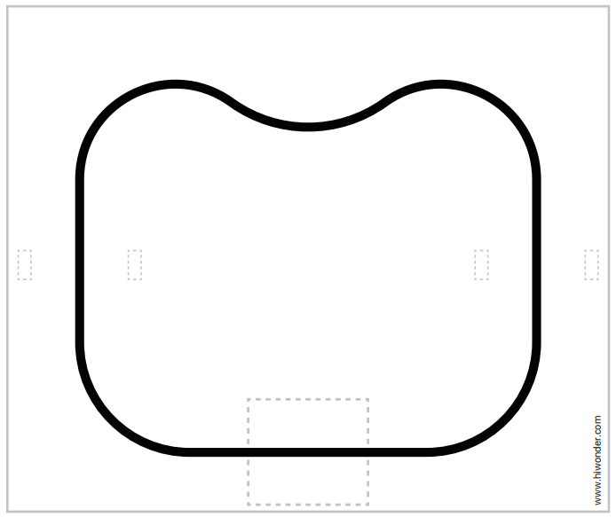</td>
<td >地图</td>
<td >1</td>
</tr>
<tr>
<td >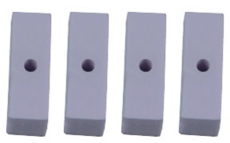</td>
<td >白色栏杆配件</td>
<td >4</td>
</tr>
<tr>
<td >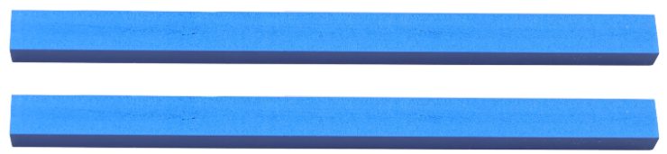</td>
<td >蓝色栏杆配件</td>
<td >2</td>
</tr>
<tr>
<td >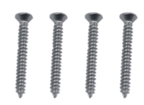</td>
<td >M3*25平头自攻螺丝</td>
<td >4</td>
</tr>
<tr>
<td >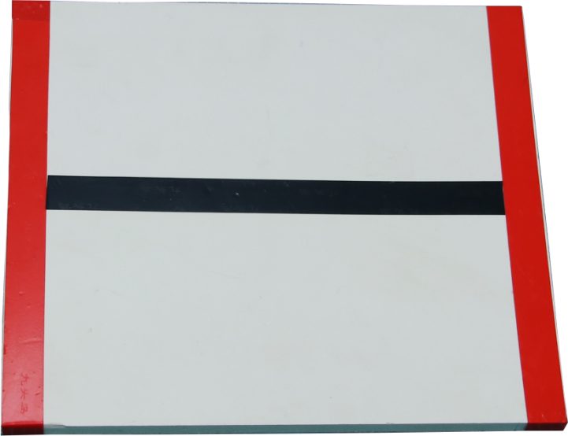</td>
<td ><p>台阶</p>
<p>（已铺设好电工胶带）</p></td>
<td >1</td>
</tr>
</tbody>
</table>


### 1.2 安装栏杆

栏杆的安装步骤如下：

1)  将白色栏杆配件放置在蓝色栏杆配件末端，如下图：

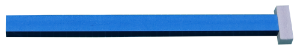

2)  通过M3\*20平头自攻螺丝将白色栏杆配件安装在蓝色栏杆配件上，如下图：

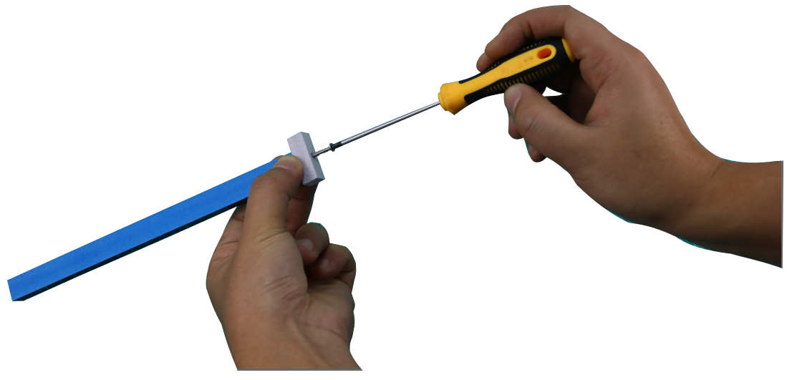

3)  再将白色栏杆配件安装在蓝色栏杆配件另一端，栏杆安装完成，如下图：

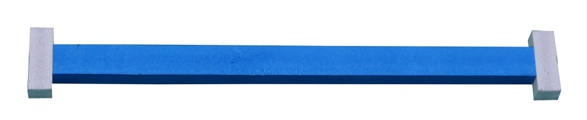

### 1.3 地图的铺设

在进行体验之前，我们需要对地图有一个基础的认识，地图由三个部分组成：①台阶放置区、②栏杆放置区、③黑色轨道，其分布如下图所示：


1.  **台阶放置区**

台阶放置区用于放置粘贴好胶带的台阶，具体放置方法如下图：

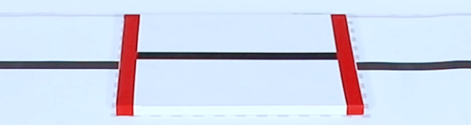

2.  **栏杆放置区**

台阶放置区用于放置2个安装好的栏杆，具体放置方法如下图：

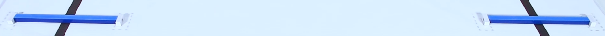

## 2. 爬台阶

### 2.1 准备工作

将TonyPi配置的地图放置在平整光滑的平面上，并将台阶道具摆放在地图上的正确位置。

具体的地图及道具摆放方法可参照上文"**[1. 道具的安装及地图的铺设](#anchor_1)**"视频及文档内容。

### 2.2 玩法简要说明

本节课整体实现的流程如下所示：

首先，需要对颜色进行识别，这里使用Lab颜色空间来进行处理。先将RGB颜色空间转换为Lab，然后通过二值化、膨胀腐蚀等操作，即可获得只包含目标颜色的轮廓，再将该颜色目标用蓝线标记，并且获取目标的坐标位置参数，从而完成颜色的识别。

接着，控制机器人靠近台阶。根据目标坐标进行判断，若处在目标红线的中心位置，则控制前进靠近，达到设定的范围时，执行上、下台阶动作；否则先控制机器人向左或向右移动至目标中心位置后，再执行上、下台阶动作。

### 2.3 玩法开启及关闭

:::{Note}
指令输入需严格区分大小写及空格。
:::

1)  将机器人开机，然后通过VNC远程连接树莓派桌面。

2)  点击桌面左上角的图标，打开命令行终端， 输入指令，按下回车，则可定位到存放了玩法程序的目录。

```commandline
cd /home/pi/TonyPi/Extend/athletics_course/
```

3. 输入指令，回车，玩法启动。

```commandline
python3 stairway.py
```

4. 如需关闭此玩法，只需要在终端界面中按下"**Ctrl+C**"。若关闭失败，可多次按下。

### 2.4 功能实现

将台阶放置在摄像头视野范围内，机器人会根据识别到的红色线条调整位置，慢慢走近 台阶。当靠近台阶的中心位置附近时，机器人将会开始上、下台阶。

### 2.5 功能延伸

<p id="anchor_2_5_1"></p>

- #### 2.5.1 修改爬台阶位置

程序默认当机器人检测到台阶的红色线条后，在距离线条1000位置处，机器人开始爬台阶。如果需要靠近一点开始爬台阶，则数据减小；需要离远一点开始爬台阶，则数据增大。本节以设置距离线条1020位置处，机器人开始爬台阶，可参照以下步骤：

1)  输入指令，按下回车，则可定位到存放了玩法程序的目录。

```commandline
cd /home/pi/TonyPi/Extend/athletics_course/
```

2. 输入指令，按下回车，打开玩法程序文件。

```commandline
vim stairway.py
```

3. 找到如下框出的代码：

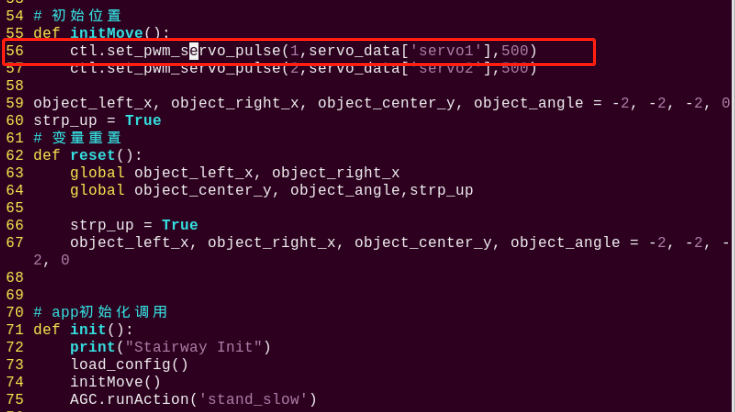

4. 按一下键盘的"**i**"键，当界面左下角出现"**插入**"字样时，表明进入编辑模式。

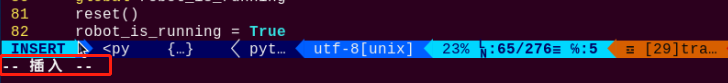

5. 将"**ctl.set_pwm_servo_pulse(1,servo_data\['servo1'\],500)**"中的"**servo_data\['servo1'\]**"改为"**1020**"，如下图所示：

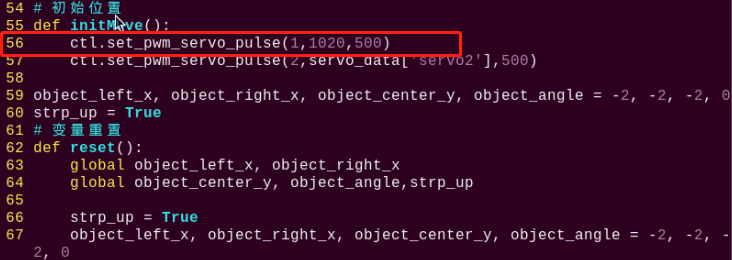

6. 修改完成之后，按一下键盘的"**Esc**"键，再依次输入指令（注意wq前为冒号：），回车，即可保存修改内容。

```commandline
:wq
```

- #### 2.5.2 修改识别颜色

制作台阶时，我们在阶梯上粘贴红色胶带。机器人检测到红色线条后爬台阶。我们可以在阶梯上粘贴其他颜色胶带，例如绿色，设置机器人检测到绿色线条后爬台阶，步骤如下：

1)  参考"[ 修改爬台阶位置](#anchor_2_5_1)"步骤（1）、（2）、（4），进入程序编辑界面，找到如下框出的代码：

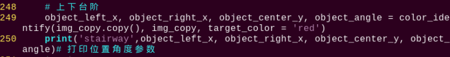

2)  按一下键盘的"**i**"键，进入编辑模式，将"**object_left_x, object_right_x, object_center_y, object_angle = color_identify(img, img_copy, target_color = 'red')**"中"**red**"改为"**green**"。

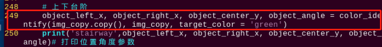

3)  修改完成之后，参考"[修改爬台阶位置](#anchor_2_5_1)"步骤（6），将代码保存。

### 2.6 程序简要分析

该程序的源代码位于：/home/pi/TonyPi/Extend/athletics_course/stairway.py

<p id="anchor_2_6_1"></p>

- #### 2.6.1 导入参数模块

| **导入模块** | **作用** |
|:--:|:--:|
| import sys | 导入了Python的sys模块，用于访问系统相关的功能和变量 |
| import os | 导入Python的os模块，提供了与操作系统交互的函数和方法 |
| import cv2 | 导入了OpenCV库，用于图像处理和计算机视觉相关的功能 |
| import time | 导入了Python的time模块，用于时间相关的功能，例如延时操作 |
| import math | math模块提供了对数学运算的底层访问，包含了许多常用的数学函数和常量 |
| import threading | 提供多线程运行的环境 |
| import np | 导入NumPy库，是Python的一个开源数值计算扩展库，用于处理数组和矩阵运算 |
| import sensor.camera as camera | 导入相机库 |
| from common import misc | 导入了Misc模块，用于处理识别得到的矩形数据 |
| import common.ros_robot_controller_sdk as rrc | 导入机器人底层控制库，用于控制舵机、电机、RGB灯等硬件 |
| import common.yaml_handle | 包含一些与处理YAML格式文件相关的功能或工具 |
| from common.controller import Controller | 导入了运动控制库 |

- #### 2.6.2 功能逻辑

根据实现效果，梳理该玩法的实现逻辑如下图所示：

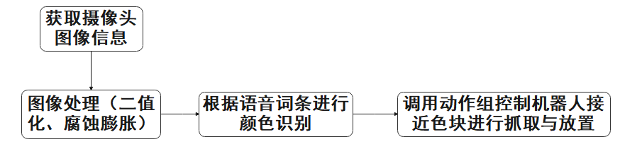

通过摄像头获取图像信息，再进行图像处理，即对图像进行二值化处理。同时为了降低干扰，令图像更平滑，对图像进行腐蚀和膨胀处理。

接着根据语音识别结果，控制机器人接近色块并进行色块的抓取与放置。

- #### 2.6.3 程序逻辑及对应的代码分析

从程序文件梳理得到程序逻辑流程图如下图所示。

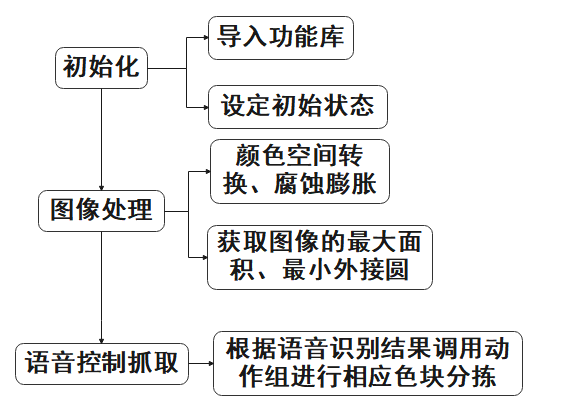

从上图得到，程序的逻辑流程主要为图像处理与语音控制抓取，以下的文档内容将依照上述程序逻辑流程图进行编写。

1. **初始化**

- **导入功能库**

在初始化的这一步，首先就需要将功能库导入进来，方便后续程序的调用，关于导入进来的内容。可以前往[导入参数模块](#anchor_2_6_1)进行查看。

```py
#!/usr/bin/python3
# coding=utf8
import os
import sys
import cv2
import time
import math
import threading
import numpy as np
import hiwonder.ros_robot_controller_sdk as rrc
from hiwonder.Controller import Controller
import hiwonder.PID as PID
import hiwonder.Misc as Misc
import hiwonder.Camera as Camera
import hiwonder.ActionGroupControl as AGC
import hiwonder.yaml_handle as yaml_handle
```

- **设定初始状态**

设置初始状态，这里就包括了舵机的初始位置、颜色的阈值、动作组名称等。

```py
# 初始位置
def initMove():
    ctl.set_pwm_servo_pulse(1,servo_data['servo1'],500)
    ctl.set_pwm_servo_pulse(2,servo_data['servo2'],500)   

object_left_x, object_right_x, object_center_y, object_angle = -2, -2, -2, 0
strp_up = True
```

```py
go_forward = 'go_forward'
go_forward_one_step = 'go_forward_one_step'
go_forward_one_small_step = 'go_forward_one_small_step'
turn_right = 'turn_right_small_step_a'
turn_left  = 'turn_left_small_step_a'        
left_move = 'left_move_20'
right_move = 'right_move_20'
go_turn_right = 'turn_right'
go_turn_left = 'turn_left'
```

2. **图像处理**

- **图像预处理**

对图像进行尺寸调整与高斯模糊处理

```py
frame resize = cv2.resize(img copy, size, interpolation=CV2.INTER NEAREST)
frame gb = cv2.GaussianBlur(frame resize, (3, 3), 3)
```

cv2.resize(img_copy, size, interpolation=cv2.INTER_NEAREST) 是对图像进行尺寸调整的操作。

第一个参数"**img_copy**"是要调整尺寸的图像；

第二个参数"**size**"是目标尺寸；

第三个参数"**interpolation**"是插值方法，用于确定调整尺寸时使用的像素插值算法。

cv2.GaussianBlur(frame_resize, (3, 3), 3) 是对图像应用高斯模糊

第一个参数"**frame_resize**"是要进行模糊处理的图像；

第二个参数"**(3, 3)**"高斯核的大小，表示核的宽度和高度都为 3；

第三个参数"**3**"是高斯核的标准差，用于控制模糊程度。较大的值会产生更强的模糊效果。

- **颜色空间转换**

将BGR图像转换为LAB图像

```py
frame_lab = cv2.cvtColor(GaussianBlur_img, cv2.COLOR_BGR2LAB) #将图像转换到LAB空间
```

- **二值化处理**

采用cv2库中的inRange()函数对图像进行二值化处理。

```py
if i in lab_data:
    frame_mask =cv2.inRange(frame lab, 
                            (lab_data[i]['min'][0], 
                             Lab_data[i]['min'][1],
                             Lab_data[i]['min'][2],
                             Lab_data[i]['max'][0],
                             Lab_data[i]['max'][1],
                             Lab_data[i]['max'][2]))  # 对原图像和掩模进行位运算
```

第一个参数"**frame_lab**"是输入图像；

第二个参数"**lab_data\[i\]\['min'\]\[0\]**"是阈值下限；

第三个参数"**lab_data\[i\]\['max'\]\[0\]**"是阈值上限；

- **开闭运算**

```py
opened = cv2.morphologyEx(frame_mask, cv2.MORPH_OPEN, np.ones((3,3),np.uint8))#开运算
closed = cv2.morphologyEx(opened, cv2.MORPH_CLOSE, np.ones((3,3),np.uint8))#闭运算
```

cv2.morphologyEx(frame_mask, cv2.MORPH_OPEN, np.ones((3, 3), np.uint8)) 是对二值图像进行开运算的操作。

第一个参数"**frame_mask**"是要进行形态学运算的二值图像；

第二个参数"**cv2.MORPH_OPEN**"是指定进行开运算操作；

第三个参数"**np.ones((3, 3), np.uint8)**"是形态学运算的结构元素，用于定义运算的形状和大小。在这里，使用了一个大小为 3x3 的全为 1 的矩阵作为结构元素。

闭运算函数同理。

- **获取最大面积轮廓**

完成上述的图像处理后，需要获取识别目标的轮廓，此处涉及cv2库中findContours()函数。

```py
contours = cv2.findContours(closed, cv2.RETR_EXTERNAL, cv2.CHAIN_APPROX_NONE)[-2] #找出所有外轮廓
areaMax_contour = getAreaMaxContour(contours, area_min=50)[0] #找到最大的轮廓
```

以代码"**contours = cv2.findContours(dilated, cv2.RETR_EXTERNAL, cv2.CHAIN_APPROX_NONE)\[-2\]**"为例：

第一个参数"**dilated**"是输入图像；

第二个参数"**cv2.RETR_EXTERNAL**"是轮廓的检索模式；

第三个参数"**cv2.CHAIN_APPROX_NONE)\[-2\]**"是轮廓的近似方法。

在获得的轮廓中寻找面积最大的轮廓，而为了避免干扰，需要设定一个最小值，仅当面积大于该值时，目标轮廓才有效。

- **获取轮廓底部和左右两侧的坐标并进行映射**

使用areaMax_contour函数获取底部和左右两侧的坐标，根据欧氏距离公式计算底部到左侧和底部到右侧的距离。如果底部到左侧的距离大于底部到右侧的距离，则进行坐标映射，将坐标从原始图像映射到新的图像画面。

```py
if areaMax_contour is not None:

    down_x = (areaMax_contour[areaMax_contour[:,:,1].argmax()][0])[0]
    down_y = (areaMax_contour[areaMax_contour[:,:,1].argmax()][0])[1]

    left_x = (areaMax_contour[areaMax_contour[:,:,0].argmin()][0])[0]
    left_y = (areaMax_contour[areaMax_contour[:,:,0].argmin()][0])[1]

    right_x = (areaMax_contour[areaMax_contour[:,:,0].argmax()][0])[0]
    right_y = (areaMax_contour[areaMax_contour[:,:,0].argmax()][0])[1]

    if pow(down_x - left_x, 2) + pow(down_y - left_y, 2) > pow(down_x - right_x, 2) + pow(down_y - right_y, 2):
        left_x = int(Misc.map(left_x, 0, size[0], 0, img_w))
        left_y = int(Misc.map(left_y, 0, size[1], 0, img_h))  
        right_x = int(Misc.map(down_x, 0, size[0], 0, img_w))
        right_y = int(Misc.map(down_y, 0, size[1], 0, img_h))
    else:
        left_x = int(Misc.map(down_x, 0, size[0], 0, img_w))
        left_y = int(Misc.map(down_y, 0, size[1], 0, img_h))
        right_x = int(Misc.map(right_x, 0, size[0], 0, img_w))
        right_y = int(Misc.map(right_y, 0, size[1], 0, img_h))
```

- **绘制线条轮廓**

使用OpenCV的cv2.line函数在图像上绘制一条线段。

img_draw：要绘制线段的图像。

(left_x, left_y)和(right_x, right_y)：线段的起点和终点坐标。

(255, 0, 0)：线段的颜色，这里是蓝色（在BGR颜色空间中）。

2：线段的厚度。

```py
center_y = int(Misc.map((areaMax_contour[areaMax_contour[:,:,1].argmax()][0])[1], 0, size[1], 0, img_h))
angle = int(math.degrees(math.atan2(right_y - left_y, right_x - left_x)))

cv2.line(img_draw, (left_x, left_y), (right_x, right_y), (255, 0, 0), 2)
```

3. **爬台阶**

-  **检测台阶：** 通过object_center_y的值来检测台阶的位置。

-  **位置微调：** 计算的中心x坐标object_x。

-  **快速靠近：** 如果中心y坐标小于320，且中心x与机器人中心x的差值小于150，机器人将执行前进动作以快速靠近台阶。

-  **角度调整：** 根据object_angle的值，机器人会决定是向右转还是向左转，以调整与台阶之间的角度。

-  **左右调整：** 如果中心x与机器人中心x的差值超过一定阈值，机器人会执行向左或向右的移动动作，以调整其横向位置。

- **角度微调：** 在3~20角度范围内，机器人会执行微小的转向动作，以更精确地调整与台阶之间的角度。

-  **在台阶中心：** 如果对象中心y坐标在320到430之间，机器人会执行一步前进的动作。

- **靠近台阶：** 如果对象中心y坐标大于或等于430，机器人会等待一段时间，并检查y坐标是否仍然大于或等于430。如果是，则机器人会发出声音提示，并执行一系列小步前进的动作。

-  **上下台阶：** 如果机器人之前被标记为准备上台阶（strp_up为True），则执行上台阶的动作，并重置strp_up标志。否则，执行下台阶的默认动作。

这个代码的目的是让机器人能够自动地识别和处理台阶，无论是上台阶还是下台阶，都能以相对安全和精确的方式进行。通过一系列的条件判断和动作执行，机器人能够根据台阶的位置和自身的相对位置来做出合适的反应。

```py
while True:
    if robot_is_running:
        if object_center_y >= 0:  #检测到台阶,进行位置微调  
            object_x = object_left_x + (object_right_x - object_left_x)/2

            if object_center_y < 320 and abs(object_x - centreX) < 150:  #快速靠近
                AGC.runActionGroup(go_forward)
                time.sleep(0.2)

            elif 20 <= object_angle < 90:  #角度调整
                AGC.runActionGroup(go_turn_right)
                time.sleep(0.2)           
            elif -20 >= object_angle > -90:
                AGC.runActionGroup(go_turn_left)
                time.sleep(0.2)

            elif object_x - centreX > 15: #左右调整
                AGC.runActionGroup(right_move)
            elif object_x - centreX < -15:
                AGC.runActionGroup(left_move)

            elif 3 < object_angle < 20:   #角度微调
                AGC.runActionGroup(turn_right)
                time.sleep(0.2)           
            elif -5 > object_angle > -20:
                AGC.runActionGroup(turn_left)
                time.sleep(0.2)

            elif 320 <= object_center_y < 450:   #在中心
                AGC.runActionGroup(go_forward_one_step)
                time.sleep(0.2)

            elif object_center_y >= 450: #位置靠近，可以跨栏或者上下台阶
                time.sleep(0.8)
                if object_center_y >= 450:
                    board.set_buzzer(1900, 0.1, 0.9, 1) 
                    for i in range(3):
                        AGC.runActionGroup(go_forward_one_small_step) #前进一小步
                        time.sleep(0.5)

                        if strp_up: # 上台阶
                            AGC.runActionGroup('climb_stairs')
                            strp_up = False
                        else:       # 下台阶
                            AGC.runActionGroup(go_forward_one_small_step) #前进一步
                            time.sleep(0.5)
                            AGC.runActionGroup('down_floor')
                            strp_up = True
                            time.sleep(0.5)
                            object_center_y = -1
```

以"**AGC.runActionGroup('grab_right')**"代码为例：

使用AGC.runActionGroup函数调用动作组，"**grab_right**"为动作组名称。

## 3. 跨栏运动

### 3.1 准备工作

将TonyPi配置的地图放置在平整光滑的平面上，并将跨栏道具摆放在地图上的正确位置。

具体的地图及道具摆放方法可参照"**[1. 道具的安装及地图的铺设](#anchor_1)**"视频及文档内容。

### 3.2 玩法简要说明

本节课整体实现的流程如下所示：

首先，需要对颜色进行识别，这里使用Lab颜色空间来进行处理。先将RGB颜色空间转换为Lab，然后通过二值化、膨胀腐蚀等操作，即可获得只包含目标颜色的轮廓，再将该颜色目标用蓝线标记，并且获取目标的坐标位置参数，从而完成颜色的识别。

接着，控制机器人靠近栏杆。根据目标坐标进行判断，若处在目标栏杆的中心位置，则控制前进靠近，达到设定的范围时，执行跨栏动作；否则先控制机器人向左或向右移动至目标中心位置后，再执行跨栏动作。

### 3.3 玩法开启及关闭

:::{Note}
指令输入需严格区分大小写及空格。
:::

1)  将机器人开机，然后通过VNC远程连接树莓派桌面。
2)  点击桌面左上角的图标，打开命令行终端， 输入指令，按下回车，则可定位到存放了玩法程序的目录。

```commandline
cd /home/pi/TonyPi/Extend/athletics_course/
```

3. 输入指令，按下回车，玩法启动。

```commandline
python3 hurdles.py
```

4. 如需关闭此玩法，只需要在终端界面中按下"**Ctrl+C**"。若关闭失败，可多次按下。

### 3.4 功能实现

将栏杆放置在摄像头视野范围内，机器人会根据识别到的蓝色线条调整位置，慢慢走近 栏杆。当回传画面中的线条和栏杆上的蓝色线条重合时，机器人将会抬脚跨越栏杆。

### 3.5 功能延伸

<p id="anchor_3_5_1"></p>

- #### 3.5.1 修改跨栏杆位置

程序默认当机器人检测到栏杆的蓝色界面后，在距离线条1000位置处，机器人开始跨栏杆。如果需要靠近一点开始跨栏杆，则数据减小；需要离远一点开始跨栏杆，则数据增大。本节以设置距离线条1020位置处，机器人开始爬台阶，可参照以下步骤：

1.  输入指令，按下回车，则可定位到存放了玩法程序的目录。

```commandline
cd /home/pi/TonyPi/Extend/athletics_course/
```

2.  输入指令，按下回车，打开玩法程序文件。

```commandline
vim hurdles.py
```

3. 找到如下框出的代码：

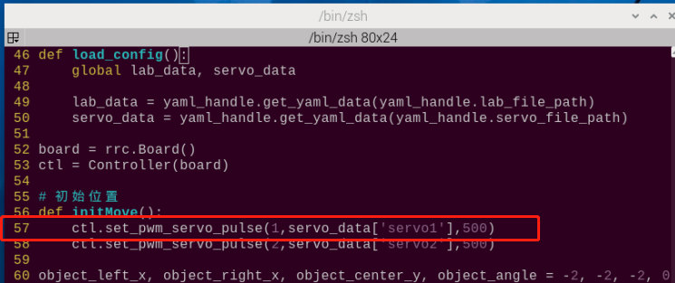

4. 按一下键盘的"**i**"键，当界面左下角出现"**插入**"字样时，表明进入编辑模式。

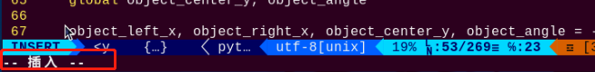

5. 将"**ctl.set_pwm_servo_pulse(1,servo_data\['servo1'\],500)**"中的"**servo_data\['servo1'\]**"改为"**1020**"，如下图所示：

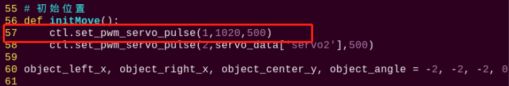

6. 修改完成之后，按一下键盘的"**Esc**"键，再依次输入指令（注意wq前为冒号：），回车，即可保存修改内容。

```commandline
:wq
```

- #### 3.5.2 修改识别颜色

我们的栏杆是蓝色的。我们可以在栏杆上粘贴其他颜色胶带，例如绿色，设置机器人检测到绿色界面后跨栏杆，步骤如下：

1)  参考"[修改跨栏杆位置](#anchor_3_5_1)"步骤（1）、（2）、（4），进入程序编辑界面，找到如下框出的代码：

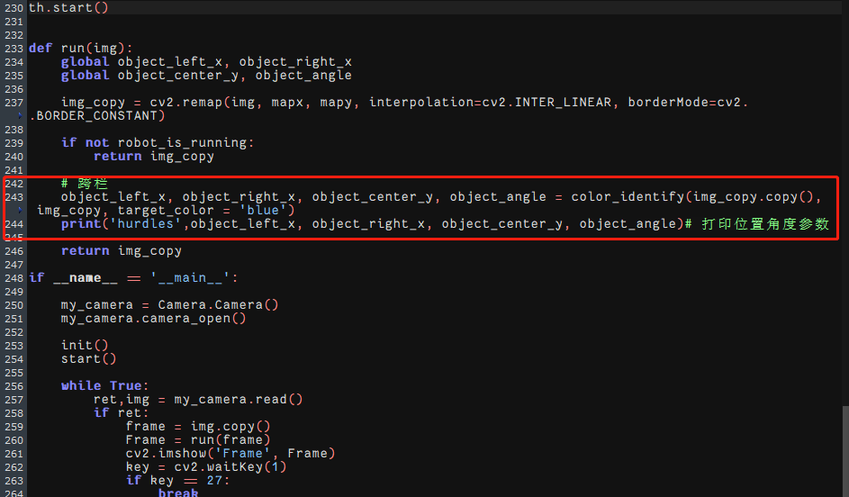

2)  按一下键盘的"**i**"键，进入编辑模式，将"**object_left_x, object_right_x, object_center_y, object_angle = color_identify(img, img_copy, target_color = 'blue')**"中"**blue**"改为"**green**"。

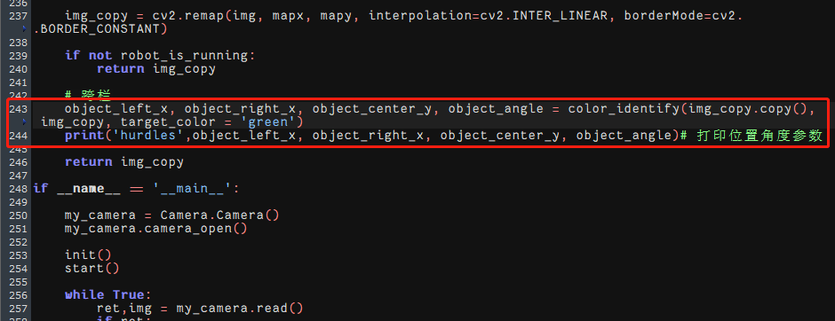

3)  修改完成之后，参考"[修改跨栏杆位置](#anchor_3_5_1)"步骤（6），将代码保存。

### 3.6 程序简要分析

该程序的源代码位于：/home/pi/TonyPi/Extend/athletics_course/hurdles.py

<p id="anchor_3_6_1"></p>

- #### 3.6.1 导入参数模块

| **导入模块** | **作用** |
|:--:|:--:|
| import sys | 导入了Python的sys模块，用于访问系统相关的功能和变量 |
| import os | 导入Python的os模块，提供了与操作系统交互的函数和方法 |
| import cv2 | 导入了OpenCV库，用于图像处理和计算机视觉相关的功能 |
| import time | 导入了Python的time模块，用于时间相关的功能，例如延时操作 |
| import math | math模块提供了对数学运算的底层访问，包含了许多常用的数学函数和常量 |
| import threading | 提供多线程运行的环境 |
| import np | 导入NumPy库，是Python的一个开源数值计算扩展库，用于处理数组和矩阵运算 |
| import sensor.camera as camera | 导入相机库 |
| from common import misc | 导入了Misc模块，用于处理识别得到的矩形数据 |
| import common.ros_robot_controller_sdk as rrc | 导入机器人底层控制库，用于控制舵机、电机、RGB灯等硬件 |
| import common.yaml_handle | 包含一些与处理YAML格式文件相关的功能或工具 |
| from common.controller import Controller | 导入了运动控制库 |

- #### 3.6.2 功能逻辑

根据实现效果，梳理该玩法的实现逻辑如下图所示：

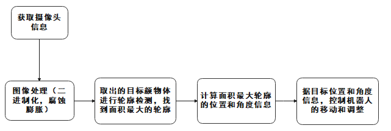

通过摄像头获取图像信息，再进行图像处理，即对图像进行二值化处理。同时为了降低干扰，令图像更平滑，对图像进行腐蚀和膨胀处理。

接着在color_identify函数中，根据面积最大的轮廓计算出颜色块的位置和角度信息。具体来说，根据轮廓的最下点和最左点、最右点计算出颜色块的左右边界和中心点位置，以及颜色块的角度。

然后根据目标位置和角度信息，控制机器人的移动和调整，使其朝向目标并靠近目标。

- #### 3.6.3 程序逻辑及对应的代码分析

从程序文件梳理得到程序逻辑流程图如下图所示。

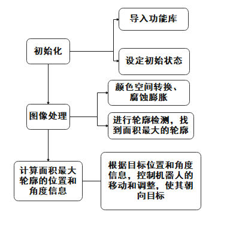

从上图得到，程序的逻辑流程主要为图像处理与跨栏运动，以下的文档内容将依照上述程序逻辑流程图进行编写。

1. **初始化**

- **导入功能库**

在初始化的这一步，首先就需要将功能库导入进来，方便后续程序的调用，关于导入进来的内容。可以前往[5.1导入参数模块](#anchor_3_6_1)进行查看。

```py
#!/usr/bin/python3
# coding=utf8
import os
import sys
import cv2
import time
import math
import threading
import numpy as np

import hiwonder.PID as PID
import hiwonder.Misc as Misc
import hiwonder.ros_robot_controller_sdk as rrc
from hiwonder.Controller import Controller
import hiwonder.Camera as Camera
import hiwonder.ActionGroupControl as AGC
import hiwonder.yaml_handle as yaml_handle
```

- **设定初始状态**

设置初始状态，这里就包括了舵机的初始位置、颜色的阈值等。

```py
# 初始位置
def initMove():
    ctl.set_pwm_servo_pulse(1,servo_data['servo1'],500)
    ctl.set_pwm_servo_pulse(2,servo_data['servo2'],500) 
```

2. **图像处理**

- **图像预处理**

对图像进行尺寸调整与高斯模糊处理

```py
img_resize = cv2.resize(img, (size[0], size[1]), interpolation = cv2.INTER_CUBIC)
GaussianBlur_img = cv2.GaussianBlur(img_resize, (3, 3), 0)#高斯模糊
```

cv2.resize(img_copy, size, interpolation=cv2.INTER_NEAREST) 是对图像进行尺寸调整的操作。

第一个参数"**img_copy**"是要调整尺寸的图像；

第二个参数"**size\[0\],size\[1\]**"是目标尺寸；

第三个参数"**interpolation**"是插值方法，用于确定调整尺寸时使用的像素插值算法。

**cv2.GaussianBlur(frame_resize, (3, 3), 0)** 是对图像应用高斯模糊

第一个参数"**frame_resize**"是要进行模糊处理的图像；

第二个参数"**(3, 3)**"高斯核的大小，表示核的宽度和高度都为 3；

第三个参数"**0**"是高斯核的标准差，用于控制模糊程度。较大的值会产生更强的模糊效果。

- **颜色空间转换**

将BGR图像转换为LAB图像

```py
frame_lab = cv2.cvtColor(GaussianBlur_img, cv2.COLOR_BGR2LAB) #将图像转换到LAB空间
```

- **二值化处理**

采用cv2库中的inRange()函数对图像进行二值化处理。

```py
frame_mask = cv2.inRange(frame_lab,
                         (lab_data[target_color]['min'][0],
                          lab_data[target_color]['min'][1],
                          lab_data[target_color]['min'][2]),
                         (lab_data[target_color]['max'][0],
                          lab_data[target_color]['max'][1],
                          lab_data[target_color]['max'][2]))  #对原图像和掩模进行位运算
```

第一个参数"**frame_lab**"是输入图像；

第二个参数"**lab_data\[i\]\['min'\]\[0\]**"是阈值下限；

第三个参数"**lab_data\[i\]\['max'\]\[0\]**"是阈值上限；

- **腐蚀与膨胀**

```py
opened = cv2.morphologyEx(frame_mask, cv2.MORPH_OPEN, np.ones((3,3),np.uint8))#开运算
closed = cv2.morphologyEx(opened, cv2.MORPH_CLOSE, np.ones((3,3),np.uint8))#闭运算
```

eroded = cv2.erode(frame_mask, cv2.getStructuringElement(cv2.MORPH_RECT, (3, 3))) 是对二值化图像进行腐蚀的操作。

第一个参数"**frame_mask**"是要进行形态学运算的二值图像；

第二个参数"**cv2.getStructuringElement(cv2.MORPH_RECT, (3, 3))**"是腐蚀操作的结构元素。这里使用了大小为 (3, 3) 的矩形结构元素。

膨胀函数同理。

- **指定物品颜色获取获取角度信息**

```py
# 跨栏
object_left_x, object_right_x, object_center_y, object_angle = color_identify(img_copy.copy(), img_copy, target_color = 'blue')
print('hurdles',object_left_x, object_right_x, object_center_y, object_angle)# 打印位置角度参数
```

- **获取最大面积轮廓**

完成上述的图像处理后，需要获取识别目标的轮廓，此处涉及cv2库中的findContours()函数。

```py
contours = cv2.findContours(closed, cv2.RETR_EXTERNAL, cv2.CHAIN_APPROX_NONE)[-2]  #找出搜友外轮廓
```

以代码"**contours = cv2.findContours(dilated, cv2.RETR_EXTERNAL, cv2.CHAIN_APPROX_NONE)\[-2\]**"为例：

第一个参数"**dilated**"是输入图像；

第二个参数"**cv2.RETR_EXTERNAL**"是轮廓的检索模式；

第三个参数"**cv2.CHAIN_APPROX_NONE)\[-2\]**"是轮廓的近似方法。

在获得的轮廓中寻找面积最大的轮廓，而为了避免干扰，需要设定一个最小值，仅当面积大于该值时，目标轮廓才有效。

```py
areaMax_contour = getAreaMaxContour(contours, area_min=50)[0] #找到最大的轮廓
```

- **检测到跨栏,进行位置微调**

```py
while True:
    if robot_is_running:
        if boject_center_y >= 0: # 检测到跨栏，进行位置微调
            object_x = object_left_x + (object_right_x - object_left_x)/2
```

通过不断循环来监测机器人的运行状态(robot_is_running)和物体的位置信息(object_center_y)。如果检测到跨栏（object_center_y \>= 0），则根据物体的位置和角度信息进行位置微调和动作控制。

- **如果离栏杆比较远，快速靠近**

```py
if object_center_y < 320 and abs(object_x - centereX) < 150:  #离栏杆比较远，快速靠近
    AGC.runActionGroup(go_forward)
    time.sleep(0.2)
```

如果离栏杆比较远，调用前进动作组快速靠近。

- **根据物体位置和角度信息进行位置微调和动作控制，靠近栏杆、转向、左右调整**

```py
elif 20 <= object_angle < 90:  #角度调整
    AGC.runActionGroup(go_turn_right)
    time.sleep(0.2)           
elif -20 >= object_angle > -90:
    AGC.runActionGroup(go_turn_left)
    time.sleep(0.2)

elif object_x - centreX > 15: #左右调整，让机器人正对栏杆
    AGC.runActionGroup(right_move)
elif object_x - centreX < -15:
    AGC.runActionGroup(left_move)

elif 3 < object_angle < 20:   #角度微调
    AGC.runActionGroup(turn_right)
    time.sleep(0.2)           
elif -5 > object_angle > -20:
    AGC.runActionGroup(turn_left)
    time.sleep(0.2)

elif 320 <= object_center_y < 470:   #慢慢靠近栏杆
    AGC.runActionGroup(go_forward_one_step)
    time.sleep(0.5)
```

- 如果角度在20到90度之间，表示角度需要向右微调，机器人向右转动。
- 如果角度在-90到-20度之间，表示角度需要向左微调，机器人向左转动。
- 如果中心横坐标object_x与中心点centreX的差值大于15像素，表示颜色块在中心点的右侧，机器人向右移动。
- 如果颜色块的中心横坐标object_x与中心点centreX的差值小于-15像素，表示颜色块在中心点的左侧，机器人向左移动。
- 如果颜色块的角度在3到20度之间，表示角度需要向右微调，机器人向右转动。
- 如果颜色块的角度在-20到-5度之间，表示角度需要向左微调，机器人向左转动。 如果颜色块的中心点位置在320到430像素之间，表示距离栏杆比较近，机器人向前慢慢靠近。

3. **位置靠近，跨栏**

```py
elif object_center_y >= 470: #位置靠近，跨栏
    time.sleep(0.8)
    if object_center_y >= 470:
        board.set_buzzer(1900, 0.1, 0.9, 1)
        for i in range(3):
            AGC.runActionGroup(go_forward_one_small_step) #前进一小步
            time.sleep(0.5)

            AGC.runActionGroup('hurdles')
            time.sleep(0.5)
            object_center_y = -1
```

如果颜色块的中心点位置大于等于430像素，表示机器人已经靠近栏杆，执行跨栏动作，并将object_center_y重置为-1，表示跨栏完成

## 4. 田径运动

### 4.1 准备工作

将TonyPi配置的地图放置在平整光滑的平面上，并将台阶道具摆放在地图上的正确位置。

具体的地图及道具摆放方法可参照"**[1. 道具的安装及地图的铺设](#anchor_1)**"视频及文档内容。

### 4.2 玩法简要说明

众所周知，机器人是一种模仿人类的设备。那么本节课，我们结合前面爬台阶和跨栏运动，模拟机器人学习人类进行田径运动。

下面我们看下本节课整体实现的流程：首先需要对颜色进行识别，我们使用Lab颜色空间来进行处理。先将RGB颜色空间转换为 Lab，然后进行二值化处理，再经过膨胀腐蚀等操作，可获得只包含目标颜色的轮廓， 再将该颜色轮廓用圆圈框起，便可实现物体颜色的识别。

接着在识别到后对云台部分进行处理，以图像的中心点的x、y坐标作为设定值，以当 前获取的x、y坐标作为输入值进行更新pid。

然后根据图像中线条位置的反馈进行计算，最后通过位置的变化使机器人跟随线条轨迹 进行移动，从而控制机器人沿着黑线行走。

再然后中途碰到台阶，参考第二课玩法，上下台阶，中途碰到栏杆，参考第三课玩法，进行跨栏运动。

### 4.3 玩法开启及关闭

:::{Note}
指令输入需严格区分大小写及空格。
:::

1)  将机器人开机，然后通过VNC远程连接树莓派桌面。

2)  点击桌面左上角的图标，打开命令行终端， 输入指令，按下回车，则可定位到存放了玩法程序的目录。

```commandline
cd /home/pi/TonyPi/Extend/athletics_course/
```

3. 输入指令，按下回车，玩法启动。

```commandline
python3 athletics_perform.py
```

4. 如需关闭此玩法，只需要在终端界面中按下"**Ctrl+C**"。若关闭失败，可多次按下。

### 4.4 功能实现

:::{Note}
- **在这个玩法中，机器人不要安装新手掌，否则会改变机器人重心，影响体验效果。**
- **机器人需要放置在平整光滑的平面上，避免执行动作时摔倒。**
- **背景颜色不要与红色、黑色和蓝色相近，以免影响体验效果。**
- **台阶和栏杆的高度请保持在1cm，且需要在台阶的首尾两端贴上红色线条。**
:::

将地图铺设在平整的地面上，在地图上放置好对于得台阶和栏杆。然后将机器人摆放在地图的黑线上。

运行玩法程序后，机器人沿着黑线行走，遇到台阶后，自动上下台阶，遇到栏杆后，自动跨越栏杆。

### 4.5 功能延伸

<p id="anchor_4_5_1"></p>

- #### 4.5.1 修改爬台阶和跨栏杆位置

运行程序后，如果爬台阶或跨栏杆效果不好，我们可以更改开始爬台阶或跨栏杆距离。默认为距离1000位置处，如果需要靠近一点，则数据减小；需要离远一点，则数据增大。本节以设置距离1020位置处，机器人开始爬台阶或跨栏杆，可参照以下步骤：

1)  输入指令，按下回车，则可定位到存放了玩法程序的目录。

```commandline
cd /home/pi/TonyPi/Extend/athletics_course/
```

2)  输入指令，回车，打开玩法程序文件。

```commandline
vim athletics_perform.py
```

3. 找到如下框出的代码：

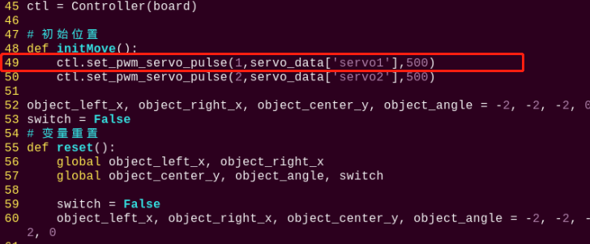

4. 按一下键盘的"**i**"键，当界面左下角出现"**插入**"字样时，表明进入编辑模式。

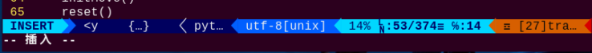

5. 将"**ctl.set_pwm_servo_pulse(1,servo_data\['servo1'\],500)**"中的"**servo_data\['servo1'\]**"改为"**1020**"，如下图所示：

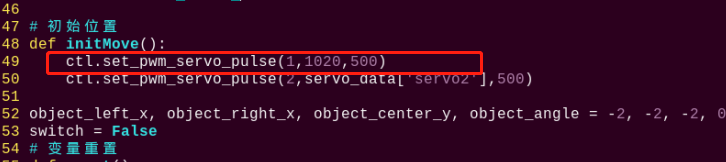

6. 修改完成之后，按一下键盘的"**Esc**"键，再依次输入指令（注意wq前为冒号：），回车，即可保存修改内容。

```commandline
:wq
```

- #### 4.5.2 修改巡线颜色

我们提供的地图，上面的是黑色线条。运行程序后，机器人会沿着黑色线条行走。你也可以自己有胶带设置粘贴地图，例如用绿色胶带粘贴地图，设置机器人沿着绿色线条行走，步骤如下：

1)  参考"[修改爬台阶和跨栏杆位置](#anchor_4_5_1)"步骤（1）、（2）、（4），进入程序编辑界面，找到如下框出的代码：


2)  按一下"**i**"键，进入编辑模式，将"**line_centerx = line_patrol(img, img_copy, target_color = 'black')**"中"**black**"改为"**green**"。


3)  修改完成之后，参考"[修改爬台阶和跨栏杆位置](#anchor_4_5_1)"步骤（6），将代码保存。

### 4.6 程序简要分析

该程序的源代码位于：**/home/pi/TonyPi/Extend/athletics_course/athletics_perform.py**


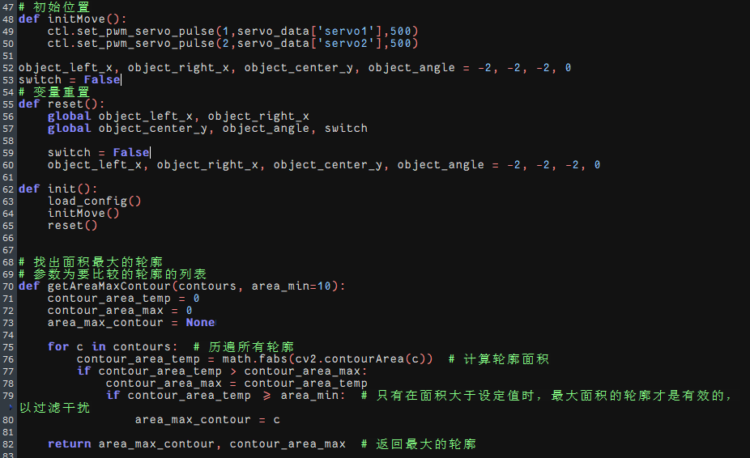

<p id="anchor_4_6_1"></p>

- #### 4.6.1 导入参数模块

| **导入模块** | **作用** |
|:--:|:--:|
| import sys | 导入了Python的sys模块，用于访问系统相关的功能和变量 |
| import os | 导入Python的os模块，提供了与操作系统交互的函数和方法 |
| import cv2 | 导入了OpenCV库，用于图像处理和计算机视觉相关的功能 |
| import time | 导入了Python的time模块，用于时间相关的功能，例如延时操作 |
| import math | math模块提供了对数学运算的底层访问，包含了许多常用的数学函数和常量 |
| import threading | 提供多线程运行的环境 |
| import np | 导入NumPy库，是Python的一个开源数值计算扩展库，用于处理数组和矩阵运算 |
| import sensor.camera as camera | 导入相机库 |
| from common import misc | 导入了Misc模块，用于处理识别得到的矩形数据 |
| import common.ros_robot_controller_sdk as rrc | 导入机器人底层控制库，用于控制舵机、电机、RGB灯等硬件 |
| import common.yaml_handle | 包含一些与处理YAML格式文件相关的功能或工具 |
| from common.controller import Controller | 导入了运动控制库 |

- #### 4.6.2 功能逻辑

根据实现效果，梳理该玩法的实现逻辑如下图所示：

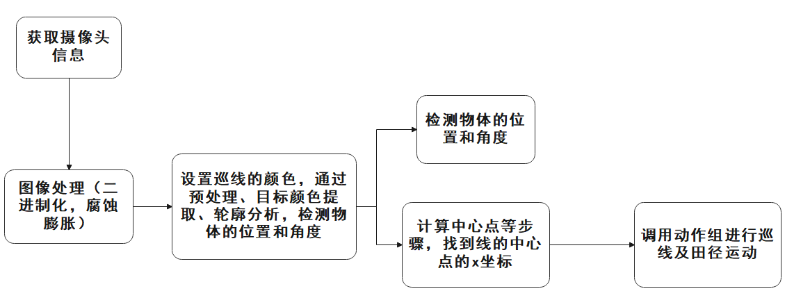

通过摄像头获取图像信息，再进行图像处理，即对图像进行二值化处理。同时为了降低干扰，令图像更平滑，对图像进行腐蚀和膨胀处理。

接着在color_identify函数中，根据面积最大的轮廓计算出颜色块的位置和角度信息。根据最大轮廓的顶点信息，计算出物体的左边界x坐标、右边界x坐标、中心点y坐标和角度。

然后根据目标位置和角度信息，控制机器人的移动和调整，使其朝向目标并实现田径运动。

- #### 4.6.3 程序逻辑及对应的代码分析

从程序文件梳理得到程序逻辑流程图如下图所示。

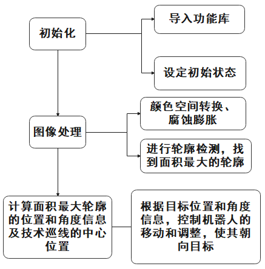

从上图得到，程序的逻辑流程主要为图像处理与跨栏运动，以下的文档内容将依照上述程序逻辑流程图进行编写。

1. **初始化**

- **导入功能库**

在初始化的这一步，首先就需要将功能库导入进来，方便后续程序的调用，关于导入进来的内容。可以前往[导入参数模块](#anchor_4_6_1)进行查看。

```py
#!/usr/bin/python3
# coding=utf8
import os
import sys
import cv2
import time
import math
import threading
import numpy as np
import hiwonder.ros_robot_controller_sdk as rrc
from hiwonder.Controller import Controller
import hiwonder.Misc as Misc
import hiwonder.PID as PID
import hiwonder.ActionGroupControl as AGC
import hiwonder.yaml_handle as yaml_handle
```

- **设定初始状态**

设置初始状态，这里就包括了舵机的初始位置、颜色的阈值等。

```py
# 初始位置
def initMove():
    ctl.set_pwm_servo_pulse(1,servo_data['servo1'],500)
    ctl.set_pwm_servo_pulse(2,servo_data['servo2'],500)
```

2. **图像处理**

- **图像预处理**

对图像进行尺寸调整与高斯模糊处理

```py
img_resize = cv2.resize(img, (size[0], size[1]), interpolation = cv2.INTER_CUBIC)
GaussianBlur_img = cv2.GaussianBlur(img_resize, (3, 3), 0)#高斯模糊
```

cv2.resize(img_copy, size, interpolation=cv2.INTER_NEAREST) 是对图像进行尺寸调整的操作。

第一个参数"**img_copy**"是要调整尺寸的图像；

第二个参数"**size\[0\],size\[1\]**"是目标尺寸；

第三个参数"**interpolation**"是插值方法，用于确定调整尺寸时使用的像素插值算法。

**cv2.GaussianBlur(frame_resize, (3, 3), 0)** 是对图像应用高斯模糊

第一个参数"**frame_resize**"是要进行模糊处理的图像；

第二个参数"**(3, 3)**"高斯核的大小，表示核的宽度和高度都为 3；

第三个参数"**0**"是高斯核的标准差，用于控制模糊程度。较大的值会产生更强的模糊效果。

- **颜色空间转换**

将BGR图像转换为LAB图像

```py
frame_lab = cv2.cvtColor(GaussianBlur_img, cv2.COLOR_BGR2LAB) #将图像转换到LAB空间
```

- **二值化处理**

采用cv2库中的inRange()函数对图像进行二值化处理。

```py
frame_mask = cv2.inRange(frame_lab,
                         (lab_data[target_color]['min'][0],
                          lab_data[target_color]['min'][1],
                          lab_data[target_color]['min'][2]),
                         (lab_data[target_color]['max'][0],
                          lab_data[target_color]['max'][1],
                          lab_data[target_color]['max'][2]))  #对原图像和掩模进行位运算    
```

第一个参数"**frame_lab**"是输入图像；

第二个参数"**lab_data\[i\]\['min'\]\[0\]**"是阈值下限；

第三个参数"**lab_data\[i\]\['max'\]\[0\]**"是阈值上限；

- **腐蚀与膨胀**

```py
opened = cv2.morphologyEx(frame_mask, cv2.MORPH_OPEN, np.ones((3,3),np.uint8))#开运算
closed = cv2.morphologyEx(opened, cv2.MORPH_CLOSE, np.ones((3,3),np.uint8))#闭运算
```

eroded = cv2.erode(frame_mask, cv2.getStructuringElement(cv2.MORPH_RECT, (3, 3))) 是对二值化图像进行腐蚀的操作。

第一个参数"**frame_mask**"是要进行形态学运算的二值图像；

第二个参数"**cv2.getStructuringElement(cv2.MORPH_RECT, (3, 3))**"是腐蚀操作的结构元素。这里使用了大小为 (3, 3) 的矩形结构元素。

膨胀函数同理。

- **指定物品颜色获取获取角度信息及设置巡线颜色**

```py
# 巡线
line_centerx = line_patrol(img, img_copy, target_color = 'black') 

# 跨栏
if skip == 1:
    object_left_x, object_right_x, object_center_y, object_angle = color_identify(img, img_copy, target_color = 'blue')
    print('hurdles',object_left_x, object_right_x, object_center_y, object_angle)# 打印位置角度参数
```

- **获取最大面积轮廓**

完成上述的图像处理后，需要获取识别目标的轮廓，此处涉及cv2库中的findContours()函数。

```py
contours = cv2.findContours(closed, cv2.RETR_EXTERNAL, cv2.CHAIN_APPROX_NONE)[-2]
```

以代码"**contours = cv2.findContours(dilated, cv2.RETR_EXTERNAL, cv2.CHAIN_APPROX_NONE)\[-2\]**"为例：

第一个参数"**dilated**"是输入图像；

第二个参数"**cv2.RETR_EXTERNAL**"是轮廓的检索模式；

第三个参数"**cv2.CHAIN_APPROX_NONE)\[-2\]**"是轮廓的近似方法。

在获得的轮廓中寻找面积最大的轮廓，而为了避免干扰，需要设定一个最小值，仅当面积大于该值时，目标轮廓才有效。

```py
areaMax_contour = getAreaMaxContour(contours, area_min=50)[0] #找到最大的轮廓
```

- **检测到跨栏,进行位置微调**

```py
while True:
    if switch:
        if object_center_y >= 300:  #检测到台阶或者跨栏,进行位置微调
```

通过不断循环来监测机器人的运行状态(robot_is_running)和物体的位置信息(object_center_y)。如果检测到跨栏（object_center_y \>= 300），则根据物体的位置和角度信息进行位置微调和动作控制。

- **如果离栏杆比较远，快速靠近**

```py
if object_center_y < 320 and abs(object_x - centreX) < 150: #离栏杆比较远，快速靠近
    AGC.runActionGroup(go_forward)
    time.sleep(0.2)
```

如果离栏杆比较远，调用前进动作组快速靠近。

- **根据物体位置和角度进行位置微调、巡线和执行跨栏或上下台阶等动作。**

```py
if 20 <= object_angle < 90:
    AGC.runActionGroup(go_turn_right)
    time.sleep(0.2)           
elif -20 >= object_angle > -90:
    AGC.runActionGroup(go_turn_left)
    time.sleep(0.2)

elif line_centerx - x_center > 15:
    AGC.runAction(right_move)
elif line_centerx - x_center < -15:
    AGC.runAction(left_move)

elif 3 < object_angle < 20:
    AGC.runActionGroup(turn_right)
    time.sleep(0.2)           
elif -5 > object_angle > -20:
    AGC.runActionGroup(turn_left)
    time.sleep(0.2)

elif 300 <= object_center_y < 420:    #在中心
    AGC.runActionGroup(go_forward_one_step)
    time.sleep(0.2)

elif object_center_y >= 430: #位置靠近，可以跨栏或者上下台阶
    time.sleep(0.5)
    if object_center_y >= 430:
        board.set_buzzer(1900, 0.1, 0.9, 1)
        AGC.runActionGroup(go_forward_one_step) #前进一步
        time.sleep(0.5)
        AGC.runActionGroup(go_forward_one_step) #前进一步
        time.sleep(0.5)

        if items == 'hurdles':# 跨栏

            AGC.runActionGroup('hurdles')
            skip_st = True
            strp_up = True
            items = None
        elif items == 'stairway':
            if strp_up: # 上台阶
                AGC.runActionGroup('climb_stairs')
                strp_up = False
            else: # 下台阶
                AGC.runActionGroup(go_forward_one_step)
                time.sleep(0.2)
                AGC.runActionGroup('down_floor')
                strp_up = True
                items = None
                skip_st = True
                time.sleep(0.5)
                object_center_y = -1
```

-  如果物体角度在20到90度之间，执行 go_turn_right 的动作组，并延时0.2秒。

-  如果物体角度在-20到-90度之间，执行名为 go_turn_left 的动作组，并延时0.2秒。

-  如果线的中心X坐标与中心X坐标之差大于15，执行 right_move 的动作。

- 如果线的中心X坐标与中心X坐标之差小于-15，执行 left_move 的动作。

-  如果物体角度在3到20度之间，执行 turn_right 的动作组，并延时0.2秒。

-  如果物体角度在-5到-20度之间，执行 turn_left 的动作组，并延时0.2秒。

-  如果物体中心Y坐标在300到420之间，执行 go_forward_one_step 的动作组，并延时0.2秒。

-  如果物体中心Y坐标大于等于430，表示位置靠近，可以跨栏或上下台阶：

-  延时0.5秒。

- 如果物体中心Y坐标仍然大于等于430，设置蜂鸣器发出声音。并执行 go_forward_one_step 的动作组，前进一步，延时0.5秒。

- 如果 items 变量的值是 'hurdles'，表示是跨栏类型：执行 'hurdles' 的动作组。

- 然后设置 skip_st 和 strp_up 变量为真。将 items 变量设为 None。

- 如果 items 变量的值是 'stairway'，表示是上下台阶类型：

- 如果 strp_up 变量为真，表示上台阶类型：执行名为 'climb_stairs' 的动作组。

- 将 strp_up 变量设为假。否则，表示下台阶类型：执行 go_forward_one_step 的动作组，前进一步。

- 延时0.2秒。

- 执行 'down_floor' 的动作组。

- 将 strp_up 变量设为真。将 items 变量设为 None。将 skip_st 变量设为真。

- 延时0.5秒。

- 将物体的中心Y坐标设为-1。
 
<p style="margin-top:30px"></p>

- **巡线**

```py
elif line_st and line_centerx != 8888: #巡线
    if abs(line_centerx - x_center) <= 20:
        AGC.runAction(go_forward)
        time.sleep(0.2)
    elif line_centerx - x_center > 20:
        AGC.runAction(go_turn_right)
        time.sleep(0.2)
    elif line_centerx - x_center < -20:
        AGC.runAction(go_turn_left)
        time.sleep(0.2)
    else:
        time.sleep(0.01)
    else:
        time.sleep(0.01)
    else:
        time.sleep(0.01)
```

- 如果 line_st 变量为真，并且线的中心X坐标不等于8888，表示进行巡线：

- 如果线的中心X坐标与中心X坐标之差小于等于20，执行 go_forward （前进）的动作，并延时0.2秒。

- 如果线的中心X坐标与中心X坐标之差大于20，执行 go_turn_right（右转） 的动作，并延时0.2秒。

- 如果线的中心X坐标与中心X坐标之差小于-20，执行 go_turn_left（左转） 的动作，并延时0.2秒。

- 否则，延时0.01秒。

