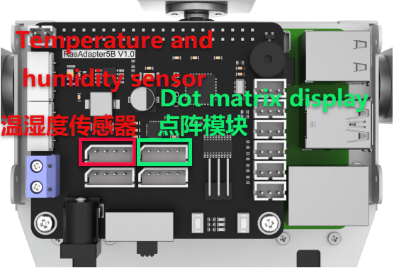

# 10. Sensor Development Basics Courses

## 10.1 Fan Module

### 10.1.1 Getting Ready

Prepare a fan module and connect it to GPIO pins 7 and 8 on the Raspberry Pi expansion board using a 4-Pin cable. The wiring should appear as shown in the diagram below.


:::{Note}
Please do not insert forcefully because 4PIN cable uses anti-reverse plugging design.
:::

### 10.1.2 Module Usage

No additional motor driver board is required to use the fan module. Its rotation direction and speed can be controlled programmatically. Additionally, the module is compatible with LEGO series components, enabling more creative DIY designs.

### 10.1.3 Operation Steps

(1) Click icon in the upper left corner to open a new terminal window. Then enter the following command and press Enter to navigate to the game directory.

```
cd /home/pi/TonyPi/Extend/sensor_course/sensor_example/
```

(2) Enter the command below, and then press Enter to start the game.

```
python3 fan_control.py
```

(3) If want to close this program, press **"Ctrl+C"**. You can try multiple time if fail to close.

### 10.1.4 Project Outcome

The fan starts spinning when the program runs and automatically stops when the program is closed.

### 10.1.5 Program Analysis

[Source Code](../_static/source_code/sensor_example.zip)

In this project, the fan is controlled using two GPIO ports. When one GPIO port is set to high and the other to low, the fan begins to rotate.

The source code of the program is located in: [/home/pi/TonyPi/Extend/sensor_course/sensor_example/fan_control.py](../_static/source_code/sensor_example.zip)

{lineno-start=1}
```python
#!/usr/bin/python3
# coding=utf8
# 4.拓展课程学习\7.拓展课程之传感器基础开发课程\第1课 风扇模块实验(4.Advanced Lessons\7.Sensor Development Course\Lesson1 Fan Module)
import time
import gpiod

## 初始化引脚模式(initial pin mode)
chip = gpiod.Chip("gpiochip4")
fanPin1 = chip.get_line(8)
fanPin1.request(consumer="pin1", type=gpiod.LINE_REQ_DIR_OUT)

fanPin2 = chip.get_line(7)
fanPin2.request(consumer="pin2", type=gpiod.LINE_REQ_DIR_OUT)

# initial
def init():
    start = False
    set_fan(0)
    print("Fan Control Init")
    
#fan control
def set_fan(start):
               
    if start == 1:
        ## 开启风扇, 顺时针(turn on the fan, clockwise)
        fanPin1.set_value(1)  # 设置引脚输出高电平(set pin output high voltage)
        fanPin2.set_value(0)  # 设置引脚输出低电平(set pin output low voltage)
    else:
        ## 关闭风扇(turn off the fan)
        fanPin1.set_value(0)  # 设置引脚输出低电平(set pin output low voltage)
        fanPin2.set_value(0)  # 设置引脚输出低电平(set pin output low voltage)

if __name__ == '__main__':
    while True:
        try:
            set_fan(1)
        except KeyboardInterrupt:
            set_fan(0)
            break
```

* **GPIO Pin Control**

(1) `chip.get_line(pin_number)`: Get GPIO (pin).

{lineno-start=8}
```python
chip = gpiod.Chip("gpiochip4")
fanPin1 = chip.get_line(8)
fanPin2 = chip.get_line(7)
```

(2) `fanPin1.set_value()`: Set the voltage level of GPIO pin.

{lineno-start=28}
```python
fanPin1.set_value(1)  # 设置引脚输出高电平(set pin output high voltage)
fanPin2.set_value(0)  # 设置引脚输出低电平(set pin output low voltage)
```

(3) In the example, the encoding method used is digital logic level encoding.

(4) High level (usually 1) and low level (usually 0).

(5) In the code, the `fanPin1.set_value()` functions is used to set the logic level state of the GPIO line.

(6) `fanPin1.set_value(1)`: Set No.8 GPIO pin to high voltage level

(7) `fanPin2.set_value(0)`: Set No.7 GPIO pin to low voltage level

(8) `fanPin1.set_value(0)`: Set No.8 GPIO pin to low voltage level

(9) `fanPin2.set_value(0)`: Set No.7 GPIO pin to low voltage level

{lineno-start=32}
```python
fanPin1.set_value(0)  # 设置引脚输出低电平(set pin output low voltage)
fanPin2.set_value(0)  # 设置引脚输出低电平(set pin output low voltage)
```

## 10.2 Touch Sensor

### 10.2.1 Preparation

Prepare a touch sensor and connect it to the GPIO21 and GPIO22 ports on the Raspberry Pi expansion board using a 4-Pin cable. The wiring should appear as shown in the figure below.


:::{Note}
Do not insert the 4-pin cable with force. It features an anti-reverse design to prevent incorrect connections.
:::

### 10.2.2 Module Usage

The touch sensor operates based on the principle of capacitive sensing. When a human body or metal touches the sensor's gold-plated contact surface, the sensor detects the contact. Additionally, the sensor can sense touches through materials like plastic or paper of certain thicknesses. The sensitivity depends on the size of the contact area and the thickness of the covering material.

This sensor is ideal for switch control applications, such as light switches or doorbell buttons. Moreover, it is compatible with the LEGO series, enabling more creative DIY designs.

### 10.2.3 Operation Steps

(1) Click in the upper left corner to open the terminal. Enter command and press Enter to go to the directory of game.

```
cd /home/pi/TonyPi/Extend/sensor_course/sensor_example/
```

(2) Enter the command below, and then press Enter to start the game.

```
python3 touch_buzzer.py
```

(3) If you want to close this program, press **"Ctrl+C"**. You can try multiple time if fail to close.

### 10.2.4 Project Outcome

After the program starts, touch the sensor's metal plate. The buzzer will sound once upon detecting the touch.

### 10.2.5 Working Principle

[Source Code](../_static/source_code/sensor_example.zip)

When the sensor detects a touch, it outputs a high level; otherwise, it outputs a low level. You can determine the sensor's current status by monitoring the I/O port's level changes.

The program source code is located at: [/home/pi/TonyPi/Extend/sensor_course/sensor_example/touch_buzzer.py](../_static/source_code/sensor_example.zip)

{lineno-start=1}
```python
#!/usr/bin/python3
# coding=utf8
# 4.拓展课程学习\7.拓展课程之传感器基础开发课程\第2课 触摸传感器实验(4.Advanced Lessons\7.Sensor Development Course\Lesson2 Touch Sensor Module)
import os
import sys
import time
import gpiod
import hiwonder.ros_robot_controller_sdk as rrc


board = rrc.Board()
    
st = 0

chip = gpiod.Chip('gpiochip4')
touch = chip.get_line(22)
touch.request(consumer="touch", type=gpiod.LINE_REQ_DIR_IN, flags=gpiod.LINE_REQ_FLAG_BIAS_PULL_UP)

if __name__ == '__main__':
    while True:
        state = touch.get_value()   #读取引脚数字值(read pin numerical value)
        if not state:
            if st :            #这里做一个判断，防止反复响(make a judgement to prevent repeated ringing here)
                st = 0
                board.set_buzzer(1900, 0.1, 0.9, 1) # 以1900Hz的频率，持续响0.1秒，关闭0.9秒，重复1次(at a frequency of 1900Hz, sound for 0.1 seconds, then pause for 0.9 seconds, repeat once)
        else:
            st = 1
            board.set_buzzer(1000, 0.0, 0.0, 1) # 关闭(close)

    board.set_buzzer(1000, 0.0, 0.0, 1) # 关闭(close)
```

* **Touch Detection and Control**

(1) Connect the touch sensor to GPIO pin No. 22. The sensor is controlled via `gpiochip4`, and its pin is configured as input mode.

{lineno-start=15}
```python
chip = gpiod.Chip('gpiochip4')
touch = chip.get_line(22)
touch.request(consumer="touch", type=gpiod.LINE_REQ_DIR_IN, flags=gpiod.LINE_REQ_FLAG_BIAS_PULL_UP)
```

(2) Initialize an `rrc.Board()` object and a **gpiod.Chip** object.

{lineno-start=11}
```python
board = rrc.Board()
    
st = 0
```

(3) The program then enters an infinite loop to continuously monitor the touch sensor's state.

{lineno-start=19}
```python
if __name__ == '__main__':
    while True:
        state = touch.get_value()   #读取引脚数字值(read pin numerical value)
```

(4) Within the loop, the program reads the digital value of the pin using `touch.get_value()`, which indicates whether the sensor is currently touched. If the sensor is touched (state is low level) and the previous state was untouched (**st == 1**), the following actions occur:

{lineno-start=22}
```python
        if not state:
            if st :            #这里做一个判断，防止反复响(make a judgement to prevent repeated ringing here)
                st = 0
                board.set_buzzer(1900, 0.1, 0.9, 1) # 以1900Hz的频率，持续响0.1秒，关闭0.9秒，重复1次(at a frequency of 1900Hz, sound for 0.1 seconds, then pause for 0.9 seconds, repeat once)
```

(5) Update `st` to 0 to mark that the touch event has been handled.

(6) Use the `board.set_buzzer()` function to activate the buzzer at 1900 Hz for 0.1 seconds, followed by a 0.9-second pause, repeating once.

(7) Introduce a 1-second delay to prevent multiple triggers from the same touch event.

(8) If the sensor is not touched (state is high level), set `st` back to 1 to indicate the idle state.

{lineno-start=26}
```python
        else:
            st = 1
            board.set_buzzer(1000, 0.0, 0.0, 1) # 关闭(close)
```

(9) At the end of each loop iteration, `board.set_buzzer()` is called to turn off the buzzer, ensuring it remains silent when no touch is detected.

{lineno-start=30}
```python
    board.set_buzzer(1000, 0.0, 0.0, 1) # 关闭(close)
```

## 10.3 Temperature and Humidity Sensor

### 10.3.1 Preparation

Prepare a temperature and humidity sensor module along with a dot matrix display module. Connect both modules to the Raspberry Pi expansion board using 4-pin cables as illustrated in the diagram below.



:::{Note}
The 4-pin cable features an anti-reverse design—please do not force it in.
:::

### 10.3.2 Operation Overview

The source code for this program can be found at: [/home/pi/TonyPi/Extend/sensor_course/sensor_example/temperature_detection.py](../_static/source_code/sensor_example.zip)

The temperature and humidity sensor module (AHT10) communicates with the Raspberry Pi via the I2C interface, while the dot matrix display module connects through the GPIO interface. The sensor converts the ambient temperature and humidity into digital signals, which the control board reads and processes. The processed temperature and humidity data are then displayed on the dot matrix module.

### 10.3.3 Operation Steps

:::{Note}
The input commands are case-sensitive, and keywords can be auto-completed using the Tab key.
:::

(1) Power on the TonyPi robot and connect to the Raspberry Pi desktop remotely via VNC.

(2) Click the icon at the top-left corner of the system desktop to open the Terminator terminal.

(3) Enter the following command and press Enter to navigate to the program directory:

```
cd /home/pi/TonyPi/Extend/sensor_course/sensor_example/
```

(4) Open a new terminal window, enter the following command, and press Enter to run the program:

```
python3 temperature_detection.py
```

(5) To exit the program, press **"Ctrl+C"** in the terminal window. If the program does not close immediately, please try pressing it repeatedly.

### 10.3.4 Program Outcome

Once the program is running, the terminal will display the temperature and humidity readings from the sensor module, while the dot matrix module simultaneously shows the current temperature and humidity values.

### 10.3.5 Program Overview

[Source Code](../_static/source_code/sensor_example.zip)

* **Initialization**

{lineno-start=11}
```python
class AHT10:
    CONFIG = [0x08, 0x00]
    MEASURE = [0x33, 0x00]

    def __init__(self, bus=1, addr=0x38):
        self.bus = smbus.SMBus(bus)
        self.addr = addr
        time.sleep(0.2)
```

The sensor communicates with the Raspberry Pi via the I2C bus.

* **Retrieving Temperature and Humidity Data**

{lineno-start=20}
```python
    def getData(self):
        byte = self.bus.read_byte(self.addr)
        self.bus.write_i2c_block_data(self.addr, 0xAC, self.MEASURE)
        time.sleep(0.5)
        data = self.bus.read_i2c_block_data(self.addr, 0x00)
        temp = ((data[3] & 0x0F) << 16) | (data[4] << 8) | data[5]
        ctemp = ((temp*200) / 1048576) - 50
        hum = ((data[1] << 16) | (data[2] << 8) | data[3]) >> 4
        chum = int(hum * 100 / 1048576)
        
        return (ctemp, chum)
```

(1) `self.bus.read_byte(self.addr)`: Reads the status byte from the sensor.

(2) `self.bus.write_i2c_block_data(self.addr, 0xAC, self.MEASURE)`: Sends a measurement command to initiate data collection.

(3) `data = self.bus.read_i2c_block_data(self.addr, 0x00)`: Reads 6 bytes of measurement data from the sensor.

* **Device Setup**

{lineno-start=33}
```python
if __name__ == '__main__':
    aht10 = AHT10()
    display = TM1640(dio=22, clk=24)
    display.clear()
```

Initializes the AHT10 sensor instance (`aht10`) and the TM1640 LED display module (`display`), then clears any existing content from the display.

* **Data Display Loop**

{lineno-start=37}
```python
    while True:
        # 提取温度(extraction temperature)
        tempture = str(round(aht10.getData()[0], 1))

        # 提取出三个数字(Extract three numbers)
        num1, num2, num3 = tempture[0], tempture[1], tempture[3]

        display.display_buf = render_number(num1, num2, ".", num3)
        display.update_display()

        time.sleep(2)

        #提取湿度(Extract humidity)
        humidity = str(round(aht10.getData()[1], 1))

        # 提取出两个数字(Extract two numbers)
        num1, num2 = humidity[0], humidity[1]

        display.display_buf = render_number(num1, num2, "%", "%")
        
        time.sleep(2)
```

**Display Temperature**: The temperature is read and rounded to one decimal place. The integer and fractional digits are extracted and passed to the `render_number` function to generate the display output. The result is shown on the screen for 2 seconds.

**Display Humidity**: The humidity is read and similarly rounded. The integer digit is extracted, a percentage symbol is appended using the `render_number` function, and the result is displayed for 2 seconds.

## 10.4 Ultrasonic Sensor

### 10.4.1 Preparation

Prepare an ultrasonic sensor and connect it to any available I²C port on the Raspberry Pi expansion board using a 4-pin cable. The wiring setup is shown below:


:::{Note}
Do not force the 4-Pin cable into the connector; it is designed to prevent incorrect insertion.
:::

### 10.4.2 Module Usage

In this lesson, the distance measurement chip of the ultrasonic sensor integrates an ultrasonic transmitter, receiver, and digital signal processing circuit. The module communicates via I²C ports, allowing the measured distance to be read efficiently through I²C communication.

Additionally, the ultrasonic probe includes two integrated RGB lights. These lights not only support adjustable brightness but also allow color customization by modifying the parameters of the red (R), green (G), and blue (B) channels.

### 10.4.3 Operation Steps

(1) Click in the upper left corner to open the terminal. Enter the following command and press Enter to navigate to the directory of the game program.

```
cd /home/pi/TonyPi/Extend/sensor_course/sensor_example/
```

(2) Enter the command below, and then press Enter to start the game.

```
python3 sonar_rgbd.py
```

(3) If want to close this program, press **"Ctrl+C"**. You can try multiple time if fail to close.

### 10.4.4 Project Outcome

Once the program starts, place an obstacle in front of the ultrasonic sensor. The terminal will display the measured distance, and the RGB light will illuminate in a color corresponding to that distance. The color-distance mapping is as follows:

Distance < 100 mm: Red  
100 mm ≤ Distance < 150 mm: Green  
150 mm ≤ Distance < 200 mm: Blue  
Distance ≥ 200 mm: White

### 10.4.5 Function Extension

* **Modify the Measured Distance**

We can adjust the distance ranges that correspond to each RGB light color. For example, you can change the range for the blue light from **"150.0 < distance ≤ 200.0"** to **"150.0 < distance ≤ 250.0"**, and update the range for the white light from **"distance > 200"** to **"distance > 250"**. Please follow the steps below to make these modifications:

(1) Launch a terminal, and then enter the following command to come to the directory of the game programmings.

```
cd /home/pi/TonyPi/Extend/sensor_course/sensor_example/
```

(2) Enter the following command, and then press Enter to start the game.

```
vim sonar_rgbd.py
```

(3) Find the code shown in the figure below.


(4) Press **"i"** key on keyboard to enter the edit mode.

(5) Modify data as the figure shown below:


(6) After modification, press **"Esc"** and enter **":wq"** (please note that the colon is in front of wq), and then press Enter to save the modified content.

```
:wq
```

* **Customize RGB Color**

Similarly, we can change the RGB light color. Take changing the color of RGB light from white to orange as example. The specific operation step is as follow:

(1) Please refer to **"Modify the Measured Distance"** to open game program file.

(2) Find the code as the figure shown below in the opening interface.


(3) Modify the value of RGB to change the light color. `setRGB(1,(255,255,255))` and `setRGB(0,(255,255,255))` are modified to `setRGB(1,(255, 127,0))` and `setRGB(0,(255, 127,0))`, as the figure shown below:


RGB value refers to the red, green and blue components in a certain color. Theoretically, the three primary colors which are red, green and blue can be mixed in different proportion to make any color. The closer of the RGB value of a color, the closer it is to gray or black and white, and the larger the value, the whiter it is, and vice verse, the darker it is.

For example, the value of B is the largest in RGB (150, 152, 183), which means the color contains more blue color, so it can be identified as a grayish blue.

(4) After modification, press **"Esc"** and enter **":wq"** (please note that the colon is in front of wq), and then press Enter to save the modified content.

```
:wq
```

### 10.4.6 Program Analysis

[Source Code](../_static/source_code/sensor_example.zip)

Firstly, set the distance measurement. Then control the on and off of the RGB light by changing the high and low levels. Finally, control the displayed light color by changing the value of each color component.

The source code of program is located in: [/home/pi/TonyPi/Extend/sensor_course/sensor_example/sonar_rgbd.py](../_static/source_code/sensor_example.zip)

{lineno-start=1}
```python
#!/usr/bin/python3
# coding=utf8
# 4.拓展课程学习\7.拓展课程之传感器基础开发课程\第4课 超声波模块实验(4.Advanced Lessons\7.Sensor Development Course\Lesson4 Ultrasonic Module)
import os
import sys
import time
import hiwonder.Sonar as Sonar

if sys.version_info.major == 2:
    print('Please run this program with python3!')
    sys.exit(0)

s = Sonar.Sonar()
s.setRGBMode(0)    #设置灯的模式，0为彩灯模式，1为呼吸灯模式(set the light mode, 0 is color light mode, 1 is breathing light mode)
s.setRGB(1, (35,205,55))
s.setRGB(0, (235,205,55))
s.startSymphony()

if __name__ == "__main__":
    while True:
        time.sleep(1)
        if s.getDistance() != 99999:
            print("Distance:", s.getDistance() , "mm")
            distance = s.getDistance()
            
            if 0.0 <= distance <= 100.0:
                s.setRGBMode(0)
                s.setRGB(1, (255,0,0))  #两边RGB设置为红色(set both RGB to red)
                s.setRGB(0, (255,0,0))
                
            if 100.0 < distance <= 150.0:
                s.setRGBMode(0)
                s.setRGB(1, (0,255,0))  #两边RGB设置为绿色(set both RGB to green)
                s.setRGB(0, (0,255,0))
                
            if 150.0 < distance <= 200.0:
                s.setRGBMode(0)
                s.setRGB(1, (0,0,255))  #两边RGB设置为蓝色(set both RGB to blue)
                s.setRGB(0, (0,0,255))
                
            if distance > 200.0:
                s.setRGBMode(0)      
                s.setRGB(1, (255,255,255)) # 两边RGB设置为白色(set both RGB to white)
                s.setRGB(0, (255,255,255))
```

* **Sensor Initialization and Control**

(1) The `Sonar` module is imported first, and a `Sonar.Sonar` object is created to control the ultrasonic sensor and RGB light.

{lineno-start=15}
```python
s = Sonar.Sonar()
s.setRGBMode(0)    #设置灯的模式，0为彩灯模式，1为呼吸灯模式(set the light mode, 0 is color light mode, 1 is breathing light mode)
s.setRGB(1, (35,205,55))
s.setRGB(0, (235,205,55))
s.startSymphony()
```

(2) The **setRGBMode()** function is used to set the mode of the light to color light mode (0), and the **setRGB()** function is used to set the colors of the two lights. Specifically, `setRGB(1, (35,205,55))` sets the first light to green, and the second light to yellow.

(3) The `startSymphony()` function is used to start the mode.

(4) In the main loop, the program executes every 1 second.

{lineno-start=21}
```python
        time.sleep(1)
        if s.getDistance() != 99999:
            print("Distance:", s.getDistance() , "mm")
            distance = s.getDistance()
```

(5) Get distance and process: By calling the `getDistance()` function, obtain the distance measured by the ultrasonic sensor and store it in the `distance` variable.

(6) Set the color of the lights based on the distance: Use the `setRGB()` function to set the colors of the two lights based on the distance measurement and the following conditional statements.

(7) If the distance is between 0.0 and 100.0, set the colors of the two lights to red.

{lineno-start=28}
```python
            if 0.0 <= distance <= 100.0:
                s.setRGBMode(0)
                s.setRGB(1, (255,0,0))  #两边RGB设置为红色(set both RGB to red)
                s.setRGB(0, (255,0,0))
```

(8) If the distance is between 100.0 and 150.0, set the colors of the two lights to green.

{lineno-start=33}
```python
            if 100.0 < distance <= 150.0:
                s.setRGBMode(0)
                s.setRGB(1, (0,255,0))  #两边RGB设置为绿色(set both RGB to green)
                s.setRGB(0, (0,255,0))
```

(9) If the distance is between 150.0 and 200.0, set the colors of the two lights to blue.

{lineno-start=38}
```python
            if 150.0 < distance <= 200.0:
                s.setRGBMode(0)
                s.setRGB(1, (0,0,255))  #两边RGB设置为蓝色(set both RGB to blue)
                s.setRGB(0, (0,0,255))
```

(10) If the distance is greater than 200.0, set the colors of the two lights to white.

{lineno-start=43}
```python
            if distance > 200.0:
                s.setRGBMode(0)      
                s.setRGB(1, (255,255,255)) # 两边RGB设置为白色(set both RGB to white)
                s.setRGB(0, (255,255,255))
```

## 10.5 Dot Matrix Module

### 10.5.1 Preparation

Prepare a dot matrix module and connect it to any available GPIO port on the Raspberry Pi expansion board using a 4-Pin cable. The wiring setup is shown below:


:::{Note}
Avoid applying force when inserting the 4-pin cable—its anti-reverse design ensures correct orientation.
:::

### 10.5.2 Module Usage

The dot matrix module used in this lesson is composed of two red 8×8 LED dot matrix screens. The dot matrix screen can be controlled by driving the control chip. It features high display brightness, no flash during display and simple wiring, and can display number, text, pattern and other contents.


### 10.5.3 Operation Steps

(1) Open the terminal and input the following command. Press Enter to come to the directory of the game program.

```
cd /home/pi/TonyPi/Extend/sensor_course/sensor_example/
```

(2) Enter the following command, and then press Enter to start the game.

```
python3 lattice_display.py
```

(3) If want to close this program, press **"Ctrl+C"**. You can try multiple time if fail to close.

### 10.5.4 Project Outcome

After the program is started, the dot matrix screen will display the text **"Hello"**. When the program is closed, the screen will turn off completely.

### 10.5.5 Function Extension

The default content displayed in this section of the program is **"Hello"** in dot matrix. If you want to modify the displayed text, for example, changing it to **"Love"**, you can follow these steps:

Before making modifications, we need to obtain the address symbols of the letters in the dot matrix display. Here, we can use modulus software to obtain them.

(1) Double-click to open the modulus software located in the same directory as this section.


(2) First, click on **"New Image"**, then in the popup settings box, set the size parameters of the dot matrix module to **"16*8"**. Once set, click **"OK"** to confirm.


(3) Click **"Simulated Animation"** and **"Enlarge Grid Points"** in turn to enlarge the dot matrix simulation area on the right side.


(4) Next, use the mouse to click and draw the displayed content in the right area.


(5) After finishing the drawing, click on **"Modulation Mode"** and then **"51 Format"** in turn to obtain the address symbols.


(6) Open terminal and input the following command. Press Enter to locate to the content of the game program.

```
cd /home/pi/TonyPi/Extend/sensor_course/sensor_example/
```

(7) Input the command below and press Enter to open game program file.

```
vim lattice_display.py
```

(8) Locate the following code in the interface.


(9) Press **"i"** key on the keyboard to proceed to the edition mode.

(10) Replace the default address symbols in the program with the address symbols obtained from the modulus software, as shown in the following image:


(11) After completing the modifications, press the **"Esc"** key once, then type **":wq"** (note the colon before wq), and press Enter to save the changes.

```
:wq
```

### 10.5.6 Working Principle

[Source Code](../_static/source_code/sensor_example.zip)

In this project, we control the display module of the dot matrix module through a set of hexadecimal data. A set of data contains 16 data in total, and each data control one column of the LED screen.

The source code of program is located in: [/home/pi/TonyPi/Extend/sensor_course/sensor_example/lattice_display.py](../_static/source_code/sensor_example.zip)

{lineno-start=1}
```python
#!/usr/bin/python3
# coding=utf8
# 4.拓展课程学习\7.拓展课程之传感器基础开发课程\第5课 点阵模块实验(4.Advanced Lessons\7.Sensor Development Course\Lesson5 Dot Matrix Module)
import time
from hiwonder import dot_matrix_sensor

dms = dot_matrix_sensor.TM1640(dio=7, clk=8)
if __name__ == "__main__":

    while True:
        try:
            dms.display_buf=(0x7f, 0x08, 0x7f, 0x00, 0x7c, 0x54, 0x5c, 0x00,
                              0x7c, 0x40, 0x00,0x7c, 0x40, 0x38, 0x44, 0x38)
            dms.update_display()
            time.sleep(5)
        except KeyboardInterrupt:
            dms.display_buf = [0]*16
            dms.update_display()
            break
```

* **Display Control and Configuration**

① `dms = dot_matrix_sensor.TM1640(dio=7, clk=8)`: Creates an instance of the dot matrix sensor object named `dms`, with the data pin (**dio**) assigned to GPIO 7 and the clock pin (**clk**) to GPIO 8.

{lineno-start=7}
```python
dms = dot_matrix_sensor.TM1640(dio=7, clk=8)
```

② `dms.display_buf = (0x7f, 0x08, 0x7f, 0x00, 0x7c, 0x54, 0x5c, 0x00, 0x7c, 0x40, 0x00, 0x7c, 0x40, 0x38, 0x44, 0x38)`: Sets the display buffer with a sequence of hexadecimal values that correspond to a specific pattern to be shown on the dot matrix display.

{lineno-start=12}
```python
            dms.display_buf=(0x7f, 0x08, 0x7f, 0x00, 0x7c, 0x54, 0x5c, 0x00,
                              0x7c, 0x40, 0x00,0x7c, 0x40, 0x38, 0x44, 0x38)
```

③ `dms.update_display()`: Updates the display to reflect the contents of the current display buffer.

{lineno-start=14}
```python
            dms.update_display()
```

④ `except KeyboardInterrupt`: Captures a keyboard interrupt event (such as pressing Ctrl+C) to allow the program to exit cleanly.

{lineno-start=16}
```python
        except KeyboardInterrupt:
            dms.display_buf = [0]*16
            dms.update_display()
            break
```

⑤ `dms.display_buf = [0]*16`: Clears the display buffer by setting all 16 positions to 0.

⑥ `dms.update_display()`: Refreshes the display to show the cleared (blank) screen.

## 10.6 Light Sensor

### 10.6.1 Preparation

Prepare a light sensor and connect it to any one of GPIO ports on Raspberry Pi expansion board through 4PIN cable. The wiring effect is as follow:


:::{Note}
Please do not insert forcefully because 4PIN cable uses anti-reverse plugging design.
:::

### 10.6.2 Module Usage

The light sensor mainly includes a QTH23C (photodiode) and LM358chi (voltage comparator).

We can set a threshold by adjusting the potentiometer on sensor. When the external brightness is greater than the threshold, LED1 on module will light up and the signal terminal OUT will output a low level.

When the external brightness is less than the threshold, LED1 on module will light off and the signal terminal OUT will output a high level.

### 10.6.3 Operation Steps

(1) Click the icon on the upper left corner of the desktop to open the command line terminal.

```
cd /home/pi/TonyPi/Extend/sensor_course/sensor_example/
```

(2) Input the command below and press Enter to go to the directory of game program.

```
python3 photo_sensitive_control.py
```

(3) If want to close this program, press **"Ctrl+C"**. You can try multiple time if fail to close.

### 10.6.4 Project Outcome

After the program is started, the buzzer will sound once when the external brightness is higher than the threshold set by the light sensor.

### 10.6.5 Working Principle

[Source Code](../_static/source_code/sensor_example.zip)

When the external brightness is higher than the threshold set by the module, the signal terminal OUT outputs a low level, otherwise it output a high level. We can judge the current status of the sensor according to the level change of the signal terminal OUT.

The source code of the program is located in: [/home/pi/TonyPi/Extend/sensor_course/sensor_example/photo_sensitive_control.py](../_static/source_code/sensor_example.zip)

{lineno-start=1}
```python
#!/usr/bin/python3
# coding=utf8
# 4.拓展课程学习\7.拓展课程之传感器基础开发课程\第6课 光线传感器模块实验(4.Advanced Lessons\7.Sensor Development Course\Lesson6 Light Sensor Module)
import os
import sys
import time
import gpiod
import hiwonder.ros_robot_controller_sdk as rrc

if sys.version_info.major == 2:
    print('Please run this program with python3!')
    sys.exit(0)


board = rrc.Board()
    
st = 0

chip = gpiod.Chip('gpiochip4')
light = chip.get_line(24)
light.request(consumer="light", type=gpiod.LINE_REQ_DIR_IN, flags=gpiod.LINE_REQ_FLAG_BIAS_PULL_UP)

if __name__ == "__main__":
    while True:
        state = light.get_value()  #读取引脚数字值(read pin numerical value)
        print(state)
        if not state:
            if st :            #这里做一个判断，防止反复响(make a judgement to prevent repeated ringing here)
                st = 0
                board.set_buzzer(1900, 0.1, 0.9, 1) # 以1900Hz的频率，持续响0.1秒，关闭0.9秒，重复1次(at a frequency of 1900Hz, sound for 0.1 seconds, then pause for 0.9 seconds, repeat once)
                time.sleep(1)
                
        else:
            st = 1
            board.set_buzzer(1000, 0.0, 0.0, 1) # 关闭(close)
            
        board.set_buzzer(1000, 0.0, 0.0, 1) # 关闭(close)
```

* **Light Detection and Control Logic**

① The program initializes a variable `st` and sets its value to 0.

{lineno-start=17}
```python
st = 0
```

② It creates a GPIO object using `gpiod.Chip('gpiochip4')`, then obtains GPIO pin 7 with **get_line(7).** The pin is configured as an input using the **request()** method.

{lineno-start=19}
```python
chip = gpiod.Chip('gpiochip4')
light = chip.get_line(24)
light.request(consumer="light", type=gpiod.LINE_REQ_DIR_IN, flags=gpiod.LINE_REQ_FLAG_BIAS_PULL_UP)
```

③ The program enters an infinite loop, continuously performing the following steps:

{lineno-start=23}
```python
if __name__ == "__main__":
    while True:
        state = light.get_value()  #读取引脚数字值(read pin numerical value)
```

④ Reads the pin state using `light.get_value()` to retrieve the digital signal (0 or 1) from GPIO pin 7.

⑤ Checks the pin state: if the value is 0 (LOW) and the variable **st** is true (non-zero), it proceeds with the following actions:

{lineno-start=27}
```python
        if not state:
            if st :            #这里做一个判断，防止反复响(make a judgement to prevent repeated ringing here)
                st = 0
                board.set_buzzer(1900, 0.1, 0.9, 1) # 以1900Hz的频率，持续响0.1秒，关闭0.9秒，重复1次(at a frequency of 1900Hz, sound for 0.1 seconds, then pause for 0.9 seconds, repeat once)
                time.sleep(1)
```

⑥ Sets `st` to 0, indicating that a trigger has already been handled.

⑦ Calls `board.set_buzzer(1900, 0.1, 0.9, 1)` to activate the buzzer at 1900 Hz for 0.1 seconds, pause for 0.9 seconds, and repeat once.

⑧ Introduces a 1-second delay.

⑨ If the pin state is 1 (HIGH), it performs the following actions:

{lineno-start=33}
```python
        else:
            st = 1
            board.set_buzzer(1000, 0.0, 0.0, 1) # 关闭(close)
```

⑩ Sets `st` to 1, indicating that the pin is currently in a HIGH state.

⑪ Calls `board.set_buzzer(1000, 0.0, 0.0, 1)` to ensure the buzzer is turned off.

⑫ Regardless of the pin state, the program finally calls `board.set_buzzer(1000, 0.0, 0.0, 1)` to confirm the buzzer remains off.

{lineno-start=37}
```python
        board.set_buzzer(1000, 0.0, 0.0, 1) # 关闭(close)
```