# 语音交互及智能搬运课程

## 1. 语音控制TonyPi Pro

### 1.1 玩法简要说明

通过指定的语音词条来对机器人发出控制，机器人执行对应的动作。

语音控制是一种有效便捷的控制方式，让机器人能够"**听懂**"人类的语言，并能做出正确的反馈是我们当前人机的交互目标。

下面我们来看一下本节功能的实现流程：

首先，我们需要导入一些必要的库，例如TonyPi动作组库。接着，开启语音识别模块的功能（即ASR）对语言指令进行收集、解析。然后通过TTS技术，对收集的指令做出反馈，并运行相关动作组，从而实现语音控制的效果。

### 1.2 玩法开启及关闭

1. 将机器人开机，然后通过VNC远程连接树莓派桌面。关于VNC的安装及连接，可参考"**[1. 远程工具安装与连接]()**"。

2. 在树莓派的桌面单击左上角的的图标（如下图所示位置），或按住快捷Ctrl+Alt+T， 打开 LX 终端。

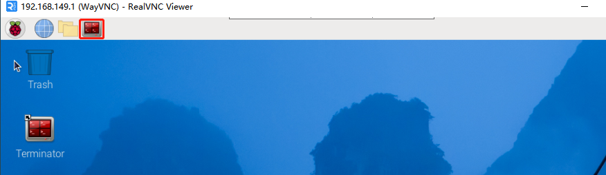

3. 输入指令，按下回车键，则定位到存放了玩法程序的目录。

```commandline
cd TonyPi/Functions/
```

4. 输入指令，然后按下回车键将玩法启动。

```commandline
python3 ASRControl.py
```

5. 如需关闭此玩法，只需要在 LX 终端界面中按下"**Ctrl+C**"。如果关闭失败，可多次按下。

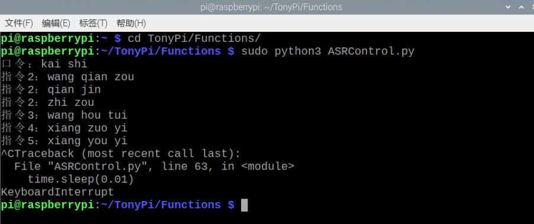

### 1.3 实现效果

靠近语音识别模块的麦克风，先说唤醒词"**开始**"。当模块上的 STA 指示灯变为蓝色常亮时，再说其它词条，例如"**qianjin（前进）**"、"**xianghoutui（向后退）**"等。

当识别到后，语音识别模块上的 STA 指示灯会熄灭，语音播报模块将播放"**收到**"的声音作为反馈，然后机器人便进行执行一次对应的动作。

动作执行完后我们可以继续说出其它词条继续操控（注意每次必须先说"**开始**"来唤醒TonyPi）。

程序内置的词条如下表所示：

| **序号** | **唤醒词**     |
|:--------:|:--------------:|
| 1        | kaishi（开始） |

<table class="docutils-nobg" border="1" style="text-align:center">
    <thead><tr><th>序号</th><th>关键字</th></tr></thead>
    <tbody>
    	<tr><td rowspan="3">2</td><td>wang qian zou（往前走）</td></tr>
        <tr><td>qian jin（前进）</td></tr>
        <tr><td>zhi zou （直走）</td></tr>
        <tr><td>3</td><td>wang hou tui（往后退）</td></tr>
        <tr><td>4</td><td>xiang zuo yi（向左移）</td></tr>
        <tr><td>5</td><td>xiang you yi（向右移）</td></tr>
    </tbody>
</table>

### 1.4 功能延伸

- #### 1.4.1 语音识别模块

**增加或修改检测词条**

**本小节以新增一个鞠躬的词条为例进行展开：**

1. 程序中内置了5个词条，词条asr.addWords(1, 'kai shi')中的第一个参数是词条的编号，词条的编号需要随着词条数量进行手动依次增加；第二个参数是词条的内容，这里需要将识别的内容以拼音的形式进行添加，汉字拼音之间以空格隔开。

例如："**ni hao**"为正确的，"**nihao**"为错误。

2. 在添加词条时，需要注意：最多可以设置50个词条识别句，词条识别句可以是单字，词组或短句，每句长度为不超过10个汉字或者79个字节的拼音串。

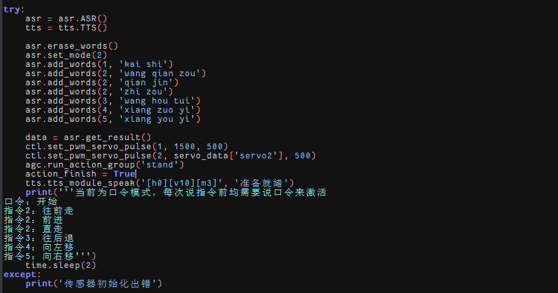

3. 如需增加或修改词条，只需按照前面词条的格式进行添加或修改就可以了。

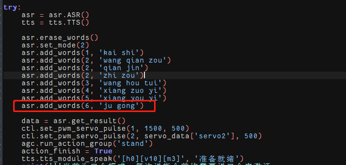

:::{Note}
这里只是增加了一个语音识别的新词条，在识别后并无任何执行动作。如需加入识别后的动作，请详细参考源码程序注释。
:::

**修改唤醒词条**

**本小节将唤醒词条修改为"准备"为例进行展开：**

1. 程序中默认为口令模式。在口令模式下，每次执行语音识别，都需要先说出唤醒的词条，再接着说出检测的词条，机器人才会执行检测词条对应的动作。

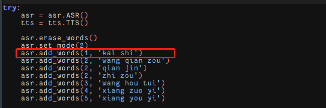

2. 程序设置词条的第一个词条作为启动语音识别的唤醒词条。

3. 如果需要修改唤醒的词条，直接将第一个词条内容修改即可。例如：我们将唤醒词修改为准备，可参考下图：

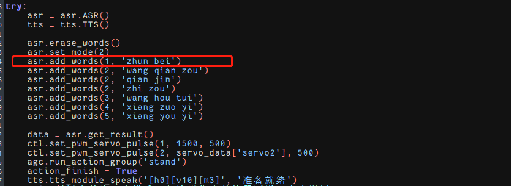

**修改识别模式**

语音识别模块支持 3 种语音识别模式，分别是循环识别模式、口令模式、按键模式。

1. 循环模式是让语音识别模块一直循环检测词条；

2. 口令模式是每次检测前，都需要说出第一个词条作为启动检测的口令，然后再说出检测的词条；

3. 按键模式是只有按下语音识别模块上的按键，才会开始检测词条；

4. 程序中默认设置为口令模式，即 asr.setMode()的值为 2。如果要修改语音识别的模式，可以在程序中如下位置进行修改：

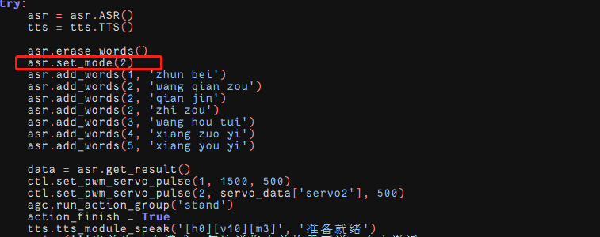

5. 如果要设置为循环模式，需要将 asr.setMode()值修改为 1；如果要设置为按键模式，需要将 asr.setMode()值修改为 3。

- #### 1.4.2 语音合成模块

**修改播放内容**

1. 程序默认播放内容是"**准备就绪**"，如下图所示：

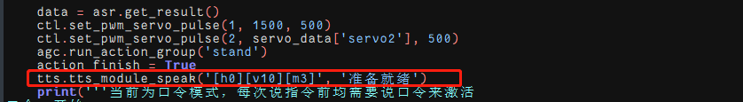

2. 如需修改播放的内容，直接修改文本的内容即可，例如我们修改为"**你好TonyPi**"，如下图所示：

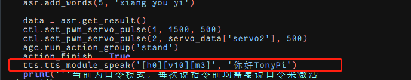

**修改播放音量**

1)  程序中默认的音量是最大音量10，如下图所示：


2)  如需修改音量，直接修改\[v10\]中的数值即可，例如我们修改为"**\[v5\]**"，如下图所示：

:::{Note}
音量范围为0-10。
:::

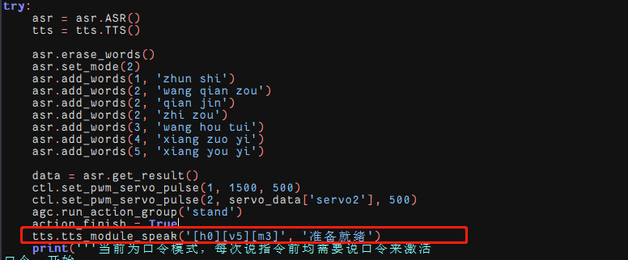

因篇幅展示受限，更多参数可参考本节所在目录附带的"**语音合成模块更多说明**"。

### 1.5 程序简要分析

该程序的源代码位于：**/home/pi/TonyPi/Functions/ASRControl.py**

- #### 1.5.1 导入参数模块

| **导入模块** | **作用** |
|:--:|:--:|
| import sys | 导入了Python的sys模块，用于访问系统相关的功能和变量 |
| from ActionGroupDict import \* | 导入Python的os模块，提供了与操作系统交互的函数和方法 |
| import hiwonder.TTS as TTS | 导入语音识别库 |
| import hiwonder.ASR as ASR | 导入语音控制库 |
| import hiwonder.Board as Board | 导入了Board模块，用机器人舵机、蜂鸣器等外设的控制 |
| import hiwonder.ActionGroupControl as AGC | 导入动作组执行库 |
| import common.yaml_handle | 包含一些与处理YAML格式文件相关的功能或工具 |

根据实现效果，梳理该玩法的实现逻辑如下图所示：

- #### 1.5.2 功能逻辑

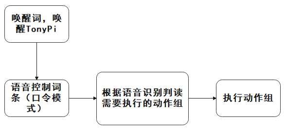

通过唤醒词，唤醒TonyPi根据语音识别词条判断需要执行的动作组，并且执行相对应的动作组。

- #### 1.5.3 程序逻辑及对应的代码分析

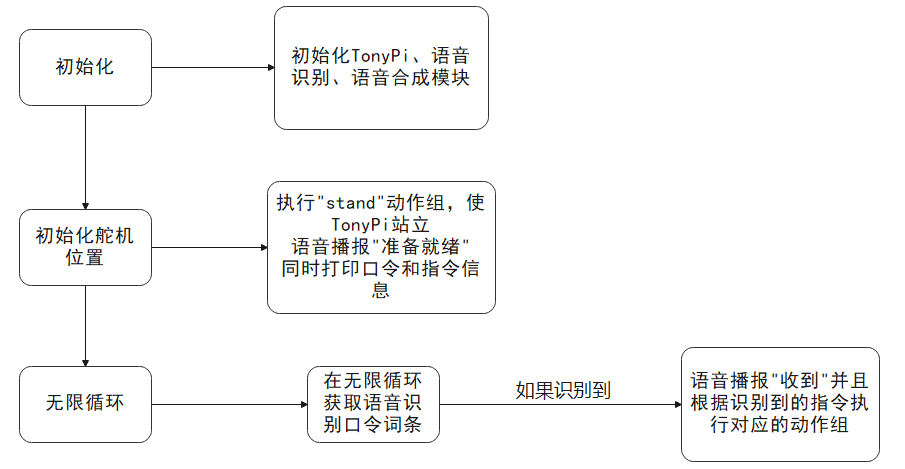

**语音识别及合成参数**

在这个玩法中，语音识别模块负责识别外界声音，语音合成模块负责输出声音，过程中涉及的主要参数如下：

1)  初始时，需设置唤醒词和控制语音，如下图所示：

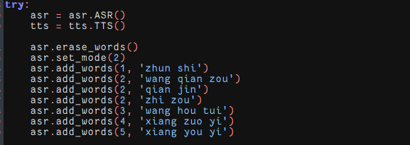

以"**asr.addWords(1, 'kai shi')**"为例：

第一个参数"**1**"是控制语音序号，1默认设置为唤醒词；

第二个参数"**'kai shi'**"是控制语音的中文拼音。

2)  通过语音合成模块发出声音，如下图所示：


第一个参数"**"\[h0\]\[v10\]\[m3\]"**"是控制发声的方法，\[h0\]设置单词发音方式，0表示自动判断单词发音方式，1表示字母发音方式，2表示单词发音方式；

\[v10\]设置音量，音量范围为0-10，10为最大音量；

:::{Note}
\[m3\]为音色，默认为女声，且不支持更改。
:::

第二个参数"**"准备就绪"**"是语音合成模块输出声音内容。

**执行动作参数**

当接收到语音信息，语音合成模块输出对应的声音，同时机器人执行对应动作，具体设置如下图所示：


设置时，语音控制指令所对应的序号，如下图所示：

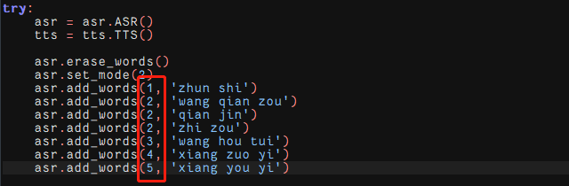

在"**ActionGroupDict.py**"代码中，同样给对应动作组编号，如下图所示：

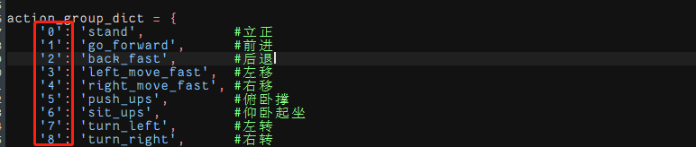

通过AGC.runActionGroup函数中"**action_group_dict\[str(data - 1)\]**"参数，设置控制语音对应序号减1，就对应运行的动作组编号。例如，控制语音为向左转移，序号为4，执行的动作组编号为3，就是"**left_move_fast.d6a**"动作组。

## 2. 颜色识别播报

### 2.1 玩法简要说明

通过机器人识别不同的颜色，语音合成模块会播报对应的名称。

TTS（文语转换技术），又称之为语音合成技术，它能够将计算机产生的、或外部输入的文字信息转变为可以听得懂的语音输出。对常见的数字、号码、时间、日期、度量符号等信息，能够根据内部的文本匹配规则进行正确的识别和处理。

本节课我们让机器人识别不同颜色，并且通过语音合成模块播报作为反馈。

首先对视觉范围内的图像进行处理，将图像转换为Lab空间，进行二值化处理，再经过膨胀腐蚀等操作，可获得只包含目标颜色的轮廓，然后将该颜色轮廓框起，便实现了物体颜色的识别。

语音合成功能支持多种文本控制标记，可以设置发音人、音量、语速、语调等参数，模拟真人发生的效果。

当获得颜色识别结果后，语音合成需对颜色的判断，根据判断结果设置不同的语音参数。然后再通过对颜色的文本数据进行处理，与语音库进行匹配，将文本转换为音素序列，再将音素序列生成语音。

最后输出结果，从而达到颜色识别播报的功能。

### 2.2 玩法开启及关闭

:::{Note}
指令的输入需严格区分大小写及空格。
:::

1)  将机器人开机，然后通过VNC远程连接树莓派桌面。关于VNC的安装及连接，可参考"**第6章 远程工具安装及连接\第1课 远程工具安装与连接**"。

2)  树莓派的桌面双击的"**Terminator**"图标，打开命令行终端。

3)  输入指令 ，按下回车键 ，则定位到存放了玩法程序的目录。

```commandline
cd TonyPi/Functions/
```

4. 输入指令，然后按下 "**回车键**" 将玩法启动。

```commandline
python3 ColorDetectAndTTS.py
```

5. 如需关闭此玩法，只需要在LX终端界面中按下 "**Ctrl+C**" 。如果关闭失败，可多次按下。

### 2.3 功能实现

:::{Note}
建议在平整空旷的地面进行操作，并且每次保持仅有单个颜色物品出现在摄像头可识别范围。
:::

当听到机器人播报"**我准备好了**"的语音后，可将不同颜色的物品依次置于摄像头前。当识别到后，便会播报该颜色对应的词条，并且播报音色各不相同。

颜色与词条的关系如下表：

| **颜色** |  **词条**  |
|:--------:|:----------:|
|   红色   | 检测到红色 |
|   绿色   | 检测到绿色 |
|   蓝色   | 检测到蓝色 |

### 2.4 功能延伸

我们可以根据实际情况来修改语音播报的内容以及音量。其中音量的可调节范围为1-10，默认的音量值为10。玩法启动后，默认会播报"**我准备好了**"。

**本节我们将音量修改为5，玩法启动后的默认播报修改为"你好"为例，**具体步骤如下

1)  输入指令，按下回车键 ，则定位到存放了玩法程序的目录。

```commandline
cd TonyPi/Functions/
```

2. 输入指令，按下回车，进入编辑模式。

```commandline
vim ColorDetectAndTTS.py
```

3.  找到代码"**tts.TTSModuleSpeak('\[h0\]\[v10\]\[m3\]', '我准备好了')**"。

:::{Note}
在键盘输入代码位置序号后按下"Shift+G"键，即可直接跳转到对应位置。（本节旨在介绍快速跳转方法，故代码位置序号仅供参考，请以实际为准。）
:::

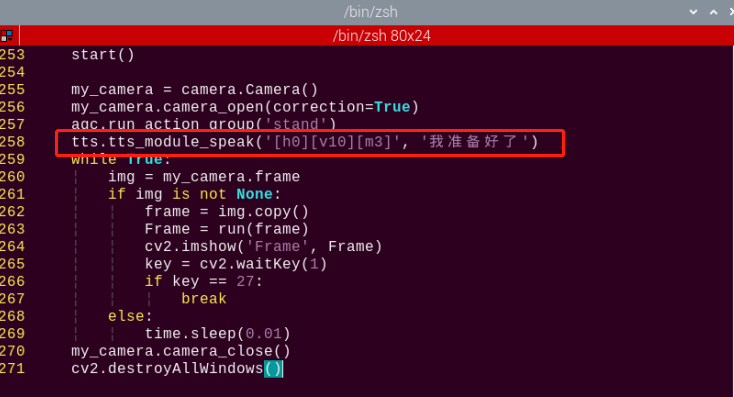

上图红框为设置语音合成的代码。其中，"**\[h0\]**"代表发音方式为自动发音，"**\[v10\]**"代表音量为10（音量范围：1-10），而"**我准备好了**"是语音播报的内容。

4)  因此我们只需修改红框中的"**\[v10\]**"和"**我准备好了**"，便可修改播报音量和播报内容。

5)  按下" **i** "进入编辑模式。

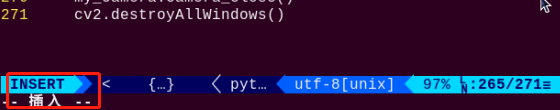

然后将音量参数改成"**\[v5\]**" 。语音播报内容修改为"你好" ，如下图所示：

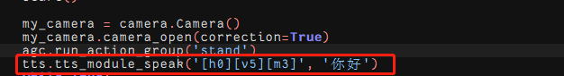

6)  最后按下"**Esc**"进入末行命令模式，再输入"**:wq**"即可保存退出。（先输入英文:，再输入wq）

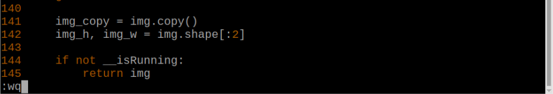

### 2.5 程序简要分析

- #### 2.5.1 导入参数模块

| **导入模块** | **作用** |
|:--:|:--:|
| import sys | 导入了Python的sys模块，用于访问系统相关的功能和变量 |
| import os | 导入Python的os模块，提供了与操作系统交互的函数和方法 |
| import cv2 | 导入了OpenCV库，用于图像处理和计算机视觉相关的功能 |
| import time | 导入了Python的time模块，用于时间相关的功能，例如延时操作 |
| import math | math模块提供了对数学运算的底层访问，包含了许多常用的数学函数和常量 |
| import threading | 提供多线程运行的环境 |
| import np | 导入NumPy库，是Python的一个开源数值计算扩展库，用于处理数组和矩阵运算 |
| import hiwonder.TTS as TTS | 导入语音识别库 |
| import hiwonder.Camera as Camera | 导入相机库 |
| from hiwonder.Misc import Misc | 导入了Misc模块，用于处理识别得到的矩形数据 |
| import hiwonder.ros_robot_controller_sdk as rrc | 导入机器人底层控制库，用于控制舵机、电机、RGB灯等硬件 |
| from hiwonder.controller import Controller | 导入了运动控制库 |
| import hiwonder.ActionGroupControl as AGC | 导入动作组执行库 |
| import common.yaml_handle | 包含一些与处理YAML格式文件相关的功能或工具 |

根据实现效果，梳理该玩法的实现逻辑如下图所示：

- #### 2.5.2 功能逻辑

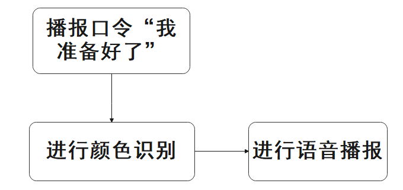

当机器人播报"我准备好之后"，开始对摄像头获取的图像进行处理，根据颜色识别的结果进行语音播报。

- #### 2.5.3 程序逻辑对应的代码分析

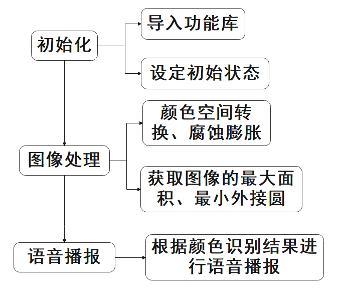

**语音合成参数**

在这个玩法中，通过语音合成模块播放声音，过程中主要涉及的参数如下：

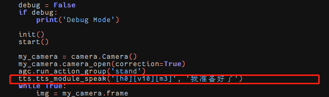

第一个参数"**"\[h0\]\[v10\]\[m3\]"**"是控制发声的方法，\[h0\]设置单词发音方式，0表示自动判断单词发音方式，1表示字母发音方式，2表示单词发音方式；\[v10\]设置音量，音量范围为0-10，10为最大音量；

:::{Note}
\[m3\]设置选择发音人，已默认为女声，无法更改。**
:::

第二个参数"**'我准备好了'**"是语音合成模块输出声音内容。

**颜色检测参数**

在这个玩法程序中，需要对物体颜色进行检测，检测过程中主要涉及的检测参数如下：

1)  在将图像转换到LAB空间前，需要对图像进行减噪处理，使用GaussianBlur()函数进行高斯滤波，如下图所示：

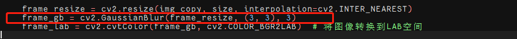

第一个参数"**frame_resize**"是输入图像；

第二个参数"**(3, 3)**"是高斯内核大小。较大的内核通常会导致更大程度的过滤，令输出图像更为模糊，且还会增加计算的复杂性；

第三个参数"**3**"是高斯函数沿X方向的标准差。在高斯滤波器中用于控制其平均值附近的变化。该数据增大，平均值周围允许的变化范围随之增大；若减小，则平均值周围允许的变化范围减小。

2)  通过使用inRange函数对输入图像进行二值化处理，如下图所示：

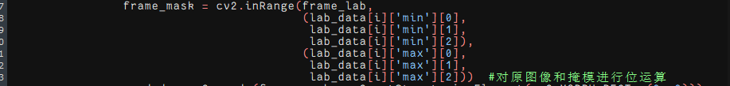

3)  为了降低干扰，让图像更加平滑，需要进行腐蚀和膨胀处理，如下图所示：

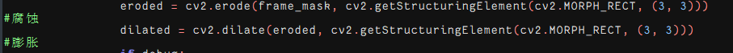

处理中使用getStructuringElement()函数，用于生成不同形态的结构元素。

第一个参数"**cv2.MORPH_RECT**"是内核形状，此处为矩形；

第二个参数"**(3, 3)**"是矩形尺寸，此处为3×3。

4)  找出物体的最大轮廓，如下图所示：

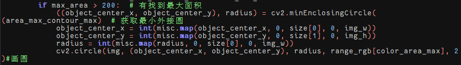

为了避免干扰，通过" **if max_area \> 200**"指令设置，只有面积大于200时，最大面积的轮廓才有效。

**颜色识别参数**

颜色识别过程中主要涉及的控制参数如下：

1)  当机器人识别到带有设置颜色小球，可以用cv2.circle()函数在回传画面内绘制圆圈，将目标物体圈出，如下图所示：

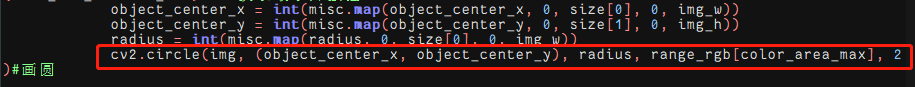

第一个参数"**img**"是输入图像，此处为识别到对应颜色小球的图像；

第二个参数"**(centerX, centerY)**"是所画圆的中心点坐标（根据检测物体决定）；

第三个参数"**radius**"是所画圆的半径（根据检测物体决定）；

第四个参数"**range_rgb\[color_area_max\]**"是所画圆的线条颜色（根据检测物体，代码中设置）；

第五个参数"**2**"是所画圆的线条宽度。

2)  在识别到颜色小球后，设置画圆的线条颜色和语音播放相关信息，如下图所示：

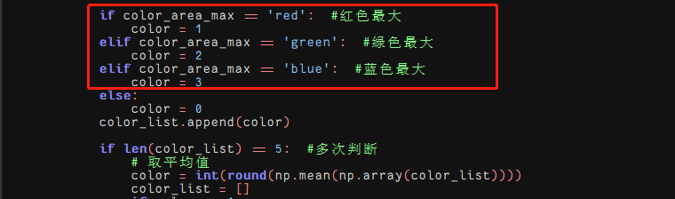

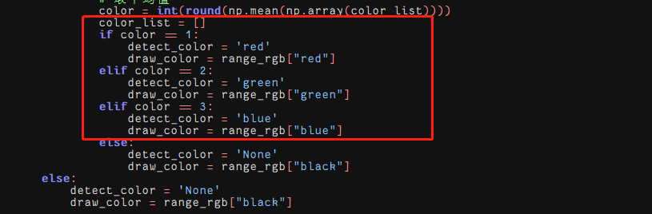

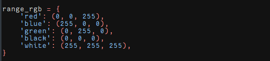

**语音播报参数**

检测到颜色小球，通过语音合成模块播报对应结果，如下图所示：

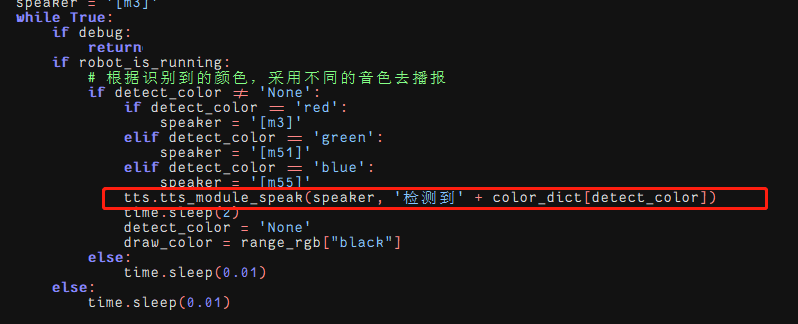

## 3. 智能搬运

### 3.1 玩法简要说明

机器人将会按照在地图上依次搬运海绵块，搬到对应的AprilTag标签位置处，直至搬运完成。

工业4.0 时代，机器人广泛应用于智能物流领域，能够实现高效率管理，提高物流行业的服务水平，从而达到降低成本，减少自然资源和社会资源消耗的目的。

我们这节课主要学习一下机器人是如何实现物品搬运的功能。主要分为两个阶段进行：识别阶段和搬运阶段。

首先是识别阶段，通过机体和云台配合，让机器人在地图上"**搜寻**"可识别物品。

当视觉范围内出现可识别的颜色后，机器人便开始对物体颜色识别进行处理。先将图像转换为Lab空间，进行二值化处理，再经过膨胀腐蚀等操作，可获得只包含程序内置颜色的轮廓，然后将该颜色轮廓框起，便实现了物体颜色的识别。

识别阶段完成后，机器人进入搬运阶段。

根据对图像反馈信息的处理，当有多个物品在视线范围内时，可对物品的距离远近进行判断。依照判断结果，优先选择搬运其中距离最近的物品。控制机体接近并在达到设定范围时将其搬起举至头顶。

同时根据物品颜色可以匹配其对应的AprilTag标签，也就是确定该物品搬运的终点位置。然后通过控制云台和机体运动，在地图上进行扫描，当扫描到标签时，依据是否为目标标签，执行不同的动作。

如果扫描到的是目标标签，则会直接搬运到目标点，然后放下物品。

如果扫描到了其它标签，则会根据扫描到的标签来判断目标标签的位置，然后控制机器人向目标转向，直到扫描到目标标签，再将搬运到目标点，放下物品。

### 3.2 玩法启动前的准备

1)  本节课我们需要在套餐附赠的地图上进行操作，首先来看下它的区域划分，主要分为两部分，其中虚线左侧是搬运终点区，右侧是物品放置区。


2)  将地图平铺在空旷平整的地面，再将机器人和三种颜色的海绵块随机放置到物品放置区域。

3)  打开机器人的开关，然后通过VNC远程连接树莓派桌面。

### 3.3 玩法开启及关闭

:::{Note}
指令的输入需严格区分大小写及空格。
:::

1)  将机器人开机，然后通过VNC远程连接树莓派桌面。关于VNC的安装及连接，可参考"**[1.远程工具安装与连接]()**"。

2)  在树莓派的桌面双击的"**Terminator**"图标，打开命令行终端。

3)  输入指令 ，按下回车键 ，则定位到存放了玩法程序的目录。

```commandline
cd TonyPi/Functions/
```

4. 输入指令，然后按下回车键将玩法启动。

```commandline
python3 Transport.py
```

5. 如需关闭此玩法，只需要在LX终端界面中按下"**Ctrl+C**"。如果关闭失败，可多次按下。

### 3.4 实现效果

:::{Note}
建议在平整空旷的地面下进行摆放地图。
:::

将机器人和红绿蓝三种颜色的海绵块随机放置到地图的放置区内。启动智能搬运玩法后，机器人将会按照距离的远近依次搬运海绵块到对应的AprilTag标签上，直至三个色块搬运完成。

### 3.5 语音搬运玩法与智能搬运玩法对比

<table class="docutils-nobg" border="1" style="text-align:center">
    <thead><tr><th>/</th><th>语音控制搬运</th><th>智能搬运</th></tr></thead>
    <tbody>
    	<tr><th rowspan="2">控制方式</th><td colspan="2">命令行启动玩法后</td></tr>
        <tr><th>语音控制</th><td>自动工作</td></tr>
        <tr><th>应用场景</th><td>安静环境(语音指令有效距离小于30cm)</td><td>嘈杂环境(无距离要求)</td></tr>
        <tr><th>工作模式</th><td>单次搬运</td><td>连续搬运</td></tr>
    </tbody>
</table>

### 3.6 程序参数说明

该程序的源代码位于：**/home/pi/TonyPi/Functions/Transport.py**

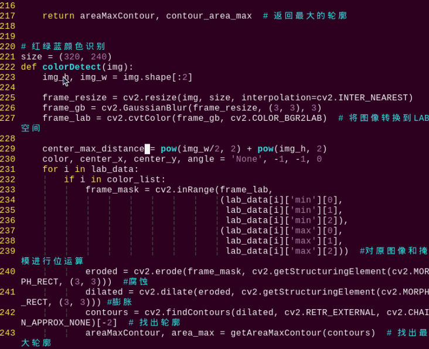

- #### 3.6.1 导入参数模块

| **导入模块** | **作用** |
|:--:|:--:|
| import sys | 导入了Python的sys模块，用于访问系统相关的功能和变量 |
| import os | 导入Python的os模块，提供了与操作系统交互的函数和方法 |
| import cv2 | 导入了OpenCV库，用于图像处理和计算机视觉相关的功能 |
| import time | 导入了Python的time模块，用于时间相关的功能，例如延时操作 |
| import math | math模块提供了对数学运算的底层访问，包含了许多常用的数学函数和常量 |
| import threading | 提供多线程运行的环境 |
| import np | 导入NumPy库，是Python的一个开源数值计算扩展库，用于处理数组和矩阵运算 |
| import hiwonder.TTS as TTS | 导入语音识别库 |
| import hiwonder.Camera as Camera | 导入相机库 |
| from hiwonder.Misc import Misc | 导入了Misc模块，用于处理识别得到的矩形数据 |
| import hiwonder.ros_robot_controller_sdk as rrc | 导入机器人底层控制库，用于控制舵机、电机、RGB灯等硬件 |
| from hiwonder.controller import Controller | 导入了运动控制库 |
| import hiwonder.ActionGroupControl as AGC | 导入动作组执行库 |
| import common.yaml_handle | 包含一些与处理YAML格式文件相关的功能或工具 |

根据实现效果，梳理该玩法的实现逻辑如下图所示：

- #### 3.6.2 功能逻辑

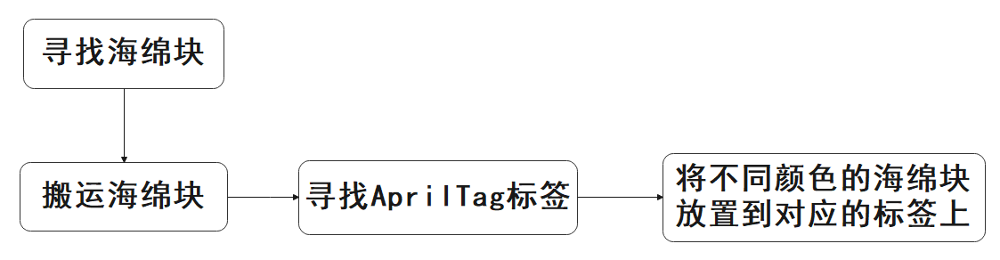

通过根据图像处理的结果寻找海绵块和标签，找到在之后控制机器人到达对应目标点进行搬运。

- #### 3.6.3 程序逻辑及对应的代码分析

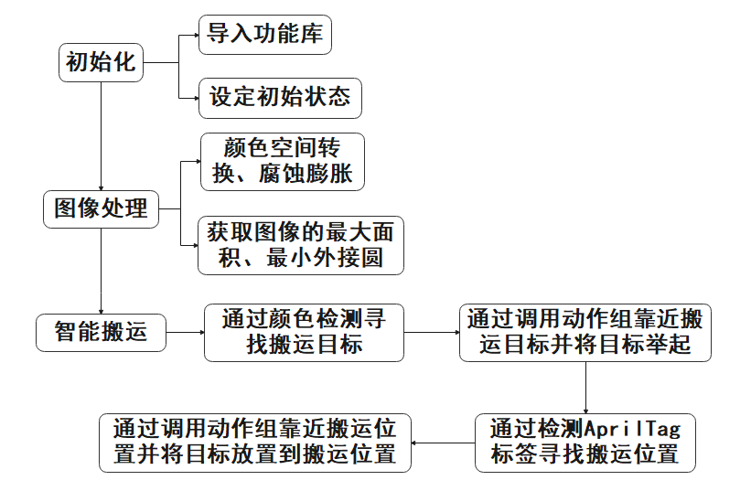

- #### 3.6.4 搬运颜色及预设位置参数

在这个玩法里，设置红绿蓝3种颜色物体，并将物体搬运到对应标签位置，如下图所示：

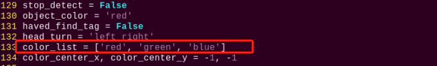

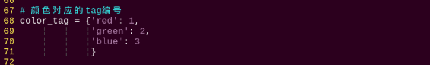

- #### 3.6.5 检测搬运物体

**检测调整**

开始时，机器人调整左右方向，找到需要搬运的物体，具体设置如下图：

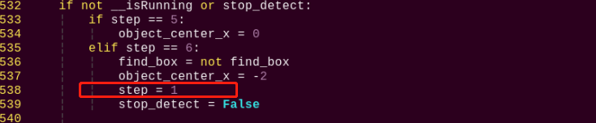

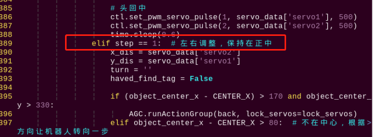

**颜色检测参数**

搬运物体时，通过检测颜色以达到检测目的，代码如下图：

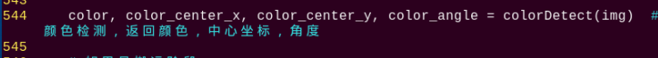

检测物体颜色过程中主要涉及的流程如下：

1)  在将图像转换到LAB空间前，需要对图像进行减噪处理，使用GaussianBlur()函数进行高斯滤波，如下图所示：

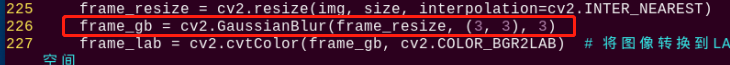

第一个参数"**frame_resize**"是输入图像；

第二个参数"**(3, 3)**"是高斯内核大小。较大的内核通常会导致更大程度的过滤，令输出图像更为模糊，且还会增加计算的复杂性；

第三个参数"**3**"是高斯函数沿X方向的标准差。在高斯滤波器中用于控制其平均值附近的变化。该数据增大，平均值周围允许的变化范围随之增大；若减小，则平均值周围允许的变化范围减小。

2)  通过使用inRange函数对输入图像进行二值化处理，如下图所示：

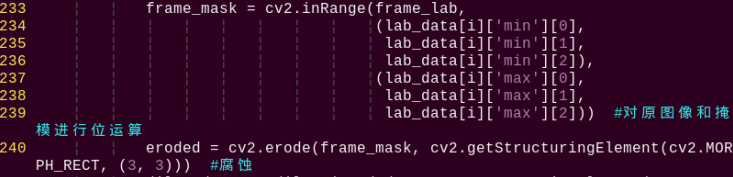

3)  为了降低干扰，让图像更加平滑，需要对图片进行腐蚀和膨胀处理，如下图所示：

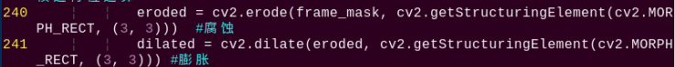

处理中使用getStructuringElement函数，用于生成不同形态的结构元素；

第一个参数"**cv2.MORPH_RECT**"是内核形状，此处为矩形；

第二个参数"**(3, 3)**"是矩形尺寸，此处为3×3。

4)  找出物体的最大轮廓，如下图所示：

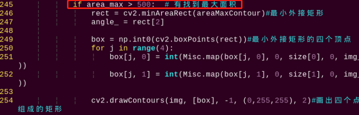

为了避免干扰，通过"**if area_max \> 500**"指令设置，只有面积大于500时，最大面积的轮廓才有效。

5)  当机器人识别到颜色物体，通过cv2.drawContours()函数来绘制颜色物体的轮廓，如下图所示：


第一个参数"**img**"是输入图像；

第二个参数" **\[box\]**"是轮廓本身，在Python中为list；

第三个参数"**-1**"是轮廓的索引，此处数值代表绘制轮廓list内的所有轮廓；

第四个参数"**(0, 255, 255)**"是轮廓颜色，其顺序为B、G、R，此处为黄色；

第五个参数"**2**"是轮廓宽度，若为"**-1**"，则代表用指定颜色填充轮廓。

6)  机器人识别到颜色物体后，同时用cv2.circle()函数在回传画面内绘制颜色物体的中心点，如下图所示：

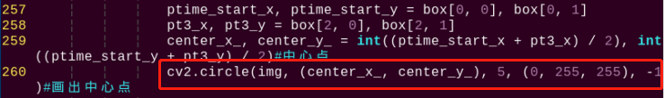

第一个参数"**img**"是输入图像，此处为识别到颜色物体的图像；

第二个参数"**(centerX, centerY)**"是所画圆的中心点坐标（根据检测物体决定）；

第三个参数"**5**"是所画圆的半径；

第四个参数"**(0, 255, 255)**"是所画圆的颜色，其顺序为B、G、R，此处为黄色；

第五个参数"**-1**"则代表用参数4中颜色填充圆，如果是数字代表所画圆的线条宽度。

- #### 3.6.6 开始搬运物体

在检测到颜色物体后，机器人开始搬运物体，可以分为靠近物体、拿起物体、找到搬运位置、搬运物体和放下物体几个步骤。

**靠近物体**

开始搬运前，首先控制机器人逐渐靠近需要搬运的物品，如下图所示：

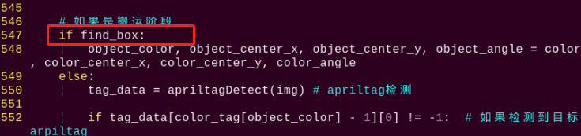

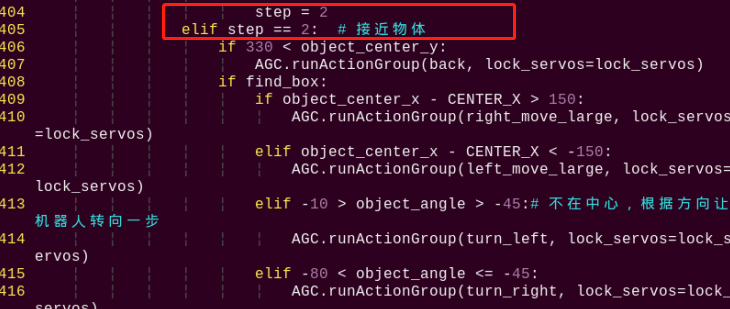

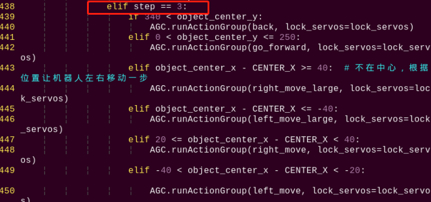

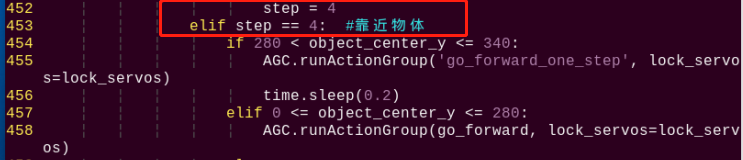

**拿起物体**

靠近物体后，控制机器人拿起需要搬运的物品，如下图所示：

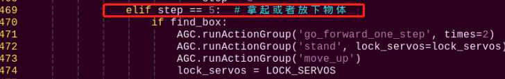

**找到搬运位置**

在搬运物体前，通过检测识别标签，找到颜色物体放置位置，如下图所示：


过程中主要涉及的控制参数如下：

1)  在获取标签码四个角点的信息后，通过cv2.drawContours()函数来绘制标签的轮廓，如下图所示：

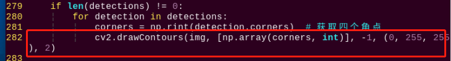

2)  机器人识别到标签后，同时用cv2.circle()函数在回传画面内绘制标签的中心点，如下图所示：


**搬运物品**

拿起物品后，将物品搬运到对应位置，如下图所示：


拿起物品后，设置"**step = 1**"，接着控制机器人左右位置调整，正面朝向标签位置，如下图所示：


再接着，逐渐设置"**step = 2**"、"**step = 3**"、"**step = 4**"控制机器人将物品搬运到标签位置，如下图所示：


搬运过程中，如果没有检测到目标标签，就通过其他标签来判断相对位置，如下图所示：


**放下物品**

搬运完成后，放下物品，如下图所示：


## 4. 语音控制搬运

### 4.1 玩法简要分析

通过设定的语音指令来控制机器人执行搬运功能，机器人将在地图上寻找并搬运对应的红色海绵块，并放置到对应的区域结束。

智能语音交互是基于语音输入的新一代交互模式，对机器人说话就可以得到反馈结果。今天这节课，我们来尝试一个新的玩法，将语音交互和智能搬运相结合，实现通过语音来控制TonyPi进行搬运的功能。

下面我们来看一下本节功能的实现流程：

首先，通过语音识别模块对语音指令进行收集并识别，再通过语音合成模块做出识别反馈。

接着，需要对颜色进行识别，我们使用Lab颜色空间来进行处理。先将RGB颜色空间转换为Lab，然后进行二值化处理，再经过膨胀腐蚀等操作，可获得只包含目标颜色的轮廓，再将该颜色轮廓用方框起，便可实现物体颜色的识别；然后进行物品的搬运。

如果在当前摄像头可视范围内搜索不到对应的物品，可控制云台进行转动，改变搜索的区域，直至找到目标物品为止。

### 4.2 玩法开启及关闭

:::{Note}
指令的输入需严格区分大小写及空格。
:::

1)  将机器人开机，然后通过VNC远程连接树莓派桌面。关于VNC的安装及连接，可参考"**[1. 远程工具安装与连接]()**"。

2)  在树莓派的桌面双击的"**Terminator**"图标，打开命令行终端。

3)  输入指令，按下回车键 ，则定位到存放了玩法程序的目录。

```commandline
cd TonyPi/Functions/
```

4.  输入指令，然后按下" 回车"键将玩法启动。

```commandline
python3 Transport_ASR.py
```

5. 如需关闭此玩法，可在 LX 终端界面中按下"**Ctrl+C**"。如果关闭失败，可多次按下。


### 4.3 实现效果

注意：为了更好的体验效果，海绵方块不宜放置的过于密集。另外建议与语音识别模块之间的距离保持在0.3-1m，若是在嘈杂环境下，请保持识别距离为0.3m左右。

程序启动之后，TonyPi机器人的头部会朝下，并反馈"**准备就绪**"的语音信息。此时，对TonyPi进行唤醒（说出唤醒词"**开始**"）。

当模块上的"**STA指示灯**"变为蓝色常亮再向机器人下达搬运指令。例如，我们说"**搬运红色**"，机器人接收后会反馈"**收到，开始寻找红色**"的语音信息，然后开始寻找并搬运红色物品，并放置到对应的AprilTag区域。

运行语音控制搬运功能涉及的指令如下表所示：

|  **时间节点**  | **下达指令** | **TonyPi反馈语音** |
| :------------: | :----------: | :----------------: |
|    玩法启动    |      /       |      准备就绪      |
|   唤醒TonyPi   |     开始     |         /          |
| 识别并搬运红色 |   搬运红色   | 收到, 开始寻找红色 |
| 识别并搬运绿色 |   搬运绿色   | 好的，开始寻找绿色 |
| 识别并搬运蓝色 |   搬运蓝色   | 收到, 开始寻找蓝色 |
|  完成单次搬运  |      /       |      搬运完成      |
|  结束搬运动作  |   停止搬运   |         /          |

### 4.4 功能延伸

- #### 4.4.1 语音识别模块

**修改唤醒词条**

**本小节我们将唤醒词修改为"准备"为例进行展示：**

1)  程序设置的默认模式为口令模式。在口令模式下，每次执行语音识别，都需要先说出唤醒的词条（默认唤醒词为"**开始**"），再接着说出其它词条，机器人才会执行检测词条对应的动作。

2)  按照前面所学，先进入玩法程序所在目录，通过输入指令进入程序内。

```commandline
vim Transport_ASR.py
```

3. 找到代码"**asr.addWords(1, 'kai shi')**"。


:::{Note}
在键盘输入代码位置序号后按下"Shift+G"键，可以直接跳转到对应位置。（本节旨在介绍快速跳转方法，故代码位置序号仅供参考，请以实际为准。）**
:::

4)  程序中设置编号为1的词条为唤醒词条，若修改了编号为1的词条内容即修改了唤醒词，如下图所示：


**修改识别模式**

语音识别模块支持 3 种语音识别模式，分别是循环识别模式、口令模式、按键模式。

- 循环模式是让语音识别模块一直循环检测词条；

- 口令模式是每次检测前，都需要说出第一个词条作为启动检测的口令，然后再说出检测的词条；

- 按键模式是只有按下语音识别模块上的按键，才会开始检测词条；

- 程序中默认设置为口令模式，即 asr.setMode()的值为 2。如果要修改语音识别的模式，可以在程序中如下位置进行修改：


- 如果要设置为循环模式，需要将 asr.setMode()值修改为 1；如果要设置为按键模式，需要将 asr.setMode()值修改为 3。

- #### 4.4.2 语音合成模块

**修改播放内容**

1)  按照前面所学，先进入玩法程序所在目录，通过输入指令。

```commandline
sudo vim Transport_ASR.py
```

2. 找到代码"**tts.TTSModuleSpeak('\[h0\]\[v10\]\[m3\]', '准备就绪')**"，程序默认播放内容是"**准备就绪**"，如下图所示：


:::{Note}
在键盘输入代码位置序号后按下"Shift+G"键，可以直接跳转到对应位置。（本节旨在介绍快速跳转方法，故代码位置序号仅供参考，请以实际为准。）
:::

3)  如需修改播放的内容，直接修改文本的内容就可以了，例如我们修改为"**你好TonyPi**"，如下图所示：


### 4.5 语音搬运玩法与智能搬运玩法对比

<table class="docutils-nobg" border="1" style="text-align:center">
<tbody>
<tr>
<td>/</td>
<td><strong>语音控制搬运</strong></td>
<td><strong>智能搬运</strong></td>
</tr>
<tr>
<td rowspan="2" ><strong>控制方式</strong></td>
<td colspan="2" >命令行启动玩法后</td>
</tr>
<tr>
<td >语音控制</td>
<td >自动工作</td>
</tr>
<tr>
<td ><strong>应用场景</strong></td>
<td >安静环境（语音指令有效距离小于30cm）</td>
<td ><p>安静环境或嘈杂环境皆可</p>
<p>（无距离要求）</p></td>
</tr>
<tr>
<td ><strong>工作模式</strong></td>
<td >单次搬运</td>
<td >连续搬运</td>
</tr>
</tbody>
</table>


### 4.6 程序简要分析

该程序的源代码位于：**/home/pi/TonyPi/Functions/Tansport_ASR.py**


- #### 4.6.1 导入参数模块

| **导入模块** | **作用** |
|:--:|:--:|
| import sys | 导入了Python的sys模块，用于访问系统相关的功能和变量 |
| import os | 导入Python的os模块，提供了与操作系统交互的函数和方法 |
| import cv2 | 导入了OpenCV库，用于图像处理和计算机视觉相关的功能 |
| import time | 导入了Python的time模块，用于时间相关的功能，例如延时操作 |
| import math | math模块提供了对数学运算的底层访问，包含了许多常用的数学函数和常量 |
| import threading | 提供多线程运行的环境 |
| import np | 导入NumPy库，是Python的一个开源数值计算扩展库，用于处理数组和矩阵运算 |
| import hiwonder.TTS as TTS | 导入语音识别库 |
| import hiwonder.ASR as ASR | 导入语音控制库 |
| import hiwonder.Camera as Camera | 导入相机库 |
| from hiwonder.Misc import Misc | 导入了Misc模块，用于处理识别得到的矩形数据 |
| import hiwonder.ros_robot_controller_sdk as rrc | 导入机器人底层控制库，用于控制舵机、电机、RGB灯等硬件 |
| from hiwonder.controller import Controller | 导入了运动控制库 |
| import hiwonder.ActionGroupControl as AGC | 导入动作组执行库 |
| import common.yaml_handle | 包含一些与处理YAML格式文件相关的功能或工具 |

根据实现效果，梳理该玩法的实现逻辑如下图所示：

- #### 4.6.2 功能逻辑


通过对摄像头获取的图像进行处理，然后根据语音指令寻找对应海绵块和标签，找到在之后控制机器人到达对应目标点进行搬运。

- #### 4.6.3 程序逻辑及对应的代码分析


- #### 4.6.4 预设放置位置

在这个玩法里，将红绿蓝3种颜色物体搬运到对应标签位置，如下图所示：


- #### 4.6.5 语音识别和语音输出参数

运行过程中，语音识别模块负责识别外界声音，语音合成模块负责输出声音，过程中涉及的主要参数如下：

1)  初始时，需设置唤醒词和控制语音，如下图所示：


以"**asr.addWords(1, 'kai shi')**"为例：

第一个参数"**1**"是控制语音序号，1默认设置为唤醒词；

第二个参数"**'kai shi'**"是控制语音的中文拼音。

2)  通过语音合成模块发出声音，如下图所示：


第一个参数"**"\[h0\]\[v10\]\[m3\]"**"是控制发声的方法，\[h0\]设置单词发音方式，0表示自动判断单词发音方式，1表示字母发音方式，2表示单词发音方式；

\[v10\]设置音量，音量范围为0-10，10为最大音量；

:::{Note}
\[m3\]为音色，默认为女声，且不支持更改。**
:::

第二个参数"**"准备就绪"**"是语音合成模块输出声音内容。

- #### 4.6.6 设置检测颜色并输出对应语音

机器人检测到唤醒词后，再通过识别到的语音控制信息，设置检测颜色，并通过语音合

成模块回复对应声音，具体设置如下图：


- #### 4.6.7 检测搬运物体

**检测调整**

开始时，机器人调整左右方向，找到需要搬运的物体，具体设置如下图：


**颜色检测参数**

检测物体时，通过检测颜色，达到检测目的，代码如下图：


检测物体颜色过程中主要涉及的检测参数如下：

1)  在将图像转换到LAB空间前，需要对图像进行减噪处理，使用GaussianBlur()函数进行高斯滤波，如下图所示：


第一个参数"**frame_resize**"是输入图像；

第二个参数"**(3, 3)**"是高斯内核大小。较大的内核通常会导致更大程度的过滤，令输出图像更为模糊，且还会增加计算的复杂性；

第三个参数"**3**"是高斯函数沿X方向的标准差。在高斯滤波器中用于控制其平均值附近的变化。该数据增大，平均值周围允许的变化范围随之增大；若减小，则平均值周围允许的变化范围减小。

2)  通过使用inRange函数对输入图像进行二值化处理，如下图所示：


3)  为了降低干扰，让图像更加平滑，需要对图片进行腐蚀和膨胀处理，如下图所示：


处理中使用getStructuringElement函数，用于生成不同形态的结构元素；

第一个参数"**cv2.MORPH_RECT**"是内核形状，此处为矩形；

第二个参数"**(3, 3)**"是矩形尺寸，此处为3×3。

4)  找出物体的最大轮廓，如下图所示：


为了避免干扰，通过"**contour_area_temp \> 10**"指令设置，只有面积大于300时，最大面积的轮廓才有效。

5)  当机器人识别到颜色物体，通过cv2.drawContours()函数来绘制颜色物体的轮廓，如下图所示：


第一个参数"**img**"是输入图像；

第二个参数" **\[box\]**"是轮廓本身，在Python中为list；

第三个参数"**-1**"是轮廓的索引，此处数值代表绘制轮廓list内的所有轮廓；

第四个参数"**(0, 255, 255)**"是轮廓颜色，其顺序为B、G、R，此处为黄色；

第五个参数"**2**"是轮廓宽度，若为"**-1**"，则代表用指定颜色填充轮廓。

6)  机器人识别到颜色物体后，同时用cv2.circle()函数在回传画面内绘制颜色物体的中心点，如下图所示：


第一个参数"**img**"是输入图像，此处为识别到颜色物体的图像；

第二个参数"**(centerX, centerY)**"是所画圆的中心点坐标（根据检测物体决定）；

第三个参数"**5**"是所画圆的半径；

第四个参数"**(0, 255, 255)**"是所画圆的颜色，其顺序为B、G、R，此处为黄色；

第五个参数"**-1**"则代表用参数4中颜色填充圆，如果是数字代表所画圆的线条宽度。

- #### 4.6.8 开始搬运物体

在检测到颜色物体后，机器人开始搬运物体，可以分为靠近物体、拿起物体、找到搬运位置、搬运物体和放下物体几个步骤。

**靠近物体**

开始搬运前，首先控制机器人逐渐靠近需要搬运的物品，如下图所示：


**拿起物体**

靠近物体后，控制机器人拿起需要搬运的物品，如下图所示：


**找到搬运位置**

在搬运物体前，通过检测识别标签，找到颜色物体放置位置，如下图所示：


过程中主要涉及的控制参数如下：

1)  在获取标签码四个角点的信息后，通过cv2.drawContours()函数来绘制标签的轮廓，如下图所示：


2)  机器人识别到标签后，同时用cv2.circle()函数在回传画面内绘制标签的中心点，如下图所示：


**搬运物品**

拿起后物品后，将品搬运到对应位置，如下图所示：


拿起物品后，设置"**step = 1**"，接着控制机器人左右调整，正面朝向标签位置，如下图所示：


再接着，逐渐设置"**step = 2**"、"**step = 3**"、"**step = 4**"控制机器人将物品搬运到标签位置，如下图所示：


搬运过程中，如果没有检测到目标标签，就通过其他标签来判断相对位置，如下图所示：


**放下物品**

搬运完成后，放下物品，如下图所示：


## 5. 物体追踪

### 5.1 玩法简要说明

机器人对颜色进行识别，机身可根据目标颜色的移动而移动。

首先，该玩法需要对颜色进行识别，我们使用Lab颜色空间来进行处理。先将RGB颜色空间转换为Lab，然后进行二值化处理，再经过膨胀腐蚀等操作，可获得只包含目标颜色的轮廓，再将该颜色轮廓用圆圈框起，便可实现物体颜色的识别。

接着，遍历算法对所有识别到的正确颜色物品进行比较，选取轮廓面积最大的物品作为目标。

最后，调用云台进行实时追踪，同时驱动机体运行动作组进行跟随动作，从而完成物体追踪功能。

### 5.2 玩法开启及关闭

:::{Note}
指令的输入需严格区分大小写及空格。
:::

1)  将机器人开机，然后通过VNC远程连接树莓派桌面。

2)  在树莓派的桌面双击的"**Terminator**"图标，打开命令行终端输入指令，按下回车则可定位到存放了玩法程序的目录。

```commandline
cd TonyPi/Functions/
```

3. 输入指令，然后按下回车将玩法启动。

```commandline
python3 Follow.py
```

4. 如需关闭此玩法，只需要在LX终端界面中按下"**Ctrl+C**"。如果关闭失败，可多次按下。

### 5.3 实现效果

程序默认识别和跟随的颜色为绿色。如需切换蓝色或红色，可参考下文 **更换默认识别的颜色** 。另外手持彩色海绵方块移动时速度不宜过快，并应满足摄像头识别的范围。

玩法开启后，手持红色海绵方块或者将方块置于可以移动的载体上进行缓慢移动，TonyPi机器人将随着目标颜色的移动而移动。

### 5.4 功能延伸

- #### 5.4.1 更换默认识别的颜色

物体追踪程序内置了三种颜色：红色、绿色以及蓝色。其中默认追踪的颜色为红色。**如果需要更换追踪的颜色，例如更换为绿色，可参考下方步骤进行：**

1)  输入指令，切换至玩法程序所在的目录。

```commandline
cd TonyPi/Functions/
```

2. 通过vi编辑器进入该玩法程序，即输入指令。

```commandline
vim Follow.py
```

3. 找到代码"**object_color = ('red',)**"。


:::{Note}
在键盘输入代码位置序号后按下"Shift+G"键，可以直接跳转到对应位置。（本节旨在介绍快速跳转方法，故代码位置序号仅供参考，请以实际为准。）
:::

4)  按下"**i**"键进入编辑模式。将"**\_\_target_color = ('red',)**"内的"**red**"直接修改为"**green**"。


5)  按下"**Esc**"进入末行命令模式，最后输入指令即可保存并退出。（先输入英文"**:**"再输入"**wq**"）

```commandline
:wq
```

- #### 增加识别颜色

除了程序内置的识别颜色，我们还可以自行设置其它的识别颜色。**例如增加橙色为可识别颜色。具体修改步骤如下：**

1.  打开VNC，输入指令，打开Lab颜色设置文件。

```commandline
vim lab_config.yaml
```

可使用截图或文件备份的方式记录初始数值。


2. 单击系统桌面调试工具图标，然后弹出的提示框内选择"**执行**"。


3. 点击左下角的"**Connect**"按钮，当摄像头回传画面出现在界面上时表示连接成功。然后在右侧方框下拉菜单里面选择"**red**"。


4.  拖动L、A、B对应的滑杆，直到左侧画面里要识别的颜色区域变为白色，其他区域变成黑色。

本节我们添加橙色为可识别颜色。将橙色物体放到摄像头视野内，然后调整L、A、B对应滑杆，直到左侧画面里橙色部分变为白色，其他颜色都变为黑色。接着点击"**red**"下方的"**Save**"按钮写入修改的数据。


为了避免对玩法造成影响，在后面修改完毕后，建议通过LAB_Tool工具将数值修改回初始值。

5.  修改完成后，我们可以检查一下修改的值是否成功被写入进去，再次输入命令，对比颜色设置参数（如下图）是否与前面修改的一致（如上图红框框住的部分）。

```commandline
vim lab_config.yaml
```


6.  当确认修改的值已经被写入配置程序中后，按下"**Esc**"键，然后输入指令，退出并保存。

```commandline
:wq
```

7.  再次启动该玩法，将橙色物品放置到摄像头前，可看到机器人会追踪橙色物体的移动进行移动。如果需要修改其他颜色作为被追踪的颜色，可参考前面的步骤进行。

### 5.5 程序简要分析

该程序的源代码位于：**/home/pi/TonyPi/Functions/Follow.py**

- #### 5.5.1 导入参数模块

| **导入模块** | **作用** |
|:--:|:--:|
| import sys | 导入了Python的sys模块，用于访问系统相关的功能和变量 |
| import os | 导入Python的os模块，提供了与操作系统交互的函数和方法 |
| import cv2 | 导入了OpenCV库，用于图像处理和计算机视觉相关的功能 |
| import time | 导入了Python的time模块，用于时间相关的功能，例如延时操作 |
| import math | math模块提供了对数学运算的底层访问，包含了许多常用的数学函数和常量 |
| import threading | 提供多线程运行的环境 |
| import np | 导入NumPy库，是Python的一个开源数值计算扩展库，用于处理数组和矩阵运算 |
| import hiwonder.TTS as TTS | 导入语音识别库 |
| import hiwonder.Camera as Camera | 导入相机库 |
| from hiwonder.Misc import Misc | 导入了Misc模块，用于处理识别得到的矩形数据 |
| import hiwonder.ros_robot_controller_sdk as rrc | 导入机器人底层控制库，用于控制舵机、电机、RGB灯等硬件 |
| from hiwonder.controller import Controller | 导入了运动控制库 |
| import hiwonder.ActionGroupControl as AGC | 导入动作组执行库 |
| import common.yaml_handle | 包含一些与处理YAML格式文件相关的功能或工具 |

根据实现效果，梳理该玩法的实现逻辑如下图所示：

- #### 5.5.2 功能逻辑


当对摄像头获取的图像进行处理，根据获取到的目标中心点坐标与画面中心点坐标的差值控制机器人进行追踪。

- #### 5.5.3 程序逻辑对应的代码分析


**颜色检测参数**

在物体追踪玩法程序中，检测的物体颜色是红色。


检测过程中主要涉及的检测参数如下：

1)  在将图像转换到LAB空间前，需要对图像进行减噪处理，使用GaussianBlur()函数进行高斯滤波，如下图所示：


第一个参数"**frame_resize**"是输入图像；

第二个参数"**(3, 3)**"是高斯内核大小。较大的内核通常会导致更大程度的过滤，令输出图像更为模糊，且还会增加计算的复杂性；

第三个参数"**3**"是高斯函数沿X方向的标准差。在高斯滤波器中用于控制其平均值附近的变化。该数据增大，平均值周围允许的变化范围随之增大；若减小，则平均值周围允许的变化范围减小。

2)  通过使用inRange函数对输入图像进行二值化处理，如下图所示：


3)  为了降低干扰，让图像更加平滑，需要对图片进行腐蚀和膨胀处理，如下图所示：


处理中使用getStructuringElement函数，用于生成不同形态的结构元素；

第一个参数"**cv2.MORPH_RECT**"是内核形状，此处为矩形；

第二个参数"**(3, 3)**"是矩形尺寸，此处为3×3。

4)  找出物体的最大轮廓，如下图所示：


为了避免干扰，通过"**if area_max_contour is not None and area_max \> 100**"指令设置，只有面积大于100时，最大面积的轮廓才有效。

**颜色识别参数**

颜色识别过程中主要涉及的控制参数如下：

1)  当机器人识别到颜色物体，通过cv2.drawContours()函数来绘制颜色物体的轮廓，如下图所示：


第一个参数"**img**"是输入图像；

第二个参数" **\[box\]**"是轮廓本身，在Python中为list；

第三个参数"**-1**"是轮廓的索引，此处数值代表绘制轮廓list内的所有轮廓；

第四个参数"**(0, 255, 255)**"是轮廓颜色，其顺序为B、G、R，此处为黄色；

第五个参数"**2**"是轮廓宽度，若为"**-1**"，则代表用指定颜色填充轮廓。

2)  机器人识别到颜色物体后，同时用cv2.circle()函数在回传画面内绘制颜色物体的中心点，如下图所示：


第一个参数"**img**"是输入图像，此处为识别到颜色物体的图像；

第二个参数"**(centerX, centerY)**"是所画圆的中心点坐标（根据检测物体决定）；

第三个参数"**5**"是所画圆的半径；

第四个参数"**(0, 255, 255)**"是所画圆的颜色，其顺序为B、G、R，此处为黄色；

第五个参数"**-1**"则代表用参数4中颜色填充圆，如果是数字代表所画圆的线条宽度。

**执行动作参数**

1)  识别到红色物体后，控制机器人的舵机1和舵机2，让机器人上摄像头随着红色的移动而移动，如下图所示：


以" **ctl.set_pwm_servo_pulse(1, vertical_servo_position,use_time\*1000)**"代码为例：

第一个参数"**1**"表示控制ID为1的舵机；

第二个参数" **vertical_servo_position**"表示控制ID为1舵机的脉冲宽度；

第三个参数" **use_time\*1000** "表示舵机的运动时间，单位为ms。

2. 识别到红色小球后，机器人调用"**/home/pi/TonyPi/ActionGroups**"文件夹中的动作组文件，控制机器人随着红色物体移动，如下图所示：


