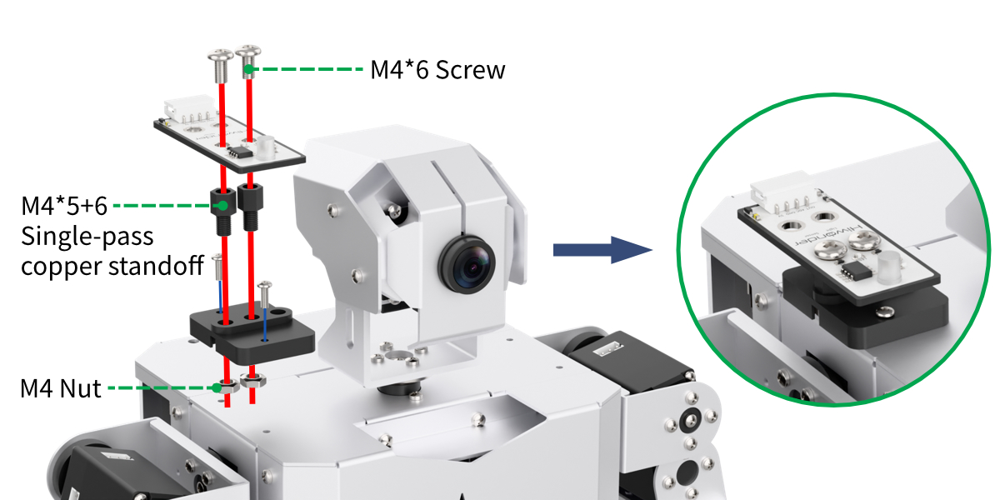
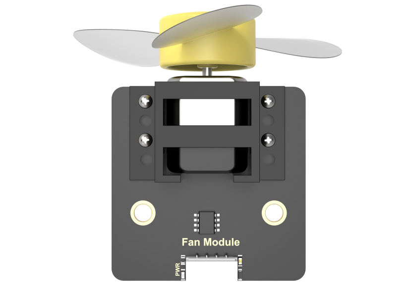

# 11. Sensor Integration and Application Development Courses

## 11.1 Face-Activated Fan

<p id="anchor_11_1_1"></p>

### 11.1.1 Assembly


### 11.1.2 Face-Activated Fan

* **Getting Ready**

Prepare a fan module and install it on the expansion hole of the robot's right arm. The specific installation method can refer to the section [**"11.1.1 Assembly"**](#anchor_11_1_1).


* **Working Principle**

Let's look at the working principle of this lesson:

Firstly, scale the screen to detect the human face. Then convert the recognized face coordinates into the coordinates before scaling, and then judge whether it is the biggest face, and frame the recognized face.

When the camera detects a face, raise the arm, align the fan with the face, and activate the fan module. If the camera cannot detect a face, deactivate the fan module, and rotate the camera's pan-tilt servo left and right to locate a face.

* **Operation Steps**

:::{Note}
The entered command must pay attention to case sensitivity and space.
:::

(1) Turn on the robot and connect to Raspberry Pi desktop with VNC.

(2) Click the icon on the upper left corner of the desktop to open the command line terminal.


(3) Enter the following command and press **"Enter"** to come to the directory of the game programmings.

```bash
cd /home/pi/TonyPi/Extend/sensor_course/sensor_development/
```

(4) Enter the command below, and then press **"Enter"** to start the game.

```bash
python3 face_track_and_fan.py
```

(5) If want to exit the game, press **"Ctrl+C"** in the LX terminal. Please try multiple times if fail to exit.

* **Project Outcome**

After the program is started, TonyPi Pro raises left arm and detects face. When the human face is detected, the fan revolves, vice verse.

* **Program Analysis**

[Source Code](../_static/source_code/sensor_development.zip)

The source code of this program is saved in: [/home/pi/TonyPi/Extend/sensor_course/sensor_development/face_track_and_fan.py](../_static/source_code/sensor_development.zip)

* **Module Parameter Import**

| **Imported Module** | **Function** |
|----|----| 
| `import sys` | Imports Python's built-in sys module to access system-specific parameters and functions. |
| `import cv2` | Imports the OpenCV library for image processing and computer vision tasks. |
| `import time` | Imports the time module for handling time-related operations such as delays. |
| `import math` | Provides access to fundamental mathematical functions and constants. |
| `import threading` | Enables multithreaded execution within the program. |
| `import np` | Imports NumPy, a powerful library for numerical operations, especially arrays and matrices. |
| `from hiwonder.PID import PID` | Imports the PID control module for implementing proportional–integral–derivative control. |
| `from hiwonder import Misc as Misc` | Imports the Misc module, used for handling recognized rectangle data. |
| `from hiwonder import Board as Board` | Imports the Board module for controlling hardware like servos and buzzers. |
| `import hiwonder.camera as camera` | Imports the camera module to interface with video input devices. |
| `import hiwonder.ActionGroupControl as AGC` | Imports the action group module for executing pre-defined robot movements. |
| `import hiwonder.yaml_handle` | Provides tools for reading and handling YAML configuration files. |

* **Functional Logic**

The system starts by capturing image data using a camera. To prepare the image for facial detection, it first converts the color space, making it easier to identify facial features.

It then uses MediaPipe's face detection model to analyze the image and detect any faces present. Once a face is recognized, the system triggers predefined action groups to respond accordingly.

* **Program Logic and Code Analysis**

(1) Initialization

① Importing Libraries

The first step in initialization is importing the necessary libraries to enable various functions throughout the program. For details on the imported modules, please refer to section 5.1.

{lineno-start=4}
```python
import sys
import cv2
import math
import time
import threading
import numpy as np
import mediapipe as mp
import gpiod
import hiwonder.ros_robot_controller_sdk as rrc
from hiwonder.Controller import Controller
import hiwonder.Misc as Misc
import hiwonder.Camera as Camera
import hiwonder.ActionGroupControl as AGC
import hiwonder.yaml_handle as yaml_handle
```

② Setting Initial States

This step involves configuring the system's default settings, including the initial position of the servos, the face detection module, and the minimum confidence level required for facial recognition.

{lineno-start=25}
```python
face = mp.solutions.face_detection
face_detection = face.FaceDetection(min_detection_confidence=0.5)
```

{lineno-start=30}
```python
servo_data = None
def load_config():
    global servo_data
    
    servo_data = yaml_handle.get_yaml_data(yaml_handle.servo_file_path)

load_config()
servo2_pulse = servo_data['servo2']

board = rrc.Board()
ctl = Controller(board)
def initMove():
    ctl.set_pwm_servo_pulse(1, 1600, 500)
    ctl.set_pwm_servo_pulse(2, servo2_pulse, 500)
```

(2) Image Processing

① Color Space Conversion

The BGR image is converted to RGB format to prepare it for face detection.

{lineno-start=135}
```python
image_rgb = cv2.cvtColor(img_copy, cv2.COLOR_BGR2RGB)
results = face_detection.process(image_rgb)
```

② Face Detection Using MediaPipe

The system uses MediaPipe's face detection model to identify faces within the frame. Once a face is detected, a bounding box is drawn around it. If the center of the detected face is aligned with the center of the image, the variable `start_greet` is set to True, which triggers the execution of a predefined action group.

{lineno-start=137}
```python
if results.detections:
    for index, detection in enumerate(results.detections):
        bboxC = detection.location_data.relative_bounding_box
        
        bbox = (int(bboxC.xmin * img_w), int(bboxC.ymin * img_h),
               int(bboxC.width * img_w), int(bboxC.height * img_h))
        cv2.rectangle(img, bbox, (0,255,0), 2)
        x, y, w, h = bbox
        center_x =  int(x + (w/2))
        if abs(center_x - img_w/2) < img_w/4:
            start_greet = True
        else:
            set_fan(0)
            start_greet = False
```

(3) Face Recognition

If no face is detected, the pan-tilt servos will rotate left and right in search of a face.  
Once a face is recognized, the `Board.setBusServoPulse` function is called to raise the robotic arm and activate the fan.

{lineno-start=86}
```python
def move():
    global start_greet, start_
    global d_pulse, servo2_pulse     
    
    while True:
        if robot_is_running:
            if start_greet:
                start_greet = False
                pulse = int(Misc.map(servo2_pulse, 1000, 2000, 600, 200))
                ctl.set_bus_servo_pulse(16,700,1500)
                time.sleep(1.5)
                if pulse < 500:
                    ctl.set_bus_servo_pulse(15,200,600)
                    ctl.set_bus_servo_pulse(14,pulse,600)
                    time.sleep(0.6)
                else:
                    ctl.set_bus_servo_pulse(15,pulse-300,600)
                    ctl.set_bus_servo_pulse(14,445,500)
                    time.sleep(0.6)
                set_fan(1)
              
            else:
                set_fan(0)
                if servo2_pulse > 2000 or servo2_pulse < 1000:
                    d_pulse = -d_pulse
                servo2_pulse += d_pulse        
                ctl.set_pwm_servo_pulse(2, servo2_pulse, 60)
                time.sleep(0.06)
        else:
            time.sleep(0.01)
```

## 11.2 Obstacle Avoidance

<p id="anchor_11_2_1"></p>

### 11.2.1 Assembly


### 11.2.2 Obstacle Avoidance

* **Getting Ready**

Prepare an ultrasonic sensor and install it on the expansion hole of robot's left hand. The specific installation method can refer to the file [**11.2.1 Assembly**](#anchor_11_2_1) under the same directory.


* **Working Principle**

Let's look at the working principle:

Firstly, the distance to the obstacle ahead is detected by the ultrasonic sensor, and then set the ultrasonic measurement threshold. When the conditions are met, the robot automatically avoids the obstacle, otherwise it moves forward directly.

* **Operation Steps**

:::{Note}
The entered command must pay attention to case sensitivity and space.
:::

(1) Turn on the robot and connect to the Raspberry Pi desktop through VNC.

(2) Click on the upper left corner of the desktop to open command line terminal. Then execute the following command to navigate to the directory containing programs.

```
cd /home/pi/TonyPi/Extend/sensor_course/sensor_development/
```

(3) Enter the command below, and then press **"Enter"** to start the game.

```
python3 sonar_barrier.py
```

(4) If want to exit the game, press **"Ctrl+C"** in the LX terminal. Please try multiple times if fail to exit.

* **Project Outcome**

After the program is started, if the distance between the ultrasonic wave and the object ahead is less than or equal to 30cm, it is determined to be an obstacle. TonyPi Pro will raise its left hand to detect whether there is an obstacle ahead. If not, the robot will move forward; If there is an obstacle, the ultrasonic sensor will detect the robot of the left and right sides to control the movement of the robot.

* **Function Extension**

The default distance of obstacle avoidance is 300mm. If want to modify the distance value (this section takes setting the distance as 100mm as example), please refer to the following steps:

(1) Enter the following command and press **"Enter"** to come to the directory of the game programs.

```
cd /home/pi/TonyPi/Extend/sensor_course/sensor_development/
```

(2) Enter the following command, then press **"Enter"** to open the game programming file.

```
vim sonar_barrier.py
```

(3) Find the code in the program interface as the figure shown below.


(4) Press **"i"** on keyboard. When **"Insert"** appears in the lower left corner, which means it has entered the editing mode.


(5) Modify **"300"** in **"if distance <= 300"** to **"100"**, as the figure shown below:


(6) After modification, press **"Esc"** and then enter **":wq"** (Please note that the colon is in front of wq). Then press **"Enter"** to save and exit the modified content.


* **Program Analysis**

[Source Code](../_static/source_code/sensor_development.zip)

The source code is saved in: [home/pi/TonyPi/Extend/sensor_course/sensor_development/sonar_barrier.py](../_static/source_code/sensor_development.zip)


* **Module Parameter Import**

| **Imported Module** | **Function** |
|----|----| 
| `import sys` | Imports Python's built-in sys module to access system-specific parameters and functions. |
| `import cv2` | Imports the OpenCV library for image processing and computer vision tasks. |
| `import time` | Imports the time module for handling time-related operations such as delays. |
| `import math` | Provides access to fundamental mathematical functions and constants. |
| `import threading` | Enables multithreaded execution within the program. |
| `import np` | Imports NumPy, a powerful library for numerical operations, especially arrays and matrices. |
| `from hiwonder.PID import PID` | Imports the PID control module for implementing proportional–integral–derivative control. |
| `from hiwonder import Misc as Misc` | Imports the Misc module, used for handling recognized rectangle data. |
| `from hiwonder import Board as Board` | Imports the Board module for controlling hardware like servos and buzzers. |
| `import hiwonder.camera as camera` | Imports the camera module to interface with video input devices. |
| `import hiwonder.ActionGroupControl as AGC` | Imports the action group module for executing pre-defined robot movements. |
| `import hiwonder.yaml_handle` | Provides tools for reading and handling YAML configuration files. |

* **Functional Logic**

The robot uses data from the ultrasonic sensor to detect obstacles and performs corresponding avoidance maneuvers based on the measured distance.

* **Program Logic and Code Analysis**

(1) Initialization

① Import Required Libraries

At the beginning of the program, all necessary libraries are imported to enable various functionalities. For a detailed list of the imported modules, please refer to Section 6.1.

{lineno-start=4}
```python
import os
import sys
import time
import threading
import numpy as np
import hiwonder.ros_robot_controller_sdk as rrc
from hiwonder.Controller import Controller
import hiwonder.Sonar as Sonar
import hiwonder.ActionGroupControl as AGC
```

② Set Initial State

The robot's initial posture is configured, including basic predefined movements to prepare for obstacle avoidance behavior.

{lineno-start=20}
```python
board = rrc.Board()
ctl = Controller(board)

def hand_up():
    ctl.set_bus_servo_pulse(8, 330, 1000)
    time.sleep(0.3)
    ctl.set_bus_servo_pulse(7,860,1000)
    ctl.set_bus_servo_pulse(6,860,1000)
    time.sleep(1)
def hand_down():
    ctl.set_bus_servo_pulse(7,800,1000)
    ctl.set_bus_servo_pulse(6,575,1000)
    time.sleep(0.3)
    ctl.set_bus_servo_pulse(8,725,1000)
    time.sleep(1)
def hand_left():
    ctl.set_bus_servo_pulse(8,330,1000)
    time.sleep(0.3)
    ctl.set_bus_servo_pulse(7,500,1000)
    ctl.set_bus_servo_pulse(6,920,1000)
    time.sleep(1)
```

Some basic actions have been set for the robot.

{lineno-start=127}
```python
AGC.runActionGroup('stand_slow')
time.sleep(1)
hand_up()
```

(2) Acquiring Ultrasonic Sensor Data

The program reads distance values from the ultrasonic sensor. To ensure stability and accuracy, it performs six consecutive readings, stores them in a list, and calculates the average value.

{lineno-start=131}
```python
while True:
    
    distance_list.append(s.getDistance())
    if len(distance_list) >= 6:
        distance = int(round(np.mean(np.array(distance_list))))
        print(distance, 'mm')
        distance_list = []
        
    time.sleep(0.01)
```

(3) Obstacle Avoidance

When an obstacle is detected in front of the robot:

① The robot first turns to the left and extends its arm.

② It then scans the distance on the left side.
- If an obstacle is also detected on the left, the robot turns to the right.
- If both sides are blocked, the robot moves backward to avoid the obstacle.

③ After avoiding the obstacle, the robot raises its arm and continues moving forward.

{lineno-start=55}
```python
while True:
    if distance != 99999:
        if distance <= 300:
            distance = 99999
            hand_left()
            time.sleep(1)
            for i in range(3):
                dist_left.append(distance)
                time.sleep(0.05)
            distance_left = round(np.mean(np.array(dist_left)))
            dist_left = []
            hand_up()
            
            if distance_left <= 300:
                distance_left = 99999
                hand_down()
                for i in range(5):
                    AGC.runActionGroup('turn_right')
                    print("turn_right")
                    time.sleep(0.2)
                    
                hand_up()
                time.sleep(1)
                for i in range(3):
                    dist_right.append(distance)
                    time.sleep(0.05)
                    
                distance_right = round(np.mean(np.array(dist_right)))
                dist_right = []
                
                if distance_right <= 300:
                    distance_right = 99999
                    hand_down()
                    for i in range(5):
                        AGC.runActionGroup('turn_left')
                        print("turn_left")
                        time.sleep(0.2)
                        
                    for i in range(5):
                        AGC.runActionGroup('back')
                        print("back")
                    hand_up()
                else:
                    AGC.runActionGroup('go_hand_up1')
                    print("go")
            else:
                hand_down()
                for i in range(5):
                    AGC.runActionGroup('turn_left')
                    print("turn_left")
                    time.sleep(0.2)
                hand_up()
        else:
            AGC.runActionGroup('go_hand_up1')
            print("go")
    else:    
        time.sleep(0.01)
```

## 11.3 Shape Recognition

<p id="anchor_11_3_1"></p>

### 11.3.1 Assembly


### 11.3.2 Shape Recognition

* **Getting Ready**

Prepare a dot matrix module and install it on the expansion hole of robot's left arm. The specific installation method can refer to the file [**"11.3.1 Assembly"**](#anchor_11_3_1) under the same directory.


* **Working Principle**

Let's look at the working principle.

The camera recognizes the object within the visual range. When the shapes of the objects are identified as triangle, rectangles and circles, the dot matrix module will display the graphics shape of the current object, otherwise the dot matrix module does not display.

* **Operation Steps**

:::{Note}
The entered command must pay attention to case sensitivity and space.
:::

(1) Turn on the robot and connect to the Raspberry Pi desktop through VNC.

(2) Click the icon on the upper left corner of the desktop to open command line terminal. Enter the following command and press **"Enter"** to come to the directory of the game programmings.

```
cd /home/pi/TonyPi/Extend/sensor_course/sensor_development/
```

(3) Enter the following command, and then press **"Enter"** to start the game.

```
python3 shape_recognition.py
```

(4) If want to exit the game, press **"Ctrl+C"** in the LX terminal. Please try multiple times if fail to exit.

* **Project Outcome**

After the program is started, the robot's camera will recognize the object. When the shape of the object is recognized as triangle, rectangle and circle, the dot matrix module will display the corresponding shape. Otherwise, it will not display.

* **Program Analysis**

[Source Code](../_static/source_code/sensor_development.zip)

The source code is saved in: [/home/pi/TonyPi/Extend/sensor_course/sensor_development/shape_recognition.py](../_static/source_code/sensor_development.zip)


* **Module Parameter Import**

| **Imported Module** | **Function** |
|----|----| 
| `import sys` | Imports Python's built-in sys module to access system-specific parameters and functions. |
| `import cv2` | Imports the OpenCV library for image processing and computer vision tasks. |
| `import time` | Imports the time module for handling time-related operations such as delays. |
| `import math` | Provides access to fundamental mathematical functions and constants. |
| `import threading` | Enables multithreaded execution within the program. |
| `import np` | Imports NumPy, a powerful library for numerical operations, especially arrays and matrices. |
| `from hiwonder.PID import PID` | Imports the PID control module for implementing proportional–integral–derivative control. |
| `from hiwonder import Misc as Misc` | Imports the Misc module, used for handling recognized rectangle data. |
| `from hiwonder import Board as Board` | Imports the Board module for controlling hardware like servos and buzzers. |
| `import hiwonder.camera as camera` | Imports the camera module to interface with video input devices. |
| `import hiwonder.ActionGroupControl as AGC` | Imports the action group module for executing pre-defined robot movements. |
| `import hiwonder.yaml_handle` | Provides tools for reading and handling YAML configuration files. |

* **Program Logic and Code Analysis**

The core functionality of this program involves image processing and dot matrix display. The following documentation is structured according to the program's logical flow diagram.

(1) Initialization

① Importing Functional Libraries

In this step, the necessary libraries are imported to enable subsequent program functionality. For more details on the imported modules, refer to section 6.1.

{lineno-start=4}
```python
import sys
import cv2
import math
import time
import signal
import threading
import numpy as np
import hiwonder.ros_robot_controller_sdk as rrc
from hiwonder.Controller import Controller
from hiwonder import dot_matrix_sensor
import hiwonder.Camera as Camera
import hiwonder.ActionGroupControl as AGC
import hiwonder.yaml_handle as yaml_handle
```

② Setting Initial State

The robot's initial position and basic configuration are established.

{lineno-start=32}
```python
def load_config():
    global lab_data, servo_data
    
    lab_data = yaml_handle.get_yaml_data(yaml_handle.lab_file_path)
    servo_data = yaml_handle.get_yaml_data(yaml_handle.servo_file_path)

board = rrc.Board()
ctl = Controller(board)

def inidmsove():
    ctl.set_pwm_servo_pulse(1, 1350, 500)
    ctl.set_pwm_servo_pulse(2, servo_data['servo2'], 500)
```

(2) Image Processing

Before converting the captured image to the LAB color space, noise reduction is performed. The image is then smoothed using the `GaussianBlur()` function. A binary mask is created with the `inRange()` function. To further minimize noise and enhance contour clarity, morphological operations such as erosion and dilation are applied. Finally, the contour with the largest area is identified.

{lineno-start=144}
```python
if action_finish:
    for i in lab_data:
        if i != 'white' and i != 'black':
            frame_mask = cv2.inRange(frame_lab,
                             (lab_data[i]['min'][0],
                              lab_data[i]['min'][1],
                              lab_data[i]['min'][2]),
                             (lab_data[i]['max'][0],
                              lab_data[i]['max'][1],
                              lab_data[i]['max'][2]))
            opened = cv2.morphologyEx(frame_mask, cv2.MORPH_OPEN, np.ones((6,6),np.uint8))
            closed = cv2.morphologyEx(opened, cv2.MORPH_CLOSE, np.ones((6,6),np.uint8))
            contours = cv2.findContours(closed, cv2.RETR_EXTERNAL, cv2.CHAIN_APPROX_NONE)[-2]
            areaMaxContour, area_max = getAreaMaxContour(contours)
            if areaMaxContour is not None:
                if area_max > max_area:
                    max_area = area_max
                    color_area_max = i
                    areaMaxContour_max = areaMaxContour
```

(3) Shape Recognition

The `cv2.approxPolyDP()` function is used to approximate contours for shape detection. The number of sides (vertices) of each identified shape is recorded into the `shape_list`. Once 30 values are collected, the program calculates and prints the average number of sides to determine the dominant shape.

{lineno-start=163}
```python
if max_area > 200:
    cv2.drawContours(img, areaMaxContour_max, -1, (0, 0, 255), 2)
    epsilon = 0.035 * cv2.arcLength(areaMaxContour_max, True)
    approx = cv2.approxPolyDP(areaMaxContour_max, epsilon, True)
    shape_list.append(len(approx))
    if len(shape_list) == 30:
        shape_length = int(round(np.mean(shape_list)))
        shape_list = []
        print(shape_length)
```

(4) Result Display

Based on the previously identified shape (`shape_length`), a conditional check is performed and the corresponding shape is displayed on the screen.

{lineno-start=65}
```python
def run():
    global shape_length
    
    while move_st:
        if shape_length == 3:
            print('三角形')
            dms.display_buf = (0x01, 0x03, 0x05, 0x09, 0x11, 0x21, 0x41, 0x81,
                              0x41, 0x21, 0x11, 0x09, 0x05, 0x03, 0x01, 0x00)
            dms.update_display()
            
        elif shape_length == 4:
            print('矩形')
            dms.display_buf = (0x00, 0x00, 0x00, 0x00, 0xff, 0x81, 0x81, 0x81,
                              0x81, 0x81, 0x81,0xff, 0x00, 0x00, 0x00, 0x00)
            dms.update_display()
            
        elif shape_length >= 6:            
            print('圆')
            dms.display_buf = (0x00, 0x00, 0x00, 0x00, 0x1c, 0x22, 0x41, 0x41,
                              0x41, 0x22, 0x1c,0x00, 0x00, 0x00, 0x00, 0x00)
            dms.update_display()
            
        else:
            dms.display_buf = [0] * 16
            dms.update_display()
            print('None')
```

## 11.4 Intelligent Fill Light

<p id="anchor_11_4_1"></p>

### 11.4.1 Assembly





### 11.4.2 Intelligent Fill Light

* **Getting Ready**

Prepare a light and an ultrasonic sensor, and then install the light sensor on the expansion hole of robot's shoulder and install the ultrasonic sensor on the expansion hole of left arm. The installation method can refer to the file [11.4.1 Assembly](#anchor_11_4_1) under the same directory.


* **Working Principle**

Let's look at the working principle:

When the vision recognition is started and the external light detected by the light sensor is dark, the ultrasonic sensor emits the white light to fill light, otherwise, the ultrasonic sensor turns off the light.

* **Operation Steps**

:::{Note}
The entered command must pay attention to case sensitivity and space.
:::

(1) Turn on the robot and connect to the Raspberry Pi desktop through VNC.

(2) Click the icon on the upper left corner of the desktop to open command line terminal. Then enter the following command and press **"Enter"** to come to the directory of the game programmings.

```
cd /home/pi/TonyPi/Extend/sensor_course/sensor_development/
```

(3) Enter the following command, and then press **"Enter"** to start the game.

```
python3 photo_sensor_demo.py
```

(4) If want to exit the game, press **"Ctrl+C"** in the LX terminal. Please try multiple times if fail to exit.

* **Project Outcome**

After the program is started, the robot raises its left hand and recognizes the label card within the visual range. When the ambient light gets dark, the buzzer will make a **"Beep"** sound. At the same time, the ultrasonic sensor will emit white light, which allows the robot to recognize the label card in dark environment.

* **Function Extension**

(1) Adjusting the Fill Light

When the ambient light gets dark, the ultrasonic module will emit white light to fill light. You can modify the light color and brightness of the ultrasonic sensor, the specific operation is as follow:

① Enter the following command and press **"Enter"** to come to the directory of the game programs.

```
cd /home/pi/TonyPi/Extend/sensor_course/sensor_development/
```

② Enter the following command to come to the program editing interface.

```
vim photo_sensor_demo.py
```

③ Find the code in the program interface as the figure shown below.


④ Press **"i"** on keyboard to enter the editing mode.


⑤ Modify **"(255,255,255)"** to **"(255,0,0)"** (the range of three parameter is 0-255), as the figure shown below:


⑥ After modification, press **"Esc"** and then enter **":wq"** (Please note that the colon is in front of wq). Then press **"Enter"** to save and exit the modified content.


⑦ Enter the following command to restart the game, and observe the effect.

```
python3 photo_sensor_demo.py
```

(2) Adjusting the Beep Duration

When this mode is activated, if the ambient light is low, the buzzer will emit a **"beep"** sound as an alert. You can change the duration of this beep by modifying the program. Follow the steps below:

① Refer to steps (1) and (2) in section **Adjusting the Fill Light** to enter the program editing interface. Locate the code section highlighted in the image below.


② Following step (4) in **Adjusting the Fill Light**, change the value **"0.1"** to **"0.3"**, as shown in the image.


③ As in step (5) of section **Adjusting the Fill Light**, save and exit the file. Then, re-run the program by entering the following command to observe the updated effect:

```
python3 photo_sensor_demo.py
```

(3) Sensitivity Adjustment

If the performance of this activity is affected due to the sensitivity of the light sensor, you can adjust it by rotating the potentiometer on the sensor. Follow these steps:

① Locate the sensitivity adjustment potentiometer. Its position on the sensor is shown in the image below:


② Use a screwdriver to gently rotate the potentiometer while observing the status of LED1. The sensor reaches its optimal sensitivity when LED1 is at the threshold between turning on and off—this indicates the sensor is responding most accurately at the current threshold setting.

* **Program Analysis**

[Source Code](../_static/source_code/sensor_development.zip)

The source code is saved in: [/home/pi/TonyPi/Extend/sensor_course/sensor_development/photo_sensor_demo.py](../_static/source_code/sensor_development.zip)


* **Module Parameter Import**

| **Imported Module** | **Function** |
|----|----| 
| `import sys` | Imports Python's built-in sys module to access system-specific parameters and functions. |
| `import cv2` | Imports the OpenCV library for image processing and computer vision tasks. |
| `import time` | Imports the time module for handling time-related operations such as delays. |
| `import math` | Provides access to fundamental mathematical functions and constants. |
| `import threading` | Enables multithreaded execution within the program. |
| `import np` | Imports NumPy, a powerful library for numerical operations, especially arrays and matrices. |
| `from hiwonder.PID import PID` | Imports the PID control module for implementing proportional–integral–derivative control. |
| `from hiwonder import Misc as Misc` | Imports the Misc module, used for handling recognized rectangle data. |
| `from hiwonder import Board as Board` | Imports the Board module for controlling hardware like servos and buzzers. |
| `import hiwonder.camera as camera` | Imports the camera module to interface with video input devices. |
| `import hiwonder.ActionGroupControl as AGC` | Imports the action group module for executing pre-defined robot movements. |
| `import hiwonder.yaml_handle` | Provides tools for reading and handling YAML configuration files. |

* **Functional Overview**

This module implements AprilTag detection and intelligent lighting compensation in low-light conditions.

* **Program Logic and Code Explanation**

(1) Initialization

① Importing Required Libraries

In this step, all necessary libraries are imported to ensure proper functionality throughout the program. For details on the imported modules, please refer to section 6.1.

{lineno-start=4}
```python
import os
import sys
import cv2
import math
import time
import threading
import numpy as np
import gpiod
import hiwonder.ros_robot_controller_sdk as rrc
from hiwonder.Controller import Controller
import hiwonder.Camera as Camera
import hiwonder.Sonar as Sonar
import hiwonder.apriltag as apriltag
import hiwonder.ActionGroupControl as AGC
import hiwonder.yaml_handle as yaml_handle
```

② Setting Initial State

The robot's initial state is configured, including default positions and parameters.

{lineno-start=29}
```python
board = rrc.Board()
ctl = Controller(board)
def initMove():
    ctl.set_pwm_servo_pulse(1, 1500, 500)
    ctl.set_pwm_servo_pulse(2, servo_data['servo2'], 500)
    AGC.runActionGroup('lift_up')
```

(2) AprilTag Detection

A function named `apriltagDetect` is defined to detect AprilTag markers within an image and return relevant tag information. 
Using the AprilTag detector on a grayscale image, the function returns a list of detected tags. Each entry includes the tag family, tag ID, and the coordinates of the tag's center point (`objective_x`, `objective_y`).

{lineno-start=77}
```python
def apriltagDetect(img):    
    gray = cv2.cvtColor(img, cv2.COLOR_BGR2GRAY)
    detections = detector.detect(gray, return_image=False)

    if len(detections) != 0:
        for detection in detections:                        
            corners = np.int0(detection.corners)
            cv2.drawContours(img, [np.array(corners, int)], -1, (0, 255, 255), 2)

            tag_family = str(detection.tag_family, encoding='utf-8')
            tag_id = int(detection.tag_id)

            objective_x, objective_y = int(detection.center[0]), int(detection.center[1])
            
            object_angle = int(math.degrees(math.atan2(corners[0][1] - corners[1][1], corners[0][0] - corners[1][0])))
            
            return [tag_family, tag_id, objective_x, objective_y]
            
    return None, None, None, None
```

(3) Intelligent Lighting Compensation

The `move` function continuously monitors the status of GPIO pin 24.

When a high signal is detected, the buzzer sounds and the RGB light turns white.

When a low signal is detected, the buzzer is turned off and the RGB light is disabled.

The variable `st` is used to prevent the buzzer from triggering repeatedly.

{lineno-start=47}
```python
def move():
    global st
    
    while True:
        state = light.get_value()
        
        if state:
            time.sleep(0.1)
            if state:
                if st :
                    st = 0
                    board.set_buzzer(1900, 0.1, 0.9, 1)
                    s.setRGB(1, (255,255,255))
                    s.setRGB(0, (255,255,255))
        else:
            if not st:
                st = 1
                s.setRGB(1, (0,0,0))
                s.setRGB(0, (0,0,0))
            
        time.sleep(0.01)
```

## 11.5 Mask Recognition

<p id="anchor_11_5_1"></p>

### 11.5.1 Assembly

### 11.5.2 Mask Recognition

* **Getting Ready**

Prepare MP3 module and install it on the expansion hole of robot's shoulder. The specific installation method can refer to the file [**"11.5.1 Assembly"**](#anchor_11_5_1) under the same directory.


* **Working Principle**

Let's look at the working principle:

Firstly, scale the screen to detect the human face. Then convert the recognized face coordinates into the coordinates before scaling, and then judge whether it is the biggest face, and frame the recognized face.

If the human face does not wear mask, AI voice interaction box will play **"no mask, please wear mask"**. If the human face is wearing a mask, AI voice interaction box will play **"Mask is on, please this way"**.

* **Operation Steps**

:::{Note}
The entered command must pay attention to case sensitivity and space.
:::

(1) Turn on the robot and connect to the Raspberry Pi desktop through VNC.

(2) Click the icon on the upper left corner of the desktop to open command line terminal. Enter the following command and press **"Enter"** to come to the directory of the game programmings.

```
cd /home/pi/TonyPi/Extend/sensor_course/sensor_development/
```

(3) Enter the command below, and then press **"Enter"** to start the game.

```
python3 mask_detect.py
```

(4) If want to exit the game, press **"Ctrl+C"** in the LX terminal. Please try multiple times if fail to exit.

* **Project Outcome**

After the program is started, TonyPi Pro starts search for the face. If the face with no mask is recognized, AI voice interaction box will play **"No mask, please wear mask"**. If the face with a mask is recognized, AI voice interaction box will play **"Wear mask, please pass"**.

* **Program Analysis**

[Source Code](../_static/source_code/sensor_development.zip)

The source code is saved in: [/home/pi/TonyPi/Extend/sensor_course/sensor_example/mask_detect.py](../_static/source_code/sensor_development.zip)

(1) Importing Functional Modules

{lineno-start=4}
```python
import os
import cv2
import sys
import time
import torch
import argparse
import numpy as np
from speech import speech
from pathlib import Path
import hiwonder.ActionGroupControl as AGC
import hiwonder.yaml_handle as yaml_handle
import hiwonder.ros_robot_controller_sdk as rrc
from hiwonder.Controller import Controller
import torch.backends.cudnn as cudnn
from utils.plots import Annotator, colors
from models.experimental import attempt_load
from utils.datasets import LoadImages, LoadStreams
from utils.torch_utils import load_classifier, select_device, time_sync
from utils.general import apply_classifier, check_img_size, check_imshow, \
     check_requirements, check_suffix, colorstr, increment_path, non_max_suppression, \
     print_args, save_one_box, scale_coords, set_logging, strip_optimizer, xyxy2xywh
```

① `torch`: Used to load the YOLOv5 model and perform inference.

② `cv2`: Used for reading images, displaying inference results, and controlling image output. 

③ `speech`: Used for playing audio files to notify users about mask-wearing status.

④ `hiwonder`: Used to control hardware components such as servos.

⑤ `time`: Provides time-related functions, including delays within the program.

(2) Inference Workflow

{lineno-start=139}
```python
for *xyxy, conf, cls in reversed(det):
    if view_img:
        c = int(cls)
        label = None if hide_labels else (names[c] if hide_conf else f'{names[c]} {conf:.2f}')
        print(label)
        if str(label[:-5]) == 'without_mask':
            if time.time()- times >= 5:
                speech.play_audio(os.path.join(code_path, 'audio', 'without_mask.wav'))
                times = time.time()
            
        elif str(label[:-5]) == 'withmask':
            if time.time()- times >= 5:
                speech.play_audio(os.path.join(code_path, 'audio', 'with_mask.wav'))
                times = time.time()
            
        annotator.box_label(xyxy, label, color=colors(c, True))
```

① YOLOv5 Inference:

The program uses PyTorch to load a pre-trained YOLOv5 model to detect whether a person is wearing a mask or not in the input image.

② Voice Prompt Based on Detection:

Based on the inference results, the program plays a corresponding voice prompt to remind the user to wear a mask or confirm that they are wearing one.

③ Playback Frequency Control:

To avoid repetitive alerts, the prompt is played once every 5 seconds when a **"no mask"** or **"mask detected"** condition is continuously observed.

## 11.6 Intelligent Temperature Control

### 11.6.1 Assembly


### 11.6.2 Intelligent Temperature Control

* **Preparation**

Connect the temperature and humidity sensor to the I2C port on the TonyPi expansion board, Then, connect the fan module to the IO7 and IO8 ports on the TonyPi expansion board:


* **Module Introduction**

(1) Temperature and Humidity Sensor

This sensor detects ambient temperature and humidity, providing accurate feedback of the measured data.


The temperature and humidity module (AHT10) converts the surrounding air's temperature and humidity into digital signals, which are transmitted to the control board via I2C communication.

(2) Fan Module

The fan module operates without the need for an additional motor driver board. It uses PWM (Pulse Width Modulation) signals to control rotation. By sending PWM pulses in two directions, the fan's rotation direction can be controlled. Additionally, adjusting the PWM duty cycle allows you to set the fan's speed.



* **Operation Steps**

:::{Note}
Commands must be entered with exact case sensitivity and spacing.
:::

(1) Power on the TonyPi and connect to the Raspberry Pi desktop remotely via VNC.

(2) On the Raspberry Pi desktop, double-click the **"Terminator"** icon to open the command terminal.

(3) Enter the command to navigate to the game directory:

```
cd TonyPi/Extend/sensor_course/sensor_development
```

(4) Open a new terminal window and enter the command to start the game:

```
python3 temperature_control.py
```

(5) To stop the game, press **Ctrl+C** in the LX terminal. If it does not stop immediately, press **Ctrl+C** multiple times until it closes.

* **Program Outcome**

Once the program starts, the temperature and humidity sensor will begin monitoring the surrounding environment and display the readings on the terminal. When the temperature exceeds 20°C, the fan module will automatically turn on; otherwise, it will turn off.


* **Program Analysis**

[Source Code](../_static/source_code/sensor_development.zip)

The source code is saved in: [/home/pi/TonyPi/Extend/sensor_course/sensor_example/temperature_detection.py](../_static/source_code/sensor_development.zip)

(1) Importing Modules

{lineno-start=5}
```python
import smbus
import gpiod
import time
```

Use import statements to load the required modules:

① `smbus`: For communicating with I2C devices, enabling data read/write operations.

② `gpiod`: For controlling GPIO pins, used to operate hardware devices like the fan.

③ `time`: Provides time-related functions for delays in the program.

(2) Sensor Data Acquisition and Processing

① Sensor Class Definition

{lineno-start=9}
```python
class AHT10:
    CONFIG = [0x08, 0x00]
    MEASURE = [0x33, 0x00]
```

Define the AHT10 class to retrieve data from the AHT10 sensor.

Class attributes:
- `CONFIG`: Configuration parameter set to [0x08, 0x00]
- `MEASURE`: Measurement command parameter set to [0x33, 0x00]

② Initialization Method `__init__`

{lineno-start=13}
```python
def __init__(self, bus=1, addr=0x38):
    self.bus = smbus.SMBus(bus)
    self.addr = addr
    time.sleep(0.2)
```

- Initialize the `smbus.SMBus` object for I2C communication with the AHT10 sensor.
- Store the sensor's I2C address.
- Delay for 0.2 seconds to ensure sensor initialization.

③ Data Acquisition Method `getData`

{lineno-start=18}
```python
def getData(self):
    self.bus.write_i2c_block_data(self.addr, 0xAC, self.MEASURE)
    time.sleep(0.5)

    data = self.bus.read_i2c_block_data(self.addr, 0x00, 6)
    
    temp = ((data[3] & 0x0F) << 16) | (data[4] << 8) | data[5]
    ctemp = ((temp * 200) / 1048576) - 50
    
    hum = ((data[1] << 16) | (data[2] << 8) | data[3]) >> 4
    chum = int(hum * 100 / 1048576)
    
    return (ctemp, chum)
```

- Read one byte of data initially.
- Send the measurement command to the sensor.
- Delay for 0.5 seconds to allow the sensor to complete the measurement.
- Read the returned data from the sensor.
- Process the data to calculate temperature and humidity values.
- Return the calculated temperature and humidity.

④ GPIO Pin Initialization

{lineno-start=41}
```python
chip = gpiod.Chip("gpiochip4")
fanPin1 = chip.get_line(8)
fanPin1.request(consumer="pin1", type=gpiod.LINE_REQ_DIR_OUT)

fanPin2 = chip.get_line(7)
fanPin2.request(consumer="pin2", type=gpiod.LINE_REQ_DIR_OUT)
```

- Initialize the GPIO chip `gpiochip4`.
- Acquire pins 8 and 7 and set them as outputs to control the two fan pins.

⑤ Fan Control Function

{lineno-start=49}
```python
def set_fan(start):
    if start == 1:
        fanPin1.set_value(1)
        fanPin2.set_value(0)
    else:
        fanPin1.set_value(0)
        fanPin2.set_value(0)
```

Define the function `set_fan` to control the fan's on/off state.

If the input parameter `start` equals 1, turn on the fan by setting pin 8 to HIGH and pin 7 to LOW.

If `start` is not 1, turn off the fan by setting both pins 8 and 7 to LOW.

(3) Temperature Control Logic

{lineno-start=59}
```python
count = 0
while True:
    try:
        temp, hum = aht10.getData()
        t = int(temp)
        print(f"温度: {t}°C, 湿度: {hum}%")
        if t > 20:
            count += 1
            if count > 5:
                set_fan(1)
                count = 0
        else:
            count = 0
            set_fan(0)
    except KeyboardInterrupt:
        set_fan(0)
        break
```

① Initialize a counter `count` to 0.

② Enter an infinite loop to continuously read temperature data from the sensor.

③ If the temperature exceeds 20°C, increment the counter by 1. When the counter exceeds 5, turn on the fan and reset the counter to 0.

④ If the temperature is less than or equal to 20°C, reset the counter to 0 and turn off the fan.