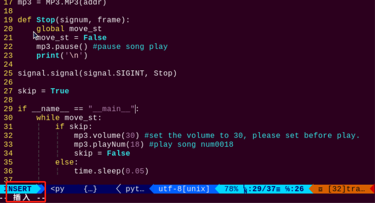

# 传感器基础开发课程

## 1. 风扇模块实验

### 1.1 准备工作

准备一个风扇模块，并通过4PIN线将其连接至树莓派扩展板上的**GPIO7、8**，接线效果如下图所示：


:::{Note}
4PIN线采用防反插设计，切勿硬塞。
:::

### 1.2 使用模块

使用这款风扇模块时，无需额外的电机驱动板，我们可以通过程序调节风扇的方向和转速。此外，传感器板载了乐高兼容孔位，可进行更多创意DIY设计。

### 1.3 玩法开启及关闭

1)  点击桌面左上角的图标，打开命令行终端。输入指令，按下回车，进入玩法程序所在目录。

```commandline
cd /home/pi/TonyPi/Extend/sensor_course/sensor_example/
```

2. 输入指令，按下回车，运行玩法程序。

```commandline
python3 fan_control.py
```

3. 如需关闭此程序，可按下"**Ctrl+C**"，若关闭失败，可重复按下。

### 1.4 功能实现

程序运行后，风扇开始转动；当程序关闭时，风扇停止转动。

### 1.5 程序简要分析

在实验中，我们通过2个GPIO口控制风扇转动。将1个GPIO口设置为高电平，另一个设置为低电平时，风扇开始转动。将2个GPIO口都设置为低电平时，风扇停止转动。

该程序的源代码位于： **/home/pi/TonyPi/Extend/sensor_course/sensor_example/fan_control.py**

1.  chip.get_line(pin_number)：用于获取GPIO（引脚）。

2.  fanPin1.set_value()：用于设置GPIO引脚的电平状态。

3.  在例程中，使用的编码方式是数字逻辑电平编码，高电平（通常为1）低电平（通常为0）

4.  在代码中，使用了 fanPin1.set_value()函数来设置GPIO线路的电平状态：

5.  fanPin1.set_value(1)：将第8号GPIO引脚设置为高电平。

6.  fanPin2.set_value(0)：将第7号GPIO引脚设置为低电平。

7.  fanPin1.set_value(0)：将第8号GPIO引脚设置为低电平。

8.  fanPin2.set_value(0)：将第7号GPIO引脚设置为低电平。

## 2. 触摸传感器实验

### 2.1 准备工作

准备一个触摸传感器，并通过4PIN线将其连接至树莓派扩展板上的**GPIO22**接口，接线效果如下图所示：


:::{Note}
4PIN线采用防反插设计，切勿硬塞。
:::

### 2.2 使用模块

触摸传感器是一款基于电容感应原理的触摸传感器，人体或金属触碰传感器上的镀金接触面时，传感器会有所感应；此外，隔着一定厚度的塑料、纸张等材料的接触也可以被传感器所感应到，且感应的灵敏度与接触面的大小和覆盖材料的厚度有关。

这个传感器可应用于设备的开关控制，比如控制开关灯、门铃触摸按键等。传感器板载了乐高兼容孔位，可进行更多创意DIY设计。

### 2.3 玩法开启及关闭

1)  点击桌面左上角的图标，打开命令行终端。输入指令，按下回车，进入玩法程序所在目录。

```commandline
cd /home/pi/TonyPi/Extend/sensor_course/sensor_example/
```

2)  输入指令，按下回车，运行玩法程序。

```commandline
python3 touch_buzzer.py
```

3)  如需关闭此程序，可按下"**Ctrl+C**"，若关闭失败，可多次按下。

### 2.4 功能实现

程序运行后，触碰传感器的金属片，当感应到后，蜂鸣器会短鸣一次。

### 2.5 程序简要分析

当感应到触摸时，传感器会输出高电平，否则输出低电平。我们可以通过I/O口的电平变化来判断传感器当前的状态。

该程序的源代码位于：**/home/pi/TonyPi/Extend/sensor_course/sensor_example/touch_buzzer.py**

1. 使用了一个GPIO引脚（22号引脚）连接触摸传感器，触摸传感器通过（gpiochip4）进行控制。触摸传感器的引脚配置为输入模式。

2. 初始化了一个rrc.Board()对象和一个gpiod.Chip对象。

3. 接着程序进入一个无限循环，不断检测触摸传感器的状态。

4. 然后通过touch.get_value()读取引脚的数字值，判断触摸传感器当前是否被触摸，如果触摸传感器被触摸（状态为低电平），且之前的状态为非触摸状态（st为1），则执行以下操作：

5. 将st设置为0，表示触摸状态已经被处理。

6. 使用board.set_buzzer()函数控制板上的蜂鸣器发出声音。该函数配置蜂鸣器为1900Hz的频率，持续响0.1秒，然后关闭0.9秒，重复1次。

7. 延时1秒钟，以防止触摸信号的反复响应。

8. 如果触摸传感器未被触摸（状态为高电平），则将st设置为1，表示触摸状态。

9. 在每次循环的末尾，使用board.set_buzzer()函数将蜂鸣器关闭，以确保蜂鸣器在非触摸状态下保持关闭。

## 3. MP3模块实验

### 3.1 准备工作

准备一个MP3模块，并通过4PIN线将其连接至树莓派扩展板上的任意一个**IIC**接口，接线效果如下图所示：


:::{Note}
4PIN线采用防反插设计，切勿硬塞。
:::

### 3.2 使用模块

本节课所用到的MP3模块采用了IIC通信，通过数字信号器的DSP即可完成对MP3文件的处理、传输及解码工作。

### 3.3 玩法开启及关闭

1)  点击桌面左上角的图标，打开命令行终端。输入指令，按下回车，进入玩法程序所在目录。

```commandline
cd /home/pi/TonyPi/Extend/sensor_course/sensor_example/
```

2)  输入指令，按下回车，运行玩法程序。

```commandline
python3 mp3_play.py
```

3. 如需关闭此程序，可按下"**Ctrl+C**"，若关闭失败，可重复按下。

### 3.4 功能实现

程序运行后，MP3模块会播放音乐《小苹果》一次。

### 3.5 功能延伸

程序默认的播放曲目为《小苹果》，如需修改音乐，可按照以下步骤进行，本节以更换曲目为《la song》为例进行说明。

:::{Note}
替换曲目需下载至MP3的SD卡内，并以数字命名，例如《la song》命名为0019
:::

1)  打开终端，输入指令，按下回车，即可定位到存放玩法程序的目录。**/home/pi/TonyPi/Extend/sensor_course/sensor_example/**

2)  输入指令，回车，打开玩法程序文件。

```commandline
vim mp3_play.py
```

3. 找到如下图框出的代码。


2. 按一下键盘的"**i**"键，进入编辑模式。



3. 将"**mp3.playNum(18)**"中的"**18**"修改为"**19**"，如下图所示。


4. 修改完成之后，按一下键盘的"**Esc**"键，再依次输入指令（注意wq前为冒号：），回车，即可保存修改内容。

```commandline
:wq
```

### 3.6 程序简要分析

在实验中，将存储了所需音频的TF卡插入MP3模块，我们便可以通过程序控制模块实现播放音乐等操作。

该程序的源代码位于：**/home/pi/TonyPi/Extend/sensor_course/sensor_example/mp3_play.py**

1.  程序导入了MP3模块，并定义了move_st和addr变量。move_st用于控制主循环是否继续执行，addr表示MP3模块的地址。

2.  然后使用MP3地址创建一个对象，该对象用于与MP3模块进行通信。

3.  再定义了一个名为Stop的函数，该函数在接收到SIGINT信号（例如按下Ctrl+C）时被调用。在函数内部，将move_st设置为False，以停止主循环的执行，并调用mp3.pause()函数暂停当前播放的歌曲。

4.  使用signal.signal()函数将Stop函数注册为SIGINT信号的处理器，以便在接收到该信号时执行相应的操作。

5.  将skip设置为True，表示需要跳过初始播放。

6.  如果程序主模块被直接执行（而不是作为模块导入），则进入主循环。在主循环中，通过检查move_st的值来决定是否继续执行循环。

7.  播放音乐：如果skip为True，则执行以下操作：

8.  调用mp3.volume()函数将音量设置为30。

9.  调用mp3.playNum()函数以播放歌曲编号为18的歌曲。

10. 将skip设置为False，以避免重复播放。

    如果skip为False，则程序暂停执行0.05秒，以避免过快的循环。

## 4. 超声波传感器实验

### 4.1 准备工作

准备一个超声波传感器，并通过4PIN线将其连接至树莓派扩展板上的任意一个**IIC**接口，接线效果如下图所示：


:::{Note}
4PIN线采用防反插设计，切勿硬塞。
:::

### 4.2 使用模块

本节课超声波测距芯片内部集成超声波发射电路、接收电路、数字处理电路等。模块采用IIC通信接口，能利用IIC通信读取测量的距离。

此外，超声波探头位置集成两个RGB灯，不仅能调节灯光亮度，还可以通过修改红(R)、绿(G)、蓝(B)三个颜色通道的参数，实现多彩颜色变化。

### 4.3 玩法开启及关闭

1)  点击桌面左上角的图标，打开命令行终端，按下回车，即可定位到放玩法程序的目录。

```commandline
cd /home/pi/TonyPi/Extend/sensor_course/sensor_example/
```

2. 输入指令，按下回车，运行玩法程序。

```commandline
python3 sonar_rgbd.py
```

3. 如需关闭此程序，可按下"**Ctrl+C**",若关闭失败，可多次按下。

### 4.4 功能实现

程序运行后，在超声波传感器前方放置障碍物，终端界面会打印测得距离，且RGB灯显示对应的灯光颜色。灯光颜色与距离范围对应如下：

当间距小于100mm时，RGB灯显示红色灯光；

当间距大于100mm且小于150mm时，RGB灯显示绿色灯光；

当间距大于150mm且小于200mm时，RGB灯显示蓝色灯光；

当间距大于200mm时，RGB灯显示白色灯光。

### 4.5 功能延伸

<p id="anchor_4_5_1"></p>

- #### 4.5.1 修改探测距离

我们可以修改RGB灯颜色对应的距离范围，这里以将RGB亮蓝色的距离范围"**150.0\<distance\<=200.0**"修改为"**150.0\<distance\<=250.0**"，将RGB亮白色的距离范围"**distance\>200**"修改为"**distance\>250**"为例进行示范，可参考以下步骤进行：

1)  打开终端输入指令，按下回车，即可定位到存放玩法程序的目录。**/home/pi/TonyPi/Extend/sensor_course/sensor_example/**

2. 输入指令"**vim sonar_rgbd.py**"，回车，打开玩法程序文件。

```commandline
vim sonar_rgbd.py
```

3. 找到如下图框出的代码。


4. 按一下键盘的"i"键，进入编辑模式。


5. 修改数据，如下图所示：


6. 修改完成之后，按一下键盘的"**Esc**"键，再依次输入指令（注意wq前为冒号：），回车，即可保存修改内容。

```commandline
:wq
```

- #### 4.5.2 自定义RGB颜色

同样，我们也可以更改RGB彩灯的颜色，这里以将RGB彩灯的颜色由白色更改为橙色为例进行示范，可按照以下步骤进行修改：

1)  参考"[修改探测距离](#anchor_4_5_1)"的步骤（1）、（2），打开玩法程序文件。

2)  在打开的界面中，找到如下图所示代码。


3)  可通过修改RGB的值来修改发光颜色。将"**setRGB(1,(255,255,255))**"和"**setRGB(0,(255,255,255))**"修改为"**setRGB(1,(255,127,0))**"和"**setRGB(0,(255,127,0))**"，如下图所示：


RGB值指某种颜色中红（Red）、绿（Green）、蓝（Blue）成分，理论上讲，红绿蓝三种基色按照不同的比例混合可以调配出任何一种颜色。某种颜色的RGB值越近就越接近灰色或黑白，数值越大就越白，反之越黑。

比如RGB（150，152，183），B值最大，蓝色的成分较多一点，因此可以认定这是一种灰蓝色。

4. 修改完成之后，按一下键盘的"**Esc**"键，再依次输入指令（注意wq前为冒号：），回车，即可保存修改内容。

```commandline
:wq
```

### 4.6 程序简要分析

首先设置测距，然后通过高低电平的变化控制RGB彩灯的亮灭，最后通过改变各颜色分量数值来控制显示的灯光颜色。

该程序的源代码位于：**/home/pi/TonyPi/Extend/sensor_course/sensor_example/sonar_rgbd.py**


1. 先导入了Sonar模块，并且创建了一个Sonar.Sonar对象，用于控制超声波传感器和RGB灯。

2. 使用setRGBMode()函数设置灯的模式为彩灯模式（0），并使用setRGB()函数设置两个灯的颜色。其中，setRGB(1, (35,205,55))将第一个灯设置为绿色，将第二个灯设置为黄色。

3. 使用startSymphony()函数启动模式。

4. 在主循环中，程序将每隔1秒执行一次。

5. 获取距离并处理：通过调用getDistance()函数获取超声波传感器测量的距离值，并将其存储在distance变量中。如果获取到的距离不等于99999（表示测量失败），则执行以下操作：

6. 根据距离设置灯的颜色：根据测量到的距离值，通过下面的条件判断语句，使用setRGB()函数设置两个灯的颜色。

7. 如果距离在0.0到100.0之间，则将两个灯的颜色设置为红色。

8. 如果距离在100.0到150.0之间，则将两个灯的颜色设置为绿色。

9. 如果距离在150.0到200.0之间，则将两个灯的颜色设置为蓝色。

10. 如果距离大于200.0，则将两个灯的颜色设置为白色。

## 5. 点阵模块显示

### 5.1 准备工作

准备一个点阵模块，并通过4PIN线将其连接至树莓派扩展板上的**GPIO7、8**，接线效果如下图所示：


### 5.2 使用模块

本节课所用到的点阵模块由两个红色8x8 LED点阵屏组成。通过驱动控制芯片，可以实现对点阵屏幕的控制。这款点阵模块具备显示亮度高、显示时无闪烁、接线方便等特点，能够显示数字、文本、图案等内容。


### 5.3 玩法开启及关闭

1)  打开终端，输入指令，按下回车，即可定位到存放玩法程序的目录。

**/home/pi/TonyPi/Extend/sensor_course/sensor_example/**

2)  输入指令，按下回车，运行玩法程序。

```commandline
python3 lattice_display.py
```

3. 如需关闭此程序，可按下"**Ctrl+C**"，若关闭失败，可多次按下。

### 5.4 功能实现

程序运行后，点阵屏会显示"**Hello**"字样。当程序关闭时，点阵屏会完全熄灭。

### 5.5 功能延伸

本节程序默认点阵显示内容为"**Hello**"，如需修改显示的字样，例如修改为"**Love**"。可参照以下步骤：

修改之前，我们需要获取字母在点阵显示的地址符，这里我们通过取模软件来获取。

1)  在本节同目录下双击打开取模软件。


2)  先点击"**新建图像**"，在弹出的设置框设置点阵模块的尺寸参数，这里设置为"**16\*8**"，设置完成后，点击"**确定**"。


3)  依次点击"**模拟动画**"和"**放大格点**"，将右侧点阵模拟区域放大。


4. 然后通过点击鼠标的方式，在右侧区域绘制显示内容。


5)  绘制完成之后，依次点击"**取模方式**"、"**51格式**"，即可得到地址符。


6)  打开终端，输入指令，按下回车，即可定位到存放玩法程序的目录。

**/home/pi/TonyPi/Extend/sensor_course/sensor_example/**

7)  输入指令，按下回车，打开玩法程序文件。

```commandline
vim lattice_display.py
```

8)  在打开界面找到如下图所示代码。


9)  按一下键盘的"**i**"键，进入编辑模式。


10. 将程序默认的地址符替换为取模软件得出的地址符，如下图所示：


11. 修改完成之后，按一下键盘的"**Esc**"键，再依次输入指令（注意wq前为冒号：），回车，即可保存修改内容。

```commandline
:wq
```

### 5.6 程序简要分析

在实验中，我们通过一组十六进制数据来控制点阵模块显示图案。一组数据共包含16个数据，其中，每个数据控制LED屏的一列。

该程序的源代码位于：**/home/pi/TonyPi/Extend/sensor_course/sensor_example/lattice_display.py**

1.  dms = dot_matrix_sensor.TM1640(dio=7, clk=8)：实例化一个点阵传感器对象dms，并指定数据引脚（dio）为7，时钟引脚（clk）为8。

2.  dms.display_buf = (0x7f, 0x08, 0x7f, 0x00, 0x7c, 0x54, 0x5c, 0x00, 0x7c, 0x40, 0x00, 0x7c, 0x40, 0x38, 0x44, 0x38)：设置点阵显示的缓冲区内容，显示特定图案。

3.  dms.update_display()：更新显示，将缓冲区内容显示在点阵屏上。

4.  except KeyboardInterrupt:：捕捉键盘中断异常（如Ctrl+C）。

5.  dms.display_buf = \[0\]\*16：清空显示缓冲区。

6.  dms.update_display()：更新显示，将清空后的缓冲区内容显示在点阵屏上。

## 6. 光线传感器实验

### 6.1 准备工作

准备一个光线传感器模块，并通过4PIN线将其连接至树莓派扩展板上的G**PIO22、24**，接线效果如下图所示：


:::{Note}
4PIN线采用防反插设计，切勿硬塞。
:::

### 6.2 使用模块

光敏传感器上主要包含一个QT523C（光敏二极管）和LM358芯片（电压比较器）。

我们可以通过旋转模块上的微型电位器来设置一个阈值，当外界亮度高于该阈值时，模块上的LED1亮起，信号端OUT输出低电平。

当外界亮度低于该阈值时，模块上的LED1熄灭，信号端OUT输出高电平。

### 6.3 玩法开启及关闭

1)  点击桌面左上角的图标，打开命令行终端， 输入指令，按下回车，即可定位到存放玩法程序的目录。

```commandline
cd /home/pi/TonyPi/Extend/sensor_course/sensor_example/
```

2. 输入指令，按下回车，运行玩法程序。

```commandline
python3 photo_sensitive_control.py
```

3. 如需关闭此程序，可按下"**Ctrl+C**"，若关闭失败，可多次按下。

### 6.4 功能实现

程序运行后，当外界亮度高于光敏传感器模块设定的阈值时，蜂鸣器会短鸣一次。

### 6.5 程序简要分析

当外界亮度高于模块设定的阈值时，模块上的信号端OUT输出低电平，否则输出高电平。我们可以根据信号端OUT的电平变化来判断传感器当前的状态。

该程序的源代码位于： **/home/pi/TonyPi/Extend/sensor_course/sensor_example/photo_sensitive_control.py**


1. 程序初始化了变量st，将其设置为0。

2. 通过gpiod.Chip('gpiochip4')创建了一个GPIO对象，并使用get_line(7)获取了GPIO引脚7的对象。然后，使用request()方法请求将该引脚设置为输入方向。

3. 进入主循环：程序进入一个无限循环，不断执行以下操作：

4. 读取引脚状态：使用light.get_value()读取GPIO引脚7的数字值（0或1）。

5. 检查引脚状态：如果引脚状态为0（低电平），并且变量st为真（非零），则执行以下操作：

6. 将变量st置为0，表示已经响应了一次触发。

7. 调用board.set_buzzer(1900, 0.1, 0.9, 1)方法，设置蜂鸣器以1900Hz的频率响0.1秒，然后关闭0.9秒，重复1次。

8. 程序延时1秒。

9. 检查引脚状态：如果引脚状态为1（高电平），则执行以下操作：

10. 将变量st置为1，表示引脚状态为高电平。

11. 调用board.set_buzzer(1000, 0.0, 0.0, 1)方法，关闭蜂鸣器。

12. 关闭蜂鸣器：无论引脚状态如何，最后都调用board.set_buzzer(1000, 0.0, 0.0, 1)方法，确保蜂鸣器处于关闭状态。
