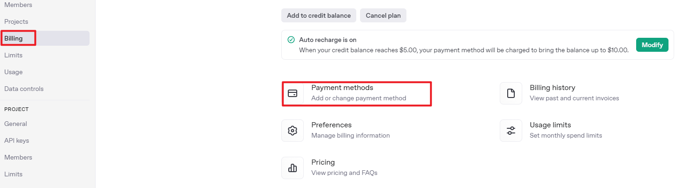
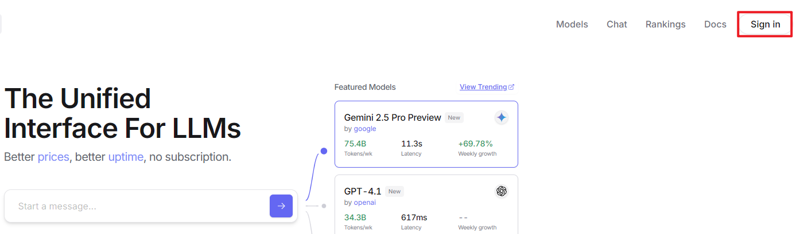
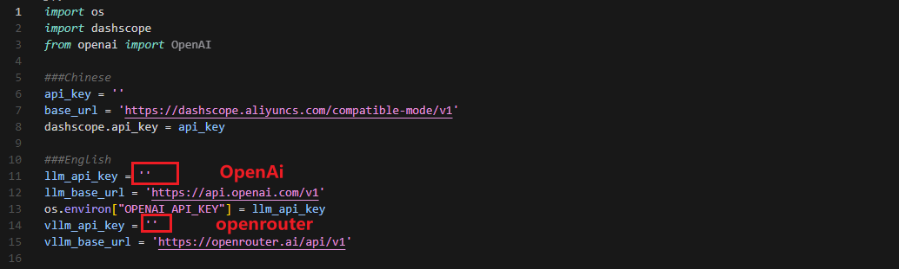
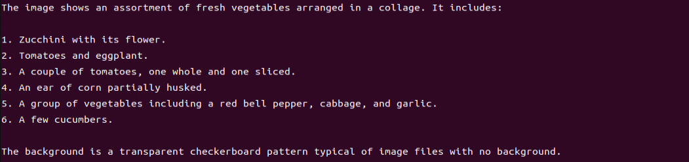
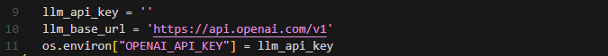
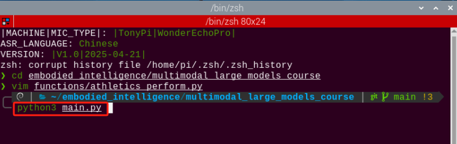

# 12. AI Large Model Course

## 12.1 Large Models Basic Courses

<p id="anchor_12_1_1"></p>

### 12.1.1 Large Language Model Courses

* **Overview of Large Language Model**

A Large Language Model (LLM) is an advanced artificial intelligence model developed to comprehend and generate human language.


* **Basic Concept**

A Large Language Model (LLM) is a deep learning model trained on extensive text data, designed to either generate natural language text or comprehend the meaning of language. LLM is capable of performing various natural language tasks, such as text classification, question answering, and dialogue, making them a crucial step toward achieving advanced artificial intelligence. Unlike smaller models, LLM leverages a similar Transformer architecture and pretraining objectives (like Language Modeling), but are distinguished by their larger model size, greater training data, and enhanced computational resources.

* **Features**

**Massive Scale:** LLM are characterized by their vast parameter sizes, often reaching billions or even trillions of parameters. This immense scale allows them to capture a wealth of linguistic knowledge and complex syntactic structures.

**Pretraining and Fine-tuning:** LLM utilize a two-stage learning process: pretraining and fine-tuning. Initially, they are pretrained on large-scale, unlabeled text data, learning general language representations and knowledge. Subsequently, they are fine-tuned using labeled data to specialize in specific tasks, allowing them to excel across a wide range of NLP applications.

**Contextual Awareness:** LLM demonstrate exceptional contextual awareness, with their ability to understand and generate language deeply dependent on preceding text. This enables them to perform exceptionally well in tasks like dialogue, article generation, and contextual comprehension.

**Multilingual Capabilities:** LLM support multiple languages, extending beyond just English. This multilingual proficiency enables them to power cross-lingual and cross-cultural applications, enhancing their versatility and global reach.

**Multimodal Support:** Some LLMs have expanded to handle multimodal data, including text, images, and speech. This capability allows them to understand and generate content across various media types, opening up more diverse application possibilities.

**Emergent Properties:** LLM exhibit remarkable emergent properties, where performance improvements become apparent in large models but are absent in smaller ones. This makes them adept at handling more complex tasks and challenges.

**Cross-domain Applications:** LLM have been widely adopted across numerous fields, including text generation, machine translation, information retrieval, summarization, chatbots, and virtual assistants. Their influence is profound, impacting both daily life and work in significant ways.

**Ethical and Risk Considerations:** While LLM showcase impressive capabilities, they also raise important ethical and risk-related concerns, such as the potential generation of harmful content, privacy violations, and cognitive biases. As such, the development and deployment of LLM must be approached with careful consideration and caution.

* **Working Principle**

Large Language Model (LLM) are built on deep learning principles and are trained using massive datasets and substantial computational resources to develop neural networks with billions of parameters. Through iterative training and parameter optimization, these models learn to perform a wide range of tasks with high accuracy. The **"large"** in LLM reflects their immense scale—encompassing a vast number of parameters, extensive training data, and significant computational demands. This scale enables advanced models to achieve superior generalization capabilities and deliver increasingly accurate results, even in highly specialized domains.

Today, some of the most popular applications revolve around generative AI, such as language generation tools (e.g., ChatGPT) and image generation platforms (e.g., Midjourney). At the core of these applications is the concept of generation—the model's ability to predict and produce coherent content based on a given input.

* **Application Scenarios**

(1) Text Generation

Large Language Models are capable of generating diverse types of text, including news articles, stories, poems, and more. These capabilities make them well-suited for applications in content creation, creative writing, and automated storytelling.

(2) Text Classification

Large Language Models can classify text into various categories, such as sentiment analysis and topic identification. These capabilities are especially valuable in scenarios like public opinion analysis, information retrieval, and content moderation.

(3) Machine Translation

Large Language Models excel at machine translation, enabling the conversion of text from one language to another. These capabilities are essential for cross-language communication, localization, and global collaboration.

(4) Question-Answering Systems

Large Language Models can be used to build question-answering systems that respond to user queries. These applications are particularly valuable in areas such as intelligent customer support, knowledge retrieval, and information lookup.

<p id="anchor_12_1_1_7"></p>

* **Large Language Model Deployment**

:::{Note}
This section outlines the steps to register on the official OpenAI website and obtain the API key for the Large Language Model.
:::

(1) OpenAI Account Registration and Setup 

① Copy the following URL: [https://platform.openai.com/docs/overview](https://platform.openai.com/docs/overview)

Open the OpenAI website and click on the **"Sign Up"** button in the top right corner.


② Follow the prompts to register and log in using your Google, Microsoft, or Apple account.


③ Click on the settings icon, then select **Billing**, followed by **Payment Methods**, to link your payment method. Recharge your account to purchase tokens.




④ After completing the setup, click on **API Keys**, then select **Create New Secret Key**. Follow the prompts to fill in the required information. Once the key is created, make sure to save it for future use.


⑤ With these steps, the large model has been successfully created and deployed. You can now use the API in the upcoming lessons.

(2) OpenRouter Account Registration and Setup 

① Copy the following URL: [https://openrouter.ai/](https://openrouter.ai/)

Open the webpage in your browser and click **"Sign In"**. Register using your Google account or another available login option.




② After logging in, click the icon in the top-right corner and select **"Credits"** to link your payment method.


③ To create an API key, go to **"API Keys"**, then click **"Create Key"**. Follow the prompts to complete the process. Once the key is generated, make sure to save it for future use.


④ At this point, the large model is successfully created and deployed. You can now use the API in the upcoming lessons.

<p id="anchor_12_1_1_8"></p>

* **Large Language Model Accessing**

:::{Note}
To proceed with this section, you will need to register on the appropriate website and obtain the API key for the large model (please refer to the file [Large Language Model Deployment](#anchor_12_1_1_7). Additionally, ensure that the images to be used in this section are imported.
:::

It is important to ensure a stable network connection for the development board. For optimal performance, we also recommend connecting the main controller to a wired network for enhanced stability.


(1) Environment Configuration

:::{Note}
If you have purchased a robot from our company with built-in large model functionality, the environment is already pre-configured in the robot's image. You can directly proceed to Section 3 of this document to configure the API key.
:::

Install Vim and Gedit by running the corresponding commands. Install the necessary software packages and audio libraries required for PyAudio.

```
sudo apt update
sudo apt install vim
sudo apt install gedit
sudo apt install python3 python3-pip python3-all-dev python3-pyaudio portaudio19-dev libsndfile1
```


(2) Importing the Large Model Program Directory

① In this section, locate the [Source Code](../_static/source_code/large_models_sdk.zip) folder within the same directory as this tutorial document.


② Using the MobaXterm remote connection tool (as outlined in the [5.5 Remote Access and File Transfer](resources_download.md) tutorial), drag the folder into the root directory of the main controller. The software installation package can be found in the [Remote Access and File Transfer](resources_download.md) directory.


③ Next, execute the command to navigate to the **speech_pkg** directory:

```
cd ~/large_models/speech_pkg/
```

④ Execute the following commands to install the necessary third-party libraries.

```
pip3 install -r requirements.txt --break-system-packages
pip3 install dashscope --break-system-packages
pip3 install opencv-python --break-system-packages
pip3 install sympy==1.13.1 --break-system-packages
pip3 install torch --break-system-packages
```

⑤ Then, use the command in the terminal to navigate to the **speech** directory.

```
cd ~/large_models/speech_pkg/speech
```

⑥ Run the command to list the files in the **speech** directory.

```
ls
```

⑦ Depending on the type of main controller and Python version you're using, switch to the appropriate folder for packaging and distribution. This tutorial uses the Jetson Orin controller as an example.

| **Type of main controller** | **Python version** |
|-----------------------------|--------------------|
| jetson_nano                 | 3.6                |
| jetson_orin                 | 3.10               |
| rpi5                        | 3.11               |
| rpi5_docker                 | 3.8                |

⑧ Execute the following command to navigate to the Jetson Orin folder.

```
cd jetson_orin/
```

⑨ Enter the command to copy the **speech.so** file to the parent directory.

```
cp -r speech.so ..
```

⑩ Enter the command to navigate to the parent directory.

```
cd ../..
```

⑪ Execute the command to package the speech file for the Python environment.

```
pip3 install .
```

⑫ Enter the command to install and update the OpenAI Python library.

```
pip3 install openai -U
```

(3) Key Configuration

① Open the terminal and enter the following command to navigate to the directory for configuring the large model keys:

```
cd ~/large_models
```

② Then, open the configuration file by running:

```
vim config.py
```

③ Once the file is open, configure the OpenAI and OpenRouter keys by filling in the **llm_api_key** and **vllm_api_key** parameters, respectively (you can obtain these keys from the [Large Language Model Deployment](#anchor_12_1_1_7) .



For instance, copy the key created in Section 1.2 of this chapter and paste it into the appropriate field. To paste the key, place the cursor between the quotation marks, hold the **"Shift"** key, right-click, and select **"Paste"** (Note: Do not mix keys from different models, as this may cause the functionality to malfunction).


④ After pasting, press the **'Esc'** key, then type the following command and press Enter to save the file:

```
:wq
```

(4) Running the Demo Program

Once the keys are configured, you can run the demo program (**openai_llm_demo.py**) to experience the text generation capabilities of the large model. For example, the program's prompt might be: **'Write a 50-word article about how technology is changing life.'**


① To run the demo, enter the following command in the terminal:

```
python3 openai_llm_demo.py
```

② After running the program, the output will appear as shown in the image below.


* **Semantic Understanding with Large Language Model**

Before starting this section, make sure you have completed the API key configuration outlined in the file [Large Language Model Accessing](#anchor_12_1_1_8).

In this lesson, we'll use a large language model to analyze and summarize short passages of text.

[Source Code](../_static/source_code/large_models_sdk.zip)

(1) Start by opening a new terminal window, then navigate to the large model project directory:

```
cd large_models/
```

(2) Next, run the demo program with the following command:

```
python3 openai_llm_nlu_demo.py
```

(3) As shown in the output, the model demonstrates strong summarization abilities.


(4) The result matches the prompt defined in the program — where a passage of text is provided to the model, and it generates a concise summary.


* **Emotional Perception with Large Language Model**

To proceed with this section, ensure that you have completed the API key configuration as described in the file [Large Language Model Accessing](#anchor_12_1_1_8).

In this lesson, we will use a large language model to assess its ability to perceive emotions based on descriptive words. We'll provide the model with emotional expressions and evaluate its response.

[Source Code](../_static/source_code/large_models_sdk.zip)

(1) Start by opening a new terminal window, then navigate to the large model project directory:

```
cd large_models/
```

(2) Next, run the demo program with the following command:

```
python3 openai_llm_er_demo.py
```

(3) From the output, you will see that the model successfully identifies and understands the emotions conveyed, providing a text-based response accordingly.


(4) In this program, we send two emotional expressions to the model: the first is an expression of sadness, **"So Sad."** After the model responds, we then send an expression of happiness, **"Ha Ha,"** and observe how the model reacts.


### 12.1.2 Large Speech Model Courses

* **Overview of Large Speech Model**

(1) What is a Large Speech Model?

A Speech Large Model (LSM) refers to a machine learning model that uses deep learning techniques to process and understand speech data. These models can be applied in a variety of tasks, such as speech recognition, speech synthesis, speech translation, and emotional analysis of speech. The design and training of these models typically require large amounts of speech data and substantial computational resources, which is why they are referred to as **"large models."**

(2) Why Do We Need Large Speech Model?

With the advancement of artificial intelligence and deep learning, traditional speech processing methods face many limitations. Large models leverage vast amounts of data and deep neural networks to learn and understand the complex features within speech, thereby improving the accuracy and naturalness of speech recognition and generation.

Their advantages include:

① High Accuracy: They maintain a high recognition rate even in noisy environments and with various accents.

② Naturalness: Speech generated by synthesis models is more natural, closely resembling human speech.

③ Versatility: These models support a wide range of languages and tasks, such as multilingual speech recognition, speech-to-text (STT), text-to-speech (TTS), and emotion recognition.

(3) Development of Speech Recognition Technology

**Word-Level Speech Recognition:** At this stage, speech recognition systems could only recognize individual words

**Phrase-Level Speech Recognition:** With the expansion of data and advancements in algorithms, speech recognition systems gradually gained the ability to recognize longer phrases, such as **"Please turn on my computer."**

**Sentence-Level Speech Recognition:** In recent years, with the emergence of AI large models, speech recognition systems have become capable of recognizing entire sentences and understanding their underlying meaning.

(4) Differences Between Large Speech Model and Traditional Speech Processing Technologies

**Processing Methods**

Traditional Speech Processing Technologies: These typically rely on manual feature extraction and shallow models, such as Gaussian Mixture Models (GMM) and Hidden Markov Models (HMM), to process speech signals.

**Large Speech Model:** These use end-to-end learning, directly mapping raw speech waveforms to target outputs (such as text or another speech signal), reducing the reliance on manual feature extraction. They are typically based on deep learning architectures, such as Convolutional Neural Networks (CNN), Recurrent Neural Networks (RNN), and Transformers.

**Model Complexity**

**Traditional Speech Processing Technologies:** These models are relatively simple, with fewer parameters.

**Large Speech Model:** These models have complex structures and a large number of parameters, enabling them to capture more subtle speech features and contextual information.

**Recognition Capability**

**Traditional Speech Processing Technologies:** These are highly adaptable to specific scenarios and conditions, but their recognition capability is limited when encountering new, unseen data.

**Large Speech Model:** Due to their large number of parameters and powerful learning ability, they offer superior recognition capabilities and can adapt to a wider variety of speech data and environments.

**Training Data Requirements**

**Traditional Speech Processing Technologies:** These typically require less data for training, but the data must be highly annotated and of high quality.

**Large Speech Model:** These require vast amounts of training data to fully learn the complexities of speech, often necessitating large quantities of annotated data or the use of unsupervised/self-supervised learning methods.

(5) Core Technologies of Speech Large Model

**Automatic Speech Recognition (ASR)**

ASR is the technology that converts human speech into text. The core steps of a speech recognition system include feature extraction, acoustic modeling, and language modeling.

**Text-to-Speech (TTS)**

TTS is the technology that converts text into speech. Common speech synthesis models include the Tacotron series, FastSpeech, and VITS.

**Speech Enhancement and Noise Reduction**

Speech enhancement techniques are used to improve the quality of speech signals, typically for eliminating background noise and echoes. This is crucial for speech recognition applications in noisy environments.

(6) Applications of Speech Large Model

Intelligent Voice Assistants: For instance, Amazon Alexa and Google Home, which engage with users through voice interactions.

Customer Service Chatbots: In the customer service sector, speech large models assist businesses in enhancing service efficiency by swiftly processing customer inquiries through speech recognition technology, enabling 24/7 support.

Healthcare: Helping doctors with medical record-keeping, thus improving work efficiency.

Speech-to-Text: Speech large models excel in converting speech to text, offering accurate recognition and transcription in a variety of contexts. They are widely used in applications such as meeting transcription and subtitle generation.

* **Voice Device Introduction and Testing**

(1) Device Overview

**WonderEchoPro**

**Introduction**

WonderEcho Pro, also known as the AI Voice Interaction Box, is equipped with a high-performance noise-canceling microphone and a high-fidelity speaker. It utilizes a USB-to-audio module, making it plug-and-play with no drivers required, and is compatible with multiple operating systems for both playback and recording.

Integrating various voice processing technologies, WonderEcho Pro features advanced noise suppression algorithms that effectively filter background noise from the environment. It supports a complete voice interaction process—from wake-up to recognition and response. With its modular design, each functional component (e.g., wake word detection, sound detection, speech recognition, and synthesis) can be developed and tested independently.

**Features and Specifications**

① Built-in microphone and speaker interface, supporting both audio input and output

② Driver-free, plug-and-play functionality compatible with Windows, macOS, Linux, Android, and more

③ Standard USB 2.0 interface

④ Control interface: USB

⑤ Voice chip model: CL1302

⑥ Speaker output: 3.0W per channel (4Ω BTL)

⑦ Power supply voltage: 5V

<p id="6_microphone_1"></p>

**6-Microphone Circular Array**

**Introduction**

The 6-Microphone Circular Array is a high-sensitivity, high signal-to-noise ratio microphone board. It features six analog silicon microphones arranged in a circular pattern. When paired with a main control board, it supports high-performance Acoustic Echo Cancellation (AEC), environmental noise reduction, and factory-level voice pickup from up to 10 meters.


**Features and Specifications**

**Operating Voltage:** 3.3V (typical)

**Operating Current:** 0.8mA (typical)

**Operating Temperature:** -20°C (min), 25°C (typical), 70°C (max)

**Operating Humidity:** Up to 95% relative humidity (max)

(2) Recording and Playback Test

The following demonstration uses the Raspberry Pi 5 as an example. The connection and testing steps are also applicable to other compatible devices such as the Jetson series:

**Connection Illustration and Detection**


If the main controller is a Raspberry Pi, you can use VNC remote desktop access (refer to the appendix: [Remote Access and File Transfer](resources_download.md)) to log into the Raspberry Pi system. Once connected, check the upper right corner of the desktop for microphone and speaker icons. As shown in the image below, the presence of these icons indicates a successful connection.


If you're using a NVIDIA Jetson device, you can connect via the NoMachine remote access tool. After logging in, check the upper right corner of the system interface for the speaker icon to confirm successful detection.


**Recording Test**

① Next, open a new terminal window and enter the following command to check the available recording devices. Note that the **-l** option is a lowercase **"L"**. You should see the card number (**card**) listed—for example, card 0. This is just an example; please refer to your actual query result.

```
arecord -l
```


② Then, use the following command to start recording. Replace the red-marked card number (**hw:0,0**) with the actual number you found in the previous step:

```
arecord -D hw:0,0 -f S16_LE -r 16000 -c 2 test.wav
```

③ This will create a **test.wav** audio file in the current directory.

④ You can record a short 5-second sample, then press Ctrl + C to stop the recording.

**Playback Test**

① After the recording is complete, you can check whether the audio file was successfully created by listing the contents of the current directory:

```
ls
```


② If **test.wav** appears in the list, the recording was successful. To play back the recording, use the following command:

```
aplay test.wav
```

* **Voice Wake-Up**

In this lesson, we'll learn how to use a large speech model to activate the voice device by speaking a predefined wake word through a program.

[Source Code](../_static/source_code/large_models_sdk.zip)

(1) WonderEcho Pro Wake-Up

**Device Check**

To proceed, we need to identify the USB device name assigned to the connected WonderEcho Pro or Circular Microphone Array (hereafter referred to as the voice device). Please follow the steps below carefully. 

:::{Note}
Do not connect any other USB devices during this process to avoid confusion.
:::

* First, disconnect the voice device, then open a terminal and run the following command:

```
ll /dev | grep USB
```

* Next, reconnect the voice device to the USB port on your main board and run the same command again:

```
ll /dev | grep USB
```

* You should now see a newly listed USB port, such as **ttyCH341USB1**.
  Please take note of this device name—it may vary depending on the main controller being used.


**Wake-Up Test**

① To begin, update the port number used in the program by editing the script. You'll also need to uncomment the line for the port you're using and comment out any unused ports.

```
vim wakeup_demo.py
```

Press **"i"** to enter edit mode and make the necessary changes as shown below (update the port number accordingly and adjust comments as needed).


Once the changes are complete, press ESC, then type **":wq"** and press Enter to save and exit the editor.

② Next, return to the system interface and run the wake-up demo using the command below. Speak the wake word **"HELLO HIWONDER"** clearly toward the WonderEcho Pro voice device.
If the output includes **"keyword detect"**, it indicates that the firmware has been successfully flashed and the wake word is functioning correctly.

```
python3 ~/large_models/wakeup_demo.py
```


(2) 6-Microphone Circular Array

As with the WonderEcho Pro, you can connect the 6-Microphone Circular Array to your main board (Raspberry Pi or NVIDIA Jetson) using a Type-C to USB cable.

**Device Check**

For Jetson users, connect to the Jetson system using the NoMachine remote access tool. Once connected, check the desktop interface.
If the 6-Microphone Circular Array icon appears on the left side of the desktop, it indicates the device has been successfully recognized.

**Wake-Up Test**

① Open a new terminal window and run the following command to edit the **wakeup_demo.py** script:

```
vim ~/large_models/wakeup_demo.py
```

② Press **"i"** to enter edit mode.

③ Update the port to match the device port number you previously identified. Comment out the WonderEcho Pro configuration (add **"#"** at the beginning of the corresponding line), and uncomment the line using the circular microphone array on line 11 as the input device (see red box in the referenced image).


④ Press ESC to return to command mode, then type **":wq"** and press Enter to save and exit.

⑤ In the terminal, run the wake-up program with the following command:

```
python3 ~/large_models/wakeup_demo.py
```

⑥ After about 30 seconds of initialization, speak the wake word **"hello hiwonder"** to test the device.


(3) Brief Program Overview

This is a Python-based wake word detection script that utilizes the **speech** module to process audio input and detect a specific wake word (e.g., **HELLO_HIWONDER**).

Source Code Path: [/home/ubuntu/large_models/wakeup_demo.py](../_static/source_code/large_models_sdk.zip)

**Importing Required Modules**

{lineno-start=5}
```python
import os
import time
from speech import awake
```

① **os**: Used for handling file paths and executing system-level commands.

② **time**: Provides delay functions to prevent overly frequent detection attempts.

③ **speech**: The core module responsible for processing audio input and detecting the wake word.

**Initializing the wonderecho Class**

{lineno-start=9}
```python
port = '/dev/ttyUSB0'
kws = awake.WonderEchoPro(port)
# kws = awake.CircleMic(port)
```

**Attempts to Turn Off the Cooling Fan on Raspberry Pi 5**

{lineno-start=13}
```python
try:  # If a fan is present, it's recommended to turn it off before detection to reduce interference(如果有风扇，检测前推荐关掉减少干扰)
    os.system('pinctrl FAN_PWM op dh')
except:
    pass
```

Purpose: Attempts to turn off the cooling fan by executing the system command `pinctrl FAN_PWM op dh`. This helps minimize background noise from the fan that could interfere with wake word detection.

Error Handling: If the command fails (e.g., due to unsupported hardware), the program catches the exception and continues running without interruption.

**Main Wake Word Detection Loop**

{lineno-start=18}
```python
kws.start() # Start detection(开始检测)
print('start...')
```

The program starts the wake word detection thread using `kws.start()`.

It prints **start...** to indicate that detection has been successfully initiated.

**Main Program Logic**

{lineno-start=21}
```python
while True:
    try:
        if kws.wakeup(): # Wake-up detected(检测到唤醒)
            print('hello hiwonder')
        time.sleep(0.02)
    except KeyboardInterrupt:
        kws.exit() # Cancel processing (关闭处理)
        try:
            os.system('pinctrl FAN_PWM a0')
        except:
            pass
        break
```

During each iteration, the program checks whether the wake word has been detected. If the wake word is detected, it prints **keyword detected**.

The detection frequency is controlled using `time.sleep(0.02)` to prevent excessive CPU usage.

Pressing Ctrl+C triggers a `KeyboardInterrupt`, which gracefully exits the detection loop.

Upon exit, the program calls `kws.exit()` to stop the wake word detection process.

The fan is then restored to its original state (if applicable).

(4) Extended Functionality

**Modifying the Wake-Up Response Text**

In this section, you'll learn how to change the message that appears after a successful wake word detection.

① For example, if the wake word **"HELLO_HIWONDER"** is detected, and you'd like the program to print **"hello"** instead of the default message, follow the steps below. Navigate to the **large_models** directory and open the script with:

```
vim wakeup_demo.py
```

② Press **"i"** to enter INSERT mode (you'll see -- INSERT -- at the bottom of the screen). Locate the line **print('hello hiwonder')**, and modify it to print('hello').

```
i
```


③ Press ESC, then type **":wq"** and press Enter to save and exit.

```
:wq
```

④ Finally, run the program with:

```
python3 wakeup_demo.py
```


* **Speech Recognition**

(1) What is Speech Recognition?

Speech Recognition (Speech-to-Text, STT) is a technology that converts human speech signals into text or executable commands. In this course, we will implement speech recognition functionality using Alibaba OpenAI's Speech Recognition API.

(2) How It Works

The **wave** library is used to extract audio data. The extracted audio is then sent to OpenAI's ASR (Automatic Speech Recognition) model. The recognized text returned by the ASR model is stored in **speech_result** for use in subsequent processes.

(3) Preparation Before the Experiment

Before proceeding, refer to the course [12.1.1 Large Language Model Courses](#anchor_12_1_1) to obtain your API key, and make sure to add it into the configuration file (**config**).

(4) Experiment Steps

[Source Code](../_static/source_code/large_models_sdk.zip)

① Power on the device and connect to it using MobaXterm.
(For detailed instructions, please refer to [Remote Connection Tools and Instructions](resources_download.md).)

② Navigate to the program directory by entering the following command:

```
cd large_models/
```

③ Open the configuration file to input your API Key by entering the command below. Press **"i"** to enter INSERT mode and enter your API Key. Once finished, press Esc, type **":wq"**, and hit Enter to save and exit.

```
vim config.py
```


④ Run the speech recognition program with:

```
python3 openai_asr_demo.py
```

(5) Function Realization

After the program starts, the microphone will recognize the recorded audio content from the user and print the converted text output.


(6) Brief Program Analysis

This program implements a speech recognition system by calling OpenAI's Speech-to-Text API to convert audio files into text.

The program source code is located at: [/home/ubuntu/large_models/openai_asr_demo.py](../_static/source_code/large_models_sdk.zip)

**Module Import**

{lineno-start=5}
```python
from config import *
from speech import speech
```

The **speech** module encapsulates ASR (Automatic Speech Recognition) functionalities, such as connecting to an external ASR service.

**Define ASR Class**

{lineno-start=11}
```python
asr = speech.RealTimeOpenAIASR()
# whisper-1 fast than gpt-4o-transcribe 
asr.update_session(model='whisper-1', language='en', threshold=0.2, prefix_padding_ms=300, silence_duration_ms=800)
```

`asr = speech.RealTimeOpenAIASR()`

This line creates a real-time speech recognition object named **asr**. The **RealTimeOpenAIASR** class is used to interact with the speech recognition service.

**Speech Recognition Functionality**

{lineno-start=15}
```python
print('start talking...')
print(asr.asr())
```

An ASR client object is created to prepare for invoking the speech recognition service.

The `asr.asr()` method is called to send the audio file (`wav`) to the ASR service for recognition.

The recognized result (typically text) is printed to the console.

(7) Function Extension

You can modify the model name to enable speech recognition in various languages, such as Chinese, English, Japanese, and Korean.

① Enter the following command to edit the script:

```
vim openai_asr_demo.py
```

② Press the **"i"** key to enter INSERT mode, and update the model setting. For example, modify it to use the `gpt-4o-transcribe` model.

```
i
```


③ Then, run the program with the command:

```
python3 asr_demo.py
```

④ Record a sample sentence such as **"Hello, can you hear me clearly?"**, and the recognized text will be printed on the console.


* **Speech Synthesis**

(1) What is Speech Synthesis?

Speech synthesis (SS) is a technology that converts written text into intelligible spoken audio. It enables computers to generate natural, human-like speech for communication or information delivery.

In this course, we will run a program that processes text using a large language model and generates corresponding audio.

(2) How It Works

The program first sends the text to the OpenAI TTS (Text-to-Speech) model. The model returns the generated audio data, which is saved as a file named `tts_audio.wav` for playback or storage.

(3) Preparation Before the Experiment

Refer to the course [12.1.1 Large Language Model Courses](#anchor_12_1_1) to obtain your API key, and update the configuration file accordingly.

(4) Experiment Steps

[Source Code](../_static/source_code/large_models_sdk.zip)

① Power on the device and connect to it using MobaXterm.

② Navigate to the program directory by entering the following command:

```
cd large_models/
```

③ Open the configuration file to enter your API Key. After editing, press Esc, type **":wq"**, and hit Enter to save and exit:

```
vim config.py
```


④ Finally, run the program with the following command:

```
python3 openai_tts_demo.py
```

(5) Function Realization

Upon running the program, it will play an audio message saying **"Hello, Can I Help You"**, and simultaneously save the audio file with the same content to the following directory:
/home/ubuntu/large_models/resources/audio/


(6) Brief Program Analysis

This program is a speech synthesis system based on OpenAI's Text-to-Speech (TTS) API, capable of converting text into audio files. It supports input text and outputs audio in formats like PCM, WAV, FLAC, AAC, Opus, and MP3. By specifying the desired text, the program sends the request to the API and returns the synthesized audio, which can be played or saved locally.

The source code for this program is located at:
[/home/ubuntu/large_models/openai_tts_demo.py](../_static/source_code/large_models_sdk.zip)

**Module Import**

{lineno-start=5}
```python
from config import *
from speech import speech   
```

① **speech**: This module encapsulates the TTS functionalities.

**Definition for TTS Class**

{lineno-start=8}
```python
tts = speech.RealTimeOpenAITTS()
tts.tts("Hello, Can I help you?") # https://platform.openai.com/docs/guides/text-to-speech
tts.tts("Hello, Can I help you?", model="tts-1", voice="onyx", speed=1.0, instructions='Speak in a cheerful and positive tone.')
tts.save_audio("Hello, Can I help you?", model="gpt-4o-mini-tts", voice="onyx", speed=1.0, instructions='Speak in a cheerful and positive tone.', audio_format='wav', save_path="./resources/audio/tts_audio.wav")
```

① `speed`: Specifies the playback speed; the default value is 1.

For intelligent real-time applications, it is recommended to use the **gpt-4o-mini-tts** model.
Other available models include **tts-1** and **tts-1-hd**. **tts-1** offers lower latency but with slightly reduced quality compared to **tts-1-hd**.

Voice Options: nova, shimmer, echo, onyx, fable, alloy, ash, sage, coral.

For more details, you can refer to the OpenAI documentation:

[https://platform.openai.com/docs/guides/text-to-speech](https://platform.openai.com/docs/guides/text-to-speech)

(7) Function Extension

To change the voice, follow these steps:

① Open the program by entering the command:

```
vim openai_tts_demo.py
```

② Press **"i"** on your keyboard to enter INSERT mode. Locate the line **voice="onyx"** and modify it to **voice="nova".**

```
i
```


③ Press Esc, then type **":wq"** and hit Enter to save and exit.

```
:wq
```

④ Execute the program with the following command:

```
python3 openai_tts_demo.py
```


Once the program starts, the speaker will play the synthesized audio using the newly selected voice style.

* **Voice Interaction**

(1) What is Voice Interaction?

Voice Interaction (VI) refers to a method of communication between humans and computers or devices through spoken language. It integrates speech recognition and speech synthesis, enabling devices to both understand user commands and respond naturally, creating true two-way voice communication. To achieve natural voice interaction, factors such as semantic understanding and sentiment analysis must also be considered, allowing the system to accurately interpret user intent and provide appropriate responses.

This approach can be used as the foundation for developing our own AI assistant features.

(2) How It Works

First, the wake word detection module listens for a specific wake-up word. Once detected, it initiates audio recording. After recording, Automatic Speech Recognition (ASR) converts the audio into text, which is then sent to a Large Language Model (LLM) to generate an appropriate response. The generated text is subsequently converted into speech through a Text-to-Speech (TTS) module and played back to the user. This entire process enables seamless and natural interaction between the user and the voice assistant.

(3) Experiment Steps

[Source Code](../_static/source_code/large_models_sdk.zip)

① Power on the device and connect to it via MobaXterm.

② To check the microphone's port number, first disconnect the microphone and run the command. Then reconnect the microphone and run the command again to determine the port number 

:::{Note}
Do not connect any other USB devices during this process.
:::

```
ll /dev | grep USB
```

* After disconnecting the microphone, no USB device should appear.


* Upon reconnecting the microphone, a USB port (e.g., **ttyCH341USB1**) will be listed (make sure to note this device name). The device name may vary depending on the main controller.

③ Navigate to the program directory:

```
cd large_models/
```

④ Open the configuration file to enter your API Key. After editing, press Esc, then type **":wq"** and hit Enter to save and exit:

```
vim config.py
```


⑤ Enter the port number you obtained and modify the corresponding microphone port settings for either WonderEcho Pro or the six-microphone setup. Uncomment the configuration for the port you intend to use and comment out the settings for any unused ports.

```
vim openai_interaciton_demo.py
```

If you are using the WonderEcho Pro, modify the corresponding section:

If you are using the 6-Microphone Array, modify the relevant section:


⑥ Run the program:

```
python3 openai_interaciton_demo.py
```

⑦ To stop the program at any time, simply press Ctrl+C.

(4) Function Realization

After successful execution, the voice device will announce **'I'm ready.'** Then, upon hearing the wake-up word **'HELLO_HIWONDER,'** the device will respond with **'I'm here,'** indicating that the assistant has been successfully awakened. You can now ask the AI assistant any questions:

For example: **'What are some fun places to visit in New York?'**


(5) Brief Program Analysis

The program integrates voice recognition, speech synthesis, and intelligent response functionalities to create a voice assistant. Interaction is initiated through the wake-up word (**HELLO_HIWONDER**). Users can converse with the assistant via voice commands, and the assistant will respond using text-to-speech technology. The overall structure is clear, with distinct modules that are easy to expand and maintain.

The source code for this program is located at: [/home/ubuntu/large_models/openai_interaction_demo.py](../_static/source_code/large_models_sdk.zip)

**Module Import**

{lineno-start=5}
```python
import os
import time
from config import *
from speech import awake
from speech import speech
```

① **time**: Used to control the interval between program executions.

② **speech**: The core module, integrating wake-up word detection, speech activity detection, speech recognition, TTS, and LLM.

**Definition of Audio File Paths**

{lineno-start=9}
```python
wakeup_audio_path = './resources/audio/en/wakeup.wav'
start_audio_path = './resources/audio/en/start_audio.wav'
no_voice_audio_path = './resources/audio/en/no_voice.wav'

port = '/dev/ttyUSB0'
kws = awake.WonderEchoPro(port)
# kws = awake.CircleMic(port)

asr = speech.RealTimeOpenAIASR()
asr.update_session(model='whisper-1')
tts = speech.RealTimeOpenAITTS()
client = speech.OpenAIAPI(llm_api_key, llm_base_url)
```

This section configures the audio file paths used by various functional modules, such as wake-up sounds, recording storage paths, and prompt sounds.

The text-to-speech (TTS) module is initialized to convert LLM responses into speech.

**Main Functional Logic**

{lineno-start=33}
```python
def main():
    kws.start()
    while True:
        try:
            if kws.wakeup(): # Wake word detected(检测到唤醒词)
                speech.play_audio(wakeup_audio_path)  # Play wake-up sound(唤醒播放)
                asr_result = asr.asr() # Start voice recognition(开启录音识别)
                print('asr_result:', asr_result)
                if asr_result:
                    # Send the recognition result to the agent for a response(将识别结果传给智能体让他来回答)
                    response = client.llm(asr_result, model='gpt-4o-mini')
                    print('llm response:', response)
                    tts.tts(response)
                else:
                    speech.play_audio(no_voice_audio_path)
            time.sleep(0.02)
        except KeyboardInterrupt:
            kws.exit() 
            try:
                os.system('pinctrl FAN_PWM a0')
            except:
                pass
            break
        except BaseException as e:
            print(e)
```

Wake-up Detection: Continuously monitors for the wake-up word. Once detected, it stops the wake-up detection and plays the wake-up prompt sound.

Voice Processing: Records and recognizes the user's speech, uses the language model to generate a response, and then converts the response into speech for playback.

Error Handling: Catches exit signals and runtime errors to ensure the program exits safely and releases resources.

### 12.1.3 Vision Language Model Courses

* **Overview of Vision Language Model**

Vision Language Model (VLM) integrate visual recognition capabilities into traditional Language Model (LLM), enabling more powerful interactions between vision and language through multimodal inputs.

(1) Basic Concept

Vision Language Model (VLM) are a type of artificial intelligence model that leverages deep learning techniques to learn from and process large-scale visual data. These models often adopt convolutional neural network (CNN) architectures, enabling them to extract rich visual features from images or video streams and perform various tasks such as image classification, object detection, and facial recognition. In theory, VLM possess powerful capabilities in feature extraction and pattern recognition, making them widely applicable in fields like autonomous driving, facial recognition, and medical imaging analysis.

(2) Features

**Multimodal Input and Output**: VLM can process both images and text as input and generate various forms of output, including text, images, charts, and more.

**Powerful Visual-Semantic Understanding**: With extensive knowledge accumulated from large-scale visual datasets, VLMs excel at tasks such as object detection, classification, and image captioning.

**Visual Question Answering (VQA):** VLM can engage in natural language conversations based on the content of input images, accurately answering vision-related questions.

**Image Generation:** Some advanced VLM are capable of generating simple image content based on given conditions.

**Deep Visual Understanding:** These models can recognize intricate details within images and explain underlying logical and causal relationships.

**Cross-Modal Reasoning:** VLM can leverage visual and linguistic information together, enabling reasoning across modalities, such as inferring from language to vision and vice versa.

**Unified Visual and Language Representation Space:** By applying attention mechanisms, VLM establish deep connections between visual and semantic information, achieving unified multimodal representations.

**Open Knowledge Integration:** VLM can integrate both structured and unstructured knowledge, enhancing their understanding of image content.

(3) How It Works

The working principle of Vision Language Model is primarily based on deep learning techniques, particularly Convolutional Neural Networks (CNNs) and Transformer architectures. Through multiple layers of neurons, these models perform feature extraction and information processing, enabling them to automatically recognize and understand complex patterns within images.

In a VLM, the input image first passes through several convolutional layers, where local features such as edges, textures, and shapes are extracted. Each convolutional layer is typically followed by an activation function (e.g., ReLU) to introduce non-linearity, allowing the model to learn more complex representations. Pooling layers are often used to reduce the dimensionality of the data while preserving important information, helping to optimize computational efficiency.

As the network deepens, it gradually transitions from extracting low-level features (like edges and corners) to higher-level features (such as objects and scenes). For classification tasks, the final feature vector is passed through fully connected layers to predict the probability of different target categories. For tasks like object detection and segmentation, the model outputs bounding boxes or masks to indicate the location and shape of objects within the image.

Transformer-based VLM divide images into small patches, treating them as sequential data, and apply self-attention mechanisms to capture global relationships within the image. This approach is particularly effective at modeling long-range dependencies, enabling VLM to excel at understanding complex visual scenes.

Training VLM typically requires large-scale labeled datasets. Through backpropagation, the model optimizes its parameters to minimize the loss between predictions and ground-truth labels. Pretraining on massive datasets allows the model to acquire general-purpose visual features, while fine-tuning on specific tasks further improves performance for specialized applications.

Thanks to this design, Visual Language Models are able to process and understand visual data effectively, and are widely used in applications like image classification, object detection, and image segmentation, driving rapid progress in the field of computer vision.

(4) Application Scenarios

**Image Captioning**

VLM can automatically generate textual descriptions based on input images. This capability is particularly valuable for social media platforms, e-commerce websites, and accessibility technologies, such as providing visual content descriptions for visually impaired users.

**Visual Question Answering**

Users can ask questions related to an image, such as **"What is in this picture?"** or **"What color is the car?"** The model analyzes the image content and provides accurate, natural-language responses, making it highly applicable in fields such as education, customer support, and information services.

**Image Retrieval**

In image search engines, users can perform searches using text descriptions, and Vision Language Model (VLM) can understand the descriptions and return relevant images. This capability is especially important on e-commerce platforms, where it allows users to find desired products more intuitively.

**Augmented Reality (AR)**

Vision Language Model (VLM) can provide real-time visual feedback and language-based explanations in augmented reality applications. When users view real-world scenes through a device's camera, the system can overlay relevant information or guidance, enhancing the overall user experience.

**Content Creation and Editing**

In design and creative tools, Vision Language Model (VLM) can generate relevant text content or suggestions based on a user's visual input (such as sketches or images), helping users complete creative work more efficiently.

**Social Media Interaction**

On social media platforms, VLM can generate appropriate comments or tags based on user-uploaded images, enhancing engagement and interaction.

**Medical Imaging Analysis**

In the healthcare field, VLM can be used to analyze medical images (such as X-rays and CT scans) and generate diagnostic reports or recommendations, assisting doctors in making more accurate decisions.

* **Vision Language Model Accessing**

:::{Note}
* This section requires the configuration of the API key in [12.1.1 Large Language Model Courses](#anchor_12_1_1) before proceeding. Additionally, ensure that the images to be used in this section are imported.
* This experiment requires either an Ethernet cable or Wi-Fi connection to ensure the main control device can access the network properly.

:::

(1) Experiment Steps

[Source Code](../_static/source_code/large_models_sdk.zip)

① Execute the following command to navigate to the directory of Large Model.

```
cd large_models/
```

② Run the program:

```
python3 openai_vllm_understand.py
```

(2) Function Realization

After running the program, the output printed matches our request of **"Describe the image."**


* **Vision Language Model: Object Detection**

:::{Note}
* This section requires the configuration of the API key in "[12.1.1 Large Language Model Courses](#anchor_12_1_1)" before proceeding. Additionally, ensure that the images to be used in this section are imported.
* This experiment requires either an Ethernet cable or Wi-Fi connection to ensure the main control device can access the network properly.
* In this course, we will use a program to transmit an image to the large model for recognition, which will then identify and locate the objects within the image by drawing bounding boxes around them.

:::

(1) Experiment Steps

[Source Code](../_static/source_code/large_models_sdk.zip)

① Execute the following command to navigate to the directory of Large Model.

```
cd large_models/
```

② Run the program:

```
python3 qwen_vllm_detect_demo.py
```

(2) Function Realization

After running the program, the positions of the fruits in the image will be circled.


(3) Function Expansion

We can switch the image and change the large model to experience different functionalities of various models.

**Change Pictures**

① Click on the path box to navigate to the following directory: "**/home/ubuntu/large_models/resources/pictures/**"

Here, you can drag in other images, for example, in the **apples.png** format.


② Then, input the command:

```
vim large_models/qwen_vllm_detect_demo.py
```

③ Press the **"i"** key on your keyboard, which will display **"INSERT"** at the bottom.

```
i
```

④ Change the image recognition path from: **./resources/pictures/test_image_understand.jpeg**.

To: **image = cv2.imread('./resources/pictures/apples.png')**


⑤ Next, input the following command and execute the program again to see the results

```
python3 qwen_vllm_detect_demo.py
```


* **Vision Language Model: Scene Understanding**

:::{Note}
* This section requires the configuration of the API key in "[12.1.1 Large Language Model Courses](#anchor_12_1_1)" before proceeding. Additionally, ensure that the images to be used in this section are imported.
* This experiment requires either an Ethernet cable or Wi-Fi connection to ensure the main control device can access the network properly.
* In this course, we will use a program to send an image to the large model for recognition and generate a description of the content within the image.

:::

(1) Experiment Steps

[Source Code](../_static/source_code/large_models_sdk.zip)

① Execute the following command to navigate to the directory of Large Model.

```
cd large_models/
```

② Run the program:

```
python3 openai_vllm_understand.py
```

(2) Function Realization

After running the program, the output printed matches our request of **"Describe the image."**




(3) Function Expansion

If you need to recognize your own image, you should place the image in the corresponding path and modify the image path in the program.

① First, drag your image directly into the "**~/large_models/resources/pictures/**" path using MobaXterm, and rename the image to **test.png**.


② Then, open the scene understanding script by entering the following command in the terminal:

```
vim ~/large_models/vllm_understand.py
```

③ Change the image path in the code to reflect the name of your image (e.g., `test.png`).


④ Run the program:

```
python3 ~/large_models/openai_vllm_understand.py
```


* **Vision Language Model: Optical Character Recognition**

:::{Note}
* This section requires the configuration of the API key in "**[12.1.1 Large Language Model Courses](#anchor_12_1_1)**" before proceeding. Additionally, ensure that the images to be used in this section are imported.
* This experiment requires either an Ethernet cable or Wi-Fi connection to ensure the main control device can access the network properly.
* In this course, we use a program to transmit an image to the large model for recognition, extracting and identifying the text within the image.

:::

(1) Experiment Steps

[Source Code](../_static/source_code/large_models_sdk.zip)

① Execute the following command to navigate to the directory of Large Model.

```
cd large_models/
```

② Run the program:

```
python3 openai_vllm_ocr.py
```

(2) Function Realization

After running the program, the output printed will be consistent with the content of the image sent.


(3) Function Expansion

We can switch the image and change the large model to experience different functionalities of various models.

**Change Pictures**

① Drag the image directly into the "**~/large_models/resources/pictures/**" path using MobaXterm. Here, we can drag in the image named **ocr1.png** as an example, and let the program recognize the text **'COME ON'**.


② Then, input the command:

```
vim ~/large_models/openai_vllm_ocr.py
```

③ Press the **"i"** key on your keyboard, which will display **"INSERT"** at the bottom.

```
i
```

④ Change the image recognition path from: **./resources/pictures/ocr.jpeg**

To: **image = cv2.imread('./resources/pictures/ocr1.png')**

```
image = cv2.imread('./resources/pictures/ocr1.png')
```

⑤ Run the program:

```
python3 ~/large_models/openai_vllm_ocr.py
```


### 12.1.4 Multimodal Model Basic Courses

* **Overview of Multimodal Model**

The emergence of Multimodal Model is built upon continuous advancements in the fields of Large Language Model (LLM) and Vision Language Model (VLM).

(1) Basic Concept

As LLM continue to improve in language understanding and reasoning capabilities, techniques such as instruction tuning, in-context learning, and chain-of-thought prompting have become increasingly widespread. However, despite their strong performance on language tasks, LLM still exhibit notable limitations in perceiving and understanding visual information such as images. At the same time, VLM have made significant strides in visual tasks such as image segmentation and object detection, and can now be guided by language instructions to perform these tasks, though their reasoning abilities still require further enhancement.

(2) Features

The core strength of Multimodal Model lies in their ability to understand and manipulate visual content through language instructions. Through pretraining and fine-tuning, these models learn the associations between different modalities—such as how to generate descriptions from images or how to identify and classify objects in visual data. Leveraging self-attention mechanisms from deep learning, Multimodal Model can effectively capture relationships across modalities, allowing them to synthesize information from multiple sources during reasoning and decision-making processes.

**Multimodal Fusion Capability:** Multimodal Model can process and understand multiple types of data simultaneously, including text, images, and audio. This fusion ability enables the models to build connections across modalities, leading to a more comprehensive understanding of information. For instance, a model can generate natural language descriptions based on an image or identify specific objects within an image based on a text query.

**Enhanced Contextual Understanding:** By integrating information from different modalities, Multimodal Model excel at contextual understanding. They can not only recognize content within a single modality but also combine clues from multiple sources to make more accurate judgments and decisions in complex tasks.

**Flexible Interaction Methods:** Users can interact with Multimodal Model through natural language instructions, making communication with the models more intuitive without requiring knowledge of complex programming or operations. For example, users can simply ask about details in an image, and the model can provide relevant answers.

**Scalability:** The architecture and training methods of Multimodal Model allow them to adapt to new modalities and tasks. As technology evolves, additional types of data—such as videos or sensor readings—can be incorporated, expanding their range of applications and capabilities.

**Strong Generative Capabilities:** Similar to large language models, Multimodal Model perform exceptionally well in generating both textual and visual content. They can produce natural language descriptions, summaries, and even create novel visual outputs, meeting a wide variety of application needs.

**Improved Reasoning Abilities:** Although challenges remain, Multimodal Model demonstrate significantly enhanced reasoning capabilities compared to traditional single-modality models. By integrating multimodal information, they can reason effectively in more complex scenarios, supporting advanced tasks such as logical reasoning and sentiment analysis.

**Adaptability and Personalization:** Multimodal Model can be fine-tuned to meet user-specific needs and preferences, enabling highly personalized services. This adaptability offers great potential for applications in fields such as education, entertainment, and customer service.

(3) How It Works

The working principle of Multimodal Model is built upon advanced deep learning and neural network technologies, with a core focus on fusing data from different modalities to understand and tackle complex tasks. At the foundation, Multimodal Model often adopt architectures similar to Transformers, which are highly effective at capturing relationships between different parts of input data. During training, these models are exposed to massive amounts of multimodal data—such as images, text, and audio—and leverage large-scale unsupervised learning for pretraining. Through this process, the models learn the commonalities and differences across modalities, enabling them to grasp the intrinsic connections between various types of information.

In practice, incoming text and visual data are first embedded into a shared representation space. Text inputs are transformed into vectors using word embedding techniques, while images are processed through methods like Convolutional Neural Networks (CNNs) to extract visual features. These vectors are then fed into the model's encoder, where self-attention mechanisms analyze the relationships across modalities, identifying and focusing on the most relevant information.

After encoding, the model generates a multimodal contextual representation that blends both the semantic information of the text and the visual features of the image. When a user provides a natural language instruction, the MLLM parses the input and interprets the intent by leveraging the contextual representation. This process involves reasoning and generation capabilities, allowing the model to produce appropriate responses based on its learned knowledge, or to perform specific actions in visual tasks.

Finally, the Multimodal Model's decoder translates the processed information into outputs that users can easily understand—such as generating textual descriptions or executing targeted visual operations. Throughout this process, the emphasis is on the fusion and interaction of information across different modalities, enabling Multimodal Model to excel at handling complex combinations of natural language and visual content. This integrated working mechanism empowers Multimodal Model with powerful functionality and flexibility across a wide range of application scenarios.

(4) Application Scenarios

**Education**

Multimodal Model can be used to create personalized learning experiences. By combining text and visual content, the model can provide students with rich learning materials—for example, explaining scientific concepts through a mix of images and text to enhance understanding. Additionally, in online courses, the model can dynamically adjust content based on the learner's performance, offering customized learning suggestions in real time.

**Healthcare**

Multimodal Model can assist doctors in diagnosis and treatment decisions. By analyzing medical images (such as X-rays or MRIs) alongside relevant medical literature, the model helps doctors access information more quickly and provides evidence-based recommendations. This application improves diagnostic accuracy and efficiency.

**Entertainment**

Multimodal Model can be used for content generation, such as automatically creating stories, scripts, or in-game dialogues. By incorporating visual elements, the model can provide rich scene descriptions for game developers, enhancing immersion. Additionally, on social media platforms, Multimodal Model can analyze user-generated images and text to help recommend suitable content.

**Advertising and Marketing**

Multimodal Model can analyze consumer behavior and preferences to generate personalized advertising content. By combining text and images, ads can better capture the attention of target audiences and improve conversion rates.

Finally, Multimodal Model also play a role in scientific research. By processing large volumes of literature and image data, the model can help researchers identify trends, generate hypotheses, or summarize findings, accelerating scientific discovery.

* **Agent Behavior Orchestration**

:::{Note}
* This section requires the configuration of the API key in "**[12.1.1 Large Language Model Courses](#anchor_12_1_1)**" before proceeding. Additionally, ensure that the images to be used in this section are imported.
* This experiment requires either an Ethernet cable or Wi-Fi connection to ensure the main control device can access the network properly.
* The purpose of this course experiment is to obtain data in a specified format returned by the large model based on the prompt words set in the model. During development, you can use the returned data for further tasks.

:::

(1) Experiment Steps

[Source Code](../_static/source_code/large_models_sdk.zip)

① To check the microphone's port number, first disconnect the microphone and run the command. Then reconnect the microphone and run the command again to determine the port number 

:::{Note}
Do not connect any other USB devices during this process.
:::

```
ll /dev | grep USB
```

* After disconnecting the microphone, no USB device should appear.


* Upon reconnecting the microphone, a USB port (e.g., **ttyCH341USB1**) will be listed (make sure to note this device name). The device name may vary depending on the main controller.

② Execute the following command to navigate to the directory of Large Model.

```
cd large_models/
```

③ Open the configuration file to enter your API Key. After editing, press Esc, then type **":wq"** and hit Enter to save and exit:

```
vim config.py
```



④ Fill in the detected port number and update the corresponding microphone port settings for either the WonderEcho Pro or the Six-channel Microphone.
Uncomment the port you wish to use and comment out the settings for any unused ports.

```
vim openai_agent_demo.py
```

Modify the settings as follows. For WonderEcho Pro, update the corresponding configuration


For 6-channel Microphone, update the respective settings:


⑤ Run the program:

```
python3 openai_agent_demo.py
```

⑥ The program will print the prompts configured for the large model. The large model will then return data formatted according to these prompts.


(2) Function Realization

① After running the program, the voice device will announce, **"I'm ready."** At this point, say **"HELLO_HIWONDER"** to the device to activate the agent.
When the device responds with **"I'm here,"** it indicates that the agent has been successfully awakened. To modify the wake word. For the Six-channel Microphone, refer to Section [6-Microphone Circular Array](#6_microphone_1) for instructions on customizing the wake word. For WonderEcho Pro, refer to Section [WonderEcho Pro Firmware Generation](6_ai_voice_interaction_course.md#firmware-flashing-method)

② After updating the wake word, you can say: **"Take two steps forward, turn left and take one step back"**. The agent will respond according to the format we have defined.


## 12.2 Multimodal Model Applications

<p id="anchor_12_2_1"></p>

### 12.2.1 Obtaining and Configuring the Large Model API Key

* **OpenAI Account Registration and Setup**

(1) Registration

① Visit the following link to access the OpenAI platform, and sign up.

[https://platform.openai.com/docs/overview](https://platform.openai.com/docs/overview)


② You can register using your Google, Microsoft, or Apple account as prompted.


③ Once registered, click on the **Settings** icon, navigate to **Billing**, and then select **Payment Methods** to add a payment option. This is required to purchase tokens.


④ After setting up your billing information, go to the **API Keys** section, click **Create New Secret Key**, and follow the on-screen instructions. Be sure to save the key for future use.


With these steps completed, you've successfully created and deployed your large model API key, which will be used in the upcoming course sessions.

(2) Deploying the API Key

The configuration file for this program is located at: [/home/pi/embodied_intelligence/common/config.py](../_static/source_code/tonypi-main.zip)

① Use the following command and press Enter to navigate to the directory containing the configuration file:

```
cd embodied_intelligence/common
```

② Enter the following command to open the configuration file and insert the OpenAI key:

```
gedit config.py
```


* **OpenRouter API Configuration**

① Visit the following link to access the OpenAI platform: [https://openrouter.ai/](https://openrouter.ai/)

Click on **"Sign in"** and use your Google account or another supported account to register or log in.


② After logging in, click on the icon in the top-right corner, select **"Credits,"** and link your payment method.


③ To create an API key: Navigate to **"API Keys"** and click **"Create Key."** Then follow the prompts to generate your API key, and make sure to save it for future use.


④ Use the following command and press Enter to navigate to the directory containing the configuration file:

```
cd embodied_intelligence/common
```

⑤ Open the configuration file using the following command, then paste your OpenRouter API key into it:

```
gedit config.py
```


### 12.2.2 Multimodal Model: Voice Control

* **Brief Game Instructions**

Once the program starts running and WonderEcho Pro announces **"I am ready."**

Say the wake-up word (the wake-up word depends on the firmware flashed, and by default, the wake-up word for our factory firmware is **"Hello, HiWonder"**) to activate WonderEcho Pro. It will respond with **"I am here."**

You can then control TonyPi using voice commands. For example, saying **"Hello, please move forward two steps"** will prompt WonderEcho Pro to announce the response generated after processing and execute the corresponding action.

* **Preparation**

(1) Verifying the WonderEcho Pro Firmware

By default, the wake-up word for the WonderEcho Pro factory firmware is **"Hello, HiWonder."** If you wish to change the wake-up word to **"TonyPi,"** please refer to the tutorial titled [6 AI Voice Interaction Course → 6.1 Introduction to WonderEcho Pro and Installation → 6.1.3 Firmware Flashing Method](6_ai_voice_interaction_course.md#firmware-flashing-method) for step-by-step instructions.

(2) Obtaining and Configuring the Large Model API Key

By default, the program does not include the configuration of the Large AI Model-related API keys. Before activating features related to the Large AI Model, please refer to the section [12.2.1 Obtaining and Configuring Large Model API Keys](#anchor_12_2_1) to configure the necessary keys. This step is mandatory and cannot be skipped, as it is crucial for the proper functioning and experience of the large model features.

(3) Network Configuration

The robot must be connected to the internet, either in STA (local network) mode or AP (direct connection) mode via Ethernet. For detailed instructions on network configuration, please refer to the course [14. Robot Network Configuration](14_network_configuration.md) .

* **Starting and Stopping the Game**

:::{Note}
* The input commands must strictly observe case sensitivity and spacing.
* The robot must be connected to the internet, either in STA (local network) mode or AP (direct connection) mode via Ethernet.
:::

[Source Code](../_static/source_code/tonypi-main.zip)

(1) Power on the robot and remotely connect to the Raspberry Pi desktop via VNC.

(2) Double-click the **"Terminator"** icon  on the Raspberry Pi desktop to open the command-line terminal.

(3) Execute the following command to disable the app auto-start service.

```
sudo systemctl stop tonypi.service
```


(4) Enter the command and press the Enter key to navigate to the directory where the game program is stored:

```
cd embodied_intelligence/multimodal_large_models_course
```


(5) Enter the command and press the Enter key to start the game:

```
python3 main.py
```


(6) When the following output appears in the command line, it indicates that WonderEcho Pro has completed initialization and will announce **"I am ready."** At this point, you can say the wake word, **"hello hiwonder."**


(7) When the following output appears in the command line, WonderEcho Pro will announce **"I am Here,"** indicating that WonderEcho Pro has been successfully activated. At this point, the system will begin recording the user's command.

You can freely phrase your commands to control the movement of TonyPi, such as saying, **"Go forward and greet me."**


(8) When the following output appears in the command line, it indicates that WonderEcho Pro has finished recording the user's command audio and is processing it. The parsed result will be shown in the `asr_result`.


(9) When the following output appears, it means that the Raspberry Pi has successfully called the cloud-based large language model to process the user's command, providing a verbal response under `response` and generating an action group `action` that aligns with the semantics of the user's command.

At this point, the robot will execute the actions outlined in the `action` sequence.

:::{Note}
The response is automatically generated by the large model, ensuring the accuracy of the meaning, though the wording and structure of the reply may vary.
:::


(10) When the command line shows the output below, it indicates that one round of interaction has been completed. You can refer to Step 4) to reactivate the voice device using the wake-up word and begin a new round of interaction.


(11) To exit this feature, simply press **"Ctrl+C"** in the terminal. If it doesn't close on the first attempt, you may need to press it multiple times.

(12) Execute the following command to enable the app auto-start service.

```
sudo systemctl restart tonypi.service
```


* **How It Works**

Once the game is activated, we can freely give commands to control TonyPi, instructing it to perform the following actions either individually or in sequence.

| **NO.** | **Actions** | **NO.** | **Actions** |
|:--:|:--:|:--:|:--:|
| 1 | Stand: `stand()` | 10 | Twist: `twist()` |
| 2 | Move a step forward: `forward()` | 11 | Chest thump celebration: `celebrate()` |
| 3 | Step backwards: `back()` | 12 | Squat: `squat()` |
| 4 | Move left by one step: `move_left()` | 13 | Kick right foot: `right_shot()` |
| 5 | Move right by one step: `move_right()` | 14 | Kick left foot: `left_shot()` |
| 6 | Turn left by one step: `turn_left()` | 15 | Sit-ups: `sit_ups()` |
| 7 | Turn right by one step: `turn_right()` | 16 | Wing Chun fist: `wing_chun()` |
| 8 | Bow: `bow()` | 17 | Fall and Get Up: `stand_up()` |
| 9 | Wave to Greet: `wave()` | 18 |  |

* **Brief Program Analysis**

**Library Files Import**

{lineno-start=5}
```python
import os, sys
sys.path.append(os.path.abspath(os.path.join(os.path.dirname(__file__), '..')))
import time
import action
from common.config import *
from speech import awake
from speech import speech
```

**Module Initialization**

{lineno-start=104}
```python
kws = awake.WonderEchoPro('/dev/ttyUSB0')

if language == 'Chinese':
    asr = speech.RealTimeASR()
    tts = speech.RealTimeTTS()
else:
    asr = speech.RealTimeOpenAIASR()
    asr.update_session(model=asr_model, language='en')
    tts = speech.RealTimeOpenAITTS()

client = speech.OpenAIAPI(api_key, base_url)
action.init()
```

**Set Prompt Words**

{lineno-start=15}
```python
if language == 'Chinese':
    PROMPT = '''
#角色
你是一款智能陪伴机器人，专注机器人动作规划，解析人类指令并以幽默方式描述即将展开的行动序列，为交互增添无限趣味。
##要求
1.用户输入的任何内容，都需要在动作函数库中寻找对应的指令，并输出对应的json指令。
2.为每个动作序列编织一句精炼（10至30字）、风趣且变化无穷的反馈信息，让交流过程妙趣横生。
3.直接输出json结果，不要分析，不要输出多余内容。
4.格式：{"action": ["xx", "xx"], "response": "xx"}
'''
else:
    PROMPT = '''
**Role**
You are an intelligent companion robot specializing in robot action planning. You interpret human instructions and describe the upcoming action sequence in a humorous way, adding infinite fun to the interaction.

**Requirements**
1. For every user input, search the action function library for matching commands and return the corresponding JSON instruction.
2. Craft a witty, ever-changing, and concise response (between 10 to 30 characters) for each action sequence to make interactions lively and fun.
3. Output only the JSON result — no explanations or extra text.
4. Output format: {"action": ["xx", "xx"], "response": "xx"}
'''
```

Set the prompt words based on the system's language, for both Chinese and English versions.

**Wake Word Detection**

{lineno-start=132}
```python
if kws.wakeup():  # Wake word detected(检测到唤醒词)
    speech.play_audio(wakeup_audio_path)  # Play wake-up sound(唤醒播放)
```

Call `kws.wakeup()` to detect the wake word. Once detected, play the wake-up sound effect using `speech.play_audio(wakeup_audio_path)`.

**Recording and Recognition**

{lineno-start=133}
```python
asr_result = asr.asr()  # Start voice recognition(开启录音识别)
print('asr_result:', asr_result)
```

Use `asr.asr()` for recording and speech recognition. The recognized result will then be printed to the terminal using `print()`.

**Interaction with the Intelligent Agent**

{lineno-start=140}
```python
result = client.llm(asr_result, prompt=PROMPT, model=llm_model)
print('llm_result:', result)
```

Pass the recognition result to the intelligent agent with `client.llm(asr_result, prompt=PROMPT, model=llm_model)` to obtain a reply and corresponding action instructions.

**Speech Synthesis and Action Execution**

{lineno-start=153}
```python
tts.tts(response)
if action_list is not None:
    for a in action_list:
        eval(f'action.{a}')
```

If a response is received, and action instructions are available, first synthesize and announce the speech using `tts.tts(response)`, then iterate through and execute the action instructions.

### 12.2.3 Multimodal Model: Ball Tracking and Shooting

* **Brief Game Instructions**

Once the program starts running and WonderEcho Pro announces **"I am ready"**.

Say the wake-up word (the wake-up word depends on the firmware flashed, and by default, the wake-up word for our factory firmware is **"Hello, Hiwonder"**) to activate WonderEcho Pro. It will respond with **"I am here"**.

You can then control TonyPi using voice commands. For example, saying **"kick the red ball ahead"** will prompt WonderEcho Pro to announce the response generated after processing and execute the corresponding action.

* **Preparation**

(1) Verifying the WonderEcho Pro Firmware

By default, the wake-up word for the WonderEcho Pro factory firmware is **"Hello, HiWonder."**. If you wish to change the wake-up word to **"TonyPi"**, please refer to the tutorial titled [6 AI Voice Interaction Course → 6.1 Introduction to WonderEcho Pro and Installation → 6.1.3 Firmware Flashing Method](6_ai_voice_interaction_course.md#firmware-flashing-method) for step-by-step instructions.

(2) Obtaining and Configuring the Large Model API Key

By default, the program does not include the configuration of the Large AI Model-related API keys. Before activating features related to the Large AI Model, please refer to the section [12.2.1 Obtaining and Configuring Large Model API Keys](#anchor_12_2_1) to configure the necessary keys. This step is mandatory and cannot be skipped, as it is crucial for the proper functioning and experience of the large model features.

(3) Network Configuration

The robot must be connected to the internet, either in STA (local network) mode or AP (direct connection) mode via Ethernet. For detailed instructions on network configuration, please refer to the course [14. Robot Network Configuration](14_network_configuration.md) .

* **Starting and Stopping the Game**

:::{Note}
* The input commands must strictly observe case sensitivity and spacing.
* The robot must be connected to the internet, either in STA (local network) mode or AP (direct connection) mode via Ethernet.
:::

[Source Code](../_static/source_code/tonypi-main.zip)

(1) Power on the robot and remotely connect to the Raspberry Pi desktop via VNC.

(2) Double-click the **"Terminator"** icon  on the Raspberry Pi desktop to open the command-line terminal.

(3) Execute the following command to disable the app auto-start service.

```
sudo systemctl stop tonypi.service
```


(4) Enter the command and press the Enter key to navigate to the directory where the game program is stored:

```
cd embodied_intelligence/multimodal_large_models_course
```


(5) Enter the command and press the Enter key to start the game:

```
python3 main.py
```


(6) When the following output appears in the command line, it indicates that WonderEcho Pro has completed initialization and will announce **"I am ready."** At this point, you can say the wake word, **"hello hiwonder."**


(7) When the following output appears in the command line, WonderEcho Pro will announce **"I am Here,"** indicating that WonderEcho Pro has been successfully activated. At this point, the system will begin recording the user's command.

You can freely organize your language and issue commands to control TonyPi to start tracking and kicking the ball, such as **"kick the red ball ahead."**


(8) When the following output appears in the command line, it indicates that WonderEcho Pro has finished recording the user's command audio and is processing it. The parsed result will be shown in the `asr_result`.


(9) When the following output appears, it means that the Raspberry Pi has successfully called the cloud-based large language model to process the user's command, providing a verbal response under `response` and generating an action group `action` that aligns with the semantics of the user's command.

At this point, the robot will execute the actions outlined in the `action` sequence.

:::{Note}
The response is automatically generated by the large model, ensuring the accuracy of the meaning, though the wording and structure of the reply may vary.
:::


(10) When the command line shows the output below, it indicates that one round of interaction has been completed. You can refer to Step 5) to reactivate the voice device using the wake-up word and begin a new round of interaction.


(11) To exit this feature, simply press **"Ctrl+C"** in the terminal. If it doesn't close on the first attempt, you may need to press it multiple times.

(12) Execute the following command to enable the app auto-start service.

```
sudo systemctl restart tonypi.service
```


* **How It Works**

Once the feature is activated, you can issue commands in your own words, such as **"kick the red ball ahead,"** to control TonyPi. It will automatically track any ball within its line of sight and perform the kicking action.

* **Function Expansion**

(1) Changing the Color of the Tracked Ball

① By default, the program is set to track a red ball. It includes preset color thresholds for red, green, blue, black, and white. You can modify the commands as needed to control TonyPi to track balls of different colors.

② For example, to track a blue ball, follow the steps and then issue the command, **"kick the blue ball ahead."** (Feel free to rephrase the command in your own way, as long as the meaning remains the same.)

Here is a terminal screenshot of the entire voice interaction process.


:::{Note}
When issuing commands, describe the color of the tracked ball in a straightforward manner without adding unnecessary modifiers. For example, when tracking a blue ball, simply use the term **"blue"** rather than descriptors like **"sky blue"** or **"lake blue."** Using such modifiers could confuse the model, leading to incorrect parameters in the action functions and causing the program to fail in tracking the ball due to the inability to find the correct color configuration.
:::

(2) Change Action

① The large language model supports chaining multiple actions into a single command. You can refer to the table below to combine the ball-tracking and kicking function with the actions introduced in the previous section.

② Here's an example of a multi-action command:
Follow the tutorial steps accordingly. When prompted, you may say:
**"Take two steps forward, kick the blue ball, then bow."** (Feel free to rephrase the command in your own way, as long as the meaning remains the same.)

Here is a terminal screenshot of the entire voice interaction process.


| **NO.** | **Actions** | **NO.** | **Actions** |
|:--:|:--:|:--:|:--:|
| 1 | Stand: `stand()` | 10 | Twist: `twist()` |
| 2 | Move a step forward: `forward()` | 11 | Chest thump celebration: `celebrate()` |
| 3 | Step backwards: `back()` | 12 | Squat: `squat()` |
| 4 | Move left by one step: `move_left()` | 13 | Kick right foot: `right_shot()` |
| 5 | Move right by one step: `move_right()` | 14 | Kick left foot: `left_shot()` |
| 6 | Turn left by one step: `turn_left()` | 15 | Sit-ups: `sit_ups()` |
| 7 | Turn right by one step: `turn_right()` | 16 | Wing Chun fist: `wing_chun()` |
| 8 | Bow: `bow()` | 17 | Fall and Get Up: `stand_up()` |
| 9 | Wave to Greet: `wave()` | 18 |  |

* **Brief Program Analysis**

**Library Files Import**

{lineno-start=5}
```python
import os, sys
sys.path.append(os.path.abspath(os.path.join(os.path.dirname(__file__), '..')))
import time
import action
from common.config import *
from speech import awake
from speech import speech
```

**Module Initialization**

{lineno-start=104}
```python
kws = awake.WonderEchoPro('/dev/ttyUSB0')

if language == 'Chinese':
    asr = speech.RealTimeASR()
    tts = speech.RealTimeTTS()
else:
    asr = speech.RealTimeOpenAIASR()
    asr.update_session(model=asr_model, language='en')
    tts = speech.RealTimeOpenAITTS()

client = speech.OpenAIAPI(api_key, base_url)
action.init()
```

**Set Prompt Words**

{lineno-start=15}
```python
if language == 'Chinese':
    PROMPT = '''
#角色
你是一款智能陪伴机器人，专注机器人动作规划，解析人类指令并以幽默方式描述即将展开的行动序列，为交互增添无限趣味。

##要求
1.用户输入的任何内容，都需要在动作函数库中寻找对应的指令，并输出对应的json指令。
2.为每个动作序列编织一句精炼（10至30字）、风趣且变化无穷的反馈信息，让交流过程妙趣横生。
3.直接输出json结果，不要分析，不要输出多余内容。
4.格式：{"action": ["xx", "xx"], "response": "xx"}

##特别注意:
- "action"键下承载一个按执行顺序排列的函数名称字符串数组，当找不到对应动作函数时action输出[]。 
- "response"键则配以精心构思的简短回复，完美贴合上述字数与风格要求。
- 特殊处理：对于特定函数"kick_ball"，"athletics_perform"其参数需精确包裹于双引号中。

##动作函数库
- 站立：stand()
- 前进一步：forward()
- 后退一步：back()
- 向左平移一步：move_left()
- 向右平移一步：move_right()
- 向左转动一步：turn_left()
- 向右转动一步：turn_right()
- 鞠躬：bow()
- 挥手打招呼：wave()
- 扭腰：twist()
- 捶胸庆祝：celebrate()
- 下蹲：squat()
- 踢右脚：right_shot()
- 踢左脚：left_shot()
- 仰卧起坐：sit_ups()
- 佛山叶问的咏春拳：wing_chun()
- 摔倒了站起来：stand_up()
- 沿着黑色的线走并跨过障碍：athletics_perform()
- 踢不同颜色的足球：kick_ball('red')
'''
else:
    PROMPT = '''
**Role**
You are an intelligent companion robot specializing in robot action planning. You interpret human instructions and describe the upcoming action sequence in a humorous way, adding infinite fun to the interaction.

**Requirements**
1. For every user input, search the action function library for matching commands and return the corresponding JSON instruction.
2. Craft a witty, ever-changing, and concise response (between 10 to 30 characters) for each action sequence to make interactions lively and fun.
3. Output only the JSON result — no explanations or extra text.
4. Output format: {"action": ["xx", "xx"], "response": "xx"}

**Special Notes**
- The "action" key holds an array of function name strings arranged in execution order. If no match is found, return an empty array `[]`.
- The "response" key must contain a cleverly worded, short reply (10–30 characters), adhering to the tone and length guidelines above.
- For specific functions like "kick_ball" and "athletics_perform", parameters must be enclosed in double quotes.

**Action Function Library**
- Stand: stand()
- Forward one step: forward()
- Back one step: back()
- Move left one step: move_left()
- Move right one step: move_right()
- Turn left one step: turn_left()
- Turn right one step: turn_right()
- Bow: bow()
- Wave hello: wave()
- Twist: twist()
- Celebrate: celebrate()
- Squat: squat()
- Right shot: right_shot()
- Left shot: left_shot()
- Sit-ups: sit_ups()
- Wing Chun (like Yip Man): wing_chun()
- Stand up after falling: stand_up()
- Athletics performance (follow black line and cross obstacles): athletics_perform()
- Kick a ball of a specific color: kick_ball('red')
'''
```

Set the prompt words based on the system's language, for both Chinese and English versions.

**Wake Word Detection**

{lineno-start=132}
```python
if kws.wakeup():  # Wake word detected(检测到唤醒词)
    speech.play_audio(wakeup_audio_path)  # Play wake-up sound(唤醒播放)
```

Call `kws.wakeup()` to detect the wake word. Once detected, play the wake-up sound effect using `speech.play_audio(wakeup_audio_path)`.

**Recording and Recognition**

{lineno-start=133}
```python
asr_result = asr.asr()  # Start voice recognition(开启录音识别)
print('asr_result:', asr_result)
```

Use `asr.asr()` for recording and speech recognition. The recognized result will then be printed to the terminal using `print()`.

**Interaction with the Intelligent Agent**

{lineno-start=140}
```python
result = client.llm(asr_result, prompt=PROMPT, model=llm_model)
print('llm_result:', result)
```

Pass the recognition result to the intelligent agent with `client.llm(asr_result, prompt=PROMPT, model=llm_model)` to obtain a reply and corresponding action instructions.

**Speech Synthesis and Action Execution**

{lineno-start=153}
```python
tts.tts(response)
if action_list is not None:
    for a in action_list:
        eval(f'action.{a}')
```

If a response is received, and action instructions are available, first synthesize and announce the speech using `tts.tts(response)`, then iterate through and execute the action instructions.

### 12.2.4 Multimodal Model: Autonomous Cruise

* **Brief Game Instructions**

This feature allows TonyPi to navigate autonomously. In cruise mode, it recognizes different colors and performs corresponding actions such as line following, step climbing, and hurdle crossing.

Once the program starts running and WonderEcho Pro announces **"I am ready."**

Say the wake-up word (the wake-up word depends on the firmware flashed, and by default, the wake-up word for our factory firmware is **"Hello, HiWonder"**) to activate WonderEcho Pro. It will respond with **"I am here."**

You can then control TonyPi using voice commands. For example, saying **"Start athletics performance"** will prompt WonderEcho Pro to announce the response generated after processing and execute the corresponding action.

* **Preparation**

(1) Verifying the WonderEcho Pro Firmware

By default, the wake-up word for the WonderEcho Pro factory firmware is **"Hello, HiWonder."** If you wish to change the wake-up word to **"TonyPi,"** please refer to the tutorial titled [6 AI Voice Interaction Course → 6.1 Introduction to WonderEcho Pro and Installation → 6.1.3 Firmware Flashing Method](6_ai_voice_interaction_course.md#firmware-flashing-method) for step-by-step instructions.

(2) Obtaining and Configuring the Large Model API Key

By default, the program does not include the configuration of the Large AI Model-related API keys. Before activating features related to the Large AI Model, please refer to the section [12.2.1 Obtaining and Configuring Large Model API Keys](#anchor_12_2_1) to configure the necessary keys. This step is mandatory and cannot be skipped, as it is crucial for the proper functioning and experience of the large model features.

(3) Network Configuration

The robot must be connected to the internet, either in STA (local network) mode or AP (direct connection) mode via Ethernet. For detailed instructions on network configuration, please refer to the course [14. Robot Network Configuration](14_network_configuration.md) .

* **Starting and Stopping the Game**

:::{Note}
* The input commands must strictly observe case sensitivity and spacing.
* The robot must be connected to the internet, either in STA (local network) mode or AP (direct connection) mode via Ethernet.
:::

[Source Code](../_static/source_code/tonypi-main.zip)

(1) Power on the robot and remotely connect to the Raspberry Pi desktop via VNC.

(2) Double-click the **"Terminator"** icon  on the Raspberry Pi desktop to open the command-line terminal.

(3) Execute the following command to disable the app auto-start service.

```
sudo systemctl stop tonypi.service
```


(4) Enter the command and press the Enter key to navigate to the directory where the game program is stored:

```
cd embodied_intelligence/multimodal_large_models_course
```


(5) Enter the command and press the Enter key to start the game:

```
python3 main.py
```


(6) When the following output appears in the command line, it indicates that WonderEcho Pro has completed initialization and will announce **"I am ready"**. At this point, you can say the wake word, **"hello hiwonder"**.


(7) When the following output appears in the command line, WonderEcho Pro will announce **"I am Here"**, indicating that WonderEcho Pro has been successfully activated. At this point, the system will begin recording the user's command.

You can freely organize your language and issue commands to control TonyPi to start tracking and kicking the ball, such as **"Start athletics performance"**.


(8) When the command line shows the output below, it indicates that the cloud-based voice large model's speech recognition service has successfully processed the user's command audio. The recognition result will be displayed under `asr_result`.


(9) When the terminal displays the following output, it means the Raspberry Pi has successfully accessed the cloud-based large language model, processed the user's command, generated a spoken response, and created a corresponding action group based on the command's intent.

At this point, the robot will execute the actions outlined in the `action` sequence.

:::{Note}
* The response is automatically generated by the large model, ensuring the accuracy of the meaning, though the wording and structure of the reply may vary.
* Once the Autonomous Cruise mode is activated, the program will continue running this function. To stop it, press Ctrl+C in the terminal.
:::


(10) To exit this feature, simply press **"Ctrl+C"** in the terminal. If it doesn't close on the first attempt, you may need to press it multiple times.

(11) Execute the following command to enable the app auto-start service.

```
sudo systemctl restart tonypi.service
```

* **How It Works**

Once the mode is activated, you can give commands such as **"Start athletics performance"** to control TonyPi in Autonomous Cruise mode. In this mode, TonyPi will follow a black line, climb steps when it detects a red line, and hurdle over blue obstacles.

* **Function Expansion**

(1) Change the Triggered Color

① In the Autonomous Cruise mode, three behaviors are pre-set: line following, hurdling, and step climbing. The program also includes predefined color thresholds for red, green, blue, black, and white. You can modify the program to control TonyPi to follow lines other than black, or to trigger the step climbing action when detecting lines other than red, or activate the hurdling action when encountering objects that are not blue.

② Double-click the **"Terminator"** icon  on the Raspberry Pi desktop to open the command-line terminal.

③ Enter the command and press the Enter key to navigate to the directory where the game program is stored:

```
cd embodied_intelligence/multimodal_large_models_course
```


④ Run the following command to open the program file:

```
vim functions/athletics_perform.py
```


⑤ The program includes preset color thresholds for red, green, blue, black, and white (i.e., `red`, `green`, `blue`, `black`, `white`).

If you want to change the line-following color, please locate the section of code marked as ① in the image below and modify the corresponding values.

To change the color used for hurdle-crossing detection, refer to the code marked as ②.

To modify the color used for stair-climbing detection, edit the code at position ③.


⑥ Below is a screenshot example showing how to configure the robot to:

Follow white lines for autonomous navigation,

Perform hurdle-crossing when encountering green obstacles, and

Execute stair-climbing when detecting blue lines.


⑦ After making the changes, press the **"Esc"** key on your keyboard and enter the following command to save and exit:

```
:wq
```


⑧ Enter the command and press the Enter key to start the game:

```
python3 main.py
```



(2) Change Action

① The large model supports chaining multiple actions in sequence. You may refer to the table below to combine the TonyPi executable actions covered in the previous section with the **"Autonomous Cruise"** function.

② The following is an example of chaining actions before and after autonomous cruise. Execute the actions in the specified sequence. During the autonomous navigation phase, you can issue the command:
**"Please step back and start the athletic performance."** (Feel free to rephrase the command in your own way, as long as the meaning remains the same.)


| **NO.** | **Actions** | **NO.** | **Actions** |
|:--:|:--:|:--:|:--:|
| 1 | Stand: `stand()` | 10 | Twist: `twist()` |
| 2 | Move a step forward: `forward()` | 11 | Chest thump celebration: `celebrate()` |
| 3 | Step backwards: `back()` | 12 | Squat: `squat()` |
| 4 | Move left by one step: `move_left()` | 13 | Kick right foot: `right_shot()` |
| 5 | Move right by one step: `move_right()` | 14 | Kick left foot: `left_shot()` |
| 6 | Turn left by one step: `turn_left()` | 15 | Sit-ups: `sit_ups()` |
| 7 | Turn right by one step: `turn_right()` | 16 | Wing Chun fist: `wing_chun()` |
| 8 | Bow: `bow()` | 17 | Fall and Get Up: `stand_up()` |
| 9 | Wave to Greet: `wave()` | 18 |  |

* **Brief Program Analysis**

**Library Files Import**

{lineno-start=5}
```python
import os, sys
sys.path.append(os.path.abspath(os.path.join(os.path.dirname(__file__), '..')))
import time
import action
from common.config import *
from speech import awake
from speech import speech
```

**Module Initialization**

{lineno-start=104}
```python
kws = awake.WonderEchoPro('/dev/ttyUSB0')

if language == 'Chinese':
    asr = speech.RealTimeASR()
    tts = speech.RealTimeTTS()
else:
    asr = speech.RealTimeOpenAIASR()
    asr.update_session(model=asr_model, language='en')
    tts = speech.RealTimeOpenAITTS()

client = speech.OpenAIAPI(api_key, base_url)
action.init()
```

**Set Prompt Words**

{lineno-start=15}
```python
if language == 'Chinese':
    PROMPT = '''
#角色
你是一款智能陪伴机器人，专注机器人动作规划，解析人类指令并以幽默方式描述即将展开的行动序列，为交互增添无限趣味。

##要求
1.用户输入的任何内容，都需要在动作函数库中寻找对应的指令，并输出对应的json指令。
2.为每个动作序列编织一句精炼（10至30字）、风趣且变化无穷的反馈信息，让交流过程妙趣横生。
3.直接输出json结果，不要分析，不要输出多余内容。
4.格式：{"action": ["xx", "xx"], "response": "xx"}

##特别注意:
- "action"键下承载一个按执行顺序排列的函数名称字符串数组，当找不到对应动作函数时action输出[]。 
- "response"键则配以精心构思的简短回复，完美贴合上述字数与风格要求。
- 特殊处理：对于特定函数"kick_ball"，"athletics_perform"其参数需精确包裹于双引号中。

##动作函数库
- 站立：stand()
- 前进一步：forward()
- 后退一步：back()
- 向左平移一步：move_left()
- 向右平移一步：move_right()
- 向左转动一步：turn_left()
- 向右转动一步：turn_right()
- 鞠躬：bow()
- 挥手打招呼：wave()
- 扭腰：twist()
- 捶胸庆祝：celebrate()
- 下蹲：squat()
- 踢右脚：right_shot()
- 踢左脚：left_shot()
- 仰卧起坐：sit_ups()
- 佛山叶问的咏春拳：wing_chun()
- 摔倒了站起来：stand_up()
- 沿着黑色的线走并跨过障碍：athletics_perform()
- 踢不同颜色的足球：kick_ball('red')
'''
else:
    PROMPT = '''
**Role**
You are an intelligent companion robot specializing in robot action planning. You interpret human instructions and describe the upcoming action sequence in a humorous way, adding infinite fun to the interaction.

**Requirements**
1. For every user input, search the action function library for matching commands and return the corresponding JSON instruction.
2. Craft a witty, ever-changing, and concise response (between 10 to 30 characters) for each action sequence to make interactions lively and fun.
3. Output only the JSON result — no explanations or extra text.
4. Output format: {"action": ["xx", "xx"], "response": "xx"}

**Special Notes**
- The "action" key holds an array of function name strings arranged in execution order. If no match is found, return an empty array `[]`.
- The "response" key must contain a cleverly worded, short reply (10–30 characters), adhering to the tone and length guidelines above.
- For specific functions like "kick_ball" and "athletics_perform", parameters must be enclosed in double quotes.

**Action Function Library**
- Stand: stand()
- Forward one step: forward()
- Back one step: back()
- Move left one step: move_left()
- Move right one step: move_right()
- Turn left one step: turn_left()
- Turn right one step: turn_right()
- Bow: bow()
- Wave hello: wave()
- Twist: twist()
- Celebrate: celebrate()
- Squat: squat()
- Right shot: right_shot()
- Left shot: left_shot()
- Sit-ups: sit_ups()
- Wing Chun (like Yip Man): wing_chun()
- Stand up after falling: stand_up()
- Athletics performance (follow black line and cross obstacles): athletics_perform()
- Kick a ball of a specific color: kick_ball('red')
'''
```

Set the prompt words based on the system's language, for both Chinese and English versions.

**Wake Word Detection**

{lineno-start=132}
```python
if kws.wakeup():  # Wake word detected(检测到唤醒词)
    speech.play_audio(wakeup_audio_path)  # Play wake-up sound(唤醒播放)
```

Use `kws.detect()` to start wake word detection. Once the wake word is detected, call `kws.stop()` to stop detection, and then play the wake-up sound using `speech.play_audio(wakeup_audio_path)`.

**Recording and Recognition**

{lineno-start=133}
```python
asr_result = asr.asr()  # Start voice recognition(开启录音识别)
print('asr_result:', asr_result)
```

Use `asr.asr()` for recording and speech recognition. The recognized result will then be printed to the terminal using `print()`.

**Interaction with the Intelligent Agent**

{lineno-start=140}
```python
result = client.llm(asr_result, prompt=PROMPT, model=llm_model)
print('llm_result:', result)
```

Pass the recognition result to the intelligent agent with `client.llm(asr_result, prompt=PROMPT, model=llm_model)` to obtain a reply and corresponding action instructions.

**Speech Synthesis and Action Execution**

{lineno-start=153}
```python
tts.tts(response)
if action_list is not None:
    for a in action_list:
        eval(f'action.{a}')
```

If a response is received, and action instructions are available, first synthesize and announce the speech using `tts.tts(response)`, then iterate through and execute the action instructions.

## 12.3 Embodied AI Applications

### 12.3.1 Embodied AI Applications in Real-Time Detection

* **Brief Game Instructions**

KWS (Keyword Spotting) is used to detect whether the user has spoken a specific wake word. By integrating KWS with ASR (Automatic Speech Recognition), the system enables more comprehensive speech recognition capabilities.

Once the wake word is detected, ASR processes the audio signal and converts it into text. After detecting the wake word, the system records the user's voice for further recognition.

Upon recognizing the speech, the system retrieves an image from the image queue and passes both the recognition result and the image to the agent for response generation.

Finally, TTS (Text-to-Speech) converts the agent's generated text into speech, saving it as an audio file for playback.

* **Preparation**

(1) Verifying the WonderEcho Pro Firmware

By default, the wake-up word for the WonderEcho Pro factory firmware is **"Hello, HiWonder"**. If you wish to change the wake-up word to **"TonyPi"**, please refer to the tutorial titled [6 AI Voice Interaction Course → 6.1 Introduction to WonderEcho Pro and Installation → 6.1.3 Firmware Flashing Method](6_ai_voice_interaction_course.md#firmware-flashing-method) for step-by-step instructions.

(2) Obtaining and Configuring the Large Model API Key

By default, the program does not include the configuration of the Large AI Model-related API keys. Before activating features related to the Large AI Model, please refer to the section [12.2.1 Obtaining and Configuring Large Model API Keys](#anchor_12_2_1) to configure the necessary keys. This step is mandatory and cannot be skipped, as it is crucial for the proper functioning and experience of the large model features.

(3) Network Configuration

The robot must be connected to the internet, either in STA (local network) mode or AP (direct connection) mode via Ethernet. For detailed instructions on network configuration, please refer to the course [14. Robot Network Configuration](14_network_configuration.md) .

* **Starting and Stopping the Game**

[Source Code](../_static/source_code/tonypi-main.zip)

(1) Open the Terminator  on the desktop and enter the command to disable the auto-start service for the mobile app.

```
sudo systemctl stop tonypi.service
```


(2) Navigate to the program directory:

```
cd embodied_intelligence/embodied_intelligence_course
```


(3) Then, input the command to start the game:

```
python3 vllm_with_camera.py
```


(4) When the terminal displays the following output, the program has successfully started.


(5) Once running, say the wake word **"hello hiwonder"** to activate the large model, and the robot will respond with the message, **"I am Here"**. You can then give the robot commands, such as **"Describe what you saw."** Upon successfully recognizing the command, the terminal will display the corresponding text, and the robot will announce it via voice.


(6) To exit this feature, simply press **"Ctrl+C"** in the terminal.

(7) Execute the following command to enable the app auto-start service.

```
sudo systemctl restart tonypi.service
```

* **How It Works**

Once successfully awakened, the robot will announce, **"I am Here"**. You can then give the command, **"Describe what you saw"**. The robot will analyze the current image feed, detect the content, and display the text on the terminal while also announcing it via voice.

:::{Note}
If no command is given after awakening, the robot will respond with, **"Sorry, would you please repeat again"**. Once a command is issued, the recognized sentence will appear on the terminal, allowing you to confirm that the robot has received the instruction.
:::


* **Brief Program Analysis**

The configuration file for this program is located at: [**/home/pi/embodied_intelligence/embodied_intelligence_course/vllm_with_camera.py**](../_static/source_code/tonypi-main.zip)

**Feature Package Import**

{lineno-start=5}
```python
import os, sys
sys.path.append(os.path.abspath(os.path.join(os.path.dirname(__file__), '..')))
import cv2
import time
import queue
import action
import threading
from common.config import *
from speech import speech
from speech import awake
```

① `os`: System-related operations.

② `time`: Controls delay functions.

③ `config`: Configuration files.

④ **speech**: Modules for large model speech interaction.

**Wake Word Detection**

{lineno-start=46}
```python
def vllm_thread():
    pid = None
    kws.start()
    while running:
        if kws.wakeup(): # Wake word has been detected (检测到唤醒词)
            speech.play_audio(wakeup_audio_path)  # Play wake-up audio (唤醒播放)
            asr_result = asr.asr()  # Start recording and speech recognition (开启录音识别)
            print('asr_result:', asr_result)
```

The functions are as follows:

`if kws.wakeup()`: Detects whether the wake word has been triggered. The wake word serves as the key trigger that transitions the device from sleep mode to a state where it is waiting for user commands.

`speech.play_audio(wakeup_audio_path)`: Plays the wake-up audio file, signaling to the user that the device is now in standby mode.

**Recording and Recognition**

`asr_result = asr.asr()`: Proceeds to the next step if the audio is successfully recorded and recognized.

`print('asr_result:', asr_result)`: Outputs the recognized speech result to the terminal.

`asr_result = client.vllm(asr_result, image, prompt='', model=vllm_model)`: Sends the recognized text and image to the agent for processing.

**Action Handling**

{lineno-start=56}
```python
if asr_result:
    image = image_queue.get(block=True) 
    # Pass the recognition result to the agent for it to generate a response (将识别结果传给智能体让他来回答)
    asr_result = client.vllm(asr_result, image, prompt='', model=vllm_model)
    response = asr_result
    print('vision_result:', response)
    print('tts...')
    tts.tts(response)
else:
    speech.play_audio(no_voice_audio_path)
```

`print('vision_result:', response)`: Displays the agent's response in the terminal.

`tts.tts(response)`: Converts the agent's response into audio and plays it through the WonderEcho Pro.

### 12.3.2 Embodied AI Applications in Smart Home Assistant

* **Brief Game Instructions**

KWS (Keyword Spotting) is used to detect whether the user has spoken a specific wake word. By integrating KWS with ASR (Automatic Speech Recognition), the system enables more comprehensive speech recognition capabilities.

Once the wake word is detected, ASR processes the audio signal and converts it into text. After detecting the wake word, the system records the user's voice for further recognition.

Upon recognizing the speech, the system retrieves an image from the image queue and passes both the recognition result and the image to the agent for response generation.

Finally, TTS (Text-to-Speech) converts the agent's generated text into speech, saving it as an audio file for playback.

* **Preparation**

(1) Verifying the WonderEcho Pro Firmware

By default, the wake-up word for the WonderEcho Pro factory firmware is **"Hello, HiWonder"**. If you wish to change the wake-up word to **"TonyPi"**, please refer to the tutorial titled [6 AI Voice Interaction Course → 6.1 Introduction to WonderEcho Pro and Installation → 6.1.3 Firmware Flashing Method](6_ai_voice_interaction_course.md#firmware-flashing-method) for step-by-step instructions.

(2) Obtaining and Configuring the Large Model API Key

By default, the program does not include the configuration of the Large AI Model-related API keys. Before activating features related to the Large AI Model, please refer to the section [12.2.1 Obtaining and Configuring Large Model API Keys](#anchor_12_2_1) to configure the necessary keys. This step is mandatory and cannot be skipped, as it is crucial for the proper functioning and experience of the large model features.

(3) Network Configuration

The robot must be connected to the internet, either in STA (local network) mode or AP (direct connection) mode via Ethernet. For detailed instructions on network configuration, please refer to the course [14. Robot Network Configuration](14_network_configuration.md) .

* **Starting and Stopping the Game**

[Source Code](../_static/source_code/tonypi-main.zip)

(1) Open the Terminator  on the desktop and enter the command to disable the auto-start service for the mobile app.

```
sudo systemctl stop tonypi.service
```


(2) Navigate to the program directory:

```
cd embodied_intelligence/embodied_intelligence_course
```


(3) Then, input the command to start the game:

```
python3 vllm_dietitianl.py
```


(4) When the terminal displays the following output, the program has successfully started.


(5) Once running, say the wake word **"hello hiwonder"** to activate the large model, and the robot will respond with the message, **"I am Here"**.

(6) At this stage, you can speak to the robot with a command like: **"I want to get some red fruits. Could you give me some suggestions?"**


(7) Upon successfully recognizing the command, the terminal will display the corresponding text, and the robot will announce it via voice.


(8) To exit this feature, simply press **"Ctrl+C"** in the terminal.

(9) Execute the following command to enable the app auto-start service.

```
sudo systemctl restart tonypi.service
```


* **How It Works**

Once successfully awakened, TonyPi responds to your commands instantly—not only with clear voice feedback, but also by performing corresponding actions in real time. For example, if you say, **"I want to get some red fruits. Could you give me some suggestions?"**, TonyPi will reply, **"You can have the apple on the right, it's red,"** while simultaneously raising its right arm to point at the apple.


* **Brief Program Analysis**

The configuration file for this program is located at: [/home/pi/embodied_intelligence/embodied_intelligence_course/vllm_dietitianl.py](../_static/source_code/tonypi-main.zip)

**Feature Package Import**

{lineno-start=5}
```python
import os, sys
sys.path.append(os.path.abspath(os.path.join(os.path.dirname(__file__), '..')))
import cv2
import json
import time
import action
import queue
import threading
from common.config import *
from speech import speech
from speech import awake
```

① `os`: System-related operations.

② `cv2`: OpenCV image processing library.

③ `time`: used for delay

④ `queue`: Manages information flow using queues.

⑤ `threading`: Supports multithreaded task execution.

⑥ `config`: Configuration files.

⑦ **speech**: Provides speech processing capabilities for large language models.

**Wake Word Detection**

{lineno-start=78}
```python
def vllm_thread():
    kws.start()
    while running:
        if kws.wakeup(): # Wake word has been detected(检测到唤醒词)
            speech.play_audio(wakeup_audio_path)
            asr_result = asr.asr()  # Start recording and recognition (开启录音识别)
            print('asr_result:', asr_result)
```

The meaning of the functions is as follows:

① `if kws.wakeup()`: Detects whether the wake word has been triggered.

② `speech.play_audio(wakeup_audio_path)`: Plays the wake-up audio file, signaling to the user that the device is now in standby mode.

③ `asr_result = asr.asr()`: Records and transcribes the spoken input through speech recognition.

**Agent Result Processing**

{lineno-start=88}
```python
try:
    print('thinking...')
    # Pass the recognition result to the agent for it to respond(将识别结果传给智能体让他来回答)
    response = client.vllm(asr_result, image, prompt=prompt, model=vllm_model)
    print('vision_result:', response)
    res_dict = json.loads(response)
    response = res_dict['response']
    a = str(res_dict['position'])
    print('tts...')
    tts.tts(response)
    eval(f'action.{a}') 
except BaseException as e:
    print(e)
```

① `res_dict = json.loads(response)`: Parses the location information from the response.

② `eval(f'action.{a}')`: Executes the specified action.

③ `tts.tts(response)`: Uses TTS to convert the large model's response into audio.

**Main program:**

{lineno-start=107}
```python
def main():
    global running
    cap = cv2.VideoCapture(-1)
    while running:
        try:
            ret, image = cap.read()
            if ret:
                if not image_queue.empty():
                    try:
                        image_queue.get_nowait()
                    except queue.Empty:
                        pass
                try:
                    image_queue.put_nowait(image)
                except queue.Full:
                    pass
                cv2.imshow('track', image)
                cv2.waitKey(1)
            else:
                time.sleep(0.01)
        except KeyboardInterrupt:
            try:
                os.system('pinctrl FAN_PWM a0')
            except:
                pass
            break
    cap.release()
    cv2.destroyAllWindows()
```

① `cap = cv2.VideoCapture(-1)`: Captures video from the default camera.

② `cv2.imshow()`: Displays the camera feed.

③ `cv2.release()`: Releases the camera resource.

④ `cv2.destroyAllWindows()`: Closes all video windows.

⑤ `try/except` block: Handles keyboard interrupt signals.

### 12.3.3 Embodied AI Applications Pose Detection

* **Brief Game Instructions**

KWS (Keyword Spotting) is used to detect whether the user has spoken a specific wake word. By integrating KWS with ASR (Automatic Speech Recognition), the system enables more comprehensive speech recognition capabilities.

Once the wake word is detected, ASR processes the audio signal and converts it into text. After detecting the wake word, the system records the user's voice for further recognition.

Upon recognizing the speech, the system retrieves an image from the image queue and passes both the recognition result and the image to the agent for response generation.

Finally, TTS (Text-to-Speech) converts the agent's generated text into speech, saving it as an audio file for playback.

* **Preparation**

(1) Verifying the WonderEcho Pro Firmware

By default, the wake-up word for the WonderEcho Pro factory firmware is **"Hello, HiWonder."** If you wish to change the wake-up word to **"TonyPi,"** please refer to the tutorial titled [6 AI Voice Interaction Course → 6.1 Introduction to WonderEcho Pro and Installation → 6.1.3 Firmware Flashing Method](6_ai_voice_interaction_course.md#firmware-flashing-method) for step-by-step instructions.

(2) Obtaining and Configuring the Large Model API Key

By default, the program does not include the configuration of the Large AI Model-related API keys. Before activating features related to the Large AI Model, please refer to the section [12.2.1 Obtaining and Configuring Large Model API Keys](#anchor_12_2_1) to configure the necessary keys. This step is mandatory and cannot be skipped, as it is crucial for the proper functioning and experience of the large model features.

(3) Network Configuration

The robot must be connected to the internet, either in STA (local network) mode or AP (direct connection) mode via Ethernet. For detailed instructions on network configuration, please refer to the course [14. Robot Network Configuration](14_network_configuration.md) .

* **Starting and Stopping the Game**

[Source Code](../_static/source_code/tonypi-main.zip)

(1) Open the Terminator  on the desktop and enter the command to disable the auto-start service for the mobile app.

```
sudo systemctl stop tonypi.service
```


(2) Navigate to the program directory:

```
cd embodied_intelligence/embodied_intelligence_course
```


(3) Then, input the command to start the game:

```
python3 llm_sensor.py
```


(4) The program is running successfully when the robot says **"I am ready"** and the corresponding message is displayed in the terminal.


(5) Once running, say the wake word **"hello hiwonder"** to activate the large model, and the robot will respond with the message, **"I am Here."** You can then give the robot commands, such as **"Are you standing or lying down now?"** Upon successfully recognizing the command, the terminal will display the corresponding text, and the robot will announce it via voice.


(6) To exit this feature, simply press **"Ctrl+C"** in the terminal.

(7) Execute the following command to enable the app auto-start service.

```
sudo systemctl restart tonypi.service
```

* **How It Works**

Once TonyPi recognizes a command, it responds promptly with both voice feedback and corresponding actions. For instance, when asked **"Are you standing or lying down now?"**, it replies, **"I'm standing tall!"** If given the command **"Lie down"**, it responds with **"Time to hit the deck!"**, while simultaneously performing the lying-down motion.


* **Brief Program Analysis**

The configuration file for this program is located at: [/home/pi/embodied_intelligence/embodied_intelligence_course/llm_sensor.py](../_static/source_code/tonypi-main.zip)

**Feature Package Import**

{lineno-start=5}
```python
import os, sys
sys.path.append(os.path.abspath(os.path.join(os.path.dirname(__file__), '..')))
import time
import action
from common.config import *
from speech import awake
from speech import speech
```

① `os`: System-related operations.

② `time`: used for delay

③ `config`: Configuration files.

④ **speech**: Provides speech processing capabilities for large language models.

⑤ `Action`: action group control library

**Wake Word Detection**

{lineno-start=129}
```python
if kws.wakeup():  # Wake word detected（检测到唤醒词）
    speech.play_audio(wakeup_audio_path)  # Play wake-up audio（唤醒播放）
    asr_result = asr.asr()  # Start recording and speech recognition（开启录音识别）
    print('asr_result:', asr_result)
```

The meaning of the functions is as follows:

① `if kws.wakeup()`: Detects whether the wake word has been triggered. The wake word serves as the key trigger that transitions the device from sleep mode to a state where it is waiting for user commands.

② `speech.play_audio(wakeup_audio_path)`: Plays the wake-up audio file, signaling to the user that the device is now in standby mode.

③ `asr_result = asr.asr()`: Starts recording and transcribes the audio input.

**Recording and Recognition**

① `if asr_result`: If audio content is successfully recognized, proceed to large model processing.

② `if language == 'Chinese'`: If the system language is set to Chinese, it will use Chinese large language model for processing; otherwise, it will default to the OpenAI model.

③ `result = client.llm_origin(params).choices[0].message.content.strip()`: Invokes the `llm_origin` method with the specified `params` to obtain an initial response, which is then stored in the `result` variable for further handling.

**Speech Processing and Synthesis**

{lineno-start=162}
```python
if 'action' in result:  # If a corresponding action is returned, extract and handle it（如果有对应的行为返回那么就提取处理）
    result = eval(result[result.find('{'):result.find('}') + 1])
    if 'action' in result:
        action_list = result['action']
    if 'response' in result:
        response = result['response']
else:  # If there's no corresponding action, just reply with the answer(没有对应的行为，只回答)
    response = result
```

`result = eval(result[result.find('{'):result.find('}') + 1])`:
Uses the `eval` function to parse the JSON-formatted string and extract the action and response elements.

**Actions**

If `action_list` is not empty, it indicates that there are actions to be performed. If `response` is not empty, the system first converts the response text to speech using Text-to-Speech (TTS) for audio feedback. The system then iterates over the `action_list`, executing each action by calling the corresponding function and processing the result.

**Recalling the Agent**

If the action returns a non-empty result, the agent is called again to retrieve feedback related to the action. The result is then parsed to extract the actions and response.

**Action Execution and Feedback**

{lineno-start=191}
```python
if actions:
    for a in actions:
        eval(f'action.{a}')
else:
    if response != '':
        tts.tts(response)
    else:
        speech.play_audio(error_audio_path)
```

If new actions are extracted, iterate through and execute each one. If no new actions are found, play the feedback based on the response, or play an error sound if the response is invalid.

### 12.3.4 Embodied AI Applications in Temperature Reporting

* **Brief Game Instructions**

KWS (Keyword Spotting) is used to detect whether the user has spoken a specific wake word. By integrating KWS with ASR (Automatic Speech Recognition), the system enables more comprehensive speech recognition capabilities.

Once the wake word is detected, ASR processes the audio signal and converts it into text. After detecting the wake word, the system records the user's voice for further recognition.

After the speech is recognized, the program will invoke the corresponding function based on the result returned by the large model. Finally, TTS (Text-to-Speech) converts the agent's generated text into speech, saving it as an audio file for playback.

* **Preparation**

(1) Verifying the WonderEcho Pro Firmware

By default, the wake-up word for the WonderEcho Pro factory firmware is **"Hello, HiWonder."** If you wish to change the wake-up word to **"TonyPi,"** please refer to the tutorial titled [6 AI Voice Interaction Course → 6.1 Introduction to WonderEcho Pro and Installation → 6.1.3 Firmware Flashing Method](6_ai_voice_interaction_course.md#firmware-flashing-method) for step-by-step instructions.

(2) Obtaining and Configuring the Large Model API Key

By default, the program does not include the configuration of the Large AI Model-related API keys. Before activating features related to the Large AI Model, please refer to the section [12.2.1 Obtaining and Configuring Large Model API Keys](#anchor_12_2_1) to configure the necessary keys. This step is mandatory and cannot be skipped, as it is crucial for the proper functioning and experience of the large model features.

(3) Network Configuration

The robot must be connected to the internet, either in STA (local network) mode or AP (direct connection) mode via Ethernet. For detailed instructions on network configuration, please refer to the course [14. Robot Network Configuration](14_network_configuration.md) .

* **Starting and Stopping the Game**

[Source Code](../_static/source_code/tonypi-main.zip)

(1) Open the Terminator  on the desktop and enter the command to disable the auto-start service for the mobile app.

```
sudo systemctl stop tonypi.service
```


(2) Navigate to the program directory:

```
cd embodied_intelligence/embodied_intelligence_course
```


(3) Then, input the command to start the game:

```
python3 llm_sensor.py
```


(4) Once running, say the wake word **"hello hiwonder"** to activate the large model, and the robot will respond with the message, **"I am Here."**


(5) At this stage, you can issue a command to the robot, such as **"What is the temperature in Sydney?"**. Once the robot successfully recognizes the command, the corresponding text will be displayed on the terminal and read aloud.


(6) To exit this feature, simply press **"Ctrl+C"** in the terminal.

(7) Execute the following command to enable the app auto-start service.

```
sudo systemctl restart tonypi.service
```

* **How It Works**

After a successful wake-up, the robot will announce **"I am here"**. You can then issue a command, and the terminal will display the corresponding text, which will also be read aloud. You can rephrase it as needed, for example: **"Is the weather in \[City\] ideal for outdoor activities today?"**


* **Brief Program Analysis**

The configuration file for this program is located at: [/home/pi/embodied_intelligence/embodied_intelligence_course/llm_sensor.py](../_static/source_code/tonypi-main.zip)

**Feature Package Import**

{lineno-start=5}
```python
import os, sys
sys.path.append(os.path.abspath(os.path.join(os.path.dirname(__file__), '..')))
import time
import action
from common.config import *
from speech import awake
from speech import speech
```

① `os`: System-related operations.

② `time`: used for delay

③ `config`: Configuration files.

④ **speech**: Provides speech processing capabilities for large language models.

⑤ `Action`: action group control library

**Wake Word Detection**

{lineno-start=129}
```python
if kws.wakeup():  # Wake word detected（检测到唤醒词）
    speech.play_audio(wakeup_audio_path)  # Play wake-up audio（唤醒播放）
    asr_result = asr.asr()  # Start recording and speech recognition（开启录音识别）
    print('asr_result:', asr_result)
```

The meaning of the functions is as follows:

① `if kws.wakeup()`: Detects whether the wake word has been triggered. The wake word serves as the key trigger that transitions the device from sleep mode to a state where it is waiting for user commands.

② `speech.play_audio(wakeup_audio_path)`: Plays the wake-up audio file, signaling to the user that the device is now in standby mode.

③ `asr_result = asr.asr()`: Starts recording and transcribes the audio input.

**Recording and Recognition**

① `if asr_result`: If audio content is successfully recognized, proceed to large model processing.

② `if language == 'Chinese'`: If the system language is set to Chinese, it will use Chinese large language model for processing; otherwise, it will default to the OpenAI model.

③ `result = client.llm_origin(params).choices[0].message.content.strip()`: Invokes the `llm_origin` method with the specified `params` to obtain an initial response, which is then stored in the `result` variable for further handling.

**Speech Processing and Synthesis**

{lineno-start=162}
```python
if 'action' in result:  # If a corresponding action is returned, extract and handle it（如果有对应的行为返回那么就提取处理）
    result = eval(result[result.find('{'):result.find('}') + 1])
    if 'action' in result:
        action_list = result['action']
    if 'response' in result:
        response = result['response']
else:  # If there's no corresponding action, just reply with the answer(没有对应的行为，只回答)
    response = result
```

`result = eval(result[result.find('{'):result.find('}') + 1])`:
Uses the `eval` function to parse the JSON-formatted string and extract the action and response elements.

**Actions**

If `action_list` is not empty, it indicates that there are actions to be performed. If `response` is not empty, the system first converts the response text to speech using Text-to-Speech (TTS) for audio feedback. The system then iterates over the `action_list`, executing each action by calling the corresponding function and processing the result.

**Recalling the Agent**

If the action returns a non-empty result, the agent is called again to retrieve feedback related to the action. The result is then parsed to extract the actions and response.

**Action Execution and Feedback**

{lineno-start=191}
```python
if actions:
    for a in actions:
        eval(f'action.{a}')
else:
    if response != '':
        tts.tts(response)
    else:
        speech.play_audio(error_audio_path)
```

If new actions are extracted, iterate through and execute each one. If no new actions are found, play the feedback based on the response, or play an error sound if the response is invalid.

### 12.3.5 Embodied AI Applications in Object Transport

* **Brief Game Instructions**

KWS (Keyword Spotting) is used to detect whether the user has spoken a specific wake word. By integrating KWS with ASR (Automatic Speech Recognition), the system enables more comprehensive speech recognition capabilities.

Once the wake word is detected, ASR processes the audio signal and converts it into text. After detecting the wake word, the system records the user's voice for further recognition.

Upon recognizing the speech, the system retrieves an image from the image queue and passes both the recognition result and the image to the agent for response generation.

Finally, TTS (Text-to-Speech) converts the agent's generated text into speech, saving it as an audio file for playback.

* **Preparation**

(1) Verifying the WonderEcho Pro Firmware

By default, the wake-up word for the WonderEcho Pro factory firmware is **"Hello, HiWonder."** If you wish to change the wake-up word to **"TonyPi,"** please refer to the tutorial titled [6 AI Voice Interaction Course → 6.1 Introduction to WonderEcho Pro and Installation → 6.1.3 Firmware Flashing Method](6_ai_voice_interaction_course.md#firmware-flashing-method) for step-by-step instructions.

(2) Obtaining and Configuring the Large Model API Key

By default, the program does not include the configuration of the Large AI Model-related API keys. Before activating features related to the Large AI Model, please refer to the section [12.2.1 Obtaining and Configuring Large Model API Keys](#anchor_12_2_1) to configure the necessary keys. This step is mandatory and cannot be skipped, as it is crucial for the proper functioning and experience of the large model features.

(3) Network Configuration

The robot must be connected to the internet, either in STA (local network) mode or AP (direct connection) mode via Ethernet. For detailed instructions on network configuration, please refer to the course [14. Robot Network Configuration](14_network_configuration.md) .

* **Starting and Stopping the Game**

[Source Code](../_static/source_code/tonypi-main.zip)

(1) Open the Terminator  on the desktop and enter the command to disable the auto-start service for the mobile app.

```
sudo systemctl stop tonypi.service
```


(2) Navigate to the program directory:

```
cd embodied_intelligence/embodied_intelligence_course
```


(3) Then, input the command to start the game:

```
python3 vllm_transport.py
```


(4) Once the robot announces **"I am ready"** and the terminal displays the corresponding content, it indicates that the system is running successfully. A feedback screen will also appear.


(5) Once running, say the wake word **"hello hiwonder"** to activate the large model, and the robot will respond with the message, **"I am Here."** You can then give the robot commands, such as **"Place the red block to the right of the green block."** Upon successfully recognizing the command, the terminal will display the corresponding text, and the robot will announce it via voice.

(6) To exit this feature, simply press **"Ctrl+C"** in the terminal.

(7) Execute the following command to enable the app auto-start service.

```
sudo systemctl restart tonypi.service
```

* **How It Works**

After a successful wake-up, the robot will announce **"I am here"**. You can then issue a command, and the terminal will display the corresponding text, which will also be read aloud. For example: **"Place the red block to the right of the green block"**, and the response would be: **"Let's move the red block to the right of the green block!"**. Activate the camera to identify the corresponding colored blocks. First, pick up the red block, then place it to the right of the green block.

:::{Note}
After a successful wake-up, if no command is given, the robot will respond with **"Sorry, would you please repeat again?"**. Once a command is issued and successfully recognized, the recognition result will be displayed on the terminal (as shown below), allowing you to confirm whether the robot has received the command.
:::


* **Brief Program Analysis**

{lineno-start=5}
```python
import os, sys
sys.path.append(os.path.abspath(os.path.join(os.path.dirname(__file__), "..")))
import cv2
import time
import queue
import action
import threading
from common.config import *
from speech import speech
from speech import awake
```

Several modules are imported here, including `os` for system operations, `cv2` for image processing, `time` for time management, and `queue` for handling queues, among others.

The `action`, **speech**, and `awake` modules are custom or third-party libraries designed for controlling hardware devices, speech processing, and related functions.

**Set Prompt Words**

{lineno-start=18}
```python
if language == "Chinese":
    llm_prompt = '''
# 角色任务
作为具身智能运输机器人，你的任务是按照指定的规则和操作方法搬运物体。你需要根据物
体的相对位置决定搬运顺序，并遵循一系列的搬运逻辑和操作步骤。

## 理解相对位置：
你需要理解物体之间的相对位置关系，包括上下、左右，旁边等。

## 搬运逻辑和操作步骤：
1. 在执行搬运任务前，确认物体的相对位置，确保搬运顺序和操作符合实际情况。
2. 根据物体的位置关系，决定搬运顺序。如果目标物体在其他物体下面，需要先搬起上面的物放到一旁，再搬运目标物体。
3. 如果目标物体位于其他物体的上方或旁边，可以直接搬运。
4. 如果直接要求放置位置，而且前面没有搬起过物体，那么要先要搬起物体
5. 在放置物体时，需要遵循指定的方位（如上方、左边、右边，旁边）。

## 可用函数与操作：
* 搬起目标物体：pick_up('red')
* 搬起在其他物体上面的目标物体：pick_up_on('red')
* 将目标物体放到随机位置或旁边：place_random()
* 将目标物体放置到指定物体的指定方位：place_on('blue', 'left')

##示例任务与回应：
任务：将绿色海绵放下。
回应：{"action": ["place_random()"], "response": "绿色海绵，咱们换个地方"}
任务：将绿色海绵放到红色海绵右边。
回应：{"action": ["pick_up('green')","place_on('red', 'right')"], "response": "来活了，兄弟们"}
任务：红色海绵在绿色海绵上面，将绿色海绵放到红色海绵左边。
回应：{"action": ["pick_up_on('red')", "place_random()", "pick_up('green')", "place_on('red', 'left')"], "response": "来活了，兄弟们"}
任务：红色海绵在绿色海绵上面，将红色海绵放到绿色海绵右边。
回应：{"action": ["pick_up_on('red')", "place_on('green', 'right')"], "response": "看我表演"}
任务：绿色海绵在红色海绵上面，将绿色海绵搬到红色海绵左边。
回应：{"action": ["pick_up_on('green')", "place_on('red', 'left')"], "response": "这可难不倒我"}
任务：绿色海绵在红色海绵上面，将绿色海绵搬到红色海绵右边。
回应：{"action": ["pick_up_on('green')", "place_on('red', 'right')"], "response": "这可难不倒我"}
任务：绿色海绵在红色海绵左边，将红色海绵放到绿色海绵上面。
回应：{"action": ["pick_up('red')", "place_on('green', 'top')"], "response": "红色海绵，咱们飞到绿色海绵上吧"}
任务：红色海绵在绿色海绵右边，将绿色海绵放到红色海绵上面。
回应：{"action": ["pick_up('green')", "place_on('red', 'top')"], "response": "开始执行任务，绿色海绵放到红色海绵上"}
任务：红色海绵在绿色海绵上面，将绿色海绵放到红色海绵上面。
回应：{"action": ["pick_up_on('red')", "place_random()", "pick_up('green')", "place_on('red', 'top')"], "response": "来活了，兄弟们"}
    '''
    vllm_prompt = '''
描述图片中带颜色海绵方块在三维空间上相互之间的位置关系, 用上面，下面，左边，右边等方位词来描述, 请用最简洁的文字回复
    '''

else:
    llm_prompt = '''
**Role
You are an embodied intelligent transportation robot. Your task is to move objects based on specific rules and procedures. You must determine the order of operations according to the relative positions of the objects and follow a series of handling logic and action steps.

**Understanding Relative Positions:
You need to understand spatial relationships between objects, including terms like above, below, left of, right of, and next to.

**Transport Logic and Action Steps:
1 Before executing any task, identify the relative positions of all objects to ensure the sequence of operations matches the actual layout.
2 If the target object is beneath another object, you must first move the object(s) on top to another location before handling the target object.
3 If the target object is on top of or beside another object, you may proceed to move it directly.
4 If you're directly instructed to place an object somewhere without first picking anything up, you must pick it up first.
5 When placing objects, always follow the specified direction (e.g., top, left, right).

**Available Functions:
Pick up a target object: pick_up('red')
Pick up a target object that is on top of another object: pick_up_on('red')
Place the object in a random or adjacent location: place_random()
Place the object in a specified direction relative to another object: place_on('blue', 'left')

**Example:
Task: Put down the green sponge.
Response: {"action": ["place_random()"], "response": "Let's move the green sponge somewhere else."}

Task: Place the green sponge to the right of the red sponge.
Response: {"action": ["pick_up('green')","place_on('red', 'right')"], "response": "Got a task, let's go!"}

Task: The red sponge is on top of the green sponge. Move the green sponge to the left of the red sponge.
Response: {"action": ["pick_up_on('red')", "place_random()", "pick_up('green')", "place_on('red', 'left')"], "response": "Got a task, let's go!"}

Task: The red sponge is on top of the green sponge. Move the red sponge to the right of the green sponge.
Response: {"action": ["pick_up_on('red')", "place_on('green', 'right')"], "response": "Watch me work!"}

Task: The green sponge is on top of the red sponge. Move the green sponge to the left of the red sponge.
Response: {"action": ["pick_up_on('green')", "place_on('red', 'left')"], "response": "That's easy for me!"}

Task: The green sponge is on top of the red sponge. Move the green sponge to the right of the red sponge.
Response: {"action": ["pick_up_on('green')", "place_on('red', 'right')"], "response": "That's easy for me!"}

Task: The green sponge is to the left of the red sponge. Move the red sponge on top of the green sponge.
Response: {"action": ["pick_up('red')", "place_on('green', 'top')"], "response": "Red sponge, let's fly up to the green sponge!"}

Task: The red sponge is to the right of the green sponge. Move the green sponge on top of the red sponge.
Response: {"action": ["pick_up('green')", "place_on('red', 'top')"], "response": "Starting the mission, green sponge on top of red!"}

Task: The red sponge is on top of the green sponge. Move the green sponge on top of the red sponge.
Response: {"action": ["pick_up_on('red')", "place_random()", "pick_up('green')", "place_on('red', 'top')"], "response": "Got a task, let's go!"}
    '''
    vllm_prompt = '''
Describe the positional relationship between the colored sponge blocks in the picture in three-dimensional space, using directional words such as above, below, left, and right.Please describe in the shortest possible sentence
    '''
```

Based on the system's language settings, configure the prompt words and select the appropriate large model for either the Chinese or English version.

**Initialization**

{lineno-start=116}
```python
action.ctl.set_pwm_servo_pulse(1, 1000, 500)
action.ctl.set_pwm_servo_pulse(2, 1500, 500)
action.AGC.runActionGroup("stand")

kws = awake.WonderEchoPro("/dev/ttyUSB0")
if language == "Chinese":
    asr = speech.RealTimeASR()
    tts = speech.RealTimeTTS()
    client = speech.OpenAIAPI(api_key, base_url)
else:
    asr = speech.RealTimeOpenAIASR()
    asr.update_session(model=asr_model, language="en")
    tts = speech.RealTimeOpenAITTS()
    client = speech.OpenAIAPI(vllm_api_key, vllm_base_url)
```

Configure the head pan-tilt servo and execute the **"stand"** action group to position the robot in a standing state.

Initialize the serial device number for WonderEcho Pro, then select the appropriate large model and language version (Chinese or English) according to the system language.

Set the volume of WonderEcho Pro to 80 and play the **"I am ready"** audio.

**Large Model Processing**

**Wake Word Detection**

{lineno-start=149}
```python
if kws.wakeup():  # Wake word has been detected (检测到唤醒词)
    speech.play_audio(wakeup_audio_path)
    asr_result = asr.asr()  # Start recording and recognition (开启录音识别)
    print("asr_result:", asr_result)
```

① `if kws.wakeup()`: Detects whether the wake word has been triggered. After detecting the wake word, the system will enter the recording and recognition phase:

② `speech.play_audio(wakeup_audio_path)`: Plays the wake-up audio file, signaling to the user that the device is now in standby mode.

③ `asr_result = asr.asr()`: Initiates audio recording and recognition, and records the speech content.

**Vision Language Model**

{lineno-start=157}
```python
try:
    result = client.vllm(asr_result, image, prompt=vllm_prompt, model=vllm_model)
    # Pass the recognition result to the agent for it to respond (将识别结果传给智能体让他来回答)
    print("vision_result:", result)
    print("question:", result + "," + asr_result)
```

If speech is recognized, capture the latest image frame. Pass both the latest image frame and the wake word to the vision language model, and retrieve the model's response.

**Large Language Model**

{lineno-start=161}
```python
result = client.llm(result + asr_result, prompt=llm_prompt, model=llm_model)
action_list, response = None, []
if "action" in result:  # If a corresponding action is returned, extract and process it （如果有对应的行为返回那么就提取处理）
    result = eval(result[result.find("{"):result.find("}") + 1])
    if "action" in result:
        action_list = result["action"]
    if "response" in result:
        response = result["response"]
else:  # If there's no corresponding action, just reply with the answer（没有对应的行为，只回答）
    response = result
```

`result = client.llm(result + asr_result, prompt=llm_prompt, model=llm_model)`: Combines the response from the Vision Language Model with the speech recognition result and sends them as a request to the large language model.

`result = eval(result[result.find('{'):result.find('}') + 1])`:
Uses the `eval` function to parse the JSON-formatted string and extract the action and response elements.

**Main program**

{lineno-start=204}
```python
def main():
    global running
    while running:
        try:
            if stop_camera:
                time.sleep(0.01)
            else:
                ret, image = cap.read()
                if ret:
                    if not image_queue.empty():
                        try:
                            image_queue.get_nowait()
                        except queue.Empty:
                            pass
                    try:
                        image_queue.put_nowait(image)
                    except queue.Full:
                        pass
                    cv2.imshow("track", image)
                    cv2.waitKey(1)
                else:
                    time.sleep(0.01)
        except KeyboardInterrupt:
            kws.exit() 
            try:
                os.system("pinctrl FAN_PWM a0")
            except:
                pass
            break
    cap.release()
    cv2.destroyAllWindows()
```

① `cap = cv2.VideoCapture(-1)`: Captures video from the default camera.

② `cv2.imshow()`: Displays the camera feed.

③ `cv2.release()`: Releases the camera resource.

④ `cv2.destroyAllWindows()`: Closes all video windows.

⑤ `try/except` block: Handles keyboard interrupt signals.