# 传感器结合实战开发课程

## 1. 人脸追踪风扇

### 1.1 准备工作

本节课程需要准备风扇模块，并将它安装在机器人右侧手臂的扩展孔位上，具体的安装方法可参照本节目录"**[安装风扇模块图文教程]()**"。

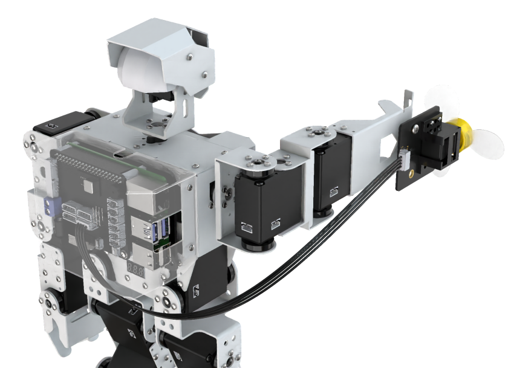

### 1.2 玩法简要说明

我们来看一下本节课程的实现思路：

首先进行缩放画面检测人脸。然后将识别到的人脸坐标转换为未缩放前的坐标，进而判断是否为最大的人脸，并将识别到的人脸框出。

当摄像头识别到人脸后，抬起手臂，风扇对准人脸，开启风扇模块。如果摄像头识别不到人脸，则关闭风扇模块，摄像头上云台舵机进行左右转动来获取人脸。

### 1.3 玩法开启及关闭

:::{Note}
指令输入需严格区分大小写及空格。
:::

1)  将机器人开机，然后通过VNC远程连接树莓派桌面。

2)  点击桌面左上角的图标，打开命令行终端


3)  输入指令，按下回车，则可定位到存放了玩法程序的目录。

```commandline
cd /home/pi/TonyPi/Extend/sensor_course/sensor_development/
```

4. 输入指令，然后按下回车键将玩法启动。

```commandline
python3 face_track_and_fan.py
```

5. 如需关闭此玩法，只需要在LX终端界面中按下"**Ctrl+C**"。如果关闭失败，可多次按下。

### 1.4 功能实现

玩法开启后，机器人左侧机械臂抬起并搜寻人脸，检测到人脸后，风扇转动，没有检测到人脸，风扇停止转动。

### 1.5 程序简要分析

该程序的源代码位于：**/home/pi/TonyPi/Extend/sensor_course/sensor_development/face_track_and_fan.py**

- #### 1.5.1 导入参数模块

| **导入模块** | **作用** |
|:--:|:--:|
| import sys | 导入了Python的sys模块，用于访问系统相关的功能和变量 |
| import cv2 | 导入了OpenCV库，用于图像处理和计算机视觉相关的功能 |
| import time | 导入了Python的time模块，用于时间相关的功能，例如延时操作 |
| import math | math模块提供了对数学运算的底层访问，包含了许多常用的数学函数和常量 |
| import threading | 提供多线程运行的环境 |
| import np | 导入NumPy库，是Python的一个开源数值计算扩展库，用于处理数组和矩阵运算 |
| from hiwonder.PID import PID | 导入PID控制库 |
| from hiwonder import Misc as Misc | 导入了Misc模块，用于处理识别得到的矩形数据 |
| from hiwonder import Board as Board | 导入了Board模块，用机器人舵机、蜂鸣器等外设的控制 |
| import hiwonder.camera as camera | 导入相机库 |
| import hiwonder.ActionGroupControl as AGC | 导入动作组执行库 |
| import hiwonder.yaml_handle | 包含一些与处理YAML格式文件相关的功能或工具 |

- #### 1.5.2 功能逻辑

根据实现效果，梳理该玩法的实现逻辑如下图所示：

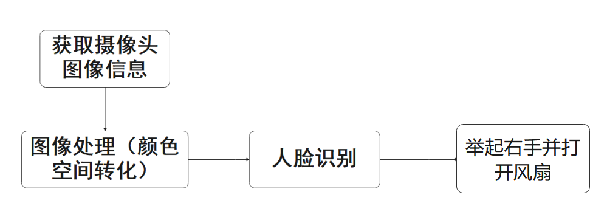

通过摄像头获取图像信息，再进行图像处理，即对图像进行颜色空间转化，方便进行人脸检测。

接着使用mediapipe的人脸模型库对图像进行人脸检测，获取人脸检测结果并调用动作组进行反馈。

- #### 1.5.3 程序逻辑及对应的代码分析

从程序文件梳理得到程序逻辑流程图如下图所示。

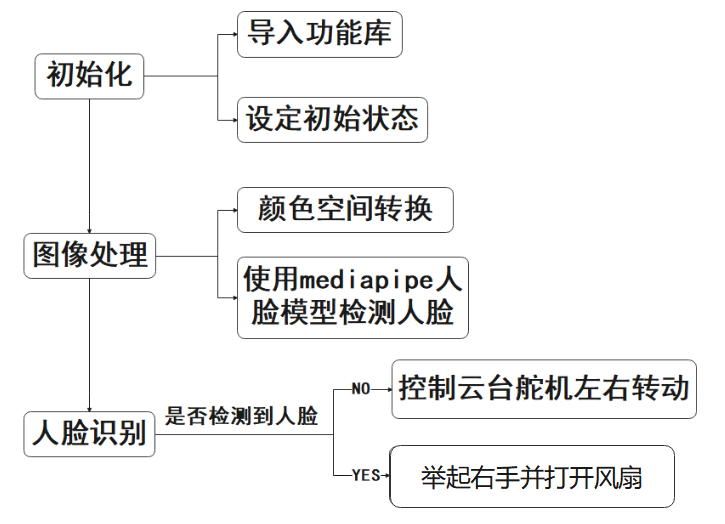

从上图得到，程序的逻辑流程主要为图像处理与人脸识别，以下的文档内容将依照上述程序逻辑流程图进行编写。

1. **初始化**

- 导入功能库

在初始化的这一步，首先就需要将功能库导入进来，方便后续程序的调用，关于导入进来的内容。可以前往5.1导入参数模块进行查看。

```py
import sys
import cv2
import math
import time
import threading
import numpy as np
import mediapipe as mp
import gpiod
import hiwonder.ros_robot_controller_sdk as rrc
from hiwonder.Controller import Controller
import hiwonder.Misc as Misc
import hiwonder.Camera as Camera
import hiwonder.ActionGroupControl as AGC
import hiwonder.yaml_handle as yaml_handle
```

- 设定初始状态

设置初始状态，这里就包括了舵机的初始位置、人脸识别模块、最小人脸置信度等。

```py
# 初始位置
def initMove():
    ctl.set_pwm_servo_pulse(1, 1600, 500)
    ctl.set_pwm_servo_pulse(2, servo2_pulse, 500)
```

```py
#模型位置
modelFile = "/home/pi/TonyPi/models/res10 300x300 _ssd iter 140000 fp16.caffemodel"
configFile ="/home/pi/TonyPi/models/deploy.prototxt'
net = cv2.dnn.readNetFromcaffe(configFile, modelFile)
```

2. **图像处理**

- 颜色空间转换

将BGR图像转换为RGB图像

```py
image_rgb = cv2.cvtColor(img_copy, cv2.COLOR_BGR2RGB) # 将BGR图像转为RGB图像
```

- 使用mediapipe人脸模型识别

进行人脸检测，并在检测到的人脸位置绘制矩形框。然后，根据判断人脸中心的位置是否在画面中心，如果是则将start_greet设置为True,用来执行动作组。

```py
results = face_detection.process(image_rgb) # 将每一帧图像传给人脸识别模块
if results.detections:   # 如果检测不到人脸那就返回None
    for index, detection in enumerate(results.detections): # 返回人脸索引index(第几张脸)，和关键点的坐标信息
        bboxC = detection.location_data.relative_bounding_box # 设置一个边界框，接收所有的框的xywh及关键点信息

        # 将边界框的坐标点,宽,高从比例坐标转换成像素坐标
        bbox = (int(bboxC.xmin * img_w), int(bboxC.ymin * img_h),  
                int(bboxC.width * img_w), int(bboxC.height * img_h))
        cv2.rectangle(img, bbox, (0,255,0), 2)  # 在每一帧图像上绘制矩形框
        x, y, w, h = bbox  # 获取识别框的信息,xy为左上角坐标点
        center_x =  int(x + (w/2))
        if abs(center_x - img_w/2) < img_w/4:
            start_greet = True
```

3. **人脸识别**

如果没有识别到人脸，控制云台舵机左右转动来寻找人脸。

如果识别到人脸，使用 Board.setBusServoPulse函数控制手部舵机举起并打开风扇。

```py
while True:
    ret,img = my_camera.read()
    if ret:
        frame = img.copy()
        # 纠正镜头畸变
        frame = cv2.remap(frame.copy(), mapx, mapy, interpolation=cv2.INTER_LINEAR, borderMode=cv2.BORDER_CONSTANT) 
        Frame = run(frame)           
        cv2.imshow('Frame', Frame)
        key = cv2.waitKey(1)
        if key == 27:
            break
        else:
            time.sleep(0.01)
```

## 2. 能歌善舞

### 2.1 准备工作

本节课需要准备触摸传感器和MP3模块，并将它们安装在机器人肩膀两侧的扩展孔位上（两个元件，安装肩膀方位不限），具体的安装方法可参照本节目录下"**[2.1 安装触摸传感器和MP3模块图文教程]()**"。

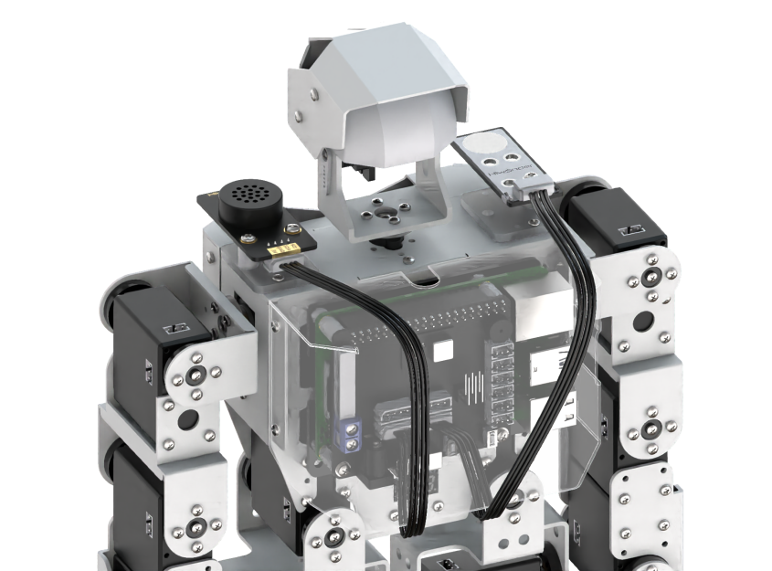

### 2.2 玩法简要说明

我们来看一下本节课程的实现思路：

当触摸传感器的金属面时，控制器接收到的是低电平信号，否则，则为高电平信号。根据这一特性，累加输出低电平的次数，再结合MP3模块，不同的次数触发相应的歌曲和舞蹈。

### 2.3 玩法开启及关闭

:::{Note}
指令输入需严格区分大小写及空格。
:::

1)  将机器人开机，然后通过VNC远程连接树莓派桌面。

2)  点击桌面左上角的图标，打开命令行终端。

3)  输入指令，按下回车，则可定位到存放了玩法程序的目录。

```commandline
cd /home/pi/TonyPi/Extend/sensor_course/sensor_development/
```

4. 输入指令，回车，玩法启动。

```commandline
python3 touch_color_and_mp3.py
```

5. 如需关闭此玩法，只需要在终端界面中按下"**Ctrl+C**"。若关闭失败，可多次按下。

### 2.4 功能实现

玩法开启后，点击机器人肩膀上的触摸传感器，蜂鸣器做出反馈；根据触摸次数的不同，机器人会执行对应的舞蹈和歌曲，如下表所示：

| **触摸次数** | **播放曲目** |
|:------------:|:------------:|
|      1       |    小苹果    |
|      2       |   超级冠军   |
|      3       |    爱出发    |

### 2.5 功能延伸

程序默认播放音乐的音量为30，如需调节音量大小（本节以降低音量至10为例），可参照以下步骤：

1)  输入指令，按下回车，即可定位到存放玩法程序的目录。**/home/pi/TonyPi/Extend/sensor_course/sensor_example/**

2)  输入指令，按下回车，打开玩法程序文件。

```commandline
vim touch_color_and_mp3.py
```

3. 找到如下框出的代码。

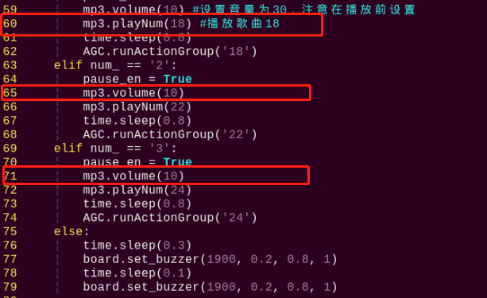

4. 按一下键盘的"**i**"键，当界面左下角出现"**插入**"字样时，表明进入编辑模式。

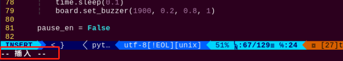

5. 将"**mp3.volume(10)**"中的"1**0**"改为"3**0**"，如下图所示：

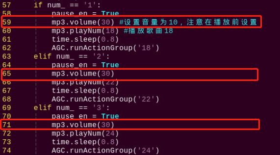

6. 修改完成之后，按一下键盘的"**Esc**"键，再输入指令（注意wq前为冒号：），回车，即可保存修改内容。

```commandline
:wq
```

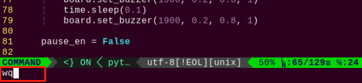

### 2.6 程序简要分析

该程序的源代码位于：**/home/pi/TonyPi/Extend/sensor_course/sensor_development/touch_color_and_mp3.py**

- #### 2.6.1 导入参数模块

| **导入模块** | **作用** |
|:--:|:--:|
| import sys | 导入了Python的sys模块，用于访问系统相关的功能和变量 |
| import cv2 | 导入了OpenCV库，用于图像处理和计算机视觉相关的功能 |
| import time | 导入了Python的time模块，用于时间相关的功能，例如延时操作 |
| import math | math模块提供了对数学运算的底层访问，包含了许多常用的数学函数和常量 |
| import threading | 提供多线程运行的环境 |
| import np | 导入NumPy库，是Python的一个开源数值计算扩展库，用于处理数组和矩阵运算 |
| from hiwonder.PID import PID | 导入PID控制库 |
| from hiwonder import Misc as Misc | 导入了Misc模块，用于处理识别得到的矩形数据 |
| from hiwonder import Board as Board | 导入了Board模块，用机器人舵机、蜂鸣器等外设的控制 |
| import hiwonder.camera as camera | 导入相机库 |
| import hiwonder.ActionGroupControl as AGC | 导入动作组执行库 |
| import hiwonder.yaml_handle | 包含一些与处理YAML格式文件相关的功能或工具 |

- #### 2.6.2 功能逻辑

根据实现效果，梳理该玩法的实现逻辑如下图所示：

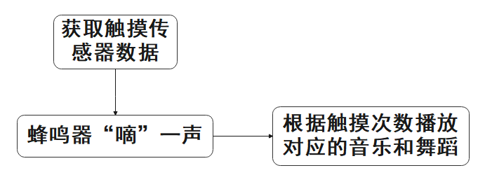

通过获取触摸触感器数据，根据触摸次数控制蜂鸣器和机器人做出对应的反馈。

- #### 2.6.3 程序逻辑及对应的代码分析

从程序文件梳理得到程序逻辑流程图如下图所示。

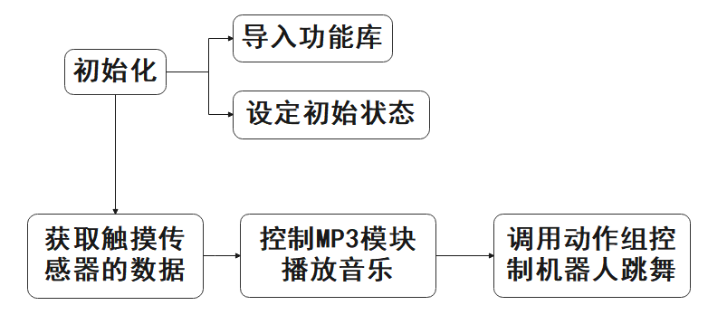

从上图得到，程序的逻辑流程主要为图像处理与人脸识别，以下的文档内容将依照上述程序逻辑流程图进行编写。

1. **初始化**

- 导入功能库

在初始化的这一步，首先就需要将功能库导入进来，方便后续程序的调用，关于导入进来的内容。可以前往6.1导入参数模块进行查看。

```py
import os
import sys
import time
import signal
import threading
import gpiod
import hiwonder.ros_robot_controller_sdk as rrc
from hiwonder.Controller import Controller
import hiwonder.MP3 as MP3
import hiwonder.ActionGroupControl as AGC
import hiwonder.yaml_handle as yaml_handle
```

- 设定初始状态

设置了舵机的初始位置。

```py
# 初始位置
def initMove():
    ctl.set_pwm_servo_pulse(1, 1500, 500)
    ctl.set_pwm_servo_pulse(2, servo_data['servo2'], 500)
```

2. **获取触摸传感器数据**

读取GPIO26号引脚的电平，根据电平信号控制蜂鸣器响，并进行计数。

```py
while move_st:
    touch = touchPin.get_value()   #读取引脚数字值

    if touch:
        state = True

    elif not touch and state:
        num += 1
        state = False
        board.set_buzzer(1900, 0.1, 0.9, 1)    #设置蜂鸣器响
        if num == 1:
            time_wait = True
            time_ = time.time()
            time.sleep(0.1)
```

3. **播放音乐与舞蹈**

根据触摸次数播放对应的歌曲，调用对应动作组控制机器人跳舞。

```py
def move(num_):
    global pause_en
    print(num)
    if num_ == '1':
        pause_en = True
        mp3.volume(30) #设置音量为30，注意在播放前设置
        mp3.playNum(18) #播放歌曲18
        time.sleep(0.8)
        AGC.runActionGroup('18')
    elif num_ == '2':
        pause_en = True
        mp3.volume(30) 
        mp3.playNum(22) 
        time.sleep(0.8)
        AGC.runActionGroup('22')
    elif num_ == '3':
        pause_en = True
        mp3.volume(30) 
        mp3.playNum(24) 
        time.sleep(0.8)
        AGC.runActionGroup('24')
    else:
        time.sleep(0.3)
        board.set_buzzer(1900, 0.2, 0.8, 1) 
        time.sleep(0.1)
        board.set_buzzer(1900, 0.2, 0.8, 1) 

        pause_en = False
```


## 3. 躲避障碍

### 3.1 准备工作

本节课需要准备超声波模块，并将其安装至机器人左侧手臂的扩展孔位上，具体的安装方法可参照本节目录下"**[3.1安装超声波传感器图文教程]()**"。

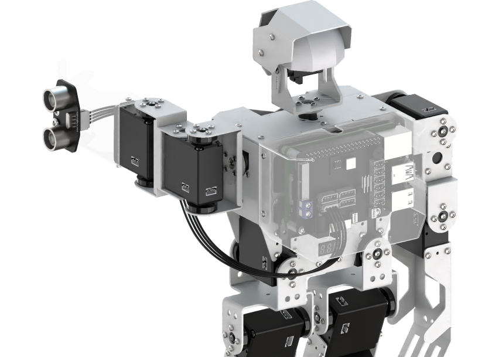

### 3.2 玩法简要说明

本节课程的实现思路如下：

首先通过超声波模块检测与前方障碍物的距离，然后设置超声波测距阈值，当满足条件后，机器人就自动避障，否则直接前进。

### 3.3 玩法开启及关闭

:::{Note}
指令输入需严格区分大小写及空格。
:::

1)  将机器人开机，然后通过VNC远程连接树莓派桌面。
2)  点击桌面左上角的图标，打开命令行终端， 输入指令，按下回车，则可定位到存放了玩法程序的目录。

```commandline
cd /home/pi/TonyPi/Extend/sensor_course/sensor_development/
```

3. 输入指令，然后按下回车键将玩法启动。

```commandline
python3 sonar_barrier.py
```

4. 如需关闭此玩法，只需要在LX终端界面中按下"**Ctrl+C**"。如果关闭失败，可多次按下。

### 3.4 功能实现

玩法开启后，如果超声波与前方物体的距离小于等于30cm，判定是障碍物。机器人抬起左手，检测前方是否有障碍物。如果没有，机器人前进；如果有，检测机器人左右两边情况控制机器人运动。

### 3.5 功能延伸

程序默认超声波避障的距离为300mm，如需修改距离数值（本节将距离设为100mm为例说明），可参考以下步骤：

1)  输入指令，按下回车，则可定位到存放了玩法程序的目录。

```commandline
cd /home/pi/TonyPi/Extend/sensor_course/sensor_development/
```

2. 输入指令,按下回车，打开玩法程序文件。

```commandline
vim sonar_barrier.py
```

3. 在打开的程序界面找到如下图框出的代码。

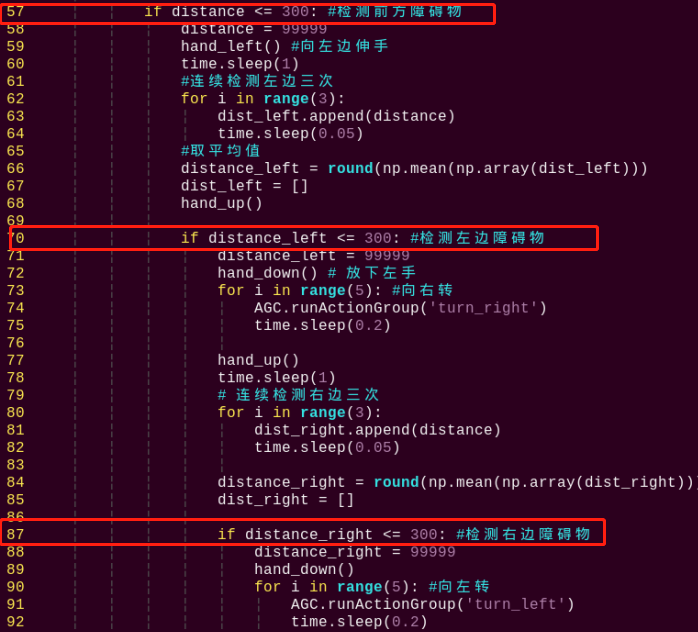

4. 按一下键盘上的"**i**"键，当出现"**插入**"字样时表示已进入编辑模式。

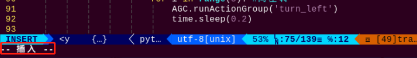

5. 将"**if distance \<= 300**"中的"**300**"修改为"**100**"，如下图所示：


6. 修改完之后，按一下键盘的"**Esc**"键，再依次输入指令（注意wq前为冒号：），即可保存并退出。

```commandline
:wq
```

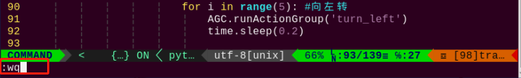

### 3.6 程序简要分析

该程序的源代码位于：**home/pi/TonyPi/Extend/sensor_course/sensor_development/sonar_barrier.py**

- #### 3.6.1 导入参数模块

| **导入模块** | **作用** |
|:--:|:--:|
| import sys | 导入了Python的sys模块，用于访问系统相关的功能和变量 |
| import cv2 | 导入了OpenCV库，用于图像处理和计算机视觉相关的功能 |
| import time | 导入了Python的time模块，用于时间相关的功能，例如延时操作 |
| import math | math模块提供了对数学运算的底层访问，包含了许多常用的数学函数和常量 |
| import threading | 提供多线程运行的环境 |
| import np | 导入NumPy库，是Python的一个开源数值计算扩展库，用于处理数组和矩阵运算 |
| from hiwonder.PID import PID | 导入PID控制库 |
| from hiwonder import Misc as Misc | 导入了Misc模块，用于处理识别得到的矩形数据 |
| from hiwonder import Board as Board | 导入了Board模块，用机器人舵机、蜂鸣器等外设的控制 |
| import hiwonder.camera as camera | 导入相机库 |
| import hiwonder.ActionGroupControl as AGC | 导入动作组执行库 |
| import hiwonder.yaml_handle | 包含一些与处理YAML格式文件相关的功能或工具 |

- #### 3.6.2 功能逻辑

根据实现效果，梳理该玩法的实现逻辑如下图所示：

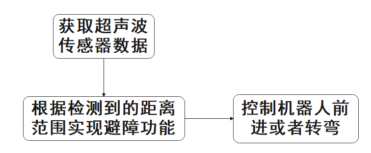

通过获取超声波传感器数据，根据检测的距离控制机器人做出避障行为。

- #### 3.6.3 程序逻辑及对应的代码分析

从程序文件梳理得到程序逻辑流程图如下图所示。

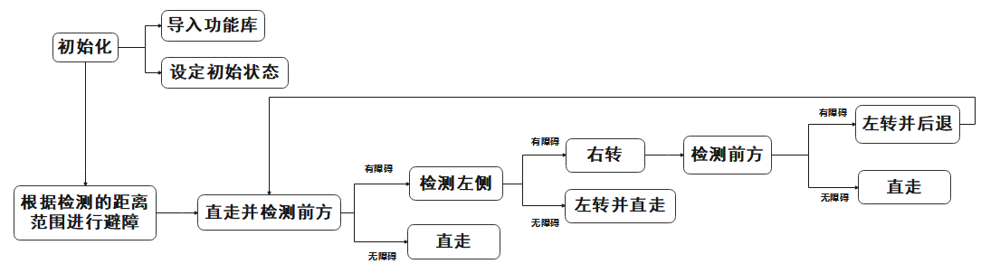

从上图得到，程序的逻辑流程主要为获取检测到的距离数据与机器人控制，以下的文档内容将依照上述程序逻辑流程图进行编写。

1. **初始化**

- 导入功能库

在初始化的这一步，首先就需要将功能库导入进来，方便后续程序的调用，关于导入进来的内容。可以前往6.1导入参数模块进行查看。

```py
import os
import sys
import time
import threading
import numpy as np
import hiwonder.ros_robot_controller_sdk as rrc
from hiwonder.Controller import Controller
import hiwonder.Sonar as Sonar
import hiwonder.ActionGroupControl as AGC
```

- 设定初始状态

设置了机器人的初始位置。

```py
AGC.runActionGroup('stand_slow')
```

设置了机器人的一些基础动作。

```py
# 抬起左手
def hand_up():
    ctl.set_bus_servo_pulse(8, 330, 1000)
    time.sleep(0.3)
    ctl.set_bus_servo_pulse(7,860,1000)
    ctl.set_bus_servo_pulse(6,860,1000)
    time.sleep(1)
# 放下左手
def hand_down():
    ctl.set_bus_servo_pulse(7,800,1000)
    ctl.set_bus_servo_pulse(6,575,1000)
    time.sleep(0.3)
    ctl.set_bus_servo_pulse(8,725,1000)
    time.sleep(1)
# 向左边伸手
def hand_left():
    ctl.set_bus_servo_pulse(8,330,1000)
    time.sleep(0.3)
    ctl.set_bus_servo_pulse(7,420,1000)
    ctl.set_bus_servo_pulse(6,920,1000)
    time.sleep(1)
```

2. **获取超声波传感器数据**

读取超声波传感器识别到的距离，连续检测六次储存在列表中并取平均值。

```py
distance_list.append(s.getDistance())

#连续检测6次，取平均值
if len(distance_list) >= 6: 
    distance = int(round(np.mean(np.array(distance_list))))
    print(distance, 'mm')
    distance_list = []
```

3. **躲避障碍**

当检测到前方障碍物时，机器人会先向左转并伸出手臂，接着连续检测左侧距离。如果发现左侧有障碍物，机器人会向右转避让；如果右侧也有障碍物，机器人会倒退躲避；最后机器人抬起手臂继续前进。

```py
while True:
    if distance != 99999:
        if distance <= 300: #检测前方障碍物
            distance = 99999
            hand_left() #向左边伸手
            time.sleep(1)
            #连续检测左边三次
            for i in range(3):
                dist_left.append(distance)
                time.sleep(0.05)
                #取平均值
                distance_left = round(np.mean(np.array(dist_left)))
                dist_left = []
                hand_up()

                if distance_left <= 300: #检测左边障碍物
                    distance_left = 99999
                    hand_down() # 放下左手
                    for i in range(5): #向右转
                        AGC.runActionGroup('turn_right')
                        time.sleep(0.2)

                        hand_up()
                        time.sleep(1)
                        # 连续检测右边三次
                        for i in range(3):
                            dist_right.append(distance)
                            time.sleep(0.05)

                            distance_right = round(np.mean(np.array(dist_right)))
                            dist_right = []

                            if distance_right <= 300: #检测右边障碍物
                                distance_right = 99999
                                hand_down()
                                for i in range(5): #向左转
                                    AGC.runActionGroup('turn_left')
                                    time.sleep(0.2)

                                    for i in range(5):#后退
                                        AGC.runActionGroup('back')
                                        hand_up()
                                    else: #右边没有障碍物,则直走,前面已经右转
                                        AGC.runActionGroup('go_hand_up')            
                                    else: #左边没有障碍物,则向左转
                                        hand_down()
                                        for i in range(5):
                                            AGC.runActionGroup('turn_left')
                                            time.sleep(0.2)
                                            hand_up()
                                        else:#前方没有障碍物,则直走
                                            AGC.runActionGroup('go_hand_up')
                                        else:   
                                            time.sleep(0.01)
```

## 4. 形状识别

### 4.1 准备工作

本节课需要准备点阵模块，并将它安装在机器人左侧手臂的扩展孔位上，具体的安装方法可参照本节目录下"**[4.1安装点阵模块图文教程]()**"文档。

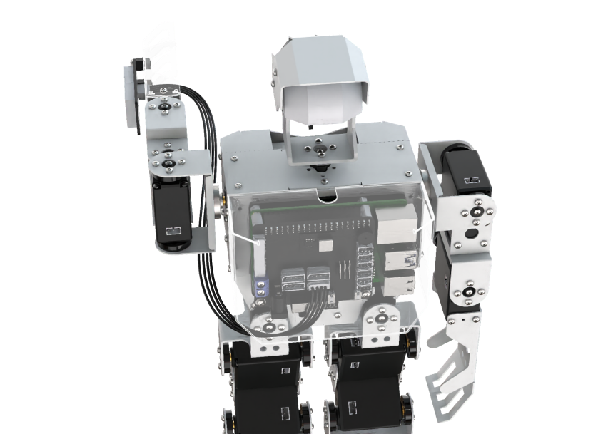

### 4.2 玩法简要说明

本节课程的实现思路如下所示：

摄像头对识别范围内的物体进行识别，当识别到物体的形状为三角形、矩形和圆形后，点阵模块显示当前物体的图形形状，否则点阵模块不显示。

### 4.3 玩法开启及关闭

:::{Note}
指令输入需严格区分大小写及空格。
:::

1)  将机器人开机，然后通过VNC远程连接树莓派桌面。
2)  点击桌面左上角的图标，打开命令行终端 ， 输入指令，按下回车，则可定位到存放了玩法程序的目录。

```commandline
cd /home/pi/TonyPi/Extend/sensor_course/sensor_development/
```

3. 输入指令，然后按下回车键将玩法启动。

```commandline
python3 shape_recognition.py
```

4. 如需关闭此玩法，只需要在LX终端界面中按下"**Ctrl+C**"。如果关闭失败，可多次按下。

### 4.4 功能实现

玩法开启后，机器人摄像头对物体进行识别，检测到三角形、矩形和圆形物体后，点阵模块显示对应形状；否则不显示。

### 4.5 程序简要分析

该程序的源代码位于：**/home/pi/TonyPi/Extend/sensor_course/sensor_development/shape_recognition.py**

- #### 4.5.1 导入参数模块

| **导入模块** | **作用** |
|:--:|:--:|
| import sys | 导入了Python的sys模块，用于访问系统相关的功能和变量 |
| import cv2 | 导入了OpenCV库，用于图像处理和计算机视觉相关的功能 |
| import time | 导入了Python的time模块，用于时间相关的功能，例如延时操作 |
| import math | math模块提供了对数学运算的底层访问，包含了许多常用的数学函数和常量 |
| import threading | 提供多线程运行的环境 |
| import np | 导入NumPy库，是Python的一个开源数值计算扩展库，用于处理数组和矩阵运算 |
| from hiwonder.PID import PID | 导入PID控制库 |
| from hiwonder import Misc as Misc | 导入了Misc模块，用于处理识别得到的矩形数据 |
| from hiwonder import Board as Board | 导入了Board模块，用机器人舵机、蜂鸣器等外设的控制 |
| import hiwonder.camera as camera | 导入相机库 |
| import hiwonder.ActionGroupControl as AGC | 导入动作组执行库 |
| import hiwonder.yaml_handle | 包含一些与处理YAML格式文件相关的功能或工具 |

- #### 4.5.2 功能逻辑

根据实现效果，梳理该玩法的实现逻辑如下图所示：

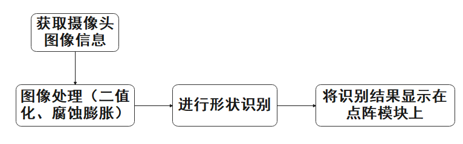

通过处理摄像头获取的图像，将形状识别后的结果在点阵模块上显示出来。

- #### 4.5.3 程序逻辑及对应的代码分析

从程序文件梳理得到程序逻辑流程图如下图所示。


从上图得到，程序的逻辑流程主要为图像处理与点阵显示，以下的文档内容将依照上述程序逻辑流程图进行编写。

1. **初始化**

- 导入功能库

在初始化的这一步，首先就需要将功能库导入进来，方便后续程序的调用，关于导入进来的内容。可以前往6.1导入参数模块进行查看。

```py
import sys
import cv2
import math
import time
import signal
import threading
import numpy as np
import hiwonder.ros_robot_controller_sdk as rrc
from hiwonder.Controller import Controller
from hiwonder import dot_matrix_sensor
import hiwonder.Camera as Camera
import hiwonder.ActionGroupControl as AGC
import hiwonder.yaml_handle as yaml_handle
```

- 设定初始状态

设置了机器人的初始位置。

```py
# 初始位置
def inidmsove():
    ctl.set_pwm_servo_pulse(1, 1350, 500)
    ctl.set_pwm_servo_pulse(2, servo_data['servo2'], 500)
```

**图像处理**

将获取到的图像转换到LAB空间前，需要对图像进行减噪处理，接着使用GaussianBlur()函数进行高斯滤波使用inRange函数对输入图像进行二值化处理，为了降低干扰，让图像更加平滑，需要进行腐蚀和膨胀处理，最后将图像中最大轮廓面积找出来。

```py
ret, img = my_camera.read()
if ret:
    img_copy = img.copy()
    img_h, img_w = img.shape[:2]
    frame_gb = cv2.GaussianBlur(img_copy, (3, 3), 3)      
    frame_lab = cv2.cvtColor(frame_gb, cv2.COLOR_BGR2LAB)  # 将图像转换到LAB空间
    max_area = 0
    color_area_max = None    
    areaMaxContour_max = 0

    if action_finish:
        for i in lab_data:
            if i != 'white' and i != 'black':
                frame_mask = cv2.inRange(frame_lab,
                                         (lab_data[i]['min'][0],
                                          lab_data[i]['min'][1],
                                          lab_data[i]['min'][2]),
                                         (lab_data[i]['max'][0],
                                          lab_data[i]['max'][1],
                                          lab_data[i]['max'][2]))  #对原图像和掩模进行位运算
                opened = cv2.morphologyEx(frame_mask, cv2.MORPH_OPEN, np.ones((6,6),np.uint8))  #开运算
                closed = cv2.morphologyEx(opened, cv2.MORPH_CLOSE, np.ones((6,6),np.uint8)) #闭运算
                contours = cv2.findContours(closed, cv2.RETR_EXTERNAL, cv2.CHAIN_APPROX_NONE)[-2]  #找出轮廓
                areaMaxContour, area_max = getAreaMaxContour(contours)  #找出最大轮廓
                if areaMaxContour is not None:
                    if area_max > max_area:#找最大面积
                        max_area = area_max
                        color_area_max = i
                        areaMaxContour_max = areaMaxContour
```

2. **形状识别**

使用轮廓近似方法 cv2.approxPolyDP() 进行形状识别，将识别出的形状的边数（顶点数）添加到 shape_list 列表中当 shape_list 中积累了 30 个形状的边数时，计算它们的平均值，并打印输出。

```py
if max_area > 200:                   
    cv2.drawContours(img, areaMaxContour_max, -1, (0, 0, 255), 2)
    # 识别形状
    # 周长  0.035 根据识别情况修改，识别越好，越小
    epsilon = 0.035 * cv2.arcLength(areaMaxContour_max, True)
    # 轮廓相似
    approx = cv2.approxPolyDP(areaMaxContour_max, epsilon, True)
    shape_list.append(len(approx))
    if len(shape_list) == 30:
        shape_length = int(round(np.mean(shape_list)))                            
        shape_list = []
        print(shape_length)
```

3. **结果显示**

根据先前识别到的物体形状（shape_length）进行条件判断，并在显示屏上显示相应的形状。

```py
while move_st:
    if shape_length == 3:
        print('三角形')
        ## 显示'三角形'            
        dms.display_buf = (0x01, 0x03, 0x05, 0x09, 0x11, 0x21, 0x41, 0x81,
                           0x41, 0x21, 0x11, 0x09, 0x05, 0x03, 0x01, 0x00)
        dms.update_display()

    elif shape_length == 4:
        print('矩形')
        ## 显示'矩形'
        dms.display_buf = (0x00, 0x00, 0x00, 0x00, 0xff, 0x81, 0x81, 0x81,
                           0x81, 0x81, 0x81,0xff, 0x00, 0x00, 0x00, 0x00)
        dms.update_display()

    elif shape_length >= 6:           
        print('圆')
        ## 显示'圆形'
        dms.display_buf = (0x00, 0x00, 0x00, 0x00, 0x1c, 0x22, 0x41, 0x41,
                           0x41, 0x22, 0x1c,0x00, 0x00, 0x00, 0x00, 0x00)
        dms.update_display()

    else:
        ## 清屏
        dms.display_buf = [0] * 16
        dms.update_display()
        print('None')
```

## 5. 智能补光

### 5.1 准备工作

本节课需要准备光线传感器和超声波模块，将光线传感器安装在机器人任一肩膀的扩展孔位上，将超声波模块安装在左侧手臂的扩展孔位上，具体的安装方法可参照本节目录下"**[传感器的安装和接线方法]()**"文档。

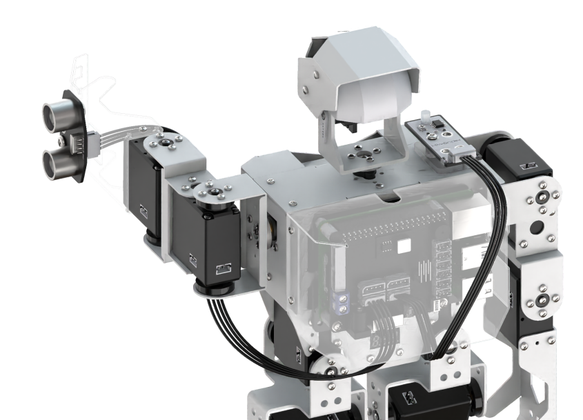

### 5.2 玩法简要说明

我们来看一下本节课程的实现思路：

在开启视觉识别的情景下，当光线传感器检测到外界光线较暗后，超声波模块发出白光进行补光，否则超声波模块关闭补光。

### 5.3 玩法开启及关闭

:::{Note}
指令输入需严格区分大小写及空格。
:::

1)  将机器人开机，然后通过VNC远程连接树莓派桌面。
2)  点击桌面左上角的图标，打开命令行终端 ， 输入指令，按下回车，则可定位到存放了玩法程序的目录。

```commandline
cd /home/pi/TonyPi/Extend/sensor_course/sensor_development/
```

3. 输入指令，然后按下回车键将玩法启动。

```commandline
python3 photo_sensor_demo.py
```

4. 如需关闭此玩法，只需要在LX终端界面中按下"**Ctrl+C**"。如果关闭失败，可多次按下。

### 5.4 功能实现

玩法开启后，机器人抬起左侧手臂，并对视觉范围内的标签卡片进行识别。当周围灯光环境变暗时，蜂鸣器响起"**滴**"的一声，同时超声波模块发出白光进行补光，让机器人在黑暗环境下也能够识别标签卡片。

### 5.5 功能延伸

<p id="anchor_5_5_1"></p>

- #### 5.5.1 修改补光灯光

光线较暗后，超声波模块发出白光进行补光，可以修改超声波模块发光颜色和亮度，步骤如下：

1)  输入指令，按下回车，则可定位到存放了玩法程序的目录。

```commandline
cd /home/pi/TonyPi/Extend/sensor_course/sensor_development/
```

2)  输入指令进入程序编辑界面。

```commandline
vim photo_sensor_demo.py
```

3)  在打开的界面中找到如下图所示代码。

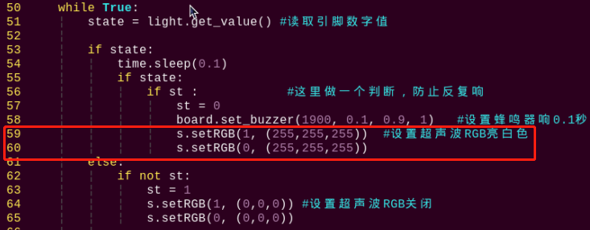

4)  按下"**i**"键，进入插入模式。

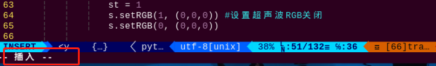

5)  将"**(255,255,255)**"改为"**(255,0,0)**"（3个参数范围都是0-255），如下图所示：

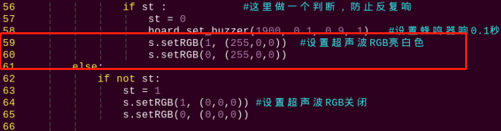

6. 按下"**Esc**"，然后按下"**shift+:**"，输入指令（注意wq前为冒号：），回车，即可保存并退出。

```commandline
:wq
```

7. 再次输入指令，重新运行这个玩法，观察演示效果。

```commandline
python3 photo_sensor_demo.py
```

- #### 5.5.2 修改声音长短

开启玩法后，如光线较暗，蜂鸣器则响起"**滴**"的提示音，提示音的发声长短可通过修改程序来实现，步骤如下：

1)  参考"[修改补光灯光](#anchor_5_5_1)"步骤（1）、（2），进入程序编辑界面。找到如下图框出代码。

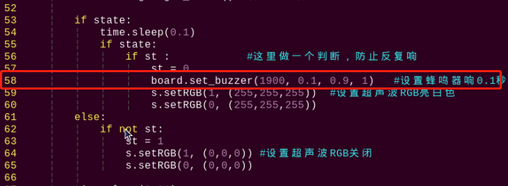

2)  参考"[修改补光灯光](#anchor_5_5_1)"步骤（4），将"**0.1**"改为"**0.3**"，如下图所示。

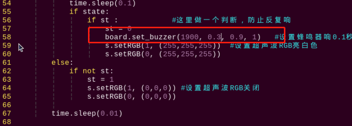

3)  参照"[修改补光灯光](#anchor_5_5_1)"的步骤（5），保存并退出，再次输入指令重新运行这个玩法，观察演示效果。

```commandline
python3 photo_sensor_demo.py
```

- #### 5.5.3 灵敏度调节

在体验本节玩法过程中，若因光线传感器灵敏度问题影响实现效果，可通过旋转传感器上的电位器来调节灵敏度，方法如下：

1)  找到调节灵敏度的电位器，其在传感器上的位置如下图所示：

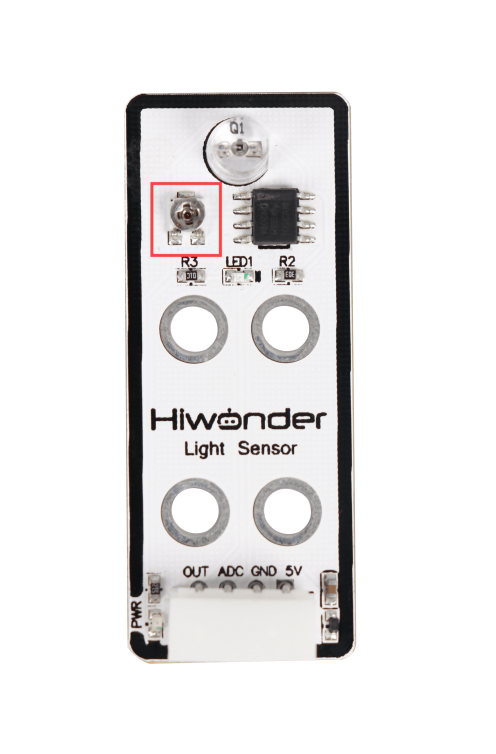

2)  通过螺丝刀来旋转电位器，同时观察LED1的亮灭，当LED1介于亮与灭之间的临界点时，就表示传感器处与当前阈值时反应最灵敏。

### 5.6 程序简要分析

该程序的源代码位于：**home/pi/TonyPi/Extend/sensor_course/sensor_development/photo_sensitive_control.py**

- #### 5.6.1 导入参数模块

| **导入模块** | **作用** |
|:--:|:--:|
| import sys | 导入了Python的sys模块，用于访问系统相关的功能和变量 |
| import cv2 | 导入了OpenCV库，用于图像处理和计算机视觉相关的功能 |
| import time | 导入了Python的time模块，用于时间相关的功能，例如延时操作 |
| import math | math模块提供了对数学运算的底层访问，包含了许多常用的数学函数和常量 |
| import threading | 提供多线程运行的环境 |
| import np | 导入NumPy库，是Python的一个开源数值计算扩展库，用于处理数组和矩阵运算 |
| from hiwonder.PID import PID | 导入PID控制库 |
| from hiwonder import Misc as Misc | 导入了Misc模块，用于处理识别得到的矩形数据 |
| from hiwonder import Board as Board | 导入了Board模块，用机器人舵机、蜂鸣器等外设的控制 |
| import hiwonder.camera as camera | 导入相机库 |
| import hiwonder.ActionGroupControl as AGC | 导入动作组执行库 |
| import hiwonder.yaml_handle | 包含一些与处理YAML格式文件相关的功能或工具 |

- #### 5.6.2 功能逻辑

根据实现效果，梳理该玩法的实现逻辑如下图所示：

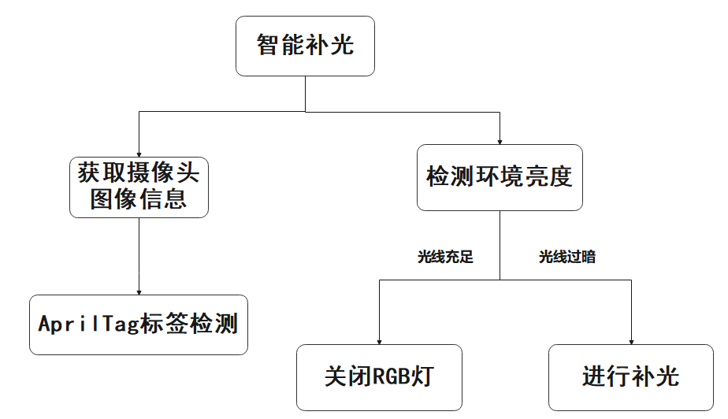

通过进行标签检测以及在光线不足的情况下进行补光。

- #### 5.6.3 程序逻辑及对应的代码分析

从程序文件梳理得到程序逻辑流程图如下图所示。

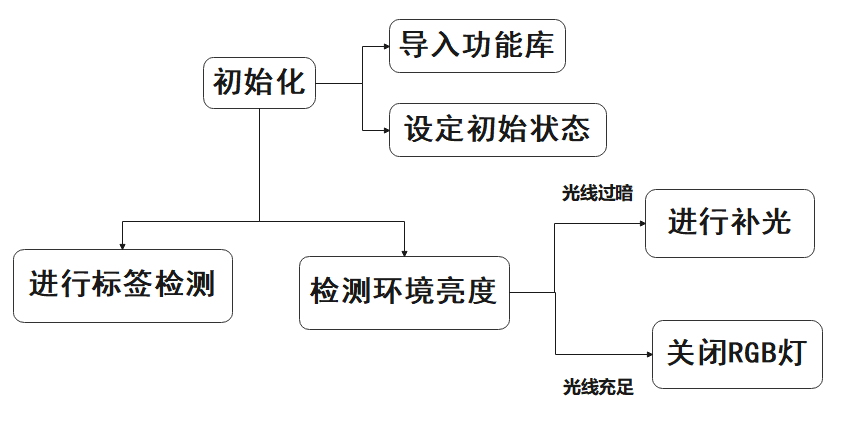

从上图得到，程序的逻辑流程主要为获取检测到的距离数据与机器人控制，以下的文档内容将依照上述程序逻辑流程图进行编写。

1. **初始化**

- 导入功能

在初始化的这一步，首先就需要将功能库导入进来，方便后续程序的调用，关于导入进来的内容。可以前往6.1导入参数模块进行查看。

```py
import os
import sys
import cv2
import math
import time
import threading
import numpy as np
import gpiod
import hiwonder.ros_robot_controller_sdk as rrc
from hiwonder.Controller import Controller
import hiwonder.Camera as Camera
import hiwonder.Sonar as Sonar
import hiwonder.apriltag as apriltag
import hiwonder.ActionGroupControl as AGC
import hiwonder.yaml_handle as yaml_handle
```

- 设定初始状态

设置了机器人的初始位置。

```py
# 初始位置
def initMove():
    ctl.set_pwm_servo_pulse(1, 1500, 500)
    ctl.set_pwm_servo_pulse(2, servo_data['servo2'], 500)
    AGC.runActionGroup('lift_up')
```

2. **apriltag标签检测**

定义了一个函数 apriltagDetect，用于检测图像中的 AprilTag 标签，并返回检测到的标签信息。

使用 AprilTag 检测器在灰度图像上检测标签，返回检测到的标签列表，包含标签的 tag_family、tag_id、中心点坐标 objective_x 和 objective_y

```py
def apriltagDetect(img):   
    gray = cv2.cvtColor(img, cv2.COLOR_BGR2GRAY)
    detections = detector.detect(gray, return_image=False)

    if len(detections) != 0:
        for detection in detections:                       
            corners = np.int0(detection.corners)  # 获取四个角点
            cv2.drawContours(img, [np.array(corners, int)], -1, (0, 255, 255), 2)

            tag_family = str(detection.tag_family, encoding='utf-8')  # 获取tag_family
            tag_id = int(detection.tag_id)  # 获取tag_id

            objective_x, objective_y = int(detection.center[0]), int(detection.center[1])  # 中心点

            object_angle = int(math.degrees(math.atan2(corners[0][1] - corners[1][1], corners[0][0] - corners[1][0])))  # 计算旋转角

            return [tag_family, tag_id, objective_x, objective_y]
```

3. **智能补光**

move 函数持续检测 GPIO 引脚 24 的状态，当检测到高电平时，蜂鸣器响起并且 RGB 灯变为白色；当检测到低电平时，关闭蜂鸣器并且 RGB 灯熄灭。这个过程通过 st 变量来防止蜂鸣器反复响起。

```py
def move():
    global st
    while True:
        state = light.get_value() #读取引脚数字值
        if state:
            time.sleep(0.1)
            if state:
                if st:            #这里做一个判断，防止反复响
                    st = 0
                    board.set_buzzer(1900, 0.1, 0.9, 1)   #设置蜂鸣器响0.1秒
                    s.setRGB(1, (255,255,255))  #设置超声波RGB亮白色
                    s.setRGB(0, (255,255,255))
         else:
             if not st:
                st = 1
                s.setRGB(1, (0,0,0)) #设置超声波RGB关闭
                s.setRGB(0, (0,0,0))

         time.sleep(0.01)
```

## 6. 口罩识别

### 6.1 准备工作

本节需要准备MP3模块，并将模块安装在机器人任一肩膀的扩展孔位上，具体的安装方法可参照本节目录下"**[安装MP3模块图文教程]()**"文档。


### 6.2 玩法简要说明

我们来看一下本节课程的实现思路：

首先进行缩放画面检测人脸。然后将识别到的人脸坐标转换为未缩放前的坐标，进而判断是否为最大的人脸，并将识别到的人脸框出。

如果识别到人脸，但未佩戴口罩，MP3模块将播报"**未戴口罩，请戴好口罩**"；如果识别到人脸，并有佩戴口罩，MP3模块播报"**已戴口罩，请通行**"。

### 6.3 玩法开启及关闭

:::{Note}
指令输入需严格区分大小写及空格。
:::

1)  将机器人开机，然后通过VNC远程连接树莓派桌面。
2)  点击桌面左上角的图标，打开命令行终端 ， 输入指令，按下回车，则可定位到存放了玩法程序的目录。

```commandline
cd /home/pi/TonyPi/Extend/sensor_course/sensor_development/
```

3. 输入指令，然后按下回车键将玩法启动。

```commandline
python3 mask_detect.py
```

4. 如需关闭此玩法，只需要在LX终端界面中按下"**Ctrl+C**"。如果关闭失败，可多次按下。

### 6.4 功能实现

玩法开启后，机器人开始搜寻人脸。如果找到人脸，但没有带口罩，MP3模块播报"**未戴口罩，请戴好口罩**"；如果找到人脸，并且有带口罩，MP3模块播报"**已戴口罩，请通行**"。

### 6.5 功能延伸

- #### 6.5.1 修改声音大小

我们通过MP3模块来播报语音，可按照以下步骤来修改声音的大小。

1)  输入指令，按下回车，则可定位到存放了玩法程序的目录。

```commandline
cd /home/pi/TonyPi/Extend/sensor_course/sensor_development/
```

2)  输入指令，按下回车，进入程序编辑界面。

```commandline
vim mask_detect.py
```

3)  在打开的界面中找到如下图所框出的代码。

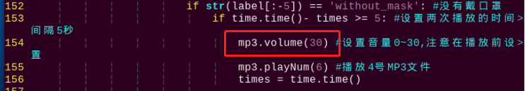

4)  按下"**i**"键，进入编辑模式，将"**mp3.volume(30)**"内的"**30**"改为"**20**"。（范围为0-30），如下图所示。

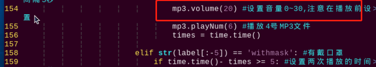

5)  先按下"**Esc**"，然后依次输入指令（注意wq前为冒号：），回车，即可保存并退出。

```commandline
:wq
```

6. 再次输入指令并按下回车，重新运行这个玩法，观察演示效果。

```commandline
python3 mask_detect.py
```

- #### 6.5.2 修改播放语音

本节玩法是通过MP3模块来播报语音的。使用时，需先将语音文件设置为MP3格式。可将MP3模块上的SD卡取下，添加其他MP3文件，下图为出厂MP3模块自带语音文件。

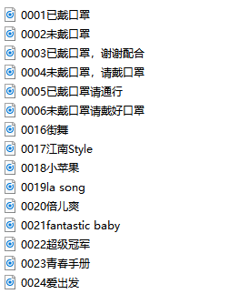

如需修改播放内容，可参照以下方法，步骤如下：

1)  参考"[5.1 修改声音大小](#_5.1 修改声音大小)"步骤（1）（2）（3）（4），进入编辑界面，找到如下图所示代码，将序号为6号和5号的MP3文件更改为4号和3号文件，如下图所示：

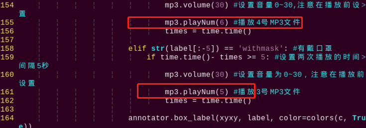

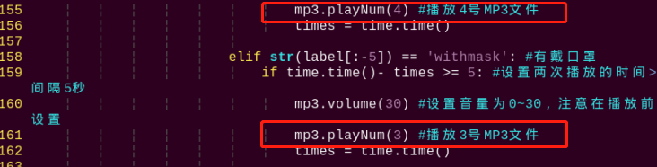

2)  先按下"**Esc**"，然后输入指令（注意wq前为冒号：），回车即可保存并退出。


```commandline
:wq
```

3. 再次输入指令，按回车重新运行玩法，观察演示的效果。

```commandline
python3 mask_detect.py
```

### 6.6 程序简要分析

该程序的源代码位于： **/home/pi/TonyPi/Extend/sensor_course/sensor_development/mask_detect.py**

- #### 6.6.1 导入参数模块

| **导入模块** | **作用** |
|:--:|:--:|
| import sys | 导入了Python的sys模块，用于访问系统相关的功能和变量 |
| import cv2 | 导入了OpenCV库，用于图像处理和计算机视觉相关的功能 |
| import time | 导入了Python的time模块，用于时间相关的功能，例如延时操作 |
| import math | math模块提供了对数学运算的底层访问，包含了许多常用的数学函数和常量 |
| import threading | 提供多线程运行的环境 |
| import np | 导入NumPy库，是Python的一个开源数值计算扩展库，用于处理数组和矩阵运算 |
| from hiwonder.PID import PID | 导入PID控制库 |
| from hiwonder import Misc as Misc | 导入了Misc模块，用于处理识别得到的矩形数据 |
| from hiwonder import Board as Board | 导入了Board模块，用机器人舵机、蜂鸣器等外设的控制 |
| import hiwonder.camera as camera | 导入相机库 |
| import hiwonder.ActionGroupControl as AGC | 导入动作组执行库 |
| import hiwonder.yaml_handle | 包含一些与处理YAML格式文件相关的功能或工具 |

- #### 6.6.2 功能逻辑

根据实现效果，梳理该玩法的实现逻辑如下图所示：

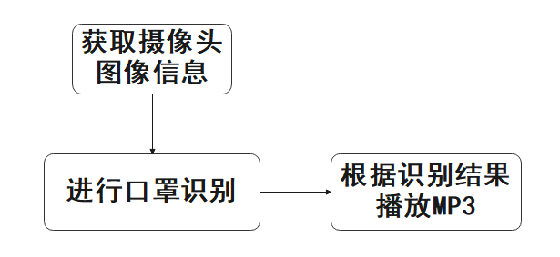

通过进行标签检测以及在光线不足的情况下进行补光。

- #### 6.6.3 程序逻辑及对应的代码分析

从程序文件梳理得到程序逻辑流程图如下图所示。

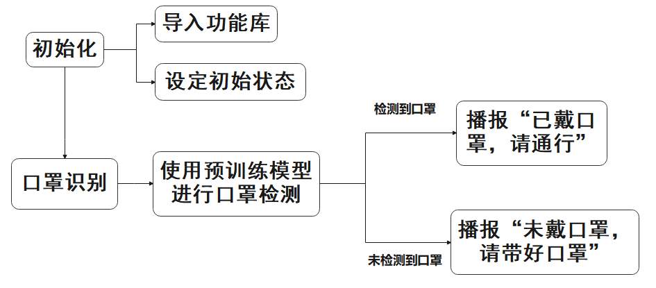

从上图得到，程序的逻辑流程主要为获取检测到的距离数据与机器人控制，以下的文档内容将依照上述程序逻辑流程图进行编写。

1. **初始化**

- 导入功能

在初始化的这一步，首先就需要将功能库导入进来，方便后续程序的调用，关于导入进来的内容。可以前往6.1导入参数模块进行查看。

```py
import os
import cv2
import sys
import time
import torch
import argparse
import numpy as np
from pathlib import Path
import hiwonder.ActionGroupControl as AGC
import hiwonder.yaml_handle as yaml_handle
import hiwonder.ros_robot_controller_sdk as rrc
from hiwonder.Controller import Controller
import torch.backends.cudnn as cudnn
from utils.plots import Annotator, colors
from models.experimental import attempt_load
from utils.datasets import LoadImages, LoadStreams
from utils.torch_utils import load_classifier, select_device, time_sync
from utils.general import apply_classifier, check_img_size, check_imshow, \
	check_requirements, check_suffix, colorstr, increment_path, non_max_suppression, \
	print_args, save_one_box, scale_coords, set_logging, strip_optimizer, xyxy2xywh

```

- 设定初始状态

设置了机器人的初始位置。

```py
# 初始位置
def initMove():
    ctl.set_pwm_servo_pulse(1,1800,500)
    ctl.set_pwm_servo_pulse(2,servo_data['servo2'],500)
    AGC.runActionGroup('stand_slow')
```

2. **口罩识别**

- 初始化

初始化日志记录和设备选择（CPU或GPU），如果设备不是 CPU，设置使用半精度（FP16）以加速推理

```py
# 初始化
set_logging()
device = select_device(device)
half &= device.type != 'cpu'  # 半精度仅支持CUDA
```

- 加载权重文件

加载权重文件，根据文件后缀判断使用何种模型。如果使用 .pt 文件，则加载 PyTorch 模型，并提取类名和步幅信息。如果需要，加载二级分类器。

```py
# 加载权重文件
w = str(weights[0] if isinstance(weights, list) else weights)
classify, suffix, suffixes = False, Path(w).suffix.lower(), ['.pt', '.onnx', '.tflite', '.pb', '']
check_suffix(w, suffixes)  # 检查权重是否有可接受的后缀
pt, onnx, tflite, pb, saved_model = (suffix == x for x in suffixes)  # 后端布尔值
stride, names = 64, [f'class{i}' for i in range(1000)]  # 设置默认值
if pt:
    model = torch.jit.load(w) if 'torchscript' in w else attempt_load(weights, map_location=device)
    stride = int(model.stride.max())
    names = model.module.names if hasattr(model, 'module') else model.names  # 得到类名
    if half:
        model.half() 
        if classify:  # 二级分类器
            modelc = load_classifier(name='resnet50', n=2)
            modelc.load_state_dict(torch.load('resnet50.pt', map_location=device)['model']).to(device).eval()

            imgsz = check_img_size(imgsz, s=stride)  # 检查图像大小
```

- 加载数据

检查并调整图像大小。根据是否使用摄像头决定加载视频流或图像。初始化视频路径和写入器。

```py
# 加载数据
if webcam:
    view_img = check_imshow()
    cudnn.benchmark = True  # True设置为加速常量图像大小推断
    dataset = LoadStreams(source, img_size=imgsz, stride=stride, auto=pt)
    bs = len(dataset)
else:
    dataset = LoadImages(source, img_size=imgsz, stride=stride, auto=pt)
    bs = 1
    vid_path, vid_writer = [None] * bs, [None] * bs
    dt, seen = [0.0, 0.0, 0.0], 0
    for path, img, im0s, vid_cap in dataset:
        t1 = time_sync()
        img = torch.from_numpy(img).to(device)
        img = img.half() if half else img.float()  # uint8 to fp16/32
        img /= 255.0  # 0 - 255 to 0.0 - 1.0
        if len(img.shape) == 3:
            img = img[None]  # expand for batch dim
            t2 = time_sync()
            dt[0] += t2 - t1
```

- 模型推理

遍历数据集，对每一帧进行处理。将图像数据转为 PyTorch 张量，并移动到指定设备。规范化图像数据。

```py
# 进行推理
if pt:
    visualize = increment_path(save_dir / Path(path).stem, mkdir=True) if visualize else False
    pred = model(img, augment=augment, visualize=visualize)[0]

    t3 = time_sync()
    dt[1] += t3 - t2

    # NMS
    pred = non_max_suppression(pred, conf_thres, iou_thres, classes, agnostic_nms, max_det=max_det)
    dt[2] += time_sync() - t3
```

- 处理预测结果

处理每一帧的预测结果，绘制边界框和标签。根据检测到的标签播放相应的语音提示。显示处理后的图像并打印推理时间。

```py
# 预测过程
for i, det in enumerate(pred):  # per image
    seen += 1
    if webcam:  # batch_size >= 1
        p, s, im0, frame = path[i], f'{i}: ', im0s[i].copy(), dataset.count
    else:
        p, s, im0, frame = path, '', im0s.copy(), getattr(dataset, 'frame', 0)
        s += '%gx%g ' % img.shape[2:]  # print string
        annotator = Annotator(im0, line_width=line_thickness, example=str(names))
        if len(det):
            # 重新缩放img_size到im0大小
            det[:, :4] = scale_coords(img.shape[2:], det[:, :4], im0.shape).round()
            for *xyxy, conf, cls in reversed(det):
                if view_img:  # Add bbox to image
                    c = int(cls)  # integer class
                    #得到推理结果
                    label = None if hide_labels else (names[c] if hide_conf else f'{names[c]} {conf:.2f}')
```

3. **语音播放**

根据模型推理的结果，控制MP3模块播放对应音频来反馈。

```py
if str(label[:-5]) == 'without_mask': #没有戴口罩
    if time.time()- times >= 5: #设置两次播放的时间间隔5秒
        mp3.volume(30) #设置音量0~30,注意在播放前设置
        mp3.playNum(6) #播放4号MP3文件
        times = time.time()

    elif str(label[:-5]) == 'withmask': #有戴口罩
        if time.time()- times >= 5: #设置两次播放的时间间隔5秒
            mp3.volume(30) #设置音量为0~30，注意在播放前设置
            mp3.playNum(5) #播放3号MP3文件
            times = time.time()
```
