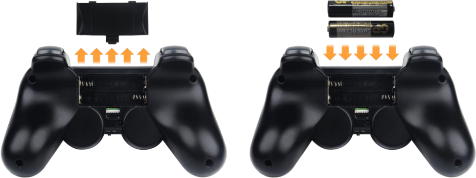
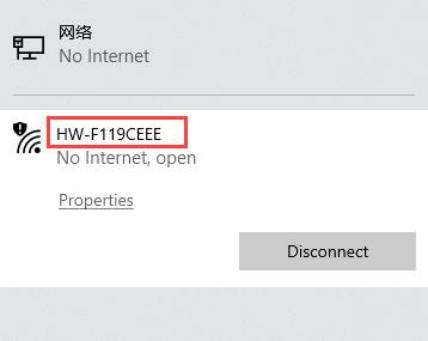
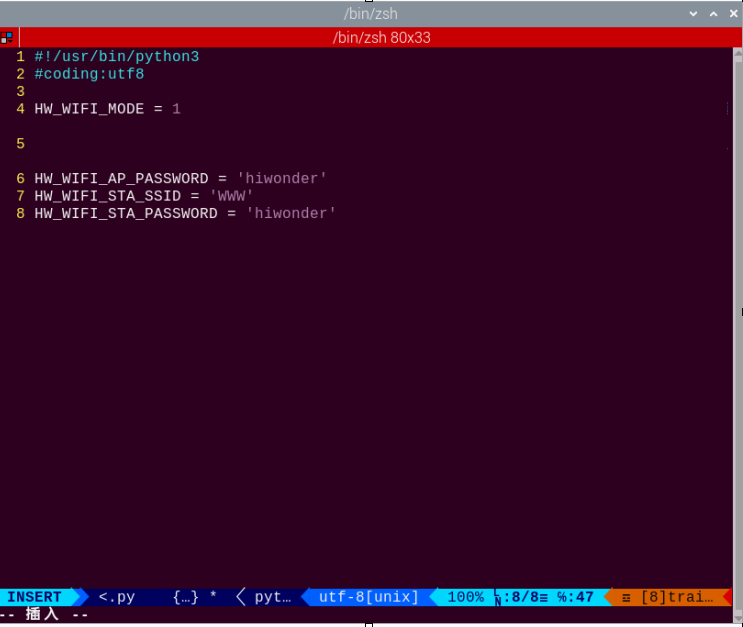
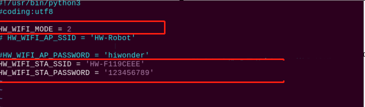

# 13. Group Control Lessons

## 13.1 Wireless Handle Control

### 13.1.1 Getting Ready

* **Step 1: Handle Receiver Setup**

(1) Plug the handle receiver into one of USB ports of TonyPi Pro.

:::{Note}
The handle receiver must be inserted before the robot is turned on.
:::

* **Step 2: Battery Installation**

(1) Prepare two AAA batteries. Take off the back cover of the handle and insert them into the battery slot. Please pay attention to the direction of the positive and negative poles.



### 13.1.2 Device Connection

:::{Note}
If you do not connect the robot within 30 seconds after turning on the handle switch, or if you do not operate the handle within 5 minutes after connecting it, the handle will enter sleep mode. If you need to turn on the handle again, press the **"START"** button.
:::

* **Connection Process**

(1) Turn on the robot.

(2) Switch on the handle, and then the two LED lights (red and green) on handle will flash simultaneously.

(3) Wait for a few seconds, pair the handle with the robot. After pairing, the green light will keep on.

### 13.1.3 Mode Introduction

The handle has two modes: single green light mode and green and red lights mode (The red and green lights will turn on simultaneously).

* **Single green light mode**

All the buttons can be used.

* **Red and green lights mode**

The four buttons **"↑"**、**"↓"**、**"←"**、**"→"** are locked and can not be used. The function of the remaining buttons is the same as that of the green and red lights mode.

* **Mode Switching Method**

Press **"MODE"** button to switch the mode from the green light mode to another mode, and press the button again to switch to the green light mode.

### 13.1.4 Button Instruction

The corresponding relation between the button and the action is as the following table:

| **Button** | **Function** |
|:--:|:--:|
| START | The robot returns to the initial posture |
| L1 | Right tilt and lift the left foot |
| R1 | Left tilt and lift right foot |
| **↑** | Move forward |
| **↓** | Move backward |
| **←** | Move to left |
| **→** | Move to right |
|  | Wave |
| **×** | Bow |
|  | Twist waist |
| **○** | Right-footed shot |
| Push up the left slider | Move forward |
| Push down the left slider | Move backward |
| Push the left slider to left | Move to left |
| Push the left slider to right | Move to right |
| Push up the right slider | Wave |
| Push down the right slider | Bow |
| Push the right slider to left | Twist waist |
| Push the right slider to right | Right-footed shot |

## 13.2 Group Control

### 13.2.1 Getting Ready

* **Equipment Preparation**

(1) Prepare at least two or more TonyPi Pro (this lesson takes two robots as example).

(2) Set development environment. Please refer to [**3.1 Remote Tool Installation and Connection**](3_remote_desktop_tool_installation_and_connection.md#3-remote-desktop-tool-installation-and-connection) and download and install VNC remote connection tool.

### 13.2.2 Working Principle

Through configuring the master robot and the slave robot in the same network, the master sends the commands to the group sending program to achieve the effect of controlling the slave.

### 13.2.3 Operation Steps

* **Configure the Master Robot**

(1) Firstly, choose a robot as the master. After booting up the robot, connect it to the remote desktop. Take the robot whose hotspot is **"HW-F199CEEE"** as example.



:::{Note}
Please remember the name of the connected hotspot and it will be used in the following steps.
:::

(2) Open the terminal and enter the WiFi configuration directory. Then enter command and press **"Enter"**.

```
cd hiwonder-toolbox
```

(3) Open WiFi configuration file via vi editor, and then enter command and press **"Enter"**.

```
sudo vim wifi_conf.py
```

(4) Press **"i"** on keyboard to enter the editing mode.



(5) Modify the WiFi password of the master to **"123456789"** and then uncomment it.

:::{Note}
The password cannot be less than 8 digits.
:::

(6) After modification, press **"Esc"** and then enter **":wq"**.

(7) Input command to restart the device. This step cannot be skipped!

```
sudo reboot
```

(8) Open the terminal and enter the WiFi configuration directory. Then enter command and press **"Enter"**.

```
cd hiwonder-toolbox
```

(9) Open WiFi configuration file via vi editor, and then enter command and press **"Enter"**.

```
sudo vim wifi_conf.py
```

(10) Press **"i"** on keyboard to enter the editing mode.

(11) The hotspot name and password of the slave are set to be the same as the hotspot name and password of the master (this lesson takes **"ID: HW-F119CEEE"** as example). Then uncomment the code.



(12) After modification, press **"Esc"** and then enter **":wq"** to save modification and exit it.

(13) Enter command to reboot the robot (this step cannot be skipped!).

```
sudo reboot
```

* **Group Control Operation**

:::{Note}
When controlling the group of robots, the slave can be turned on after the master robot is booted up successfully.
:::

(1) Place the master robot and the slave robot on a clean and flat ground, and keep a certain distance from each other.

(2) Plug the handle receiver into the USB port of the master, and then switch on the handle to control the group of robots.

### 13.2.4 Project Outcome

After the program is started, the master and the slave will perform the same action group at the same time.