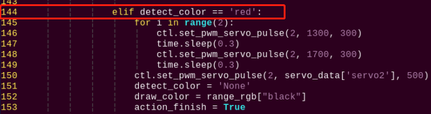
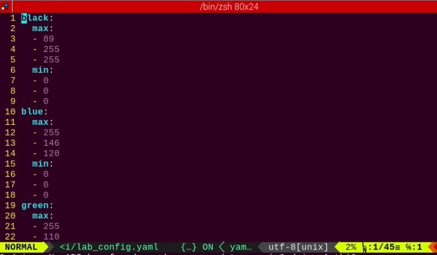
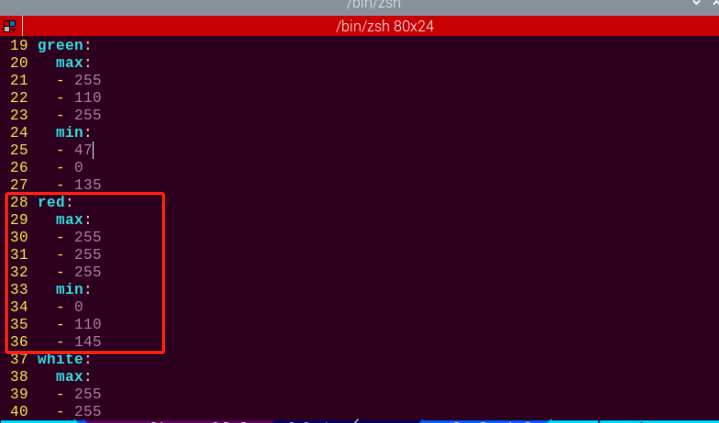
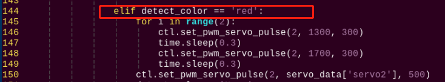

 # 10. Vision Gripping Lessons

<p id="anchor_1"></p>

## 10.1 Robotic Hand Assembly

<p class="step">Step 1</p>


<p class="step">Step 2</p>


<p class="step">Step 3</p>


<p class="step">Step 4</p>


<p class="step">Step 5</p>


<p class="step">Step 6</p>


<p class="step">Step 7</p>


<p class="step">Step 8</p>


## 10.2 Color Sorting

:::{Note}
The servo on robotic hand has been set with corresponding ID and limited angle before delivery.
:::

### 10.2.1 Getting Ready

(1) This lesson can be started after the robotic hands are assembled. The specific assembly method refers to "[10.1 Robotic Hands Assembly](#anchor_1)".

(2) Place the colored block on the surface at the height of 15 cm and the error of height can not exceed 1 cm, otherwise it will affect the performance. You can use the product package box to experience this game directly.

### 10.2.2 Working Principle

The working principle of this this lesson is as follow:

The color is recognized through Lab color space firstly. Then convert RGB color into Lab color space, and proceed with b inarization, dilation and erosion to obtain the contour of the target color.

Then, filter out the largest contour among red, green and blue three colors through he traversal function, and circle it, so that the color of the object can be recognized.

At last, judge according to the recognized color. and control the robot to grip and place or shake its head after recognizing the corresponding color object.

### 10.2.3 Operation Step

:::{Note}
The entered command must be pay attention to case sensitivity and space.
:::

(1) Turn on the robot and connect to Raspberry Pi desktop with VNC.

(2) Click the icon  on the upper left corner of the desktop to open command line terminal.Enter "cd /home/pi/TonyPi/Extend/vision_grab_course/" and press " Enter" to come to the directory of game programs.

```bash
cd /home/pi/TonyPi/Extend/vision_grab_course/
```

(3) Enter command, and then press "Enter" to start the game.

```bash
python3 color_classify.py
```

(4) If want to exit the game, press "**Ctrl+C**" in the LX terminal. Please try multiple times if fail to exit.

### 10.2.4 Project Outcome

After the program is started, TonyPi Pro will squat first. When the red block is recognized, it will grip the block with right hand and place it to the right. When the blue block is recognized, it will grip the block and place it to the left. When the green block is recognized, it will shake head.


<p id="anchor_10_2_5"></p>

### 10.2.5 Program Instruction

The source code of this program is locate in: [/home/pi/TonyPi/Functions/ColorDetect.py](https://store.hiwonder.com.cn/docs/tonypi_pro/source_code/vision_gripping/ColorDetect.zip)

* **Import parameter module** 

| **Import module** | **function** |
|:--:|:--:|
| import sys | The Python "sys" module has been imported for accessing system-related functions and variables. |
| import os | The Python "os" module has been imported, providing functions and methods for interacting with the operating system. |
| import cv2 | The OpenCV library has been imported for image processing and computer vision-related functionalities |
| import time | The Python "time" module has been imported for time-related functionalities, such as delay operations. |
| import math | The "math" module provides low-level access to mathematical operations, including many commonly used mathematical functions and constants. |
| import threading | Provides an environment for running multiple threads concurrently. |
| import np | The NumPy library has been imported. It is an open-source numerical computing extension for Python, used for handling array and matrix operations. |
| import sensor.camera as camera | Import camera library |
| from common import misc | The "Misc" module has been imported for handling recognized rectangular data. |
| import common.ros_robot_controller_sdk as rrc | The robot's underlying control library has been imported for controlling servos, motors, RGB lights, and other hardware. |
| import common.yaml_handle | Contains functionalities or tools related to processing YAML format files. |
| from common.controller import Controller | Import action group execution library |

* **Import function library** 

In this initialization step, the first task is to import the required libraries for subsequent program calls. For details on the imports, refer to "[10.2.5 Program Instruction -> Import parameter module](#anchor_10_2_5)".

{lineno-start=1}

```python
#!/usr/bin/python3
# coding=utf8
import sys
import os
import cv2
import math
import time
import threading
import numpy as np
import hiwonder.Camera as Camera
import hiwonder.Misc as Misc
import hiwonder.ros_robot_controller_sdk as rrc
from hiwonder.Controller import Controller
import hiwonder.ActionGroupControl as AGC
import hiwonder.yaml_handle as yaml_handle
```

* **Set initial state** 

Set initial state, including the initial position of servo, color threshold, etc.

{lineno-start=75}

```python
# 初始化机器人舵机初始位置(initialize the servo initialization position of robot)
def initMove():
    ctl.set_pwm_servo_pulse(1, 1500, 500)
    ctl.set_pwm_servo_pulse(2, servo_data['servo2'], 500)
```

* **Image pre-processing** 

Resizing and Gaussian blur processing of the image.

{lineno-start=194}

```python
frame_resize = cv2.resize(img_copy, size, interpolation=cv2.INTER_NEAREST)
frame_gb = cv2.GaussianBlur(frame_resize, (3, 3), 3)
```

`cv2.resize(img_copy, size, interpolation=cv2.INTER_NEAREST)` is an operation to resize the image.

The first parameter `img_copy` is the image to be resized.

The second parameter `size` is the target size.

The third parameter `interpolation` is the interpolation method, which is used to determine the pixel interpolation algorithm used for resizing.

`cv2.GaussianBlur(frame_resize, (3, 3), 3)` applies Gaussian blur to the image.

The first parameter `frame_resize` is the image to be blurred.

The second parameter `(3, 3)` is the size of the Gaussian kernel, indicating that the width and height of the kernel are both 3.

The third parameter `3` is the standard deviation of the Gaussian kernel, used to control the degree of blur.

* **Color space conversion** 

Convert the BGR image to LAB image.

{lineno-start=196}

```python
frame_lab = cv2.cvtColor(frame_gb, cv2.COLOR_BGR2LAB)  # 将图像转换到LAB空间(convert the image to LAB space)
```

* **Binarization processing** 

Use `inRange()` function in cv2 library to process binarization.

{lineno-start=204}

```python
if i != 'black' and i != 'white':
    frame_mask = cv2.inRange(frame_lab,
                             (lab_data[i]['min'][0],
                              lab_data[i]['min'][1],
                              lab_data[i]['min'][2]),
                             (lab_data[i]['max'][0],
                              lab_data[i]['max'][1],
                              lab_data[i]['max'][2]))  #对原图像和掩模进行位运算
```

The first parameter `frame_lab` is inputting image.

The second parameter `lab_data[i]['min'][0]` is the lower limit of the threshold.

The third parameter `lab_data[i]['max'][0]` is the upper limit of the threshold.

* **Corrosion and inflation** 

{lineno-start=212}

```python
                eroded = cv2.erode(frame_mask, cv2.getStructuringElement(cv2.MORPH_RECT, (3, 3)))  #腐蚀(corrosion)
                dilated = cv2.dilate(eroded, cv2.getStructuringElement(cv2.MORPH_RECT, (3, 3))) #膨胀(dilation)
```

`eroded = cv2.erode(frame_mask, cv2.getStructuringElement(cv2.MORPH_RECT, (3, 3)))` is the operation to perform corrosion on the binary image.

The first parameter `frame_mask` is the binary image on which morphological operations are to be performed.

The second parameter `cv2.getStructuringElement(cv2.MORPH_RECT, (3, 3))` is the structuring element for the corrosion operation. A rectangular structuring element of size (3, 3) is used here.

The dilation function follows the same principle.

* **Get the contour with the largest area** 

After completing the above image processing, it is necessary to obtain the contours of the recognized targets. This involves using the `findContours()` function from the cv2 library.

{lineno-start=216}

```python
contours = cv2.findContours(dilated, cv2.RETR_EXTERNAL, cv2.CHAIN_APPROX_NONE)[-2]  #找出轮廓(find out contour)
```

Take code `contours = cv2.findContours(dilated, cv2.RETR_EXTERNAL, cv2.CHAIN_APPROX_NONE)[-2]` as example:

The first parameter `dilated` is inputting image.

The second parameter `cv2.RETR_EXTERNAL` is the contour retrieval mode.

The third parameter `cv2.CHAIN_APPROX_NONE)[-2]` is the contour approximation method.

Find the contour with the largest area in the obtained contour. In order to avoid interference, you need to set a minimum value. The target contour is considered valid only if its area is greater than this value.

{lineno-start=217}

```python
                areaMaxContour, area_max = getAreaMaxContour(contours)  #找出最大轮廓(find out the contour with the largest area)
                if areaMaxContour is not None:
                    if area_max > max_area:#找最大面积(find the maximal area)
                        max_area = area_max
                        color_area_max = i
                        areaMaxContour_max = areaMaxContour
```

Judge the color block with the largest color area..

Judge the color with the largest area contour and add the result to "color_list".

{lineno-start=230}

```python
if color_area_max == 'red':  #红色最大
    color = 1
elif color_area_max == 'green':  #绿色最大
    color = 2
elif color_area_max == 'blue':  #蓝色最大
    color = 3
else:
    color = 0
    color_list.append(color)
```

* **Multiple judgement** 

Perform multiple judgement to get the average value, and ensure the identified color.

{lineno-start=240}

```python
if len(color_list) == 3:  #多次判断
    # 取平均值
    color = int(round(np.mean(np.array(color_list))))
    color_list = []
    if color == 1:
        detect_color = 'red'
        draw_color = range_rgb["red"]
    elif color == 2:
        detect_color = 'green'
        draw_color = range_rgb["green"]
    elif color == 3:
        detect_color = 'blue'
        draw_color = range_rgb["blue"]
    else:
        detect_color = 'None'
        draw_color = range_rgb["black"]               
    else:
        detect_color = 'None'
        draw_color = range_rgb["black"]
```

* **print the identified result** 

Use the `cv2.putText()` function in the cv2 library to draw the text on an image.

{lineno-start=260}

```python
cv2.putText(img, "Color: " + detect_color, (10, img.shape[0] - 10), cv2.FONT_HERSHEY_SIMPLEX, 0.65, draw_color, 2)
```

Take the code `cv2.putText(img, "Color: " + detect_color, (10, img.shape[0] - 10), cv2.FONT_HERSHEY_SIMPLEX, 0.65, draw_color, 2)` as example:

The first parameter `img` is the image being drawn.

The second parameter `'Color: ' + detect_color` is the information drawn on the image.

The third parameter `(10, img.shape[0] - 10)` is the starting coordinate of the text, i.e., the position of the bottom-left corner of the text. Here, the text is 10 pixels away from the left and bottom edges of the image, respectively.

The fourth parameter `cv2.FONT_HERSHEY_SIMPLEX` is the font type.

The fifth parameter `0.65` is the size scaling factor for the text.

The sixth parameter `draw_color` is the color of the text.

The seventh parameter `2` is the thickness of the text.

* **Color block sorting** 

If the color recognition result is not empty, make the buzzer beep once. After recognizing red or blue, control the robot to execute the corresponding action group as shown in the figure below.

{lineno-start=133}

```python
        if __isRunning:
            if detect_color != 'None':
                action_finish = False

                if detect_color == 'red':
                    ctl.set_pwm_servo_pulse(1, 1800, 200)
                    time.sleep(0.2)
                    ctl.set_pwm_servo_pulse(1, 1200, 200)
                    time.sleep(0.2)
                    ctl.set_pwm_servo_pulse(1, 1800, 200)
                    time.sleep(0.2)
                    ctl.set_pwm_servo_pulse(1, 1200, 200)
                    time.sleep(0.2)
                    ctl.set_pwm_servo_pulse(1, 1500, 100)
                    time.sleep(0.1)

                    detect_color = 'None'
                    draw_color = range_rgb["black"]                    
                    time.sleep(1)
```

Take code `AGC.runActionGroup('grab_right')` as example:

Use the `AGC.runActionGroup` function to call action group. "**grab_right**" is the name of action group.

If green is detected, control servo 2 of the robot to move, making the robot shake its head, then return to the neutral position, as shown in the figure below.

{lineno-start=153}

```python
                elif detect_color == 'green' or detect_color == 'blue':
                    ctl.set_pwm_servo_pulse(2, 1800, 200)
                    time.sleep(0.2)
                    ctl.set_pwm_servo_pulse(2, 1200, 200)
                    time.sleep(0.2)
                    ctl.set_pwm_servo_pulse(2, 1800, 200)
                    time.sleep(0.2)
                    ctl.set_pwm_servo_pulse(2, 1200, 200)
                    time.sleep(0.2)
                    ctl.set_pwm_servo_pulse(2, 1500, 100)
                    time.sleep(0.1)
                    detect_color = 'None'
                    draw_color = range_rgb["black"]                    
                    time.sleep(1)
                else:
                    time.sleep(0.01)                
                action_finish = True   
```

Take the code `ctl.set_pwm_servo_pulse(2, 1300, 300)` as example:

The first parameter `1` indicates the servo ID being controlled.

The second parameter `1800` represents the pulse width for servo ID 1. 1500 controls the servo to return to the neutral position.

The third parameter `200` represents the servo's movement time, which is 200 milliseconds.

### 10.2.6 Function Extension

<p id="anchor_10_2_6"></p>

* **Modify Default Recognized Color** 

The program of color sorting has three built-in colors by default, which are red, green and blue. When red and blue are recognized, TonyPi Pro will grip the corresponding object. When green is recognized, TonyPi Pro will shake its head. 

Take the robot nods when recognizing red and grip when recognizing green and blue as example. The specific modification steps are as follow:

(1) Enter `cd /home/pi/TonyPi/Extend/vision_grab_course/` command and press "**Enter**" to come to the directory of the game programmings.

```bash
cd /home/pi/TonyPi/Extend/vision_grab_course/
```

(2) Enter command, and then press "Enter".

```bash
vim color_classify.py
```

(3) Find the code shown in the figure below:


(4) Press "i" to enter the editing mode. Then modify "**red**" in " if detect_color == 'red':" to "**green**".


(5) Locate line 123, and then modify "**green**" in "**elif detect_color == 'green':**" to "**red**".



(6) After modification, press "**Esc**" and then enter ":**wq**" (Please note that the colon is in front of wq). Then press "**Enter**" to save and exit the modified content.

```bash
:wq
```

(7) After the game is restarted, the robot will shake its head after recognizing the red block. When recognizing the blue or green block, the robot will grip and sort the block.

* **Add New Recognized Color** 

In addition to three built-in recognized colors, you can add other recognized    colors. This section takes orange as example and the specific operation steps are as follows:

(1) Open VNV and enter command "sudo vim TonyPi/lab_config.yaml" to open Lab color setting file.

```bash
vim /home/pi/TonyPi/lab_config.yaml
```

The initial value can be recorded by screenshot or file backup.



(2) Click "**LAB_Too**" on system desktop, and then click "**Execute**" in the pop-up prompt window.


(3) Click "**Connect**" button in the lower left corner. When the picture transmitted by the camera is displayed in the interface, it means that the connection is successful. Then select "red" in the right frame.


(4) Point the camera at the color you want to recognize and drag the corresponding sliders of L, A and B until the orange part in left interface  becomes white and other colors become black. Then click "**save**" button behind the "**red**" to save the modified data.


(5) After modification, enter command `vim /home/pi/TonyPi/lab_config.yaml` to view whether the color setting parameters are modified.

```bash
vim /home/pi/TonyPi/lab_config.yaml
```



To avoid any impact on the game, it's recommended to use the LAB_Tool to modify the value back to the initial value after the modification is completed.

(6) Check the data in red frame above. If the edited value was written in the configuration program, press "**Esc**" and enter "**:wq**" to save it and exit.

```bash
:wq
```

(7) According to the content in [10.2.3 Function Extension -> Modify the Recognized Color](#anchor_10_2_6), set the default color that make TonyPi Pro shake its head after recognition as red according to the content in "Modify the recognized color" .



(8) After the game is started, place the orange object in front of the camera, you can see that TonyPi Pro performs "**shake head**" action.

(9) If want to add other colors as the recognition color, please refer to the same operation steps.

## 10.3 AprilTag Tracking

:::{Note}
The servo on robotic hand has been set with corresponding ID and limited angle before delivery.
:::

### 10.3.1 Getting Ready

This lesson can be started after the robotic hands are assembled. The specific assembly method refers to "[10.1 Robotic Hands Assembly](#anchor_1)" .

### 10.3.2 Working Principle

The working principle of this this lesson is as follow:

The color is recognized through Lab color space firstly. Then convert RGB color into Lab color space, and proceed with b inarization, dilation and erosion to obtain the contour of the target color. Then frame the color with rectangle to realize the color recognition.

Next, call the action group that has been set and let the robot pick up the object.

Then, control the robot's head in motion to search AprilTag within the visual range. The screen is processed by positioning, image segmentation and contour finding first. After the contour is positioned, quadrilateral detection is performed. Through the acquisition of the four corner points, the straight line is fitted to form a closed loop, and the identification and position acquisition of AprilTag are completed.

### 10.3.3 Operation Steps

:::{Note}
The entered command must be pay attention to case sensitivity and space.
:::

(1) Turn on the robot and connect to Raspberry Pi desktop with VNC.

(2) Click the icon  on the upper left corner of the desktop to open command line terminal.Enter `cd /home/pi/TonyPi/Extend/vision_grab_course/` and press Enter to go to the directory of game program.

```bash
cd /home/pi/TonyPi/Extend/vision_grab_course/
```

(3) Enter command, and then press "**Enter**" to start the game.

```bash
python3 apriltag_track.py
```

(4) If want to exit the game, press "**Ctrl+C**" in the LX terminal. Please try multiple times if fail to exit.

### 10.3.4 Project Outcome

After starting the game, TonyPi Pro will detect the object within the visual range. When one of colored blocks is recognized, TonyPi Pro will pick up the block, and then move to the AprilTag and put it down.


<p id="anchor_10_3_5"></p>

### 10.3.5 Programming Instruction

The source code of this program is locate in: [/home/pi/TonyPi/Extend/vision_grab_course/apriltag_track.py](https://store.hiwonder.com.cn/docs/tonypi_pro/source_code/vision_gripping/apriltag_track.zip)

* **Import Parameter Module** 

| **Import module** | **function** |
|:--:|:--:|
| import sys | The Python "sys" module has been imported for accessing system-related functions and variables. |
| import os | The Python "os" module has been imported, providing functions and methods for interacting with the operating system. |
| import cv2 | The OpenCV library has been imported for image processing and computer vision-related functionalities. |
| import time | The Python "time" module has been imported for time-related functionalities, such as delay operations. |
| import math | The "math" module provides low-level access to mathematical operations, including many commonly used mathematical functions and constants. |
| import threading | Provides an environment for running multiple threads concurrently. |
| import np | The NumPy library has been imported. It is an open-source numerical computing extension for Python, used for handling array and matrix operations. |
| import sensor.camera as camera | Import camera library |
| from common import misc | The "Misc" module has been imported for handling recognized rectangular data. |
| import common.ros_robot_controller_sdk as rrc | The robot's low-level control library has been imported for controlling servos, motors, RGB lights, and other hardware. |
| import common.yaml_handle | Contains functionalities or tools related to processing YAML format files. |
| from common.controller import Controller | Import action group execution library |

* **Import function library** 

In this initialization step, the first task is to import the required libraries for subsequent program calls. For details on the imports, refer to [Import parameter module](#anchor_10_3_5).

{lineno-start=4}

```python
import sys
import cv2
import math
import time
import threading
import numpy as np
import hiwonder.ros_robot_controller_sdk as rrc
from hiwonder.Controller import Controller
import hiwonder.Misc as Misc
import hiwonder.apriltag as apriltag
import hiwonder.ActionGroupControl as AGC
import hiwonder.yaml_handle as yaml_handle
```

* **Set initial state** 

Set initial state, including the initial position of servo, PID, color threshold value, etc.

{lineno-start=53}

```python
# 初始位置
def initMove():
    ctl.set_pwm_servo_pulse(1, servo1, 1000)
    ctl.set_pwm_servo_pulse(2, servo2, 1000)
    ctl.set_bus_servo_pulse(17, 500, 1000)
    ctl.set_bus_servo_pulse(18, 500, 1000)
```

Set the different action function to facilitate subsequent robot motion calls.

{lineno-start=60}

```python
def right_splay():
    ctl.set_bus_servo_pulse(17, 760, 1000)
    time.sleep(1)
    
def right_grasp():
    ctl.set_bus_servo_pulse(17, 500, 1000)
    time.sleep(1)
    
def up_hand():
    ctl.set_bus_servo_pulse(16, 650, 1000)
    time.sleep(0.5)
    ctl.set_bus_servo_pulse(15, 260, 1000)
    ctl.set_bus_servo_pulse(14, 180, 1000)
    ctl.set_bus_servo_pulse(17, 500, 1000)
    time.sleep(1)

def down_hand():
    ctl.set_bus_servo_pulse(15, 200, 1000)
    ctl.set_bus_servo_pulse(14, 460, 1000)
    ctl.set_bus_servo_pulse(17, 500, 1000)
    time.sleep(0.6)
    ctl.set_bus_servo_pulse(16, 275, 1000)
    time.sleep(1)
    
def runBuzzer(sleep):
    Board.setBuzzer(1) # 打开
    time.sleep(sleep) # 延时
    Board.setBuzzer(0) #关闭
```

* **Create AprilTag detector** 

Use the default tag patterns provided by the AprilTag library for visual marker detection. It can be utilized to detect AprilTag tags in images and obtain information about these tags, such as their position coordinates and IDs.

{lineno-start=211}

```python
# 检测apriltag
detector = apriltag.Detector(searchpath=apriltag._get_demo_searchpath())
```

* **Color space conversion** 

Convert the BGR image to LAB image.

{lineno-start=215}

```python
gray = cv2.cvtColor(img, cv2.COLOR_BGR2GRAY)
```

* **Detect tag** 

Utilize the created detector object (i.e., AprilTag detector) to detect AprilTag tags in the grayscale image "**gray**".

{lineno-start=216}

```python
detections = detector.detect(gray, return_image=False)
```

* **Get tag information** 

Obtain the corner information of the tag ID, use the `cv2.drawContours` function to encircle the tag in the image; retrieve the tag ID, tag class, obtain the tag center point, and rotation angle.

{lineno-start=223}

```python
tag_family = str(detection.tag_family, encoding='utf-8')  # 获取tag_family
tag_id = int(detection.tag_id)  # 获取tag_id

objective_x, objective_y = int(detection.center[0]), int(detection.center[1])  # 中心点
object_angle = int(math.degrees(math.atan2(corners[0][1] - corners[1][1], corners[0][0] - corners[1][0])))  # 计算旋转角
return [tag_family, tag_id, objective_x, objective_y]
return None, None, None, None
```

* **Image pre-processing** 

Resizing and Gaussian blur processing of the image.

{lineno-start=238}

```python
frame_resize = cv2.resize(img, size, interpolation=cv2.INTER_NEAREST)
frame_gb = cv2.GaussianBlur(frame_resize, (3, 3), 3) 
```

`cv2.resize(img_copy, size, interpolation=cv2.INTER_NEAREST)` is an operation to resize the image.

The first parameter `img_copy` is the image to be resized.

The second parameter `size` is the target size.

The third parameter `interpolation` is the interpolation method, which is used to determine the pixel interpolation algorithm used for resizing.

`cv2.GaussianBlur(frame_resize, (3, 3), 3)` applies Gaussian blur to the image.

The first parameter `frame_resize` is the image to be blurred.

The second parameter `(3, 3)` is the size of the Gaussian kernel, indicating that the width and height of the kernel are both 3.

The third parameter `3` is the standard deviation of the Gaussian kernel, used to control the degree of blur.

* **Color space conversion** 

Convert the BGR image to LAB image.

{lineno-start=240}

```python
frame_lab = cv2.cvtColor(frame_gb, cv2.COLOR_BGR2LAB)  # 将图像转换到LAB空间
```

* **Binarization processing** 

Use `inRange()` function in cv2 library to process binarization.

{lineno-start=245}

```python
if i in color_list:
    frame_mask = cv2.inRange(frame_lab,
                             (lab_data[i]['min'][0],
                              lab_data[i]['min'][1],
                              lab_data[i]['min'][2]),
                             (lab_data[i]['max'][0],
                              lab_data[i]['max'][1],
                              lab_data[i]['max'][2]))  #对原图像和掩模进行位运算 
```

The first parameter `frame_lab` is inputting image.

The second parameter `lab_data[i]['min'][0]` is the lower limit of the threshold.

The third parameter `lab_data[i]['max'][0]` is the upper limit of the threshold.

* **Corrosion and inflation** 

{lineno-start=253}

```python
eroded = cv2.erode(frame_mask, cv2.getStructuringElement(cv2.MORPH_RECT, (3, 3)))  #腐蚀
dilated = cv2.dilate(eroded, cv2.getStructuringElement(cv2.MORPH_RECT, (3, 3))) #膨胀
```

`eroded = cv2.erode(frame_mask, cv2.getStructuringElement(cv2.MORPH_RECT, (3, 3)))` is the operation to perform corrosion on the binary image.

The first parameter `frame_mask` is the binary image on which morphological operations are to be performed.

The second parameter `cv2.getStructuringElement(cv2.MORPH_RECT, (3, 3))` is the structuring element for the corrosion operation. A rectangular structuring element of size (3, 3) is used here.

The dilation function follows the same principle.

* **Get the contour with the largest area** 

After completing the above image processing, it is necessary to obtain the contours of the recognized targets. This involves using the "findContours()" function from the cv2 library.

{lineno-start=255}

```python
contours = cv2.findContours(dilated, cv2.RETR_EXTERNAL, cv2.CHAIN_APPROX_NONE)[-2]  # 找出轮廓
```

Take code `contours = cv2.findContours(dilated, cv2.RETR_EXTERNAL, cv2.CHAIN_APPROX_NONE)[-2]` as example:

The first parameter `dilated` is inputting image.

The second parameter `cv2.RETR_EXTERNAL` is the contour retrieval mode.

The third parameter `cv2.CHAIN_APPROX_NONE)[-2]` is the contour approximation method.

Find the contour with the largest area in the obtained contour. In order to avoid interference, you need to set a minimum value. The target contour is considered valid only if its area is greater than this value.

{lineno-start=256}

```python
areaMaxContour, area_max = getAreaMaxContour(contours)  # 找出最大轮廓

if area_max > 500:  # 有找到最大面积
    rect = cv2.minAreaRect(areaMaxContour)#最小外接矩形
    angle_ = rect[2]
```

* **Get and return the recognized result, center coordinates and angle** 

Get the four vertices of the minimum rectangle of the largest area contour, use the  `cv2.drawContours`  function to draw the rectangular border on the returned image. Obtain the diagonal points of the rectangle and calculate the coordinates of the center point.

{lineno-start=262}

```python
box = np.int0(cv2.boxPoints(rect))#最小外接矩形的四个顶点
for j in range(4):
    box[j, 0] = int(Misc.map(box[j, 0], 0, size[0], 0, img_w))
    box[j, 1] = int(Misc.map(box[j, 1], 0, size[1], 0, img_h))

    cv2.drawContours(img, [box], -1, range_rgb[i], 2)#画出四个点组成的矩形

    #获取矩形的对角点
    ptime_start_x, ptime_start_y = box[0, 0], box[0, 1]
    pt3_x, pt3_y = box[2, 0], box[2, 1]            
    center_x_, center_y_ = int((ptime_start_x + pt3_x) / 2), int((ptime_start_y + pt3_y) / 2)#中心点       
    cv2.circle(img, (center_x_, center_y_), 5, (0, 255, 255), -1)#画出中心点

    distance = pow(center_x_ - img_w/2, 2) + pow(center_y_ - img_h, 2)
    if distance < center_max_distance:  # 寻找距离最近的物体来搬运
        center_max_distance = distance
        color = i
        center_x, center_y, angle = center_x_, center_y_, angle_
```

* **Tag tracking and placing** 

(1) Call the buzzer and action group function to grasp color block based on the color recognition result.

{lineno-start=114}

```python
if not action_finish:
    if color is not None:
        if color_y >= 300:
            board.set_buzzer(1900, 0.1, 0.9, 1)
            up_hand()
            right_splay()
            time.sleep(2)
            board.set_buzzer(1900, 0.1, 0.9, 1)
            time.sleep(0.1)
            board.set_buzzer(1900, 0.1, 0.9, 1)
            right_grasp()
            dowm_hand()
            action_finish = True
        else:
            time.sleep(0.01)
    else:
        time.sleep(0.01)
```

(2) Control the servo of robot heat to rotate to find the tag card in the field of vision.

{lineno-start=181}

```python
if servo1 >= 1250:
    servo1_st = False
elif servo1 <= servo_data['servo1']:
    servo1_st = True   
    if servo1_st:
        servo1 += 5
    else:
        servo1 -= 5

        if servo2 >= 1700:
            servo2_st = False
        elif servo2 <= 1300:
            servo2_st = True

            if servo2_st:
                servo2 += 5
            else:
                servo2 -= 5
                ctl.set_pwm_servo_pulse(1, servo1, 30)
                ctl.set_pwm_servo_pulse(2, servo2, 30)
                time.sleep(0.05)
```

Take code `ctl.set_pwm_servo_pulse(1, 1800, 200)` as example:

The first parameter `1` indicates the servo ID being controlled.

The second parameter `1800` represents the pulse width for servo ID 1. 1500 controls the servo to return to the neutral position.

The third parameter `200` represents the servo's movement time, which is 200 milliseconds.

(3) Based on the difference between the center point coordinates of the tag and CentreX, call the action group to control the robot to move closer to the tag.

{lineno-start=133}

```python
if tag_id is not None:
    if objective_x - CentreX >= 50 and objective_y < 240:
        AGC.runAction('turn_right')

    elif objective_x - CentreX <= -50 and objective_y < 240:
        AGC.runAction('turn_left')

    elif objective_y <= 280:
        AGC.runAction('go_forward')

    elif objective_x - CentreX >= 30:
        AGC.runAction('right_move_20')

    elif objective_x - CentreX <= -30:
        AGC.runAction('left_move_20')

    elif 30 > objective_x - CentreX >= 10:
        AGC.runAction('right_move')

    elif -30 < objective_x - CentreX <= -10:
        AGC.runAction('left_move')

    elif 280 < objective_y < 320:
        AGC.runAction('go_forward_one_step')

    elif objective_y >= 320:
        board.set_buzzer(1900, 0.1, 0.9, 1)
        AGC.runAction('put_down_object')
        right_splay()
        time.sleep(0.5)
        right_grasp()
        AGC.runAction('put_up_object')
        time.sleep(2)
        action_finish = False
```

Take the code `AGC.runActionGroup('grab_right')` as example:

Use the `AGC.runActionGroup` function to call the action group.`grab_right` is the name of action group.
