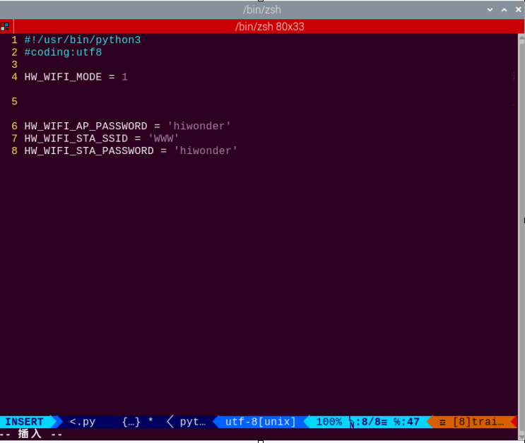
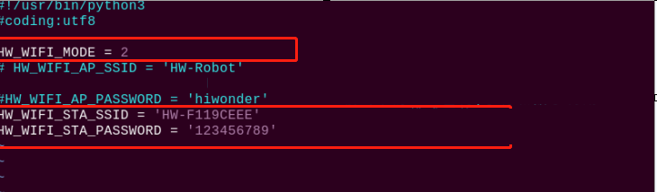

# 群发控制课程

## 1. 手柄控制机器人

### 1.1 准备工作

**步骤1**：将手柄接收器插入TonyPi机器人的任意一个USB接口。

:::{Note}
手柄接收器必须在设备开机前插入，如已插入则忽略本步骤。
:::

**步骤2**：自备两节7号干电池，取出手柄后壳，将电池插入电池槽内，注意正负极请勿插反。


### 1.2 设备连接

**步骤1**：打开机器人开关。

**步骤2**：打开手柄开关，此时手柄上两个LED灯（红色、绿色）将同时闪烁。

**步骤3**：等待几秒，机器人将和手柄自动配对，配对成功后，绿色灯将常亮。

打开手柄开关后30秒内未连接机器人，或连接后5分钟内对手柄无任何操作，手柄将进入睡眠模式。若需唤醒手柄，按下"**START**"键即可。

### 1.3 模式介绍

手柄自身分为两种模式：单绿灯模式和红绿灯模式（红、绿灯同时亮）。

**单绿灯模式：所有的按键均可使用。**

**红绿灯模式："↑、↓、←、→"四个按键被锁定，无法使用，其余按键功能和绿灯模式一致。**

两种模式切换方法：按下"**MODE**"键，即可从绿灯模式切换为非绿灯模式，再次按下又可切换回绿灯模式。

### 1.4 按键说明

**手柄按键和机器人动作的对应关系如下表所示（以机器人自身为参考点）：**

|    按键    |        功能        |
|:----------:|:------------------:|
|   START    | 机体恢复初始化姿态 |
|     L1     |   右侧倾斜抬左脚   |
|     L2     |       左侧滑       |
|     R1     |   左侧倾斜抬右脚   |
|     R2     |       右侧滑       |
|   **↑**    |        前进        |
|   **↓**    |        后退        |
|   **←**    |        左移        |
|   **→**    |        右移        |
|   **△**    |        挥手        |
|   **×**    |        鞠躬        |
|   **◻**    |        扭腰        |
|   **○**    |      右脚射门      |
| 左滑杆向上 |        前进        |
| 左滑杆向下 |        后退        |
| 左滑杆向左 |        左移        |
| 左滑杆向右 |        右移        |
| 右滑杆向上 |        挥手        |
| 右滑杆向下 |        鞠躬        |
| 右滑杆向左 |        扭腰        |
| 右滑杆向右 |      右脚射门      |

## 2. 群发控制

### 2.1 准备工作

1)  至少准备2台及以上的TonyPi机器人（本节课以2台机器人为例进行示范）。

2)  开发环境搭建。参考"**[1. 远程工具安装与连接]()**"文档内容，下载并安装远程连接工具VNC。

### 2.2 玩法简要说明

通过将主机与从机配置在同一个网络内，主机通过群发程序向从机发送动作指令，达到控制从机的效果。

### 2.3 玩法开启及关闭

- #### 2.3.1 配置主机

1. 首先，选取一台机器人作为主机，开启后远程连接桌面，我们这里以热点为"**HW-F199CEEE**"的机器人为例。


:::{Note}
请记住主机热点名称，后续步骤将用到此名称。
:::

2. 打开命令行终端，进入到Wi-Fi文件配置目录。输入指令，按下回车即可。

```commandline
cd hiwonder-toolbox
```

3. 使用vi编辑器打开Wi-Fi配置文件，输入指令，按下回车。

```commandline
sudo vim hiwonder_wifi_conf.py
```

4. 按一下键盘上的"**i**"，进入编辑模式。



5. 修改主机热点密码，将Wi-Fi密码修改为"**123456789**"，再进行反注释。操作如下图所示：


:::{Note}
密码的位数不可少于8位。
:::

6. 修改完成之后，按下"**Esc**"键，退出编辑模式。再输入指令保存并退出。

```commandline
:wq
```

7. 输入命令将设备重启。（此步不可跳过！）

```commandline
sudo reboot
```

- #### 2.3.2 配置从机

:::{Note}
这里以单台从机操作为例进行说明，多台从机可参考同样的方法进行配置。
:::

1)  打开命令行终端，进入到Wi-Fi文件配置目录。输入指令，按下回车即可。

```commandline
cd hiwonder-toolbox
```

2. 使用vi编辑器打开Wi-Fi配置文件，输入指令，按下回车。

```commandline
sudo vim hiwonder_wifi_conf.py
```

按下键盘上的"**i**"键，进入编辑模式。


3. 按照主机的热点名称与密码进行一致设置（本节课以默认ID：**HW-F119CEEE**为例），再将代码进行反注释。操作如下图所示：



4. 修改完成之后，按一下"**Esc**"键，退出编辑模式。再输入指令保存并退出。

```commandline
:wq
```

5. 输入命令将设备重启。（**此步不可跳过！**）

```commandline
sudo reboot
```

- #### 2.3.3 群发控制

:::{Note}
群发控制时，从机需等待主机开机成功后再开启。
:::

1)  将主、从机器人放置在空旷平坦的地面，并且各个机器人保持一定距离。

2)  将PS2手柄接收器插入主机的USB接口，打开开关便可操纵机器人群。

### 2.4 实现效果

程序启动后，从机机器人将与主机机器人同时执行同样的动作组。
