# 11. Sensor Basic Development Lessons

## 11.1 Fan Module

### 11.1.1 Getting Ready

Prepare a fan module and connect it to any one of GPIO ports on Raspberry Pi expansion board through 4PIN cable. The wiring effect is as follow:

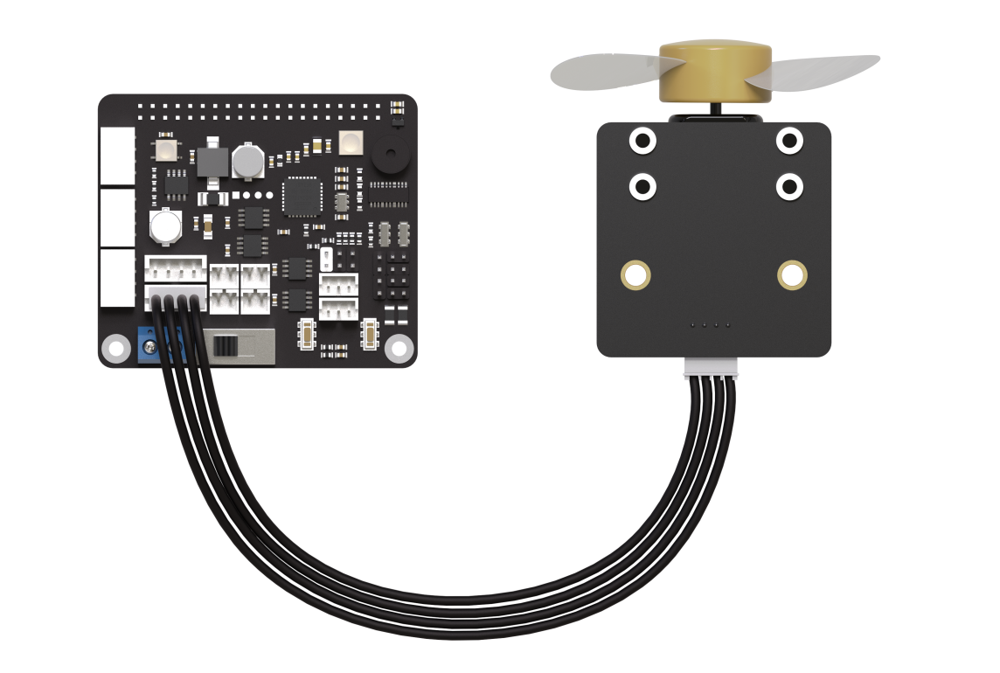

:::{Note}
Please do not insert forcefully because 4PIN cable uses anti-reverse plugging
:::

### 11.1.2 Module Usage

No extra motor diver board is needed for using the fan module. We can adjust the rotation direction and speed through program. Beyond that, the module is  compatible with Lego series for more creative DIY design.

### 11.1.3 Operation Steps

(1) Click icon  in the upper left corner to open the terminal. Enter "cd /home/pi/TonyPi/Extend/sensor_course/sensor_example/" and press Enter to the directory of the game.

```bash
cd /home/pi/TonyPi/Extend/sensor_course/sensor_example/
```

(2) Enter "python3 fan_control.py" command, and then press " Enter" to start the game.

```bash
python3 fan_control.py
```

(3) If want to close this program, press "**Ctrl+C**". You can try multiple time if fail to close.

### 11.1.4 Project Outcome

After the program is running, the fan starts spinning; when the program is closed, the fan stops spinning.


### 11.1.5 Working Principle

In this project, we control the fan rotation through two GPIO ports. When one GPIO port is set to high-level and the other one is set to low level, the fan starts rotate.

The source code of the program is located in: [/home/pi/TonyPi/Extend/sensor_course/sensor_example/fan_control.py](https://store.hiwonder.com.cn/docs/tonypi_pro/source_code/sensor_basic_development/fan_control.zip)

{lineno-start=1}

```python
#!/usr/bin/python3
# coding=utf8
# 4.拓展课程学习\7.拓展课程之传感器基础开发课程\第1课 风扇模块实验
import time
import gpiod

## 初始化引脚模式
chip = gpiod.Chip("gpiochip4")
fanPin1 = chip.get_line(8)
fanPin1.request(consumer="pin1", type=gpiod.LINE_REQ_DIR_OUT)

fanPin2 = chip.get_line(7)
fanPin2.request(consumer="pin2", type=gpiod.LINE_REQ_DIR_OUT)


# initial         
def init():
    start = False
    set_fan(0)
    print("Fan Control Init")	
    
#fan control 
def set_fan(start):
               
    if start == 1:
        ## 开启风扇, 顺时针
        fanPin1.set_value(1)  # 设置引脚输出高电平
        fanPin2.set_value(0)  # 设置引脚输出低电平       
    else:
        ## 关闭风扇
        fanPin1.set_value(0)  # 设置引脚输出低电平
        fanPin2.set_value(0)  # 设置引脚输出低电平         

if __name__ == '__main__': 
    while True:
        try:
            set_fan(1)
        except KeyboardInterrupt:
            set_fan(0)
            break
    
    

```

chip.get_line(pin_number)：Get GPIO (pin).

fanPin1.set_value()：Set the voltage level of GPIO pin.

In the example, the encoding method used is digital logic level encoding.

High level (usually 1) and low level (usually 0).

In the code, the "fanPin1.set_value()" functions is used to set the logic level state of the GPIO line.

fanPin1.set_value(1)：Set No.8 GPIO pin to high voltage level

fanPin2.set_value(0)：Set No.7 GPIO pin to low voltage level

fanPin1.set_value(0)：Set No.8 GPIO pin to low voltage level

fanPin2.set_value(0)：Set No.7 GPIO pin to low voltage level

## 11.2 Touch Sensor

### 11.2.1 Getting Ready

Prepare a touch sensor and connect it to any one of GPIO ports on Raspberry Pi expansion board through a 4PIN cable.The wiring effect is as follow:

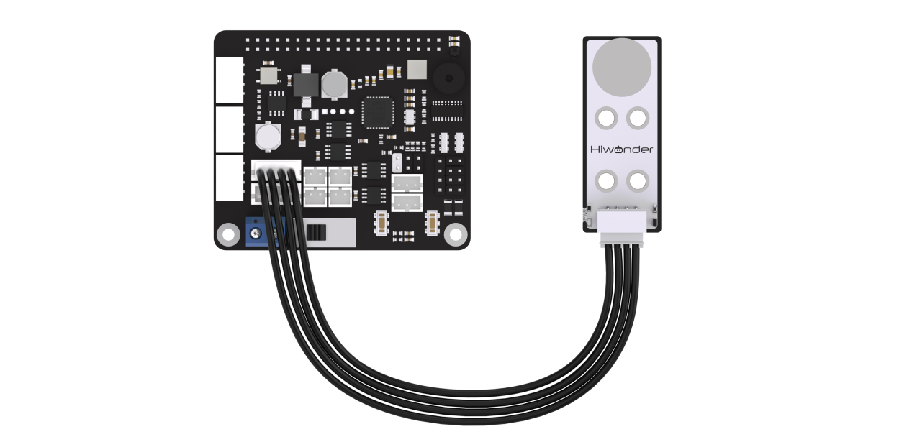

:::{Note}
Please do not insert forcefully because 4PIN cable uses anti-reverse plugging design.
:::

### 11.2.2 Module Usage

Touch sensor is based on the principle of capacitance induction. The human body or metal touch the gold-plated contact surface of the sensor, the sensor will sense the contact.  In  addition, the contact can also  be sensed  by the sensor across a certain thickness of plastic, paper and other materials, and the sensitivity of induction is associated with the size of the contact surface and the thickness of the material covered.

This sensor can  be  applied to the switch control for device, such as  light control, and doorbell button. Beyond that, this sensor is compatible with Lego series for more creative DIY design.

### 11.2.3 Operation Steps

(1) Click  in the upper left corner to open the terminal. Enter command "cd /home/pi/TonyPi/Extend/sensor_course/sensor_example/" and press Enter to go to the directory of game.

```bash
cd /home/pi/TonyPi/Extend/sensor_course/sensor_example/
```

(2) Enter command, and then press " Enter" to start the game.

```bash
python3 touch_buzzer.py
```

(3) If want to close this program, press "**Ctrl+C**". You can try multiple time if fail to close.

### 11.2.4 Project Outcome

After the program is started, touch the metal plate of the sensor, and the. The buzzer will sound once when sense the touch.


### 11.2.5 Working Principle

When a touch is sensed, the sensor will output a high level. Otherwise, it will output a low level. You can judge the current status of the sensor through the level change of I/O port.

The source code of the program is located in:[/home/pi/TonyPi/Extend/sensor_course/sensor_example/touch_buzzer.py](https://store.hiwonder.com.cn/docs/tonypi_pro/source_code/sensor_basic_development/touch_buzzer.zip)

```python
#!/usr/bin/python3
# coding=utf8
# 4.拓展课程学习\7.拓展课程之传感器基础开发课程\第2课 触摸传感器实验
import os
import sys
import time
import gpiod
import hiwonder.ros_robot_controller_sdk as rrc


board = rrc.Board()
    
st = 0

chip = gpiod.Chip('gpiochip4')
touch = chip.get_line(22)
touch.request(consumer="touch", type=gpiod.LINE_REQ_DIR_IN, flags=gpiod.LINE_REQ_FLAG_BIAS_PULL_UP)

if __name__ == '__main__': 
    while True:
        state = touch.get_value()   #读取引脚数字值
        if not state:
            if st :            #这里做一个判断,防止反复响
                st = 0
                board.set_buzzer(1900, 0.1, 0.9, 1) # 以1900Hz的频率,持续响0.1秒,关闭0.9秒,重复1次
        else:
            st = 1
            board.set_buzzer(1000, 0.0, 0.0, 1) # 关闭

    board.set_buzzer(1000, 0.0, 0.0, 1) # 关闭


```

Use No.22 GPIO pin to connect the touch sensor. The touch sensor is controlled via gpiochip4. The pin configuration of the touch sensor is set to input mode.

Initialized an rrc.Board() object and a gpiod.Chip object.

Then the program enters an infinite loop, continuously checking the state of the touch sensor.

Then, the program reads the digital value of the pin through touch.get_value(), determines whether the touch sensor is currently being touched. If the touch sensor is touched (state is low level), and the previous state was not touched (st is 1), then execute the following operations:

Set st to 0, indicating the touch state has been processed.

Use the `board.set_buzzer()` function to control the buzzer to emit. The function configures the buzzer to operate at a frequency of 1900Hz for 0.1 second, followed by a 0.9 second pause, repeating the sequence once.

Delay for 1 second to prevent repeated response to touch signals.

If the touch sensor is not touched (state is high level), then set st to 1, indicating the touch state.

At the end of each loop, use the `board.set_buzzer()` function to turn off the buzzer, ensuring that the buzzer remains off when not touched.

## 11.3 MP3 Module

### 11.3.1 Getting Ready

Prepare a MP3 module and connect it to any one of IIC ports on Raspberry Pi expansion board through a 4PIN cable. The wiring effect is as follow:

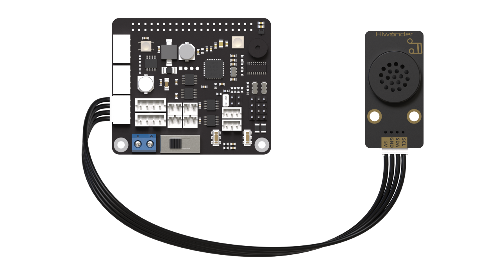

:::{Note}
Please do not insert forcefully because 4PIN cable uses anti-reverse plugging design.
:::

### 11.3.2 Module Usage

The MP3 module used in this lesson uses IIC communication and it can process, transfer and decode the MP3 file through DPS of the digital signal processor.

### 11.3.3 Operation Steps

(1) Click  in the upper left corner to open the terminal.Enter command "cd /home/pi/TonyPi/Extend/sensor_course/sensor_example/" and press Enter to go to the program directory.

```bash
cd /home/pi/TonyPi/Extend/sensor_course/sensor_example/
```

(2) Enter command, and then press "Enter" to start the game.

```bash
python3 mp3_play.py
```

(3) If want to close this program, press "**Ctrl+C**" . You can try multiple time if fail to close.

### 11.3.4 Project Outcome

After the program is started, MP3 module will play the song The Little Apple once.

### 11.3.5 Working Principle

In this project, insert TF card that has been stored the needed voice frequency into MP3 module so that you can control module to play music through program. The source code of the program is located in: [/home/pi/TonyPi/Extend/sensor_course/sensor_example/mp3_play.py](https://store.hiwonder.com.cn/docs/tonypi_pro/source_code/sensor_basic_development/mp3_play.zip)

{lineno-start=1}

```python
#!/usr/bin/python3
# coding=utf8
# 4.拓展课程学习\7.拓展课程之传感器基础开发课程\第3课 MP3模块实验
import os
import sys
import time
import signal
import hiwonder.MP3 as MP3

if sys.version_info.major == 2:
    print('Please run this program with python3!')
    sys.exit(0)


move_st = True
addr = 0x7b         #MP3 module address
mp3 = MP3.MP3(addr)

def Stop(signum, frame):
    global move_st
    move_st = False
    mp3.pause() #pause song play
    print('\n')

signal.signal(signal.SIGINT, Stop)

skip = True

if __name__ == "__main__":
    while move_st:
        if skip:
            mp3.volume(20) #set the volume to 30, please set before play.  
            mp3.playNum(18) #play song num0018
            skip = False
        else:
            time.sleep(0.05)
```

The program imports the MP3 module and defines the `move_st` and `addr` variables. "move_st" is used to control whether the main loop continues execution, and "addr" represents the address of the MP3 module.

Then, an object is created using the MP3 address, which is used to communicate with the MP3 module.

Then, a function named Stop is defined. This function is called when a SIGINT signal (such as pressing Ctrl+C) is received. Inside the function, "move_st" is set to False to stop the execution of the main loop, and `mp3.pause()` function is called to pause the currently playing song.

The `signal.signal()` function is used to register the Stop function as the handler for the SIGINT signal, so that appropriate actions can be taken when this signal is received.

Set skip to True, indicating that initial playback needs to be skipped.

If the main module of the program is executed directly (rather than being imported as a module), it enters the main loop. In the main loop, the value of move_st is checked to determine whether to continue executing the loop.

Play music: If skip is True, execute the following operations:

Call the `mp3.volume()` function to set the volume to 30.

Call the `mp3.playNum()` function to play the song with song number 18.

Set skip to False to avoid repeating playback.

If skip is False, the program pauses execution for 0.05 seconds to avoid looping too quickly.

### 11.3.6 Function Extension

The program defaults to play The Little Apple. If want to change to other songs, you can operate according to the following steps. This section takes changing to La Song as example to illustrate.

:::{Note}
The replaced song needs to be download to the SD card of MP3, and named with number, for example, La Song is named 0019.
:::

(1) Open LX terminal, and then enter "/home/pi/TonyPi/Extend/sensor_course/sensor_example/" command and press "Enter" to come to the directory of the game programmings.

(2) Enter command, and then press " Enter" to open game program file.

```bash
vim mp3_play.py
```

(3) Find the code shown in the figure below.

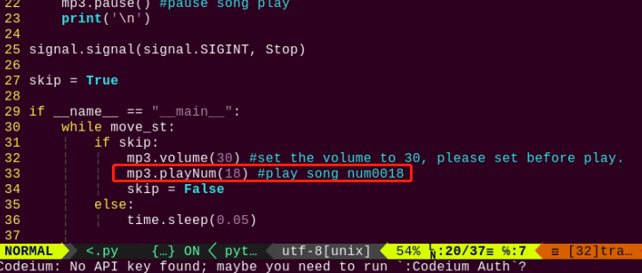

(4) Press "i" key on keyboard to enter the editing mode.


(5) Modify "18" in ` mp3.playNum(18)` to "19" , as the figure shown below.

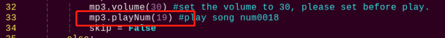

(6) After modification, press "**Esc**" and enter "**:wq**" (please note that the colon is in front of wq), and then press "**Enter**" to save the modified content.

```bash
:wq
```

## 11.4 Ultrasonic sensor

### 11.4.1 Getting Ready

Prepare an ultrasonic sensor and connect it to any one of IIC ports on Raspberry Pi expansion board through a 4PIN cable. The wiring effect is as follow:

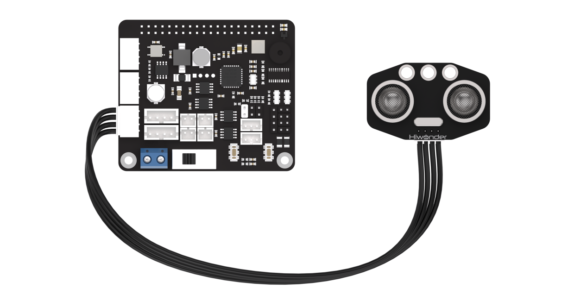

:::{Note}
Please do not insert forcefully because 4PIN wire uses anti-reverse plugging design.
:::

### 11.4.2 Module Usage

In this lesson, the distance measurement chip of the ultrasonic sensor integrates ultrasonic transmitter circuit, ultrasonic receiver circuit and digital processing circuit, etc. The module uses IIC communication ports, which can take advantage of IIC communication to read the measured distance.

In addition, the ultrasonic probe integrates two RGB lights, which can not only adjust the brightness of the light, but also realize the color change by modifying the parameters of three color channels of red (R), green (G) and blue (B).

### 11.4.3 Operation Steps

(1) Click  in the upper left corner to open the terminal. Enter command and press Enter to come to the directory of the game program.

```bash
cd /home/pi/TonyPi/Extend/sensor_course/sensor_example/
```

(2) Enter command, and then press "Enter" to start the game.

```bash
python3 sonar_rgbd.py
```

(3) If want to close this program, press "**Ctrl+C**". You can try multiple time if fail to close.

### 11.4.4 Project Outcome

After the program is started, the obstacle is placed in front of the ultrasonic sensor. Then the terminal interface will print the measured distance and RGB light will  light  up  the  corresponding  color  light.  The  corresponding  relation between the light color and the distance range is as follow:

(1) When the distance is less than 100mm, RGB light will display red light.

(2) When the distance is  more than  100mm  and less than  150mm,  RGB  light displays green light.

(3) When the distance is  more than  150mm and  less than 200mm.  RGB  light displays blue light.

(4) When the distance is more than 200mm, RGB light displays white light.


### 11.4.5 Working Principle

Firstly,set the distance measurement. Then control the on and off of the RGB light by changing the high and low levels. Finally, control the displayed light color by changing the value of each color component.

The source code of program is located in: [/home/pi/TonyPi/Extend/sensor_course/sensor_example/sonar_rgbd.py](https://store.hiwonder.com.cn/docs/tonypi_pro/source_code/sensor_basic_development/sonar_rgbd.zip)

{lineno-start=4}

```python
import os
import sys
import time
import hiwonder.Sonar as Sonar

if sys.version_info.major == 2:
    print('Please run this program with python3!')
    sys.exit(0)


s = Sonar.Sonar()
s.setRGBMode(0)    #设置灯的模式,0为彩灯模式,1为呼吸灯模式
s.setRGB(1, (35,205,55))
s.setRGB(0, (235,205,55))
s.startSymphony()

if __name__ == "__main__":
    while True:
        time.sleep(1)
        if s.getDistance() != 99999:
            print("Distance:", s.getDistance() , "mm")
            distance = s.getDistance()
            
            if 0.0 <= distance <= 100.0:
                s.setRGBMode(0)
                s.setRGB(1, (255,0,0))  #两边RGB设置为红色
                s.setRGB(0, (255,0,0))
                
            if 100.0 < distance <= 150.0:
                s.setRGBMode(0)
                s.setRGB(1, (0,255,0))  #两边RGB设置为绿色
                s.setRGB(0, (0,255,0))
                
            if 150.0 < distance <= 200.0:
                s.setRGBMode(0)
                s.setRGB(1, (0,0,255))  #两边RGB设置为蓝色
                s.setRGB(0, (0,0,255))
                
            if distance > 200.0:
                s.setRGBMode(0)      
                s.setRGB(1, (255,255,255)) # 两边RGB设置为白色
                s.setRGB(0, (255,255,255))

```

The Sonar module is imported first, and a Sonar.Sonar object is created to control the ultrasonic sensor and RGB light.

The `setRGBMode()` function is used to set the mode of the light to color light mode (0), and the `setRGB()` function is used to set the colors of the two lights. Specifically, setRGB(1, (35,205,55)) sets the first light to green, and the second light to yellow.

The `startSymphony()` function is used to start the mode.

In the main loop, the program executes every 1 second.

Get distance and process: By calling the `getDistance()` function, obtain the distance measured by the ultrasonic sensor and store it in the distance variable.

Set the color of the lights based on the distance: Use the `setRGB()` function to set the colors of the two lights based on the distance measurement and the following conditional statements.

If the distance is between 0.0 and 100.0, set the colors of the two lights to red.

If the distance is between 100.0 and 150.0, set the colors of the two lights to green.

If the distance is between 150.0 and 200.0, set the colors of the two lights to blue.

If the distance is greater than 200.0, set the colors of the two lights to white.

<p id="anachor_11_4_6"></p>

### 11.4.6 Function Extension

* **Modify the Measured Distance** 

We can modify the distance range corresponding to the RGB light.Take modifying the distance range "**150.0<distance<=200.0**" corresponding to blue light to "150.0<distance<=250.0", and modifying the distance range "distance>200" corresponding to white light to "distance>250" as example.

Please refer to the following steps:

(1) Open LX terminal, and then enter command to come to the directory of the game programmings.

```
/home/pi/TonyPi/Extend/sensor_course/sensor_example/
```

(2) Enter "vim sonar_rgbd.py" command, and then press " Enter" to start the game.

```bash
vim sonar_rgbd.py
```

(3) Find the code shown in the figure below.

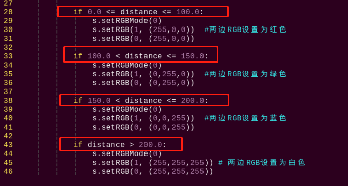

(4) Press "i" key on keyboard to enter the edit mode.

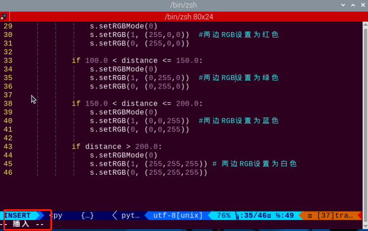

(5) Modify data as the figure shown below:

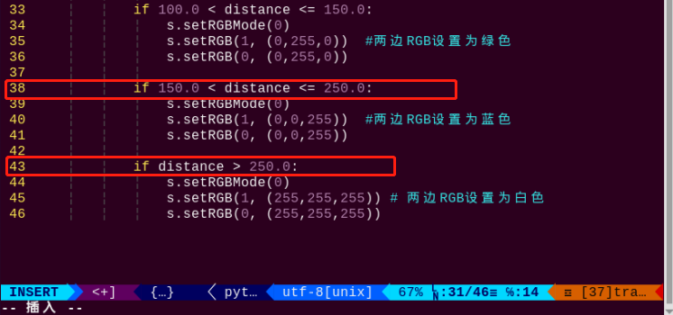

(6) After modification, press "Esc" and enter ":wq" (please note that the colon is in front of wq), and then press "Enter" to save the modified content.

```bash
:wq
```

* **Customize RGB Color** 

Similarly, we can change the RGB light color. Take changing the color of RGB light from white to orange as example. The specific operation step is as follow:

(1) Please refer to "[11.4.5 Function Extension -> Modify the Mesured Distance](#anachor_11_4_6)" to open game program File.

(2) Find the code as the figure shown below in the opening interface.

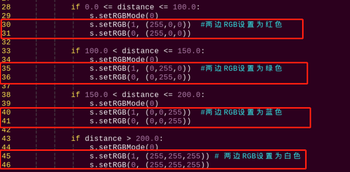

(3) Modify the value of RGB to change the light color. `setRGB(1,(255,255,255))` and `setRGB(0,(255,255,255))` are modified to `setRGB(1,(255, 127,0))` and `setRGB(0,(255, 127,0))`,as the figure shown below:

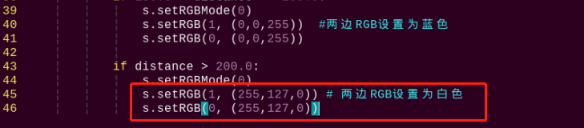

RGB value refers to the red, green and blue components in a certain color.

Theoretically, the three primary colors which are red, green and blue can be mixed in different proportion to make any color. The closer of the RGB value of a color, the closer it is to gray or black and white, and the larger the value, the  whiter it is, and vice verse, the darker it is.

For example, the value of B is the largest in RGB (150, 152, 183), which means the color contains more blue color, so it can be identified as a grayish blue.

(4) After modification, press "Esc" and enter ":wq" (please note that the colon is in front of wq), and then press "Enter" to save the modified content.

```bash
:wq
```

## 11.5 Dot Matrix Module

### 11.5.1 Getting Ready

Prepare a dot matrix module and connect it to any one of GPIO ports on Raspberry Pi expansion board through 4PIN cable. The wiring effect is as follow:

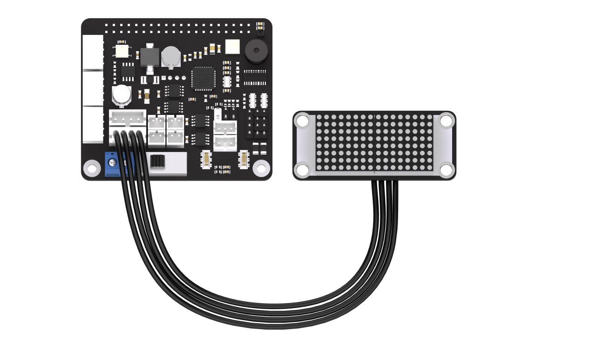

### 11.5.2 Module Usage

The dot matrix module used in this lesson is composed of two red 8×8 LED dot matrix screens. The dot matrix screen can be controlled by driving the control chip. It features high display brightness, no flash during display and   simple wiring, and can display number, text, pattern and other contents.

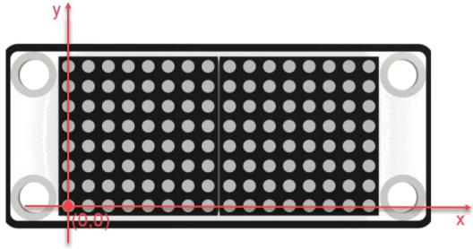

### 11.5.3 Operation steps

(1) Open the terminal and input command "/home/pi/TonyPi/Extend/sensor_course/sensor_example/". Press Enter to come to the directory of the game program.

```
/home/pi/TonyPi/Extend/sensor_course/sensor_example/
```

(2) Enter "python3 lattice_display.py" command, and then press " Enter" to start the game.

```bash
python3 lattice_display.py
```

(3) If want to close this program, press "Ctrl+C" . You can try multiple time if fail to close.

### 11.5.4 Project Outcome

After the program is started, the dot matrix screen will display the text " Hello" . When the program is closed, the screen will turn off completely.

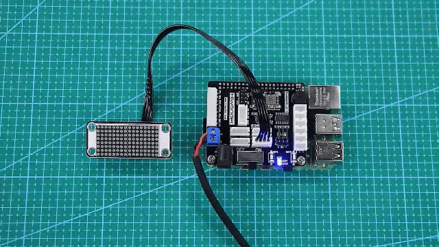

### 11.5.5 Working Principle

In this project, we control the display module of the dot matrix module through a set of hexadecimal data. A set of data contains 16 data in total, and each data control one column of the LED screen.

The source code of program is located in:[/home/pi/TonyPi/Extend/sensor_course/sensor_example/lattice_display.py](https://store.hiwonder.com.cn/docs/tonypi_pro/source_code/sensor_basic_development/lattice_display.zip)

{lineno-start=1}

```python
#!/usr/bin/python3
# coding=utf8
# 4.拓展课程学习\7.拓展课程之传感器基础开发课程\第5课 点阵模块实验
import time
from hiwonder import dot_matrix_sensor

dms = dot_matrix_sensor.TM1640(dio=7, clk=8)
if __name__ == "__main__":

    while True:
        try:
            dms.display_buf=(0x7f, 0x08, 0x7f, 0x00, 0x7c, 0x54, 0x5c, 0x00,
                              0x7c, 0x40, 0x00,0x7c, 0x40, 0x38, 0x44, 0x38)
            dms.update_display()
            time.sleep(5)
        except KeyboardInterrupt:
            dms.display_buf = [0]*16
            dms.update_display()
            break


```
### 11.5.6 Function Extension

The default content displayed in this section of the program is "Hello" in dot matrix. If you want to modify the displayed text, for example, changing it to "Love", you can follow these steps:

Before making modifications, we need to obtain the address symbols of the letters in the dot matrix display. Here, we can use modulus software to obtain them.

(1) Double-click to open the modulus software located in the same directory as this section.

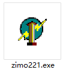

(2) First, click on "New Image", then in the popup settings box, set the size parameters of the dot matrix module to "16*8". Once set, click "OK" to confirm.

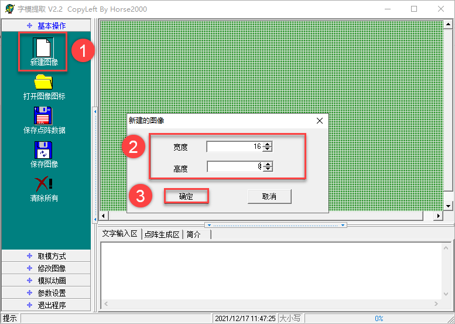

(3) Click "Simulated Animation" and "Enlarge Grid Points" in turn to enlarge the dot matrix simulation area on the right side.


(4) Next, use the mouse to click and draw the displayed content in the right area.

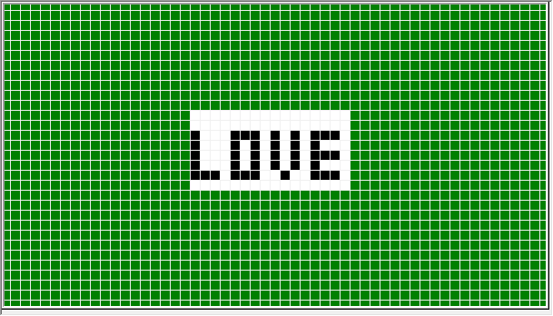

(5) After finishing the drawing, click on "Modulation Mode" and then "51 Format" in turn to obtain the address symbols. 


(6) Open terminal and input command. Press Enter to locate to the content of the game program.

```
/home/pi/TonyPi/Extend/sensor_course/sensor_example/
```

(7) Input command "vim lattice_display.py" and press Enter to open game program file.

```bash
vim lattice_display.py
```

(8) Locate the following code in the interface.

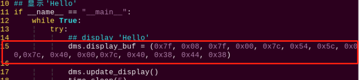

(9) Press "i" key on the keyboard to proceed to the edition mode.


(10) Replace the default address symbols in the program with the address symbols obtained from the modulus software, as shown in the following image:


(11) After completing the modifications, press the "Esc" key once, then type ":wq" (note the colon before wq), and press Enter to save the changes.

```bash
:wq
```

## 11.6 Light Sensor

### 11.6.1 Getting Ready

Prepare a light sensor and connect it to any one of GPIO ports on Raspberry Pi expansion board through 4PIN cable. The wiring effect is as follow:

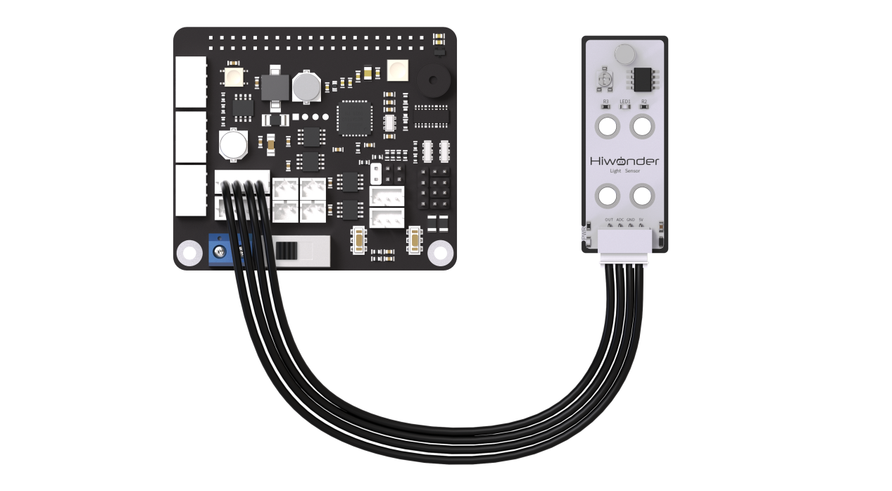

:::{Note}
Please do not insert forcefully because 4PIN cable uses anti-reverse plugging design.
:::

### 11.6.2 Module Usage

The light sensor mainly includes a QTH23C (photodiode) and LM358chi (voltage comparator).

We can set a threshold by adjusting the potentiometer on sensor. 

When the external brightness is greater than the threshold, LED1 on module will light up and the signal terminal OUT will output a low level. When the external brightness is less than the threshold, LED1 on module will light off and the signal terminal OUT will output a high level.

### 11.6.3 Operation Steps

(1) Click the icon  on the upper left corner of the desktop to open the command line terminal. Input "cd /home/pi/TonyPi/Extend/sensor_course/sensor_example/" and press Enter to go to the directory of game program.

```bash
cd /home/pi/TonyPi/Extend/sensor_course/sensor_example/
```

(2) Enter command, and then press "Enter" to start the game.

```bash
python3 photo_sensitive_control.py
```

(3) If want to close this program, press "Ctrl+C". You can try multiple time if fail to close.

### 11.6.4 Project Outcome

After the program is started, the buzzer will sound once when the external brightness is higher than the threshold set by the light sensor.


### 11.6.5 Working Principle

When the external brightness is higher than the threshold set by the module, the signal terminal OUT outputs a low level, otherwise it output a high level. We can judge the current status of the sensor according to the level change of the signal terminal OUT.
The source code of the program is located in: [/home/pi/TonyPi/Extend/sensor_course/sensor_example/photo_sensitive_control.py](https://store.hiwonder.com.cn/docs/tonypi_pro/source_code/sensor_basic_development/photo_sensitive_control.zip)

{lineno-start=1}

```python
#!/usr/bin/python3
# coding=utf8
# 4.拓展课程学习\7.拓展课程之传感器基础开发课程\第6课 光线传感器模块实验
import os
import sys
import time
import gpiod
import hiwonder.ros_robot_controller_sdk as rrc

if sys.version_info.major == 2:
    print('Please run this program with python3!')
    sys.exit(0)


board = rrc.Board()
    
st = 0

chip = gpiod.Chip('gpiochip4')
light = chip.get_line(24)
light.request(consumer="light", type=gpiod.LINE_REQ_DIR_IN, flags=gpiod.LINE_REQ_FLAG_BIAS_PULL_UP)

if __name__ == "__main__":
    while True:
        state = light.get_value()  #读取引脚数字值
        print(state)
        if not state:
            if st :            #这里做一个判断,防止反复响
                st = 0
                board.set_buzzer(1900, 0.1, 0.9, 1) # 以1900Hz的频率,持续响0.1秒,关闭0.9秒,重复1次
                time.sleep(1)
                
        else:
            st = 1
            board.set_buzzer(1000, 0.0, 0.0, 1) # 关闭
            
        board.set_buzzer(1000, 0.0, 0.0, 1) # 关闭
```

Initialize variable st, and set it to 0.

Use gpiod.Chip('gpiochip4') to create a GPIO object, and use get_line(7) to get the object of No.7 GPIO pin. Then, the pin is requested to be set as an input direction by using the request() method.

Entering the main loop: The program enters an infinite loop, continuously executing the following operations:

Reading pin state: Using `light.get_value()` to read the digital value (0 or 1) of No.7 GPIO pin.

Checking pin state: If the pin state is 0 (low), and the variable "st" is true (non-zero), then execute the following operations"

Set variable "st" to 0, indicating that a trigger has been responded to once.

Call the method `board.set_buzzer(1900, 0.1, 0.9, 1)` to set the buzzer to sound at a frequency of 1900Hz for 0.1 seconds, followed by a silence of 0.9 seconds, and repeat this process once.

Program delays for 1 second.
