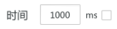
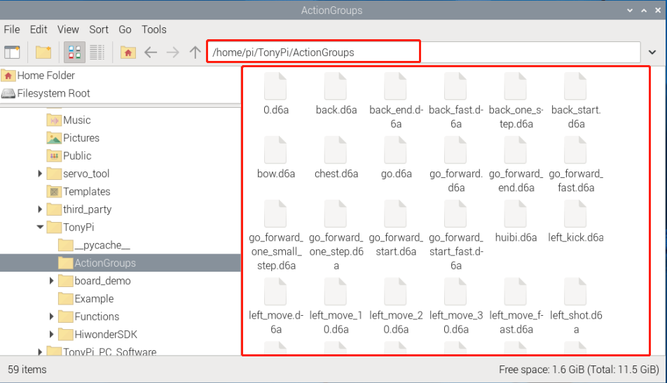

# 上位机动作编辑课程

## 1. 上位机功能说明

本节主要是对TonyPi上位机软件进行介绍，让大家快速的熟悉此上位机的使用。

首先连接VNC远程桌面，然后在桌面位置双击打开上位机软件"**TonyPi**"。（出现弹窗提示时，直接点击"**执行**" 即可）


TonyPi上位机软件"**中文**"模式下的主界面可分为以下区域：


###  1.1 舵机操控区

我们可以通过调整舵机操控区域显示的对应舵机滑杆值，从而调整舵机位置。

| 图标 | 功能说明 |
|:--:|:--:|
|  | 代表舵机的ID号，这里以1号舵机为例。 |
|  | 用于调整舵机位置，最小值为0，最大值为1000 。 |
|  | 用于调整舵机偏差，最小值为-125，最大值为125。 |

### 1.2 动作详情列表

动作详情列表显示了当前动作组内每个动作的执行时间，以及每个动作分布的舵机值。


| 图标 | 功能说明 |
|:--:|:--:|
|  | 动作组编号。 |
|  | 动作运行的时间，即执行该动作需所用的时间。 |
|  | 对应该ID下的动作数值，双击下方数值可直接修改。 |

### 1.3 动作组设置区域

| 图标 | 功能说明 |
|:--:|:--:|
|  | 动作运行的持续时间，鼠标单击图标中数值，可进行修改。注意：需搭配"**更新动作**"按扭生效，另外时间数值范围为20-9999。 |
|  | 动作组中所有动作运行完成所需的总时间。 |
|  | 点击后机器人的关节会变得松弛，此时我们就可以用手把机器人掰成想要的造型了。 |
|  | 将掰成形状的角度信息读取出来。（需要搭配"**手掰编程**"按钮使用） |
|  | 将舵机操控区域的舵机数值作为一个动作，添加至动作详情列表的最后一行。 |
|  | 将删除动作详情列表里选中的动作。 |
|  | 将动作详情列表中选中的角度数值进行替换。 （角度数值替换为舵机操控区域的舵机值，动作运行时间替换为"**时间**"内设定的时间） |
|  | 在选中的动作上面插入一行动作。（其中动作的时间为"**时间**"的时间，角度数值为舵机操控区域的舵机值） |
|  | 将选中的动作移动到动作详情列表的上一行。（原上一行的动作将下移） |
|  | 将选中的动作移动到动作详情列表的下一行。（原下一行的动作将上移） |
|  | 单击该按钮后将会执行动作详情列表的动作一次。 |
|  | 如果勾选了"**循环**"，机器人便重复运行动作。 |
|  | 单击后选择要打开的动作组即可将动作组数据加载到动作详情列表中。 |
|  | 将动作详情列表里的动作保存到指定位置。 |
|  | 打开一个动作组后，点击此按钮，可继续打开另一个动作组文件，将两个动作组文件合并为一个新的动作组。 |
|  | 可在上位机中显示已保存的动作组。 |
|  | 删除当前选中序号的动作组内文件。 |
|  | （**慎点**）删除所有动作组文件。 |
|  | 执行动作组（选定序号）一次。 |
|  | 停止正在运行的动作组。 |

### 1.4 偏差设置区域（此区域功能按键了解即可）

| 图标 | 功能说明 |
|:--:|:--:|
|  | 单击后即可自动读取保存的偏差值。 |
|  | 单击后即可将通过上位机调整好的偏差值下载到机器人中。 |
|  | 单击后即可将舵机操控区域的所有舵机恢复至500位置。 |

## 2. 动作调用教学

### 2.1 实现目标

本节主要通过TonyPi 上位机，对内置动作组进行调用。

### 2.2 动作组调用

1)  将设备开机，并参照课程资料的"**1. 远程工具安装与连接**"内容，通过VNC远程连接工具连接。


2)  双击，选择"Execute"打开上位机。


3)  点击"**打开动作文件**"将本文同路径下的动作组文件打开。


4)  此时动作详情列表会显示已打开的动作组。


5)  点击"运行"即可。


6)  也可点击动作组的下拉按钮，选择要运行的动作组，再点击动作组运行即可。


<p id="anchor_3"></p>

## 3. 动作编辑教学

### 3.1 实现目标 

创建一个机器人进行"鞠躬"的动作组，该动作组由 8个独立的动作组成。

### 3.2 动作实现 

- #### 3.2.1 动作设计

**步骤 1** ：TonyPi机器人启动后，将当前分布的16个舵机动作数据分别按照下图红框内的数据进行更改，然后点击动作编辑区域的**"添加动作"**按钮，即完成第一个动作的添加。


**步骤 2** ：接下来，我们先让机器人的手臂和膝盖伸直。参考下图红框所示的舵机数值进行调整即可。然后点击动作编辑区域的**"添加动作"**按钮，将动作加至动作列表内。后续动作数值调整后，都需要添加至动作列表内。


**步骤3** ：接着再将舵机数据按照下图红框所示更改，将机器人双臂抬起。


**步骤4**：然后让机器人双臂摆出"作揖"的姿势。


**步骤5** ：我们让机器人进行"弯腰鞠躬"，按照下图红框内所示数值，对舵机进行调整，将它作为第5个动作。


**步骤6** ：为了让动作过渡的更加自然，第6个动作和第5个动作是一样的。这里我们继续单击"**添加动作**"即可。


**步骤7** ：接着我们让机器人身体伸直，但双臂继续保持作揖姿态。舵机数据参考下图红框内所示：


**步骤8** ：最后，让机器人恢复初始姿态，将各个舵机数据修改成与1号动作一致，然后点击"**添加动作**"即可。 如图所示：


该动作组的全部数值参数如下表所示：（红色为需要调整的舵机数值）

- #### 3.2.2 动作保存

为了便于后期的调试和管理，可将动作保存起来。单击"**保存动作文件**"按钮，在打开

的界面中路径选择为"**/home/pi/TonyPi/ActionGroups**"，这里以"**1_bow**"为例进行命名， 单击"**Save**"即可。


## 4. 串联动作文件

### 4.1 实现目标 

串联动作文件是将两个动作组文件首尾串联起来组成一个新的动作组文件，这样可实现

动作组文件之间的合并。本节以串联1号和2号动作为例进行展示动作组的串联。

### 4.2 动手实现 

**步骤1** ：连接VNC后，打开TonyPi上位机。


**步骤2** ：点击动作组设置区的**"串联动作文件"**按钮，在打开的弹窗界面中选择"1.d6a"，

双击打开。


**步骤3** ：此时，我们看到动作组详情列表中显示了1号动作组参数。


**步骤4** ：再次点击"**串联动作文件**"，选择"2.d6a"。双击打开，此时2号动作组文件

已经串联进来了。


**步骤5** ：点击"**运行**"，将串联的新动作组在线运行一遍。


**步骤6** ：点击"**保存动作文件**"按钮，输入新动作组的名称（如"**3**"），再点击"**Save**"，将新串联的动作组进行保存，以便后期调试。


## 5. APP自定义控制

实现目标：将本单元前面"[3. 动作编辑教学](#anchor_3)"中的动作组文件，通过手机APP自定义功能来执行。我们这里以执行举重动作为例。

### 5.1 准备工作

1. 连接好**VNC**后，打开系统桌面的文件管理器。


2. 前往"**/home/pi/TonyPi"**路径，找到**ActionGroupDict.p**y文件，然后右键打开。这里以**Text Editor**方式为例进行打开：


3. 然后，我们复制第24号动作所在行，选中右键复制或按下**"Ctrl+C"**即可。


4. 将程序粘贴至新的一行。序号设定为35号，名称填写为**"weightlifting"**（参考**/home/pi/TonyPi/ActionGroups**内的动作组文件名称），注释改为举重。


:::{Note}
动作组序号请勿选用已定义序号和255号，动作组名称请与存储目录（/home/pi/TonyPi/ActionGroups）内的名称保持一致。
:::

5. 按下**Ctrl+S**保存，并退出。

6. 最后，输入命令重启树莓派即可。（此步骤一定要进行）

```commandline
sudo reboot
```

### 5.2 操作步骤

1. 打开手机APP，通过前面所学连接机器人，进入"机体遥控"界面，。


2. 然后，先点击"**动作**"按钮，接着在弹出的界面中任选一个 **"custom"** ，长按进入。

 


3. 在弹出的界面中分别填写保存的动作组名称和序号，点击**"好的"**进行保存。


动作名称可以任意填写，但动作组编号要填写正确，否则无法实现。

4. 添加完成后，单击该动作名称按钮便可以执行一次。


5. 如需修改或删除动作，直接长按动作名称按钮进入，将动作名称改回默认的 **"Custom"** ，序号改回 **"255"** 即可。

## 6. 通过命令行调用动作组

### 6.1 实现目标

除了可以通过上位机调用来TonyPi的动作组之外，用户还可以通过在终端执行指令来运行动作组。

:::{Note}
动作组文件必须保存在目录"/home/pi/TonyPi/ActionGroups"下。
:::

点击系统状态栏的图标，打开文件管理器，进入目录"**/home/pi/TonyPi/ActionGroups**"，即可查看该目录下是否有所需的动作组文件。



### 6.2 调用动作组

1)  在树莓派的桌面双击的"**Terminator**"图标，打开命令行终端。

2)  输入指令，并按下回车，切换到玩法程序所在的路径下。

```commandline
cd TonyPi/Example/
```

3. 输入指令，并按下回车，启动玩法。

```commandline
python3 ActionGroupControlDemo.py
```

此时，机器人会先执行"**stand**"动作组，然后执行两次"**go_forward**"动作组，运行完成后，终端会自动关闭程序。

### 6.3 修改调用动作组

<p id="anchor_6_3_1"></p>

- #### 6.3.1 调用单个动作组

用户可以通过修改程序，令机器人**仅执行单个动作组**，具体操作步骤如下：

1)  在树莓派的桌面双击的"**Terminator**"图标，打开命令行终端。

2)  输入指令，并按下回车，切换到玩法程序所在的路径下。

```commandline
cd TonyPi/Example/
```

3)  输入指令，并按下回车，打开程序文件。

```commandline
vim ActionGroupControlDemo.py
```

4. 按下键盘的"**I**"键，进入程序编辑模式。


5. 找到如下图所示的代码：


6. 在第28行代码的开头处添加符号"**\#**"，将此行代码注释掉，只保留执行1号动作组的代码即可（此时保留的15行代码只可运行动作组一次，如想运行多次动作组，可注释15行，保留16行代码）。


7. 然后可在保留的15行代码单引号内输入想要执行的动作组，以下以执行"**back**"动作组为例。

:::{Note}
动作组文件必须保存在目录"/home/pi/TonyPi/ActionGroups"下，若想调用自定义动作组，可先参照"[3. 动作编辑教学](#anchor_3)"来编辑动作。
:::


8. 修改完成后，按下键盘的"**Esc**"键，退出编辑模式。输入指令，并按下回车，保存并退出程序文件。

```commandline
:wq
```

9. 输入指令，并按下回车，启动玩法，机器人会执行一次"**back**"动作组。

```commandline
python3 ActionGroupControlDemo.py
```

- #### 调用多个动作组

**以下操作是基于"[调用单个动作组](#anchor_6_3_1)"基础上继续操作。**

用户可以通过复制粘贴多行调用代码的方法，令机器人**依次执行多个动作组**，本节以调用"**go**"、"**move_up**"动作组为例，具体操作步骤如下：

1)  参照"[**调用单个动作组**](#anchor_6_3_1)"的步骤1-3，打开程序文件(不要进入编辑模式，否则会复制失败，若当前是编辑模式，可按下键盘上的"Esc"键)。

2)  使用方向键调整光标到第15行前，分别按下键盘"**yy**"。（若想复制2行，就按下2yy，2表示复制2行的意思，需要复制几行，数字就输入几，比如复制5行，就5yy）

3)  然后使用方向键将光标移动到15行尾，按下"**p**"，即可进行粘贴。


4)  按下"**i**"，进入编辑模式，将15行和16行代码内的数字修改为"**go**"和"**move_up**"。


:::{Note}
动作组文件必须保存在目录"/home/pi/ArmPi_mini/ActionGroups"下，且程序内的动作组名称要与文件夹中存储的名称一致，否则将调用失败！
:::

5)  修改完成后，按下键盘的"**Esc**"键，退出编辑模式。输入指令，并按下回车，保存并退出程序文件。

```commandline
:wq
```

6)  输入指令，并按下回车，启动玩法，机器人会执行依次执行"**go**"、"**move_up**"动作组。

```commandline
python3 ActionGroupControlDemo.py
```
