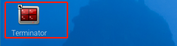
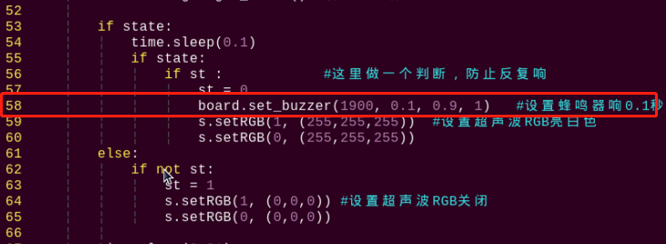

# 12. Sensor Combined Practical

## 12.1 Fan Tracking

### 12.1.1 Getting Ready

Prepare a fan module and install it on the expansion hole of the robot's right arm. The specific installation method can refer to the file "**[Sensor Installing and Wiring]()**".


### 12.1.2 Brief explanation

Let's look at the working principle of this lesson:

Firstly, scale the screen to detect the human face. Then convert the recognized face coordinates into the coordinates before scaling, and then judge whether it is the biggest face, and frame the recognized face.

When the camera detects a face, raise the arm, align the fan with the face, and activate the fan module. If the camera cannot detect a face, deactivate the fan module, and rotate the camera's pan-tilt servo left and right to locate a face.

### 12.1.3 Operation Steps

:::{Note}
The entered command must pay attention to case sensitivity and space.
:::

(1) Turn on the robot and connect to Raspberry Pi desktop with VNC.

(2) Click the icon  on the upper left corner of the desktop to open the command line terminal.



(3) Enter command and press "Enter" to come to the directory of the game programmings.

```bash
cd /home/pi/TonyPi/Extend/sensor_course/sensor_development/
```

(4) Enter command, and then press "Enter" to start the game.

```bash
python3 face_track_and_fan.py
```

(5) If want to exit the game, press "Ctrl+C" in the LX terminal. Please try multiple times if fail to exit.

### 12.1.4 Project Outcome

After the program is started, TonyPi Pro raises left arm and detects face. When the human face is detected, the fan revolves, vice verse.


<p id="anchor_12_1_5"></p>

### 12.1.5 Working Principle

The source code of the program is located in: [/home/pi/TonyPi/Extend/sensor_course/sensor_development/face_track_and_fan.py](https://store.hiwonder.com.cn/docs/tonypi_pro/source_code/sensor_combined_practical/face_track_and_fan.zip)

* **Import parameter module** 

|      **Import module**      | **function**                                                          |
|:-----------------------------------------:|:---------------------------------------------------------------------------------------------------------------------------------------------------|
|           import sys           | The Python "sys" module has been imported for accessing system-related functions and variables.                                                    |
|           import cv2           | The OpenCV library has been imported for image processing and computer vision-related functionalities                                              |
|           import time           | The Python "time" module has been imported for time-related functionalities, such as delay operations.                                             |
|           import math           | The "math" module provides low-level access to mathematical operations, including many commonly used mathematical functions and constants.         |
|         import threading         | Provides an environment for running multiple threads concurrently.                                                                                 |
|           import np           | The NumPy library has been imported. It is an open-source numerical computing extension for Python, used for handling array and matrix operations. |
|     from hiwonder.PID import PID     | Import PID control library                                                                                                                         |
|    from hiwonder.Misc import Misc     | The "Misc" module has been imported for handling recognized rectangular data.                                                                      |
|   from hiwonder import Board as Board   | Imported Board module for controlling external devices such as robot servos and buzzers                                                            |
|     import hiwonder.Camera as Camera      | Import camera library                                                                                                                              |
| import hiwonder.ActionGroupControl as AGC | Import action group execution library                                                                                                              |
|         import common.yaml_handle         | Contains functionalities or tools related to processing YAML format files.                                                                         |

* **Initialization** 

**(1) Import Function Libraries**

In this step of initialization, the first task is to import the function libraries, which will facilitate subsequent program calls. Regarding the content imported, you can refer to the [12.1.5 Working Principle -> Import Parameters Module](#anchor_12_1_5) for details.

{lineno-start=3}

```python
import sys
import cv2
import math
import time
import threading
import numpy as np
import mediapipe as mp
import gpiod
import hiwonder.ros_robot_controller_sdk as rrc
from hiwonder.Controller import Controller
import hiwonder.Misc as Misc
import hiwonder.Camera as Camera
import hiwonder.ActionGroupControl as AGC
import hiwonder.yaml_handle as yaml_handle
```

* **Set Initial State** 

Setting the initial state involves configuring various parameters such as the initial position of the servo, the face recognition module, and the minimum face confidence level.

{lineno-start=39}

```python
# 初始位置
def initMove():
    ctl.set_pwm_servo_pulse(1, 1600, 500)
    ctl.set_pwm_servo_pulse(2, servo2_pulse, 500)
```

{lineno-start=25}

```python
#模型位置
modelFile = "/home/pi/TonyPi/models/res10 300x300 _ssd iter 140000 fp16.caffemodel"
configFile ="/home/pi/TonyPi/models/deploy.prototxt'
net = cv2.dnn.readNetFromcaffe(configFile, modelFile)
```

* **Image Processing** 

**(1) Color Space Conversion**

Convert BGR images to RGB images.

{lineno-start=135}

```python
image_rgb = cv2.cvtColor(img_copy, cv2.COLOR_BGR2RGB) # 将BGR图像转为RGB图像
```

**(2) Use MediaPipe Face Model for Recognition**

Perform face detection and draw a rectangular box around the detected face. Subsequently, determine whether the center of the face is located in the center of the frame. If it is, set start_greet to True to execute the predefined action sequence.

{lineno-start=136}

```py
results = face_detection.process(image_rgb) # 将每一帧图像传给人脸识别模块
if results.detections:   # 如果检测不到人脸那就返回None
    for index, detection in enumerate(results.detections): # 返回人脸索引index(第几张脸)，和关键点的坐标信息
        bboxC = detection.location_data.relative_bounding_box # 设置一个边界框，接收所有的框的xywh及关键点信息

        # 将边界框的坐标点,宽,高从比例坐标转换成像素坐标
        bbox = (int(bboxC.xmin * img_w), int(bboxC.ymin * img_h),  
                int(bboxC.width * img_w), int(bboxC.height * img_h))
        cv2.rectangle(img, bbox, (0,255,0), 2)  # 在每一帧图像上绘制矩形框
        x, y, w, h = bbox  # 获取识别框的信息,xy为左上角坐标点
        center_x =  int(x + (w/2))
        if abs(center_x - img_w/2) < img_w/4:
            start_greet = True
```

* **Face Recognition** 

If no face is recognized, control the pan-tilt gimbal servo to rotate left and right in search of a face.

If a face is recognized, use the `Board.setBusServoPulse` function to control the hand servo to lift up and turn on the fan.

{lineno-start=168}

```py
while True:
    ret,img = my_camera.read()
    if ret:
        frame = img.copy()
        # 纠正镜头畸变
        frame = cv2.remap(frame.copy(), mapx, mapy, interpolation=cv2.INTER_LINEAR, borderMode=cv2.BORDER_CONSTANT) 
        Frame = run(frame)           
        cv2.imshow('Frame', Frame)
        key = cv2.waitKey(1)
        if key == 27:
            break
        else:
            time.sleep(0.01)
```

## 12.2 Sing and Dance

### 12.2.1 Getting Ready

Prepare a touch sensor and MP3 module, and then install them on the expansion holes of shoulder (two elements, unlimited shoulder position). The specific installation method can refer to the file **[Sensor Installing and Wiring]()** under the same directory.


### 12.2.2 Brief explanation

Let's look at the working principle:

When touch the metal plate of the sensor, the controller will receive a low-level signal. Otherwise, it will receive a high-level signal. According to this characteristics, sum the number of the output low level signal and combine MP3 module, the number of touch corresponds to different song and dance.

### 12.2.3 Operation Steps

:::{Note}
The entered command must pay attention to case sensitivity and space.
:::

(1) Turn on the robot and connect to the Raspberry Pi desktop through VNC.

(2) Click the icon  on the upper left corner of the desktop to open command line terminal.

(3) Enter and press Enter to go to the directory of game program.

```bash
cd /home/pi/TonyPi/Extend/sensor_course/sensor_development/
```

(4) Enter command and then press Enter to start the game.

```bash
python3 touch_color_and_mp3.py
```

(5) If you want to exit the game, press "Ctrl+C" in the LX terminal. Please try multiple times if fail to exit.

### 12.2.4 Project Outcome

After the program is started, touch the touch sensor on the robot's shoulder, and then the buzzer will give feedback. The robot will perform corresponding dance and song according to the number of touches, as the table shown below:

| **The number of touches** | **Song** |
|:------------:|:------------:|
|      1       |    Little Apple    |
|      2       |   Super Champion   |
|      3       |    Love, Start    |


### 12.2.5 Working Principle

The source code is located in：[/home/pi/TonyPi/Extend/sensor_course/sensor_development/touch_color_and_mp3.py](https://store.hiwonder.com.cn/docs/tonypi_pro/source_code/sensor_combined_practical/touch_color_and_mp3.zip)

* **Importing Parameter Modules** 

| **Import module** | **Functions** |
|:--:|:--:|
| import sys | Imports the Python sys module for accessing system-related functions and variables. |
| import cv2 | Imports the OpenCV library for image processing and computer vision tasks. |
| import time | Imports the Python time module for time-related functions, such as delays. |
| import math | Provides low-level access to mathematical operations and includes many commonly used mathematical functions and constants. |
| import threading | Provides an environment for multithreaded execution. |
| import np | Imports the NumPy library, an open-source numerical computing extension for Python, used for handling array and matrix operations. |
| from hiwonder.PID import PID | Imports the PID control library. |
| from hiwonder import Misc as Misc | Imports the Misc module for processing recognized rectangular data. |
| from hiwonder import Board as Board | Imports the Board module for controlling peripherals such as robot servos and buzzers. |
| import hiwonder.camera as camera | Imports the camera library. |
| import hiwonder.ActionGroupControl as AGC | Imports the action group execution library. |
| import hiwonder.yaml_handle | Contains functions or tools related to handling YAML format files. |

* **Initialization** 

**(1) Importing Functional Libraries**

In the initialization step, functional libraries are imported to facilitate subsequent program calls. For details on the imported content, refer to 2.5.1 Importing Parameter Modules.

{lineno-start=4}

```py
import os
import sys
import time
import signal
import threading
import gpiod
import hiwonder.ros_robot_controller_sdk as rrc
from hiwonder.Controller import Controller
import hiwonder.MP3 as MP3
import hiwonder.ActionGroupControl as AGC
import hiwonder.yaml_handle as yaml_handle
```

**(2) Setting Initial State**

Sets the initial position of the servos.

{lineno-start=36}

```py
# 初始位置
def initMove():
    ctl.set_pwm_servo_pulse(1, 1500, 500)
    ctl.set_pwm_servo_pulse(2, servo_data['servo2'], 500)
```

* **Get touch sensor data** 

Reads the level of GPIO pin 26. Based on the level signal, controls the buzzer to sound and counts the touches.

{lineno-start=94}

```py
while move_st:
    touch = touchPin.get_value()   #读取引脚数字值

    if touch:
        state = True

    elif not touch and state:
        num += 1
        state = False
        board.set_buzzer(1900, 0.1, 0.9, 1)    #设置蜂鸣器响
        if num == 1:
            time_wait = True
            time_ = time.time()
            time.sleep(0.1)
```

* **Playing Music and Dancing** 

Depending on the number of touches, the corresponding song is played, and the corresponding action group is called to control the robot's dance.

{lineno-start=54}

```py
def move(num_):
    global pause_en
    print(num)
    if num_ == '1':
        pause_en = True
        mp3.volume(30) #设置音量为30，注意在播放前设置
        mp3.playNum(18) #播放歌曲18
        time.sleep(0.8)
        AGC.runActionGroup('18')
    elif num_ == '2':
        pause_en = True
        mp3.volume(30) 
        mp3.playNum(22) 
        time.sleep(0.8)
        AGC.runActionGroup('22')
    elif num_ == '3':
        pause_en = True
        mp3.volume(30) 
        mp3.playNum(24) 
        time.sleep(0.8)
        AGC.runActionGroup('24')
    else:
        time.sleep(0.3)
        board.set_buzzer(1900, 0.2, 0.8, 1) 
        time.sleep(0.1)
        board.set_buzzer(1900, 0.2, 0.8, 1) 

        pause_en = False
```

### 12.2.6 Function Extension

The default volume of playing song is 30. If want to adjust the volume (This section takes reducing the volume to 10 as example), please refer to the following steps:

(1) Enter the command and press "Enter" to come to the directory of the game programmings.

```
/home/pi/TonyPi/Extend/sensor_course/sensor_example/
```

(2) Enter command and press Enter to open the game program file.

```bash
vim touch_color_and_mp3.py
```

(3) Find the code shown in the figure below:


(4) Press "i" on the keyboard. When "insert" appears in the lower left corner, which means it has entered the editing mode.


(5) Modify "30" in "mps.volume(30)" to "10", as the figure shown below:


(6) After modification, press " Esc" and then enter " :wq" (Please note that the colon is in front of wq). Then press "Enter" to save and exit the modified content.

```bash
:wq
```


## 12.3 Obstacle Avoidance

### 12.3.1 Getting Ready

Prepare an ultrasonic sensor and install it on the expansion hole of robot's left hand. The specific installation method can refer to the file "Sensor Installing and Wiring" under the same directory.


### 12.3.2 Brief explanation

Let's look at the working principle:

Firstly, the distance to the obstacle ahead is detected by the ultrasonic sensor, and then set the ultrasonic measurement threshold. When the conditions are met, the robot automatically avoids the obstacle, otherwise it moves forward directly.

### 12.3.3 Operation Steps

:::{Note}
The entered command must pay attention to case sensitivity and space.
:::

(1) Turn on the robot and connect to the Raspberry Pi desktop through VNC.

(2) Click the icon  on the upper left corner of the desktop to open command line terminal. Enter "cd /home/pi/TonyPi/Extend/sensor_course/sensor_development/"  command and press " Enter" to come to the directory of the game programmings.

```bash
cd /home/pi/TonyPi/Extend/sensor_course/sensor_development/
```

(3) Enter "python3 sonar_barrier.py" command, and then press " Enter" to start the game.

```bash
python3 sonar_barrier.py
```

(4) If you want to exit the game, press "Ctrl+C" in the LX terminal. Please try multiple times if fail to exit.

### 12.3.4 Project Outcome

After the program is started, if the distance between the ultrasonic wave and the object ahead is less than or equal to 30cm, it is determined to be an obstacle. TonyPi Pro will raise its left hand to detect whether there is an obstacle ahead. If not, the robot will move forward; If there is an obstacle, the ultrasonic sensor will detect the robot of the left and right sides to control the movement of the robot.


<p id="anchor_12_3_5"></p>

### 12.3.5 Working Principle

The source code is located in：[home/pi/TonyPi/Extend/sensor_course/sensor_development/sonar_barrier.py](https://store.hiwonder.com.cn/docs/tonypi_pro/source_code/sensor_combined_practical/sonar_barrier.zip)

* **Importing Parameter Modules** 

| **Import module** | **Functions** |
|:--:|:--:|
| import sys | Imports the sys module of Python, used for accessing system-related functions and variables. |
| import cv2 | Imports the OpenCV library, used for image processing and computer vision tasks. |
| import time | Imports the time module of Python, used for time-related functions such as delays. |
| import math | Imports the math module, which provides low-level access to mathematical operations and includes many commonly used mathematical functions and constants. |
| import threading | Provides an environment for multithreaded execution. |
| import np |  Imports the NumPy library, an open-source numerical computing extension for Python used for handling arrays and matrix operations. |
| from hiwonder.PID import PID | Imports the PID control library from the hiwonder package. |
| from hiwonder import Misc as Misc | Imports the Misc module from the hiwonder package, used for processing recognized rectangular data. |
| from hiwonder import Board as Board | Imports the Board module from the hiwonder package, used for controlling peripherals such as robot servos and buzzers. |
| import hiwonder.camera as camera | Imports the camera library from the hiwonder package. |
| import hiwonder.ActionGroupControl as AGC | Imports the action group execution library from the hiwonder package. |
| import hiwonder.yaml_handle | Imports functionalities or tools related to handling YAML format files from the hiwonder package. |

* **Initialization** 

**(1) Importing Functional Libraries**

During initialization, functional libraries are imported to facilitate subsequent program calls. For details on the imported content, refer to the [12.3.5 Working Principle->Importing Parameter Modules](#anchor_12_3_5) and their Functions section.

{lineno-start=4}

```python
import os
import sys
import time
import threading
import numpy as np
import hiwonder.ros_robot_controller_sdk as rrc
from hiwonder.Controller import Controller
import hiwonder.Sonar as Sonar
import hiwonder.ActionGroupControl as AGC
```

**(2) Setting Initial State**

Sets the initial position of the robot.

{lineno-start=74}

```python
AGC.runActionGroup('stand_slow')
```

Sets some basic actions for the robot.

{lineno-start=23}

```python
# 抬起左手
def hand_up():
    ctl.set_bus_servo_pulse(8, 330, 1000)
    time.sleep(0.3)
    ctl.set_bus_servo_pulse(7,860,1000)
    ctl.set_bus_servo_pulse(6,860,1000)
    time.sleep(1)
# 放下左手
def hand_down():
    ctl.set_bus_servo_pulse(7,800,1000)
    ctl.set_bus_servo_pulse(6,575,1000)
    time.sleep(0.3)
    ctl.set_bus_servo_pulse(8,725,1000)
    time.sleep(1)
# 向左边伸手
def hand_left():
    ctl.set_bus_servo_pulse(8,330,1000)
    time.sleep(0.3)
    ctl.set_bus_servo_pulse(7,420,1000)
    ctl.set_bus_servo_pulse(6,920,1000)
    time.sleep(1)
```

* **Obtaining Ultrasonic Sensor Data** 

Reads the distance recognized by the ultrasonic sensor, continuously detects it six times, stores the values in a list, and calculates the average.

{lineno-start=127}

```py
distance_list.append(s.getDistance())

#连续检测6次，取平均值
if len(distance_list) >= 6: 
    distance = int(round(np.mean(np.array(distance_list))))
    print(distance, 'mm')
    distance_list = []
```

* **Obstacle Avoidance** 

When an obstacle is detected ahead, the robot will first turn left and extend its arm. It then continuously detects the distance on the left. If an obstacle is found on the left, the robot will turn right to avoid it; if an obstacle is also present on the right, the robot will back up to evade it. Finally, the robot will lift its arm and continue moving forward.

{lineno-start=55}

```py
while True:
    if distance != 99999:
        if distance <= 300: #检测前方障碍物
            distance = 99999
            hand_left() #向左边伸手
            time.sleep(1)
            #连续检测左边三次
            for i in range(3):
                dist_left.append(distance)
                time.sleep(0.05)
                #取平均值
                distance_left = round(np.mean(np.array(dist_left)))
                dist_left = []
                hand_up()

                if distance_left <= 300: #检测左边障碍物
                    distance_left = 99999
                    hand_down() # 放下左手
                    for i in range(5): #向右转
                        AGC.runActionGroup('turn_right')
                        time.sleep(0.2)

                        hand_up()
                        time.sleep(1)
                        # 连续检测右边三次
                        for i in range(3):
                            dist_right.append(distance)
                            time.sleep(0.05)

                            distance_right = round(np.mean(np.array(dist_right)))
                            dist_right = []

                            if distance_right <= 300: #检测右边障碍物
                                distance_right = 99999
                                hand_down()
                                for i in range(5): #向左转
                                    AGC.runActionGroup('turn_left')
                                    time.sleep(0.2)

                                    for i in range(5):#后退
                                        AGC.runActionGroup('back')
                                        hand_up()
                                    else: #右边没有障碍物,则直走,前面已经右转
                                        AGC.runActionGroup('go_hand_up')            
                                    else: #左边没有障碍物,则向左转
                                        hand_down()
                                        for i in range(5):
                                            AGC.runActionGroup('turn_left')
                                            time.sleep(0.2)
                                            hand_up()
                                        else:#前方没有障碍物,则直走
                                            AGC.runActionGroup('go_hand_up')
                                        else:   
                                            time.sleep(0.01)
```

### 12.3.6 Function Extension

The default distance of obstacle avoidance is 300mm. If want to modify the distance value (this section takes setting the distance as 100mm as example), please refer to the following steps:

(1) Enter command and press "Enter" to come to the directory of the game programmings.

```bash
cd /home/pi/TonyPi/Extend/sensor_course/sensor_development/
```

(2) Enter command, and then press "Enter" to open the game programming file.

```bash
vim sonar_barrier.py
```

(3) Find the code shown in the figure below:


(4) Press "i" on keyboard. When "Insert" appears in the lower left corner, which means it has entered the editing mode.


(5) Modify "300" in "if distance <= 300" to "100" , as the figure shown below:


(6) After modification, press "Esc" and then enter ":wq" (Please note that the colon is in front of wq). Then press "Enter" to save and exit the modified content.

```bash
:wq
```


## 12.4 Shape Recognition

### 12.4.1 Getting Ready

Prepare a dot matrix module and install it on the expansion hole of robot's left arm. The specific installation method can refer to the file **[Sensor Installing and Wiring]()** under the same directory.


### 12.4.2 Brief explanation

Let's look at the working principle. The camera recognizes the object within the visual range. When the shapes of the objects are identified as triangle, rectangles and circles, the dot matrix module will display the graphics shape of the current object, otherwise the dot matrix module does not display.

### 12.4.3 Operation Steps

:::{Note}
The entered command must pay attention to case sensitivity and space.
:::

(1) Turn on the robot and connect to the Raspberry Pi desktop through VNC.

(2) Click the icon  on the upper left corner of the desktop to open command line terminal. Enter command and press " Enter" to come to the directory of the game programmings.

```bash
cd /home/pi/TonyPi/Extend/sensor_course/sensor_development/
```

(3) Enter command, and then press" Enter" to start the game.

```bash
python3 shape_recognition.py
```

(4) If want to exit the game, press "Ctrl+C" in the LX terminal. Please try multiple times if fail to exit.

### 12.4.4 Project Outcome

After the program is tarted, the robot's camera will recognize the object. When the shape of the object is recognized as triangle, rectangle and circle, the dot matrix module will display the corresponding shape. Otherwise, it will not display.


### 12.4.5 Working Principle

The source code of the program is located in: [/home/pi/TonyPi/Extend/sensor_course/sensor_development/shape_recognition.py](https://store.hiwonder.com.cn/docs/tonypi_pro/source_code/sensor_combined_practical/shape_recognition.zip)

* **Importing Parameter Modules** 

| **Import module** | **Functions** |
|:--:|:--:|
| import sys | Imports the sys module of Python, used for accessing system-related functions and variables. |
| import cv2 | Imports the OpenCV library, used for image processing and computer vision tasks. |
| import time | Imports the time module of Python, used for time-related functions such as delays. |
| import math | Imports the math module, which provides low-level access to mathematical operations and includes many commonly used mathematical functions and constants. |
| import threading | Provides an environment for multithreaded execution. |
| import np |  Imports the NumPy library, an open-source numerical computing extension for Python used for handling arrays and matrix operations. |
| from hiwonder.PID import PID | Imports the PID control library from the hiwonder package. |
| from hiwonder import Misc as Misc | Imports the Misc module from the hiwonder package, used for processing recognized rectangular data. |
| from hiwonder import Board as Board | Imports the Board module from the hiwonder package, used for controlling peripherals such as robot servos and buzzers. |
| import hiwonder.camera as camera | Imports the camera library from the hiwonder package. |
| import hiwonder.ActionGroupControl as AGC | Imports the action group execution library from the hiwonder package. |
| import hiwonder.yaml_handle | Imports functionalities or tools related to handling YAML format files from the hiwonder package. |

* **Initialization** 

**(1) Importing Libraries**

During the initialization step, functional libraries are first imported to facilitate subsequent program calls. For details on the imported content, refer to Section 4.5.1 Importing Parameter Modules.

{lineno-start=4}

```python
import sys
import cv2
import math
import time
import signal
import threading
import numpy as np
import hiwonder.ros_robot_controller_sdk as rrc
from hiwonder.Controller import Controller
from hiwonder import dot_matrix_sensor
import hiwonder.Camera as Camera
import hiwonder.ActionGroupControl as AGC
import hiwonder.yaml_handle as yaml_handle
```

**(2) Setting Initial States**

Sets the initial position of the robot.

{lineno-start=41}

```python
# 初始位置
def inidmsove():
    ctl.set_pwm_servo_pulse(1, 1350, 500)
    ctl.set_pwm_servo_pulse(2, servo_data['servo2'], 500)
```

* **Image Processing** 

Before converting the captured image to the LAB color space, noise reduction is applied to the image. Subsequently, the `GaussianBlur()` function is used for Gaussian filtering. The inRange function is then employed for binarization of the input image. To reduce interference and make the image smoother, erosion and dilation processing are performed. Finally, the largest contour area in the image is identified.

{lineno-start=134}

```python
ret, img = my_camera.read()
if ret:
    img_copy = img.copy()
    img_h, img_w = img.shape[:2]
    frame_gb = cv2.GaussianBlur(img_copy, (3, 3), 3)      
    frame_lab = cv2.cvtColor(frame_gb, cv2.COLOR_BGR2LAB)  # 将图像转换到LAB空间
    max_area = 0
    color_area_max = None    
    areaMaxContour_max = 0

    if action_finish:
        for i in lab_data:
            if i != 'white' and i != 'black':
                frame_mask = cv2.inRange(frame_lab,
                                         (lab_data[i]['min'][0],
                                          lab_data[i]['min'][1],
                                          lab_data[i]['min'][2]),
                                         (lab_data[i]['max'][0],
                                          lab_data[i]['max'][1],
                                          lab_data[i]['max'][2]))  #对原图像和掩模进行位运算
                opened = cv2.morphologyEx(frame_mask, cv2.MORPH_OPEN, np.ones((6,6),np.uint8))  #开运算
                closed = cv2.morphologyEx(opened, cv2.MORPH_CLOSE, np.ones((6,6),np.uint8)) #闭运算
                contours = cv2.findContours(closed, cv2.RETR_EXTERNAL, cv2.CHAIN_APPROX_NONE)[-2]  #找出轮廓
                areaMaxContour, area_max = getAreaMaxContour(contours)  #找出最大轮廓
                if areaMaxContour is not None:
                    if area_max > max_area:#找最大面积
                        max_area = area_max
                        color_area_max = i
                        areaMaxContour_max = areaMaxContour
```

* **Shape Recognition** 

The contour approximation method `cv2.approxPolyDP()` is used for shape recognition. The number of sides (vertices) of the recognized shape is added to the shape_list list. When 30 shape side counts have been accumulated in shape_list, their average is calculated and printed.

{lineno-start=163}

```python
if max_area > 200:                   
    cv2.drawContours(img, areaMaxContour_max, -1, (0, 0, 255), 2)
    # 识别形状
    # 周长  0.035 根据识别情况修改，识别越好，越小
    epsilon = 0.035 * cv2.arcLength(areaMaxContour_max, True)
    # 轮廓相似
    approx = cv2.approxPolyDP(areaMaxContour_max, epsilon, True)
    shape_list.append(len(approx))
    if len(shape_list) == 30:
        shape_length = int(round(np.mean(shape_list)))                            
        shape_list = []
        print(shape_length)
```

* **Result Display** 

Based on the previously recognized object shape (shape_length), conditional judgments are made, and the corresponding shape is displayed on the screen.

{lineno-start=68}

```python
while move_st:
    if shape_length == 3:
        print('三角形')
        ## 显示'三角形'            
        dms.display_buf = (0x01, 0x03, 0x05, 0x09, 0x11, 0x21, 0x41, 0x81,
                           0x41, 0x21, 0x11, 0x09, 0x05, 0x03, 0x01, 0x00)
        dms.update_display()

    elif shape_length == 4:
        print('矩形')
        ## 显示'矩形'
        dms.display_buf = (0x00, 0x00, 0x00, 0x00, 0xff, 0x81, 0x81, 0x81,
                           0x81, 0x81, 0x81,0xff, 0x00, 0x00, 0x00, 0x00)
        dms.update_display()

    elif shape_length >= 6:           
        print('圆')
        ## 显示'圆形'
        dms.display_buf = (0x00, 0x00, 0x00, 0x00, 0x1c, 0x22, 0x41, 0x41,
                           0x41, 0x22, 0x1c,0x00, 0x00, 0x00, 0x00, 0x00)
        dms.update_display()

    else:
        ## 清屏
        dms.display_buf = [0] * 16
        dms.update_display()
        print('None')
```

## 12.5 Intelligent Fill Light

### 12.5.1 Getting Ready

Prepare a light and an ultrasonic sensor, and then install the light sensor on the expansion hole of robot's shoulder and install the ultrasonic sensor on the expansion hole of left arm. The installation method can refer to the file " Lesson 1 Sensor installing and wiring" under the same directory.


### 12.5.2 Brief explanation

Let's look at the working principle:

When the vision recognition is started and the the external light detected by the light sensor is dark, the ultrasonic sensor emits the white light to fill light, otherwise, the ultrasonic sensor turns off the light.

### 12.5.3 Operation Steps

:::{Note}
The entered command must pay attention to case sensitivity and space.
:::

(1) Turn on the robot and connect to the Raspberry Pi desktop through VNC.

(2) Click the icon  on the upper left corner of the desktop to open command line terminal. Enter command and press " Enter" to come to the directory of the game programmings.

```bash
cd /home/pi/TonyPi/Extend/sensor_course/sensor_development/
```

(3) Enter command, and then press " Enter" to start the game.

```bash
python3 photo_sensor_demo.py
```

(4) If want to exit the game, press "**Ctrl+C**" in the LX terminal. Please try multiple times if fail to exit.

### 12.5.4 Project Outcome

After the program is started, the robot raises its left hand and recognizes the label card within the visual range. When the ambient light gets dark, the buzzer will make a "Beep" sound. At the same time, the ultrasonic sensor will emit white light, which allows the robot to recognize the label card in dark environment.


### 12.5.5 Working Principle

The source code of the program is located in: [home/pi/TonyPi/Extend/sensor_course/sensor_development/photo_sensitive_control.py]()

* **Importing Parameter Modules** 

| **Import module** | **Functions** |
|:--:|:--:|
| import sys | Imports the sys module of Python, used for accessing system-related functions and variables. |
| import cv2 | Imports the OpenCV library, used for image processing and computer vision tasks. |
| import time | Imports the time module of Python, used for time-related functions such as delays. |
| import math | Imports the math module, which provides low-level access to mathematical operations and includes many commonly used mathematical functions and constants. |
| import threading | Provides an environment for multithreaded execution. |
| import np |  Imports the NumPy library, an open-source numerical computing extension for Python used for handling arrays and matrix operations. |
| from hiwonder.PID import PID | Imports the PID control library from the hiwonder package. |
| from hiwonder import Misc as Misc | Imports the Misc module from the hiwonder package, used for processing recognized rectangular data. |
| from hiwonder import Board as Board | Imports the Board module from the hiwonder package, used for controlling peripherals such as robot servos and buzzers. |
| import hiwonder.camera as camera | Imports the camera library from the hiwonder package. |
| import hiwonder.ActionGroupControl as AGC | Imports the action group execution library from the hiwonder package. |
| import hiwonder.yaml_handle | Imports functionalities or tools related to handling YAML format files from the hiwonder package. |

* **Initialization** 

**(1) Importing Functionalities**

During the initialization step, functional libraries are imported to facilitate subsequent program calls. The details of the imported content can be found in Section 5.5.1 (Importing Parameter Modules).

{lineno-start=4}

```python
import os
import sys
import cv2
import math
import time
import threading
import numpy as np
import gpiod
import hiwonder.ros_robot_controller_sdk as rrc
from hiwonder.Controller import Controller
import hiwonder.Camera as Camera
import hiwonder.Sonar as Sonar
import hiwonder.apriltag as apriltag
import hiwonder.ActionGroupControl as AGC
import hiwonder.yaml_handle as yaml_handle
```

**(2) Setting Initial States**

The initial position of the robot is set.

{lineno-start=31}

```python
# 初始位置
def initMove():
    ctl.set_pwm_servo_pulse(1, 1500, 500)
    ctl.set_pwm_servo_pulse(2, servo_data['servo2'], 500)
    AGC.runActionGroup('lift_up')
```

* **AprilTag Detection** 

A function named apriltagDetect is defined to detect AprilTag markers in an image and return the detected marker information.

The AprilTag detector is utilized to detect markers on a grayscale image, returning a list of detected markers that include the tag_family, tag_id, and center point coordinates (objective_x and objective_y).

{lineno-start=77}

```python
def apriltagDetect(img):   
    gray = cv2.cvtColor(img, cv2.COLOR_BGR2GRAY)
    detections = detector.detect(gray, return_image=False)

    if len(detections) != 0:
        for detection in detections:                       
            corners = np.int0(detection.corners)  # 获取四个角点
            cv2.drawContours(img, [np.array(corners, int)], -1, (0, 255, 255), 2)

            tag_family = str(detection.tag_family, encoding='utf-8')  # 获取tag_family
            tag_id = int(detection.tag_id)  # 获取tag_id

            objective_x, objective_y = int(detection.center[0]), int(detection.center[1])  # 中心点

            object_angle = int(math.degrees(math.atan2(corners[0][1] - corners[1][1], corners[0][0] - corners[1][0])))  # 计算旋转角

            return [tag_family, tag_id, objective_x, objective_y]
```

* **Intelligent Light Compensation** 

The move function continuously monitors the state of GPIO pin 24. Upon detecting a high signal, the buzzer sounds, and the RGB light turns white. When a low signal is detected, the buzzer is silenced, and the RGB light is turned off. This process employs the st variable to prevent repeated buzzing of the buzzer.

{lineno-start=47}

```py
def move():
    global st
    while True:
        state = light.get_value() #读取引脚数字值
        if state:
            time.sleep(0.1)
            if state:
                if st:            #这里做一个判断，防止反复响
                    st = 0
                    board.set_buzzer(1900, 0.1, 0.9, 1)   #设置蜂鸣器响0.1秒
                    s.setRGB(1, (255,255,255))  #设置超声波RGB亮白色
                    s.setRGB(0, (255,255,255))
         else:
             if not st:
                st = 1
                s.setRGB(1, (0,0,0)) #设置超声波RGB关闭
                s.setRGB(0, (0,0,0))

         time.sleep(0.01)
```

<p id="anchor_12_5_6"></p>

### 12.5.6 Function Extension

* **Modify Fill Light** 

When the ambient light gets dark, the ultrasonic module will emit white light to fill light. You can modify the light color and brightness of the ultrasonic sensor, the specific operation is as follow:

(1) Enter command and press "Enter" to come t  the directory of the game programmings.

```bash
cd /home/pi/TonyPi/Extend/sensor_course/sensor_development/
```

(2) Enter "vim photo_sensor_demo.py" to come to the program editing interface.

```bash
vim photo_sensor_demo.py
```

(3) Find the code in the program interface as the figure shown below.


(4) Press **"i"** on keyboard to enter the editing mode.


(5) Modify "(255,255,255)" to "(255,0,0)" (the range of three parameter is 0-255), as the figure shown below:


(6) After modification, press "Esc" and then enter ":wq" (Please note that the colon is in front of wq). Then press "Enter" to save and exit the modified content.

```bash
:wq
```

(7) Enter command to restart the game, and observe the effect.

```bash
python3 photo_sensor_demo.py
```

* **Modify the Sound Duration** 

After the program starts, if the ambient light is darker, the buzzer will make " Beep" sound to prompt. The duration of the prompt sound can be modified through the program, and the specific operation steps are as follow:

(1) Please refer to the steps (1) and (2) in "[Modify Fill Light](#anchor_12_5_6)" to enter the program editing interface, and then find the code framed in the following figure.



(2) Refer to the step (4) in "[Modify Fill Light](#anchor_12_5_6)" to modify "0.1" to "0.3" , as the figure shown below.


(3) Refer to the step (5) in "[Modify Fill Light](#anchor_12_5_6)" to save and exit. Then enter "sudo python3 PhotoSensorDemo.py" command to restart the game, and observe the demonstration effect.

```bash
python3 photo_sensor_demo.py
```

* **Adjust the Sensitivity** 

If the realization effect is affected by the sensitivity of light sensor, you can adjust the sensitivity by rotating the potentiometer on sensor, and the specific operation steps are as follow:

(1) Find the potentiometer for adjusting the sensitivity and its position is located in the figure shown below:


(2) Rotate the potentiometer with a screwdriver, and observe the status of LED1 at the same time. When LED1 is in the critical point between on and off , it means that the sensor is the most sensitive.

## 12.6 Mask Recognition

### 12.6.1 Getting Ready

Prepare MP3 module and install it on the expansion hole of robot's shoulder. The specific installation method can refer to the file in "**[Senor Installing and Wiring]()**" under the same directory.


### 12.6.2 Brief explanation

Let's look at the working principle:

Firstly, scale the screen to detect the human face. Then convert the recognized face coordinates into the coordinates before scaling, and then judge whether it is the biggest face, and frame the recognized face.

If the human face does not wear mask, MP3 module will play "**no mask, please wear mask**" . If the human face is wearing a mask, MP3 module will play " **Mask is on, please this way**" .

### 12.6.3 Operation Steps

:::{Note}
The entered command must pay attention to case sensitivity and space.
:::

(1) Turn on the robot and connect to the Raspberry Pi desktop through VNC.

(2) Click the icon  on the upper left corner of the desktop to open command line terminal. Enter command and press "Enter" to come to the directory of the game programmings.

```bash
cd /home/pi/TonyPi/Extend/sensor_course/sensor_development/
```

(3) Enter command, and then press "Enter" to startthe game.

```bash
python3 mask_detect.py
```

(4) If want to exit the game, press "Ctrl+C" in the LX terminal. Please try multiple times if fail to exit.

### 12.6.4 Project Outcome

After the program is started, TonyPi Pro starts search for the face. If the face with no mask is recognized, MP3 module will play "**No mask, please wear mask**" . If the face with a mask is recognized, MP3 module will play "**Wear mask, please pass**" .


### 12.6.5 Working Principle

The source code of the program is located in: [/home/pi/TonyPi/Extend/sensor_course/sensor_development/mask_detect.py](https://store.hiwonder.com.cn/docs/tonypi_pro/source_code/sensor_combined_practical/mask_detect.zip)

* **Importing Parameter Modules** 

| **Import module** | **Functions** |
|:--:|:--:|
| import sys | Imports the sys module of Python, used for accessing system-related functions and variables. |
| import cv2 | Imports the OpenCV library, used for image processing and computer vision tasks. |
| import time | Imports the time module of Python, used for time-related functions such as delays. |
| import math | Imports the math module, which provides low-level access to mathematical operations and includes many commonly used mathematical functions and constants. |
| import threading | Provides an environment for multithreaded execution. |
| import np | Imports the NumPy library, an open-source numerical computing extension for Python used for handling arrays and matrix operations. |
| from hiwonder.PID import PID | Imports the PID control library from the hiwonder package. |
| from hiwonder import Misc as Misc | Imports the Misc module from the hiwonder package, used for processing recognized rectangular data. |
| from hiwonder import Board as Board | Imports the Board module from the hiwonder package, used for controlling peripherals such as robot servos and buzzers. |
| import hiwonder.camera as camera | Imports the camera library from the hiwonder package. |
| import hiwonder.ActionGroupControl as AGC | Imports the action group execution library from the hiwonder package. |
| import hiwonder.yaml_handle | Imports functionalities or tools related to handling YAML format files from the hiwonder package. |

* **Initialization** 

**(1) Importing Functionalities**

During the initialization step, functional libraries are imported to facilitate subsequent program calls. For details on the imported content, refer to Section 6.5.1 (Importing Parameter Modules).

{lineno-start=4}

```python
import os
import cv2
import sys
import time
import torch
import argparse
import numpy as np
from pathlib import Path
import hiwonder.ActionGroupControl as AGC
import hiwonder.yaml_handle as yaml_handle
import hiwonder.ros_robot_controller_sdk as rrc
from hiwonder.Controller import Controller
import torch.backends.cudnn as cudnn
from utils.plots import Annotator, colors
from models.experimental import attempt_load
from utils.datasets import LoadImages, LoadStreams
from utils.torch_utils import load_classifier, select_device, time_sync
from utils.general import apply_classifier, check_img_size, check_imshow, \
	check_requirements, check_suffix, colorstr, increment_path, non_max_suppression, \
	print_args, save_one_box, scale_coords, set_logging, strip_optimizer, xyxy2xywh

```

**(2) Setting Initial States**

The initial position of the robot is set.

{lineno-start=39}

```python
# 初始位置
def initMove():
    ctl.set_pwm_servo_pulse(1,1800,500)
    ctl.set_pwm_servo_pulse(2,servo_data['servo2'],500)
    AGC.runActionGroup('stand_slow')
```

* **Mask Detection** 

**(1) Initialization**

Initialize logging and device selection (CPU or GPU). If the device is not a CPU, set up to use half-precision (FP16) to accelerate inference.

{lineno-start=77}

```python
# 初始化
set_logging()
device = select_device(device)
half &= device.type != 'cpu'  # 半精度仅支持CUDA
```

**(2) Loading Weight Files**

Load weight files and determine which model to use based on the file extension. If a .pt file is used, load the PyTorch model and extract class names and stride information. If necessary, load a secondary classifier.

{lineno-start=82}

```python
# 加载权重文件
w = str(weights[0] if isinstance(weights, list) else weights)
classify, suffix, suffixes = False, Path(w).suffix.lower(), ['.pt', '.onnx', '.tflite', '.pb', '']
check_suffix(w, suffixes)  # 检查权重是否有可接受的后缀
pt, onnx, tflite, pb, saved_model = (suffix == x for x in suffixes)  # 后端布尔值
stride, names = 64, [f'class{i}' for i in range(1000)]  # 设置默认值
if pt:
    model = torch.jit.load(w) if 'torchscript' in w else attempt_load(weights, map_location=device)
    stride = int(model.stride.max())
    names = model.module.names if hasattr(model, 'module') else model.names  # 得到类名
    if half:
        model.half() 
        if classify:  # 二级分类器
            modelc = load_classifier(name='resnet50', n=2)
            modelc.load_state_dict(torch.load('resnet50.pt', map_location=device)['model']).to(device).eval()

            imgsz = check_img_size(imgsz, s=stride)  # 检查图像大小
```

**(3) Loading Data**

Check and adjust the image size. Decide whether to load a video stream or an image based on whether a camera is being used. Initialize the video path and writer.

{lineno-start=100}

```python
# 加载数据
if webcam:
    view_img = check_imshow()
    cudnn.benchmark = True  # True设置为加速常量图像大小推断
    dataset = LoadStreams(source, img_size=imgsz, stride=stride, auto=pt)
    bs = len(dataset)
else:
    dataset = LoadImages(source, img_size=imgsz, stride=stride, auto=pt)
    bs = 1
    vid_path, vid_writer = [None] * bs, [None] * bs
    dt, seen = [0.0, 0.0, 0.0], 0
    for path, img, im0s, vid_cap in dataset:
        t1 = time_sync()
        img = torch.from_numpy(img).to(device)
        img = img.half() if half else img.float()  # uint8 to fp16/32
        img /= 255.0  # 0 - 255 to 0.0 - 1.0
        if len(img.shape) == 3:
            img = img[None]  # expand for batch dim
            t2 = time_sync()
            dt[0] += t2 - t1
```

**(4) Model Inference**

Iterate through the dataset and process each frame. Convert image data to PyTorch tensors and move them to the specified device. Normalize the image data.

{lineno-start=121}

```python
# 进行推理
if pt:
    visualize = increment_path(save_dir / Path(path).stem, mkdir=True) if visualize else False
    pred = model(img, augment=augment, visualize=visualize)[0]

    t3 = time_sync()
    dt[1] += t3 - t2

    # NMS
    pred = non_max_suppression(pred, conf_thres, iou_thres, classes, agnostic_nms, max_det=max_det)
    dt[2] += time_sync() - t3
```

**(5) Processing Prediction Results**

Process the prediction results for each frame, drawing bounding boxes and labels. Play corresponding audio prompts based on detected labels. Display the processed images and print the inference time.

{lineno-start=133}

```python
# 预测过程
for i, det in enumerate(pred):  # per image
    seen += 1
    if webcam:  # batch_size >= 1
        p, s, im0, frame = path[i], f'{i}: ', im0s[i].copy(), dataset.count
    else:
        p, s, im0, frame = path, '', im0s.copy(), getattr(dataset, 'frame', 0)
        s += '%gx%g ' % img.shape[2:]  # print string
        annotator = Annotator(im0, line_width=line_thickness, example=str(names))
        if len(det):
            # 重新缩放img_size到im0大小
            det[:, :4] = scale_coords(img.shape[2:], det[:, :4], im0.shape).round()
            for *xyxy, conf, cls in reversed(det):
                if view_img:  # Add bbox to image
                    c = int(cls)  # integer class
                    #得到推理结果
                    label = None if hide_labels else (names[c] if hide_conf else f'{names[c]} {conf:.2f}')
```

* **Audio Playback** 

Based on the results of model inference, control the MP3 module to play corresponding audio feedback.

{lineno-start=152}

```python
if str(label[:-5]) == 'without_mask': #没有戴口罩
    if time.time()- times >= 5: #设置两次播放的时间间隔5秒
        mp3.volume(30) #设置音量0~30,注意在播放前设置
        mp3.playNum(6) #播放4号MP3文件
        times = time.time()

    elif str(label[:-5]) == 'withmask': #有戴口罩
        if time.time()- times >= 5: #设置两次播放的时间间隔5秒
            mp3.volume(30) #设置音量为0~30，注意在播放前设置
            mp3.playNum(5) #播放3号MP3文件
            times = time.time()
```
### 12.6.6 Function Extension

* **Modify the Volume** 

The voice can be broadcasted through MP3 module, you can following the operation steps below to modify the volume.

(1) Enter command  and  press  "Enter"  to  come  to  the directory of the game programmings.

```bash
cd /home/pi/TonyPi/Extend/sensor_course/sensor_development/
```

(2) Enter command, and then press "Enter" to enter the program editing interface.

```bash
vim mask_detect.py
```

(3) Find the code in the following interface.


(4) Press "i" key to enter the editing mode. Then modify "30" in "mp3.volume(30)" to "20" (the rang is from 0 to 30), as the figure shown below.


(5) After modification, press "Esc" and then enter ":wq" (Please note that the colon is in front of wq). Then  press "Enter" to save and exit the modified content.

```bash
:wq
```

* **Modify the Voice** 

The game in this section is to broadcast the voice through MP3 module. When in use, you need to set the audio file to MP3 format. Take off the SD card of the MP3 module, and then add other MP3 files. The following image shows the MP3 module comes with voice files.


If want to modify the audio content, you can refer to the following operation steps to modify.

(1) Refer to the steps (1)(2)(3)(4) to enter the editing mode, and then find the code shown in the figure below to modify No.6 and No.5 MP3 files to No.4 and No.3 MP3 files.


(2) After modification, press "Esc" and then enter " :wq" (Please note that the colon  is  in  front of wq). Then press " Enter"  to  save  and exit the  modified content.

```bash
:wq
```

(3) Input "python3 mask_detect.py" again and press Enter to restart the game program. Then you can watch the demonstration effect.

```bash
python3 mask_detect.py
```
