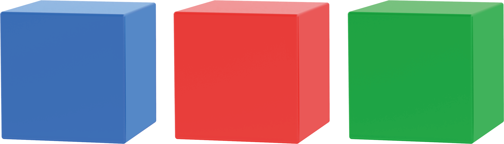

# 1. Getting Ready

## 1.1 TonyPi  Introduction

* **Product Introduction**

TonyPi is an AI-powered humanoid robot developed by Hiwonder, based on the Raspberry Pi 5. It features high-voltage intelligent bus servos, a high-definition camera with two degrees of freedom, and a dual-core control system. Utilizing OpenCV for image processing and programmed in Python, TonyPi is capable of performing a variety of AI-driven tasks such as color recognition, object tracking, line-following while playing soccer, and motion control through MediaPipe.

With the support of a dedicated mobile app, even users with no prior experience can get started quickly and easily.

TonyPi also integrates a multimodal model. When used with the AI voice interaction module, it can understand its environment, plan actions, and execute tasks with flexibility—enabling more advanced applications in embodied AI. Hiwonder provides comprehensive development resources, detailed tutorials, and open-source Python code to help users fully explore and master this intelligent humanoid robot.

* **TonyPi Standard Packing List**

<table class="docutils-nobg" border="1" style="text-align:center;">
  <thead>
    <tr>
      <th style="text-align: center;">No.</th>
      <th style="text-align: center;">Product Name</th>
      <th style="text-align: center;">Quantity</th>
      <th style="text-align: center;">Picture</th>
    </tr>
  </thead>
  <tbody>
    <tr>
      <td>1</td>
      <td>TonyPi(Ready to use)</td>
      <td>1</td>
      <td></td>
    </tr>
    <tr>
      <td>2</td>
      <td>12.6V Lipo battery charger</td>
      <td>1</td>
      <td></td>
    </tr>
    <tr>
      <td>3</td>
      <td>Balls</td>
      <td>3</td>
      <td></td>
    </tr>
    <tr>
      <td>4</td>
      <td>Tags</td>
      <td>3</td>
      <td></td>
    </tr>
    <tr>
      <td>5</td>
      <td>Card Reader</td>
      <td>1</td>
      <td></td>
    </tr>
    <tr>
      <td>6</td>
      <td>Screwdriver</td>
      <td>1</td>
      <td></td>
    </tr>
    <tr>
      <td>7</td>
      <td>Accessory Bag   (M2*4 Round head screw * 5 M2*6 round head screw * 5 M3*6 Black round head screw * 2 M2*5 Round head self-tapping screw * 5 M2*6 Round head self-tapping screw * 5 A3*5*7 Round head cross-recessed washer-equipped self-tapping screw * 2 M2 nut * 5 10cm 3pin wire * 1 20cm 3pin wire * 1 Main plastic steering wheel * 2 Auxiliary plastic steering wheel * 2)</td>
      <td>1</td>
      <td></td>
    </tr>
    <tr>
      <td>8</td>
      <td>User Manual</td>
      <td>1</td>
      <td></td>
    </tr>
  </tbody>
</table>

* **TonyPi Advanced Packing List**

<table class="docutils-nobg" border="1" style="text-align:center;">
  <thead>
    <tr>
      <th style="text-align: center;">No.</th>
      <th style="text-align: center;">Product Name</th>
      <th style="text-align: center;">Quantity</th>
      <th style="text-align: center;">Picture</th>
    </tr>
  </thead>
  <tbody>
    <tr>
      <td>1</td>
      <td>TonyPi(Ready to use)</td>
      <td>1</td>
      <td></td>
    </tr>
    <tr>
      <td>2</td>
      <td>12.6V Lipo battery charger</td>
      <td>1</td>
      <td></td>
    </tr>
    <tr>
      <td>3</td>
      <td>Balls</td>
      <td>3</td>
      <td></td>
    </tr>
    <tr>
      <td>4</td>
      <td>Tags</td>
      <td>3</td>
      <td></td>
    </tr>
    <tr>
      <td>5</td>
      <td>Card Reader</td>
      <td>1</td>
      <td></td>
    </tr>
    <tr>
      <td>6</td>
      <td>Screwdriver</td>
      <td>1</td>
      <td></td>
    </tr>
    <tr>
      <td>7</td>
      <td>Accessory Bag   (M2*4 Round head screw * 5 M2*6 round head screw * 5 M3*6 Black round head screw * 2 M2*5 Round head self-tapping screw * 5 M2*6 Round head self-tapping screw * 5 A3*5*7 Round head cross-recessed washer-equipped self-tapping screw * 2 M2 nut * 5 10cm 3pin wire * 1 20cm 3pin wire * 1 Main plastic steering wheel * 2 Auxiliary plastic steering wheel * 2)</td>
      <td>1</td>
      <td></td>
    </tr>
    <tr>
      <td>8</td>
      <td>User Manual</td>
      <td>1</td>
      <td></td>
    </tr>
     <tr>
      <td>9</td>
      <td>Type C cable</td>
      <td>1</td>
      <td></td>
    </tr>
    <tr>
      <td>10</td>
      <td>WonderEcho Pro AI voice interaction box</td>
      <td>1</td>
      <td></td>
    </tr>
  </tbody>
</table>

* **TonyPi Pro Packing List**

<table class="docutils-nobg" border="1" style="text-align:center;">
  <thead>
    <tr>
      <th style="text-align: center;">No.</th>
      <th style="text-align: center;">Product Name</th>
      <th style="text-align: center;">Quantity</th>
      <th style="text-align: center;">Picture</th>
    </tr>
  </thead>
  <tbody>
    <tr>
      <td>1</td>
      <td>TonyPi(Ready to use)</td>
      <td>1</td>
      <td></td>
    </tr>
    <tr>
      <td>2</td>
      <td>12.6V Lipo battery charger</td>
      <td>1</td>
      <td></td>
    </tr>
    <tr>
      <td>3</td>
      <td>Balls</td>
      <td>3</td>
      <td></td>
    </tr>
    <tr>
      <td>4</td>
      <td>Tags</td>
      <td>3</td>
      <td></td>
    </tr>
    <tr>
      <td>5</td>
      <td>Card Reader</td>
      <td>1</td>
      <td></td>
    </tr>
    <tr>
      <td>6</td>
      <td>Screwdriver</td>
      <td>1</td>
      <td></td>
    </tr>
    <tr>
      <td>7</td>
      <td>Accessory Bag   (M2*4 Round head screw * 5 M2*6 round head screw * 5 M3*6 Black round head screw * 2 M2*5 Round head self-tapping screw * 5 M2*6 Round head self-tapping screw * 5 A3*5*7 Round head cross-recessed washer-equipped self-tapping screw * 2 M2 nut * 5 10cm 3pin wire * 1 20cm 3pin wire * 1 Main plastic steering wheel * 2 Auxiliary plastic steering wheel * 2)</td>
      <td>1</td>
      <td></td>
    </tr>
    <tr>
      <td>8</td>
      <td>User Manual</td>
      <td>1</td>
      <td></td>
    </tr>
     <tr>
      <td>9</td>
      <td>Type C cable</td>
      <td>1</td>
      <td></td>
    </tr>
    <tr>
      <td>10</td>
      <td>WonderEcho Pro AI voice interaction box</td>
      <td>1</td>
      <td></td>
    </tr>
    <tr>
      <td>11</td>
      <td>TonyPi Hands</td>
      <td>1</td>
      <td></td>
    </tr>
    <tr>
      <td>12</td>
      <td>Wireless handle + Handle receiver</td>
      <td>1</td>
      <td></td>
    </tr>
    <tr>
      <td>13</td>
      <td>Glowy ultrosoric sensor</td>
      <td>1</td>
      <td></td>
    </tr>
    <tr>
      <td>14</td>
      <td>Light sensor</td>
      <td>1</td>
      <td></td>
    </tr>
    <tr>
      <td>15</td>
      <td>Dot matrix display</td>
      <td>1</td>
      <td></td>
    </tr>
    <tr>
      <td>16</td>
      <td>Temperature and humidity sensor</td>
      <td>1</td>
      <td></td>
    </tr>
    <tr>
      <td>17</td>
      <td>Fan module</td>
      <td>1</td>
      <td></td>
    </tr>
    <tr>
      <td>18</td>
      <td>Brockets</td>
      <td>1</td>
      <td></td>
    </tr>
    <tr>
      <td>19</td>
      <td>Map</td>
      <td>1</td>
      <td></td>
    </tr>   
    <tr>
      <td>20</td>
      <td>Sponge cubes(10*10cm)</td>
      <td>1</td>
      <td></td>
    </tr> 
    <tr>
      <td>21</td>
      <td>Line Map</td>
      <td>1</td>
      <td></td>
    </tr> 
    <tr>
      <td>22</td>
      <td>Stair</td>
      <td>1</td>
      <td></td>
    </tr> 
    <tr>
      <td>23</td>
      <td>Hurde</td>
      <td>1</td>
      <td></td>
    </tr> 
    <tr>
      <td>24</td>
      <td>EVA blocks(3.5*3.5cm)</td>
      <td>1</td>
      <td></td>
    </tr> 
    <tr>
      <td>25</td>
      <td>Accessories</td>
      <td>1</td>
      <td></td>
    </tr> 
  </tbody>
</table>

* **Safety and Usage Guidelines**

Please observe the following precautions when using and storing this product:

1. This product contains small components and sharp pins and is not suitable for children under 12 years of age.

2. Minors should use this product only under adult supervision and guidance.

3. The product includes small and sharp parts. Do not swallow or apply pressure to avoid injury.

4. The product contains electrically conductive components. Do not touch it with metal objects while powered on.

5. Do not forcibly move any part of the robot while it is powered on, as this may cause damage.

6. If the product will not be used for an extended period, fully charge the battery, remove it, and store it in a cool, dry place.

* **Copyright Statement**

This manual is the intellectual property of Shenzhen Hiwonder Technology Co., Ltd..

No organization or individual is permitted to reproduce, copy, translate, or distribute any part of this manual without prior written authorization.

Any unauthorized use or infringement of the content will result in legal action.

* **Disclaimer**

The product described in this manual (including hardware and software) is provided **"as is"**. While every effort has been made to ensure the accuracy of the information at the time of publication, we do not guarantee the manual is free of errors or omissions. The content is subject to periodic review and updates. We welcome feedback and suggestions for improvement.

As the product may undergo updates and version upgrades, its features and corresponding documentation may change. Please contact customer service before placing an order to obtain the most up-to-date product information.

Furthermore, Hiwonder shall not be held responsible for any malfunction, damage, or loss resulting from the use of this product under extreme conditions or in applications not expressly approved by the company.

## 1.2 Charging and Power-On Status Guide

Due to transportation regulations, lithium batteries must be disconnected during transit. Therefore, you need to connect the battery connector upon receiving the robot. Then, charge it before powering it on for the first time after charging is complete.

* **Charging Method**

:::{Note}
Please ensure that the battery pairing wires are properly connected. The red wire should be connected to red, and the black wire to black.
:::

(1) Connect the charger to the charging port located on the Raspberry Pi expansion board at the back of the robot.

(2) When the charger is connected to the robot's battery **but not yet plugged into an AC power outlet**, the charger's LED indicator will light up **green**.

Once plugged into an AC power source, the robot will begin charging. During charging, the LED indicator will turn **red**. The charging process takes approximately **3 hours**.

When charging is complete, the LED indicator will change from **red to green**.

:::{Note}
Please disconnect the charger **promptly** after charging is complete to avoid overcharging or damaging the battery.
:::

* **Start TonyPi Pro**

(1) After the device powers on successfully, the buzzer will emit a short **"beep"**, and the robot will return to its default starting position.

:::{Note}
The Raspberry Pi is a small minicomputer itself. It usually takes a period time to boot up. Please wait for it patiently.
:::

(2) By default, the device is set to AP (Access Point) direct connection mode, and it will broadcast a Wi-Fi hotspot with a name starting with **"HW"**.

* **Battery Level Check**

TonyPi is equipped with a voltage display module on its back, allowing users to monitor the robot's current battery level in real time, as illustrated in the diagram below:

The operating voltage range of TonyPi is 9V-12.6V. When the battery is fully charged, the voltage display module will show **"12.6"**. Please recharge the robot promptly when the current voltage is below 10V.