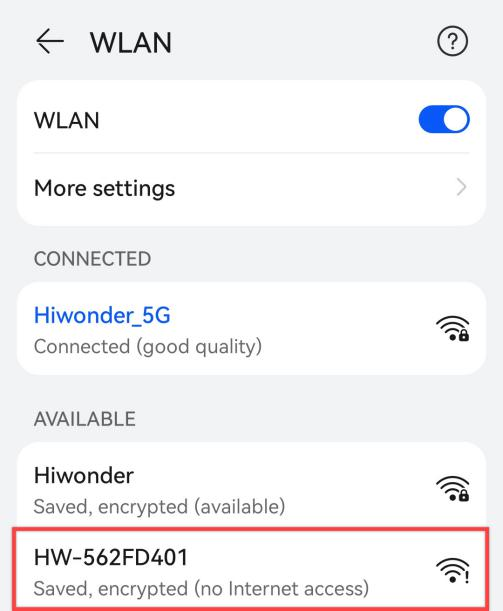
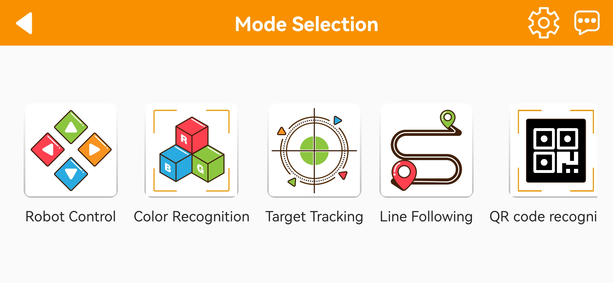
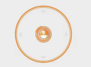
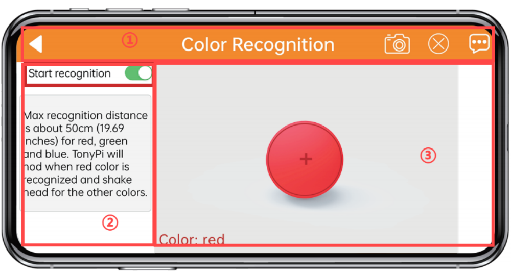
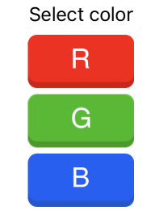
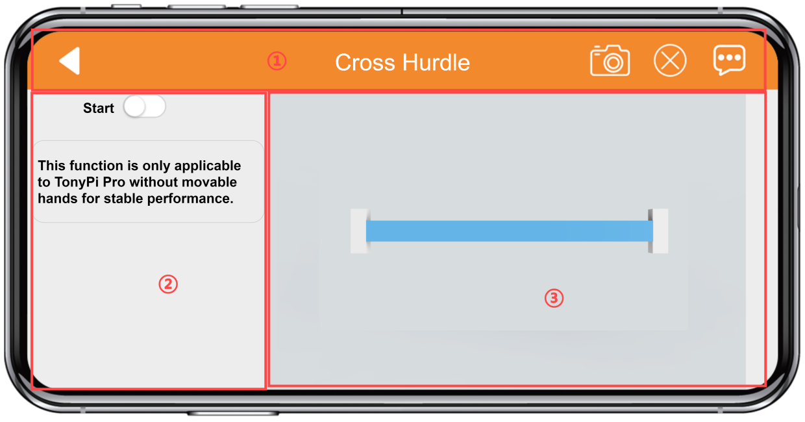
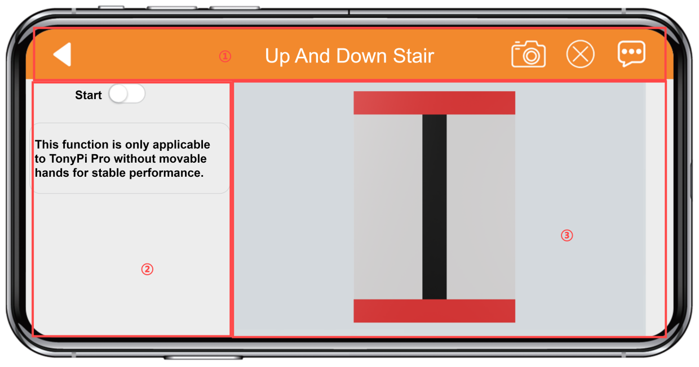

# 2.Quick User Experience

## 2.1 APP Installation and Connection

The following instructions use TurboPi as an example and apply to other Hiwonder Raspberry Pi series products as well.
In this section, you will learn how to use APP "WonderPi" to control TurboPi. The installation method is as follows.

:::{Note}

① Make sure all APP permissions are turned on in settings, otherwise APP functions will be limited!

② Turn on Location and WiFi before operation.

:::

### 2.1.1 Installation

**[APP Installation Pack (Android)](https://play.google.com/store/apps/details?id=com.Wonder.Pi)**

**[APP Installation Pack (iOS)](https://apps.apple.com/cn/app/wonderpi/id1477946178)**

:::{Note}
- Please turn TurboPi on before connecting. 

- Make sure all APP permissions are turned on in settings, otherwise APP functions will be limited!

- Turn on Location and WiFi before operation.

:::

### 2.1.2 APP Connection

(1) Start robot. (The switch is on Raspberry Pi expansion board). For detailed instruction, please refer to the file in "**[Getting Ready\1.6 Charging and Power-On Status Explanation](https://docs.hiwonder.com/projects/TurboPi/en/latest/docs/1.getting_ready.html#charging-and-power-on-status-description)**".

(2) After TurboPi boots up successfully, it enters AP direct connection mode, and generates a WiFi starting with **"HW"**. Join this WiFi, and then you can experience robot games

* **Introduction to Connection Mode**

There are two connection modes, namely direct connection mode and LAN mode. APP functions are the same under these two modes.

(1) **AP direct connection mode**: RaspberryPi generates a WiFi which can be connected by phones. But this WiFi has no internet access. 

(2) **STA LAN mode**: Raspberry Pi actively connects to specific WiFi. In this mode, you can access internet.

* **Direct Connection Mode (MUST-READ)** 

:::{Note}
After TurboPi boots up successfully, it enters AP direct connection mode, and generates a WiFi starting with **"HW"**.
:::

(1) Open"**WonderPi**". Select **"Standard ->TurboPi"** in sequence.

(2) Tap **"+"** in bottom right corner, and then select **Direct Connection Mode**.

(3) Tap **"Go to connect device hotspot"**. Join WiFi starting with "HW". The password is **"hiwonder"**.

(4) Return back to APP after connection.

:::{Note}
 for iOS user, please don't return to APP until WiFi icon appears on status bar, otherwise robot cannot be searched. If robot cannot be searched by APP, tap  to refresh.
:::

(5) APP automatically connects to robot. When robot icon below occurs, connection completes. 

:::{Note}
if you are informed of "No Internet. Whether to keep connection", just select "keep connected".
:::

(6) Tap robot icon to enter mode selection interface.

For detailed introduction to robot games, please refer to the file in "**[2.2 APP Control](#anchor_2)**".

**1.2.3  LAN Connection Mode**

(1) Disconnect the WiFi generated by TurboPi. Connect your phone to a WiFi. Take **"Hiwonder"** as example.

(2) After connection, open **"WonderPi"**. Select **"Standard ->TurboPi"** in sequence.

(3) Tap "+" in bottom right corner, and then select LAN Mode.

(4) Input the password of the WiFi your phone joins. Ensure the password you input is correct, otherwise APP fails to connect to robot. Tap **"OK"**.

(5) Tap **"Go to connect device hotspot"**.

(6) Join the WiFi starting with **"HW".** The password is **"hiwonder"**. After connection, return back to APP.

(7) APP automatically configures network.

(8) After a while, robot icon below occurs, and LED on expansion board keeps on.

(9) Long press robot icon to check TurboPi's IP and ID.

(10) Tap robot icon to enter mode selection interface.

For detailed introduction to robot games, please refer to the file in"**[2.2 APP Control](#anchor_2)**".

## 2.2 APP Control

:::{Note}

This section takes TonyPi Pro as example. The content is also suitable for TonyPi.

:::

### 2.2.1 Preparation

Install APP and connect TonyPi to APP according to the instruction in [2.1 APP Installation and Connection]().

### 2.2.2 Experience Robot Games

:::{Note}

**Hurdle Obstacle Avoidance** and **Go up and down stair** only suitable for TonyPi Pro.

:::

Click the robot icon to enter to the game selection interface.

* **Model Control** 

(1) Click on the icon "Model Control" and you will enter the corresponding interface. At the same time, the robot will immediately return to its initial position.

(2) The interface of “Model Control” is divided into two parts. The left side of the interface allows you to control the robot's movement by sliding the joystick. Other function icons can be referred to in the table below:

| Icon                                                         | Function                                                     |
| ------------------------------------------------------------ | ------------------------------------------------------------ |
|  | Drag central button to control TonyPi to move.               |
|  | You can control the robot to move left, move right, or stand straight. |
|  | You can execute built-in actions and the function to stand up from a fall. |

The right side of the interface displays the real-time video feed from the camera. You can drag the interface to rotate the camera.

:::{Note}

The camera's head servo is equipped with limit protection. When it reaches the extreme position and you try to slide the screen again, there will be vibration feedback. At this point, please do not continue to rotate it.

:::

(3) To return to the game selection interface, click on a blank area to bring up the title bar, then click on the left triangle on the left side.

* **Auto Shooting** 

TonyPi can recognize red, green and blue. TonyPi will adjust its position close to the ball and then kick it forward.

:::{Note}

* Please operate in well-lwit indoor, and avoid direct lighting.
* Remove objects in same or similar color to the target, otherwise recognition will be interfered.
* If the recognition effect is not well, you can adjust color threshold according to [2.3 Adjust Color Threshold]().

:::

(1) Tap “Auto Shooting” icon to enter game interface. The interface is divided into three parts.

① Status bar.

② The left side of the interface are the options to activate the game functionalities.

③ The right side of the interface is the area displaying the camera feed.

(2) Click “Start Recognition” button, you can sequentially place red, blue, and green objects individually in front of the camera. Taking green as an example, when TonyPi recognizes the green object, it will outline the recognized green object in the feedback screen and then approach the ball to kick it away.

(3) To return to the game selection interface, click on the blank area of the current interface to bring up the title bar, then click  button.

* **Color Recognition** 

TonyPi can recognize red, green and blue. When recognizing red, it nods. When recognizing blue or green, it shakes head.

:::{Note}

* Please operate in well-lit indoor, and avoid direct lighting.
* Remove objects in same or similar color to the target, otherwise recognition will be interfered.
* If the recognition effect is not well, you can adjust color threshold according to [2.3 Adjust Color Threshold]().

:::

(1) Tap “Color Recognition” icon to enter game interface. The interface is divided into three parts.

① Status bar.

② The left side of the interface are the options to activate or deactiave the game functionalities.

③ Camera returned image.

(2) Start the game. Then you can put red, green and blue objects in sequence in front of camera. Take green as example. When TonyPi recognizes green, this item will be framed on the camera returned image. At the same time, TonyPi emits a beep, and then “**shakes head**”.

| Color | Recognition result                        |
| ----- | ----------------------------------------- |
| Red   | Buzzer emits one beep, and camera nods.   |
| Green | Buzzer emits one beep, and camera shakes. |
| Blue  | Buzzer emits one beep, and camera shakes. |

 (3) To return to the game selection interface, click on the blank area of the current interface to bring up the title bar, then click  button.

 * **Line Following**

Tap icon to enter game interface. After game starts, TonyPi go forward along black line or red line.

:::{Note}

* Please operate in well-lit indoor, and avoid direct lighting.

* Remove objects in same or similar color to the target, otherwise recognition will be interfered.

* If the recognition effect is not well, you can adjust color threshold according to [2.3 Adjust Color Threshold]().

:::

① Status bar.

② Game control area.

③ Camera returned image.

(1) Turn on “Start following”. Then select color. TonyPi Pro will go forward along line of specific color.

| Icon                                                         | Function                     |
| ------------------------------------------------------------ | ---------------------------- |
|  | Start/ stop the game         |
|  | Select line color            |
|  | Display the color to tracked |

(2) If you want to return back mode selection interface, tap blank area to make status bar pop up,  then click on the button.

* **Color Tracking** 

Tap icon to enter game interface. Once the game is activated, it enables the functionalities for the head servo to move along with the movement of the target.

:::{Note}

* Please operate in well-lit indoor, and avoid direct lighting.

* Remove objects in same or similar color to the target, otherwise recognition will be interfered.

* If TonyPi cannot recognize color well, you can adjust color threshold according to “[2.Quick User Experience\2.3 Adjust Color Threshold]()”.

:::

① Status bar.

② Game control area.

③ Camera returned image.

(1) Click the "**Start Tracking**" button, then select the target color to activate the tracking game. At this point, TonyPi Pro's camera will follow the movement of the selected color target.

| Ico                                                          | Function                                |
| ------------------------------------------------------------ | --------------------------------------- |
|  | Activate/deactivate color tracking game |
|  | Select the color to track               |
|  | Display target color information        |

(2) To return to the game selection interface, click on the blank area of the current interface to bring up the title bar, then click on the button.

* **Face Recognition** 

(1) Click the icon to enter the game interface. The camera will move around, and when it detects a face within 1 meter, the robot will wave towards it.

① Status bar.

② Face detection control area.

③ Camera returned image.

(2) Click the “Start Recognition” button, the head servo will move back and forth from left to right.

| Icon                                                         | Function                      |
| ------------------------------------------------------------ | ----------------------------- |
|  | Activate/deactivate the game. |

(3) To return to the game selection interface, click on the blank area of the current interface to bring up the title bar, then click on the button .

* **Tag Recognition** 

Click the icon to enter the game interface. Once activated, this game allows TonyPi to recognize different QR codes and perform corresponding actions.

:::{Note}

* When recognizing a QR code, the distance should not be too close or too far. Typically, a distance of 35cm between the QR code and the camera is optimal.

* Please perform this in a well-lit indoor environment, but try to avoid direct strong light.

:::

① Status bar.

② QR code control area.

③ QR code image.

(1) Click “**Start Recognition**” button and select different QR code. TonyPi will perform different actions when recognized different QR code.

| **Icon**                                                     | Function                 |
| ------------------------------------------------------------ | ------------------------ |
|  | Activate/Deactivate game |

(2) To return to the game selection interface, click on the blank area of the current interface to bring up the title bar, then click on the button.

* **Hurdle Obstacle Avoidance**  

Click the button to enter the game interface. The camera will recognize the blue part of the stair and complete the action of crossing over it.

① Status bar.

② Game control area.

③ Camera feed image.

(1) Click the **“Start Hurdle”** button. TonyPi will step over it and continue moving forward when the hurdle prop is detected.

| **Icon**                                                     | **Function**                  |
| ------------------------------------------------------------ | ----------------------------- |
|  | Activate/deactivate the game. |

(2) To return to the game selection interface, click on the blank area of the current interface to bring up the title bar, then click on the button.

* **Go up and down stair** 

(1) Click the button to enter the game interface. The camera will recognize the red part of the step prop and complete the action of going up and down the steps.

① Status bar.

② Game control area.

③ Camera feed image.

(2) Click **“Start Hurdling”** button. TonyPi will step over it and continue moving forward when the hurdle prop is detected.

| **Icon**                                                     | **Function**                 |
| ------------------------------------------------------------ | ---------------------------- |
|  | Activate/deactivate the game |

(3) To return to the game selection interface, click on the blank area of the current interface to bring up the title bar, then click on the button.

## 2.3 Adjust Color Threshold ##

Different light source will have different influence on the colors, which will result in recognition discrepancy. To tackle this problem, you can adjust color threshold via "WonderPi" APP.

### 2.3.1 Preparation

Start TurboPi. Open "WonderPi" APP, and connect it to TurboPi. For how to connect robot to APP, operate referring to "**[2.1 APP Installation and Connection ](#anchor_1)**".

### 2.3.2 Interface Layout

Tap  in upper right corner to enter color threshold adjustment interface.

The table below list function of specific icon.

<table class="docutils-nobg" border="1">
<colgroup>
<col  />
<col  />
</colgroup>
<tbody>
<tr>
<td ><strong>Icon</strong></td>
<td ><strong>Function</strong></td>
</tr>
<tr>
<td ></td>
<td >
Processed camera returned image.

Target object is white, and other area is black.
</td>
</tr>
<tr>
<td ></td>
<td >Raw camera returned image.</td>
</tr>
<tr>
<td ></td>
<td >Select the color to be adjusted.</td>
</tr>
<tr>
<td ></td>
<td >
Adjust L component of camera returned image. "L_min" is lower limit and "L_max" is upper limit.

</tr>
<tr>
<td ></td>
<td >
Adjust A component of camera returned image. "a_min" is lower limit and "a_max" is upper limit.

</tr>
<tr>
<td ></td>
<td >
Adjust B component of camera returned image. "b_min" is lower limit and "b_max" is upper limit.

</tr>
<tr>
<td ></td>
<td >Get instruction to check how to adjust color threshold.</td>
</tr>
<tr>
<td ></td>
<td >Save the adjusted color threshold.</td>
</tr>
<tr>
<td ></td>
<td >Return back to mode selection interface.</td>
</tr>
<tr>
<td ></td>
<td >Hide navigation bar.</td>
</tr>
<tr>
<td ></td>
<td >Display Hiwonder info.</td>
</tr>
</tbody>
</table>

### 2.3.3 Adjust Color Threshold

(1) Select color to be adjusted. Take red as example.

(2) Put red object within camera recognition zone. Set L_min, a_min and b_min to 0, and L_max, a_max and b_max to 255.

(3) Tap "Instruction" icon to check how to adjust color threshold.

:::{Note}
if you need to close Instruction window, select "OK".
:::

(4) Red approaches "+a" zone, so you need to adjust A component.

(5) Keep "a_max" value the same, and then increase "a_min" value till red object turns white and other area is black.

(6) Adjust "L" and "B" values. If it belongs to light red, increase L_min. Otherwise, decrease L_max. If it belongs to warm tone, increase B_min. Otherwise, decrease B_max.

(7) Remember to save the value after adjustment.

