# 2. Quick User Experience

<p id="anchor_2_1"></p>

## 2.1 App Installation and Connection

> [!NOTE]
>
> **This section takes the TonyPi version as an example, but the instructions equally apply to TonyPi Pro.**

(1) When installing the app, please allow all necessary permissions to ensure it works smoothly.

(2) Before opening the app, make sure the phone's **GPS** and **Wi-Fi** service are enabled.

### 2.1.1 App Installation

The app installation package is located in the folder **2.1.2 App Installation Pack**. Please transfer this package to a phone to install the app.

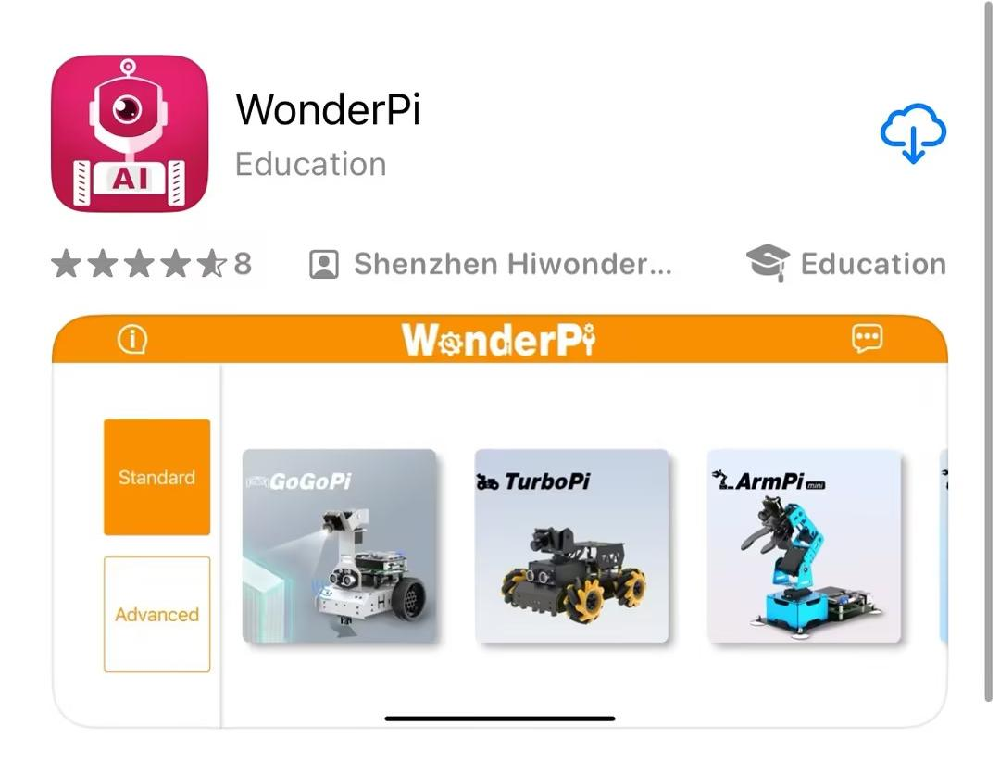

**[APP Installation Pack (Android)](https://play.google.com/store/apps/details?id=com.Wonder.Pi)**

**[APP Installation Pack (iOS)](https://apps.apple.com/cn/app/wonderpi/id1477946178)**

This section explains how to connect TonyPi to the app.

### 2.1.2 Device Connection

Upon successful startup, the robot will automatically generate a hotspot with a name beginning with **HW**. Connect the phone's app to this hotspot to access and activate additional features.

* **Connection Mode Overview**

The robot supports two network modes:

(1) **AP Direct Connection Mode:** The development board creates a hotspot that the phone can connect to. 

> [!NOTE]
>
> **This mode does not provide access to external networks.**

(2) **STA Local Area Network (LAN) Mode:** The development board connects to a specified Wi-Fi hotspot, allowing access to external networks.

These two modes cannot be used simultaneously. By default, the robot operates in AP Direct Connection Mode. Regardless of which mode is chosen, the available features and functions remain the same.

It is recommended to start with the AP Direct Connection Mode for initial setup and experience. It can be switched to LAN Mode later if needed.

* **Direct Connection Mode (MUST READ)**

This section uses the Android version as an example, but the steps also apply to iOS.

(1) Open the mobile app and, on the home interface, select **Advanced Platform**, then choose **TonyPi**.

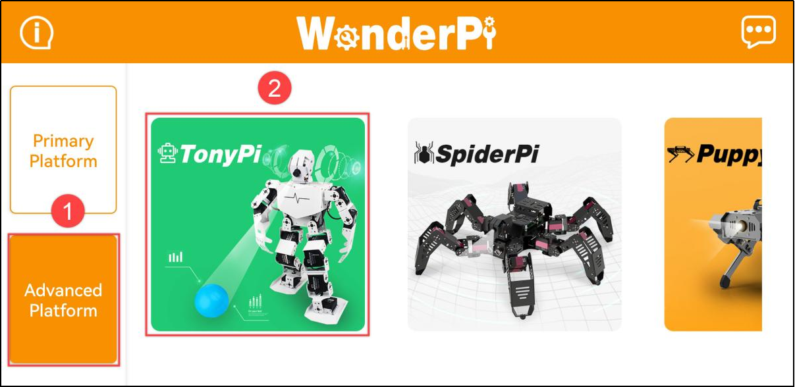

(2) On the product selection screen, tap the **TonyPi** icon.

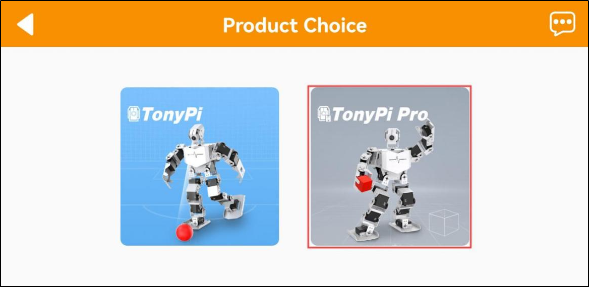

(3) Back on the home interface, select **TonyPi** again, then tap the **+** button at the bottom right and choose **Direct Connection Mode**.

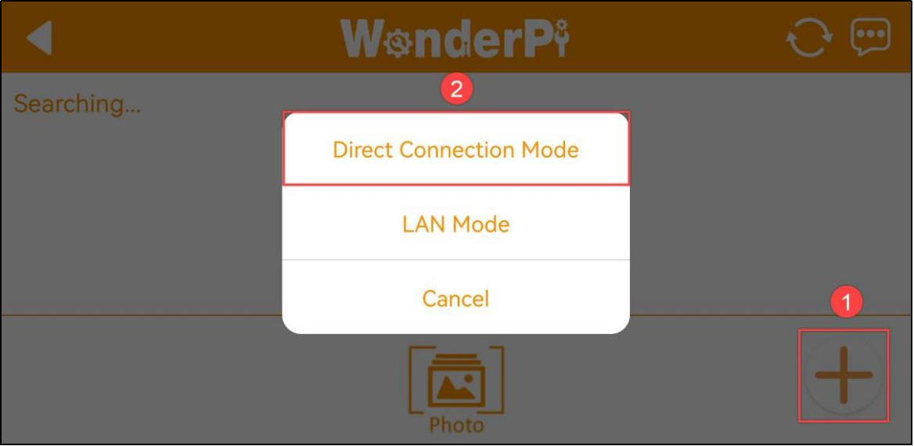

(4) Follow the on-screen instructions to open the phone's settings and connect to the hotspot starting with **"HW"**.Password: **hiwonder**


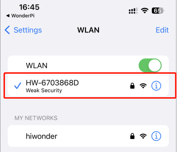

(5) Once connected, return to the app. The app will automatically connect to the device. Wait a moment until the robot icon appears, indicating a successful connection.

> [!NOTE]
>
> **If using an iOS device, please ensure the Wi-Fi connection icon appears at the top of the screen before returning to the app. Otherwise, the device may not be detected. If this occurs, try refreshing the search several times  —it usually resolves the issue.**

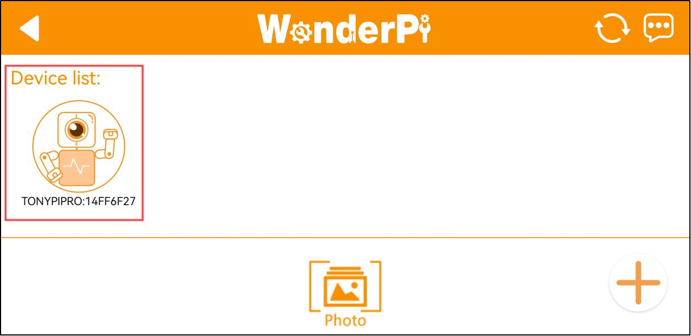

If prompted with a message like **"Network may not be available, do you want to stay connected?"**, please select **Keep Connected**.

* **LAN Mode Connection Method (Optional)**

(1) Starting from having connected via AP Direct Mode, open the WonderPi app. Tap the **+** button at the bottom right and choose **LAN Mode**. Follow the prompts to open the phone's Wi-Fi settings and connect to the desired Wi-Fi network.

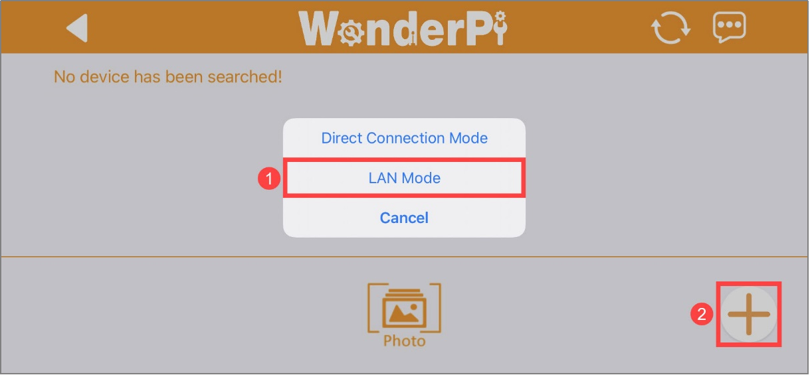

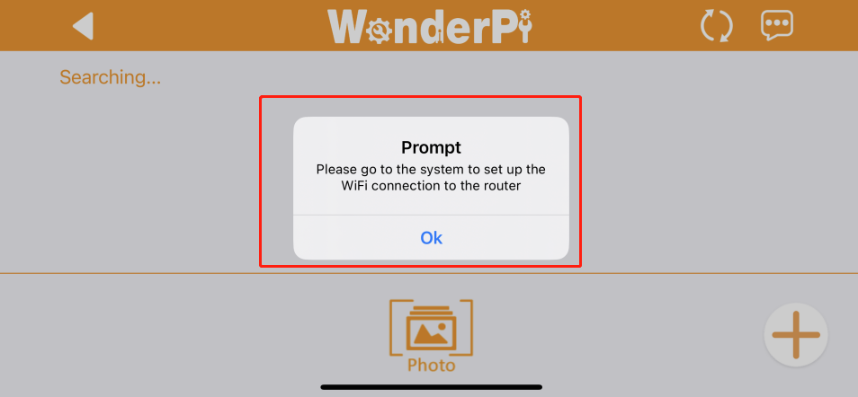

(2) Select the Wi-Fi network to connect to, for example, **Hiwonder**.

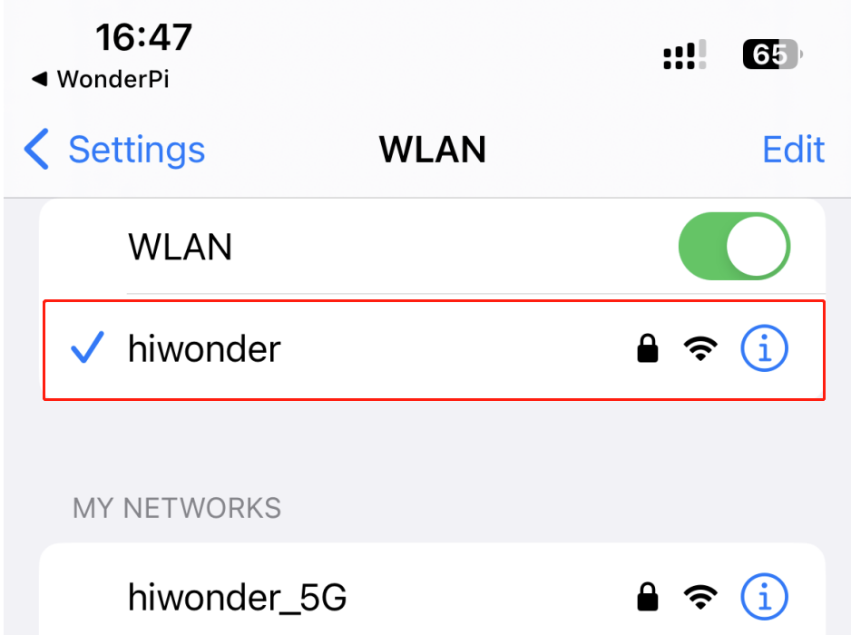

(3) Once connected, return to the app and tap the **+** button again. Select **LAN Mode** once more.

(4) The app will ask for the Wi-Fi password. If the prompt doesn't appear automatically, tap **LAN Mode** again. Enter the correct password and tap **Next**. 

> [!NOTE]
>
> **Make sure the password is accurate to avoid connection issues.**

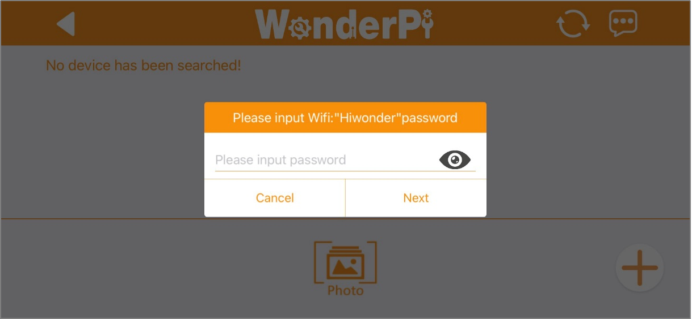

(5) Next, follow the app's instructions to connect to the robot's hotspot, which starts with **"HW"**, in the phone's Wi-Fi settings.

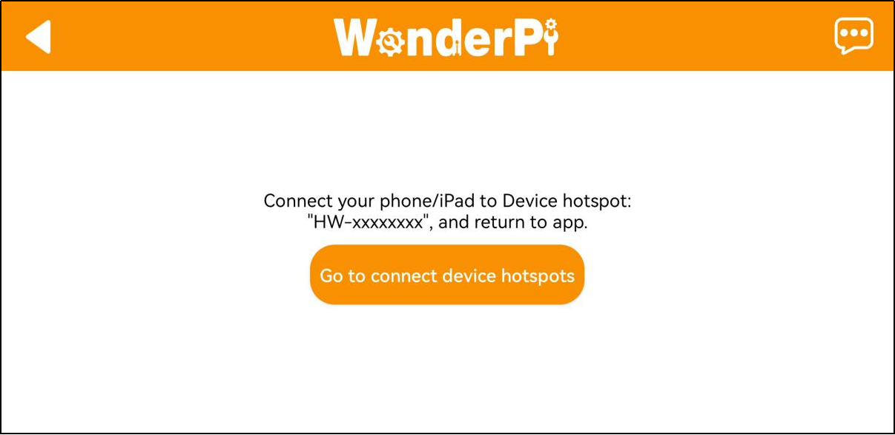

(6) After connecting to the hotspot, return to the app. It will automatically attempt to connect to the robot. If prompted to join the network, tap **Join**.

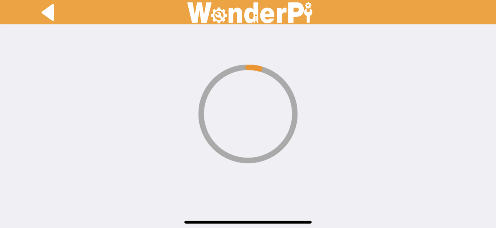

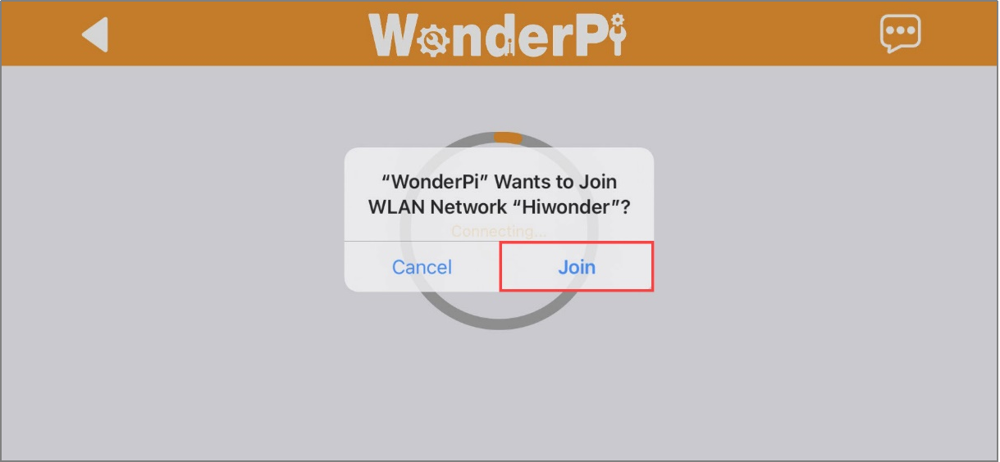

(7) Wait a moment for the connection to complete. The app will switch back to the main screen automatically. The LED2 light on the Raspberry Pi expansion board will stop flashing and remain steadily lit, indicating a successful network connection.


(8) Press and hold the robot icon in the app to view the robot's IP address and ID. Note down the IP address, as it is needed for the next steps.

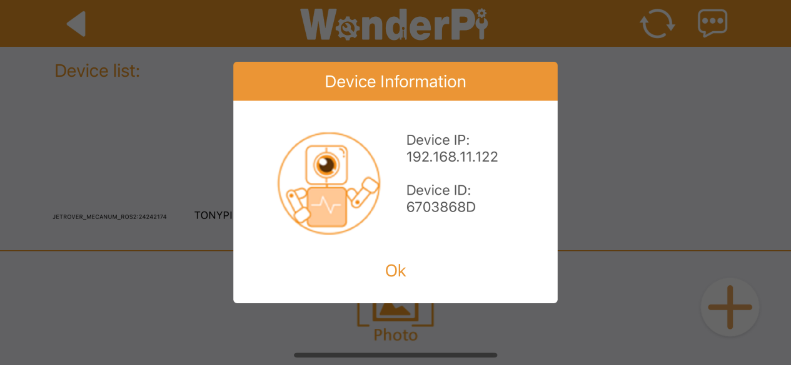

(9) Next, proceed to the [**3. Remote Desktop Tool Installation and Connection**](3_remote_desktop_tool_installation_and_connection.md) section. Follow the instructions to install the VNC remote desktop tool. Open the tool and enter the robot's IP address in the address bar, then press Enter.

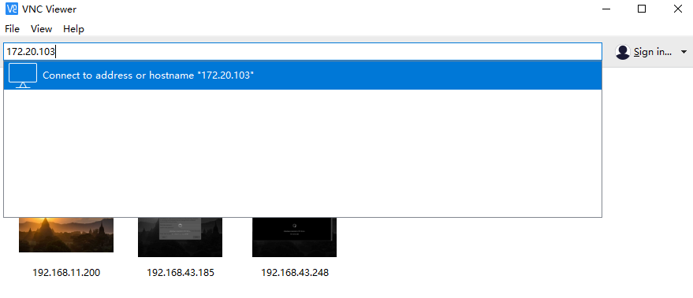

(10) When prompted, enter the login credentials:

- Username: `pi`
- Password: `raspberrypi`

Optionally, check **Remember password**, then click **OK**. The Raspberry Pi desktop can be viewed remotely now.

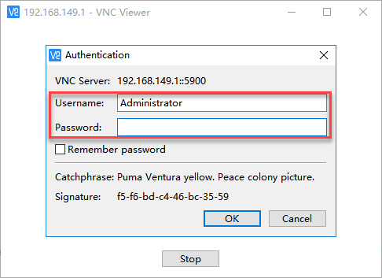

## 2.2 Large Model API Key Setup

> [!NOTE]
>
> **This section requires registering on the official OpenAI website and obtaining an API key for accessing large language models.**

#### 2.2.1 OpenAI Account Registration and Deployment

1) Copy and open the following URL: https://platform.openai.com/docs/overview, then click the **Sign Up** button in the upper-right corner.


2) Register and log in using a Google, Microsoft, or Apple account, as prompted.


3) After logging in, click the Settings button, then go to **Billing**, and click **Payment Methods** to add a payment method. The payment is used to purchase **tokens**.


4) After completing the preparation steps, click **API Keys** and create a new key. Follow the prompts to fill in the required information, then save the key for later use.

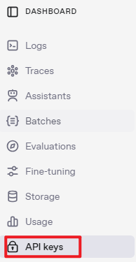


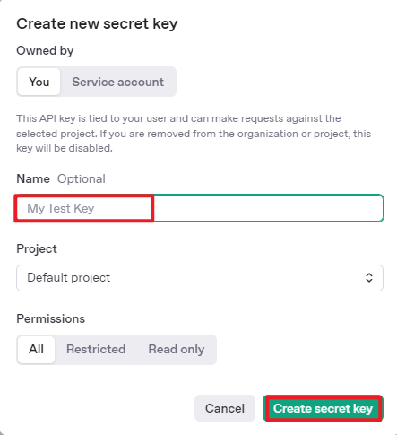

5) The creation and deployment of the large model have been completed, and this API will be used in the following sections.

#### 2.2.2 OpenRouter Account Registration and Deployment

1) Copy the URL https://openrouter.ai/ into a browser and open the webpage. Click **Sign in** and register or sign in using a Google account or another available account.

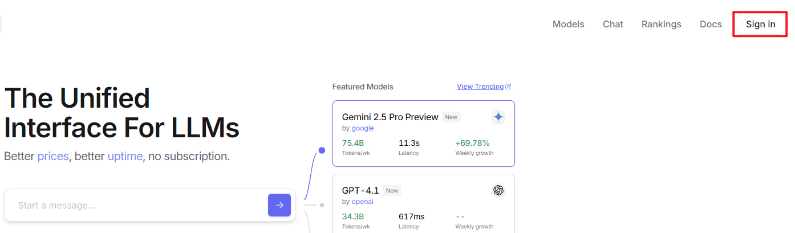


2) After logging in, click the icon in the top-right corner, then select **Credits** to add a payment method.


3) Create an API key. Go to **API Keys**, then click **Create Key**. Follow the prompts to generate a key. Save the API key securely for later use.


The creation and deployment of the large model have been completed, and this API will be used in the following sections.

#### 2.2.3 API Configuration

1. Click  to open a terminal and enter the following command to open the configuration file. Press the i key to enter input mode.

```bash
vim /home/pi/embodied_intelligence/common/config.py
```

2. Fill in the obtained large model API Key in the corresponding parameter, as shown in the red box in the figure below.


3. Press **Esc**, then enter the command and press **Enter** to save and exit the configuration file.

```bash
:wq
```


## 2.3 App Control

> [!NOTE]
>
> **This section uses TonyPi Pro as an example. The information provided also applies to other versions of TonyPi.**

### 2.3.1 Preparation

Refer to the tutorial [2.1 App Installation and Connection](#anchor_2_1) to install the application and establish a connection with the TonyPi Pro.

### 2.3.2 Operation Steps

> [!NOTE]
>
> **The Cross Hurdle and the Up And Down Stair features are exclusive to the TonyPi Pro.**

1. Tap the robot icon to open the main feature selection menu.

   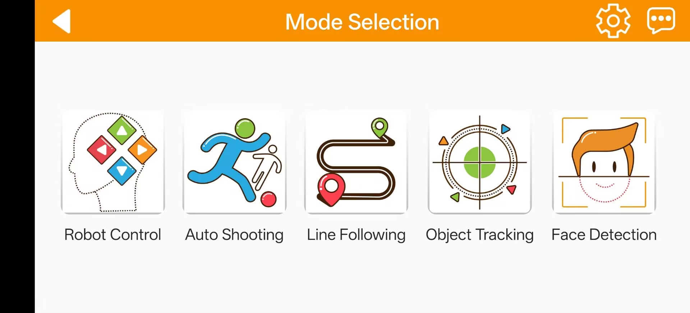

   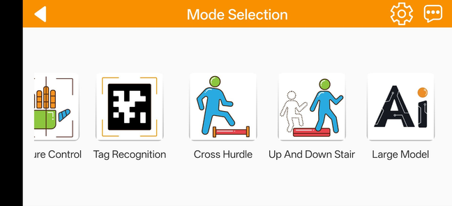

* **Robot Control**

1. Tap the **Robot Control** icon to access the operational interface. The robot will immediately reset to its default standing posture.

   

2. Select the mode options in the upper-right corner to switch the operation to **General Mode**.

   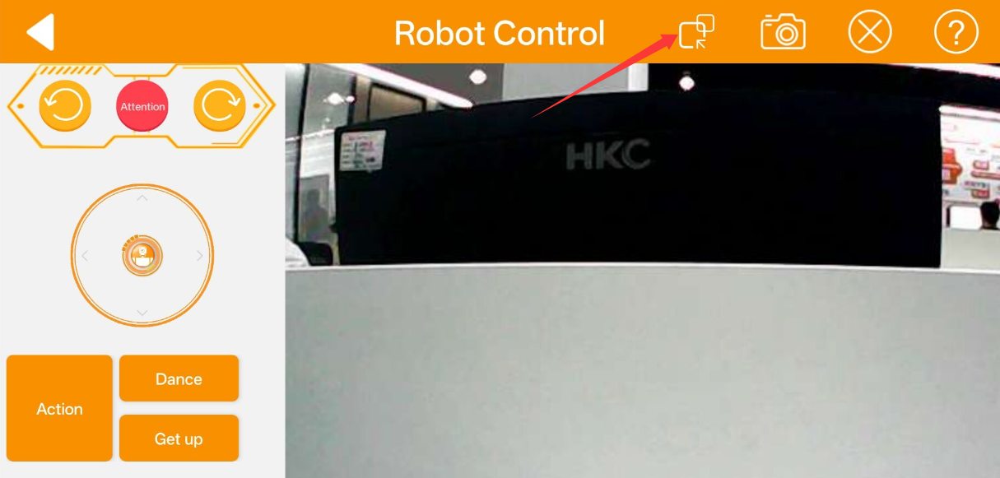

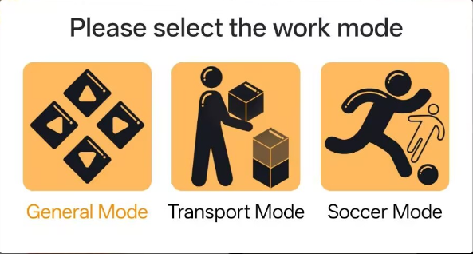

**General Mode**


The **Remote Control - General Mode** interface consists of two primary sections. The joystick handles robot movement controls. The specific assignments for other interface icons are detailed in the table below.

|                           **Icon**                           |                      **Functionality**                       |
| :----------------------------------------------------------: | :----------------------------------------------------------: |
| 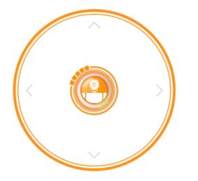 |   Manipulating the joystick controls the robot's movement.   |
|  | Commands the chassis to sidestep left, sidestep right, or reset to a stable standing position. |
| 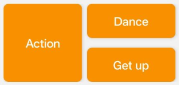 | Triggers pre-programmed actions, dance routines, and autonomous fall-recovery sequences. |

The right section of the interface displays the real-time video stream from the onboard camera. Swiping across this area adjusts the camera tilt and pan rotation.

> [!NOTE]
>
> **The camera pan-tilt servos feature built-in hardware limit protection. The mobile device provides haptic vibration feedback once a rotation boundary is reached. Avoid further panning or tilting inputs past this threshold.**

2. The **Instruction** button in the lower-right corner of the interface provides a helpful reference, and the specific details are illustrated in the figure below.

   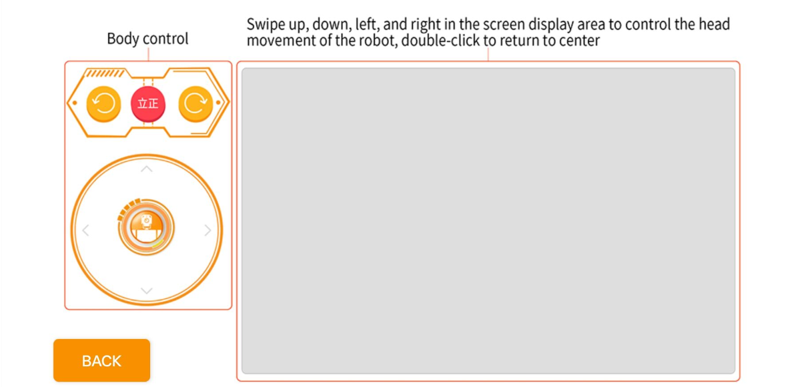

The robot resets to its initial stance whenever a different function is selected.

3. To return to the main feature menu, tap any blank area to call up the header navigation bar, then select the left arrow icon .

**Transport Mode**

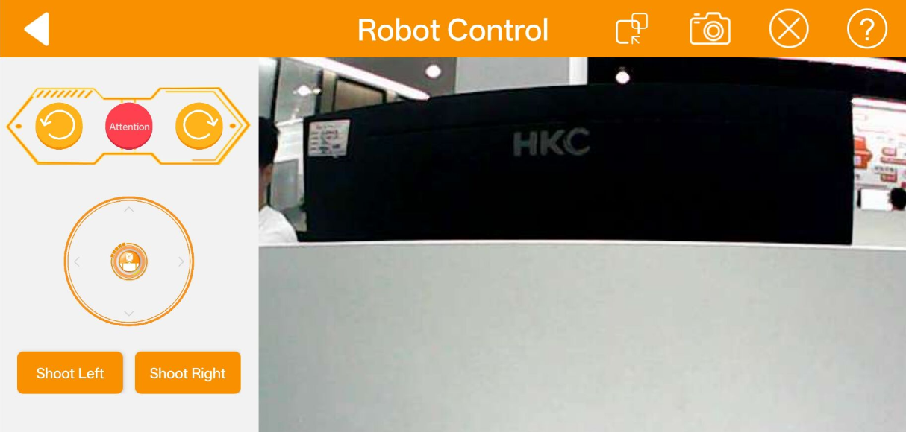

The **Remote Control - Transport Mode** interface is divided into two sections. The left joystick directs robot movement. Additional control icons are described in the table below.

|                           **Icon**                           |                      **Functionality**                       |
| :----------------------------------------------------------: | :----------------------------------------------------------: |
|  |   Manipulating the joystick controls the robot's movement.   |
|  | Commands the chassis to sidestep left, sidestep right, or reset to a stable standing position. |
|  |      Executes object transport and placement routines.       |

**Soccer Mode**


The **Remote Control - Soccer Mode** interface is divided into two sections. The left joystick manages robot movement. Refer to the table below for other integrated control icons.

|                           **Icon**                           |                      **Functionality**                       |
| :----------------------------------------------------------: | :----------------------------------------------------------: |
|  |   Manipulating the joystick controls the robot's movement.   |
|  | Commands the chassis to sidestep left, sidestep right, or reset to a stable standing position. |
|  |   Triggers left-foot or right-foot soccer kick sequences.    |

* **Auto Shooting**

This feature enables target detection for a ball of any specified color. TonyPi Pro autonomously adjusts its alignment, approaches the target, and kicks it forward.

> [!NOTE]
>
> * **Conduct operations in a well-lit indoor environment while avoiding direct exposure to intense glare or sunlight.**
>
> * **Ensure that the camera field of view remains clear of background clutter sharing matching or similar colors to minimize target detection interference.**
>
> * **Tap “Auto Shooting” to open the feature control panel.**

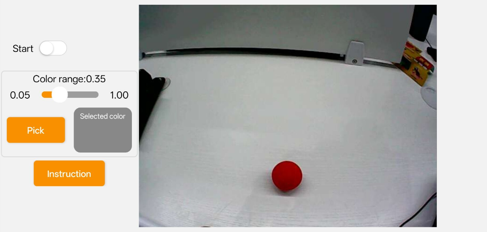

1. Upon entering the interface, select the **Pick** button, using a red ball as a reference scenario. Drag the red calibration ring on the live video stream over the target object to sample the color data, then tap **OK**.

   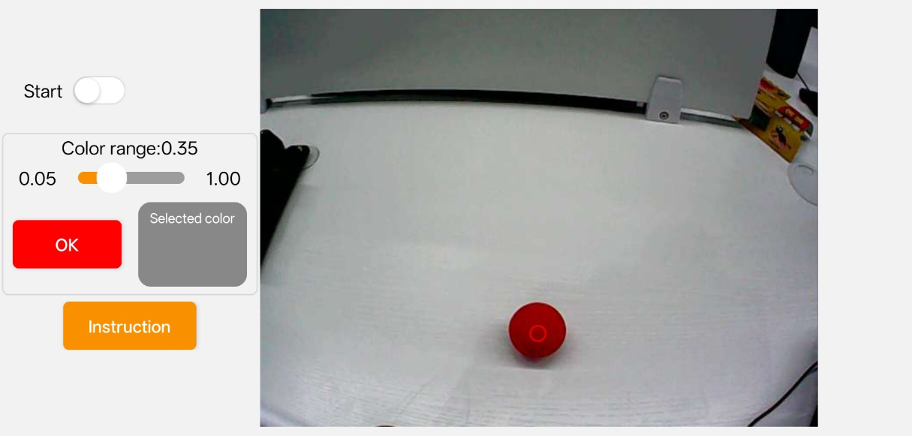

2. The active target color configuration appears within the **Selected color** display box.

   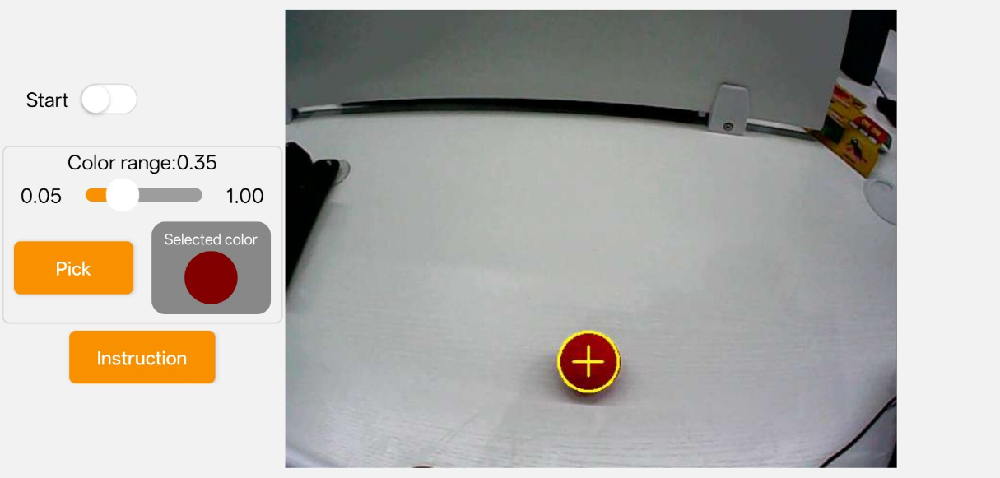

3. Toggle the **Start** button to launch the routine. The robot tracks the target object and automatically executes a kick upon reaching optimal proximity.

   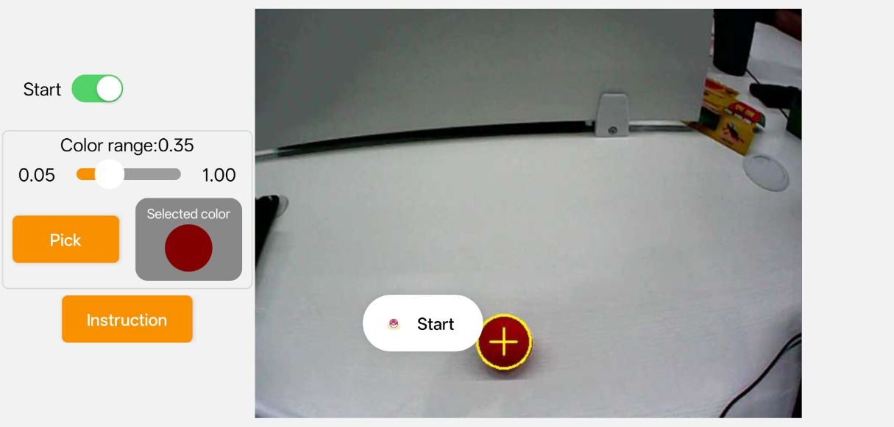

* **Line Following**

This vision routine tracks lines of any selected color, allowing TonyPi to continuously adjust its steering and follow the layout.

> [!NOTE]
>
> * **Conduct operations in a well-lit indoor environment while avoiding direct exposure to intense glare or sunlight.**
>
> * **Ensure that the camera field of view remains clear of background clutter, sharing matching or similar colors to minimize target detection interference.**
>
> * **The tracking circuit can be constructed using colored adhesive tape.**
>
> * **Select "Line Following" from the main menu to open the interface, then tap the “Pick” button using a red tape track as an example.**

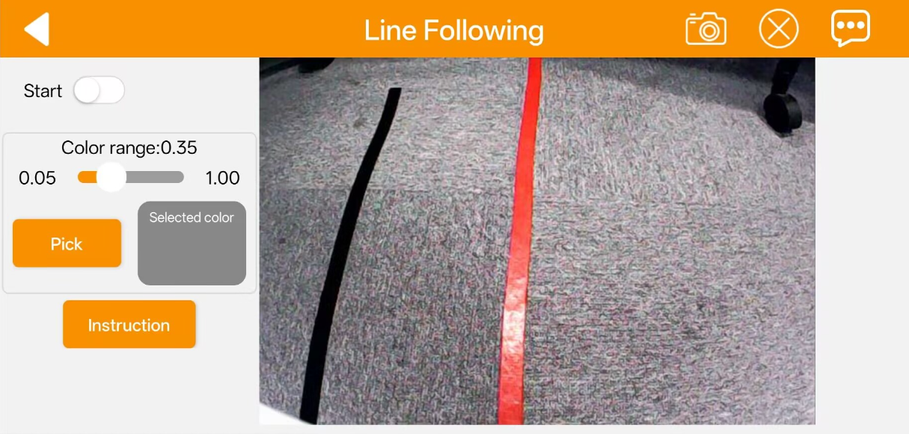

1. Drag the red calibration ring on the live video stream over the tape track to sample the color data, then tap **OK**.

   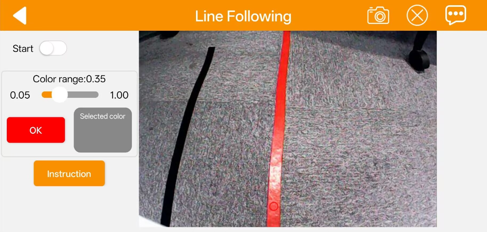

2. The active target color configuration appears within the **Selected color** display box.

   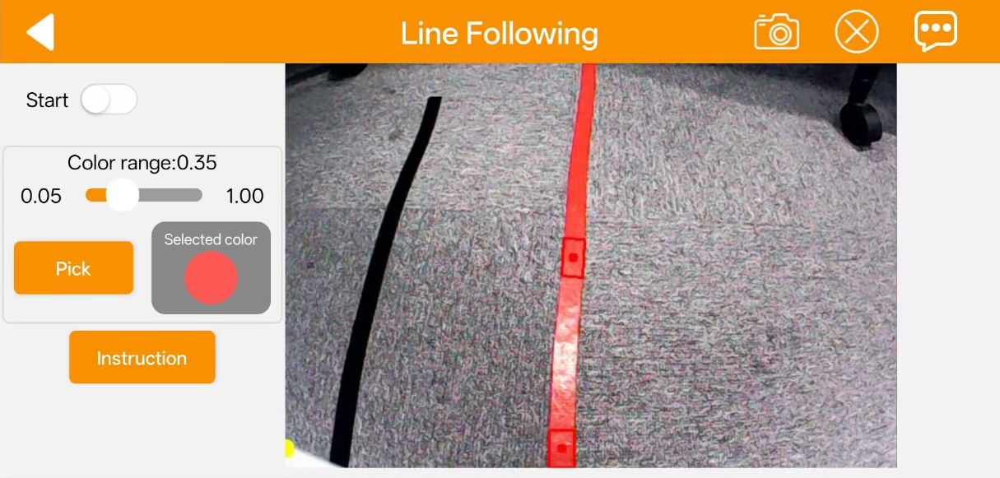

3. Toggle the **Start** button to initialize the operation. The robot will autonomously navigate along the path.

   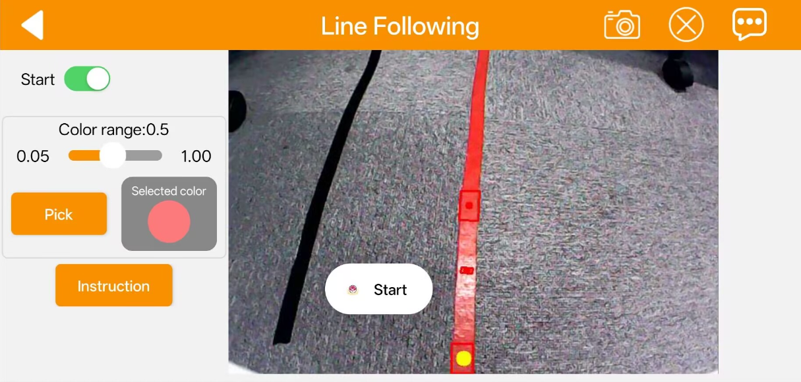

* **Object Tracking**

> [!NOTE]
>
> * **Conduct operations in a well-lit indoor environment while avoiding direct exposure to intense glare or sunlight.**
>
> * **Ensure that the camera field of view remains clear of background clutter, sharing matching or similar colors to minimize target detection interference.**
>
> * **Select "Object Tracking" from the main menu to open the interface, then tap the Pick button using a red ball as an example.**

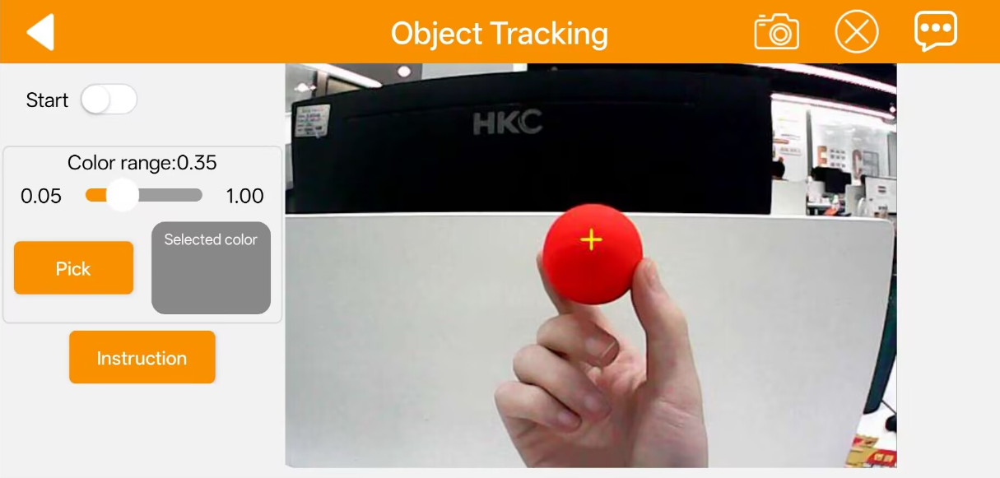

1. Drag the red calibration ring on the live video stream over the target object to sample the color data, then tap **OK**.

   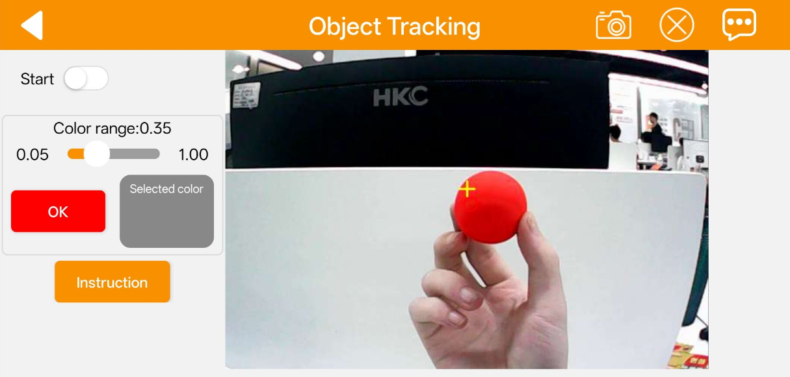

2. The active target color configuration appears within the **Selected color** display box.

   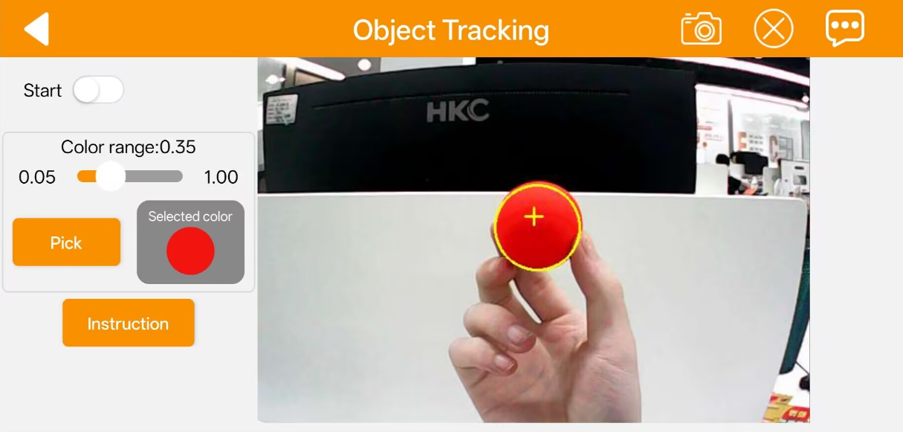

3. Toggle the **Start** button to launch the routine. Moving the target object prompts the robot to follow its trajectory dynamically.

   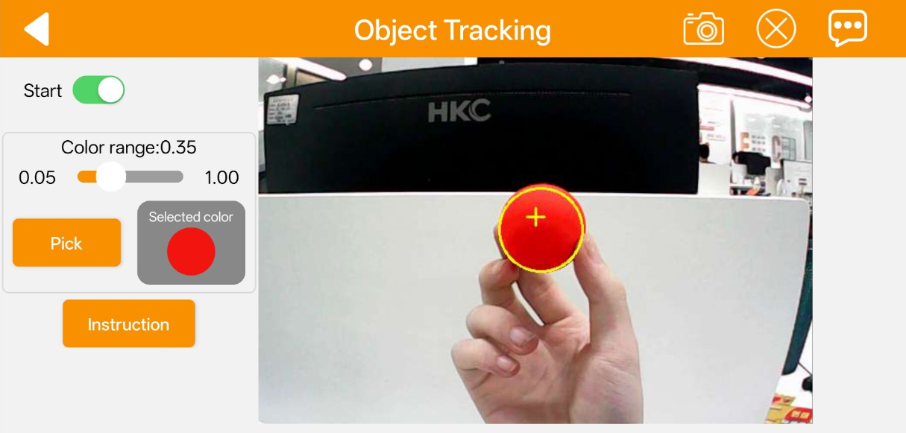

* **Tag Recognition**

> [!NOTE]
>
> * **The maximum effective detection range is approximately 50 cm.**
>
> * **Ensure the tag cards remain completely intact. Wrinkles or physical damage will degrade target recognition accuracy.**

Tap **Tag Recognition** to open the operational panel, then toggle the **Start** button to launch the routine. Once active, present the included tag cards to the camera module sequentially. The robot automatically executes predefined kinematic actions upon identifying each tag pattern.

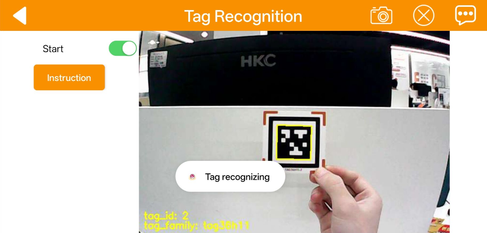

* **Face Detection**

> [!NOTE]
>
> * **The maximum effective detection range is approximately 100 cm.**
>
> * **Avoid placing faces too close to the robot chassis to prevent tracking failures or accidental physical contact injuries.**

Tap **Face Detection** to open the interface, then toggle the **Start** button to initialize. The robot head will automatically pan left and right to scan the area. Upon locking onto a human face, the tracking rotation stops, and the robot triggers a waving gesture animation.

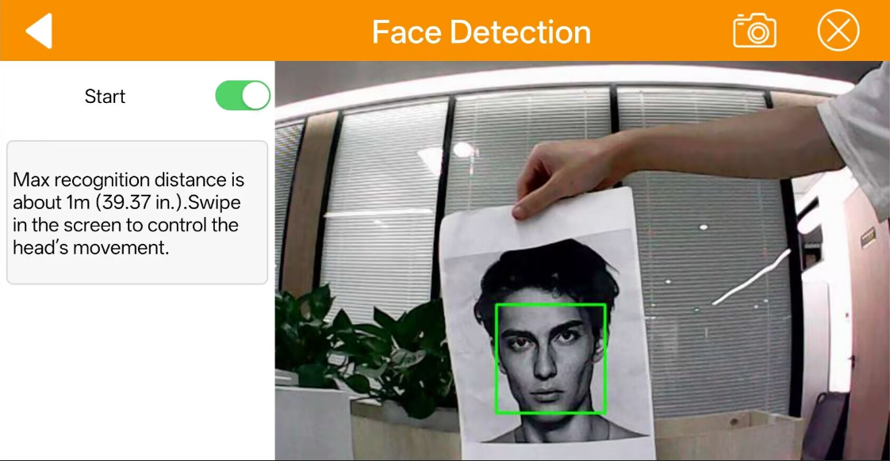

* **Gesture Control**

> [!NOTE]
>
> * **This feature supports right-hand inputs exclusively.**
>
> * **Extend the index finger while keeping the remaining digits closed during detection.**
>
> * **Maintain a moderate movement speed to ensure robust gesture tracking.**

Select **Gesture Control** from the feature menu to enter the interface. Toggle the **Start** button and follow the visual prompts displayed in the lower-left corner. The robot executes corresponding directional movements after tracking the hand trajectory.

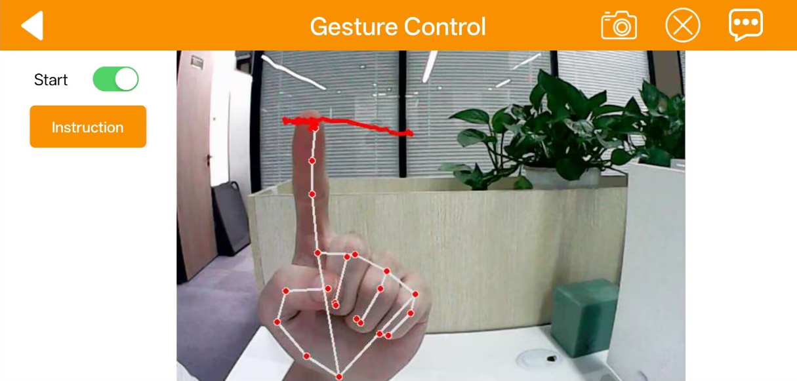

* **Cross Hurdle**

Tap **Cross Hurdle** to launch the interface. The camera processes and recognizes the blue segments on the hurdle prop, commanding the robot to execute an autonomous clearance step.

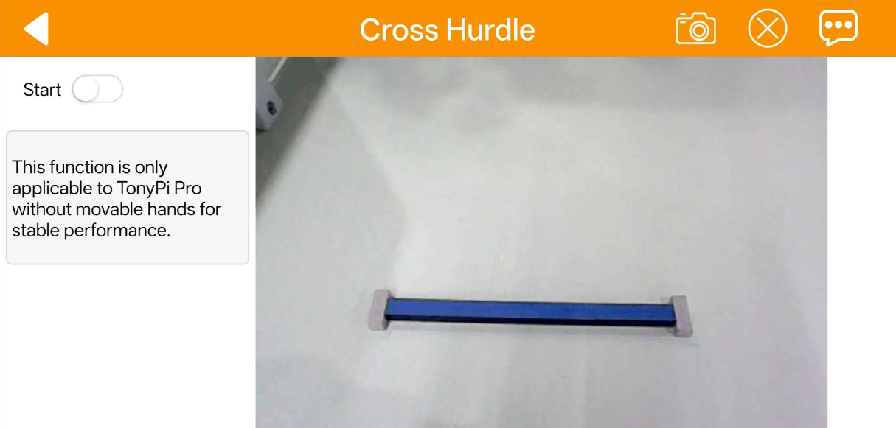

* **Up And Down Stair**

Toggle the **Start** button to open the feature interface. The camera identifies the red sections of the step prop, allowing the robot to successfully complete autonomous ascent and descent routines.

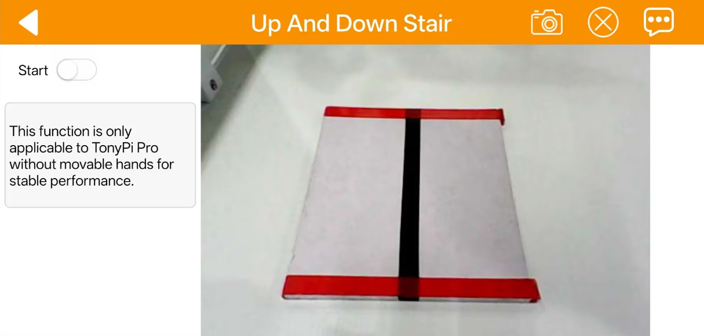

## 2.4 Large AI Model Features

> [!NOTE]
>
> **This section uses TonyPi Pro as an example. The information provided also applies to other versions of TonyPi.**

### 2.4.1 Preparation

Refer to section [2.1 App Installation and Connection](#anchor_2_1) to install the app and configure the robot to Local Area Network (LAN) mode.

Follow the documentation [2.2 Large Model API Key Setup](#p2-2) to complete the credential setup.

### 2.4.2 Operation Steps

> [!NOTE]
>
> **The robot must operate in LAN mode or be connected directly via an Ethernet cable to execute large AI model features.**

1. Select the **Large Model** mode.

   

   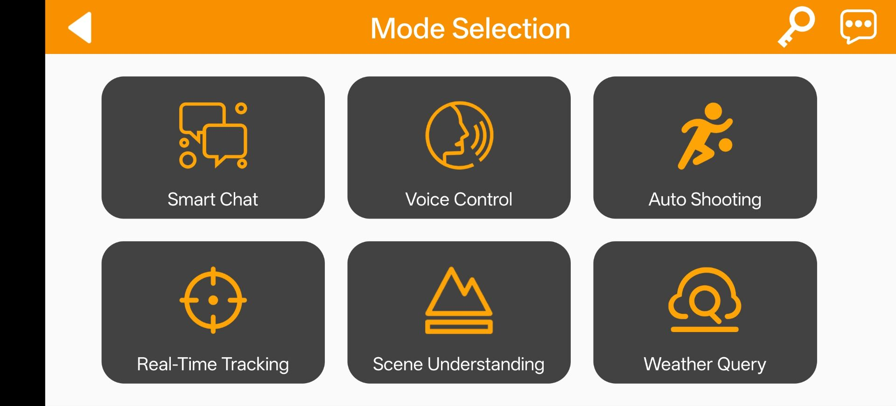

2. Tap the key icon indicated by the arrow indicator.

   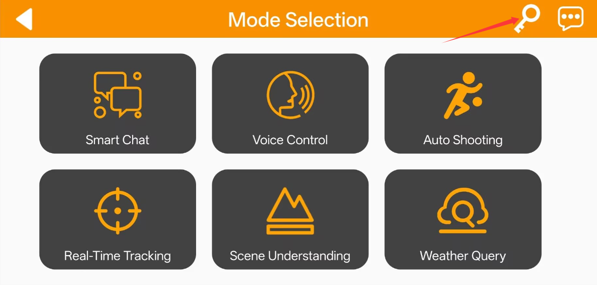

3. Input the previously acquired credential into the **Large Model Key** field, tap **Set**, and reboot the robot.

   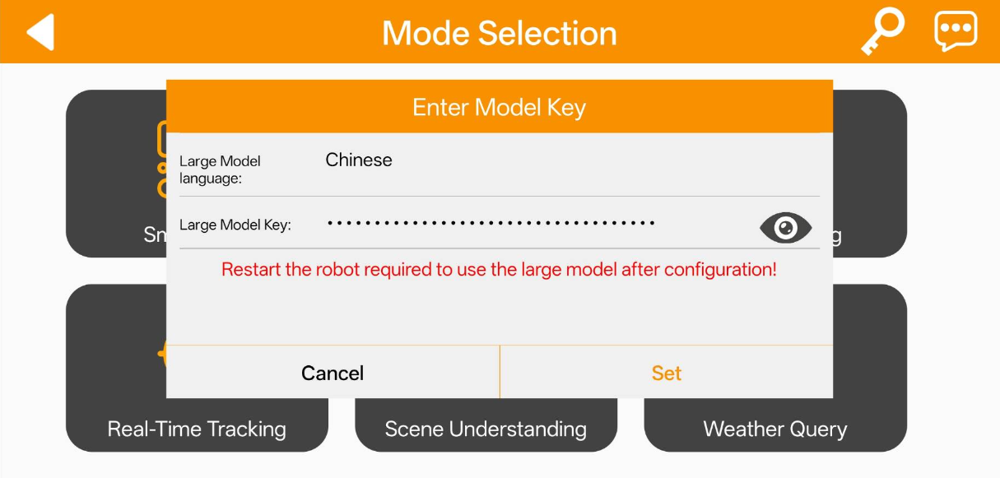

* **Smart Chat**

1. Tap the **Smart Chat** icon to open the corresponding control panel.

   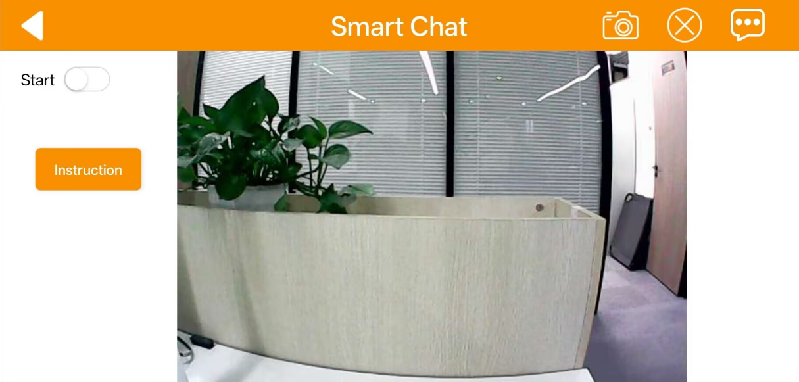

2. Tap the **Instruction** button to review the feature description, then tap **OK** to dismiss the prompt.

   

3. Toggle the **Start** button and wait for the robot to broadcast the voice prompt **I'm ready**. Activate the system using the wake word **Hello Hiwonder** to chat with the robot. Toggle the **Start** button again to terminate the session.

* **Voice Control**

1. Tap the **Voice Control** icon to enter the interface.

   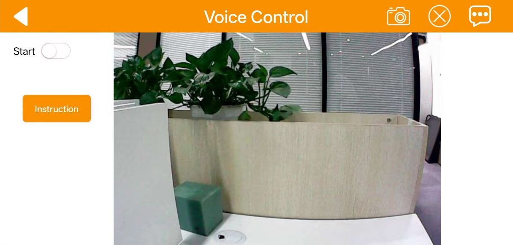

2. Tap the **Instruction** button to view the overview, then tap **OK** to dismiss the window.

   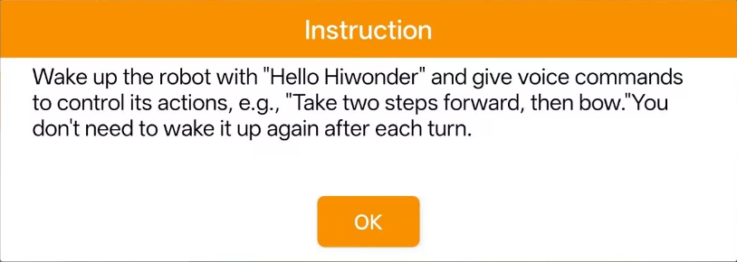

3. Toggle the **Start** button and wait for the robot to say **I'm ready**. Say the wake word **Hello Hiwonder** to enable voice interactions. Issue verbal instructions to control robot movements. Tap **Start** again to disable the mode.

* **Auto Shooting**

1. Tap the **Auto Shooting** icon to open the corresponding panel.

2. Tap the **Instruction** button to view the overview, then tap **OK** to dismiss the window.

   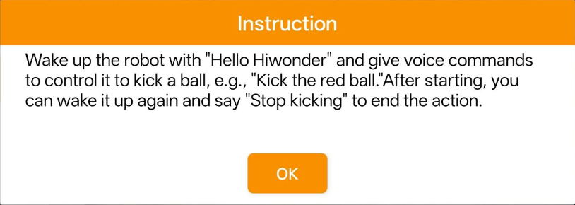

3. Toggle the **Start** button and wait for the robot to say **I'm ready**. Wake up the robot using the wake word **Hello Hiwonder** to launch the voice-controlled tracking and kicking routine. Issue verbal commands to direct ball tracking and kick execution. Tap **Start** again to exit.

   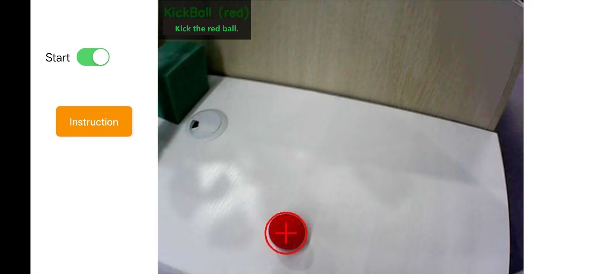

* **Real-Time Tracking**

1. Tap the **Real-Time Tracking** icon to access the interface.

   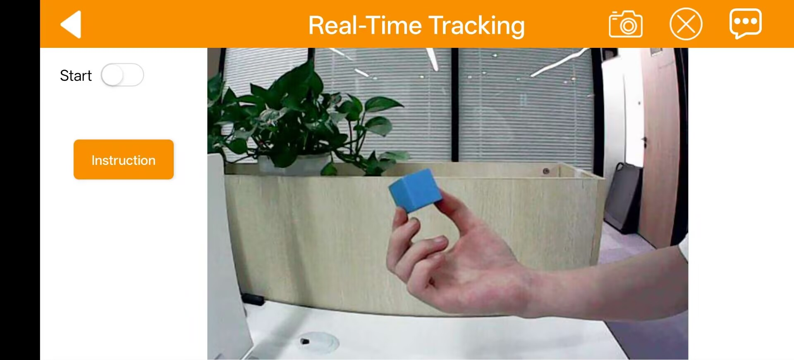

2. Tap the **Instruction** button to view the overview, then tap **OK** to close the prompt.

   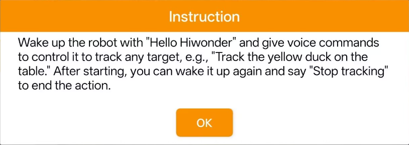

3. Toggle the **Start** button and wait for the robot to say **I'm ready**. Activate the robot using the wake word **Hello Hiwonder** to initialize real-time tracking. Direct target tracking behavior via verbal inputs. Tap **Start** again to deactivate.

   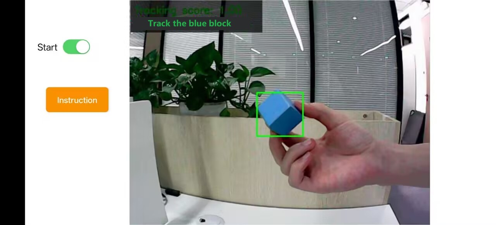

* **Scene Understanding**

1. Tap the **Scene Understanding** icon to access the interface.

   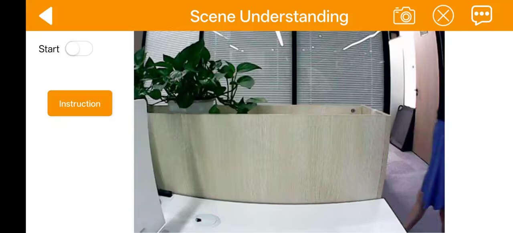

2. Tap the **Instruction** button to view the overview, then tap **OK** to close the prompt.

   

3. Toggle the **Start** button and wait for the robot to say **I'm ready**. Say the wake word **Hello Hiwonder** to initiate scene analysis. Prompt the robot verbally to generate a description of its environment. Tap **Start** again to deactivate.

   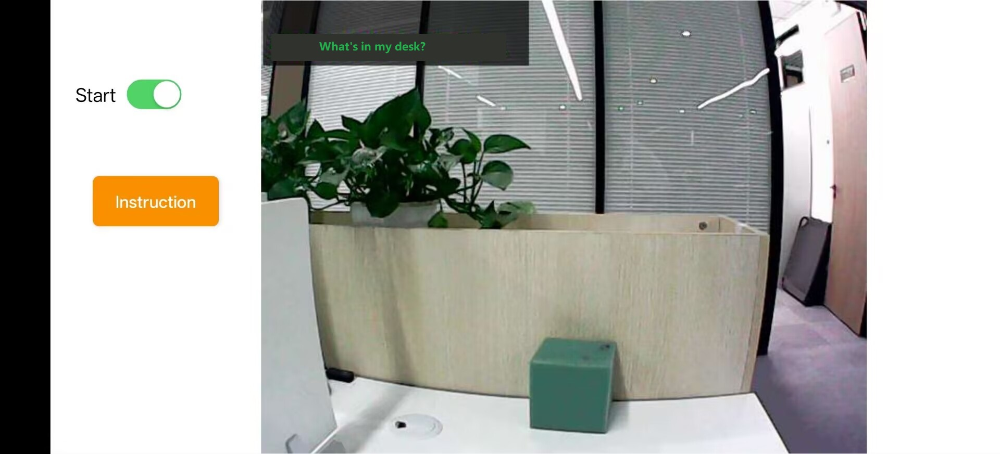

* **Weather Query**

1. Tap the **Weather Query** icon to open the interface.

   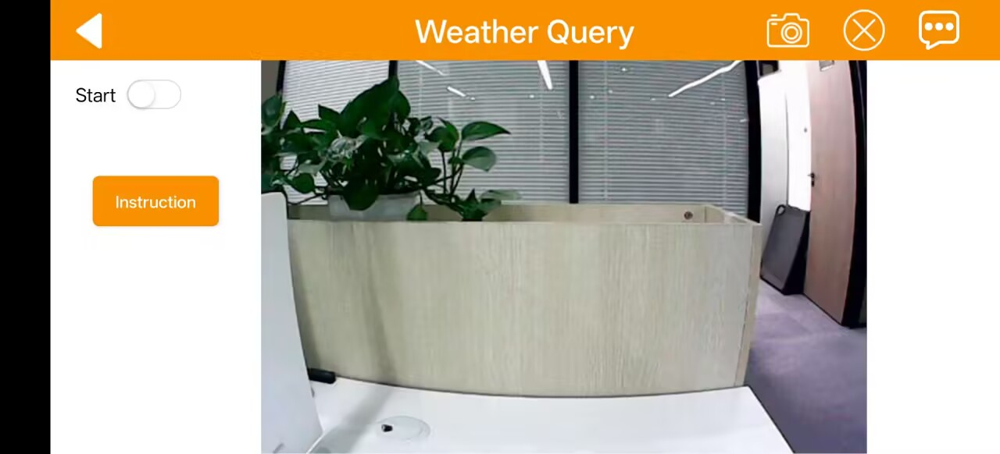

2. Tap the **Instruction** button to view the overview, then tap **OK** to close the window.

   

3. Toggle the **Start** button and wait for the robot to say **I'm ready**. Say the wake word **Hello Hiwonder** to activate weather querying. Request weather information for a specific state or city via vocal prompts. Tap **Start** again to close the feature.

   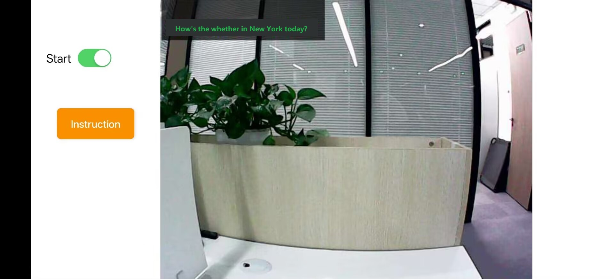

## 2.3 Color Threshold Adjustment

> [!NOTE]
>
> **This lesson is applicable to all Raspberry Pi 4B and Pi 5 series products.**

Please be aware that lighting conditions can significantly affect the appearance of colors, which may impact the performance of color recognition features.

To address this, this section shows how to use the WonderPi app to adjust color threshold settings for optimal recognition.

### 2.3.1 Preparation

Refer to the tutorial [**2.1 App Installation and Connection**](#anchor_2_1) to install the mobile app and connect to the robot.

### 2.3.2 Interface Description

Once enter the mode selection screen, tap the button shown below to access the color threshold adjustment interface.

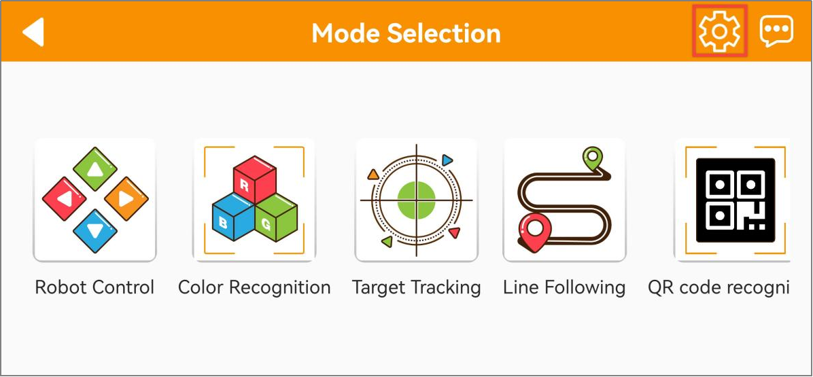

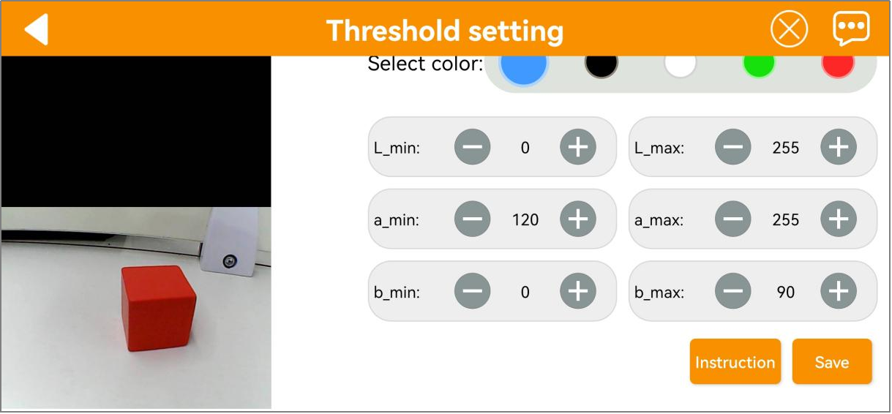

The table below provides a description of the functions in the color threshold adjustment interface:

| **Icon** | **Description** |
|:--------:|:---------------------|
| 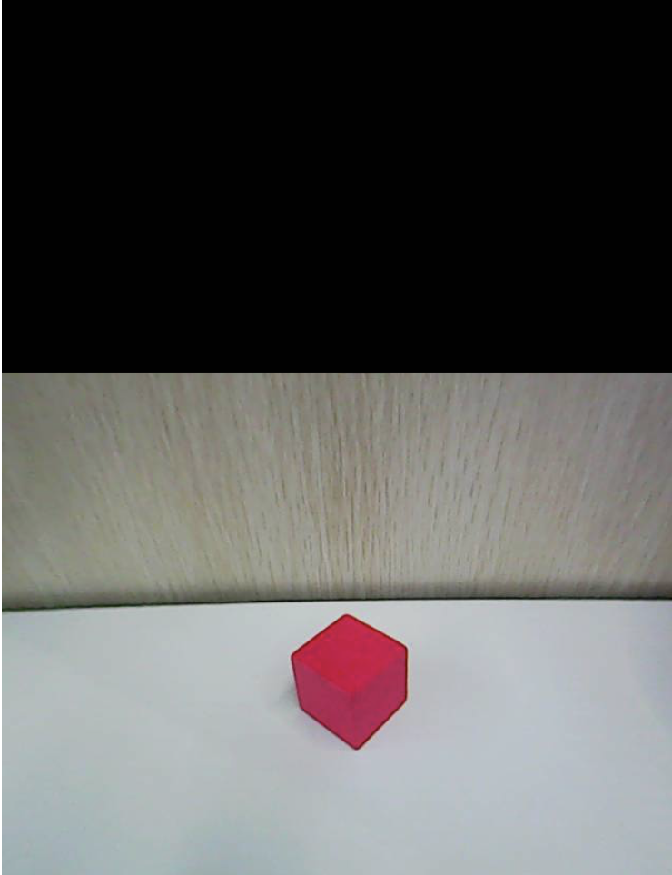 | Processed image from the camera feed. In the image, the colored object areas are shown in white, while the rest is shown in black. |
|  | Original image from the camera feed. |
|  | Currently selected color for adjustment. |
| 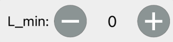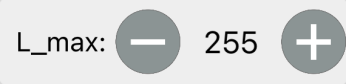 | Adjust the L component (lightness) range of the camera feed image. `L_min` is the lower limit, and `L_max` is the upper limit. Click the button  to decrease the corresponding value. Click the button  to increase it. |
| 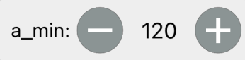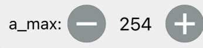 | Adjust the A component (green to red) range of the camera feed image. `a_min` is the lower limit, and `a_max` is the upper limit. Click the button  to decrease the corresponding value. Click the button  to increase it. |
| 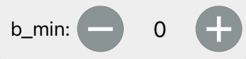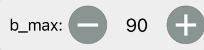 | Adjust the B component (yellow to blue) range of the camera feed image. `b_min` is the lower limit, and `b_max` is the upper limit. Click the button  to decrease the corresponding value. Click the button  to increase it. |
|  | Open the instruction window to view the method for adjusting color thresholds. |
|  | Save the adjusted threshold values. |
|  | Return to the mode selection screen. |
|  | Hide the navigation bar. |
|  | Display the information window for Hiwonder |

### 2.3.3 Adjust Color Threshold

(1) Open the color threshold adjustment screen and select the color needed to adjust—for example, red.

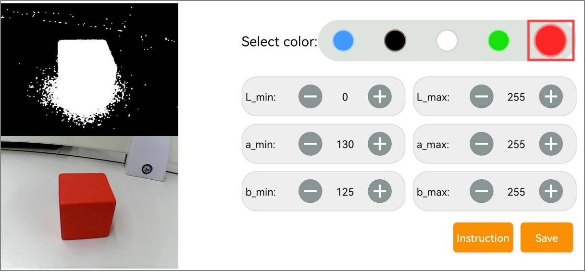

(2) Place the red object within the camera's view. Set the minimum values of L, A, and B components to 0, and the maximum values to 255.

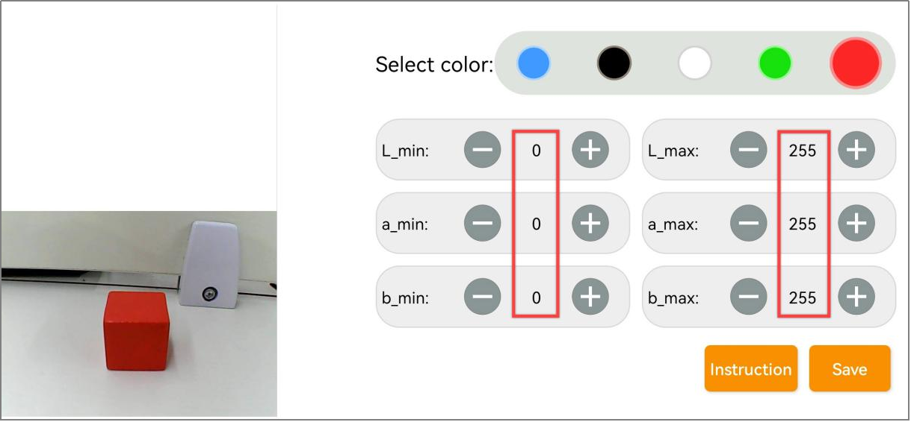

(3) Click the **Instruction** button to see how to adjust the color thresholds.

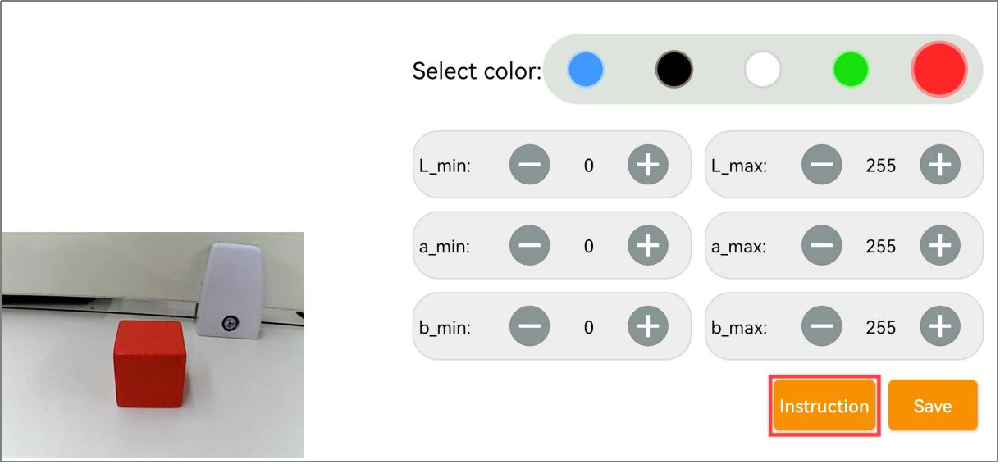

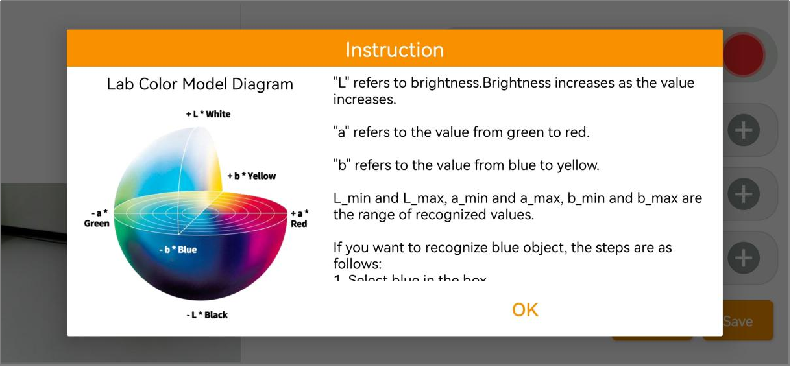

> [!NOTE]
>
> **To close the instructions window, click OK.**

(4) Since red is closer to the positive side of the A component in the LAB color space, start by adjusting the A values.


(5) Leave `a_max` unchanged and gradually increase `a_min` until the red object appears white in the processed image while the background turns black.

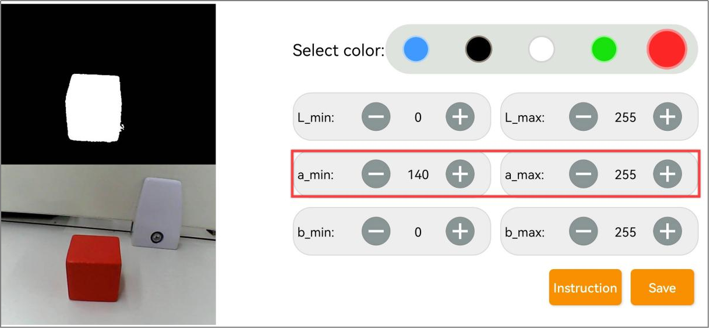

(6) Adjust the L (lightness) and B (chroma) values depending on the lighting conditions:

- If the red looks too light, raise the minimum brightness (`L_min`).
- If it looks too dark, lower the maximum brightness (`L_max`).
- If the red appears too warm, increase the minimum chroma (`b_min`).
- If it looks too cool, decrease the maximum chroma (`b_max`).

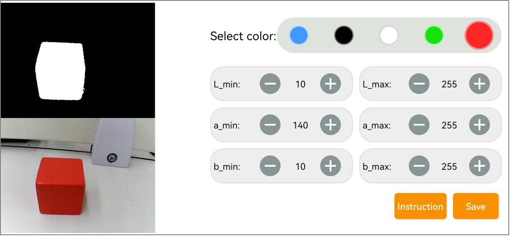

(7) When the settings are down, click **Save** to keep the new threshold values.

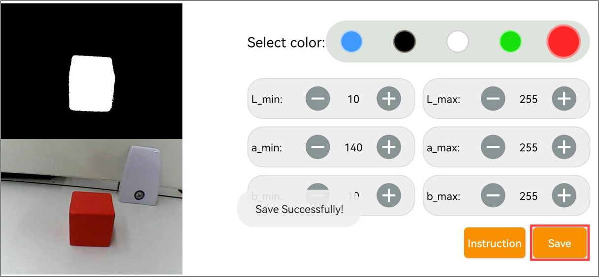