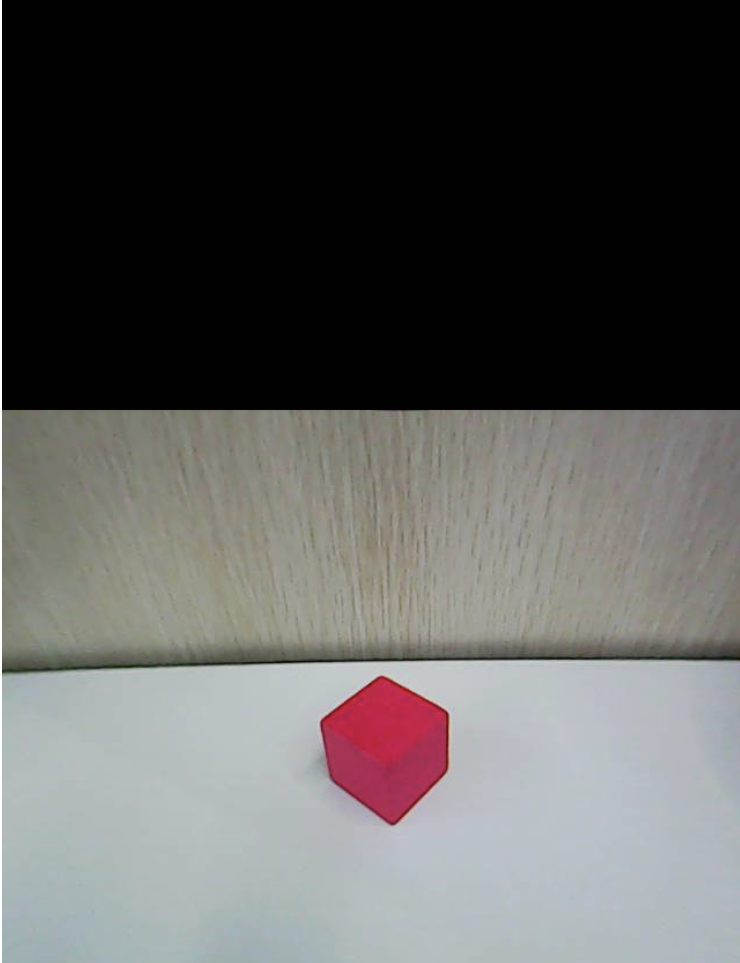

# 2. Quick User Experience

## 2.1 App Installation and Connection

:::{Note}
This section takes the **TonyPi** version as an example, but the instructions equally apply to **TonyPi Pro**.
:::

(1) When installing the app, please allow all necessary permissions to ensure it works smoothly.

(2) Before opening the app, make sure your phone's **GPS** and **Wi-Fi** service are enabled.

### 2.1.1 App Installation

The app installation package is located in the folder "**2.1.2 App Installation Pack**". Please transfer this package to your phone to install the app.

**[APP Installation Pack (Android)](https://play.google.com/store/apps/details?id=com.Wonder.Pi)**

**[APP Installation Pack (iOS)](https://apps.apple.com/cn/app/wonderpi/id1477946178)**

This section explains how to connect TonyPi to the app.

### 2.1.2 Device Connection

Upon successful startup, the robot will automatically generate a hotspot with a name beginning with **"HW."** Connect your phone's app to this hotspot to access and activate additional features.

* **Connection Mode Overview**

The robot supports two network modes:

(1) **AP Direct Connection Mode:** The development board creates a hotspot that your phone can connect to. 

:::{Note}
This mode does not provide access to external networks.
:::

(2) **STA Local Area Network (LAN) Mode:** The development board connects to a specified Wi-Fi hotspot, allowing access to external networks.

These two modes cannot be used simultaneously. By default, the robot operates in AP Direct Connection Mode. Regardless of which mode you choose, the available features and functions remain the same.

We recommend starting with the AP Direct Connection Mode for initial setup and experience. You can switch to LAN Mode later if needed.

* **Direct Connection Mode (MUST READ)**

This section uses the Android version as an example, but the steps also apply to iOS.

(1) Open the mobile app and, on the home interface, select **"Advanced"**, then choose **"TonyPi"**.

(2) On the product selection screen, tap the **"TonyPi"** icon.

(3) Back on the home interface, select **"TonyPi"** again, then tap the **"+"** button at the bottom right and choose **"Direct Connection Mode"**.

(4) Follow the on-screen instructions to open your phone's settings and connect to the hotspot starting with **"HW"**（Password: **hiwonder**）.

(5) Once connected, return to the app. The app will automatically connect to the device. Wait a moment until the robot icon appears, indicating a successful connection.

:::{Note}
If you are using an iPhone, please ensure the Wi-Fi connection icon appears at the top of your screen before returning to the app. Otherwise, the device may not be detected. If this occurs, try refreshing the search several times  —it usually resolves the issue.
:::

If prompted with a message like **"Network may not be available, do you want to stay connected?"**, please select **"Keep Connected"**.

* **LAN Mode Connection Method (Optional)**

(1) Starting from having connected via AP Direct Mode, open the WonderPi app. Tap the **"+"** button at the bottom right and choose **"LAN Mode"**. Follow the prompts to open your phone's Wi-Fi settings and connect to the desired Wi-Fi network.

(2) Select the Wi-Fi network you want to connect to (for example, **"Hiwonder"**).

(3) Once connected, return to the app and tap the **"+"** button again. Select **"LAN Mode"** once more.

(4) The app will ask for the Wi-Fi password. If the prompt doesn't appear automatically, tap **"LAN Mode"** again. Enter the correct password and tap **"Next"**. 

:::{Note}
Make sure the password is accurate to avoid connection issues.
:::

(5) Next, follow the app's instructions to connect to the robot's hotspot (which starts with **"HW"**) in your phone's Wi-Fi settings.

(6) After connecting to the hotspot, return to the app. It will automatically attempt to connect to the robot. If prompted to join the network, tap **"Join"**.

(7) Wait a moment for the connection to complete. The app will switch back to the main screen automatically. The LED2 light on the Raspberry Pi expansion board will stop flashing and remain steadily lit, indicating a successful network connection.

(8) Press and hold the robot icon in the app to view the robot's IP address and ID. Note down the IP address, as you'll need it for the next steps.

(9) Next, proceed to the [**"3. Remote Desktop Tool Installation and Connection"**](3_remote_desktop_tool_installation_and_connection.md) section. Follow the instructions to install the VNC remote desktop tool. Open the tool and enter the robot's IP address in the address bar, then press Enter.

(10) When prompted, enter the login credentials:

- Username: `pi`
- Password: `raspberrypi`

Optionally, check **"Remember password"**, then click **"OK"**. You should now see the Raspberry Pi desktop remotely.

## 2.2 App Control

:::{Note}
This section uses **TonyPi Pro** as an example. The information provided also applies to other versions of TonyPi.
:::

### 2.2.1 Preparation

Refer to the tutorial [**"2.1 App Installation and Connection"**](#anchor_2_1) to install the mobile app and connect to the TonyPi Pro robot.

### 2.2.2 Operation Steps

:::{Note}
**Hurdle Obstacle Avoidance** and  **Stair Climbing** apply exclusively to the TonyPi Pro version.
:::

Tap the robotic icon to enter the mode selection interface.

* **Robot Control**

(1) Tap the **'Robot Control'** icon to enter the game interface. The robot will automatically return to its initial pose.

(2) The **'Robot Control'** interface is divided into two sections. On the left side, you can control TonyPi's movements.

| **Icon** | **Function** |
|----------|--------------|
|  | **Drag the virtual joystick** to control the robot's movement. |
|  | Use the controls to **turn left or right** and **reset the robot's pose**. |
|  | Trigger **built-in actions** such as walking or getting up. |

The right side of the interface displays the real-time video feed from the robot's camera. You can swipe on the screen to adjust the camera's viewing angle.

:::{Note}
The camera's servo is equipped with limit protection. When the camera reaches its maximum rotation range, further swiping will trigger vibration feedback. At this point, do not continue to rotate the camera to prevent potential damage.
:::

(3) The **'Operation Guide'** located in the bottom-right corner of the interface provides helpful instructions. Details are shown in the image below:

The robot will automatically return to its initial pose each time you switch to a different game mode.

(4) To return to the main interface, tap anywhere on the blank area to display the menu, then tap-on .

* **Automatic Ball Kicking**

In this mode, TonyPi can detect balls of any color. The robot will adjust its position to approach the ball and kick it forward.

:::{Note}
* Please use the device in a well-lit indoor environment, avoiding direct exposure to intense light sources.

* During color recognition, ensure that no objects with the same or similar color as the target are present within the camera's field of view to avoid interference.

:::

(1) Tap **"Automatic Ball Kicking"** to enter the game screen.

(2) In the game screen, using a red ball as an example, tap the **"Pick"** button. Drag the red circle on the video feed over the target object to select its color, then tap **"OK"** to finalize the selection.

(3) The selected color will be displayed under **"Selected Color."**

(4) Tap the **"Start"** button to begin. The robot will track the target, approach it, and kick it away once nearby.

* **Line Following**

In this mode, TonyPi can recognize lines of any color. The robot will continuously adjust its position to follow the line.

:::{Note}
* Operate in a well-lit indoor environment, but avoid direct exposure to strong light.
* Ensure there are no objects with the same or similar color as the target in the camera's view to prevent interference.

You can use colored tape to create a line-following track.
:::

(1) Tap **"Line Following"** on the mode selection screen to enter the operation interface. Using red tape as an example, tap the **"Pick"** button.

(2) Drag the red circle in the video feed to the track area to select the color, then tap **"Confirm"** to complete the selection.

(3) The selected color will appear under **"Chosen Color."**

(4) Tap the **"Start"** button to begin. The robot will follow the track based on the selected color.

* **Target Tracking**

:::{Note}
* Operate in a well-lit indoor environment, but avoid direct exposure to strong light.
* Ensure there are no objects with the same or similar color as the target in the camera's view to prevent interference.

:::

(1) On the mode selection screen, tap **"Object Tracking"** to enter the operation interface. Using a red ball as an example, tap the **"Pick"** button.

(2) In the live video feed, drag the red circle over the target object to select its color, then tap **"OK"** to finalize the selection.

(3) The selected color will be displayed under **"Selected Color."**

(4) Tap the **"Start"** button to begin. The robot will track and follow the target as it moves.

* **Tag Recognition**

:::{Note}
* The maximum recognition distance is approximately 50 cm.
* Please ensure the tag cards remain intact. Folds or damage may affect recognition accuracy.

:::

Tap **"Tag Recognition"** to enter the corresponding interface, then tap **"Start Recognition"** to begin.

Once activated, present the included tag cards one at a time in front of the camera module.

When a tag is successfully recognized, the robot will automatically execute the associated action.

* **Face Detection**

:::{Note}
* The maximum recognition range is approximately 100 cm.
* Please avoid placing your face too close to the robot, as this may interfere with recognition and could potentially result in accidental contact.
:::

Tap **"Face Recognition"** icon to enter the game interface, then tap **"Start Recognition"** to begin.

Once the mode is activated, the robot's head will scan from side to side. Upon detecting a face, the head will stop rotating, and the robot will perform a **waving** gesture.

* **Gesture Control**

:::{Note}
* This mode supports **right-hand gestures only**.
* During recognition, please **extend your index finger** while keeping the other fingers together.
* **Avoid moving your hand too quickly**, as it may affect recognition accuracy.
:::

Tap **"Gesture Control"** on the mode selection screen to enter the operation interface.

Then tap **"Start"** and follow the instructions displayed in the lower-left corner of the screen.

Once the system successfully recognizes the gesture's movement trajectory, the robot will carry out the corresponding action.

* **Hurdle Crossing**

Tap **"Hurdle Crossing"** to enter the mode interface.

The robot will use its camera to identify the blue section on the obstacle prop and will perform a stepping-over motion to cross it.

* **Step Climbing**

Tap **"Start"** to enter the activity interface.

The robot will use its camera to detect the red section on the step prop and will automatically perform the actions to climb up or down the steps.

## 2.3 Color Threshold Adjustment

:::{Note}
This lesson is applicable to all Raspberry Pi 4B and Pi 5 series products.
:::

Please be aware that lighting conditions can significantly affect the appearance of colors, which may impact the performance of color recognition features.

To address this, this lesson will guide you through using the WonderPi mobile app to adjust color threshold settings for optimal recognition.

### 2.3.1 Preparation

Refer to the tutorial [**"2.1 App Installation and Connection"**](#anchor_2_1) to install the mobile app and connect to the robot.

### 2.3.2 Interface Description

Once you're in the game mode selection screen, tap the button shown below to access the color threshold adjustment interface.

The table below provides a description of the functions in the color threshold adjustment interface:

| **Icon** | **Icon Description** |
|----------|----------------------|
|  | Processed image from the camera feed. In the image, the colored object areas are shown in white, while the rest is shown in black. |
|  | Original image from the camera feed. |
|  | Currently selected color for adjustment. |
|  | Adjust the L component (lightness) range of the camera feed image; `L_min` is the lower limit, and `L_max` is the upper limit. Click the button  to decrease the corresponding value; click the button  to increase it. |
|  | Adjust the A component (green to red) range of the camera feed image; `a_min` is the lower limit, and `a_max` is the upper limit. Click the button  to decrease the corresponding value; click the button  to increase it. |
|  | Adjust the B component (yellow to blue) range of the camera feed image; `b_min` is the lower limit, and `b_max` is the upper limit. Click the button  to decrease the corresponding value; click the button  to increase it. |
|  | Open the instruction window to view the method for adjusting color thresholds. |
|  | Save the adjusted threshold values. |
|  | Return to the game mode selection screen. |
|  | Hide the navigation bar. |
|  | Display the information window for Hiwonder |

### 2.3.3 Adjust Color Threshold

(1) Open the color threshold adjustment screen and select the color you want to adjust—for example, red.

(2) Place the red object within the camera's view. Set the minimum values of L, A, and B components to 0, and the maximum values to 255.

(3) Click the **"Instructions"** button to see how to adjust the color thresholds.

:::{Note}
To close the instructions window, click **"OK."**
:::

(4) Since red is closer to the positive side of the A component in the LAB color space, start by adjusting the A values.

(5) Leave `a_max` unchanged and gradually increase `a_min` until the red object appears white in the processed image while the background turns black.

(6) Adjust the L (lightness) and B (chroma) values depending on the lighting conditions:

- If the red looks too light, raise the minimum brightness (`L_min`).
- If it looks too dark, lower the maximum brightness (`L_max`).
- If the red appears too warm, increase the minimum chroma (`b_min`).
- If it looks too cool, decrease the maximum chroma (`b_max`).

(7) When you're satisfied with the settings, click **"Save"** to keep the new threshold values.

