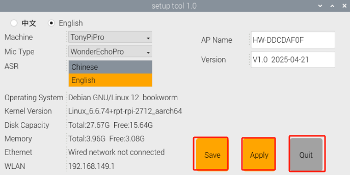

# 3. Remote Desktop Tool Installation and Connection

## 3.1 Remote Tool Installation and Connection

To complete this section, a laptop is required. If you are using a desktop computer, please ensure it is equipped with a wireless network adapter. A demonstration video is available in the corresponding folder for reference.

This tutorial is based on the Windows version. For macOS installation, please refer to official resources or search online for platform-specific instructions.

### 3.1.1 Getting Ready

* **VNC Installation**

If you want to run the programming games through computer, and to know how to find and modify the programs at last, please finish the learning of this section and the installation of VNC.

VNC is a graphics remote control software. With VNC, we can control the Raspberry Pi directly from your computer through the hotspot created by Raspberry Pi. Next, you will learn how to use VNC.

(1) Double-click the **"VNC-Viewer-6.17.731-Windows"** file in this folder. In the pop-up dialogue box, select the installation language as **"English"** and then click the **"OK"** button.

(2) Then click the **"Next"** button on the pop-up interface.

(3) Then click **"accept the terms in the License Agreement"** in the prompt box, and click **"Next"** to enter the next step.

(4) Then click **"Install"** in the pop-up page.

(5) After VNC has been successfully installed, click the **"Finish"** button which completes the installation process. You can now open VNC.

After successfully connecting，open the icon  directly.

### 3.1.2 Start the Robot

Based on what you've learned earlier, after connecting the power adapter, toggle the switch on the Raspberry Pi expansion board. After a short moment, the LED2 indicator on the board should change from steadily lit to blinking once per second—this indicates that the Raspberry Pi has successfully powered on.

## 3.2 Device Connection

(1) After turning on, Raspberry Pi will launch a Wi-Fi hotspot with a network named with the first letters **"HW"**. Click to connect.

(2) Enter the default IP address of the Raspberry Pi `192.168.149.1` in the VNC Viewer, and then press **"Enter"**. If the software warns that the connection is not safe just Click **"Continue"**.

(3) A login prompt will appear requesting a Username and Password.

* Raspberry Pi 5 version:
  * **Username：pi**
  * **Password: raspberrypi**

Check the **"Remember password"** option, then click **"OK"**. The Raspberry Pi desktop should now be displayed.

(4) There is a warning dialogue box will pop up in the desktop (this is normal). Click **"OK"** to close it. If a black screen occurs, please restart the Raspberry Pi.

Detailed starting steps of each game project can be found in the following lessons.

## 3.3 Overview of the Robot Version Configuration Tool

The robot firmware supports multiple configurations, accommodating different models (TonyPi and TonyPi Pro) as well as both Chinese and English versions of the large AI model. When you need to switch between robot models or change the language version of the AI model, please follow the steps outlined below:

(1) Turn on the robot and connect it to the remote control software VNC. For detailed steps on how to connect via remote desktop, please refer to [**"3.1 Remote Tool Installation and Connection"**](#anchor_3_1).

(2) On the remote desktop, double-click the robot system configuration tool , then click **"Execute"** to open it.

(3) In the configuration window, choose the robot model you want to switch to under **"Robot Type"**. For example:

* **TonyPi:** Standard version without the open/close palm feature.

* **TonyPi Pro**: Professional version with the open/close palm feature.

(4) Then, under **"Voice Function,"** select the AI model you want to use:

* Chinese large AI models such as Aliyun and Jieyue Xingchen.

* English: International models like ChatGPT and OpenRouter.

(5) Once you've made your choices, click **Save > Apply > Exit** in that order to ensure the changes take effect.

(6) Wait for the buzzer to beep once — this confirms the switch was successful. You can then open the command line terminal  to check the system status.