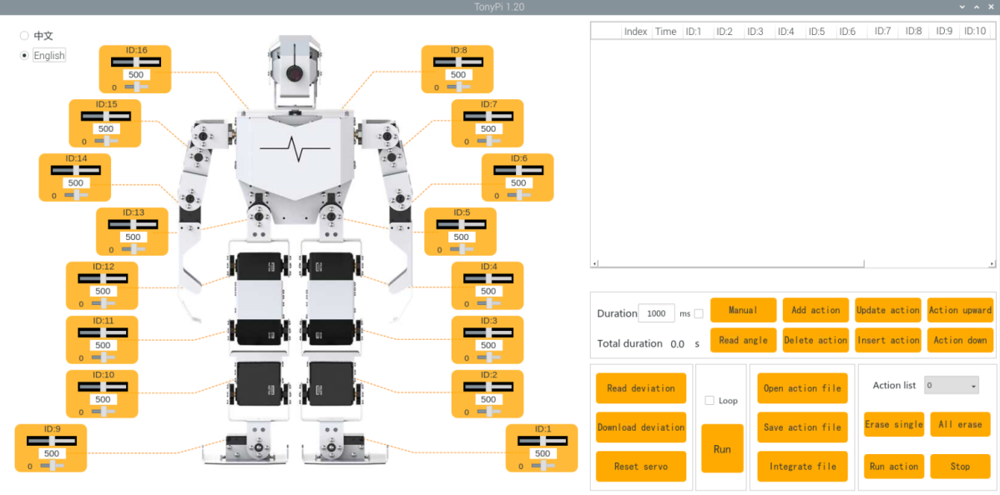

# 4. PC Software Action Control Courses

## 4.1 Introduction to PC Software

In this section, you will quickly learn how to use the TonyPi PC software.
First, connect to the VNC remote desktop, then double-click the **"TonyPi"** icon to launch the program.
If a pop-up window appears, click **"Run"** to proceed.


The main interface of the TonyPi PC software can be divided into the following areas:


### 4.1.1 Servo Control Area

Drag the corresponding slider to adjust the servo position:

| **Icon** | **Function** |
|:--:|:--:|
|  | ID number. Take NO.1 servo as example |
|  | Adjust servo position from 0 to 1000. |
|  | Adjust servo deviation from -125 to 125. |

### 4.1.2 Open-Close Hand Settings

Selecting the checkbox in the top-left corner  will bring up the control interface for the left and right open-close hands, identified by IDs 17 and 18 respectively.


### 4.1.3 Action List

The action details list shows the execution time of each action within the current action group, as well as the corresponding servo values for each action.


| **Icon** | **Function** |
|:--:|:--:|
|  | Action group NO. |
|  | Running time of the action. |
|  | Action data of the corresponding servo. Double click the figureto revise. |

### 4.1.4 Action Group Setting

| **Icon** | **Function** |
|:--:|:--:|
|  | **Action Duration:** Displays the duration for the current action. Click the value to edit. Note: Changes take effect only after clicking the **"Update Action"** button. Valid range: 20–9999 ms. |
|  | **Total Duration:** Shows the total time needed to complete all actions in the group. |
|  | **Relax Joints:** Clicking this button relaxes the robot's joints, allowing you to manually pose it. |
|  | **Read Pose:** Captures the current servo angles from the manually posed robot. *(Use together with the **"Manual"** button.)* |
|  | **Add Action:** Adds the current servo values from the control panel as a new action at the end of the action list. |
|  | **Delete Action:** Removes the selected action(s) from the list. |
|  | **Replace Action:** Replaces the selected action's angles with the current servo values and updates its duration to the time set in **"Duration."** |
|  | **Insert Action:** Inserts a new action above the selected one, using current servo values and the duration specified in **"Duration."** |
|  | **Move Up:** Moves the selected action one step up in the list, swapping positions with the previous action. |
|  | **Move Down:** Moves the selected action one step down in the list, swapping positions with the next action. |
|  | **Play Once:** Executes all actions in the list once. |
|  | **Loop Play:** When checked, the robot repeats the action sequence continuously. |
|  | **Load Action Group:** Opens and loads an action group file into the action list. |
|  | **Save Action Group:** Saves the current action list to a specified location. |
|  | **Merge Action Groups:** After opening one action group, use this to load another and merge both into a new combined group. |
|  | **View Saved Groups:** Displays all saved action groups in the software. |
|  | **Delete Selected Group:** Deletes the currently selected action group file. |
|  | **Delete All Groups:** *(Use with caution)* Deletes all saved action group files. |
|  | **Execute Group:** Runs the selected action group once. |
|  | **Stop Execution:** Stops the currently running action group. |

### 4.1.5 Servo Deviation Setting Area

| **Icon** | **Function** |
|:--:|:--:|
|  | Click to read the save the servo deviation. |
|  | Click to download the deviation adjustment in the PC software. |
|  | Click to return all the servos the middle position(500). |

## 4.2 Action Calling

### 4.2.1 Goal

This section focuses on how to call the built-in action group via TonyPi PC software.

### 4.2.2 Action Group Calling

(1) Power on the robot. Refer to the relevant tutorial in [**3. Remote Desktop Tool Installation and Connection**](3_remote_desktop_tool_installation_and_connection.md) to connect it to system desktop via the VNC.


(2) Click , and select **"Execute"** to open the PC software.


(3) Click **"Open action file"** to open the action group file located in the same directory as this lesson.


(4) The action data list will display the opened action group.


(5) Click **"Run"** button.


(6) You can click the dropdown button of the action group, and select the action group to be run. Then, click **"Run action group"**.


<p id="anchor_4_3"></p>

## 4.3 Action Group Programming

### 4.3.1 Project Purpose

Program an action group consisting of 8 actions to allow the TonyPi to **"Bow"**.

### 4.3.2 Program Outcome

* **Action Programming**

(1) After the TonyPi robot is started, revise action data of the 16 servos according to figure below. Click the **"Add action"** button to save the first action.


(2) Program to straighten the robot arms and knees. Take the data in below picture for reference. Then click **"Add action"** button to add the action as No.2. Do not forget to add each single action into the list.


(3) Modify the servo data as shown in the figure below to raise the arm as the No.3 action.


(4) Adjust the arm for the **"Bow"** post.


(5) Allow the robot **"Bow"**, and according to the servo value shown in the figure below to adjust, make it the No.5 action.


(6) To make the action more natural, the No.6 action is the same as No.5 action. Here we continue to click **"Add action"**.


(7) Then make the robot straighten its body, but keep its arms in a bowing position. According to the servo value shown in the figure below.


(8) Finally, allow the robot recover its initial posture, and modify each servo data to be consistent with the action No.1, then click **"Add action"**, As shown in the figure below:


The all parameter of the action groups as shown in table below: The red value is the servo data needed to be adjusted.


* **Save Action Group**

After programming, please save the action group for future debugging. Click **"Save action file"**, choose the path **/home/pi/TonyPi/ActionGroups**, name it (such as **"1_bow"**) and then click **"Save"** button.


## 4.4 Integrate Action Groups

### 4.4.1 Project Purpose

Integrate the provided basic actions to become a new action group. This section takes the integrate No.1 action and No.2 action as an example.

### 4.4.2 Complete Program

(1) Connect VNC and open TonyPi PC software.



(2) Click **"Integrate file"**, choose and double click **"1.d6a"** to open.


(3) Then the action list will display the data of No.1 action group.


(4) Click **"Integrate file"** again, choose **"2.d6a"** and double click to select it.

At this point, Action Group 2 has already been linked in.


(5) Click **"Run"** to execute the new integrated actions online.


(6) Click **"Save action file"** button and enter new action group name (such as **"3"**) to save the new integrated action group for the future debugging


## 4.5 App Custom

### 4.5.1 Purpose

Execute the action group in the folder [**"4.3 Action Group Programming"**](#anchor_4_3) through mobile APP custom function. Here, we will use executing weightlifting movements as an example.

### 4.5.2 Getting Ready

(1) After connecting VNC, open the file manager of the system desktop.


(2) Go to folder **/home/pi/TonyPi** path and open `ActionGroupDict.py`. Take the example of Text Editor:


(3) Right-click or press **"Ctrl+C"** to copy the No. 24 action.


(4) Paste the program to a new line and set the number to 35. Name as **"weightlifting"** (refer to the action group file name in **/home/pi/TonyPi/ActionGroups**)


:::{Note}
Do not use the defined number and No.255. The name of the action group should be consistent with the name in the storage directory (**/home/pi/TonyPi/ActionGroups**).
:::

(5) Press Ctrl+S to save and exit it.

(6) Enter the command to restart the Raspberry Pi:

```
sudo reboot
```

:::{Note}
This step must be done.
:::

### 4.5.3 Operation Steps

(1) Open mobile app and enter **"Model Control"**.


(2) Click **"action"** button, select **"custom"** in the pop-up interface, and long press to enter.

<p class="common_img" style="text-align:center;">


</p>

(3) Enter the name and number of the saved action group in the pop-up interface. Click **"ok"** to save it.


The action group name can be filled in arbitrarily, but the action group number must be filled in correctly, otherwise it cannot be realized.

(4) After adding, click the action group name to execute it once.


(5) If you need to modify or delete action group, please long press the action name button to modify the action group name as the default **"Custom"**. Set the number as **"255"**.

## 4.6 Call Action Group via Command Line

### 4.6.1 Project Purpose

In addition to invoking TonyPi's action groups through the upper computer, users can also run action groups by executing commands in the terminal.

:::{Note}
Action group files must be saved in the directory **/home/pi/TonyPi/ActionGroups**.
:::

Click the icon  on the system status bar to open the file manager, then go to the directory **/home/pi/TonyPi/ActionGroups** to check if the required action group files are available.


<p id="anchor_4_6_2"></p>

### 4.6.2 Call Action Group

(1) Double-click **"Terminator"** icon  in the Raspberry Pi desktop and open command line.

(2) Input and press Enter to switch to the directory where the program is stored:

```
cd TonyPi/Example/
```

(3) Input command and press Enter to start the game:

```
python3 ActionGroupControlDemo.py
```

At this time, the robot will first execute the `stand` action group, then execute the `go_forward` action group twice. After the execution is completed, the terminal will automatically close the program.

### 4.6.3 Modify Called Action Group

* **Call Single Action Group**

Users can modify the program to make the robot execute only a single action group. The specific steps are as follows:

(1) Double-click **"Terminator"** icon  in the Raspberry Pi desktop and open command line.

(2) Input and press Enter to locate to the directory where the program is stored:

```
cd TonyPi/Example/
```

(3) Input command and press Enter to open the program file:

```
vim ActionGroupControlDemo.py
```

(4) Press **"I"** key on the keyboard to enter program editing mode.


(5) Find the code as pictured:


(6) Add the symbol **"#"** at the beginning of line 28 of the code to comment out this line, leaving only the code to execute action group 1. At this point, with only 15 lines of code retained, the action group can only be run once. If you want to run the action group multiple times, you can comment out line 15 and keep line 16.


(7) Then, you can input the desired action group within the single quotes on line 15 of the code. Below is an example of executing the **back** action group.

:::{Note}
* Action group files must be saved in the directory **/home/pi/TonyPi/ActionGroups**.
* If you want to call a custom action group, you can first refer to [**"4.3 Action Group Programming"**](#anchor_4_3) to edit the action.
:::


(8) After making the modifications, press the **"Esc"** key on the keyboard to exit editing mode. Then, type and press Enter to save and exit the program file:

```
:wq
```

(9) Input command and press Enter to start game. Then the robot will execute `back` action group again:

```
python3 ActionGroupControlDemo.py
```

* **Call Multiple Action Groups**

:::{Note}
The following operations are based on [**"4.6.2 Call Action Group"**](#anchor_4_6_2).
:::

Users can use the copy-paste method to call multiple lines of code, enabling the robot to execute multiple action groups sequentially. In this section, calling the "**go**" and  "**move_up**" action groups as example, the specific steps are as follows:

(1) Refer to steps 1-3 of [**"4.6.2 Call Action Group"**](#anchor_4_6_2) to open the program file. Do not enter edit mode, otherwise copying will fail. If you are currently in editing mode, you can press the **"Esc"** key on the keyboard.

(2) Use the arrow keys to move the cursor before line 15, then press **"yy"** on the keyboard. If you want to copy 2 lines, press **"2yy"**, where **"2"** indicates copying 2 lines. If you want to copy more lines, input the desired number. For example, to copy 5 lines, input **"5yy"**.

(3) Then, use the arrow keys to move the cursor to the end of line 15, and press **"p"** to paste.


(4) Press **"i"** to enter edit mode, then modify the numbers in lines 15 and 16 to **go** and **move_up**.


:::{Note}
Action group files must be saved in the directory **/home/pi/TonyPi/ActionGroups**, and the action group names in the program must match the names stored in the folder. Otherwise, the call will fail!
:::

(5) After making the modifications, press the **"Esc"** key on the keyboard to exit editing mode. Then, type and press Enter to save and exit the program file:

```
:wq
```

(6) Input command and press Enter to start the game. The robot will execute **go** and **move_up** action groups in turn:

```
python3 ActionGroupControlDemo.py
```