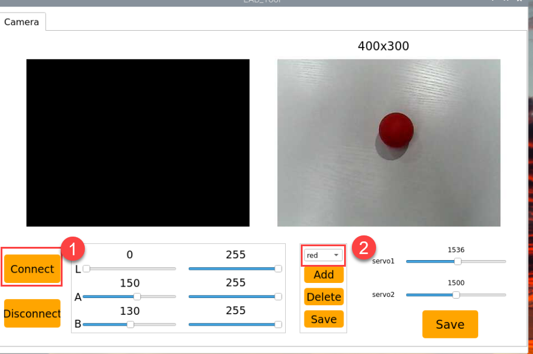
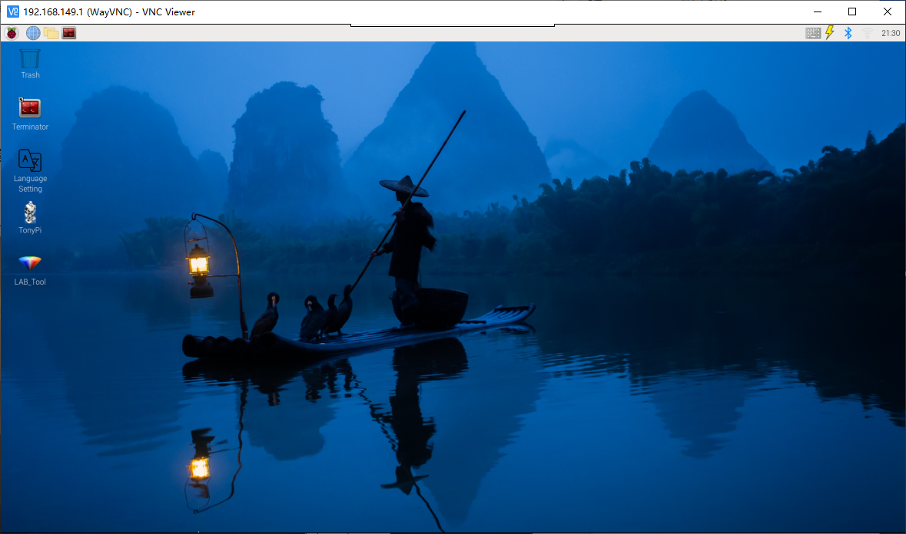

# 5. AI Vision Course

## 5.1 Single Color Recognition

### 5.1.1 Program Description

The implementation of color recognition consists of two parts: color detection and execution feedback after recognition.

First, for the color detection part, Gaussian filtering is applied to the image to reduce noise. The Lab color space is then used to convert the color of the object .

Next, the object's color within the circle is recognized using color thresholding, followed by masking (masking involves using selected images, shapes, or objects to globally or locally obscure the image being processed).

After performing morphological operations such as opening and closing on the object image, the object with the largest contour is circled.

**Opening**: The image undergoes erosion followed by dilation. This operation removes small objects, smooths shape boundaries, and preserves the area. It can eliminate small noise particles and separate connected objects.

**Closing**: The image undergoes dilation followed by erosion. This operation fills small holes within objects, connects nearby objects, closes broken contour lines, and smooths boundaries while preserving the area.

After recognition, the servo and buzzer are set up to provide feedback based on the detected color. For example, when red is detected, the buzzer will emit a sound.

For detailed feedback behavior, please refer to section 3. Function Implementation of this document.

### 5.1.2 Start and Close the Game

:::{Note}
The input command is case-sensitive, and keywords can be auto-completed using the Tab key.
:::

(1) Power on the device and, following the instructions in ["3. Remote Desktop Tool Installation and Connection->3.1 Remote Tool Installation and Connection"](), use the VNC remote connection tool to connect.

(2) Click the icon  in the top left corner of the system desktop to open the LX terminal.

(3) Execute the command to navigate to the directory where the program is located, then press Enter:

```
cd TonyPi/Functions
```

(4) Enter the command and press Enter to start the program:

```
python3 Color_Warning.py
```

(5) To close the program, simply press **"Ctrl+C"** in the LX terminal. If it does not close, press it multiple times.

### 5.1.3 Program Outcome

After starting the game, the camera will be used to detect colors. When a red ball is recognized, the buzzer will emit a beep sound, and the ball will be circled in the transmitted image, with **"Color: red"** printed.

:::{Note}
* During the recognition process, ensure the environment is well-lit to avoid inaccurate recognition due to poor lighting conditions.
* Ensure that no objects with similar or matching colors to the target are present in the background within the camera's visual range, as this may cause misrecognition.
* If color recognition is inaccurate, refer to the section ["5.1.5 Function Extensions"]() in this document to adjust the color threshold settings.

:::

### 5.1.4 Program Analysis

[Source Code]()

* **Import Function Library**

{lineno-start=3}
```python
import sys
import os
import cv2
import math
import time
import threading
import numpy as np

import hiwonder.Camera as Camera
import hiwonder.Misc as Misc
import hiwonder.ros_robot_controller_sdk as rrc
import hiwonder.yaml_handle as yaml_handle

# 初始化机器人底层驱动(initial robot underlying drivers)
board = rrc.Board()
```

| Imported Module | Purpose |
|----|----|
| `import sys` | Imports Python's sys module, used for accessing system-specific parameters and functions. |
| `import os` | Imports Python's os module, which provides functions for interacting with the operating system. |
| `import cv2` | Imports the OpenCV library, used for image processing and computer vision functionalities. |
| `import time` | Imports Python's time module, used for time-related operations such as delays. |
| `import threading` | Provides a multithreading environment for concurrent execution. |
| `import numpy as np` | Imports the NumPy library, an open-source numerical computation library for handling arrays and matrix operations. |
| `import hiwonder.Camera as Camera` | Imports the camera module from the Hiwonder library. |
| `import hiwonder.Misc as misc` | Imports the Misc module, used for processing detected rectangular data. |
| `import hiwonder.ros_robot_controller_sdk as rrc` | Imports the low-level robot control SDK for managing servos, motors, RGB lights, and other hardware. |
| `import hiwonder.yaml_handle as yaml_handle` | Contains functions and tools related to handling YAML-formatted files. |

(1) Import Libraries for OpenCV, Time, Math, and Threading

To use functions from a library, we can call them with the syntax:

**library_name.function_name(parameter1, parameter2, ...)**

{lineno-start=62}
```python
while True:
    if detect_color == 'red' and di_once:
        board.set_buzzer(1900, 0.1, 0.9, 1)  # 以1900Hz的频率，持续响0.1秒，关闭0.9秒，重复1次(at a frequency of 1900Hz, sound for 0.1 seconds, then pause for 0.9 seconds, repeat once)
        di_once = False
    elif not di_once and detect_color != 'red':
        di_once = True
    else:
        time.sleep(0.01)
```

For example, to call the **sleep** function from the **time** library, we use:

In Python, several libraries like **time**, **cv2**, and **math** are built-in and can be directly imported and used. You can also create your own libraries, like the **"yaml_handle"** file-reading library mentioned above.

(2) Instantiate a Library

Some library names can be long and hard to remember. To simplify function calls, we often instantiate libraries. For example:

{lineno-start=16}
```python
# 初始化机器人底层驱动(initial robot underlying drivers)
board = rrc.Board()
```

Once instantiated, functions from the **ros_robot_controller_sdk** library can be conveniently called using the format `rrc.function_name(parameter1, parameter2, ...)`.

{lineno-start=44}
```python
def load_config():
    global lab_data, servo_data
    
    lab_data = yaml_handle.get_yaml_data(yaml_handle.lab_file_path)
    servo_data = yaml_handle.get_yaml_data(yaml_handle.servo_file_path)
```

* **Main Function Analysis**

In a Python program, `__name__ == '__main__'` indicates the main function of the program, where the program starts by reading an image.

(1) Read Live Camera Feed

{lineno-start=156}
```python
while True:
    ret, img = my_camera.read()
    if img is not None:
        frame = img.copy()
        frame = cv2.remap(frame, mapx, mapy, cv2.INTER_LINEAR)  # 畸变矫正(distortion correction)
        Frame = run(frame)
        cv2.imshow('Frame', Frame)
        key = cv2.waitKey(1)
        if key == 27:
            break
    else:
        time.sleep(0.01)
```

(2) Start Image Processing

When an image is received, the **"run()"**function is called to process it.

{lineno-start=76}
```python
def run(img):
    global draw_color
    global color_list
    global detect_color
        
    img_copy = img.copy()
    img_h, img_w = img.shape[:2]
```

① The `img.copy()` function creates a duplicate of the img object and assigns it to frame.
② The **"run()"**function handles the image processing operations.

{lineno-start=161}
```python
Frame = run(frame)
```

(3) Resizing the Image. The image size is resized to facilitate processing.

{lineno-start=84}
```python
frame_resize = cv2.resize(img_copy, size, interpolation=cv2.INTER_NEAREST)
```

The first parameter `"img_copy"` is the input image.

The second parameter `size` specifies the output image size, which can be customized.

The third parameter `interpolation=cv2.INTER_NEAREST` defines the interpolation method.

`INTER_NEAREST`: Nearest-neighbor interpolation.
`INTER_LINEAR`: Bilinear interpolation (default if not specified).
`INTER_CUBIC`: Bicubic interpolation over a 4x4 pixel neighborhood.
`INTER_LANCZOS4`: Lanczos interpolation over an 8x8 pixel neighborhood.

(4) Gaussian Filtering

Images often contain noise, which can degrade quality and obscure important features. Depending on the type of noise, different filtering methods may be used, such as Gaussian filtering, median filtering, and mean filtering.

Gaussian filtering is a type of linear smoothing filter that is effective in reducing Gaussian noise. It is widely used in image denoising processes.

{lineno-start=85}
```python
frame_gb = cv2.GaussianBlur(frame_resize, (3, 3), 3)
```

The first parameter, `frame_resize`, is the input image.

The second parameter, `(3, 3)`, specifies the size of the Gaussian kernel.

The third parameter, `3`, represents the standard deviation of the Gaussian kernel in the X direction.

(5) Convert the Image to LAB Color Space

The `cv2.cvtColor()` function is used for color space conversion.

{lineno-start=86}
```python
frame_lab = cv2.cvtColor(frame_gb, cv2.COLOR_BGR2LAB)  # 将图像转换到LAB空间(convert the image to the LAB space)
```

The first parameter **"frame_gb"** is the input image.

The second parameter `cv2.COLOR_BGR2LAB` converts the image from BGR format to LAB format. To convert to RGB, use `cv2.COLOR_BGR2RGB`.

(6) Convert the Image to a Binary Image

The image is simplified by converting it to a binary image, containing only 0s and 1s, which reduces the data size and makes it easier to process. The `cv2.inRange()` function is used for thresholding.

{lineno-start=94}
```python
frame_mask = cv2.inRange(frame_lab,
                         (lab_data[i]['min'][0],
                          lab_data[i]['min'][1],
                          lab_data[i]['min'][2]),
                         (lab_data[i]['max'][0],
                          lab_data[i]['max'][1],
                          lab_data[i]['max'][2]))  #对原图像和掩模进行位运算(perform bitwise operation to original image and mask)
```

The first parameter `"frame_lab"` is the input image.

The second parameter `(lab_data[i]['min'][0], lab_data[i]['min'][1], lab_data[i]['min'][2])` specifies the lower color threshold.

The third parameter `(lab_data[i]['max'][0], lab_data[i]['max'][1], lab_data[i]['max'][2])` specifies the upper color threshold.

**Apply Morphological Operations (Opening and Closing)**

**To reduce interference and smooth the image, morphological operations are applied. Opening is erosion followed by dilation, and closing is dilation followed by erosion. The `cv2.morphologyEx()` function is used.**

{lineno-start=101}
```python
eroded = cv2.erode(frame_mask, cv2.getStructuringElement(cv2.MORPH_RECT, (3, 3)))  #腐蚀(corrosion)
dilated = cv2.dilate(eroded, cv2.getStructuringElement(cv2.MORPH_RECT, (3, 3))) #膨胀(dilation)
```

The first parameter is the input image.

The second parameter is the structuring element (also known as the kernel), which defines the nature of the operation. The size and shape of the kernel determine the extent of erosion or dilation.

(7) Find the Largest Contour

After completing the image processing, the largest contour is found using the `cv2.findContours()` function.

{lineno-start=103}
```python
contours = cv2.findContours(dilated, cv2.RETR_EXTERNAL, cv2.CHAIN_APPROX_NONE)[-2]  #找出轮廓(find out contours)
areaMaxContour, area_max = getAreaMaxContour(contours)  #找出最大轮廓(find out the contour with the maximal area)
```

The first parameter `"dilated"` is the input image.

The second parameter `cv2.RETR_EXTERNAL` specifies the contour retrieval mode.

The third parameter `cv2.CHAIN_APPROX_NONE)[-2]` specifies the contour approximation method.

The largest contour is selected, and a minimum area threshold is set to ensure the target contour is valid only if its area exceeds this value.

{lineno-start=29}
```python
# 找出面积最大的轮廓(find out the contour with the maximal area)
# 参数为要比较的轮廓的列表(parameter is the list to be compared)
def getAreaMaxContour(contours):
    contour_area_temp = 0
    contour_area_max = 0
    areaMaxContour = None

    for c in contours:  # 历遍所有轮廓(iterate through all contours)
        contour_area_temp = math.fabs(cv2.contourArea(c))  # 计算轮廓面积(calculate contour area)
        if contour_area_temp > contour_area_max:
            contour_area_max = contour_area_temp
            if contour_area_temp > 50:  # 只有在面积大于50时，最大面积的轮廓才是有效的，以过滤干扰(only contours with an area greater than 50 are considered valid; the contour with the largest area is used to filter out interference)
                areaMaxContour = c

    return areaMaxContour, contour_area_max  # 返回最大的轮廓(return the contour with the maximal area)
```

(8) Display the Result

{lineno-start=162}
```python
cv2.imshow('Frame', Frame)
key = cv2.waitKey(1)
```

The function `cv2.resize()` is used to scale the processed image to an appropriate size.

The function `cv2.imshow()` displays the image in a window. **'Frame'** is the name of the window, and `Frame` is the image content to be displayed. This function must be followed by `cv2.waitKey()`, otherwise the image will not appear.

The function `cv2.waitKey()` waits for a key press. The parameter 1 specifies the delay time in milliseconds.

* **Child Thread Analysis**

(1) Turn On RGB Light

The RGB light will match the color detected by the recognition system.

{lineno-start=118}
```python
if color_area_max == 'red':  #红色最大(red is the maximal area)
    detect_color = 'red'
    draw_color = range_rgb["red"]
elif color_area_max == 'green':  #绿色最大(green is the maximal area)
    detect_color = 'green'
    draw_color = range_rgb["green"]
elif color_area_max == 'blue':  #蓝色最大(blue is the maximal area)
    detect_color = 'blue'
    draw_color = range_rgb["blue"]
```

(2) Drive the Buzzer

{lineno-start=59}
```python
def buzzer():
    global di_once
    global detect_color
    while True:
        if detect_color == 'red' and di_once:
            board.set_buzzer(1900, 0.1, 0.9, 1)  # 以1900Hz的频率，持续响0.1秒，关闭0.9秒，重复1次(at a frequency of 1900Hz, sound for 0.1 seconds, then pause for 0.9 seconds, repeat once)
            di_once = False
        elif not di_once and detect_color != 'red':
            di_once = True
        else:
            time.sleep(0.01)
```

The **buzzer()** function controls the buzzer. Inside this function, `board.set_buzzer()` is used to turn the buzzer on and off at a frequency of 1900 Hz, sounding for 0.1 seconds and silent for 0.9 seconds, repeated once.

### 5.1.5 Function Extensions

* **Adjusting Color Thresholds**

If the color recognition performance is poor during the game experience, it may be necessary to adjust the color threshold. This section uses red as an example, and the same method can be applied to adjust other colors. Follow the steps below:

(1) Double-click , and in the popup interface, click **"Execute"**.


(2) Once in the interface, click **"Connect"** to link the camera.


(3) After a successful connection, select **"red"** from the color options in the lower-right corner of the interface.



(4) If the transmitted image does not appear in the popup window, the camera may not have connected successfully. Check that the camera's connection cable is properly plugged in.

In the interface shown below, the right side displays the real-time transmitted image, while the left side shows the color to be detected. Point the camera at the red ball, then adjust the six sliders at the bottom so that the red ball area on the left turns entirely white, and the other areas turn black. Afterward, click the **"Save"** button to save the settings.


* **Changing the Default Recognized Color**

The color recognition program is pre-configured to recognize three colors: red, green, and blue. By default, the program identifies red, triggering the buzzer to emit a beep and drawing a circle around the red ball in the transmitted image, displaying **"Color: red"**.

To change the recognized color to green, follow these steps:

(1) Enter the following command and press Enter to navigate to the source code directory:

```
cd TonyPi/Functions/
```

(2) Then, enter the following command and press Enter to open the program file:

```
vim Color_Warning.py
```

(3) Locate the code shown in the image below:


(4) Press the **"i"** key on the keyboard to enter edit mode.


(5) Replace **"red"** (highlighted in red in the image) with **"green"**, as shown in the image below:


(6) To save your changes, press the **"Esc"** key, then type **":wq"** (note the colon before **"wq"**) and press Enter to save and exit.


(7) Enter the following command and press Enter to start the color recognition functionality:

```
python3 Color_Warning.py
```

* **Add New Recognition Color**

In addition to the three built-in colors for recognition, you can also add custom colors. For example, to add purple as a new detectable color, follow these steps:

(1) **Double-click** the desktop icon on the system. When a prompt appears, simply click **"Execute"**.


(2) In the window that opens, click **"Connect"**.


(3) Click **"Add"**, name the new color (e.g., **"purple"**), then click **"OK"**.


(4) Use the dropdown menu next to the color selector and choose **"purple"**.


(5) Point the camera at a purple object. Adjust the **L**, **A**, and **B** sliders until the region representing the purple object turns **white** in the left preview window, and all other areas become **black**.


(6) Once satisfied, click **"Save"** to store the adjusted color threshold values.


(7) To verify whether the changes have been saved successfully, open the terminal and navigate to the program directory by entering:

```
cd TonyPi
```

(8) Then open the configuration file by typing:

```
vim lab_config.yaml
```

(9) Once the file is open, locate the section where color thresholds are defined. You should see the parameters for the newly added **purple** color.


(10) Following the earlier steps (1–4), open the file and press **"i"** to enter edit mode. Locate the section shown below, and manually add the following line (replace the values with the actual maximum threshold from step 9):

```
'purple':(255, 255, 114),
```


(11) Next, locate the section as shown in the figure (assumed visual reference).


(12) Manually add the contents shown in the highlighted area (assumed image reference).


(13) To save your changes, press **Esc**, then type **:wq** (note the colon before **"wq"**) and press **Enter** to save and exit.


(14) Refer back to **"2. Game Start and Stop Instructions"** to relaunch the program. Place a purple object in front of the camera—if successful, you'll see a purple bounding box around it in the video feed and the word **"purple"** printed in the terminal.

If you'd like to add more recognizable colors, simply repeat the above steps with the desired color.

## 5.2 Color Recognition

### 5.2.1 Program Logic

The robot recognizes colors and provides feedback on the recognition result through **"nodding"** or **"shaking"** its head.

The following is the overall process:

First, program TonyPi to recognize colors with Lab color space. 

Second, identify the object color in the circle using color threshold value, then apply a mask to that part of the image. Masking is the process of using selected images, graphics,

After processing the corrosion and inflation of the object image, the largest object contour is circled.

**Corrosion**: By iterating through each pixel of the image, check its overlap with the surrounding structural element. If all the overlapping pixel values are 1, then keep the original pixel value unchanged; otherwise, set it to 0. Mainly used to eliminate unimportant edge information in the image, reducing the area of the image.

**Inflation**: Similar to the inverse process of erosion. This process involves convolving the image with a structural element, calculate the maximum pixel value within the covered area, and assign this maximum value to the pixel specified by the reference point. The inflation expands the highlighted areas in an image gradually, typically used to fill holes or gaps in the image.

Next, judge the recognized color. If the sett color is detected the head servo will be turned up and down, otherwise it will be turned left and right.

### 5.2.2 Operation Steps

:::{Note}
Pay attention to the text format in the input of instructions.
:::

(1) Turn on robot and connect it to Raspberry Pi desktop with VNC. You can refer to ["3. Remote Desktop Tool Installation and Connection->3.1 Remote Tool Installation and Connection"]() to learn how to install and connect VNC.


(2) Double-click **"Terminator"** icon  in the Raspberry Pi desktop and open the command-line terminal.

(3) Input the following command and press Enter to locate to the directory where the program is stored.

```
cd TonyPi/Functions
```

(4) Input the command below, then press Enter to start the game.

```
python3 ColorDetect.py
```

(5) If you want to exit the game programming, press **"Ctrl+C"**. If the exit fails, please try it few more times.

### 5.2.3 Project Outcome

:::{Note}
The program defaults to recognizing the color red. To switch to blue or green, refer to ["5.2.5 Function Extension"]().
:::

Place the red ball in front of the TonyPi. The robot will **"nod"** upon recognition. Place the blue and green balls in front of the TonyPi. The robot will **"shake its head"** upon recognition.

### 5.2.4 Program Analysis

[Source Code]()

The source code of this program is locate in ["/home/pi/TonyPi/Functions/ColorDetect.py"]().

* **Import Parameter Module**

| **Import module** | **function** |
|----|----|
| `import sys` | The Python **"sys"** module has been imported for accessing system-related functions and variables. |
| `import os` | The Python **"os"** module has been imported, providing functions and methods for interacting with the operating system. |
| `import cv2` | The OpenCV library has been imported for image processing and computer vision-related functionalities. |
| `import time` | The Python **"time"** module has been imported for time-related functionalities, such as delay operations. |
| `import math` | The **"math"** module provides low-level access to mathematical operations, including many commonly used mathematical functions and constants. |
| `import threading` | Provides an environment for running multiple threads concurrently. |
| `import np` | The NumPy library has been imported. It is an open-source numerical computing extension for Python, used for handling array and matrix operations. |
| `import sensor.camera as camera` | Import camera library |
| `from common import misc` | The **"Misc"** module has been imported for handling recognized rectangular data. |
| `import common.ros_robot_controller_sdk as rrc` | The robot's low-level control library has been imported for controlling servos, motors, RGB lights, and other hardware. |
| `import common.yaml_handle` | Contains functionalities or tools related to processing YAML format files. |
| `from common.controller import Controller` | Import action group execution library |

* **Functional Logic**

The system captures image data through the camera and processes it by converting the image to a binary format. To reduce interference and smooth the image, erosion and dilation operations are applied.

Next, it identifies the contour with the largest area and calculates the minimum enclosing circle. Based on this, the system determines the color of the detected object and provides the corresponding response.

* **Logical Flow and Corresponding Code Analysis**

(1) Import function library

In this initialization step, the first task is to import the required libraries for subsequent program calls. For details on the imports, refer to [4.1 Import parameter module]().

{lineno-start=3}
```python
import sys
import os
import cv2
import math
import time
import threading
import numpy as np
import hiwonder.Camera as Camera
import hiwonder.Misc as Misc
import hiwonder.ros_robot_controller_sdk as rrc
from hiwonder.Controller import Controller
import hiwonder.ActionGroupControl as AGC
import hiwonder.yaml_handle as yaml_handle
```

(2) Set initial state

Set initial state, including the initial position of servo, PID, color threshold value, etc.

{lineno-start=67}
```python
# 加载配置文件数据(load configuration file data)
def load_config():
    global lab_data, servo_data
    
    lab_data = yaml_handle.get_yaml_data(yaml_handle.lab_file_path)
    servo_data = yaml_handle.get_yaml_data(yaml_handle.servo_file_path)
```

(3) Image pre-processing

Resizing and Gaussian blur processing of the image.

{lineno-start=193}
```python
frame_resize = cv2.resize(img_copy, size, interpolation=cv2.INTER_NEAREST)
frame_gb = cv2.GaussianBlur(frame_resize, (3, 3), 3)
frame_lab = cv2.cvtColor(frame_gb, cv2.COLOR_BGR2LAB)  # 将图像转换到LAB空间(convert the image to the LAB space)
```

`cv2.resize(img_copy, size, interpolation=cv2.INTER_NEAREST)` is an operation to resize the image.

The first parameter **"img_copy"** is the image to be resized.

The second parameter **"size"** is the target size.

The third parameter **"interpolation"** is the interpolation method, which is used to determine the pixel interpolation algorithm used for resizing.

`cv2.GaussianBlur(frame_resize, (3, 3), 3)` applies Gaussian blur to the image.

The first parameter **"frame_resize"** is the image to be blurred.

The second parameter **"(3, 3)"** is the size of the Gaussian kernel, indicating that the width and height of the kernel are both 3.

The third parameter **"3"** is the standard deviation of the Gaussian kernel, used to control the degree of blur.

(4) Color space conversion

Convert the BGR image to LAB image.

{lineno-start=195}
```python
frame_lab = cv2.cvtColor(frame_gb, cv2.COLOR_BGR2LAB)  # 将图像转换到LAB空间(convert the image to the LAB space)
```

(5) Binarization processing

Use **inRange()** function in cv2 library to process binarization.

{lineno-start=204}
```python
frame_mask = cv2.inRange(frame_lab,
                         (lab_data[i]['min'][0],
                          lab_data[i]['min'][1],
                          lab_data[i]['min'][2]),
                         (lab_data[i]['max'][0],
                          lab_data[i]['max'][1],
                          lab_data[i]['max'][2]))  #对原图像和掩模进行位运算(perform bitwise operation to original image and mask)
```

The first parameter **"frame_lab"** is inputting image.

The second parameter `lab_data[i]['min'][0]` is the lower limit of the threshold.

The third parameter `lab_data[i]['max'][0]` is the upper limit of the threshold.

(6) Corrosion and inflation

{lineno-start=211}
```python
eroded = cv2.erode(frame_mask, cv2.getStructuringElement(cv2.MORPH_RECT, (3, 3)))  #腐蚀(corrosion)
dilated = cv2.dilate(eroded, cv2.getStructuringElement(cv2.MORPH_RECT, (3, 3))) #膨胀(dilation)
```

`eroded = cv2.erode(frame_mask, cv2.getStructuringElement(cv2.MORPH_RECT, (3, 3)))` is the operation to perform corrosion on the binary image.

The first parameter **"frame_mask"** is the binary image on which morphological operations are to be performed.

The second parameter `cv2.getStructuringElement(cv2.MORPH_RECT, (3, 3))` is the structuring element for the corrosion operation. A rectangular structuring element of size (3, 3) is used here.

The dilation function follows the same principle.

(7) Get the contour with the largest area

After completing the above image processing, it is necessary to obtain the contours of the recognized targets. This involves using the `findContours()` function from the cv2 library.

{lineno-start=215}
```python
contours = cv2.findContours(dilated, cv2.RETR_EXTERNAL, cv2.CHAIN_APPROX_NONE)[-2]  #找出轮廓(find out contours)
areaMaxContour, area_max = getAreaMaxContour(contours)  #找出最大轮廓(find out the contour with the maximal area)
```

Take code `contours = cv2.findContours(dilated, cv2.RETR_EXTERNAL, cv2.CHAIN_APPROX_NONE)[-2]` as example:

The first parameter **"dilated"** is inputting image.

The second parameter `cv2.RETR_EXTERNAL` is the contour retrieval mode.

The third parameter `cv2.CHAIN_APPROX_NONE)[-2]` is the contour approximation method.

Find the contour with the largest area in the obtained contour. In order to avoid interference, you need to set a minimum value. The target contour is considered valid only if its area is greater than this value.

{lineno-start=46}
```python
# 找出面积最大的轮廓(find the contour with the maximal area)
# 参数为要比较的轮廓的列表(parameter is the list of contour to be compared)
def getAreaMaxContour(contours):
    contour_area_temp = 0
    contour_area_max = 0
    areaMaxContour = None

    for c in contours:  # 历遍所有轮廓(iterate through all contours)
        contour_area_temp = math.fabs(cv2.contourArea(c))  # 计算轮廓面积(calculate contour area)
        if contour_area_temp > contour_area_max:
            contour_area_max = contour_area_temp
            if contour_area_temp > 50:  # 只有在面积大于50时，最大面积的轮廓才是有效的，以过滤干扰(only contours with an area greater than 50 are considered valid; the contour with the largest area is used to filter out interference)
                areaMaxContour = c

    return areaMaxContour, contour_area_max  # 返回最大的轮廓(return the contour with the maximal area)
```

(8) Determine the largest color block

Determine the color of the largest area contour and add the result to the **color_list**.

{lineno-start=229}
```python
if color_area_max == 'red':  #红色最大(red is the maximal area)
    color = 1
elif color_area_max == 'green':  #绿色最大(green is the maximal area)
    color = 2
elif color_area_max == 'blue':  #蓝色最大(blue is the maximal area)
    color = 3
else:
    color = 0
color_list.append(color)
```

(9) Multiple judgments

Take the average by multiple judgments, and determine the recognized color.

{lineno-start=239}
```python
if len(color_list) == 3:  #多次判断(multiple judgement)
    # 取平均值(take average value)
    color = int(round(np.mean(np.array(color_list))))
    color_list = []
    if color == 1:
        detect_color = 'red'
        draw_color = range_rgb["red"]
    elif color == 2:
        detect_color = 'green'
        draw_color = range_rgb["green"]
    elif color == 3:
        detect_color = 'blue'
        draw_color = range_rgb["blue"]
    else:
        detect_color = 'None'
        draw_color = range_rgb["black"]
```

(10) Print recognized outcome

Use the `cv2.putText()` function from the cv2 library to draw text on the image.

{lineno-start=259}
```python
cv2.putText(img, "Color: " + detect_color, (10, img.shape[0] - 10), cv2.FONT_HERSHEY_SIMPLEX, 0.65, draw_color, 2)
```

Take code `cv2.putText(img, "Color: " + detect_color, (10, img.shape[0] - 10), cv2.FONT_HERSHEY_SIMPLEX, 0.65, draw_color, 2)` as example:

The first parameter **"img"** is the image being drawn.

The second parameter `'Color: ' + detect_color` is the information drawn on the image.

The third parameter `(10, img.shape[0] - 10)` is the starting coordinate of the text, i.e., the position of the bottom-left corner of the text. Here, the text is 10 pixels away from the left and bottom edges of the image, respectively.

The fourth parameter `cv2.FONT_HERSHEY_SIMPLEX` is the font type.

The fifth parameter **"0.65"** is the size scaling factor for the text.

The sixth parameter **"draw_color"** is the color of the text.

The seventh parameter **"2"** is the thickness of the text.

(11) Color recognition

① After recognizing the red ball, control robot servo 1 to make the robot nod twice continuously, then return to the neutral position as pictured:

{lineno-start=136}
```python
if detect_color == 'red':
    ctl.set_pwm_servo_pulse(1, 1800, 200)
    time.sleep(0.2)
    ctl.set_pwm_servo_pulse(1, 1200, 200)
    time.sleep(0.2)
    ctl.set_pwm_servo_pulse(1, 1800, 200)
    time.sleep(0.2)
    ctl.set_pwm_servo_pulse(1, 1200, 200)
    time.sleep(0.2)
    ctl.set_pwm_servo_pulse(1, 1500, 100)
    time.sleep(0.1)
```

Take code "**ctl.set_pwm_servo_pulse(1, 1800, 200)**" as example:

The first parameter **"1"** indicates the servo ID being controlled.

The second parameter **"1800"** represents the pulse width for servo ID 1. 1500 controls the servo to return to the neutral position.

The third parameter **"200"** represents the servo's movement time, which is 200 milliseconds.

② After recognizing the green or blue ball, control robot servo 2 to make the robot shake its head twice continuously, then return to the neutral position, as shown in the following figure.

{lineno-start=152}
```python
elif detect_color == 'green' or detect_color == 'blue':
    ctl.set_pwm_servo_pulse(2, 1800, 200)
    time.sleep(0.2)
    ctl.set_pwm_servo_pulse(2, 1200, 200)
    time.sleep(0.2)
    ctl.set_pwm_servo_pulse(2, 1800, 200)
    time.sleep(0.2)
    ctl.set_pwm_servo_pulse(2, 1200, 200)
    time.sleep(0.2)
    ctl.set_pwm_servo_pulse(2, 1500, 100)
    time.sleep(0.1)
```

### 5.2.5 Function Extension

* **Modify Default Recognition Color**

Red, green and blue are the built-in colors in the color recognition program and the red is the default color. Then the robot will perform **"nod"**.

In the following steps, we're going to modify the recognized color as green.

(1) Enter the following command to the directory where the game program is located.

```
cd TonyPi/Functions
```

(2) Enter command  to go into the game program through vim editor.

```
vim ColorDetect.py
```

(3) Find codes `if detect_color == 'red':` and `elif detect_color == 'green' or detect_color == 'blue':`.


:::{Note}
After entering the code position number on the keyboard, press **"Shift+G"** to directly locate to the corresponding location. This section aims to introduce quick location methods, so the code position number is for reference only. Please rely on actual positions.
:::

(4) Press **"i"** to enter the editing mode, then modify red in `if detect_color == 'red'` to green. And modify red in line 152 `elif detect_color== 'green' or detect_color == 'blue'` to green. If you want to recognize blue, please revise to **"blue"**.


(5) Press **"Esc"** to enter last line command mode. Input **":wq"** to save the file and exit the editor.


* **Add Recognized Color**

In addition to the built-in recognized colors, you can set other recognized colors in the programming. Take orange as example:

(1) Open VNC, and run the following command to navigate to the directory where the program file is stored.

```
cd TonyPi
```

(2) Input the following command to open Lab color setting document.

```
vim lab_config.yaml
```

It is recommended to use screenshot to record the initial value.


(3) Click the debugging tool icon in the system desktop. Choose **"Execute"** in the pop-up window.


(4) Click **"Connect"** button in the lower left hand. When the interface display the camera returned image, the connection is successful. Select **"red"** in the right box first.


(5) Drag the corresponding sliders of L, A, and B until the color area to be recognized in the left screen becomes white and other areas become black. Drag the corresponding sliders of L, A, and B until the color area to be recognized in the left screen becomes white and other colors become black.

For example, if you want to recognize orange, you can put the orange ball in the camera's field of view. Adjust the corresponding sliders of L, A, and B until the orange part of the left screen becomes white and other colors become black, and then click **" Save"** button to keep the modified data.


(6) After the modification is completed, check whether the modified data was successfully written in. Enter the following command again to check the color setting parameters.

```
vim TonyPi/lab_config.yaml
```


For the game's performance, it's recommended to use the LAB_Tool tool to modify the value back to the initial value after the modification is completed.

(7) Check the data in red frame. If the edited value was written in the program, press **"Esc"** and enter **":wq"** to save it and exit.

(8) Start the game again and put the orange ball in front of the camera. TonyPi will perform **"nod"**.

(9) If you want to add other colors as recognized color, please operate as the above steps.

## 5.3 Color Position Recognition

### 5.3.1 Feature Overview

In this lesson, the system uses a camera to recognize red, green, and blue balls. The detected objects are highlighted in the video feed, with their X and Y coordinates displayed in real time.

The **Color Position Recognition** feature consists of two key components: **color detection** and **position marking**.

* **Color Detection**

To begin, Gaussian filtering is applied to reduce image noise and enhance clarity. The image is then converted to the **Lab color space**, which enables more accurate and consistent color recognition.  
(For more information on Lab color space, please refer to ["8. OpenCV Basic Course"]())

Next, using predefined color thresholds, the system identifies the color of the object within the target area. A **mask** is applied to isolate the relevant regions of the image—masking allows for global or local filtering based on the defined object.

Morphological operations, including **opening** and **closing**, are performed to refine the detection:

- **Opening** (erosion followed by dilation): Helps eliminate small noise, smooth the contours of shapes, and separate connected objects without changing their size.

- **Closing** (dilation followed by erosion): Fills small holes within objects, connects nearby elements, and smooths contours while preserving object integrity.

Finally, the object with the largest contour is identified and outlined with a circle.

* **Position Marking**

To determine the position of the detected object, a dedicated detection algorithm is used. This algorithm locates areas in the image that match predefined features or patterns and returns their coordinates along with bounding boxes.

### 5.3.2 Operation Steps

:::{Note}
Pay attention to the text format in the input of instructions.
:::

(1) Turn on robot and connect it to Raspberry Pi desktop with VNC. You can refer to ["3. Remote Desktop Tool Installation and Connection->3.1 Remote Tool Installation and Connection"]() to learn how to install and connect VNC.


(2) Double-click **"Terminator"** icon  in the Raspberry Pi desktop and open the command-line terminal.

(3) Input the following command and press Enter to locate to the directory where the program is stored.

```
cd TonyPi/Functions
```

(4) Input the command below, then press Enter to start the game.

```
python3 Color_Recognize.py
```

(5) If you want to exit the game programming, press **"Ctrl+C"**. If the exit fails, please try it few more times.

### 5.3.3 Project Outcome

By default, the program is configured to detect red, green, and blue balls. Once recognized, the detected object will be circled in the video feed, and its X and Y coordinates will be displayed in the bottom-left corner of the screen.

**Important Notes:**

:::{Note}
* Ensure sufficient lighting during operation to improve recognition accuracy. Inadequate lighting may result in detection errors.
* Avoid placing objects with colors similar to the target colors in the background within the camera's field of view, as this may cause false detections.
* If color detection is inaccurate, please refer to **Section 5: Function Extensions → 5.1 Color Threshold Adjustment** for instructions on adjusting the color thresholds.

:::

### 5.3.4 Program Analysis

[Source Code]()

**The source code of this program is locate in** [/home/pi/TonyPi/Functions/Color_Recognition.py]()

* **Import Function Library**

{lineno-start=1}
```python
import sys
import os
import cv2
import math
import time
import numpy as np

import hiwonder.Camera as Camera
import hiwonder.Misc as Misc
import hiwonder.yaml_handle as yaml_handle
```

| **Import module** | **function** |
|----|----|
| `import sys` | The Python **"sys"** module has been imported for accessing system-related functions and variables. |
| `import os` | The Python **"os"** module has been imported, providing functions and methods for interacting with the operating system. |
| `import cv2` | The OpenCV library has been imported for image processing and computer vision-related functionalities. |
| `import time` | The Python **"time"** module has been imported for time-related functionalities, such as delay operations. |
| `import numpy as np` | Imports the NumPy library, an open-source numerical computing library in Python used for array and matrix operations. |
| `import hiwonder.Misc as misc` | Imports the Misc module, used for processing detected rectangle data. |
| `import hiwonder.Camera as Camera` | Imports the camera module. |
| `import hiwonder.yaml_handle as yaml_handle` | Imports functions and tools for handling YAML format files. |

(1) To begin, import the necessary libraries such as OpenCV, time, math, threading, etc. 
If you want to use a function from a specific library, you can call it using the format: 
**LibraryName.FunctionName(parameters)** 
For example:

{lineno-start=12}
```python
range_rgb = {
    'red': (0, 0, 255),
    'green': (0, 255, 0),
    'blue': (255, 0, 0),   # 注意：OpenCV中BGR，蓝色通道在开头
}
```

This calls the **sleep()** function from the time library, which is used to create a delay.

Python provides a number of built-in libraries like **time**, **cv2**, and **math**, which can be imported and used directly. You can also create and use your own custom libraries, such as `yaml_handle` for reading YAML files.

(2) Instantiating Libraries for Simpler Use

Some library names can be long and difficult to remember. To simplify function calls, it's common to instantiate the library using an alias. For example:

{lineno-start=31}
```python
def load_config():
    global lab_data
    lab_data = yaml_handle.get_yaml_data(yaml_handle.lab_file_path)
```

After instantiation, you can call functions from the Misc module using a shorter, more convenient format such as: `Misc.function_name(parameters)`

This makes the code cleaner and easier to write.

* **Main Function Analysis**

In a Python program, the condition `__name__ == '__main__'` indicates the main entry point of the program.

The program starts by initializing the camera and reading the video stream. The `read()` method is used to capture each frame from the video. It then processes each frame to detect and highlight the colored balls, displaying the results in real time.

By continuously reading and displaying frames in a loop, the program achieves live video playback. Once the video processing is complete, the `release()` function is called to free up the camera and related system resources.

{lineno-start=97}
```python
while True:
    ret, img = my_camera.read()
    if img is not None:
        frame = img.copy()
        frame = cv2.remap(frame, mapx, mapy, cv2.INTER_LINEAR)
        Frame = run(frame)
        cv2.imshow('Frame', Frame)
        key = cv2.waitKey(1)
        if key == 27:
            break
    else:
        time.sleep(0.01)
```

(1) Read Live Camera Feed

{lineno-start=98}
```python
ret, img = my_camera.read()
```

After the game starts, the program will read the live camera feed first.

(2) Process Image

Invoke the **"run()"** function for image processing.

{lineno-start=102}
```python
Frame = run(frame)
```

(3) Image Resizing

{lineno-start=40}
```python
frame_resize = cv2.resize(img_copy, size, interpolation=cv2.INTER_NEAREST)
```

**First parameter**: `img_copy` – the input image.

**Second parameter**: `size` – the desired output size of the image, which can be customized as needed.

**Third parameter**: `interpolation=cv2.INTER_NEAREST` – the interpolation method used during resizing. Common interpolation options include:

- `INTER_NEAREST`: Nearest-neighbor interpolation
- `INTER_LINEAR`: Bilinear interpolation (used by default if no method is specified)
- `INTER_CUBIC`: Bicubic interpolation using a 4×4 pixel neighborhood
- `INTER_LANCZOS4`: Lanczos interpolation using an 8×8 pixel neighborhood

(4) Gaussian Blur

Images often contain noise that can reduce visual quality and obscure important features. Depending on the type of noise, different filtering methods can be applied, such as Gaussian blur, median blur, or mean blur.

Gaussian blur is a linear smoothing filter used to reduce Gaussian noise. It is widely applied in image preprocessing for noise reduction.

{lineno-start=41}
```python
frame_gb = cv2.GaussianBlur(frame_resize, (3, 3), 3)
```

**First parameter**: `frame_resize` – the input image.

**Second parameter**: `(3, 3)` – the size of the Gaussian kernel.

**Third parameter**: `3` – the standard deviation of the Gaussian kernel in the X direction.

(5) Color space conversion

The function `cv2.cvtColor()` is used to convert an image from one color space to another.

{lineno-start=42}
```python
frame_lab = cv2.cvtColor(frame_gb, cv2.COLOR_BGR2LAB)
```

**First parameter**: `frame_gb` – the input image.

**Second parameter**: `cv2.COLOR_BGR2LAB` – the conversion code. In this case, it converts the image from BGR color space to LAB color space. If you need to convert to RGB instead, you can use `cv2.COLOR_BGR2RGB`.

(6) To simplify image processing and reduce data volume, the image is converted into a binary image—consisting only of 0s and 1s. This makes further processing more efficient. The `cv2.inRange()` function from OpenCV is used for this binarization process.

{lineno-start=55}
```python
frame_mask = cv2.inRange(frame_lab, min_lab, max_lab)
```

**First parameter**: `frame_lab` – the input image in LAB color space.

**Second parameter**: `min_lab` – the lower threshold for the LAB color range.

**Third parameter**: `max_lab` – the upper threshold for the LAB color range.

To reduce noise and make the binary image smoother, morphological operations such as **erosion** and **dilation** are applied:

- **Erosion**: Shrinks the foreground objects in the image, helping to remove small noise or separate closely connected objects.

- **Dilation**: Expands the foreground objects, useful for filling small holes and gaps within objects or reconnecting broken parts.

These operations are essential steps in refining the results of image segmentation.

{lineno-start=56}
```python
eroded = cv2.erode(frame_mask, cv2.getStructuringElement(cv2.MORPH_RECT, (3, 3)))
dilated = cv2.dilate(eroded, cv2.getStructuringElement(cv2.MORPH_RECT, (3, 3)))
```

(7) Extracting the Largest Contour

After completing the image processing steps, you need to obtain the contours of the detected targets. This is done using OpenCV's `cv2.findContours()` function.

{lineno-start=58}
```python
contours = cv2.findContours(dilated, cv2.RETR_EXTERNAL, cv2.CHAIN_APPROX_NONE)[-2]
```

**First parameter:** `dilated` — the input image (typically after dilation).

**Second parameter:** `cv2.RETR_EXTERNAL` — contour retrieval mode, which retrieves only the external contours.

**Third parameter:** `cv2.CHAIN_APPROX_NONE)[-2]` — contour approximation method, which stores all the contour points.

From the detected contours, the one with the largest area is selected. To avoid interference from noise or small objects, a threshold area value is set, and only contours with an area larger than this threshold are considered valid targets.

{lineno-start=60}
```python
areaMaxContour, area_max = getAreaMaxContour(contours)
if areaMaxContour is not None and area_max > 200:
    ((centerX, centerY), radius) = cv2.minEnclosingCircle(areaMaxContour)
    centerX = int(Misc.map(centerX, 0, size[0], 0, img_w))
    centerY = int(Misc.map(centerY, 0, size[1], 0, img_h))
    radius = int(Misc.map(radius, 0, size[0], 0, img_w))
```

(8) Obtaining Position Information

To display text information on the image, the OpenCV function `cv2.putText()` is used.

{lineno-start=70}
```python
cv2.putText(img, "Color: " + color, (centerX - 30, centerY - 10), cv2.FONT_HERSHEY_SIMPLEX, 0.5, draw_color, 2)
cv2.putText(img, f"Pos:({centerX},{centerY})", (centerX - 30, centerY + 15), cv2.FONT_HERSHEY_SIMPLEX, 0.5, draw_color, 2)
```

First parameter: `img` — the input image.

Second parameter: `"Color: " + color` — the text content to be drawn.

Third parameter: `(centerX - 30, centerY - 10)` — the starting coordinates of the text on the image, representing the bottom-left corner of the text (x, y).

Fourth parameter: `cv2.FONT_HERSHEY_SIMPLEX` — specifies the font type (simple font).

Fifth parameter: `0.5` — font scale factor, reducing the default font size to 50%.

Sixth parameter: `draw_color` — the color of the text.

Seventh parameter: `2` — thickness of the text stroke.

(9) Display the Live Camera Feed

{lineno-start=103}
```python
cv2.imshow('Frame', Frame)
key = cv2.waitKey(1)
```

The function `cv2.imshow()` is used to display an image in a window. Here, **"Frame"** is the window name, and frame is the image content to be shown. It is essential to follow this with `cv2.waitKey()`, otherwise the image will not be displayed.

The function `cv2.waitKey()` waits for a key press, where the parameter 1 specifies the delay time in milliseconds.

### 5.3.5 Function Extension

* **Adjusting Color Thresholds**

If the color recognition performance is poor during the game experience, it may be necessary to adjust the color threshold. This section uses red as an example, and the same method can be applied to adjust other colors. Follow the steps below:

(1) Double-click , and in the popup interface, click **"Execute"**.


(2) Once in the interface, click **"Connect"** to link the camera.


(3) After a successful connection, select **"red"** from the color options in the lower-right corner of the interface.


(4) If the transmitted image does not appear in the popup window, the camera may not have connected successfully. Check that the camera's connection cable is properly plugged in.

In the interface shown below, the right side displays the real-time transmitted image, while the left side shows the color to be detected. Point the camera at the red ball, then adjust the six sliders at the bottom so that the red ball area on the left turns entirely white, and the other areas turn black. Afterward, click the **"Save"** button to save the settings.


* **Changing the Default Recognized Color**

In addition to the three built-in recognizable colors, we can also add other colors for recognition. For example, using purple as a new recognizable color, the specific modification steps are as follows:

(1) Double-click  and choose **'Execute'** in the prompt box.


(2) In the pop-up interface, select **"Connect"** step by step.


(3) Click **"Add,"** then name the new color (using **"purple"** as an example here), and click **"OK"**.


(4) Next, click the dropdown arrow in the color selection box and choose **"purple"**.


(5) Point the camera at a purple object, then adjust the L, A, and B sliders until the target color area in the left preview turns white while the other areas turn black.


(6) Finally, click **"Save"** to save the adjusted color threshold values.


(7) After making changes, verify whether the new values have been saved by entering the following command and pressing Enter to navigate to the program directory:

```
cd TonyPi
```

(8) Then enter the command below and press Enter to open the configuration file:

```
vim lab_config.yaml
```

(9) After opening the color threshold configuration file, you can view the purple color threshold parameters.


(10) Type **":q"** and press Enter to exit the file.


(11) Enter the command below to navigate to the gameplay directory:

```
cd Functions
```

(12) Then enter the following command to open the program file and press Enter:

```
vim Color_Recognition.py
```

(13) Locate the code section as shown in the reference image.


(14) Press the **"i"** key to enter edit mode.


(15) Manually add the following line:

Here, (255, 255, 114) corresponds to the max purple threshold value checked in step 9.

```
'purple':(255, 255, 114),
```


(16) Save your changes by pressing the **"Esc"** key, then type `:wq` (note the colon before wq) and press Enter to save and exit.


(17) If you want to add other colors as recognizable colors, you can follow the same steps above.

## 5.4 Color Tracking

### 5.4.1 Program Logic

The robot can recognize colors and move according to the movement of the target color.

First, the system identifies the color using the Lab color space. The RGB color space is converted to Lab, followed by binarization. After applying dilation and erosion operations, the image retains only the contour of the target color, which is then outlined with a circle to complete the color recognition process.

Next, a traversal algorithm compares all correctly identified color objects and selects the one with the largest contour area as the target.

Finally, the gimbal is activated to perform real-time tracking, completing the color recognition and following functionality.

### 5.4.2 Operation Steps

:::{Note}
Pay attention to the text format in the input of instructions.
:::

(1) Turn on robot and connect it to Raspberry Pi desktop with VNC. You can refer to ["3. AI Vision Application Course->Lesson 1 Set Development Environment"]() to learn how to install and connect VNC.

(2) Double-click **"Terminator"** icon  in the Raspberry Pi desktop and open command line.

(3) Input the following command and press Enter to locate to the directory where the program is stored.

```
cd TonyPi/Functions
```

(4) Input the command below, then press Enter to start the game.

```
python3 ColorTrack.py
```

(5) If you want to exit the game programming, press **"Ctrl+C"**. If the exit fails, please try it few more times.

### 5.4.3 Project Outcome

Once the program is running, hold a red foam block or another colored object. When the video feed appears with the detection frame, use the left mouse button to click on the desired color block. The system will automatically highlight the selected color. Place the object on a movable platform and move it slowly — the TonyPi robot will track and follow the movement of the selected color.

### 5.4.4 Program Analysis

[Source Code]()

**The source code of this program is locate in ["/home/pi/TonyPi/Functions/ColorTrack.py"]().**

* **Import Parameter Module**

{lineno-start=3}
```python
import sys
import os
import cv2
import math
import time
import threading
import numpy as np

import hiwonder.PID as PID
import hiwonder.Misc as Misc
import hiwonder.Camera as Camera
import hiwonder.ros_robot_controller_sdk as rrc
from hiwonder.Controller import Controller
import hiwonder.ActionGroupControl as AGC
import hiwonder.yaml_handle as yaml_handle
from hiwonder.common import ColorPicker
```

| **Import module** | **function** |
|----|----|
| `import sys` | The Python **"sys"** module has been imported for accessing system-related functions and variables. |
| `import os` | The Python **"os"** module has been imported, providing functions and methods for interacting with the operating system. |
| `import cv2` | The OpenCV library has been imported for image processing and computer vision-related functionalities |
| `import time` | The Python **"time"** module has been imported for time-related functionalities, such as delay operations. |
| `import math` | The **"math"** module provides low-level access to mathematical operations, including many commonly used mathematical functions and constants. |
| `import threading` | Provides an environment for running multiple threads concurrently. |
| `import np` | The NumPy library has been imported. It is an open-source numerical computing extension for Python, used for handling array and matrix operations. |
| `import sensor.camera as camera` | Import camera library |
| `from common import misc` | The **"Misc"** module has been imported for handling recognized rectangular data. |
| `import common.ros_robot_controller_sdk as rrc` | The robot's underlying control library has been imported for controlling servos, motors, RGB lights, and other hardware. |
| `import common.yaml_handle` | Contains functionalities or tools related to processing YAML format files. |
| `from common.controller import Controller` | Import action group execution library |

* **Contour Processing**

{lineno-start=40}
```python
# 找出面积最大的轮廓(find the contour with the maximal area)
# 参数为要比较的轮廓的列表(parameter is the list of contour to be compared)
def getAreaMaxContour(contours):
    contour_area_temp = 0
    contour_area_max = 0
    areaMaxContour = None

    for c in contours:  # 历遍所有轮廓(iterate through all the contours)
        contour_area_temp = math.fabs(cv2.contourArea(c))  # 计算轮廓面积(calculate contour area)
        if contour_area_temp > contour_area_max:
            contour_area_max = contour_area_temp
            if contour_area_temp > 10:  # 只有在面积大于300时，最大面积的轮廓才是有效的，以过滤干扰(only contours with an area greater than 300 are considered valid; the contour with the largest area is used to filter out interference)
                areaMaxContour = c

    return areaMaxContour, contour_area_max  # 返回最大的轮廓(return the contour with the maximal area)
```

The `getAreaMaxContour` function is defined to iterate through the list of contours, calculate the area of each, and return the one with the largest area greater than 10.

* **Image Frame Processing**

{lineno-start=148}
```python
def run(img):
    global x_dis, y_dis, target_color
    global img_w, img_h
    global color_picker

    display_image = img.copy()
    img_h, img_w = img.shape[:2]
    
    if not enter:
        return display_image
```

The `run` function is defined to take an image (`img`) as input. It first performs operations such as image duplication and dimension retrieval. Under certain conditions, the image is processed using `color_picker`. If a target color is specified, the image undergoes resizing, Gaussian blurring, and conversion to the LAB color space. After determining the color range, bitwise operations and morphological processing (erosion and dilation) are applied to extract contours. The largest contour is then identified, and the minimum enclosing circle is calculated if a valid contour is found.

* **Robot Movement Logic**

{lineno-start=194}
```python
if abs(centerX - img_w/2.0) < 20: # 移动幅度比较小，则不需要动(if the movement amplitude is small, then no need to move)
    centerX = img_w/2.0

x_pid.SetPoint = img_w/2 #设定(set)
x_pid.update(centerX) #当前(current)
dx = int(x_pid.output)
use_time = abs(dx*0.00025)
x_dis += dx #输出(output)

x_dis = 500 if x_dis < 500 else x_dis
x_dis = 2500 if x_dis > 2500 else x_dis
```

Based on the relationship between the target's center position (`centerX`, `centerY`) and the image dimensions (`img_w`, `img_h`), the function determines the offset of the target within the image. If the offset is within a defined threshold, no movement is required. Otherwise, a PID controller is used to calculate and update the displacement values `x_dis` and `y_dis`. Finally, the processed `display_image`, along with `x_dis` and `y_dis`, are returned.

## 5.5 Auto Shooting

### 5.5.1 Program Logic

:::{Note}
please use the assorted balls for operation. If you have your own balls, we recommend using one with a diameter of 3cm.
:::

Place the red ball in the area recognized by the robot's camera. The robot will adjust its position according to the ball's location, and then kick the ball away.

Below are the details:

First, program TonyPi to recognize colors with Lab color space.

Second, identify the object color in the circle using color threshold value, then apply a mask to that part of the image. Masking is the process of using selected images, graphics, or objects to globally or locally obscure parts of the processed image.

After the opening and closing operations on the object image, the largest object contour is circled.

**Corrosion**: By iterating through each pixel of the image, check its overlap with the surrounding structural element. If all the overlapping pixel values are 1, then keep the original pixel value unchanged; otherwise, set it to 0. Mainly used to eliminate unimportant edge information in the image, reducing the area of the image.

**Inflation**: Similar to the inverse process of erosion. This process involves convolving the image with a structural element, calculate the maximum pixel value within the covered area, and assign this maximum value to the pixel specified by the reference point. The inflation expands the highlighted areas in an image gradually, typically used to fill holes or gaps in the image.

Then, judge whether the object is in the central position after receiving the image feedback. If yes, call TonyPi to move forward to the target until it reaches the set range, and then execute the shooting action; otherwise, the robot will move left or right to the center of the target first.

### 5.5.2 Operation Steps

:::{Note}
Command input must strictly distinguish between uppercase and lowercase letters and spaces.
:::

(1) Turn on robot and connect it to Raspberry Pi desktop with VNC. You can refer to ["3. Remote Desktop Tool Installation and Connection->3.1 Remote Tool Installation and Connection"]() to learn how to install and connect VNC.

(2) Double-click **"Terminator"** icon  in the Raspberry Pi desktop and open the command-line terminal.

(3) Input the following command and press Enter to locate to the directory where the program is stored.

```
cd TonyPi/Functions
```

(4) Input the command below, then press Enter to start the game.

```
python3 KickBall.py
```

(5) If you want to exit the game programming, press **"Ctrl+C"**. If the exit fails, please try it few more times.

### 5.5.3 Project Outcome

:::{Note}
Please use the robot and ball on the flat surface.
:::

Place the red ball in front of the TonyPi. After recognition, the robot will adjust its position to close the ball and kick it forward.


### 5.5.4 Program Analysis

[Source Code]()

The source code of this program is locate in ["/home/pi/TonyPi/Functions/KickBall.py"]().

* **Import Parameter Module**

{lineno-start=3}
```python
import sys
import os
import cv2
import time
import math
import threading
import numpy as np

import hiwonder.PID as PID
import hiwonder.Misc as Misc
import hiwonder.Camera as Camera
import hiwonder.ros_robot_controller_sdk as rrc
from hiwonder.Controller import Controller
import hiwonder.ActionGroupControl as AGC
import hiwonder.yaml_handle as yaml_handle
from hiwonder.common import ColorPicker
```

| **Import module** | **function** |
|----|----|
| `import sys` | The Python **"sys"** module has been imported for accessing system-related functions and variables. |
| `import os` | The Python **"os"** module has been imported, providing functions and methods for interacting with the operating system. |
| `import cv2` | The OpenCV library has been imported for image processing and computer vision-related functionalities. |
| `import time` | The Python **"time"** module has been imported for time-related functionalities, such as delay operations. |
| `import math` | The **"math"** module provides low-level access to mathematical operations, including many commonly used mathematical functions and constants. |
| `import threading` | Provides an environment for running multiple threads concurrently. |
| `import np` | The NumPy library has been imported. It is an open-source numerical computing extension for Python, used for handling array and matrix operations. |
| `import sensor.camera as camera` | Import camera library |
| `from common import misc` | The **"Misc"** module has been imported for handling recognized rectangular data. |
| `from common.pid import pid` | Import PID control library |
| `import common.ros_robot_controller_sdk as rrc` | The robot's low-level control library has been imported for controlling servos, motors, RGB lights, and other hardware. |
| `import common.yaml_handle` | Contains functionalities or tools related to processing YAML format files. |
| `import common.action_group_control as agc` | Import action group execution library |
| `from common.controller import Controller` | Import motion control library |
| `import common.calibration as calibration` | Import camera calibration library |

* **Set initial state**

Set initial state, including the initial position of servo, PID, color threshold value, etc.

{lineno-start=77}
```python
# 加载配置文件数据(load configuration file data)
def load_config():
    global servo_data
    
    servo_data = yaml_handle.get_yaml_data(yaml_handle.servo_file_path)
```

{lineno-start=85}
```python
# 初始化机器人舵机初始位置(initialize the servo initialization position of robot)
def initMove():
    ctl.set_pwm_servo_pulse(1, servo_data['servo1'], 500)
    ctl.set_pwm_servo_pulse(2, servo_data['servo2'], 500)
```

* **Image pre-processing**

Resizing and Gaussian blur processing of the image.

{lineno-start=391}
```python
# 重新调整图像大小(resize the image)
frame_resize = cv2.resize(img, size, interpolation=cv2.INTER_NEAREST)
# 高斯模糊(Gaussian blur)
frame_gb = cv2.GaussianBlur(frame_resize, (3, 3), 3)
# 将图像转换到LAB色彩空间(convert the image to LAB color space)
frame_lab = cv2.cvtColor(frame_gb, cv2.COLOR_BGR2LAB)
```

`cv2.resize(img_copy, size, interpolation=cv2.INTER_NEAREST)` is an operation to resize the image.

The first parameter **"img_copy"** is the image to be resized.

The second parameter **"size"** is the target size.

The third parameter **"interpolation"** is the interpolation method, which is used to determine the pixel interpolation algorithm used for resizing.

`cv2.GaussianBlur(frame_resize, (3, 3), 3)` applies Gaussian blur to the image.

The first parameter **"frame_resize"** is the image to be blurred.

The second parameter **"(3, 3)"** is the size of the Gaussian kernel, indicating that the width and height of the kernel are both 3.

The third parameter **"3"** is the standard deviation of the Gaussian kernel, used to control the degree of blur.

* **Color space conversion**

Convert the BGR image to LAB image.

{lineno-start=395}
```python
# 将图像转换到LAB色彩空间(convert the image to LAB color space)
frame_lab = cv2.cvtColor(frame_gb, cv2.COLOR_BGR2LAB)
```

* **Binarization processing**

Use `inRange()` function in cv2 library to process binarization.

{lineno-start=404}
```python
#对原图像和掩模进行位运算(perform bitwise operation to the original image and mask)
frame_mask = cv2.inRange(frame_lab, tuple(min_color), tuple(max_color))
```

The first parameter **"frame_lab"** is inputting image.

The second parameter `lab_data[i]['min'][0]` is the lower limit of the threshold.

The third parameter `lab_data[i]['max'][0]` is the upper limit of the threshold.

* **Corrosion and inflation**

{lineno-start=406}
```python
#腐蚀(corrosion)
eroded = cv2.erode(frame_mask, cv2.getStructuringElement(cv2.MORPH_RECT, (3, 3)))
#膨胀(dilation)
dilated = cv2.dilate(eroded, cv2.getStructuringElement(cv2.MORPH_RECT, (3, 3)))
```

`eroded = cv2.erode(frame_mask, cv2.getStructuringElement(cv2.MORPH_RECT, (3, 3)))` is the operation to perform corrosion on the binary image.

The first parameter **"frame_mask"** is the binary image on which morphological operations are to be performed.

The second parameter `cv2.getStructuringElement(cv2.MORPH_RECT, (3, 3))` is the structuring element for the corrosion operation. A rectangular structuring element of size (3, 3) is used here.

The dilation function follows the same principle.

* **Get the contour with the largest area**

After completing the above image processing, it is necessary to obtain the contours of the recognized targets. This involves using the `findContours()` function from the cv2 library.

{lineno-start=413}
```python
contours = cv2.findContours(dilated, cv2.RETR_EXTERNAL, cv2.CHAIN_APPROX_NONE)[-2]  # 找出轮廓(find out contour)
# 找出设定范围内的最大轮廓，返回轮廓和轮廓的面积(find the largest contour within the specified range and return the contour and its area)
areaMaxContour, area_max = getAreaMaxContour(contours)
```

Take code `contours = cv2.findContours(dilated, cv2.RETR_EXTERNAL, cv2.CHAIN_APPROX_NONE)[-2]` as example:

The first parameter **"dilated"** is inputting image.

The second parameter `cv2.RETR_EXTERNAL` is the contour retrieval mode.

The third parameter `cv2.CHAIN_APPROX_NONE)[-2]` is the contour approximation method.

Find the contour with the largest area in the obtained contour. In order to avoid interference, you need to set a minimum value. The target contour is considered valid only if its area is greater than this value.

{lineno-start=55}
```python
# 找出面积最大的轮廓(find out the contour with the maximal area)
# 参数为要比较的轮廓的列表(parameter is the list of contour to be compared)
def getAreaMaxContour(contours):
    contour_area_temp = 0
    contour_area_max = 0
    areaMaxContour = None

    for c in contours:  # 历遍所有轮廓(iterate through all contours)
        contour_area_temp = math.fabs(cv2.contourArea(c))  # 计算轮廓面积(calculate contour area)
        if contour_area_temp > contour_area_max:
            contour_area_max = contour_area_temp
            if 640*480/100 > contour_area_temp > 2:  # 只有在面积大于300时，最大面积的轮廓才是有效的，以过滤干扰(only contours with an area greater than 300 are considered valid; the contour with the largest area is used to filter out interference)
                areaMaxContour = c

    return areaMaxContour, contour_area_max  # 返回最大的轮廓(return the contour with the maximal area)
```

* **Get color block center point coordinates**

Using the misc function, map the x and y coordinates of the object center and the radius from the original size range to the range of the new image size (`img_w` and `img_h`). And use the `cv2.circle` function to identify the color block by circling it.

{lineno-start=423}
```python
# 将球的中心坐标和半径映射回原始图像尺寸(map the center coordinates and radius of the ball back to the original image size)
CenterX = int(Misc.map(CenterX, 0, size[0], 0, img_w))
CenterY = int(Misc.map(CenterY, 0, size[1], 0, img_h))
radius = int(Misc.map(radius, 0, size[0], 0, img_w))
```

* **Auto shooting**

(1) If a ball is detected, the program will initialize sub-steps and step sizes, and set the timer start flag. If the ball is not in the center of the frame, the robot's orientation will be adjusted based on the ball's position, and the corresponding turning action will be executed until the ball is in the center of the frame.

{lineno-start=228}
```python
if step == 1:
    # 球不在画面中心，则根据方向让机器人转向一步，直到满足条件进入步骤2(if the ball is not in the center of the frame, instruct the robot to turn one step in the direction until the condition is met to enter step 2)
    if x_dis - servo_data['servo2'] > 150:
        AGC.runActionGroup('turn_left_small_step')
    elif x_dis - servo_data['servo2'] < -150:
        AGC.runActionGroup('turn_right_small_step')
    else:
        step = 2
```

(2) If the vertical servo position equals the set position, adjust the robot's movement based on the current horizontal servo position. If the horizontal servo position is 400 units to the left or right of the set position, execute the corresponding turning action. If the ball is above the center of the frame, move forward one step. If the ball is below the center of the frame, move forward. If the ball is below the center of the frame and the horizontal servo position differs from the set position by no more than 200 units, move forward quickly; otherwise, execute the third step action.

{lineno-start=237}
```python
elif step == 2:
    # 当控制头部垂直运动的舵机位置等于设定的位置(when the position of the servo controlling vertical head movement equals the set position)
    if y_dis == servo_data['servo1']:
        # 根据当前水平舵机位置调整机器人运动(adjust the robot's movement based on the current horizontal servo position)
        if x_dis == servo_data['servo2'] - 400:
            AGC.runActionGroup('turn_right',2)
        elif x_dis == servo_data['servo2'] + 400:
            AGC.runActionGroup('turn_left',2)
        elif 350 < CenterY <= 380:    # ball_center_y值越大，与球的距离越近(the larger the value of ball_center_y, the closer the distance to the ball)
            AGC.runActionGroup('go_forward_one_step')
            last_status = 'go'        # 记录上一步的状态是往前走(record the previous step state as walking forward)
            step = 1
        elif 120 < CenterY <= 350:
            AGC.runActionGroup('go_forward')
            last_status = 'go'
            step = 1
        elif 0 <= CenterY <= 120 and abs(x_dis - servo_data['servo2']) <= 200:
            AGC.runActionGroup('go_forward_fast')
            last_status = 'go'
            step = 1
        else:
            step = 3
    else:
        # 当控制头部垂直运动的舵机位置不等于设定的位置，机器人调整位置往前走，直到两个位置相等(when the position of the servo controlling vertical head movement is not equal to the set position, the robot adjusts its position to move forward until the two positions are equal)
        if x_dis == servo_data['servo2'] - 400:
            AGC.runActionGroup('turn_right',2)
        elif x_dis == servo_data['servo2'] + 400:
            AGC.runActionGroup('turn_left',2)
        else:
            AGC.runActionGroup('go_forward_fast')
            last_status = 'go'
```

(3) In step three, if the vertical servo position equals the set position, adjust the robot's position based on the horizontal position of the ball in the frame. If the horizontal position of the ball deviates from the center of the frame by less than or equal to 40 units, move left. If the horizontal position of the ball is to the left of the center of the frame and the deviation is greater than 40 units, move quickly to the left. If the horizontal position of the ball is to the right of the center of the frame and the deviation is greater than 40 units, move quickly to the right; otherwise, execute the fourth step action.

If the vertical servo position is not equal to the set position, adjust based on the difference between the horizontal servo position and the set position: If the difference is between 270 and 480, move quickly to the left. If the difference is less than 170, move left. If the difference is between -480 and -270, move quickly to the right; otherwise, execute the fourth step action.

{lineno-start=269}
```python
elif step == 3:
    if y_dis == servo_data['servo1']:
        # 根据球在画面的x坐标左右平移调整位置(adjust the position based on the left-right movement of the ball's x-coordinate in the frame)
        if abs(CenterX - CENTER_X) <= 40:
            AGC.runActionGroup('left_move')
        elif 0 < CenterX < CENTER_X - 50 - 40:
            AGC.runActionGroup('left_move_fast')
            time.sleep(0.2)
        elif CENTER_X + 50 + 40 < CenterX:
            AGC.runActionGroup('right_move_fast')
            time.sleep(0.2)
        else:
            step = 4
    else:
        if 270 <= x_dis - servo_data['servo2'] < 480:
            AGC.runActionGroup('left_move_fast')
            time.sleep(0.2)
        elif abs(x_dis - servo_data['servo2']) < 170:
            AGC.runActionGroup('left_move')
        elif -480 < x_dis - servo_data['servo2'] <= -270:
            AGC.runActionGroup('right_move_fast')
            time.sleep(0.2)
        else:
            step = 4
```

(4) In step four, if the vertical servo position equals the set position, perform the following operations: If the vertical position of the ball is between 380 and 440, move forward one small step. If the vertical position of the ball is between 0 and 380, move forward; otherwise, based on the horizontal position of the ball, determine which foot to use for the shooting action. If the horizontal position of the ball is to the left of the center of the frame, use the left foot for a quick shot; otherwise, use the right foot for a quick shot and reset the main step to 1. If the vertical servo position is not equal to the set position, reset the main step to 1.

{lineno-start=293}
```python
elif step == 4:
    if y_dis == servo_data['servo1']:
        # 小步伐靠近到合适的距离(take small steps to approach at the appropriate distance)
        if 380 < CenterY <= 440:
            AGC.runActionGroup('go_forward_one_step')
            last_status = 'go'
        elif 0 <= CenterY <= 380:
            AGC.runActionGroup('go_forward')
            last_status = 'go'
        else:   # 根据最后球的x坐标，采用离得近的脚去踢球(use closest foot to kick the ball based on the final x-coordinates of the ball)
            AGC.runActionGroup('go_forward_one_step')
            if CenterX < CENTER_X:
                AGC.runActionGroup('left_shot_fast')
            else:
                AGC.runActionGroup('right_shot_fast')
            step = 1
    else:
        step = 1
```

(5) If the ball is not detected, check if the robot's previous state was **"moving forward"**. If it was, then quickly step back one step. If the timer has already started, reset the timer flag to False and record the current time as the start time for the timer. Otherwise, if the time since the last start of timing exceeds 0.5 seconds, perform the following operations based on the sub-step:

If the sub-step is 5, move the horizontal servo position. If the deviation between the horizontal servo position and the set position is less than or equal to the absolute value of the horizontal step size, perform the action to turn right, and reset the sub-step to 1.

If the sub-step is 1 or 3, move the horizontal servo position. If the horizontal servo position exceeds the set position plus 400, reset the sub-step to 2, and invert the horizontal step size. If the horizontal servo position is less than the set position minus 400, reset the sub-step to 4, and invert the horizontal step size.

If the sub-step is 2 or 4, move the vertical servo position. If the vertical servo position exceeds 1200, reset the sub-step to 3, and invert the vertical step size. If the vertical servo position is less than the set position, reset the sub-step to 5, and invert the vertical step size. Finally, set the servo pulse width to the vertical servo position and horizontal servo position, then sleep for 0.02 seconds.

{lineno-start=312}
```python
elif CenterX == -1:   # 如果没检测到球(if no ball is detected)
    # 如果机器人上次状态为"前进"，快速后退一步(if the robot's previous state was 'forward,' quickly take one step backward)
    if last_status == 'go':
        last_status = ''
        AGC.runActionGroup('back_fast', with_stand=True)
    elif start_count:  # 开始计时的标志变量为True(the flag variable for starting the timer is set to True)
        start_count= False
        t1 = time.time()    # 记录当前的时间，开始计时(record the current time and start the timer)
    else:
        if time.time() - t1 > 0.5:
            
            if step_ == 5:
                x_dis += d_x
                if abs(x_dis - servo_data['servo2']) <= abs(d_x):
                    AGC.runActionGroup('turn_right')
                    step_ = 1
            if step_ == 1 or step_ == 3:
                x_dis += d_x
                if x_dis > servo_data['servo2'] + 400:
                    if step_ == 1:
                        step_ = 2
                    d_x = -d_x
                elif x_dis < servo_data['servo2'] - 400:
                    if step_ == 3:
                        step_ = 4
                    d_x = -d_x
            elif step_ == 2 or step_ == 4:
                y_dis += d_y
                if y_dis > 1200:
                    if step_ == 2:
                        step_ = 3
                    d_y = -d_y
                elif y_dis < servo_data['servo1']:
                    if step_ == 4:
                        step_ = 5
                    d_y = -d_y
            ctl.set_pwm_servo_pulse(1, y_dis, 20)
            ctl.set_pwm_servo_pulse(2, x_dis, 20)
            
            time.sleep(0.02)
```

## 5.6 Line Following

### 5.6.1 Program Logic

:::{Note}
Demonstration video is in the current section folder.
:::

Line tracking is common in robot competitions which is implemented by two-channel or four-channel line-tracking sensors.However, TonyPi only need the vision module to recognize the line color, process by image algorithms, to realize the line follow.

First, program TonyPi to recognize colors with Lab color space.

Second, identify the object color in the circle using color threshold value, then apply a mask to that part of the image. Masking is the process of using selected images, graphics, or objects to globally or locally obscure parts of the processed image.

After processing the corrosion and inflation of the object image, the largest object contour is circled.

**Corrosion**: By iterating through each pixel of the image, check its overlap with the surrounding structural element. If all the overlapping pixel values are 1, then keep the original pixel value unchanged; otherwise, set it to 0. Mainly used to eliminate unimportant edge information in the image, reducing the area of the image.

**Inflation**: Similar to the inverse process of erosion. This process involves convolving the image with a structural element, calculate the maximum pixel value within the covered area, and assign this maximum value to the pixel specified by the reference point. The inflation expands the highlighted areas in an image gradually, typically used to fill holes or gaps in the image.

Thirdly, after recognition, process the servo part with x and y coordinates of the center point of the image as the set values. Input the current acquired x and y coordinates to update the pid.

Fourthly, calculate according to the feedback of the line position in the image, and program the robot to follow the line to achieve the function of intelligent line tracking.

### 5.6.2 Operation Steps

:::{Note}
Pay attention to the text format in the input of instructions.
:::

(1) Turn on robot and connect it to Raspberry Pi desktop with VNC. You can refer to ["3. Remote Desktop Tool Installation and Connection->3.1 Remote Tool Installation and Connection"]() to learn how to install and connect VNC.


(2) Double-click **"Terminator"** icon  in the Raspberry Pi desktop and open command line.

(3) Input the following command and press Enter to locate to the directory where the program is stored.

```
cd TonyPi/Functions
```

(4) Input the command below, then press Enter to start the game.

```
python3 VisualPatrol.py
```

(5) If you want to exit the game programming, press **"Ctrl+C"**. If the exit fails, please try it few more times.

### 5.6.3 Project Outcome

You can lay red lines using electrical tape, then place the robot on top of the red line. By clicking on the red line with the mouse, the system will automatically pick the color. The robot will then follow the red path and move forward along its direction.

### 5.6.4 Programming Instruction

[Source Code]()

**The source code of this program is locate in** ["/home/pi/TonyPi/Functions/VisualPatrol.py"]().

* **Import Parameter Module**

| **Import module** | **function** |
|----|----|
| `import sys` | The Python **"sys"** module has been imported for accessing system-related functions and variables. |
| `import os` | The Python **"os"** module has been imported, providing functions and methods for interacting with the operating system. |
| `import cv2` | The OpenCV library has been imported for image processing and computer vision-related functionalities |
| `import time` | The Python **"time"** module has been imported for time-related functionalities, such as delay operations. |
| `import math` | The **"math"** module provides low-level access to mathematical operations, including many commonly used mathematical functions and constants. |
| `import threading` | Provides an environment for running multiple threads concurrently. |
| `import np` | The NumPy library has been imported. It is an open-source numerical computing extension for Python, used for handling array and matrix operations. |
| `import sensor.camera as camera` | Import camera library |
| `from common import misc` | The **"Misc"** module has been imported for handling recognized rectangular data. |
| `import common.ros_robot_controller_sdk as rrc` | The robot's low-level control library has been imported for controlling servos, motors, RGB lights, and other hardware. |
| `import common.yaml_handle` | Contains functionalities or tools related to processing YAML format files. |
| `from common.controller import Controller` | Import action group execution library |

* **Set initial state**

Set initial state, including the initial position of servo, roi area, etc.

{lineno-start=39}
```python
# 加载配置文件数据(load configuration file data)
def load_config():
    global servo_data
    
    servo_data = yaml_handle.get_yaml_data(yaml_handle.servo_file_path)
```

{lineno-start=47}
```python
# 初始化机器人舵机初始位置(initial servo initialization position of robot)
def initMove():
    ctl.set_pwm_servo_pulse(1, servo_data['servo1'], 500)
    ctl.set_pwm_servo_pulse(2, servo_data['servo2'], 500)
```

* **Image pre-processing**

Resizing and Gaussian blur processing of the image.

{lineno-start=183}
```python
frame_resize = cv2.resize(img, size, interpolation=cv2.INTER_NEAREST)
frame_gb = cv2.GaussianBlur(frame_resize, (3, 3), 3)
```

`cv2.resize(img_copy, size, interpolation=cv2.INTER_NEAREST)` is an operation to resize the image.

The first parameter **"img_copy"** is the image to be resized.

The second parameter **"size"** is the target size.

The third parameter **"interpolation"** is the interpolation method, which is used to determine the pixel interpolation algorithm used for resizing.

**cv2.GaussianBlur(frame_resize, (3, 3), 3)** applies Gaussian blur to the image.

The first parameter **"frame_resize"** is the image to be blurred.

The second parameter **"(3, 3)"** is the size of the Gaussian kernel, indicating that the width and height of the kernel are both 3.

The third parameter **"3"** is the standard deviation of the Gaussian kernel, used to control the degree of blur.

* **Set roi area**

From **"frame_gb"**, crop out the corresponding ROI regions based on each element in the **"roi"** list and the height values corresponding to **"roi_h_list"**. Save these regions in the **"blobs"** variable.

{lineno-start=195}
```python
blobs = frame_gb[r[0]:r[1], r[2]:r[3]]
```

* **Color space conversion**

Convert the BGR image to LAB image.

{lineno-start=196}
```python
frame_lab = cv2.cvtColor(blobs, cv2.COLOR_BGR2LAB)  # 将图像转换到LAB空间(convert the image to LAB space)
```

* **Binarization processing**

Use `inRange()` function in cv2 library to process binarization.

{lineno-start=204}
```python
#对原图像和掩模进行位运算(perform bitwise operation to the original image and mask)
frame_mask = cv2.inRange(frame_lab, tuple(min_color), tuple(max_color))
```

The first parameter **"frame_lab"** is inputting image.

The second parameter `lab_data[i]['min'][0]` is the lower limit of the threshold.

The third parameter `lab_data[i]['max'][0]` is the upper limit of the threshold.

* **Corrosion and inflation**

{lineno-start=206}
```python
eroded = cv2.erode(frame_mask, cv2.getStructuringElement(cv2.MORPH_RECT, (3, 3)))  #腐蚀(corrosion)
dilated = cv2.dilate(eroded, cv2.getStructuringElement(cv2.MORPH_RECT, (3, 3))) #膨胀(dilation)
dilated[:, 0:160] = 0
dilated[:, 480:640] = 0
```

`eroded = cv2.erode(frame_mask, cv2.getStructuringElement(cv2.MORPH_RECT, (3, 3)))` is the operation to perform corrosion on the binary image.

The first parameter **"frame_mask"** is the binary image on which morphological operations are to be performed.

The second parameter `cv2.getStructuringElement(cv2.MORPH_RECT, (3, 3))` is the structuring element for the corrosion operation. A rectangular structuring element of size (3, 3) is used here.

The dilation function follows the same principle.

`dilated[:, 0:160] = 0` set all pixel values in the first 160 columns on the left side of the image (from column 0 to column 159) to 0, i.e., turn them black, to remove the unnecessary parts of the image for recognition.

`dilated[:, 480:640] = 0` set all pixel values in the right side from column 480 to column 639 to 0, i.e., turn them black, to remove the unnecessary parts of the image for recognition.

* **Get the contour with the largest area**

After completing the above image processing, it is necessary to obtain the contours of the recognized targets. This involves using the `findContours()` function from the cv2 library.

{lineno-start=210}
```python
cnts = cv2.findContours(dilated , cv2.RETR_EXTERNAL, cv2.CHAIN_APPROX_TC89_L1)[-2]#找出所有轮廓(find out all contours)
cnt_large, area = getAreaMaxContour(cnts)#找到最大面积的轮廓(find out the contour with the maximal area)
```

Take code `contours = cv2.findContours(dilated, cv2.RETR_EXTERNAL, cv2.CHAIN_APPROX_NONE)[-2]` as example:

The first parameter **"dilated"** is inputting image.

The second parameter `cv2.RETR_EXTERNAL` is the contour retrieval mode.

The third parameter `cv2.CHAIN_APPROX_NONE)[-2]` is the contour approximation method.

Find the contour with the largest area in the obtained contour. In order to avoid interference, you need to set a minimum value. The target contour is considered valid only if its area is greater than this value.

{lineno-start=116}
```python
# 找出面积最大的轮廓(find out the contour with the maximal area)
# 参数为要比较的轮廓的列表(parameter is the list of contour to be compared)
def getAreaMaxContour(contours):
    contour_area_temp = 0
    contour_area_max = 0
    area_max_contour = None

    for c in contours:  # 历遍所有轮廓(iterate through all contours)
        contour_area_temp = math.fabs(cv2.contourArea(c))  # 计算轮廓面积(calculate contour area)
        if contour_area_temp > contour_area_max:
            contour_area_max = contour_area_temp
            if contour_area_temp > 5:  # 只有在面积大于300时，最大面积的轮廓才是有效的，以过滤干扰(only contours with an area greater than 300 are considered valid; the contour with the largest area is used to filter out interference)
                area_max_contour = c

    return area_max_contour, contour_area_max  # 返回最大的轮廓(return the contour with the maximal area)
```

* **Get the center position coordinates of the line**

Use the **"misc"** function to map the x and y coordinates of the object center, as well as the radius, from the original size range to the range of the new image size (**"img_w"** and **"img_h"**). Then, use the `cv2.circle` function to draw a circle around the color block.

{lineno-start=212}
```python
if cnt_large is not None:#如果轮廓不为空(if contour is not NONE)
    rect = cv2.minAreaRect(cnt_large)#最小外接矩形(the minimum bounding rectangle)
    box = np.int0(cv2.boxPoints(rect))#最小外接矩形的四个顶点(the four vertices of the minimum bounding rectangle)
    for i in range(4):
        box[i, 1] = box[i, 1] + (n - 1)*roi_h + roi[0][0]
        box[i, 1] = int(Misc.map(box[i, 1], 0, size[1], 0, img_h))
    for i in range(4):
        box[i, 0] = int(Misc.map(box[i, 0], 0, size[0], 0, img_w))
        
    cv2.drawContours(display_image, [box], -1, (0,0,255,255), 2)#画出四个点组成的矩形(draw the rectangle formed by four points)
    
    #获取矩形的对角点(get the diagonal points of the rectangle)
    pt1_x, pt1_y = box[0, 0], box[0, 1]
    pt3_x, pt3_y = box[2, 0], box[2, 1]
    center_x, center_y = (pt1_x + pt3_x) / 2, (pt1_y + pt3_y) / 2#中心点(center point)
    cv2.circle(display_image, (int(center_x), int(center_y)), 5, (0,0,255), -1)#画出中心点(draw center point)
    
    center_.append([center_x, center_y])
    #按权重不同对上中下三个中心点进行求和(sum the three central points of the top, middle, and bottom sections according to different weights)
    centroid_x_sum += center_x * r[4]
    weight_sum += r[4]
```

* **Intelligent line follow**

Based on the calculated difference between the X-coordinate of the line center point and the X-coordinate of the screen center, call different action groups to follow the line.

{lineno-start=131}
```python
def move():
    global line_center_x
    
    while True:
        if enter:
            if line_center_x != -1:
                if abs(line_center_x - img_centerx) <= 50:
                    AGC.runActionGroup('go_forward')
                elif line_center_x - img_centerx > 50:
                    AGC.runActionGroup('turn_right_small_step')
                elif line_center_x - img_centerx < -50:
                    AGC.runActionGroup('turn_left_small_step')
            else:
                time.sleep(0.01)
        else:
            time.sleep(0.1)
```

If the differential is less than or equal to ±50: Call the **"go_forward"** action group.

If the differential is greater than 50: Call the **"turn_right_small_step"** to perform turning right action group.

If the differentials is greater than -50: Call the **"turn_left_small_step"** to perform turning left action group.

## 5.7 Tag Detection

### 5.7.1 Brief Program Description

In this lesson, we'll complete a small project that combines OpenCV and AprilTag to detect AprilTag markers. When the camera recognizes a tag, the robot's onboard buzzer will sound as an alert, and the detection result will be displayed on the feedback screen.

AprilTag is a type of visual marker similar to a QR code or barcode, used for rapid detection and position estimation with real-time performance. It is widely applicable in tasks such as augmented reality (AR), robotics, and camera calibration.

AprilTags can be easily printed using a regular printer, and the detection system can accurately calculate the tag's 3D position, orientation, and ID relative to the camera.

### 5.7.2 Start and Close the Game

:::{Note}
**The input of commands must strictly distinguish between uppercase and lowercase letters, as well as spaces.**
:::

(1) Power on the device and, following the instructions in ["3. Remote Desktop Tool Installation and Connection->3.1 Remote Tool Installation and Connection"](), use the VNC remote connection tool to connect.



(2) Double-click **"Terminator"** icon  in the Raspberry Pi desktop and open the command-line terminal.

(3) Run the following command to navigate to the directory where the game programs are stored.

```
cd TonyPi/Functions/
```

(4) Enter the command and press Enter to start the program:

```
python3 Tag_Detect.py
```

(5) To close the program, simply press **"Ctrl+C"** in the LX terminal. If it does not close, press it multiple times.

### 5.7.3 Program Outcome

:::{Note}
**For optimal tag detection, place the tag against a solid-colored or white background. Dark backgrounds (e.g., black) may interfere with tag recognition.**
:::

Once the game is activated, position the included AprilTag tag in front of the camera. When the robot detects the tag, the buzzer will sound as a prompt. The feedback image will display the captured tag, outline it, and show the tag's `tag_id` and `tag_family` information.

### 5.7.4 Program Parameter Explanation

[Source Code]()

The source code for this program is located at:

[/home/pi/TonyPi/Functions/Tag_Detect.py]()

* **Image Acquisition and Processing**

The first step is image processing, which involves working with digital image data. We begin by importing the necessary packages.

{lineno-start=3}
```python
import sys
import cv2
import math
import time
import numpy as np

import hiwonder.Camera as Camera
import hiwonder.ros_robot_controller_sdk as rrc
import hiwonder.yaml_handle as yaml_handle
import hiwonder.apriltag as apriltag
# 检测apriltag(detect apriltag)

board = rrc.Board()
```

| **Import module** | **function** |
|----|----|
| `import sys` | The Python **"sys"** module has been imported for accessing system-related functions and variables. |
| `import os` | The Python **"os"** module has been imported, providing functions and methods for interacting with the operating system. |
| `import cv2` | The OpenCV library has been imported for image processing and computer vision-related functionalities. |
| `import time` | The Python **"time"** module has been imported for time-related functionalities, such as delay operations. |
| `import numpy as np` | Imports the NumPy library, an open-source numerical computing library in Python used for array and matrix operations. |
| `import hiwonder.Camera as Camera` | Imports the camera library. |
| `import hiwonder.ros_robot_controller_sdk as rrc` | Imports the low-level robot control library used to control servos, motors, RGB lights, and other hardware. |
| `import hiwonder.yaml_handle as yaml_handle` | Includes functions and tools for handling YAML format files. |
| `import hiwonder.apriltag as apriltag` | Imports the library for AprilTag detection. |

Next, we initialize and start the camera to acquire the image, then proceed to copy, remap, and display the image.

{lineno-start=87}
```python
while True:
    ret, img = my_camera.read()
    if img is not None:
        frame = img.copy()
        frame = cv2.remap(frame, mapx, mapy, cv2.INTER_LINEAR)  # 畸变矫正(distortion correction)
        Frame = run(frame)
        cv2.imshow('Frame', Frame)
        key = cv2.waitKey(1)
        if key == 27:
            break
    else:
        time.sleep(0.01)
```

Afterward, we need to convert the image from RGB format to grayscale. The corresponding code is as follows:

{lineno-start=19}
```python
def apriltagDetect(img):
    gray = cv2.cvtColor(img, cv2.COLOR_BGR2GRAY)
    detections = detector.detect(gray, return_image=False)
```

* **Tag Detection**

Once the image has been processed, we need to detect the tag. This is done by using the `tag` library to detect the tag in the acquired image. The code implementation is as follows:

{lineno-start=18}
```python
detector = apriltag.Detector(searchpath=apriltag._get_demo_searchpath())
def apriltagDetect(img):
    gray = cv2.cvtColor(img, cv2.COLOR_BGR2GRAY)
    detections = detector.detect(gray, return_image=False)
```

After detection, the program will obtain the four corner points of the tag.

{lineno-start=25}
```python
corners = np.int0(detection.corners)  # 获取四个角点(get four corner points)
```

Next, we need to draw the contours of the tag. In OpenCV, we use the `cv2.drawContours` function to accomplish this. The program code is as follows:

{lineno-start=26}
```python
cv2.drawContours(img, [np.array(corners, int)], -1, (0, 255, 255), 2)
```

This function takes five parameters, each with the following meanings:

1. `img`: The image to be processed.
2. `[np.array(corners, np.int)]`: The contour points.
3. `-1`: The contour index. -1 indicates that all contours should be drawn.
4. `(0, 255, 255)`: The color of the contour.
5. `2`: The thickness of the contour line.

* **Retrieving Tag Information**

The program uses the AprilTag library to perform encoding and decoding to retrieve the tag's information. Depending on the encoding method, different inner point coordinates are generated.

Once the quadrilateral is identified, the grid coordinates are clarified. To verify the reliability of the encoding, the tag must be matched against a known encoding library.

{lineno-start=49}
```python
if tag_id is not None:
    cv2.putText(img, "tag_id: " + str(tag_id), (10, img.shape[0] - 30), cv2.FONT_HERSHEY_SIMPLEX, 0.65, [0, 0, 255], 2)
    cv2.putText(img, "tag_family: " + tag_family, (10, img.shape[0] - 10), cv2.FONT_HERSHEY_SIMPLEX, 0.65, [0, 0, 255], 2)
    if beer == True:
            board.set_buzzer(1900, 0.1, 0.9, 1) # 以1900Hz的频率，持续响0.1秒，关闭0.9秒，重复1次(at a frequency of 1900Hz, sound for 0.1 seconds, then pause for 0.9 seconds, repeat once)
            
    beer = False
```

## 5.8 Tag Recognition

### 5.8.1 Program Description

The robot executes corresponding action groups by recognizing different ID tags.

AprilTag, a visual positioning marker, can quickly detect the marker and calculate the position. It's mainly applied to AR, robot and camera calibration, etc.

The following is the overall process:

First, detect AprilTag through positioning, image segmentation, and contour search. Then the quadrilateral detection is performed after the contour is positioned. Connect the four corner points with a straight line to form a closed loop.

Encoding and decoding the detected tags. Finally, add the corresponding execution action according to the decoding tags with different IDs.

### 5.8.2 Start and Close the Game

:::{Note}
Pay attention to the text format in the input of instructions.
:::

(1) Turn on robot and connect it to Raspberry Pi desktop with VNC. You can refer to ["3. Remote Desktop Tool Installation and Connection->3.1 Remote Tool Installation and Connection"]() to learn how to install and connect VNC.


(2) Double-click **"Terminator"** icon  in the Raspberry Pi desktop and open command line.

(3) Input command and press Enter to locate to the directory where the program is stored.

```
cd TonyPi/Functions
```

(4) Input command, then press Enter to start the game.

```
python3 ApriltagDetect.py
```

(5) If you want to exit the game programming, press **"Ctrl+C"**. If the exit fails, please try it few more times.

### 5.8.3 Project Outcome

:::{Note}
Please run this game on a solid color or a white background. Dark background such as black will affect the tag recognition performance.
:::

After starting the tag recognition, place the tag cards in front of the camera to recognize in turns. TonyPi will execute the corresponding actions when the tad is recognized.

| **Tag ID** | **Action** |
|:----------:|:----------:|
|     1      |   Bowing   |
|     2      | Mark time  |
|     3      |  Dancing   |

### 5.8.4 Program Analysis

[Source Code]()

The source code of this program is locate in [/home/pi/TonyPi/Functions/ApriltagDetect.py"]().

* **Import Parameter Module**

{lineno-start=3}
```python
import sys
import cv2
import math
import time
import threading
import numpy as np

import hiwonder.Camera as Camera
import hiwonder.Misc as Misc
import hiwonder.ros_robot_controller_sdk as rrc
from hiwonder.Controller import Controller
import hiwonder.ActionGroupControl as AGC
import hiwonder.yaml_handle as yaml_handle
import hiwonder.apriltag as apriltag
```

| **Import module** | **function** |
|----|----|
| `import sys` | The Python **"sys"** module has been imported for accessing system-related functions and variables. |
| `import os` | The Python **"os"** module has been imported, providing functions and methods for interacting with the operating system. |
| `import cv2` | The OpenCV library has been imported for image processing and computer vision-related functionalities |
| `import time` | The Python **"time"** module has been imported for time-related functionalities, such as delay operations. |
| `import math` | The **"math"** module provides low-level access to mathematical operations, including many commonly used mathematical functions and constants. |
| `import threading` | Provides an environment for running multiple threads concurrently. |
| `import np` | The NumPy library has been imported. It is an open-source numerical computing extension for Python, used for handling array and matrix operations. |
| `import common.apriltag as apriltag` | Import apriltag library |
| `import sensor.camera as camera` | Import camera library |
| `from common import misc` | The **"Misc"** module has been imported for handling recognized rectangular data. |
| `import common.ros_robot_controller_sdk as rrc` | The robot's underlying control library has been imported for controlling servos, motors, RGB lights, and other hardware. |
| `import common.yaml_handle` | Contains functionalities or tools related to processing YAML format files. |
| `from common.controller import Controller` | Import action group execution library |

* **Set initial state**

Set initial state, including the initial position of servo and tag ID.

{lineno-start=39}
```python
# 初始化机器人舵机初始位置(initialize servo initialization position of robot)
def initMove():
    ctl.set_pwm_servo_pulse(1, 1500, 500)
    ctl.set_pwm_servo_pulse(2, 1500, 500)
```

* **Create AprilTag detector**

Detect visual markers using the default marker patterns provided by the AprilTag library. You can use it to detect AprilTag markers in an image and obtain information about these markers, such as their position coordinates and IDs.

{lineno-start=120}
```python
# 检测apriltag(detect apriltag)
detector = apriltag.Detector(searchpath=apriltag._get_demo_searchpath())
```

* **Color space conversion**

Convert the BGR image to GRAY image.

{lineno-start=123}
```python
gray = cv2.cvtColor(img, cv2.COLOR_BGR2GRAY)
```

* **Detect tag**

Use the created detector object (i.e., AprilTag detector) to detect AprilTag markers in the grayscale image **"gray"**.

{lineno-start=124}
```python
detections = detector.detect(gray, return_image=False)
```

* **Get tag information**

Retrieve the tag ID corner information, use the `cv2.drawContours` function to draw the tag on the image, and obtain the tag ID and tag class.

{lineno-start=127}
```python
for detection in detections:
    corners = np.int0(detection.corners)  # 获取四个角点(get four corner points)
    cv2.drawContours(img, [np.array(corners, int)], -1, (0, 255, 255), 2)

    tag_family = str(detection.tag_family, encoding='utf-8')  # 获取tag_family(get tag_family)
    tag_id = int(detection.tag_id)  # 获取tag_id(get tag_id)

    object_center_x, object_center_y = int(detection.center[0]), int(detection.center[1])  # 中心点(center point)
    
    object_angle = int(math.degrees(math.atan2(corners[0][1] - corners[1][1], corners[0][0] - corners[1][0])))  # 计算旋转角(calculate rotation angle)
    
    return tag_family, tag_id
```

* **Print tag information**

Use the `cv2.putText` function to print the detected ID information.

{lineno-start=155}
```python
cv2.putText(img, "tag_id: " + str(tag_id), (10, img.shape[0] - 30), cv2.FONT_HERSHEY_SIMPLEX, 0.65, [0, 255, 255], 2)
cv2.putText(img, "tag_family: " + tag_family, (10, img.shape[0] - 10), cv2.FONT_HERSHEY_SIMPLEX, 0.65, [0, 255, 255], 2)
```

* **Tag recognition**

According to the detected tag ID, use the `agc.run_action_group` function to invoke the corresponding action group file and control the robot's movement.

{lineno-start=92}
```python
if tag_id == 1:#标签ID为1时(when tag ID is 1)
    AGC.runActionGroup('bow')#鞠躬(bow)
    tag_id = None
    time.sleep(1)
    action_finish = True
elif tag_id == 2:
    AGC.runActionGroup('stepping')#原地踏步(march in place)
    tag_id = None
    time.sleep(1)
    action_finish = True
elif tag_id == 3:
    AGC.runActionGroup('twist')#扭腰(twist your waist)
    tag_id = None
    time.sleep(1)
    action_finish = True
```

### 5.8.5 Function Extension

* **Modify the Action Corresponding to the Tag**

Program default setting is that TonyPi will bow when the tag ID i is detected. We can revise the feedback action to wave hand for example.

(1) Enter command `cd TonyPi/Functions/` to the directory where the game program is located.

```
cd TonyPi/Functions/
```

(2) Enter the following command to go into the game program through vi editor.

```
vim ApriltagDetect.py
```

(3) Find code `AGC.runActionGroup(bow)`.


:::{Note}
After entering the code position number on the keyboard, press **"Shift+G"** to directly locate to the corresponding location. This section aims to introduce quick location methods, so the code position number is for reference only. Please rely on actual positions.
:::

(4) Based on the description of the **"TonyPi Action Group List Instruction"** located in the path ["/home/pi/TonyPi/ActionGroups"](), it is known that **"bow"** corresponds to bowing.


(5) Press **"i"** to enter the editing mode, then modify the `('bow')` in `AGC.runActionGroup('bow')` to `AGC.runActionGroup('wave')`


(6) Press **"Esc"** to enter last line command mode. Input **":wq"** to save the file and exit the editor.


* **Modify or Add the Tag Recognition**

The tag data is located in the **"ApirlTag Tag Collection"** folder under the directory of this section. (The directory needs to be unzipped first)

①You don't need to download materials online, please go to the directory of this section to find **"ApirlTag Tag Collection"** for the provided tags. (200 tags in total)

②There is no absolute size requirement for the tag size if you want to print your tags. It is not recommended to be too large or too small for the performance of recognition. (The tag will be circled when recognized.)

③The background next to the tag will be better to keep in white. The dark background may affect the recognition.

In the following sample, we will add the ID4 as new tag. When the tag is recognized, TonyPi will run the **"Cheering"** action group.

(1) Take the reference of ["5.1Modify the Action Corresponding to the Tag"](), enter the catalog and open the program file.


(2) Next, you need to copy the code inside the **"elif"** branch. Here, we can copy the code shown in the image. Move the mouse cursor to the corresponding **"elif"** line, then type **"5yy"** on the keyboard (to copy 5 lines). You will see a prompt **"5 lines yanked"** at the bottom, indicating successful copying.


(3) Then paste these 5 lines of code, and move the mouse cursor to the position shown in the figure below:


(4) Enter **"p"** on the keyboard to paste the previously copied 5 lines of code below:


(5) Modify the copy code. Enter **"i"** to the editing mode and revise **"tag_id"** to **"4"**, and the action in the `AGC.runActionGroup` to **"chest"**.

The built-in action groups can be found in ["/home/pi/TonyPi/ActionGroups"]().


(6) The modification is completed now. Press **"Esc"** to enter last line command mode. Input **":wq"** to save the file and exit the editor.

(7) Take the ID4 tag in folder **"ApirlTag Tag Collection"** and print it directly.


Check the project outcome according to the commands in previous learning.


## 5.9 Face Recognition

### 5.9.1 Program Description

When a human face is detected, the onboard buzzer emits a beeping sound, and the face is highlighted in the video feed.

Facial recognition is one of the most widely used applications in artificial intelligence, commonly seen in scenarios such as smart door locks and smartphone face unlocking.

In this lesson, we use a pre-trained facial recognition model. The image is first resized to improve detection efficiency. Once a face is detected, its coordinates are mapped back to the original image size. The system identifies the largest face, draws a bounding box around it, and triggers the buzzer to sound an alert.

### 5.9.2 Start and Close the Game

:::{Note}
**The input of commands must strictly distinguish between uppercase and lowercase letters.**
:::

(1) Power on the device and, following the instructions in ["3. Remote Desktop Tool Installation and Connection->3.1 Remote Tool Installation and Connection"](), use the VNC remote connection tool to connect.

(2) Click the icon in the top left corner of the system desktop to open the LX terminal.

(3) In the terminal, enter the command to navigate to the directory where the program is located, then press Enter:

```
cd TonyPi/Functions/
```

(4) Enter the command and press Enter to start the program:

```
python3 Face_Detect.py
```

(5) To close the program, simply press **"Ctrl+C"** in the LX terminal. If it does not close, press it multiple times.

### 5.9.3 Program Outcome

:::{Note}
For optimal performance, please avoid using this activity under strong lighting conditions, such as direct sunlight or close proximity to incandescent lights, as intense light can affect face recognition accuracy. It is recommended to conduct this activity indoors, with the face positioned within a range of 50 cm to 1 meter from the camera.
:::

After the feature is activated, the buzzer will emit a beeping sound when a face is detected, and the detected face will be outlined in the returned video feed.

### 5.9.4 Program Brief Analysis

[Source Code]()

The source code of the program is saved in: [/home/pi/TonyPi/Functions/Face_Detect.py]()

* **Program Logic**

First, the camera captures image data, which is then processed by converting the color space to facilitate face detection.  
MediaPipe's face detection model is then applied to the image to identify faces. Once detection results are obtained, the system triggers a predefined action group in response.

* **Importing Parameter Modules**

During the initialization step, the required libraries are first imported to enable subsequent program functionality. Specifically:

(1) **"os"** and **"sys"** are used for operating system functions and system parameter access.

(2) **"cv2"** (OpenCV library) is used for image processing.

(3) **"time"** is used for time control and delays.

(4) `hiwonder.Misc` and `hiwonder.Board` are hardware-specific libraries used to control components such as the buzzer.

{lineno-start=3}
```python
import sys
import cv2
import math
import time
import threading
import numpy as np
import mediapipe as mp
import hiwonder.ros_robot_controller_sdk as rrc
import hiwonder.yaml_handle as yaml_handle
import hiwonder.Camera as Camera

# 人脸检测(face detection)

# 初始化机器人底层驱动(initialize robot underlying driver)
board = rrc.Board()
```

| **Module Import** | **Purpose** |
|----|----|
| `import sys` | Imports the Python sys module, which provides access to system-specific parameters and functions. |
| `import cv2` | Imports the OpenCV library, which is used for image processing and computer vision tasks. |
| `import time` | Imports the Python time module, which provides functions for handling time-related tasks, such as delays. |
| `import HiwonderSDK.Misc as Misc` | Imports the Misc module from the Hiwonder SDK for handling recognized rectangular data. |
| `import threading` | Provides support for running tasks in multiple threads concurrently |
| `import yaml_handle` | Contains functions or tools for handling YAML format files |
| `from ArmIK.Transform import *` | Imports functions for robotic arm posture transformations |
| `from ArmIK.ArmMoveIK import *` | Provides functions for inverse kinematics solving and control for robotic arm movement |
| `import HiwonderSDK.Board as Board` | Imports the Board module from the Hiwonder SDK, which is used to control sensors and execute related actions |

* **Setting Initial State**

{lineno-start=20}
```python
# 导入人脸识别模块(import human face recognition module)
face = mp.solutions.face_detection
# 自定义人脸识别方法，最小的人脸检测置信度0.5(custom human face recognition method, the minimum face detection confidence is 0.5)
face_detection = face.FaceDetection(min_detection_confidence=0.5)
```

* **Color Space Conversion**

The BGR image is converted to an RGB image.

{lineno-start=54}
```python
image_rgb = cv2.cvtColor(img_copy, cv2.COLOR_BGR2RGB) # 将BGR图像转为RGB图像(convert the BGR image to RGB image)
results = face_detection.process(image_rgb) # 将每一帧图像传给人脸识别模块(pass each frame of the image to the face recognition module)
```

* **Using Mediapipe Face Model for Recognition**

The system performs face detection and draws a rectangle around the detected face.

{lineno-start=56}
```python
if results.detections:   # 如果检测不到人脸那就返回None(if no face is detected, return None)
    for index, detection in enumerate(results.detections): # 返回人脸索引index(第几张脸)，和关键点的坐标信息(return the face index (which face) and the coordinate information of the keypoints)
        bboxC = detection.location_data.relative_bounding_box # 设置一个边界框，接收所有的框的xywh及关键点信息(set up a bounding box to receive the xywh and keypoint information for all boxes)
        
         # 将边界框的坐标点,宽,高从比例坐标转换成像素坐标(convert the coordinates, width, and height of the bounding box from relative coordinates to pixel coordinates)
        bbox = (int(bboxC.xmin * img_w), int(bboxC.ymin * img_h),
               int(bboxC.width * img_w), int(bboxC.height * img_h))
        cv2.rectangle(img, bbox, (0,255,0), 2)  # 在每一帧图像上绘制矩形框(draw a rectangle on each frame of the image)
```

* **Face Recognition**

If a face is detected, the buzzer will be activated to sound an alert. The function `board.set_buzzer(1900, 0.3, 0.7, 1)` is used to trigger the buzzer.

{lineno-start=27}
```python
def buzzer():
    global di_once
    global detect_people
    
    while True:
        if detect_people and di_once:
            board.set_buzzer(1900, 0.3, 0.7, 1) # 以1900Hz的频率，持续响0.3秒，关闭0.7秒，重复1次(at a frequency of 1900Hz, sound for 0.1 seconds, then pause for 0.9 seconds, repeat once)
            di_once = False
        else:
            time.sleep(0.01)
```