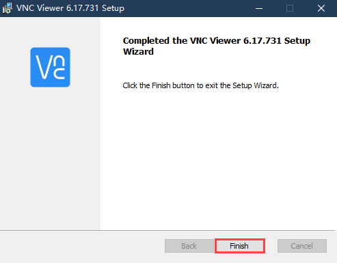
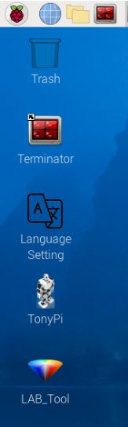
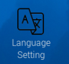
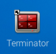
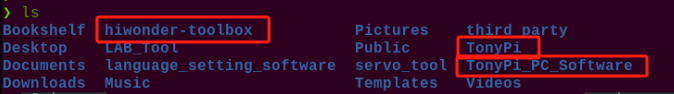

# 远程工具安装与连接

本章节的学习需要准备一台笔记本电脑，如使用台式电脑请自备无线网卡。

## 1. 准备工作

### 1.1 VNC远程工具的安装

如果你希望通过电脑端来执行玩法，并尝试后期查看玩法代码并修改程序，那么需要先完成本章的学习，安装好VNC软件。

VNC是一款图形化远程控制软件。我们可以通过连接树莓派的Wi-Fi热点，直接在自己电脑上控制树莓派。接下来将会分步讲解如何使用VNC。

1)  双击本文件夹中的"**VNC-Viewer-6.17.731-Windows**"文件，在弹出的对话框中选择安装语言为"**English**"，单击"**OK**"按钮。


2)  在弹出的界面单击"**Next**"按钮。


3)  在新的提示框中勾选同意协议，然后单击"**Nex**t"，接着弹出安装位置设置，保持默认设置，继续单击"**Next**"。


4)  在新弹出的页面中单击"**Install**"。


5)  等待安装，片刻之后出现安装完成提示页面，单击"**Finish**"按钮即可完成安装，安装后打开VNC。



6)  VNC完成连接，直接打开图标即可。

### 1.2 设备开机

按照前面所学，在连接适配器后推动树莓派扩展板的开关。稍等片刻后树莓派扩展板上的LED1由常亮变为每隔2秒闪烁一次，同时手掌上的所有舵机呈现抓取姿态，即为成功开机标志。

## 2. 设备连接

1)  机器人在开机后，会产生一个HW开头的热点，我们可以打开电脑Wi-Fi搜索到以HW开头的热点，如下图所示：


2)  点击连接，输入密码"**hiwonder**"。


3)  在打开的VNC Viewer中输入树莓派默认的IP地址：192.168.149.1，然后按回车，如果提示不是安全连接的话单击"**Continue**"。


4. 此时弹出一个提示框，要求输入账号（Username）和密码（Password），账号输入：**pi**，密码输入：**raspberrypi**，勾选上记住密码框，然后单击"OK"，此时即可看到远程打开的树莓派的桌面了。


5.  在桌面上有一个警告对话框（树莓派本身特性），单击"**确定**"关闭即可。（如果是黑屏，只有一个鼠标，则可尝试重新启动树莓派。）

:::{Note}
各实验玩法详细启动步骤请参考随后的每章节的课程学习。
:::

## 3. 系统目录简要说明

### 3.1 桌面分布

通过VNC远程连接后，树莓派系统桌面如下图所示：



其中我们主要看下面这三个：

|                         **目录名**                          |               **作用**               |
|:--------------------------------------------------------:|:----------------------------------:|
|   |       TonyPi上位机，集动作编辑、调用等功能。       |
|   |       TonyPi上位机，集动作编辑、调用等功能。       |
|   |            颜色模型参数调节工具。             |
|   |      Terminator终端，用于输入指令进行操作。      |
|  | 文件管理器，可视化文件目录界面。（推荐对指令行了解较少的初学者使用） 

### 3.2 程序结构说明

:::{Note}
指令的输入需严格区分大小写及空格，关键词支持"**TAB**"键补齐。
:::

1)  单击图标。输入指令，然后按下回车，列出当前所有文件。主要来看这三个目录，如下图所示：

```commandline
ls
```


|     **目录名**     |            **作用**            |
|:------------------:|:------------------------------:|
|       TonyPi       | 存放所有玩法及涉及到的程序源码 |
| TonyPi_PC_Software | TonyPi上位机源码（基于QT框架） |
|  hiwonder-toolbox  |         Wi-Fi管理工具          |

:::{Note}
AI视觉玩法只需了解"TonyPi"这个文件夹即可。
:::

2)  接下来进入玩法及程序源码目录，依次输入指令，列出该目录下的所有文件夹及文件。在TonyPi内我们主要了解以下三个目录，如下图所示：

```commandline
cd TonyPi
```

```commandline
ls
```



| **目录名**  |            **目录作用**            |
|:-----------:|:----------------------------------:|
|  Functions  |       AI视觉玩法程序所在目录       |
|  TonyPi.py  | 主程序，处理玩法调用（已设置自启） |
| HiwonderSDK |    底层文件路径（用于硬件控制）    |

3)  最后我们再依次输入指令，了解一下程序所对应的玩法：

```commandline
cd Functions
```

```commandline
ls
```

|    **程序名**     |       **对应玩法**       |
|:-----------------:|:------------------------:|
| RemoteControl.py  | 遥控图传（仅作了解即可） |
|    KickBall.py    |         自动踢球         |
|  ColorDetect.py   |         颜色识别         |
|  VisualPatrol.py  |         智能巡线         |
|   ColorTrack.py   |         颜色追踪         |
|   FaceDetect.py   |         人脸识别         |
| ApriltagDetect.py |         标签识别         |

### 3.3 豪华版程序对应玩法

:::{Note}
豪华版玩法需前往"**[语音交互及智能搬运课程](https://docs.hiwonder.com/projects/TonyPi_Pro/en/latest/docs/11.voice_intelligent_handling.html)**"中学习。
:::

|      **程序名**      |  **对应玩法**  |
|:--------------------:|:--------------:|
|    ASRControl.py     | 语音控制TonyPi |
|   Transport_ASR.py   |  语音控制搬运  |
|     Transport.py     |    智能搬运    |
| ColorDetectAndTTS.py |  颜色识别播报  |
|      Follow.py       |    物体追踪    |
