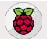
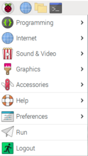
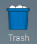
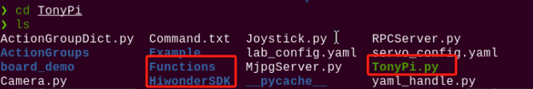

# 3.Remote Desktop Installation and Connection

## 3.1 Remote Desktop Installation and Connection

Prepare a computer. If you are using desktop computer, wireless network card is required.The network card should support 5G band.

### 3.1.1 Preparation

* **Install VNC** 

VNC is a graphical remote desktop control software. Through connecting your computer to the WiFi generated by Raspberry Pi, you can control Raspberry Pi. Installation of VNC is as below.

(1)  Double-click the installation program "**[VNC-Viewer-6.17.731-Windows](https://store.hiwonder.com.cn/docs/common/Remote_connection_tool/VNC/VNC-Viewer-6.17.731-Windows.exe)**" in the same directory as this section. Select the installation language as "**English**" and lick "**OK**".


(2)  Click "**Next**".


(3) Tick "**I accept the terms in the License Agreement**". Then click "**Next**".


(4)  Remain default location where the software is installed. Click "**Next**" to proceed next interface. Then directly click "**Install**".


(5)  When the installation completes, click "**Finish**".


(6)  Click  to open VNC.

* **Start Robot** 

Start Robot When LED1 on expansion board starts flickering and buzzer emits one beep, robot boots up successfully.

### 3.1.2 Connect to Robot

(1)  After turning Robot on successfully, the default mode is AP direct connection mode. Robot generates a WiFi starting with HW. Connect your computer to this WiFi.


(2)  Input password. The password is "**hiwonder**".

<p class="common_img" style="text-align: center">
    
    
</p>

(3) After connection, open VNC Viewer. Input the default IP address of Raspberry Pi, **192.168.149.1**, and then press Enter. If you receive security warning, select "**Continue**".


(4) Input username and password. (**Username: pi;Password: raspberrypi**). Click "**OK**" to enter Raspberry Pi desktop.


(5) The desktop is as pictured. If black screen occurs or only cursor leaves on the screen, restart Raspberry Pi.


### 3.1.3 Introduction to Desktop

The desktop is as pictured after connecting Robot through VNC successfully.


The following table demonstrates common functions:

<table class="docutils-nobg" border="1">
<colgroup>
<col style="width: 50%" />
<col style="width: 50%" />
</colgroup>
<tbody>
<tr>
<td style="text-align: center;">Icon</td>
<td style="text-align: center;">Function</td>
</tr>
<tr>
<td style="text-align: center;"></td>
<td style="text-align: left;"><p>Application menu. Click to select different applications.</p>
<p></p></td>
</tr>
<tr>
<td style="text-align: center;"></td>
<td style="text-align: left;">Browser.</td>
</tr>
<tr>
<td style="text-align: center;"></td>
<td style="text-align: left;">File manager.</td>
</tr>
<tr>
<td style="text-align: center;"></td>
<td style="text-align: left;">LX terminal. Click to input command line in the opened interface.</td>
</tr>
<tr>
<td style="text-align: center;"></td>
<td style="text-align: left;">Trash. You can find the files deleted here.</td>
</tr>
<tr>
<td style="text-align: center;"></td>
<td style="text-align: left;">PC software. You can adjust pan tilt and adjust color threshold on it.</td>
</tr>
<tr>
<td style="text-align: center;"></td>
<td style="text-align: left;">Full screen or exit full screen.</td>
</tr>
<tr>
<td style="text-align: center;"></td>
<td style="text-align: left;">Exit full screen.</td>
</tr>
<tr>
<td style="text-align: center;"></td>
<td style="text-align: left;"><p>Shut down, reboot and logout</p>
<p></p></td>
</tr>
</tbody>
</table>

## 3.2 System Introduction

### 3.2.1 Desktop Instruction

After remote connection via VNC, the Raspberry Pi system desktop is as shown in the figure below:


|                        **Directory**                         |                           Function                           |
| :----------------------------------------------------------: | :----------------------------------------------------------: |
|  | TonyPi PC software which includes action programming, debugging etc. |
|  |               Chinese-English switching tool.                |
|  |            Color model parameter adjustment tool.            |
|  | Terminator terminal, which is used to input command to proceed operation. |
|  | File manager is a visual file directory interface.Recommended for beginner users who are not familiar with the command line. |

### 3.2.2 Programming Instruction

The input command must be case sensitive and space, and the keyword supports "TAB" key to fill.

(1)  Click  icon and enter "Is" command and then press Enter to list all the documents. As shown in the figure below:


|   **Directory**    |                    **Function**                     |
|:------------------:|:---------------------------------------------------:|
|       TonyPi       | Store all the games and related program source code |
| TonyPi_PC_Software |    TonyPi PC software source code (based on Qt)     |
|  hiwonder-toolbox  |                Wi-Fi management tool                |

:::{Note}
For AI vision games, you only need to check the folder "TonyPi".
:::

(2)  Enter "cd TonyPi" to open all the games and program source code. In the TonyPi, enter "ls" command in the following three main directories. As shown below:

```commandline
cd TonyPi
```

```commandline
ls
```



|  Directory  |                         **Function**                         |
|:-----------:|:------------------------------------------------------------:|
|  Functions  |  The directory where the AI vision game program is located.  |
|  TonyPi.py  | Main program for running the games (auto-start has been set) |
| HiwonderSDK |         Underlying file path (for hardware control)          |

(3)  Enter the "cd Functions" and "ls" instructions in turn again. Let's take a look at the corresponding games of the program:

```commandline
cd Functions
```

```commandline
ls
```

|   Program Name    |               Game                |
|:-----------------:|:---------------------------------:|
| RemoteControl.py  | Model control (only for learning) |
|    KickBall.py    |           Auto shooting           |
|  ColorDetect.py   |         Color recognition         |
|  VisualPatrol.py  |            Line follow            |
|   ColorTrack.py   |         Color recognition         |
|   FaceDetect.py   |        Facial recognition         |
| ApriltagDetect.py |          Tag recognition          |

### 3.2.3 Game in Advanced Tutorial

:::{Note}
You can go to "**[Intelligent Transport Course](https://docs.hiwonder.com/projects/TonyPi/en/latest/docs/11.voice_interaction_and_intelligent_handling_course.html)**" to learn the advanced tutorial.
:::

| **Program**  |       **Game**       |
| :----------: | :------------------: |
| Transport.py | Intelligent Handling |
|  Follow.py   |   Object Tracking    |

