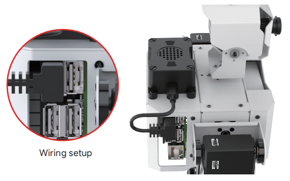
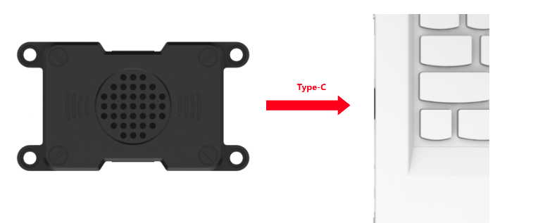
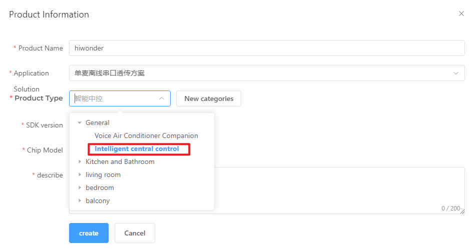
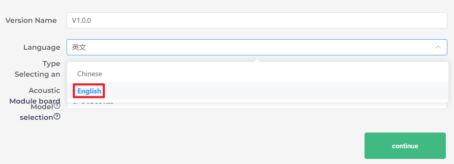
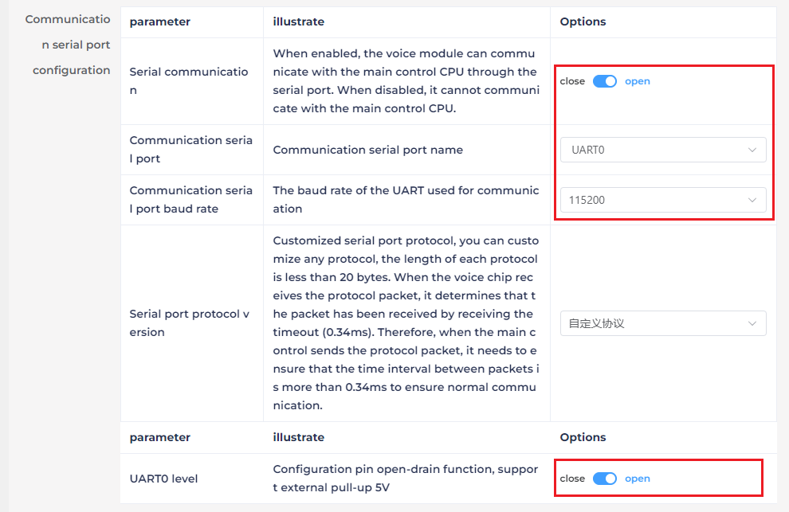
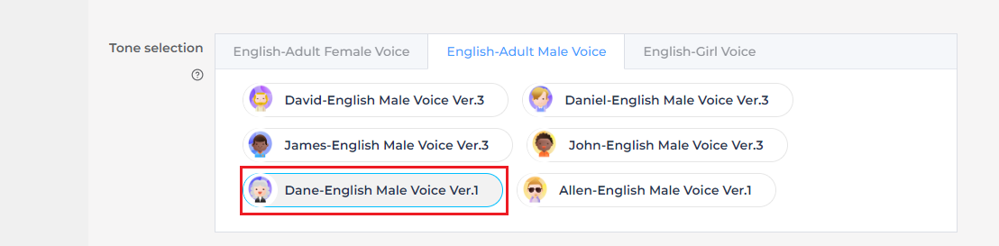
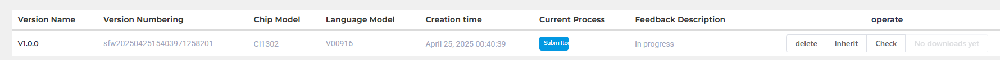

# 6. AI Voice Interaction Course

## 6.1 Introduction to WonderEcho Pro and Installation

### 6.1.1 Introduction to WonderEcho Pro

WonderEcho Pro, also known as the AI Voice Interaction Box, is equipped with a high-performance noise-canceling microphone and a high-fidelity speaker. Featuring a USB-to-audio module, it offers plug-and-play functionality without the need for drivers and is compatible with multiple systems for both playback and recording.

This device integrates various speech processing modules and uses advanced noise suppression algorithms to effectively filter out background noise, supporting a seamless process from wake-up to speech recognition and interaction. With its modular design, each functional component—such as wake-up, detection, recognition, and synthesis—can be developed and tested independently.

* **Features & Parameters**

(1) The device is equipped with an onboard microphone and speaker interface, supporting both audio input and output.

(2) It is driver-free, offering seamless plug-and-play functionality with broad system compatibility, including Windows, macOS, Linux, and Android. The **"listen/speak"** dual function ensures versatility across various platforms.

(3) It uses a standard USB 2.0 interface.

(4) Control Interface: USB

(5) Voice Chip Model: Cl1302

(6) Speaker Output: 3.0W per channel (4Ω BTL)

(7) Power Supply Voltage: 5V

* **Recording and Playback Test**

The following steps demonstrate the process using the Raspberry Pi 5, but the connection and testing procedures are equally applicable to other compatible devices, such as Jetson:

* **Connection Setup and Verification**


For Raspberry Pi, you can establish a remote connection to the system using VNC by following the [**"3. Remote Desktop Tool Installation and Connection"**]() guide. Once connected, check the top-right corner of the desktop for the microphone and speaker icons, as shown below. If they are present, the connection has been successfully established.


For Jetson-based systems, you can use the Nomachine remote connection tool. Once connected, verify the presence of the speaker icon in the top-right corner of the system.


* **Recording Test**

(1) Next, open a new command-line terminal and enter the following command to check for the use of the -l (lowercase L) option, and verify that the card number (card) is 0. This is just an example; please ensure to check your actual query results.

```
arecord -l
```


(2) Then, use the following command to start recording, replacing the highlighted card number (in red) with the one obtained from the previous query:

```
arecord -D hw:0,0 -f S16_LE -r 16000 -c 2 test.wav
```

(3) A **"test.wav"** file will be generated in the current folder.


(4) You can record for about 5 seconds, then press **"Ctrl+C"** to stop the recording.

* **Playback Test**

(1) After completing the recording, you can check if the file was successfully recorded by running the following command in the current directory:

```
ls
```


(2) If **"test.wav"** appears, the recording was successful. To play the recorded file, use the command below, ensuring you replace the card number with the one obtained from your previous query:

```
aplay test.wav
```


### 6.1.2 WonderEcho Pro Installation

(1) Secure the WonderEcho Pro to the back of TonyPi using M4*6 screws, making sure to align it in the correct orientation.


(2) Connect the module to the robot's USB port using a Type-C cable.



### 6.1.3 Firmware Flashing Method

In this lesson, we will learn how to flash firmware onto the WonderEcho Pro.

* **Flashing the Firmware**

(1) Begin by connecting the WonderEcho Pro to your computer using a Type-C data cable.



(2) Open the file **"PACK_UPDATE_TOOL.exe"** located in [**Firmware Flashing Tool**](). Select the **"CI1302"** chip and click **"Firmware Upgrade."**


**For this example, we will use the "hello hiwonder firmware" (Wake word: "hello hiwonder").**

(3) Select the firmware by locating the [**"hello hiwonder firmware (Wake word: hello hiwonder).bin"**]() file under the [**Appendix**]() path.


(4) Identify the correct COM port and select it.


(5) Press the RST button on the WonderEcho Pro to initiate the flashing process. Wait for the process to complete successfully.


* **Testing the Wake Word**

After flashing the firmware, follow the steps in [**Serial Port Debugging Tool**]() to install the serial port debugging tool. Then, follow the steps below to test whether the firmware is functioning correctly.

(1) Connect the WonderEcho Pro to your computer's USB port using a Type-C to USB adapter.


(2) Open the Serial Port Utility, select the connected COM port (including CH340), and set the baud rate to 115200, as shown in the image below.


(3) Say the wake word **"hello hiwonder"** as configured in the firmware settings. The corresponding flag information will appear on the right side (in hexadecimal format), confirming that the wake word was successfully recognized.


### 6.1.4 WonderEcho Pro Firmware Development

In this lesson, you'll learn how to create and flash firmware for the WonderEcho Pro module.

* **Firmware Creation and Flashing**

**We'll use "HIWONDER" as an example to demonstrate the firmware creation process. The same procedure also applies to creating firmware with Chinese wake words. Note: English wake words must be entered in all uppercase letters to function properly.**

(1) Open the official firmware creation website: [https://aiplatform.chipintelli.com/home/index.html](https://aiplatform.chipintelli.com/home/index.html); The platform interface is in Chinese. If needed, use your browser's translation feature to switch to English for easier navigation.

(2) First, visit the ChipIntelli Voice AI Platform by clicking on **"Platform Features"** in the top menu, and then select **"In-depth development of Product Firmware & SDK"** under the Product Development section.


(3) You will be prompted to log in. (Note: Currently, registration is only available for mainland China mobile numbers. For international users, we provide a shared account:
**Username: 18033085495
Password: hiwonder**)

After successfully logging in, click **"In-depth development of Product Firmware & SDK"** again to access the development section.


(4) To create a new product, click the option in the left sidebar. You will be asked to provide a Product Name and a Description, both of which can be customized. For the other fields, follow the options shown in the red box. Specifically, choose Product Type: 通用 (General) → 智能中控 (Smart Central Control). After completing these steps, click Create.





(5) Next, you will need to set the project language. Since we are configuring for English voice recognition, select English under Language Type. If you were configuring for Chinese recognition, you would select Chinese for both Voice Type and Acoustic Model. Once you've selected the appropriate options, click Continue to proceed.




(6) In the firmware configuration interface, you will make some important changes to the settings. Start by enabling the Echo Cancellation feature under Algorithm Settings.


(7) Under Hardware Settings, set the oscillator source to Internal RC and disable the Baud Rate Calibration function.


(8) In the UART Print Settings, configure UART1 to Open-Drain Mode, supporting external 5V pull-up.


(9) For Communication UART Settings, set the Baud Rate to 115200 and configure UART0 to Open-Drain Mode, also supporting external 5V pull-up. After adjusting these settings, click Continue to move forward.



(10) The next step involves configuring the command words. You will need to choose a voice output for the wake-up command. For this example, select **"Dane – English Male Voice"** as the output voice. (If you're using Chinese as the language, you may choose the voice option **"Chengcheng – Standard Boy Ver.1"**. The selection between Chinese and English voices is determined by the language settings configured in Step 5.)




(11) Next, upload the command word configuration file. Navigate to the folder [**Appendix\4. Wake Word Protocol List**]() and locate the spreadsheet titled [**Command Phrase and Playback Protocol List V3 – English Template**](). Simply drag and drop the file into the upload area on the webpage.

:::{Note}
If you wish to change the wake word, open the spreadsheet and replace the default wake word HIWONDER with your preferred word. **Keep in mind that the English version of the firmware only supports English wake words, and mixed-language wake words are not allowed. Additionally, English wake words must be written in uppercase letters to function properly.**
:::


(12) After uploading the file, you will see the command data populated in the table below.


(13) Click **"Submit"** and wait a few minutes for the firmware generation process to complete. Once finished, click **"Download"** to obtain your customized firmware.





## 6.2 Sing and Dance

### 6.2.1 Program Download

[Source Code]()

### 6.2.2 Preparation

Refer to Section 6.1 Introduction to WonderEcho Pro and Installation to flash the firmware onto the WonderEcho Pro module. Once the firmware has been successfully burned, install the module onto the robot.

### 6.2.3 Brief Game Instructions

The program plays .mp3 audio files using the WonderEcho Pro module's sound card. Create a folder named audio in the same directory as the script. When the program runs, it will execute a corresponding dance routine and play an .mp3 file with the same name.

Script location: [/home/pi/TonyPi/Functions/voice_interaction/sing_and_dance.py]()

Audio file directory: [/home/pi/TonyPi/audio/]()

### 6.2.4 Starting and Stopping the Game

:::{Note}
When entering commands, ensure that case sensitivity is strictly followed. You can use the **"Tab"** key to auto-complete keywords.
:::

(1) Power on the device and connect via VNC remote tool.

(2) Click on the icon in the upper-left corner of the system desktop or press the shortcut **"Ctrl+Alt+T"** to open the LX terminal.

(3) In the opened terminal window, input the command to navigate to the directory where the game program is located and press Enter:

```
cd TonyPi/Functions/voice_interaction
```

(4) Enter the command and press the Enter key to start the game:

```
python3 sing_and_dance.py
```

(5) To exit this feature, simply press **"Ctrl+C"** in the terminal. If the command does not stop the program, please try again.

### 6.2.5 How It Works

After running the program, the WonderEcho Pro module will play the specified music and perform a dance routine.

### 6.2.6 Program Analysis

[Source Code]()

* **Library Files Import**

{lineno-start=1}
```python
#!/usr/bin/python3
# coding=utf8
from speech import speech
import hiwonder.ActionGroupControl as AGC
```

* **Running Music and Action Group**

{lineno-start=6}
```python
action_name = '21'
speech.set_volume(20)
#speech.play_audio("/home/pi/TonyPi/audio/{}.wav".format(action_name), volume=70, block=False)
speech.play_audio("/home/pi/TonyPi/audio/{}.wav".format(action_name), block=False)
AGC.runActionGroup(action_name)
```

**/home/pi/TonyPi/audio/{}.wav".format(action_name)**: specifies the path to the corresponding audio file. The `volume=20` parameter sets the audio playback volume to 20.

The `block=False` parameter enables non-blocking mode.

The `AGC.runActionGroup` function, from the **hiwonder.ActionGroupControl module**, is used to execute the **"21"** action group.

### 6.2.7 Function Expansion

* **Modifying Dance Movements**

(1) Double-click the **"Terminator"** icon on the Raspberry Pi desktop to open the command-line terminal.

(2) Enter the following command and press Enter to navigate to the directory where the program is located:

```
cd TonyPi/Functions/voice_interaction
```

(3) Run the following command to open the program file:

```
python3 sing_and_dance.py
```

(4) Locate the code section in the area highlighted in the image.

(5) Press the **"i"** key to enter edit mode. Modify the action group name at this location to match the action group from the **"ActionGroups"** file. For example, change it to **"22.d6ac,"** as shown in the image.


(6) Once the modification is complete, press the **"Esc"** key. Then, type the following command (note that a colon **":"** precedes the **"wq"**) and press Enter to save the changes:

```
:wq
```

(7) Afterward, repeat the steps outlined in this document to run the program. This will execute Action Group 22 and its corresponding music, reflecting the changes you've made.

(8) If you wish to implement additional actions, refer to the [**4. PC Software Action Control Courses \ 4.3 Action Editing**]() document for guidance on creating action groups.

## 6.3 Voice Recognition

### 6.3.1 Program Download

[Source Code]()

### 6.3.2 Preparation

Refer to Section 6.1 Introduction to WonderEcho Pro and Installation to flash the firmware onto the WonderEcho Pro module. Once the firmware has been successfully burned, install the module onto the robot. By default, the wake-up word for the WonderEcho Pro factory firmware is **"Hello, HiWonder."** If you wish to change the wake-up word to **"TonyPi,"** please refer to the tutorial titled [**"6 AI Voice Interaction Course > 6.1 Introduction to WonderEcho Pro and Installation > 6.1.3 Firmware Flashing Method"**]() for step-by-step instructions.

### 6.3.3 Brief Game Instructions

After running the program, the WonderEcho Pro module will automatically activate voice recognition. When we say a specific trigger word, the terminal will display the corresponding information. For example, if we say **"turn left,"** the terminal will print **"turn_left."**

### 6.3.4 Starting and Stopping the Game

:::{Note}
When entering commands, ensure that case sensitivity is strictly followed. You can use the **"Tab"** key to auto-complete keywords.
:::

(1) Power on the device and connect via VNC remote tool.

(2) Click on the icon in the upper-left corner of the system desktop or press the shortcut **"Ctrl+Alt+T"** to open the LX terminal.

(3) In the opened terminal window, input the command to navigate to the directory where the game program is located and press Enter:

```
cd TonyPi/Functions/voice_interaction
```

(4) Enter the command and press the Enter key to start the game:

```
python3 word_detect.py
```

(5) To exit this feature, simply press **"Ctrl+C"** in the terminal. If the command does not stop the program, please try again.

### 6.3.5 How It Works

Upon running the program, the WonderEcho Pro module will automatically initiate voice recognition. To activate it, simply say **"TonyPi,"** which will prompt the terminal to display **"wakeup."** If no voice input is detected within 5 seconds after activation, the terminal will show **"sleep,"** and the WonderEcho Pro module will enter sleep mode.

| **English voice commands** | **Terminal print** | **For English voice commands:** | **Terminal print** |
|:--:|:--:|:--:|:--:|
| TonyPi | Wakeup | FORWORD | Forward |
| BACK | Back | TURN-LEFT | Turn_left |
| TURN-RIGHT | Turn_right |  |  |


### 6.3.6 Program Analysis

[Source Code]()

Script location: [/home/pi/TonyPi/Functions/voice_interaction/word_detect.py]()

* **Library Files Import**

{lineno-start=1}
```python
#!/usr/bin/python3
# coding=utf8
import serial, os, sys
from speech import speech
```

* **Define the protocol for sending and receiving keywords**

{lineno-start=6}
```python
cmd_dict = {b"\xaa\x55\x03\x00\xfb": 'wakeup',
            b"\xaa\x55\x02\x00\xfb": 'sleep',
            b"\xaa\x55\x00\x01\xfb": 'forward',
            b"\xaa\x55\x00\x02\xfb": 'back',
            b"\xaa\x55\x00\x03\xfb": 'turn_left',
            b"\xaa\x55\x00\x04\xfb": 'turn_right'}
```

* **Defining the WonderEcho Class**

{lineno-start=13}
```python
class WonderEcho:
    def __init__(self, port):
        self.serialHandle = serial.Serial(None, 115200, serial.EIGHTBITS, serial.PARITY_NONE, serial.STOPBITS_ONE, timeout=0.02)
        self.serialHandle.rts = False
        self.serialHandle.dtr = False
        self.serialHandle.setPort(port)
        self.serialHandle.open()
        self.serialHandle.reset_input_buffer()
```

* **detect Method**

{lineno-start=22}
```python
    def detect(self):
        return self.serialHandle.read(5)
```

This method is responsible for reading 5 bytes of data from the serial port and returning the received data.

## 6.4 Voice Control Movement

### 6.4.1 Program Download

[Source Code]()

### 6.4.2 Preparation

Refer to Section 6.1 Introduction to WonderEcho Pro and Installation to flash the firmware onto the WonderEcho Pro module. Once the firmware has been successfully burned, install the module onto the robot. By default, the wake-up word for the WonderEcho Pro factory firmware is **"Hello, HiWonder."** If you wish to change the wake-up word to **"TonyPi,"** please refer to the tutorial titled [**"6 AI Voice Interaction Course > 6.1 Introduction to WonderEcho Pro and Installation > 6.1.3 Firmware Flashing Method"**]() for step-by-step instructions.

### 6.4.3 Brief Game Instructions

After running the program, the WonderEcho Pro module will automatically activate voice recognition. When we say a specific trigger word, the terminal will display the corresponding information. For example, if we say **"turn left,"** the terminal will print **"turn_left."**

### 6.4.4 Starting and Stopping the Game

:::{Note}
When entering commands, ensure that case sensitivity is strictly followed. You can use the **"Tab"** key to auto-complete keywords.
:::

(1) Power on the device and connect via VNC remote tool.

(2) Click on the icon in the upper-left corner of the system desktop or press the shortcut **"Ctrl+Alt+T"** to open the LX terminal.

(3) In the opened terminal window, input the command to navigate to the directory where the game program is located and press Enter:

```
cd TonyPi/Functions/voice_interaction
```

(4) Enter the command and press the Enter key to start the game:

```
python3 voice_control_move.py
```

(5) To exit this feature, simply press **"Ctrl+C"** in the terminal. If the command does not stop the program, please try again.

### 6.4.5 How It Works

Once the program is running, the WonderEcho Pro module will automatically initiate voice recognition. Upon activation, the robot will play the phrase **"I am ready."** To wake up the module, simply say **"TonyPi,"** and it will respond with **"I'm here."** If no voice input is detected within 5 seconds after activation, the terminal will show **"sleep,"** and the WonderEcho Pro module will enter sleep mode.

| **English voice commands:** | **Terminal print** | **Execute Actions** | **English voice commands:** | **Terminal print** | **Actions** |
|:--:|:--:|:--:|:--:|:--:|:--:|
| TonyPi | Wakeup | / | FORWORD | Forward | go_forward.d6a |
| BACK | Back | back.d6a: | TURN-LEFT | Turn_left | turn_left.d6a |
| TURN-RIGHT | Turn_right | turn_right.d6a |  |  |  |

### 6.4.6 Program Analysis

[Source Code]()

Script location: [/home/pi/TonyPi/Functions/voice_interaction/voice_control_move.py]()

* **Library Files Import**

{lineno-start=1}
```python
#!/usr/bin/python3
# coding=utf8
import serial, os, sys
from speech import speech
from hiwonder.Controller import Controller
import hiwonder.ActionGroupControl as AGC
import hiwonder.yaml_handle as yaml_handle
import hiwonder.ros_robot_controller_sdk as rrc
```

* **Voice Recognition Action Group Logic**

{lineno-start=64}
```python
    while True:
        try:
            res = wonderecho.detect()
            if res != b'':
                if res in cmd_dict:
                    if cmd_dict[res] == 'wakeup':
                        speech.play_audio(os.path.join(audio_path, 'wakeup.wav'))
                        print('wakeup')
                    elif cmd_dict[res] == 'sleep':
                        speech.play_audio(os.path.join(audio_path, 'dong.wav'))
                        print('sleep')
                    elif cmd_dict[res] == 'forward':
                        speech.play_audio(os.path.join(audio_path, 'ok.wav'))
                        AGC.runActionGroup('go_forward', 2 , True)
                        print('forward')
                    elif cmd_dict[res] == 'back':
                        speech.play_audio(os.path.join(audio_path, 'ok.wav'))
                        AGC.runActionGroup('back', 2 , True)
                        print('back')
                    elif cmd_dict[res] == 'turn_left':
                        speech.play_audio(os.path.join(audio_path, 'ok.wav'))
                        AGC.runActionGroup('turn_left', 2 , True)
                        print('turn_left')
                    elif cmd_dict[res] == 'turn_right':
                        speech.play_audio(os.path.join(audio_path, 'ok.wav'))
                        AGC.runActionGroup('turn_right', 2 , True)
                        print('turn_right')
        except KeyboardInterrupt:
            wonderecho.exit()
            break
```

## 6.5 Color Recognition and Audio Announcement

### 6.5.1 Program Download

[Source Code]()

### 6.5.2 Preparation

Refer to  [Introduction to WonderEcho Pro]() and [Installation to flash the firmware]() onto the WonderEcho Pro module. Once the firmware has been successfully burned, install the module onto the robot. By default, the wake-up word for the WonderEcho Pro factory firmware is **"Hello, HiWonder."** If you wish to change the wake-up word to **"TonyPi,"** please refer to the tutorial titled [**"6 AI Voice Interaction Course > 6.1 Introduction to WonderEcho Pro and Installation > 6.1.3 Firmware Flashing Method"**]() for step-by-step instructions.

### 6.5.3 Brief Game Instructions

First, the image within the visual range is processed by converting it to the Lab color space for thresholding. After applying morphological operations such as dilation and erosion, the resulting contours will represent only the target color. These contours are then outlined, enabling the recognition of the object's color. Once the color recognition result is obtained, the speech module evaluates the detected color and selects the corresponding audio file associated with that color. This process achieves the functionality of color recognition and audio reporting.

### 6.5.4 Starting and Stopping the Game

:::{Note}
When entering commands, ensure that case sensitivity is strictly followed. You can use the **"Tab"** key to auto-complete keywords.
:::

(1) Power on the device and connect via VNC remote tool.

(2) Click on the icon in the upper-left corner of the system desktop or press the shortcut **"Ctrl+Alt+T"** to open the LX terminal.

(3) In the opened terminal window, input the command to navigate to the directory where the game program is located and press Enter:

```
cd TonyPi/Functions/voice_interaction
```

(4) Enter the command and press the Enter key to start the game:

```
python3 color_detect_with_voice.py
```

(5) To exit this feature, simply press **"Ctrl+C"** in the terminal. If the command does not stop the program, please try again.

### 6.5.5 How It Works

Once the robot announces **"I'm ready,"** place items of different colors in front of the camera one by one. Upon recognizing a color, the robot will announce the corresponding command, with each color being associated with a distinct voice tone.

### 6.5.6 Program Analysis

[Source Code]()

Script location: [/home/pi/TonyPi/Functions/voice_interaction/color_detect_with_voice.py]()

* **Library Files Import**

{lineno-start=1}
```python
#!/usr/bin/python3
# coding=utf8
import sys
import os
import cv2
import math
import time
import threading
import numpy as np

from speech import speech
import hiwonder.Camera as Camera
import hiwonder.Misc as Misc
import hiwonder.ros_robot_controller_sdk as rrc
from hiwonder.Controller import Controller
import hiwonder.ActionGroupControl as AGC
import hiwonder.yaml_handle as yaml_handle
```

Initialization: Set the initial state and underlying robot drivers, including the servos' initial positions.

* **Color Detection Parameters**

(1) Before converting the image to LAB color space, it's essential to perform denoising. This is achieved using the `GaussianBlur()` function for Gaussian filtering:

{lineno-start=172}
```python
    frame_resize = cv2.resize(img_copy, size, interpolation=cv2.INTER_NEAREST)
    frame_gb = cv2.GaussianBlur(frame_resize, (3, 3), 3)
    frame_lab = cv2.cvtColor(frame_gb, cv2.COLOR_BGR2LAB)  # 将图像转换到LAB空间(Convert the image to LAB color space.)
```

Before converting the image to LAB color space, it's essential to perform denoising. This is achieved using the `GaussianBlur()` function for Gaussian filtering: The first parameter, `frame_resize`, is the input image. The second parameter, `(3, 3)`, specifies the size of the Gaussian kernel. Larger kernels typically result in more filtering, causing a blurrier output image and increasing computational complexity. The third parameter, `3`, sets the standard deviation along the X-axis of the Gaussian function, controlling the variation around the average value. A larger value allows more variation, while a smaller one restricts it.

(2) Next, use the `inRange()` function to apply binarization to the input image.

{lineno-start=183}
```python
                frame_mask = cv2.inRange(frame_lab,
                                         (lab_data[i]['min'][0],
                                          lab_data[i]['min'][1],
                                          lab_data[i]['min'][2]),
                                         (lab_data[i]['max'][0],
                                          lab_data[i]['max'][1],
                                          lab_data[i]['max'][2]))  #对原图像和掩模进行位运算(Perform bitwise operations on the original image and the mask.)
```

(3) To reduce noise and make the image smoother, apply erosion and dilation operations. The **getStructuringElement()** function is used to generate structural elements with different shapes: The first parameter, **cv2.MORPH_RECT**, defines the kernel shape as rectangular. The second parameter, **(3, 3)**, specifies the size of the rectangle, which is 3x3.

{lineno-start=190}
```python
                eroded = cv2.erode(frame_mask, cv2.getStructuringElement(cv2.MORPH_RECT, (3, 3)))  #腐蚀(Erosion)
                dilated = cv2.dilate(eroded, cv2.getStructuringElement(cv2.MORPH_RECT, (3, 3))) #膨胀(Dilation)
```

(4) To identify the largest object contour, set the condition **if max_area > 200** to ensure that only contours with an area greater than 200 are considered valid, helping to minimize interference.

{lineno-start=201}
```python
        if max_area > 200:  # 有找到最大面积(Find the maximum area)
            ((object_center_x, object_center_y), radius) = cv2.minEnclosingCircle(areaMaxContour_max)  # 获取最小外接圆(Get the minimum enclosing circle)
            object_center_x = int(Misc.map(object_center_x, 0, size[0], 0, img_w))
            object_center_y = int(Misc.map(object_center_y, 0, size[1], 0, img_h))
            radius = int(Misc.map(radius, 0, size[0], 0, img_w))
            cv2.circle(img, (object_center_x, object_center_y), radius, range_rgb[color_area_max], 2)#画圆(Draw a circle)
```

* **Color Detection Parameters**

(1) When the robot detects a ball with a specified color, the `cv2.circle()` function can be used to draw a circle around the target object in the captured image.

The first parameter, `img`, is the input image, which is the one containing the detected color ball.
The second parameter, `(centerX, centerY)`, specifies the center coordinates of the circle (based on the detected object).
The third parameter, `radius`, sets the radius of the circle (determined by the detected object).
The fourth parameter, `range_rgb[color_area_max]`, determines the color of the circle's outline.
The fifth parameter, `2`, specifies the thickness of the circle's outline.

{lineno-start=206}
```python
            cv2.circle(img, (object_center_x, object_center_y), radius, range_rgb[color_area_max], 2)#画圆(Draw a circle)
```

(2) After detecting the color ball, the circle's color and the corresponding voice broadcast are triggered based on the identified color.

{lineno-start=208}
```python
            if color_area_max == 'red':  #红色最大(Red is maximum)
                color = 1
            elif color_area_max == 'green':  #绿色最大(Green is maximum)(Green is maximum)
                color = 2
            elif color_area_max == 'blue':  #蓝色最大(Blue is maximum)
                color = 3
            else:
                color = 0
            color_list.append(color)
```

{lineno-start=218}
```python
            if len(color_list) == 5:  #多次判断(Multiple judgments)
                # 取平均值(Take the average value)
                color = int(round(np.mean(np.array(color_list))))
                color_list = []
                if color == 1:
                    detect_color = 'red'
                    draw_color = range_rgb["red"]
                elif color == 2:
                    detect_color = 'green'
                    draw_color = range_rgb["green"]
                elif color == 3:
                    detect_color = 'blue'
                    draw_color = range_rgb["blue"]
                else:
                    detect_color = 'None'
                    draw_color = range_rgb["black"]
```

* **Voice Broadcast**

Upon detecting red, green, or blue balls, the WonderEcho Pro will announce the corresponding color.

{lineno-start=139}
```python
            if detect_color != 'None':
                if detect_color == 'red':
                    speech.play_audio(os.path.join(audio_path, 'red.wav'))
                elif detect_color == 'green':
                    speech.play_audio(os.path.join(audio_path, 'green.wav'))
                elif detect_color == 'blue':
                    speech.play_audio(os.path.join(audio_path, 'blue.wav'))
                time.sleep(2)
                detect_color = 'None'
                draw_color = range_rgb["black"]
```

## 6.6 Voice-Controlled Object Transport

### 6.6.1 Program Download

[Source Code]()

### 6.6.2 Brief Game Instructions

Through the set voice commands, the robot will perform the task of transporting objects. It will search for the corresponding red sponge block on the map, move it to the designated area, and complete the task.

Smart voice interaction is a new generation of interactive mode based on voice input, where speaking to the robot results in immediate feedback. In today's lesson, we will explore a new feature by combining voice interaction with intelligent transportation, allowing you to control the robot to transport objects through voice commands. By default, the wake-up word for the WonderEcho Pro factory firmware is **"Hello, HiWonder."** If you wish to change the wake-up word to **"TonyPi,"** please refer to the tutorial titled [**"6 AI Voice Interaction Course > 6.1 Introduction to WonderEcho Pro and Installation > 6.1.3 Firmware Flashing Method"**]() for step-by-step instructions.

Let's walk through the implementation process for this feature:

First, the WonderEcho Pro captures and recognizes voice commands, providing feedback based on the recognition.

Next, color recognition is performed using the Lab color space. After applying dilation and erosion operations, we obtain contours that only include the target color. These contours are then enclosed within a box, enabling accurate color-based object recognition. Once the object is recognized, the robot proceeds with the task of transporting it.

If the object is not found within the camera's current view, the pan-tilt mechanism is activated to adjust the search area, continuing the search until the target is located.

### 6.6.3 Starting and Stopping the Game

The input commands must strictly observe case sensitivity and spacing.

(1) Power on the device and connect via VNC remote tool.

(2) Click on the icon in the upper-left corner of the system desktop or press the shortcut **"Ctrl+Alt+T"** to open the LX terminal.

(3) In the opened terminal window, input the command to navigate to the directory where the game program is located and press Enter:

```
cd TonyPi/Functions/voice_interaction
```

(4) Enter the command and press the Enter key to start the game:

```
python3 voice_control_transport.py
```

(5) To exit this feature, simply press **"Ctrl+C"** in the terminal. If it doesn't close on the first attempt, you may need to press it multiple times.

### 6.6.4 How It Works

:::{Note}
For optimal performance, avoid placing the sponge blocks too close together. It's also recommended to maintain a distance of 1 to 3 meters between WonderEcho Pro. In noisy environments, keep the recognition distance to around 1 meter.
:::

Once the program starts, the TonyPi robot will tilt its head downward and play the voice prompt: **"I'm ready."** At this point, wake up TonyPi by saying the designated wake word **"TonyPi"**.

Then, give the robot a transport command. For example, say **"TRANSPORTING-RED,"** the robot will begin locating and transporting the red item to the corresponding AprilTag area.

The following table outlines the commands required to operate the voice-controlled transport function:

| **Stage** | **User Command** |
|:--------------------------:|:------------------:|
| Start the program |  |
| Wake up TonyPi | Start |
| Detect and transport red | TRANSPORTING-RED |
| Detect and transport green | TRANSPORTING-GREEN |
| Detect and transport blue | TRANSPORTING-BLUE |
| Finish single transporting |  |
| Stop transporting | Stop |

### 6.6.5 Comparison Between Voice-Controlled Transport and Intelligent Transport

|  | **Voice-Controlled Object Transport** | **Intelligent Transport** |
|:--:|:--:|:--:|
| **Control Method** | Voice Control | Fully autonomous after startup |
| **Application Scenarios** | Suitable for quiet environments (effective voice range: 1–3 meters) | Suitable for both quiet and noisy environments (no range limit) |
| **Operating Mode** | Single-item transport per command | Continuous transport without user intervention |

### 6.6.6 Program Analysis

[Source Code]()

The source code is located at: [/home/pi/TonyPi/Functions/voice_interaction/voice_control_transport.py]()

* **Module Import**

| **Module Import** | **Functions** |
|----|---|
| `import sys` | The Python sys module is imported to access system-specific functions and variables. |
| `import os` | The Python os module is imported to provide functions and methods for interacting with the operating system. |
| `import cv2` | The OpenCV library is imported to enable image processing and computer vision functionalities |
| `import time` | The time module provides various time-related functions. |
| `import math` | Provides low-level access to mathematical operations, including many commonly used mathematical functions and constants. |
| `import threading` | Enables multi-threaded execution, allowing concurrent operations within the program. |
| `import numpy as np` | Imports NumPy, an open-source numerical computing library in Python, used for handling arrays and performing matrix operations. |
| `import speech` | Imports the speech recognition library for voice command processing. |
| `import hiwonder.Camera as Camera` | Imports the camera module from the Hiwonder library for handling image capture and processing. |
| `from hiwonder.Misc import Misc` | Imports the Misc module, used for processing detected rectangular data. |
| `import hiwonder.ros_robot_controller_sdk as rrc` | Imports the robot control SDK, enabling control of servos, motors, RGB lights, and other hardware components. |
| `from hiwonder.controller import Controller` | Imports the motion control module for managing robot movements. |
| `import hiwonder.ActionGroupControl as AGC` | Imports the action group control library for executing predefined motion sequences. |
| `import hiwonder.yaml_handle as yaml_handle` | Provides tools and functions for working with YAML-formatted configuration files. |

* **Function Logic**

The system processes the images captured by the camera and, based on voice commands, searches for the corresponding sponge blocks and tags. Once found, the robot is controlled to reach the target location and perform the transport task.

* **Pre-set Placement Locations**

In this functionality, the red, green, and blue objects are moved to their corresponding tagged locations, as shown in the diagram below:


* **Initializing the Robot's Base-Level Drivers**

{lineno-start=87}
```python
# 初始化机器人底层驱动(Initialize robot low-level driver)
board = rrc.Board()
ctl = Controller(board)

# 初始位置(Initial position)
def initMove():
    ctl.set_pwm_servo_pulse(1, servo_data['servo1'], 500)
    ctl.set_pwm_servo_pulse(2, servo_data['servo2'], 500)
```

* **Color Detection Module**

{lineno-start=182}
```python
# 红绿蓝颜色识别(RGB color recognition)
size = (320, 240)
def colorDetect(img, _color_):
    img_h, img_w = img.shape[:2]
    
    frame_resize = cv2.resize(img, size, interpolation=cv2.INTER_NEAREST)
    frame_gb = cv2.GaussianBlur(frame_resize, (3, 3), 3)
    frame_lab = cv2.cvtColor(frame_gb, cv2.COLOR_BGR2LAB)  # 将图像转换到LAB空间(Convert the image to LAB color space.)
    
    center_max_distance = pow(img_w/2, 2) + pow(img_h, 2)
    color, center_x, center_y, angle = 'None', -1, -1, 0
```

The system identifies the target colored objects using the LAB color space.

* **AprilTag Detection and Localization**

{lineno-start=232}
```python
# 检测apriltag(AprilTag detection)
detector = apriltag.Detector(searchpath=apriltag._get_demo_searchpath())
def apriltagDetect(img):
    gray = cv2.cvtColor(frame, cv2.COLOR_RGB2GRAY)
    detections = detector.detect(gray, return_image=False)
    tag_1 = [-1, -1, 0]
    tag_2 = [-1, -1, 0]
    tag_3 = [-1, -1, 0]
```

This function detects AprilTag markers and calculates their center coordinates and rotational angles.

* **Motion Control Thread**

{lineno-start=316}
```python
#执行动作组(Execute motion group)
def move():
    global d_x
    global d_y
    global step
    global turn
    global x_dis
    global y_dis
    global go_step
    global lock_servos
    global start_count
    global find_box
    global head_turn
    global time_start
    global color_list
    global stop_detect
    global haved_find_tag
    global object_color

    while True:
        if __isRunning:
```

A multi-threading approach is used to control the robot's movements, executing different action groups based on the detection results.

* **Voice Command and Serial Communication**

{lineno-start=536}
```python
    data = wonderecho.detect()
    if data in cmd_dict:
        if cmd_dict[data] == 'transport_red':
           object_color = 'red'
           speech.play_audio(os.path.join(audio_path, 'transport_red.wav'))
        elif cmd_dict[data] == 'transport_green':
            object_color = 'green'
            speech.play_audio(os.path.join(audio_path, 'transport_green.wav'))
        elif cmd_dict[data] == 'transport_blue':
            object_color = 'blue'
            speech.play_audio(os.path.join(audio_path, 'transport_blue.wav'))
            speech.play_audio(os.path.join(audio_path, 'transport_blue.wav'))
```

Voice module instructions are received via serial communication, parsed, and used to set the target color for the robot.

* **Detecting and Transporting Objects**

(1) Detection and Adjustment

At the beginning, the robot adjusts its position horizontally to locate the object that needs to be transported. The specific settings are shown in the diagram below:

{lineno-start=471}
```python
            elif object_center_x == -1:  # 找不到目标时，转头，转身子来寻找(If target not found, rotate head and turn body to search)
                if start_count:
                    start_count = False
                    time_start = time.time()
                else:
                    if time.time() - time_start > 0.5:
                        if 0 < servo_data['servo2'] - x_dis <= abs(d_x) and d_y > 0:
                            x_dis = servo_data['servo2']
                            y_dis = servo_data['servo1']
                            
                            ctl.set_pwm_servo_pulse(1, y_dis, 20)
                            ctl.set_pwm_servo_pulse(2, x_dis, 20)
                            
                            AGC.runActionGroup(turn_right, times=5, lock_servos=lock_servos)
```

{lineno-start=485}
```python
                        elif head_turn == 'left_right':
                            x_dis += d_x
                            if x_dis > servo_data['servo2'] + 400 or x_dis < servo_data['servo2'] - 400:
                                if head_turn == 'left_right':
                                    head_turn = 'up_down'
                                d_x = -d_x
                        elif head_turn == 'up_down':
                            y_dis += d_y
                            if y_dis > servo_data['servo1'] + 300 or y_dis < servo_data['servo1']:
                                if head_turn == 'up_down':
                                    head_turn = 'left_right'
                                d_y = -d_y

                        ctl.set_pwm_servo_pulse(1, y_dis, 20)
                        ctl.set_pwm_servo_pulse(2, x_dis, 20)
                        time.sleep(0.02)
```

(2) Color Detection Parameters

To detect the object, we rely on color recognition. The relevant code is illustrated in the diagram below:

{lineno-start=553}
```python
    color, color_center_x, color_center_y, color_angle = colorDetect(img, object_color)  # 颜色检测，返回颜色，中心坐标，角度(Color detection: returns color, center coordinates, and angle)
    
    # 如果是搬运阶段(If in the transport phase)
    if find_box:
        object_center_x, object_center_y, object_angle = color_center_x, color_center_y, color_angle
    else:
        tag_data = apriltagDetect(img) # apriltag检测(AprilTag detection)
```

The key detection parameters involved in identifying the object's color are as follows:

① Before converting the image to LAB color space, it's essential to perform denoising. This is achieved using the `GaussianBlur()` function for Gaussian filtering:

{lineno-start=187}
```python
    frame_resize = cv2.resize(img, size, interpolation=cv2.INTER_NEAREST)
    frame_gb = cv2.GaussianBlur(frame_resize, (3, 3), 3)
    frame_lab = cv2.cvtColor(frame_gb, cv2.COLOR_BGR2LAB)  # 将图像转换到LAB空间(Convert the image to LAB color space.)
```

The first parameter, `frame_resize`, is the input image.

The second parameter, `(3, 3)`, specifies the size of the Gaussian kernel. Larger kernels typically result in more filtering, causing a blurrier output image and increasing computational complexity.

The third parameter, `3`, is the standard deviation of the Gaussian function along the X-axis, which controls the variation around the mean in the filter. The higher the value, the wider the permissible variation; conversely, a lower value restricts the allowable variation.

② Next, the `inRange()` function is used to apply binary thresholding to the input image, as shown below.

{lineno-start=195}
```python
            frame_mask = cv2.inRange(frame_lab,
                                     (lab_data[i]['min'][0],
                                      lab_data[i]['min'][1],
                                      lab_data[i]['min'][2]),
                                     (lab_data[i]['max'][0],
                                      lab_data[i]['max'][1],
                                      lab_data[i]['max'][2]))  #对原图像和掩模进行位运算(Perform bitwise operations on the original image and the mask.)
```

③ To reduce noise and make the image smoother, apply erosion and dilation operations.

{lineno-start=202}
```python
            eroded = cv2.erode(frame_mask, cv2.getStructuringElement(cv2.MORPH_RECT, (3, 3)))  #腐蚀(Erosion)
            dilated = cv2.dilate(eroded, cv2.getStructuringElement(cv2.MORPH_RECT, (3, 3))) #膨胀(Dilation)
```

The `getStructuringElement()` function is used to generate structural elements with different shapes:

The first parameter, `cv2.MORPH_RECT`, defines the kernel shape as rectangular.

The second parameter, `(3, 3)`, specifies the size of the rectangle, which is 3x3.

④ The largest contour of the object is identified, as shown in the diagram below.

{lineno-start=166}
```python
def getAreaMaxContour(contours):
    contour_area_temp = 0
    contour_area_max = 0
    area_max_contour = None

    for c in contours:  # 历遍所有轮廓(Iterate through all contours)
        contour_area_temp = math.fabs(cv2.contourArea(c))  # 计算轮廓面积(Calculate contour area)
        if contour_area_temp > contour_area_max:
            contour_area_max = contour_area_temp
            if contour_area_temp > 300:  # 只有在面积大于300时，最大面积的轮廓才是有效的，以过滤干扰(Apply area threshold (valid contours >300px) to filter noise)
                area_max_contour = c

    return area_max_contour, contour_area_max  # 返回最大的轮廓(Return largest valid contour)
```

To avoid interference, the command `if contour_area_temp > 10` ensures that only contours with an area greater than 300 are considered valid.

⑤ When the robot detects a colored object, it uses the `cv2.drawContours()` function to draw the object's contour on the image, as shown below:

{lineno-start=216}
```python
                cv2.drawContours(img, [box], -1, (0,255,255), 2)#画出四个点组成的矩形(Draw rectangle using four boundary points)
```

The first parameter, `img`, is the input image.

The second parameter, `[box]`, represents the contours, which is a list in Python.

The third parameter, `-1`, indicates the index of the contours, with -1 meaning all contours in the list will be drawn.

The fourth parameter, `(0, 255, 255)`, is the color of the contour, where the order is Blue, Green, and Red (BGR), and here it is yellow.

The fifth parameter, `2`, represents the contour width. If -1, it will fill the contour with the specified color.

⑥ When the robot detects a colored object, it uses the `cv2.circle()` function to draw the object's contour on the image, as shown below:

{lineno-start=222}
```python
                cv2.circle(img, (center_x_, center_y_), 5, (0, 255, 255), -1)#画出中心点(Mark the center reference point)
```

The first parameter, `img`, is the input image, which contains the detected object.

The second parameter, `(centerX, centerY)`, defines the center of the circle (calculated based on the detected object).

The third parameter, `5`, is the radius of the circle.

The fourth parameter, `(0, 255, 255)`, is the color of the circle, set to yellow in this case.

The fifth parameter, `-1`, fills the circle with the specified color. If a number is provided, it defines the circle's outline width.

* **Start Transporting Objects**

Once the colored object is detected, the robot begins the transportation process, which can be broken down into several steps: approaching the object, picking up the object, finding the transport location, transporting the object, and placing the object down.

(1) Approaching the Object

Before beginning the transport, the robot is first controlled to gradually approach the object that needs to be moved, as shown in the diagram below:

{lineno-start=375}
```python
                elif step == 1:  # 左右调整，保持在正中(Adjust left and right, keep in the center)
                    x_dis = servo_data['servo2']
                    y_dis = servo_data['servo1']
                    turn = ''
                    haved_find_tag = False
                    
                    if (object_center_x - CENTER_X) > 170 and object_center_y > 330:
                        AGC.runActionGroup(back, lock_servos=lock_servos)
                    elif object_center_x - CENTER_X > 80:  # 不在中心，根据方向让机器人转向一步(Not in the center, turn the robot one step according to the direction)
                        AGC.runActionGroup(turn_right, lock_servos=lock_servos)
                    elif object_center_x - CENTER_X < -80:
                        AGC.runActionGroup(turn_left, lock_servos=lock_servos)
                    elif 0 < object_center_y <= 250:
                        AGC.runActionGroup(go_forward, lock_servos=lock_servos)
                    else:
                        step = 2
```

{lineno-start=391}
```python
                elif step == 2:  # 接近物体(Approaching objects)
                    if 330 < object_center_y:
                        AGC.runActionGroup(back, lock_servos=lock_servos)
                    if find_box:
                        if object_center_x - CENTER_X > 150:
                            AGC.runActionGroup(right_move_large, lock_servos=lock_servos)
                        elif object_center_x - CENTER_X < -150:
                            AGC.runActionGroup(left_move_large, lock_servos=lock_servos)
                        elif -10 > object_angle > -45:# 不在中心，根据方向让机器人转向一步(Not in the center, turn the robot one step according to the direction)
                            AGC.runActionGroup(turn_left, lock_servos=lock_servos)
                        elif -80 < object_angle <= -45:
                            AGC.runActionGroup(turn_right, lock_servos=lock_servos)
                        elif object_center_x - CENTER_X > 40:  # 不在中心，根据位置让机器人移动一步(Not in the center, move the robot one step according to its position)
                            AGC.runActionGroup(right_move_large, lock_servos=lock_servos)
                        elif object_center_x - CENTER_X < -40:
                            AGC.runActionGroup(left_move_large, lock_servos=lock_servos)
                        else:
                            step = 3
```

{lineno-start=424}
```python
                elif step == 3:
                    if 340 < object_center_y:
                        AGC.runActionGroup(back, lock_servos=lock_servos)
                    elif 0 < object_center_y <= 250:
                        AGC.runActionGroup(go_forward, lock_servos=lock_servos)
                    elif object_center_x - CENTER_X >= 40:  # 不在中心，根据位置让机器人移动一步(Not in the center, move the robot one step according to its position)
                        AGC.runActionGroup(right_move_large, lock_servos=lock_servos)
                    elif object_center_x - CENTER_X <= -40:
                        AGC.runActionGroup(left_move_large, lock_servos=lock_servos)
                    elif 20 <= object_center_x - CENTER_X < 40:  # 不在中心，根据位置让机器人移动一步(Not in the center, move the robot one step according to its position)
                        AGC.runActionGroup(right_move, lock_servos=lock_servos)
                    elif -40 < object_center_x - CENTER_X < -20:
                        AGC.runActionGroup(left_move, lock_servos=lock_servos)
                    else:
                        step = 4
```

{lineno-start=439}
```python
                elif step == 4:  #靠近物体(Approaching objects)
                    if 300 < object_center_y <= 340:
                        AGC.runActionGroup('go_forward_one_step', lock_servos=lock_servos)
                        time.sleep(0.2)
                    elif 0 <= object_center_y <= 300:
                        AGC.runActionGroup(go_forward, lock_servos=lock_servos)
                    else:
                        if object_center_y >= 370:
                            go_step = 2
                        else:
                            go_step = 3
                        if abs(object_center_x - CENTER_X) <= 20:
                            stop_detect = True
                            step = 5
                        else:
                            step = 3
```

(2) Picking Up the Object

Once near the object, the robot is controlled to pick it up, as depicted in the diagram below:

{lineno-start=455}
```python
                elif step == 5:  # 拿起或者放下物体(Pick up or put down objects)
                    if find_box:
                        AGC.runActionGroup('go_forward_one_step', times=3)
                        AGC.runActionGroup('stand', lock_servos=lock_servos)
                        AGC.runActionGroup('move_up')
                        lock_servos = LOCK_SERVOS
                        step = 6
                    else:
                        AGC.runActionGroup('go_forward_one_step', times=go_step, lock_servos=lock_servos)
                        AGC.runActionGroup('stand', lock_servos=lock_servos)
                        AGC.runActionGroup('put_down')
                        AGC.runActionGroup(back, times=5, with_stand=True)
                        speech.play_audio(os.path.join(audio_path, 'transport_finish.wav'))
                        lock_servos = ''
                        step = 6
                        object_color = None
```

(3) Finding the Transport Location

Before transporting the object, the robot detects and recognizes tags to identify the designated location for the object. This step is shown in the diagram below:

{lineno-start=558}
```python
    else:
        tag_data = apriltagDetect(img) # apriltag检测(Apriltag detection)
        
        if object_color is None:
            return img
        if tag_data[color_tag[object_color] - 1][0] != -1:  # 如果检测到目标arpiltag(If the target arpiltag is detected)
            object_center_x, object_center_y, object_angle = tag_data[color_tag[object_color] - 1]
        else:  # 如果没有检测到目标arpiltag，就通过其他arpiltag来判断相对位置(If no target arpiltag is detected, use other arpiltag to determine the relative position)
            turn = getTurn(color_tag[object_color], tag_data)
            if turn == 'None':
                object_center_x, object_center_y, object_angle = -1, -1, 0
            else:  # 完全没有检测到apriltag(No apriltag detected at all)
                object_center_x, object_center_y, object_angle = -3, -1, 0
```

The key control parameters involved in this process are as follows:

① After obtaining the corner points of the tag, the `cv2.drawContours()` function is used to draw the contour of the tag, as shown in the diagram below.

{lineno-start=244}
```python
            cv2.drawContours(img, [np.array(corners, np.int)], -1, (0, 255, 255), 2)
```

② Upon recognizing the tag, the robot also uses the `cv2.circle()` function to draw a circle at the center of the tag on the returned image, as shown in the diagram below:

{lineno-start=250}
```python
            cv2.circle(frame, (object_center_x, object_center_y), 5, (0, 255, 255), -1)
```

(4) Transporting Objects

After picking up the object, the robot moves the object to the designated location, as shown in the diagram below:

{lineno-start=336}
```python
            if object_center_x == -3:  # -3表示放置阶段，且没有找到目标apriltag，但是找到其他apriltag(-3 represents the placement stage, and the target apriltag was not found, but other apriltags were found)
                # 根据其他arpiltag的相对位置来判断转向(Judging steering based on the relative position of other arpiltag)
                if turn == 'left':
                    AGC.runActionGroup(turn_left, lock_servos=lock_servos)
                elif turn == 'right':
                    AGC.runActionGroup(turn_right, lock_servos=lock_servos)
            elif haved_find_tag and object_center_x == -1:  # 如果转头过程找到了apriltag，且头回中时apriltag不在视野中(If the apriltag is found during the head turning process and is not in the field of view during the head turning)
                # 根据头转向来判断apriltag位置(Determine the position of apriltag based on head turning)
                if x_dis > servo_data['servo2']:
                    AGC.runActionGroup(turn_left, lock_servos=lock_servos)
                elif x_dis < servo_data['servo2']:
                    AGC.runActionGroup(turn_right, lock_servos=lock_servos)
                else:
                    haved_find_tag = False
```

{lineno-start=351}
```python
            elif object_center_x >= 0:  # 如果找到目标(If the target is found)
                if not find_box:  # 如果是放置阶段(If it is the placement stage)
                    if color_center_y > 350:  
                        if (color_center_x - CENTER_X) > 80:
                            AGC.runActionGroup(go_forward, lock_servos=lock_servos)
                        elif (color_center_x > CENTER_X and object_center_x >= CENTER_X) or (color_center_x <= CENTER_X and object_center_x >= CENTER_X):
                            AGC.runActionGroup(right_move_large, lock_servos=lock_servos)
                            #time.sleep(0.2)
                        elif (color_center_x > CENTER_X and object_center_x < CENTER_X) or (color_center_x <= CENTER_X and object_center_x < CENTER_X):
                            AGC.runActionGroup(left_move_large, lock_servos=lock_servos)
                            #time.sleep(0.2)
```

{lineno-start=363}
```python
                # 如果是转头阶段找到物体， 头回中(If the object is found during the turning stage, then in the first round)
                if x_dis != servo_data['servo2'] and not haved_find_tag:
                    # 重置转头寻找的相关变量(Reset the relevant variables searched for by the head)
                    head_turn == 'left_right'
                    start_count = True
                    d_x, d_y = 15, 15
                    haved_find_tag = True
                    
                    # 头回中(In the first chapter)
                    ctl.set_pwm_servo_pulse(1, servo_data['servo1'], 500)
                    ctl.set_pwm_servo_pulse(2, servo_data['servo2'], 500)
                    time.sleep(0.6)
```

Once the object is picked up, set **step = 1**, and then control the robot to adjust its position laterally, with its front facing the tag location, as shown in the diagram below.

{lineno-start=409}
```python
                    else:
                        if object_center_x - CENTER_X > 150:  
                            AGC.runActionGroup(right_move_large, lock_servos=lock_servos)
                        elif object_center_x - CENTER_X < -150:
                            AGC.runActionGroup(left_move_large, lock_servos=lock_servos)
                        elif object_angle < -5:
                            AGC.runActionGroup(turn_left, lock_servos=lock_servos)
                        elif 5 < object_angle:
                            AGC.runActionGroup(turn_right, lock_servos=lock_servos)
                        elif object_center_x - CENTER_X > 40:
                            AGC.runActionGroup(right_move_large, lock_servos=lock_servos)
                        elif object_center_x - CENTER_X < -40:
                            AGC.runActionGroup(left_move_large, lock_servos=lock_servos)
                        else:
                            step = 3
```

Next, incrementally set **step = 2**, **step = 3**, and **step = 4** to control the robot to move the object to the tag position, as shown in the diagram below.

{lineno-start=424}
```python
                elif step == 3:
                    if 340 < object_center_y:
                        AGC.runActionGroup(back, lock_servos=lock_servos)
                    elif 0 < object_center_y <= 250:
                        AGC.runActionGroup(go_forward, lock_servos=lock_servos)
                    elif object_center_x - CENTER_X >= 40:  
                        AGC.runActionGroup(right_move_large, lock_servos=lock_servos)
                    elif object_center_x - CENTER_X <= -40:
                        AGC.runActionGroup(left_move_large, lock_servos=lock_servos)
                    elif 20 <= object_center_x - CENTER_X < 40:  
                        AGC.runActionGroup(right_move, lock_servos=lock_servos)
                    elif -40 < object_center_x - CENTER_X < -20:
                        AGC.runActionGroup(left_move, lock_servos=lock_servos)
                    else:
                        step = 4
```

{lineno-start=439}
```python
                elif step == 4:  #靠近物体(Approaching objects)
                    if 300 < object_center_y <= 340:
                        AGC.runActionGroup('go_forward_one_step', lock_servos=lock_servos)
                        time.sleep(0.2)
                    elif 0 <= object_center_y <= 300:
                        AGC.runActionGroup(go_forward, lock_servos=lock_servos)
                    else:
                        if object_center_y >= 370:
                            go_step = 2
                        else:
                            go_step = 3
                        if abs(object_center_x - CENTER_X) <= 20:
                            stop_detect = True
                            step = 5
                        else:
                            step = 3
```

{lineno-start=455}
```python
                elif step == 5:  # 拿起或者放下物体(Pick up or put down objects)
                    if find_box:
                        AGC.runActionGroup('go_forward_one_step', times=3)
                        AGC.runActionGroup('stand', lock_servos=lock_servos)
                        AGC.runActionGroup('move_up')
                        lock_servos = LOCK_SERVOS
                        step = 6
                    else:
                        AGC.runActionGroup('go_forward_one_step', times=go_step, lock_servos=lock_servos)
                        AGC.runActionGroup('stand', lock_servos=lock_servos)
                        AGC.runActionGroup('put_down')
                        AGC.runActionGroup(back, times=5, with_stand=True)
                        speech.play_audio(os.path.join(audio_path, 'transport_finish.wav'))
                        lock_servos = ''
                        step = 6
                        object_color = None
```

During the transport, if the target tag is not detected, the robot uses other tags to estimate its relative position, as shown in the diagram below:

{lineno-start=266}
```python
def getTurn(tag_id, tag_data):
    tag_1 = tag_data[0]
    tag_2 = tag_data[1]
    tag_3 = tag_data[2]

    if tag_id == 1:  # 目标apriltag为1(The target apriltag is 1)
        if tag_2[0] == -1:  # 没有检测到apriltag 2(No apriltag 2 detected)
            if tag_3[0] != -1:  # 检测到apriltag 3， 则apriltag 1在apriltag 3左边，所以左转(If apriltag 3 is detected, apriltag 1 is on the left side of apriltag 3, so turn left)
                return 'left'
        else:  
            return 'left'
    elif tag_id == 2:
        if tag_1[0] == -1:
            if tag_3[0] != -1:
                return 'left'
        else:
            return 'right'
    elif tag_id == 3:
        if tag_1[0] == -1:
            if tag_2[0] != -1:
                return 'right'
        else:
            return 'right'

    return 'None'
```

{lineno-start=565}
```python
        else: 
            turn = getTurn(color_tag[object_color], tag_data)
            if turn == 'None':
                object_center_x, object_center_y, object_angle = -1, -1, 0
            else:  
                object_center_x, object_center_y, object_angle = -3, -1, 0
```

(5) Placing the Object Down

After completing the transport, the robot places the object down at the designated location, as shown in the diagram below:

{lineno-start=462}
```python
                    else:
                        AGC.runActionGroup('go_forward_one_step', times=go_step, lock_servos=lock_servos)
                        AGC.runActionGroup('stand', lock_servos=lock_servos)
                        AGC.runActionGroup('put_down')
                        AGC.runActionGroup(back, times=5, with_stand=True)
                        speech.play_audio(os.path.join(audio_path, 'transport_finish.wav'))
                        lock_servos = ''
                        step = 6
                        object_color = None
```