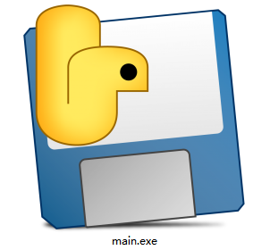
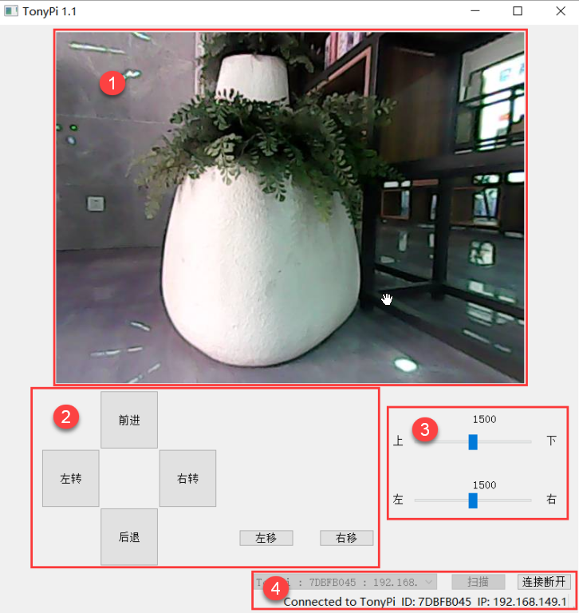
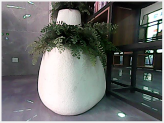
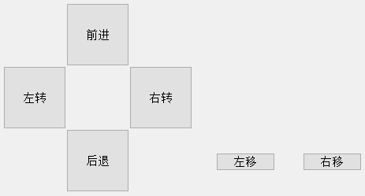
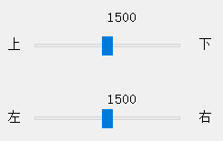
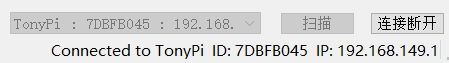

# 7. PC Software Control

## 7.1 PC Software Operation

:::{Note}
Please turn off the APP and VNC connection when run the PC software.
:::

### 7.1.1 Turn on PC Software

Extract the pc control software to file under English path and then open the icon in the file. Please turn off firewall before opening the application.

:::{Note}
If the error message appears, the reason is that the folder is saved by the file contains the Chinese. Please place all files from the software in the English directory.
:::

### 7.1.2 PC Software Connection

(1) Turn on the switch to start TonyPi.

(2) After turning on, Raspberry Pi will be in a AP hotspot mode and launch a Wi-Fi hotspot with a network named with the first letters **"HW"**.

(3) Open PC software, click **"Scan"** and wait for a moment to receive the data as below picture.

(4) Click **"Connect"** after scanning.

## 7.2 Start TonyPi with PC Software

After successful scanning, let's move to the device connection. Then the real-time returned screen will appear at the software.

Next, you can control the movement of the robot by clicking the motion buttons on the left side of the interface. The layout and functions of the main interface are as follows:

* **Function Area Description**

The functions of each area are as shown in the following table:

| Icon | Function area | Function |
|:--:|:--:|:--:|
|  | Image feedback area | Display the returned image |
|  | Body control area | TonyPi operation |
|  | Rotation operation area | Rotation operation |
|  | Connection state area | Scan, connect or turn off the launched hotspot |