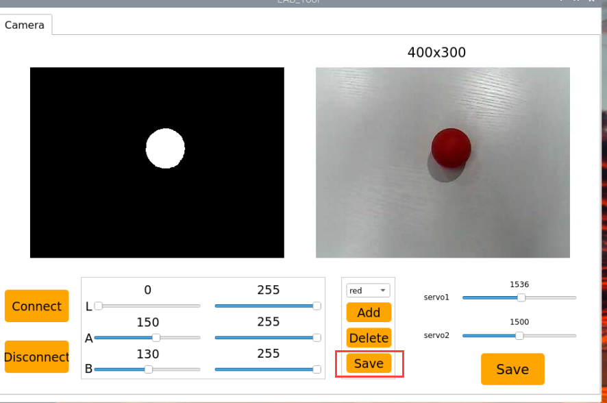

# 5. AI Vision Projects

## 5.1 Single Color Recognition

In this section, the camera detects colors. When a red ball is recognized, the buzzer will emit a beep, and the red ball will be highlighted in the transmitted image with "**Color: red**" displayed.

### 5.1.1 Program Description

The implementation of color recognition consists of two parts: color detection and execution feedback after recognition.

First, for the color detection part, Gaussian filtering is applied to the image to reduce noise. The Lab color space is then used to convert the color of the object (you can learn more about the Lab color space in the  "[**OpenCV Vision Basic Course**](https://docs.hiwonder.com/projects/General_basic_courses/en/latest/docs/4_ros_basics_course.html)" section of the tutorial materials).

Next, the object's color within the circle is recognized using color thresholding, followed by masking (masking involves using selected images, shapes, or objects to globally or locally obscure the image being processed).

After performing morphological operations such as opening and closing on the object image, the object with the largest contour is circled.

Opening: The image undergoes erosion followed by dilation. This operation removes small objects, smooths shape boundaries, and preserves the area. It can eliminate small noise particles and separate connected objects.

Closing: The image undergoes dilation followed by erosion. This operation fills small holes within objects, connects nearby objects, closes broken contour lines, and smooths boundaries while preserving the area.

After recognition, the servo and buzzer are set up to provide feedback based on the detected color. For example, when red is detected, the buzzer will emit a sound.

For detailed feedback behavior, please refer to section [5.1.3 Program Outcome](#anchor_1_3) of this document.

<p id="anchor_1_2"></p>

### 5.1.2 Start and Close the Game

:::{Note}
The input command is case-sensitive, and keywords can be auto-completed using the **Tab** key.
:::

(1)  Power on the robot and use VNC Viewer to connect to the remote desktop.


(2)  Click the icon  in the top left corner of the system desktop or press the shortcut "**Ctrl+Alt+T**" to open the LX terminal.


(3)  Execute the command to navigate to the directory where the program is located, then press Enter:

```bash
cd TonyPi/Functions/
```

(4)  Enter the command and press Enter to start the program:

```bash
python3 Color_Warning.py
```

(5)  To close the program, simply press "**Ctrl+C**" in the LX terminal. If it does not close, press it multiple times.

### 5.1.3 Program Outcome

After starting the game, the camera will be used to detect colors. When a red ball is recognized, the buzzer will emit a beep sound, and the ball will be circled in the transmitted image, with "**Color: red**" printed.

:::{Note}
* During the recognition process, ensure the environment is well-lit to avoid inaccurate recognition due to poor lighting conditions.

* Ensure that no objects with similar or matching colors to the target are present in the background within the camera's visual range, as this may cause misrecognition.
  :::

  

### 5.1.4 Program Analysis

The source code of this program is saved in: [**/home/pi/TonyPi/Functions/Color_Warning.py**](https://store.hiwonder.com.cn/docs/TonyPi/source_code/8/Color_Warning.py)

* **Import Function Library** 

{lineno-start=1}

```python
#!/usr/bin/python3
#coding=utf8
import sys
import os
import cv2
import math
import time
import threading
import numpy as np

import hiwonder.Camera as Camera
import hiwonder.Misc as Misc
import hiwonder.ros_robot_controller_sdk as rrc
import hiwonder.yaml_handle as yaml_handle
```

(1) Import Libraries for OpenCV, Time, Math, and Threading to use functions from a library, we can call them with the syntax:

```python
library_name.function_name(parameter1, parameter2, ...)   
```

To use functions from a library, we can call them with the syntax:
library_name.function_name(parameter1, parameter2, ...) 

{lineno-start=168}

```python
time.sleep(0.01)
```

For example, to call the `sleep` function from the `time` library, we use: 

In Python, several libraries like `time`, `cv2`, and `math` are built-in and can be directly imported and used. You can also create your own libraries, like the `yaml_handle` file-reading library mentioned above.

 (2) Instantiate a Library

Some library names can be long and hard to remember. To simplify function calls, we often instantiate libraries. For example: 

{lineno-start=13}

```python
import hiwonder.ros_robot_controller_sdk as rrc
```

After instantiating the library, we can call functions from the `Board` library using the shorter syntax:  

```
Board.function_name(parameter1, parameter2, ...)
```


This makes it much easier and more convenient to use.

* **Main Function Analysis** 

In a Python program, `__name__ == '__main__'` indicates the main function of the program, where the program starts by reading an image.

{lineno-start=135}

```python
if __name__ == '__main__':
    from CameraCalibration.CalibrationConfig import *
    
    #加载参数(load parameters)
    param_data = np.load(calibration_param_path + '.npz')

    #获取参数(get parameters)
    mtx = param_data['mtx_array']
    dist = param_data['dist_array']
    newcameramtx, roi = cv2.getOptimalNewCameraMatrix(mtx, dist, (640, 480), 0, (640, 480))
    mapx, mapy = cv2.initUndistortRectifyMap(mtx, dist, None, newcameramtx, (640, 480), 5)

    open_once = yaml_handle.get_yaml_data('/boot/camera_setting.yaml')['open_once']
    if open_once:
        my_camera = cv2.VideoCapture('http://127.0.0.1:8080/?action=stream?dummy=param.mjpg')
    else:
        my_camera = Camera.Camera()
        my_camera.camera_open()

    print("Color_Warning Init")
    print("Color_Warning Start")
    
    while True:
        ret, img = my_camera.read()
        if img is not None:
            frame = img.copy()
            frame = cv2.remap(frame, mapx, mapy, cv2.INTER_LINEAR)  # 畸变矫正(distortion correction)
            Frame = run(frame)
            cv2.imshow('Frame', Frame)
            key = cv2.waitKey(1)
            if key == 27:
                break
        else:
            time.sleep(0.01)
    my_camera.camera_close()
    cv2.destroyAllWindows()
```

**(1) Image Processing**

① Function run() for Image Processing.

{lineno-start=77}

```python
def run(img):
    global draw_color
    global color_list
    global detect_color
        
    img_copy = img.copy()
    img_h, img_w = img.shape[:2]

    frame_resize = cv2.resize(img_copy, size, interpolation=cv2.INTER_NEAREST)
    frame_gb = cv2.GaussianBlur(frame_resize, (3, 3), 3)      
    frame_lab = cv2.cvtColor(frame_gb, cv2.COLOR_BGR2LAB)  # 将图像转换到LAB空间(convert image to the LAB space)

    max_area = 0
    color_area_max = None    
    areaMaxContour_max = 0
    
    for i in lab_data:
        if i != 'black' and i != 'white':
            frame_mask = cv2.inRange(frame_lab,
                                     (lab_data[i]['min'][0],
                                      lab_data[i]['min'][1],
                                      lab_data[i]['min'][2]),
                                     (lab_data[i]['max'][0],
                                      lab_data[i]['max'][1],
                                      lab_data[i]['max'][2]))  #对原图像和掩模进行位运算(operate bitwise operation to original image and mask)
```

* Resizing the Image. The image size is resized to facilitate processing.

{lineno-start=85}

```python
    frame_resize = cv2.resize(img_copy, size, interpolation=cv2.INTER_NEAREST)
```

  The first parameter `"img_copy"` is the input image.

  The second parameter `size` specifies the output image size, which can be customized.

  The third parameter `interpolation=cv2.INTER_NEAREST` defines the interpolation method.  

  `INTER_NEAREST`: Nearest-neighbor interpolation.  

  `INTER_LINEAR`: Bilinear interpolation (default if not specified).  

  `INTER_CUBIC`: Bicubic interpolation over a 4x4 pixel neighborhood.  

  `INTER_LANCZOS4`: Lanczos interpolation over an 8x8 pixel neighborhood.
* Convert the Image to LAB Color Space. The `cv2.cvtColor()` function is used for color space conversion.

{lineno-start=86}

```python
    frame_gb = cv2.GaussianBlur(frame_resize, (3, 3), 3)   
```

The first parameter `"frame_resize"` is the image to be converted.

The second parameter `cv2.COLOR_BGR2LAB` converts the image from BGR format to LAB format. To convert to RGB, use `cv2.COLOR_BGR2RGB`.

* Convert the Image to a Binary Image

The image is simplified by converting it to a binary image, containing only 0s and 1s, which reduces the data size and makes it easier to process. The `cv2.inRange()` function is used for thresholding.

{lineno-start=95}

```python
            frame_mask = cv2.inRange(frame_lab,
                                     (lab_data[i]['min'][0],
                                      lab_data[i]['min'][1],
                                      lab_data[i]['min'][2]),
                                     (lab_data[i]['max'][0],
                                      lab_data[i]['max'][1],
                                      lab_data[i]['max'][2]))  #对原图像和掩模进行位运算(operate bitwise operation to original image and mask)
```

The first parameter `"frame_lab"` is the input image.

The second parameter `(lab_data[i]['min'][0], lab_data[i]['min'][1], lab_data[i]['min'][2])` specifies the lower color threshold.

The third parameter `(lab_data[i]['max'][0], lab_data[i]['max'][1], lab_data[i]['max'][2])` specifies the upper color threshold.

* Apply Morphological Operations (Opening and Closing)

To reduce interference and smooth the image, morphological operations are applied. Opening is erosion followed by dilation, and closing is dilation followed by erosion. The `cv2.morphologyEx()` function is used.

{lineno-start=102}

```python
            eroded = cv2.erode(frame_mask, cv2.getStructuringElement(cv2.MORPH_RECT, (3, 3)))  #腐蚀(corrosion)
            dilated = cv2.dilate(eroded, cv2.getStructuringElement(cv2.MORPH_RECT, (3, 3))) #膨胀(dilation)
```

The first parameter `"frame_mask"` is the input image.

The second parameter `cv2.MORPH_OPEN` specifies the morphological operation (options include `cv2.MORPH_ERODE`, `cv2.MORPH_DILATE`, `cv2.MORPH_OPEN`, `cv2.MORPH_CLOSE`).

The third parameter `np.ones((6, 6))` specifies the convolution kernel.

The fourth parameter `np.uint8` defines the number of iterations to apply.

* Find the Largest Contour

After completing the image processing, the largest contour is found using the `cv2.findContours()` function.

{lineno-start=104}

```python
            contours = cv2.findContours(dilated, cv2.RETR_EXTERNAL, cv2.CHAIN_APPROX_NONE)[-2]  #找出轮廓(find out contour)
```

The first parameter `"closed"` is the input image.

The second parameter `cv2.RETR_EXTERNAL` specifies the contour retrieval mode.

The third parameter `cv2.CHAIN_APPROX_NONE)[-2]` specifies the contour approximation method.

The largest contour is selected, and a minimum area threshold is set to ensure the target contour is valid only if its area exceeds this value.

{lineno-start=106}

```python
            if areaMaxContour is not None:
                if area_max > max_area:#找最大面积(find out the maximal area)
                    max_area = area_max
                    color_area_max = i
                    areaMaxContour_max = areaMaxContour
```

* Display the Result

The detected object is circled in the transmitted image, and the detect color is printed.

{lineno-start=132}

```python
    cv2.putText(img, "Color: " + detect_color, (10, img.shape[0] - 10), cv2.FONT_HERSHEY_SIMPLEX, 0.65, draw_color, 2) 
```

* **Display the Transmitted Image**

{lineno-start=157}

```python
    while True:
        ret, img = my_camera.read()
        if img is not None:
            frame = img.copy()
            frame = cv2.remap(frame, mapx, mapy, cv2.INTER_LINEAR)  # 畸变矫正(distortion correction)
            Frame = run(frame)
            cv2.imshow('Frame', Frame)
            key = cv2.waitKey(1)
            if key == 27:
                break
        else:
            time.sleep(0.01)
    my_camera.camera_close()
    cv2.destroyAllWindows()
```

The function `cv2.imshow()` is used to display an image in a window. The first parameter `"frame"` is the name of the window, and the second parameter `"Frame"` is the content to be displayed. 

It is important to include `cv2.waitKey()` after `cv2.imshow()`, as the image will not be displayed without it. 

The function `cv2.waitKey()` waits for a key press, and the parameter `1` specifies the delay time in milliseconds.

### 5.1.5 Function Extension

* **Adjusting Color Thresholds**

If the color recognition performance is poor during the game experience, it may be necessary to adjust the color threshold. This section uses red as an example, and the same method can be applied to adjust other colors. Follow the steps below:

If the color recognition performance is poor during the game experience, it may be necessary to adjust the color threshold. This section uses red as an example, and the same method can be applied to adjust other colors. Follow the steps below:

(1) Double-click , and in the popup interface, click **"Execute."**


(2) Once in the interface, click "**Connect**" to link the camera.

 

(3) After a successful connection, select "**red**" from the color options in the lower-right corner of the interface.

 

(4) If the transmitted image does not appear in the popup window, the camera may not have connected successfully. Check that the camera's connection cable is properly plugged in.

In the interface shown below, the right side displays the real-time transmitted image, while the left side shows the color to be detected. Point the camera at the red ball, then adjust the six sliders at the bottom so that the red ball area on the left turns entirely white, and the other areas turn black. Afterward, click the "**Save**" button to save the settings.

 

## 5.2 Color Recognition

The robot recognizes colors and provides feedback on the recognition result through "**nodding**" or "**shaking**" its head.

### 5.2.1 Program Description

The following is the overall process:

First, program TonyPi to recognize colors with Lab color space. You can go to "[**OpenCV Vision Basic Course**](https://docs.hiwonder.com/projects/General_basic_courses/en/latest/docs/6_opencv.html)" for detailed learning the Lab color space.

Second, identify the object color in the circle using color threshold value, then apply a mask to that part of the image. Masking is the process of using selected images, graphics,

After processing the corrosion and inflation of the object image, the largest object contour is circled.

Corrosion: By iterating through each pixel of the image, check its overlap with the surrounding structural element. If all the overlapping pixel values are 1, then keep the original pixel value unchanged; otherwise, set it to 0. Mainly used to eliminate unimportant edge information in the image, reducing the area of the image.

Inflation: Similar to the inverse process of erosion. This process involves convolving the image with a structural element, calculate the maximum pixel value within the covered area, and assign this maximum value to the pixel specified by the reference point. The inflation expands the highlighted areas in an image gradually, typically used to fill holes or gaps in the image.

Next, judge the recognized color. If the sett color is detected the head servo will be turned up and down, otherwise it will be turned left and right.

### 5.2.2 Start and Close the Game

:::{Note}
Pay attention to the text format in the input of instructions.
:::

(1)  Power on the robot and use VNC Viewer to connect to the remote desktop.

(2)  Double-click "**Terminator**" icon in the Raspberry Pi desktop and open command line.

(3)  Input and press Enter to locate to the directory where the program is stored.

```bash
cd TonyPi/Functions
```

(4) Input command, then press Enter to start the game.

```bash
python3 ColorDetect.py
```

(5) If you want to exit the game programming, press "**Ctrl+C**". If the exit fails, please try it few more times.

### 5.2.3 Project Outcome

:::{Note}
The program defaults to recognizing the color red. To switch to blue or green, refer to "[5.2.5 Function Extension->Modify Default Recognition Color](#anchor_2_4_1)".
:::

Place the red ball in front of the TonyPi. The robot will "**nod**" upon recognition. Place the blue and green balls in front of the TonyPi. The robot will "**shake its head**" upon recognition.


### 5.2.4 Program Analysis

The source code of this program is locate in [/home/pi/TonyPi/Functions/ColorDetect.py](https://store.hiwonder.com.cn/docs/TonyPi/source_code/8/ColorDetect.py)

* **Import Parameter Module** 

| **Import module** | **function** |
|:--:|:--:|
| import sys | The Python "**sys**" module has been imported for accessing system-related functions and variables. |
| import os | The Python "**os**" module has been imported, providing functions and methods for interacting with the operating system. |
| import cv2 | The OpenCV library has been imported for image processing and computer vision-related functionalities. |
| import time | The Python "**time**" module has been imported for time-related functionalities, such as delay operations. |
| import math | The "**math**" module provides low-level access to mathematical operations, including many commonly used mathematical functions and constants. |
| import threading | Provides an environment for running multiple threads concurrently. |
| import np | The NumPy library has been imported. It is an open-source numerical computing extension for Python, used for handling array and matrix operations. |
| import sensor.camera as camera | Import camera library |
| from common import misc | The "**Misc**" module has been imported for handling recognized rectangular data. |
| import common.ros_robot_controller_sdk as rrc | The robot's low-level control library has been imported for controlling servos, motors, RGB lights, and other hardware. |
| import common.yaml_handle | Contains functionalities or tools related to processing YAML format files. |
| from common.controller import Controller | Import action group execution library |

* **Function Logic** 

Capture image information through the camera, then process the image, specifically by performing binarization. At the same time, to reduce interference and make the image smoother, perform erosion and dilation operations on the image.

Next, obtain the largest area contour and minimum enclosing circle of the target, determine the color of the color block and provide corresponding feedback.

* **Program Logic and Related Code Analysis** 

Based on the above diagram, the program's logical flow mainly consists of image processing and color tracking. The following document will be written in accordance with the program logic.

**(1) Import function library**

In this initialization step, the first task is to import the required libraries for subsequent program calls. For details on the imports, refer to [**5.2.5 Program Analysis->Import parameter module**](#anchor_2_5_3).

{lineno-start=1}

```python
#!/usr/bin/python3
# coding=utf8
import sys
import os
import cv2
import math
import time
import threading
import numpy as np
import hiwonder.Camera as Camera
import hiwonder.Misc as Misc
import hiwonder.ros_robot_controller_sdk as rrc
from hiwonder.Controller import Controller
import hiwonder.ActionGroupControl as AGC
import hiwonder.yaml_handle as yaml_handle
```

**(2) Set initial state**

Set initial state, including the initial position of servo, PID, color threshold value, etc.

{lineno-start=76}

```python
def initMove():
    ctl.set_pwm_servo_pulse(1, 1500, 500)
    ctl.set_pwm_servo_pulse(2, servo_data['servo2'], 500)
```

**(3) Image pre-processing**

Resizing and Gaussian blur processing of the image.

{lineno-start=194}

```python
frame_resize = cv2.resize(img_copy, size, interpolation=cv2.INTER_NEAREST)
frame_gb = cv2.GaussianBlur(frame_resize, (3, 3), 3)
```

`cv2.resize(img_copy, size, interpolation=cv2.INTER_NEAREST)` is an operation to resize the image.

The first parameter `img_copy` is the image to be resized.

The second parameter `size` is the target size.

The third parameter `interpolation` is the interpolation method, which is used to determine the pixel interpolation algorithm used for resizing.

`cv2.GaussianBlur(frame_resize, (3, 3), 3)` applies Gaussian blur to the image.

The first parameter `frame_resize` is the image to be blurred.

The second parameter `(3, 3)` is the size of the Gaussian kernel, indicating that the width and height of the kernel are both 3.

The third parameter `3` is the standard deviation of the Gaussian kernel, used to control the degree of blur.

**(4) Color space conversion**

Convert the BGR image to LAB image.

{lineno-start=196}

```python
frame_lab = cv2.cvtColor(frame_gb, cv2.COLOR_BGR2LAB)  
```

**(5) Binarization processing**

Use `inRange()` function in cv2 library to process binarization.

{lineno-start=203}

```python
for i in lab_data:
    if i != 'black' and i != 'white':
        frame_mask = cv2.inRange(frame_lab,
                                 (lab_data[i]['min'][0],
                                  lab_data[i]['min'][1],
                                  lab_data[i]['min'][2]),
                                 (lab_data[i]['max'][0],
                                  lab_data[i]['max'][1],
                                  lab_data[i]['max'][2]))  
```

The first parameter `frame_lab` is inputting image.

The second parameter `lab_data[i]['min'][0]` is the lower limit of the threshold.

The third parameter `lab_data[i]['max'][0]` is the upper limit of the threshold.

**(6) Corrosion and inflation**

{lineno-start=212}

```python
eroded = cv2.erode(frame_mask, cv2.getStructuringElement(cv2.MORPH_RECT, (3, 3)))  
dilated = cv2.dilate(eroded, cv2.getStructuringElement(cv2.MORPH_RECT, (3, 3))) 
```

`eroded = cv2.erode(frame_mask, cv2.getStructuringElement(cv2.MORPH_RECT, (3, 3)))` is the operation to perform corrosion on the binary image.

The first parameter `frame_mask` is the binary image on which morphological operations are to be performed.

The second parameter `cv2.getStructuringElement(cv2.MORPH_RECT, (3, 3))` is the structuring element for the corrosion operation. A rectangular structuring element of size (3, 3) is used here.

The dilation function follows the same principle.

**(7) Get the contour with the largest area**

After completing the above image processing, it is necessary to obtain the contours of the recognized targets. This involves using the "**findContours()**" function from the cv2 library.

{lineno-start=216}

```python
contours = cv2.findContours(dilated, cv2.RETR_EXTERNAL, cv2.CHAIN_APPROX_NONE)[-2]  
```

Take code `contours = cv2.findContours(dilated, cv2.RETR_EXTERNAL, cv2.CHAIN_APPROX_NONE)[-2]` as example:

The first parameter `dilated` is inputting image.

The second parameter `cv2.RETR_EXTERNAL` is the contour retrieval mode.

The third parameter `cv2.CHAIN_APPROX_NONE)[-2]` is the contour approximation method.

Find the contour with the largest area in the obtained contour. In order to avoid interference, you need to set a minimum value. The target contour is considered valid only if its area is greater than this value.

{lineno-start=217}

```python
areaMaxContour, area_max = getAreaMaxContour(contours)  
if areaMaxContour is not None:
    if area_max > max_area:
        max_area = area_max
        color_area_max = i
        areaMaxContour_max = areaMaxContour
```

**(8) Determine the largest color block**

Determine the color of the largest area contour and add the result to the color_list.

{lineno-start=230}

```python
if color_area_max == 'red':  
    color = 1
elif color_area_max == 'green':  
    color = 2
elif color_area_max == 'blue':  
    color = 3
else:
    color = 0
color_list.append(color)
```

**(9) Multiple judgments**

Take the average by multiple judgments, and determine the recognized color.

{lineno-start=240}

```python
    if len(color_list) == 3:  
        color = int(round(np.mean(np.array(color_list))))
        color_list = []
        if color == 1:
            detect_color = 'red'
            draw_color = range_rgb["red"]
        elif color == 2:
            detect_color = 'green'
            draw_color = range_rgb["green"]
        elif color == 3:
            detect_color = 'blue'
            draw_color = range_rgb["blue"]
        else:
            detect_color = 'None'
            draw_color = range_rgb["black"]               
    else:
        detect_color = 'None'
        draw_color = range_rgb["black"]
```

**(10) Print recognized outcome**

Use the `cv2.putText()` function from the cv2 library to draw text on the image.

{lineno-start=260}

```python
    cv2.putText(img, "Color: " + detect_color, (10, img.shape[0] - 10), cv2.FONT_HERSHEY_SIMPLEX, 0.65, draw_color, 2)
```

Take code `cv2.putText(img, "Color: " + detect_color, (10, img.shape\[0\] - 10), cv2.FONT_HERSHEY_SIMPLEX, 0.65, draw_color, 2)` as example:

The first parameter `img` is the image being drawn.

The second parameter `'Color: ' + detect_color` is the information drawn on the image.

The third parameter `(10, img.shape[0] - 10)` is the starting coordinate of the text, i.e., the position of the bottom-left corner of the text. Here, the text is 10 pixels away from the left and bottom edges of the image, respectively.

The fourth parameter `cv2.FONT_HERSHEY_SIMPLEX` is the font type.

The fifth parameter `0.65` is the size scaling factor for the text.

The sixth parameter `draw_color` is the color of the text.

The seventh parameter `2` is the thickness of the text.

**(11) Color recognition**

① After recognizing the red ball, control robot servo 1 to make the robot nod twice continuously, then return to the neutral position as pictured:

{lineno-start=133} 

```python
if __isRunning:
    if detect_color = 'None':
        action_finish = False
        
        if detect_color = 'red':
            ctl.set_pwm_servo_pulse(1, 1800, 200)
            time.sleep(0.2)
            ctl.set_pwm_servo_pulse(1, 1200, 200)
            time.sleep(0.2)
            ctl.set_pwm_servo_pulse(1, 1800, 200)
            time.sleep(0.2)
            ctl.set_pwm_servo_pulse(1, 1200, 200)
            time.sleep(0.2)
            ctl.set_pwm_servo_pulse(1, 1500,1200)
            time.sleep(0.1)
```

Take code `ctl.set_pwm_servo_pulse(1, 1800, 200)` as example:

The first parameter `1` indicates the servo ID being controlled.

The second parameter `1800` represents the pulse width for servo ID 1. 1500 controls the servo to return to the neutral position.

The third parameter `200` represents the servo's movement time, which is 200 milliseconds.

②  After recognizing the green or blue ball, control robot servo 2 to make the robot shake its head twice continuously, then return to the neutral position, as shown in the following figure.

{lineno-start=153}

```python
elif detect_color = 'green' or detect_color = 'blue':
    ctl.set_pwm_servo_pulse(2, 1800, 200)
    time.sleep(0.2)
    ctl.set_pwm_servo_pulse(2, 1200, 200)
    time.sleep(0.2)
    ctl.set_pwm_servo_pulse(2, 1800, 200)
    time.sleep(0.2)
    ctl.set_pwm_servo_pulse(2, 1200, 200)
    time.sleep(0.2)
    ctl.set_pwm_servo_pulse(2, 1500, 100)
    time.sleep(0.1)
    detect_color = 'None'
    draw_color = range_rgb["black"]
    time.sleep(1)
```

### 5.2.5 Function Extension

* **Modify Default Recognition Color** 

Red, green and blue are the built-in colors in the color recognition program and the red is the default color. Then the robot will perform "**nod**".

In the following steps, we're going to modify the recognized color as green.

(1)  Enter command to the directory where the game program is located.

```bash
cd TonyPi/Functions
```

(2) Enter command to go into the game program through vim editor.

```bash
vim ColorDetect.py
```

(3)  Find codes `if detect_color == 'red':` and `elif detect_color == 'green' or detect_color == 'blue':`.


:::{Note} 
After entering the code position number on the keyboard, press "**Shift+G**" to directly locate to the corresponding location. This section aims to introduce quick location methods, so the code position number is for reference only. Please rely on actual positions.
:::

(4) Press"**i**" to enter the editing mode, then modify red in （**if detect_color == 'red'**）to green. And modify red in line 120（**elif detect_color== 'green' or detect_color == 'blue'**）to green. If you want to recognize blue, please revise to "**blue**".

```python
                if detect_color == 'red':
                    ctl.set_pwm_servo_pulse(1, 1800, 200)
                    time.sleep(0.2)
                    ctl.set_pwm_servo_pulse(1, 1200, 200)
                    time.sleep(0.2)
                    ctl.set_pwm_servo_pulse(1, 1800, 200)
                    time.sleep(0.2)
                    ctl.set_pwm_servo_pulse(1, 1200, 200)
                    time.sleep(0.2)
                    ctl.set_pwm_servo_pulse(1, 1500, 100)
                    time.sleep(0.1)
```

(5) Press "**Esc**" to enter last line command mode. Input "**:wq**" to save the file and exit the editor.

```bash
:wq
```


* **Add Recognized Color** 

In addition to the built-in recognized colors, you can set other recognized colors in the programming. Take orange as example:

(1) Open VNC, input command to open Lab color setting document.

```bash
vim TonyPi/lab_config.yaml
```

It is recommended to use screenshot to record the initial value.


(2) Click the debugging tool icon in the system desktop. Choose "**Run**" in the pop-up window.


(3) Click "**Connect**" button in the lower left hand. When the interface display the camera returned image, the connection is successful. Select "**red**" in the right box first.


(4) Drag the corresponding sliders of L, A, and B until the color area to be recognized in the left screen becomes white and other areas become black.

For example, if you want to recognize orange, you can put the orange ball in the camera's field of view. Adjust the corresponding sliders of L, A, and B until the orange part of the left screen becomes white and other colors become black, and then click "**Save**" button to keep the modified data.


(5) After the modification is completed, check whether the modified data was successfully written in. Enter the command again "**vim TonyPi/lab_config.yaml**" to check the color setting parameters.

```bash
vim TonyPi/lab_config.yaml
```


For the game's performance, it's recommended to use the LAB_Tool tool to modify the value back to the initial value after the modification is completed.

(6) Check the data in red frame. If the edited value was written in the program, press "**Esc**" and enter "**:wq**" to save it and exit.

(7) The default recognized color can be set as red according to the [Modify Default Recognition Color](#anchor_2_4_1) in this text.


(8) Start the game again and put the orange ball in front of the camera. TonyPi will perform "**nod**".

## 5.3 Target Position Recognition

In this lesson, the camera will be used to recognize red, green, and blue balls. The detected balls will be highlighted in the live feed, and their XY coordinates will be displayed.

### 5.3.1 Program Description 

The implementation of target tracking can be divided into two parts: color recognition and position marking.

First, for the color recognition part, Gaussian filtering is applied to the image for noise reduction. The Lab color space is then used to convert the color of the objects (for more details on the Lab color space, please refer to the "**[OpenCV Vision Basic Course](https://docs.hiwonder.com/projects/General_basic_courses/en/latest/docs/6_opencv.html)**").

Next, color thresholding is used to identify the color of objects within the circle. The image is then masked (masking involves using a selected image, shape, or object to globally or locally occlude the processed image).

After performing morphological operations (open and close operations) on the object's image, the largest contour is outlined with a circle.

Opening operation: The image is eroded first and then dilated. This operation is used to remove small objects, smooth shape boundaries, and preserve the overall area. It helps remove small noise particles and separate objects that are connected.

Closing operation: The image is dilated first and then eroded. This operation is used to fill small holes within the objects, connect adjacent objects, and reconnect broken contour lines while smoothing the boundaries without changing the area.

Position marking requires specific detection algorithms. The basic principle is to search for areas in the image that match predefined features or patterns, then return the position and bounding box of these areas.

### 5.3.2 Start and Close the Game

:::{Note}
The input of commands must strictly distinguish between uppercase and lowercase letters, as well as spaces. Additionally, you can use the "**Tab**" key on the keyboard to auto-complete keywords.
:::

(1)  Power on the robot and use VNC Viewer to connect to the remote desktop.

(2)  Double-click "**Terminator**" icon in the Raspberry Pi desktop and open command line.

(3)  Input and press Enter to locate to the directory where the program is stored.

```bash
cd TonyPi/Functions
```

(4) Input command, then press Enter to start the game.

```bash
python3 ColorPositionRecognition.py
```

(5) If you want to exit the game programming, press "**Ctrl+C**". If the exit fails, please try it few more times.

### 5.3.3 Program Outcome

The program defaults to recognizing red, green, and blue balls. After recognition, it will highlight the objects in the transmitted image and display their XY coordinates.

:::{Note}
- During the recognition process, ensure the environment is well-lit to avoid inaccurate recognition due to lighting issues.
- Ensure there are no objects with similar or identical colors to the target colors within the camera's field of view to prevent misrecognition.
- If color recognition is inaccurate, refer to the section "[**5.3.5 Function Extension/ Adjusting Color Threshold**](#anchor_5_3_5)" in this document to adjust the color threshold settings.
:::


### 5.3.4 Program Analysis

The source code of this program is locate in [**/home/pi/TonyPi/Functions/ColorPositionRecognition.py**](https://store.hiwonder.com.cn/docs/tonypi_pro/source_code/ai_vision/ColorPositionRecognition.zip)

* **Importing Libraries** 

{lineno-start=1}

```python
#!/usr/bin/python3
# coding=utf8
import sys
import os
import cv2
import math
import time
import numpy as np

import hiwonder.Camera as Camera
import hiwonder.Misc as Misc
import hiwonder.yaml_handle as yaml_handle
```

(1)  Import the necessary libraries, including OpenCV, time, math, threading, and inverse kinematics. To call a function from a library, use the format `LibraryName.FunctionName(Parameters)`. For example:

{lineno-start=168}

```python
time.sleep(0.01)
```

This calls the `sleep` function from the `time` library, which is used for adding delays.
Python comes with several built-in libraries like `time`, `cv2`, `math`, which can be imported directly. You can also create your own libraries, such as the "**yaml_handle**" file reading library.

(2)  Instantiating Libraries  

Sometimes, library names are long and hard to remember. To make function calls more convenient, we often instantiate libraries using shorter names. For example:

{lineno-start=14}

```python
import hiwonder.Misc as Misc
```

After instantiation, functions from the `Board` library can be called as:
Board.FunctionName(Parameters)
This makes calling functions much easier.

* **Main Function Analysis** 

In a Python program, the `if __name__ == '__main__':` block indicates the main function. The program starts by opening the camera and reading the video stream. The `read()` method captures each frame of the image, where the program searches for and marks the color of the ball, then displays the result. The video is displayed through a loop, and once the display is finished, the `release()` function is called to release the resources.

{lineno-start=134}

```python
if __name__ == '__main__':
    from CameraCalibration.CalibrationConfig import *
    from hiwonder.ros_robot_controller_sdk import Board
    board = Board()
    #加载参数
    param_data = np.load(calibration_param_path + '.npz')
    
    #获取参数
    mtx = param_data['mtx_array']
    dist = param_data['dist_array']
```

**(1) Capturing Camera Image**

{lineno-start=149}

```python
my_camera = cv2.VideoCapture('http://127.0.0.1:8080/?action=stream?dummy=param.mjpg')
```

When the program starts, the camera is initialized.

**(2) Image Processing**

① The `run()` function handles image processing.

{lineno-start=75}

```python
def run(img):
    global draw_color
    global color_list
    global detect_color
        
    img_copy = img.copy()
    img_h, img_w = img.shape[:2]

    frame_resize = cv2.resize(img_copy, size, interpolation=cv2.INTER_NEAREST)
    frame_gb = cv2.GaussianBlur(frame_resize, (3, 3), 3) 
```

② Resize the image to make it easier to process.

{lineno-start=83}

```python
frame_resize = cv2.resize(img_copy, size, interpolation=cv2.INTER_NEAREST)
```

The first parameter `img_copy` is the input image.

The second parameter `size` is the size of the output image, which can be set as needed.

The third parameter `interpolation=cv2.INTER_NEAREST` is the interpolation method. Options include:

`INTER_NEAREST`: Nearest-neighbor interpolation.

`INTER_LINEAR`: Bilinear interpolation (default if no other method is specified).

`INTER_CUBIC`: Bicubic interpolation in a 4x4 pixel neighborhood.

`INTER_LANCZOS4`: Lanczos interpolation in an 8x8 pixel neighborhood.

③ Apply Gaussian Blur to reduce noise

Gaussian blur is a linear smoothing filter used to eliminate Gaussian noise and is widely used in image denoising.

{lineno-start=84}

```python
frame_gb = cv2.GaussianBlur(frame_resize, (3, 3), 3)  
```

The first parameter `frame_resize` is the input image.
The second parameter `(3, 3)` is the size of the Gaussian kernel.
The third parameter `3` is the standard deviation of the Gaussian kernel in the X-direction

④ Convert the image to LAB color space.

{lineno-start=85}

```python
frame_lab = cv2.cvtColor(frame_gb, cv2.COLOR_BGR2LAB)
```

The first parameter `frame_gb` is the input image.
The second parameter `cv2.COLOR_BGR2LAB` specifies the conversion from BGR to LAB format. To convert to RGB, use `cv2.COLOR_BGR2RGB`.

⑤ Convert the image to a binary image with only 0s and 1s, simplifying the image and reducing data for easier processing.

The `cv2.inRange()` function is used for binarization:

{lineno-start=93}

```python
frame_mask = cv2.inRange(frame_lab,
                         (lab_data[i]['min'][0],
                          lab_data[i]['min'][1],
                          lab_data[i]['min'][2]),
                         (lab_data[i]['max'][0],
                          lab_data[i]['max'][1],
                          lab_data[i]['max'][2]))  #对原图像和掩模进行位运算
```

The first parameter `frame_lab` is the input image.
The second parameter `(lab_data[i]['min'][0], lab_data[i]['min'][1], lab_data[i]['min'][2])` is the lower threshold for the color.
The third parameter `(lab_data[i]['max'][0], lab_data[i]['max'][1], lab_data[i]['max'][2])` is the upper threshold for the color.

⑥ Perform erosion and dilation to smooth the image and reduce interference.

Erosion reduces the size of foreground objects and eliminates small objects, while dilation increases the size of foreground objects and fills small holes.

{lineno-start=100}

```python
eroded = cv2.erode(frame_mask, cv2.getStructuringElement(cv2.MORPH_RECT, (3, 3)))  #腐蚀
dilated = cv2.dilate(eroded, cv2.getStructuringElement(cv2.MORPH_RECT, (3, 3))) #膨胀
```

⑦ Find the contour with the largest area

After the image processing steps, use the `cv2.findContours()` function to find contours:

{lineno-start=102}

```python
contours = cv2.findContours(dilated, cv2.RETR_EXTERNAL, cv2.CHAIN_APPROX_NONE)[-2]  #找出轮廓
```

The first parameter `dilated` is the input image.

The second parameter `cv2.RETR_EXTERNAL` specifies the contour retrieval mode.

The third parameter `cv2.CHAIN_APPROX_NONE)[-2]` specifies the contour approximation method.

The program searches for the largest contour and sets a threshold area to ensure the detected contour is valid.

{lineno-start=102}

```python
contours = cv2.findContours(dilated, cv2.RETR_EXTERNAL, cv2.CHAIN_APPROX_NONE)[-2]  #找出轮廓
areaMaxContour, area_max = getAreaMaxContour(contours)  #找出最大轮廓
if areaMaxContour is not None:
    if area_max > max_area:#找最大面积
        max_area = area_max
        color_area_max = i
        areaMaxContour_max = areaMaxContour

if max_area > 200:  # 有找到最大面积
```

⑧ Extract the position information

Use `cv2.putText()` to draw text on the image:

{lineno-start=130}

```python
    cv2.putText(img, "Color: " + detect_color, (10, img.shape[0] - 10), cv2.FONT_HERSHEY_SIMPLEX, 0.65, draw_color, 2)
    cv2.putText(img, f"{(centerX, centerY)}", (centerX, centerY - 20), cv2.FONT_HERSHEY_SIMPLEX, 1.0, range_rgb[color_area_max], 2)
```

The first parameter `img` is the input image.

The second parameter `"Color: " + detect_color` is the text to display (e.g., the detected color).

The third parameter `(10, img.shape[0] - 10)` and `(centerX, centerY - 20)` specify the starting coordinates for the text (bottom-left position).

The fourth parameter `cv2.FONT_HERSHEY_SIMPLEX` specifies the font type.

The fifth parameter `0.65` is the scaling factor for the font size.

The sixth parameter `draw_color` is the color of the text.

The seventh parameter `2` specifies the thickness of the text line.

(3) Displaying the Return Image

{lineno-start=157}

```python
while True:
    ret, img = my_camera.read()
    if img is not None:
        frame = img.copy()
        frame = cv2.remap(frame, mapx, mapy, cv2.INTER_LINEAR)  # 畸变矫正
        Frame = run(frame)
        cv2.imshow('Frame', Frame)
        key = cv2.waitKey(1)
        if key == 27:
            break
```

The `cv2.imshow()` function is used to display the image in a window. The first parameter is the window name (e.g., 'Frame'), and the second parameter is the image to display. 

The function `cv2.waitKey()` is used to wait for a key press; the parameter `1` specifies the delay time.

<p id="anchor_5_3_5"></p>

### 5.3.5 Function Extension

* **Adjusting Color Threshold** 

During the game experience, if the color recognition of objects is not accurate, you may need to adjust the color threshold. This section uses adjusting the red color as an example; the process for adjusting other colors is similar. Follow the steps below:

(1) Click the debugging tool icon in the system desktop. Choose "**Execute**" in the pop-up window.


(2)  Once the interface opens, click "**Connect**".


(3)  After a successful connection, select "**red**" from the color options in the bottom-right corner of the interface.


(4)  If the transmitted image does not appear in the pop-up window, it indicates the camera is not connected properly. Check the camera connection cable to ensure it is securely connected.

(5) The image on the right side of the interface shows the real-time transmitted video, and the left side shows the color to be captured.
Point the camera at the red color block, and then adjust the six sliders at the bottom to ensure that the red color block on the left side of the screen turns completely white, while other areas remain black.
Finally, click the "**Save**" button to save the data.



* **Add Recognized Color** 

In addition to the built-in recognized colors, you can set other recognized colors in the programming. Take orange as example:

(1) Open VNC, input command to open Lab color setting document.

```bash
vim TonyPi/lab_config.yaml
```

It is recommended to use screenshot to record the initial value.


(2) Click the debugging tool icon in the system desktop. Choose "**Execute**" in the pop-up window.


(3) Click "**Connect**" button in the lower left hand. When the interface display the camera returned image, the connection is successful. Select "**red**" in the right box first.


(4) Drag the corresponding sliders of L, A, and B until the color area to be recognized in the left screen becomes white and other areas become black.

For example, if you want to recognize orange, you can put the orange ball in the camera's field of view. Adjust the corresponding sliders of L, A, and B until the orange part of the left screen becomes white and other colors become black, and then click "**Save**" button to keep the modified data.


(5) After the modification is completed, check whether the modified data was successfully written in. Enter the command again "**vim TonyPi/lab_config.yaml**" to check the color setting parameters.

```bash
vim TonyPi/lab_config.yaml
```


For the game's performance, it's recommended to use the LAB_Tool tool to modify the value back to the initial value after the modification is completed.

(6) Check the data in red frame. If the edited value was written in the program, press "**Esc**" and enter "**:wq**" to save it and exit.

(7) The default recognized color can be set as red according to the [Modify Default Recognition Color](#anchor_2_4_1) in this text.


(8) Start the game again and put the orange ball in front of the camera. TonyPi will perform "**nod**".

## 5.4 Object Tracking

The robot recognizes colors, and its body can move according to the movement of the target color.

### 5.4.1 Program Description 

First, program TonyPi to recognize colors with Lab color space. Convert the RGB color space to Lab, image binarization, and then perform operations such as expansion and corrosion to obtain an outline containing only the target color. Use circles to frame the color outline to realize object color recognition.

Next, the traversal algorithm compares all correctly recognized colored objects and selects the object with the largest contour area as the target.

Finally, the servo is called to perform real-time tracking, while the body is driven to perform follow-up actions through action groups, thus completing the object tracking function.

### 5.4.2 Start and Close the Game

:::{Note} 
The input of commands must strictly distinguish between uppercase and lowercase letters, as well as spaces. Additionally, you can use the "**Tab**" key on the keyboard to auto-complete keywords.

:::

(1)  Power on the robot and use VNC Viewer to connect to the remote desktop.

(2)  Double-click "**Terminator**" icon  in the Raspberry Pi desktop and open command line.

(3)  Input and press Enter to locate to the directory where the program is stored.

```bash
cd TonyPi/Functions
```

(4) Input command, then press Enter to start the game.

```bash
python3 Follow.py
```

(5) If you want to exit the game programming, press "**Ctrl+C**". If the exit fails, please try it few more times.

### 5.4.3 Program Outcome

:::{Note}
The default recognized and tracking color is green. If you want to change to blue or red, please refer to [**5.4.5 Function Extension -> Modify Default Recognition Color**](#anchor_5_4_5). Furthermore, when moving the handheld colored sponge blocks, the speed should not be too fast, and it should be within the range of camera recognition.
:::

After the gameplay is started, slowly move the red sponge block by hand or place the block on a movable carrier. The TonyPi robot will move along with the movement of the target color.


### 5.4.4 Program Analysis

The source code of this program is locate in [**/home/pi/TonyPi/Functions/Follow.py**](https://store.hiwonder.com.cn/docs/TonyPi/source_code/8/Follow.py)

* **Color detection parameter** 

In the object tracking program, the detected object color is red.

{lineno-start=287}

```python
if __name__ == '__main__':
    init()
    start()
    __target_color = ('red')
    
    open_once = yaml_handle.get_yaml_data('/boot/camera_setting.yaml')['open_once']
    if open_once:
        my_camera = cv2.VideoCapture('http://127.0.0.1:8080/?action=stream?dummy=param.mjpg')
    else:
        my_camera = Camera.Camera()
        my_camera.camera_open() 
    AGC.runActionGroup('stand')
```

The main detection parameters involved in the detection process are as follows:

(1) Before converting the image to the LAB color space, noise reduction processing is required. The `GaussianBlur()` function is used for Gaussian filtering as pictured:

{lineno-start=206}

```python
    frame_lab = cv2.cvtColor(frame_gb, cv2.COLOR_BGR2LAB)  # 将图像转换到LAB空间(convert the image to LAB space)
```

The first parameter `frame_resize` is inputting image.

The second parameter `(3, 3)` is the size of the Gaussian kernel. A larger kernel size typically results in a greater degree of filtering, making the output image more blurry, and it also increases computational complexity.

The third parameter `3` is the standard deviation of the Gaussian function along the X direction. In the Gaussian filter, it is used to control the variation near its mean. If this value is increased, the allowable range of variation around the mean is also increased; if decreased, the allowable range of variation around the mean is reduced.

(2) By using the "**inRange**" function to perform binaryzation on the input image as pictured:

{lineno-start=213}

```python
            frame_mask = cv2.inRange(frame_lab,
                                     (lab_data[i]['min'][0],
                                      lab_data[i]['min'][1],
                                      lab_data[i]['min'][2]),
                                     (lab_data[i]['max'][0],
                                      lab_data[i]['max'][1],
                                      lab_data[i]['max'][2]))  #对原图像和掩模进行位运算(operate bitwise operation to original image and mask)
```

(3) To reduce interference and make the image smoother, it is necessary to perform erosion and dilation operations on the image  

{lineno-start=220}

```python
            eroded = cv2.erode(frame_mask, cv2.getStructuringElement(cv2.MORPH_RECT, (3, 3)))  #腐蚀(corrosion)
            dilated = cv2.dilate(eroded, cv2.getStructuringElement(cv2.MORPH_RECT, (3, 3))) #膨胀(dilation)
```

In the processing, the `getStructuringElement` function is used to generate structuring elements of different shapes.

The first parameter `cv2.MORPH_RECT` is the shape of the kernel, which is a rectangle in this case.

The second parameter `(3, 3)` is the size of the rectangle, which is 3x3 in this case.

(4) Find out the largest contour of the object

{lineno-start=223}

```python
            areaMaxContour, area_max = getAreaMaxContour(contours)  # 找出最大轮廓(find out the contour with the largest area)
    if areaMaxContour is not None and area_max > 100:  # 有找到最大面积(the maximal area is found)
        rect = cv2.minAreaRect(areaMaxContour)#最小外接矩形(the minimum bounding rectangle)
        box = np.int0(cv2.boxPoints(rect))#最小外接矩形的四个顶点(the four vertices of the minimum bounding rectangle)
```

To avoid interference, the `if area_max_contour is not None and area_max > 100` instruction is used to ensure that only contours with an area greater than 100 are considered valid for the largest area.

* **Color recognition parameter** 

The main control parameters involved in the color recognition process are as follows:

(1) When the robot detects a colored object, use the "**cv2.drawContours()**" function to draw the contour of the colored object 

{lineno-start=231}

```python
        cv2.drawContours(img, [box], -1, (0,255,255), 2)#画出四个点组成的矩形(draw the rectangle formed by the four points)
```

The first parameter `img` is inputting image.

The second parameter `[box]` is the contour itself, represented as a list in Python.

The third parameter `-1` is the index of the contour, where the numerical value represents drawing all contours within the list.

The fourth parameter `(0, 255, 255)` is the contour color, with the order being B, G, R, and in this case, it represents yellow.

The fifth parameter `2` is the contour width. If set to `-1`, it means to fill the contour with the specified color.

(2) After the robot detects a colored object, use the `cv2.circle()` function to draw the center point of the colored object on the feedback screen.

{lineno-start=237}

```python
        cv2.circle(img, (centerX, centerY), 5, (0, 255, 255), -1)#画出中心点(draw the center point)
```

The first parameter `img` is the input image, which is the image of the detected colored object in this case.

The second parameter `(centerX, centerY)` is the coordinates of the center point of the circle to be drawn (determined based on the detected object).

The third parameter `5` is the radius of the circle to be drawn.

The fourth parameter `(0, 255, 255)` is the color of the circle to be drawn, with the order being B, G, R, and in this case, it represents yellow.

The fifth parameter `-1` indicates that the circle should be filled with the color specified in parameter 4. If it is a number, it represents the line width of the circle to be drawn.

* **Perform motion parameter** 

(1) After detecting a red object, control servo 1 and servo 2 of the robot to move the upper camera with the movement of the red object.

{lineno-start=268}

```python
        # 计算使用时间(calculate use time)
        use_time = round(max(use_time, abs(dy*0.00025)), 5)
        y_dis += dy
        
        # 将控制头部垂直移动的舵机位置限制在预设范围内(limit the position of the servo controlling vertical movement of the head within a predefined range)
        y_dis = servo_data['servo1'] if y_dis < servo_data['servo1'] else y_dis
        y_dis = 2000 if y_dis > 2000 else y_dis    
        
        ctl.set_pwm_servo_pulse(1, y_dis, use_time*1000)
        ctl.set_pwm_servo_pulse(2, x_dis, use_time*1000)

        time.sleep(use_time)
    else:
        centerX, centerY = -1, -1
```

Take code `ctl.set_pwm_servo_pulse(1, vertical_servo_position,use_time*1000)` as example:

The first parameter `1` represents controlling servo ID 1.

The second parameter `vertical_servo_position` represents the pulse width of servo ID 1.

The third parameter `use_time*1000` represents the movement time of the servo, in milliseconds.

(2) After detecting the red ball, the robot calls the action group file in the "**/home/pi/TonyPi/ActionGroups**" directory to control the robot to move along with the red object as pictured:

{lineno-start=168}

```python
def move():
    
    while True:
        if __isRunning:
            if centerX >= 0:
                if centerX - CENTER_X > 100 or x_dis - servo_data['servo2'] < -80:  # 不在中心，根据方向让机器人转向一步(if not centered, instruct the robot to turn one step in the appropriate direction)
                    AGC.runActionGroup('turn_right_small_step')
                elif centerX - CENTER_X < -100 or x_dis - servo_data['servo2'] > 80:
                    AGC.runActionGroup('turn_left_small_step')                        
                elif 100 > circle_radius > 0:
                    AGC.runActionGroup('go_forward')
                elif 180 < circle_radius:
                    AGC.runActionGroup('back_fast')
            else:
                time.sleep(0.01)
        else:
            time.sleep(0.01)
```

<p id="anchor_5_4_5"></p>

### 5.4.5 Function Extension

* **Modify Default Recognition Color** 

Red, green and blue are the built-in colors in the color recognition program and the red is the default color. Then the robot will perform "**nod**".

In the following steps, we're going to modify the recognized color as green.

(1)  Enter command to the directory where the game program is located.

```bash
cd TonyPi/Functions
```

(2) Enter command to go into the game program through vim editor.

```bash
vim Follow.py
```

(3)  Find codes "**if detect_color == 'red':**" and "**elif detect_color == 'green' or detect_color == 'blue':**".


:::{Note} 
After entering the code position number on the keyboard, press "**Shift+G**" to directly locate to the corresponding location. This section aims to introduce quick location methods, so the code position number is for reference only. Please rely on actual positions.
:::

(4) Press "**i**" to enter the editing mode, then modify red in （**if detect_color == 'red'**）to green. And modify red in line 120（**elif detect_color== 'green' or detect_color == 'blue'**）to green. If you want to recognize blue, please revise to "**blue**".

```python
    if detect_color == 'red':
    	ctl.set_pwm_servo_pulse(1, 1800, 200)
    	time.sleep(0.2)
    	ctl.set_pwm_servo_pulse(1, 1200, 200)
    	time.sleep(0.2)
    	ctl.set_pwm_servo_pulse(1, 1800, 200)
    	time.sleep(0.2)
    	ctl.set_pwm_servo_pulse(1, 1200, 200)
    	time.sleep(0.2)
    	ctl.set_pwm_servo_pulse(1, 1500, 100)
    	time.sleep(0.1)
```

(5) Press "**Esc**" to enter last line command mode. Input "**:wq**" to save the file and exit the editor.

```bash
:wq
```


* **Add Recognized Color** 

In addition to the built-in recognized colors, you can set other recognized colors in the programming. Take orange as example:

(1) Open VNC, input command to open Lab color setting document.

```bash
vim TonyPi/lab_config.yaml
```

It is recommended to use screenshot to record the initial value.


(2) Click the debugging tool icon in the system desktop. Choose "**Execute**" in the pop-up window.


(3) Click "**Connect**" button in the lower left hand. When the interface display the camera returned image, the connection is successful. Select "**red**" in the right box first.


(4) Drag the corresponding sliders of L, A, and B until the color area to be recognized in the left screen becomes white and other areas become black.

For example, if you want to recognize orange, you can put the orange ball in the camera's field of view. Adjust the corresponding sliders of L, A, and B until the orange part of the left screen becomes white and other colors become black, and then click "**Save**" button to keep the modified data.


(5) After the modification is completed, check whether the modified data was successfully written in. Enter the command again "**vim TonyPi/lab_config.yaml**" to check the color setting parameters.

```bash
vim TonyPi/lab_config.yaml
```


For the game's performance, it's recommended to use the LAB_Tool tool to modify the value back to the initial value after the modification is completed.

(6) Check the data in red frame. If the edited value was written in the program, press "**Esc**" and enter "**:wq**" to save it and exit.

(7) The default recognized color can be set as red according to the [5.4.5 Function Extension -> Modify Default Recognition Color](#anchor_2_4_1) in this text.


(8) Start the game again and put the orange ball in front of the camera. TonyPi will perform "**nod**".

## 5.5 Auto Shooting

:::{Note}
please use the assorted balls for operation. If you have your own balls, we recommend using one with a diameter of 3cm.
:::

Place the red ball in the area recognized by the robot's camera. The robot will adjust its position according to the ball's location, and then kick the ball away.

### 5.5.1 Program Description 

Below are the details:

First, program TonyPi to recognize colors with Lab color space. You can go to "**[OpenCV Basic Lesson]()**" for detailed learning of Lab color space.

Second, identify the object color in the circle using color threshold value, then apply a mask to that part of the image. Masking is the process of using selected images, graphics, or objects to globally or locally obscure parts of the processed image.
After the opening and closing operations on the object image, the largest object contour is circled.

Corrosion: By iterating through each pixel of the image, check its overlap  with the surrounding structural element. If all the overlapping pixel values are 1, then keep the original pixel value unchanged; otherwise, set it to 0. Mainly  used to eliminate unimportant edge information in the image, reducing the area  of the image.

Inflation: Similar to the inverse process of erosion. This process involves convolving the image with a structural element, calculate the maximum pixel value within the covered area, and assign this maximum value to the pixel specified by the reference point. The inflation expands the highlighted areas in an image gradually, typically used to fill holes or gaps in the image.

Then, judge whether the object is in the central position after receiving the image feedback.  If  yes,  call  TonyPi  to  move  forward  to  the  target  until  it reaches the set range, and then execute the shooting action; otherwise, the robot will move left or right to the center of the target first

### 5.5.2 Start and Close the Game

:::{Note}
The input of commands must strictly distinguish between uppercase and lowercase letters, as well as spaces. Additionally, you can use the "**Tab**" key on the keyboard to auto-complete keywords.
:::

(1)  Power on the robot and use VNC Viewer to connect to the remote desktop.

(2)  Double-click "**Terminator**" icon  in the Raspberry Pi desktop and open command line.

(3)  Input and press Enter to locate to the directory where the program is stored.

```bash
cd TonyPi/Functions
```

(4) Input command, then press Enter to start the game.

```bash
python3 KickBall.py
```

(5) If you want to exit the game programming, press "**Ctrl+C**". If the exit fails, please try it few more times.

### 5.5.3 Program Outcome

:::{Note}
Please use the robot and ball on the flat surface.
:::

Place the red ball in front of the TonyPi. After recognition, the robot will adjust its position to close the ball and kick it forward.


<p id="anchor_5_4_5"></p>

### 5.5.4 Program Analysis

The source code of this program is locate in [/home/pi/TonyPi/Functions/KickBall.py](https://store.hiwonder.com.cn/docs/TonyPi/source_code/8/Follow.py)

* **Import Parameter Module** 

  |               **Import module**               |                         **function**                         |
  | :-------------------------------------------: | :----------------------------------------------------------: |
  |                  import sys                   | The Python "**sys**" module has been imported for accessing system-related functions and variables. |
  |                   import os                   | The Python "**os**" module has been imported, providing functions and methods for interacting with the operating system. |
  |                  import cv2                   | The OpenCV library has been imported for image processing and computer vision-related functionalities. |
  |                  import time                  | The Python "**time**" module has been imported for time-related functionalities, such as delay operations. |
  |                  import math                  | The "**math**" module provides low-level access to mathematical operations, including many commonly used mathematical functions and constants. |
  |               import threading                | Provides an environment for running multiple threads concurrently. |
  |                   import np                   | The NumPy library has been imported. It is an open-source numerical computing extension for Python, used for handling array and matrix operations. |
  |        import sensor.camera as camera         |                    Import camera library                     |
  |            from common import misc            | The "**Misc**" module has been imported for handling recognized rectangular data. |
  | import common.ros_robot_controller_sdk as rrc | The robot's low-level control library has been imported for controlling servos, motors, RGB lights, and other hardware. |
  |           import common.yaml_handle           | Contains functionalities or tools related to processing YAML format files. |
  |   from common.controller import Controller    |            Import action group execution library             |

* **Function Logic** 

Capture image information through the camera, then process the image,specifically by performing b inarization. At the same time, to reduce

interference and make the image smoother, perform erosion and dilation operations on the image.

Next, obtain the largest area contour and minimum enclosing circle of the target, retrieve the center point coordinates of the color block, and then call the action group to kick the ball.

* **Program Logic and Related Code Analysis** 

**(1) Initialization**

**① Import function library**

In this initialization step, the first task is to import the required libraries for subsequent program calls. For details on the imports, refer to [**5.5.4 Program Analysis->Import parameter module**](#anchor_5_4_5) .

{lineno-start=1}

```python
#!/usr/bin/python3
# coding=utf8
import sys
import os
import cv2
import time
import math
import threading
import numpy as np

import hiwonder.PID as PID
import hiwonder.Misc as Misc
import hiwonder.Camera as Camera
import hiwonder.ros_robot_controller_sdk as rrc
from hiwonder.Controller import Controller
import hiwonder.ActionGroupControl as AGC
import hiwonder.yaml_handle as yaml_handle
```

**② Set initial state**

Set initial state, including the initial position of servo, PID, color threshold value, etc.

{lineno-start=120}

```python
# 设置舵机位置(set the servo position)
x_dis = servo_data['servo2']
y_dis = servo_data['servo1']
```

{lineno-start=80}

```python
# 设置需要检测的球的颜色，默认为红色(set the color of the ball to be detected, defaulting to red)
__target_color = ('red')
```

{lineno-start=124}

```python
# 初始化机器人上一步的状态(initialize the previous state of the robot)
last_status = ''

# 初始化开始计时的标志量(initialize the flag variable for starting the timer)
start_count= True

# 初始化球的中心坐标(initialize the center coordinates of the ball)
CenterX, CenterY = -2, -2

# 初始化 PID 控制器(initialize PID controller)
x_pid = PID.PID(P=0.145, I=0.00, D=0.0007)
y_pid = PID.PID(P=0.145, I=0.00, D=0.0007)
```

**(2) Image processing**

**① Image pre-processing**

Resizing and Gaussian blur processing of the image.

{lineno-start=372}

```python
    # 重新调整图像大小(resize the image)
    frame_resize = cv2.resize(img_copy, size, interpolation=cv2.INTER_NEAREST)
    # 高斯模糊(Gaussian blur)
    frame_gb = cv2.GaussianBlur(frame_resize, (3, 3), 3)
```

`cv2.resize(img_copy, size, interpolation=cv2.INTER_NEAREST)`   is an operation to resize the image.

The first parameter ` img_copy` is the image to be resized. The second parameter "**size**" is the target size.

The third parameter ` interpolation` is the interpolation method, which is used to determine the pixel interpolation algorithm used for resizing.
`cv2.GaussianBlur(frame_resize, (3, 3), 3)` applies Gaussian blur to the image.

The first parameter `frame_resize` is the image to be blurred.

The second parameter `(3, 3)` is the size of the Gaussian kernel, indicating that the width and height of the kernel are both 3.

The third parameter `3` is the standard deviation of the Gaussian kernel, used to control the degree of blur.

**② Color space conversion**

Convert the BGR image to LAB image.

{lineno-start=376}

```python
    # 将图像转换到LAB色彩空间(convert the image to LAB color space)
    frame_lab = cv2.cvtColor(frame_gb, cv2.COLOR_BGR2LAB)  
```

**③ Binarization processing**

Use  `inRange()`  function in cv2 library to process b inarization.

{lineno-start=384}

```python
if i in lab_data:
    #对原图像和掩模进行位运算(perform bitwise operation to original image and mask)
    frame_mask = cv2.inRange(frame_lab,
                                 (lab_data[i]['min'][0],
                                  lab_data[i]['min'][1],
                                  lab_data[i]['min'][2]),
                                 (lab_data[i]['max'][0],
                                  lab_data[i]['max'][1],
                                  lab_data[i]['max'][2]))
```

The first parameter `frame_lab` is inputting image.
The second parameter `lab_data[i]['min'][0]` is the lower limit of the threshold.
The third parameter `lab_data[i]['max'][0]` is the upper limit of the threshold.

**④ Corrosion and inflation**

{lineno-start=393}

```python
eroded = cv2.erode(frame_mask, cv2.getStructuringElement(cv2.MORPH_RECT, (3, 3)))  #腐蚀
dilated = cv2.dilate(eroded, cv2.getStructuringElement(cv2.MORPH_RECT, (3, 3)))    #膨胀
```

`eroded = cv2.erode(frame_mask,
cv2.getStructuringElement(cv2.MORPH_RECT, (3, 3)))` is the operation to perform corrosion on the binary image.
The first parameter `frame_mask` is the binary image on which morphological operations are to be performed.
The second parameter `cv2.getStructuringElement(cv2.MORPH_RECT, (3, 3))` is the structuring element for the corrosion operation. A rectangular structuring element of size (3, 3) is used here.
The dilation function follows the same principle.

**⑤ Get the contour with the largest area**

After completing the above image processing, it is necessary to obtain the contours of the recognized targets. This involves using the`findContours()`

function from the cv2 library.

{lineno-start=399}

```python
contours = cv2.findContours(dilated, cv2.RETR_EXTERNAL, cv2.CHAIN_APPROX_NONE)[-2]  # 找出轮廓(find out the contour)
```

Take code `contours = cv2.findContours(dilated, cv2.RETR_EXTERNAL, cv2.CHAIN_APPROX_NONE)[-2]` as example:
The first parameter `dilated` is inputting image.
The second parameter `cv2.RETR_EXTERNAL` is the contour retrieval mode.
The third parameter `cv2.CHAIN_APPROX_NONE)[-2]` is the contour approximation method.
Find the contour with the largest area in the obtained contour. In order to avoid interference, you need to set a minimum value. The target contour is considered valid only if its area is greater than this value.

{lineno-start=401}

```python
areaMaxContour, area_max = get_area_maxContour(contours)  #找出最大轮廓
if areaMaxContour is not None:
    if area_max > max_area: #找最大面积
        max_area = area_max
        color_area_max = i
        areaMaxContour_max = areaMaxContour
```

**⑥ Get color block center point coordinates**

Using the misc function, map the x and y coordinates of the object center and the radius from the original size range to the range of the new image size ('img_w' and ' img_h'). And use the `cv2.circle` function to identify the color block by circling it.

{lineno-start=408}

```python
        # 将球的中心坐标和半径映射回原始图像尺寸(map the center coordinates and radius of the ball back to the original image size)
        CenterX = int(Misc.map(CenterX, 0, size[0], 0, img_w))
        CenterY = int(Misc.map(CenterY, 0, size[1], 0, img_h))
        radius = int(Misc.map(radius, 0, size[0], 0, img_w))
```

**(3) Auto shooting**

① If a ball is detected, the program will initialize sub-steps and step sizes, and set the timer start flag. If the ball is not in the center of the frame, the robot's  orientation will be adjusted based on the ball's position, and the corresponding turning action will be executed until the ball is in the center of the frame.

{lineno-start=215}

```python
            if CenterX >= 0:      # 如果检测到了球(if a ball is detected)
                step_ = 1                      
                d_x, d_y = 20, 20
                start_count= True            # 开始计时标志置为True，在后面找不到球的情况下使用(set the flag for starting the timer to True, for use when the ball is not found later on)
               
                if step == 1:      
                    # 球不在画面中心，则根据方向让机器人转向一步，直到满足条件进入步骤2(if the ball is not in the center of the frame, instruct the robot to turn one step in the appropriate direction until the condition is met to enter step 2)
                    if x_dis - servo_data['servo2'] > 150:
                        AGC.runActionGroup('turn_left_small_step')
                    elif x_dis - servo_data['servo2'] < -150:
                        AGC.runActionGroup('turn_right_small_step')
                    else:
                        step = 2
```

② If the vertical servo position  equals  the  set  position,  adjust  the  robot's movement based on the current horizontal servo  position.  If the  horizontal servo position is 400 units to the left or right of the set position, execute the corresponding turning action. If the ball is above the center of the frame, move forward one step. If the ball is below the center of the frame, move forward. If the ball is below the center of the frame and the horizontal servo position differs from the set position by no more than 200 units, move forward quickly; otherwise, execute the third step action.

{lineno-start=229}

```python
                elif step == 2:
                    # 当控制头部垂直运动的舵机位置等于设定的位置(when the position of the servo controlling vertical movement of the head equals the set position)
                    if y_dis == servo_data['servo1']:     
                        # 根据当前水平舵机位置调整机器人运动(adjust the robot's movement based on the current position of the horizontal servo)
                        if x_dis == servo_data['servo2'] - 400:
                            AGC.runActionGroup('turn_right',2)
                        elif x_dis == servo_data['servo2'] + 400:
                            AGC.runActionGroup('turn_left',2)
                        elif 350 < CenterY <= 380:    # ball_center_y值越大，与球的距离越近(the larger the value of ball_center_y, the closer the distance to the ball)
                            AGC.runActionGroup('go_forward_one_step')
                            last_status = 'go'        # 记录上一步的状态是往前走(record that the previous step was moving forward)
                            step = 1
                        elif 120 < CenterY <= 350:
                            AGC.runActionGroup('go_forward')
                            last_status = 'go'
                            step = 1
                        elif 0 <= CenterY <= 120 and abs(x_dis - servo_data['servo2']) <= 200:
                            AGC.runActionGroup('go_forward_fast')
                            last_status = 'go'
```

③ In step three, if the vertical servo position equals the set position, adjust the  robot's position based on the horizontal position of the ball in the frame. If the   horizontal position of the ball deviates from the center of the frame by less than or equal to 40 units, move left. If the horizontal position of the ball is to the left  of the center of the frame and the deviation is greater than 40 units, move
quickly to the left. If the horizontal position of the ball is to the right of the center  of the frame and the deviation is greater than 40 units, move quickly to the right; otherwise, execute the fourth step action.

If the vertical servo position is not equal to the set position, adjust based on the difference between the horizontal servo position and the set position: If the difference is between 270 and 480, move quickly to the left. If the difference is  less than 170, move left. If the difference is between -480 and -270, move quickly to the right; otherwise, execute the fourth step action.

{lineno-start=261}

```python
                elif step == 3:
                    if y_dis == servo_data['servo1']:
                        # 根据球在画面的x坐标左右平移调整位置(adjust the position based on the horizontal movement of the ball in the frame)
                        if abs(CenterX - CENTER_X) <= 40:
                            AGC.runActionGroup('left_move')
                        elif 0 < CenterX < CENTER_X - 50 - 40:
                            AGC.runActionGroup('left_move_fast')
                            time.sleep(0.2)
                        elif CENTER_X + 50 + 40 < CenterX:                      
                            AGC.runActionGroup('right_move_fast')
                            time.sleep(0.2)
                        else:
                            step = 4 
                    else:
                        if 270 <= x_dis - servo_data['servo2'] < 480:
                            AGC.runActionGroup('left_move_fast')
                            time.sleep(0.2)
                        elif abs(x_dis - servo_data['servo2']) < 170:
                            AGC.runActionGroup('left_move')
                        elif -480 < x_dis - servo_data['servo2'] <= -270:                      
                            AGC.runActionGroup('right_move_fast')
                            time.sleep(0.2)
                        else:
                            step = 4   
```

④ In step four, if the vertical servo position equals the set position, execute the following operations: If the vertical position of the ball is between 380 and 440, move forward one small step. If the vertical position of the ball is between 0 and 380, move forward; otherwise, based on the horizontal position of the ball, determine which foot to use for the shooting action. If the horizontal position of the ball is to the left of the center of the frame, use the left foot for a quick shot;

otherwise, use the right foot for a quick shot and reset the main step to 1. If the vertical servo position is not equal to the set position, reset the main step to 1.

{lineno-start=285}


```python
                elif step == 4:
                    if y_dis == servo_data['servo1']:
                        # 小步伐靠近到合适的距离(take small steps to approach the appropriate distance)
                        if 380 < CenterY <= 440:
                            AGC.runActionGroup('go_forward_one_step')
                            last_status = 'go'
                        elif 0 <= CenterY <= 380:
                            AGC.runActionGroup('go_forward')
                            last_status = 'go'
                        else:   # 根据最后球的x坐标，采用离得近的脚去踢球(use the closest foot to kick the ball based on the final x coordinates of the ball)
                            if CenterX < CENTER_X:
                                AGC.runActionGroup('left_shot_fast')
                            else:
                                AGC.runActionGroup('right_shot_fast')
                            step = 1
                    else:
                        step = 1
```

⑤ If the ball is not detected, check if the robot's previous state was "**moving forward**" . If it was, then quickly step back one step. If the timer has already started, reset the timer flag to False and record the current time as the start time for the timer. Otherwise, if the time since the last start of timing exceeds 0.5 seconds, perform the following operations based on the sub-step:
If the sub-step is 5, move the horizontal servo position. If the deviation  between the horizontal servo position and the set position is less than or equal  to the absolute value of the horizontal step size, perform the action to turn right, and reset the sub-step to 1.
If  the  sub-step  is   1  or  3,  move  the  horizontal  servo  position.  If  the horizontal servo position exceeds the set position plus 400, reset the sub-step to 2, and invert the horizontal step size. If the horizontal servo position is less than  the  set  position  minus  400,  reset  the  sub-step  to  4,  and  invert  the horizontal step size.
If the sub-step is 2 or 4, move the vertical servo position. If the vertical servo  position exceeds 1200, reset the sub-step to 3, and invert the vertical step size. If the vertical servo position is less than the set position, reset the sub-step to 5, and invert the vertical step size. Finally, set the servo pulse width to the vertical  servo position and horizontal servo position, then sleep for 0.02 seconds.

{lineno-start=303}

```python
            elif CenterX == -1:   # 如果没检测到球(if no ball is detected)
                # 如果机器人上次状态为"前进"，快速后退一步(if the robot's previous state was "forward," quickly take one step backward)
                if last_status == 'go':
                    last_status = ''
                    AGC.runActionGroup('back_fast', with_stand=True)                   
                elif start_count:  # 开始计时的标志变量为True(set the flag variable for starting the timer to True)
                    start_count= False
                    t1 = time.time()    # 记录当前的时间，开始计时(record the current time and start the timer)
                else:
                    if time.time() - t1 > 0.5:
                        
                        if step_ == 5:
                            x_dis += d_x
                            if abs(x_dis - servo_data['servo2']) <= abs(d_x):
                                AGC.runActionGroup('turn_right')
                                step_ = 1
                        if step_ == 1 or step_ == 3:
                            x_dis += d_x            
                            if x_dis > servo_data['servo2'] + 400:
                                if step_ == 1:
                                    step_ = 2
                                d_x = -d_x
                            elif x_dis < servo_data['servo2'] - 400:
                                if step_ == 3:
                                    step_ = 4
                                d_x = -d_x
                        elif step_ == 2 or step_ == 4:
                            y_dis += d_y
                            if y_dis > 1200:
                                if step_ == 2:
                                    step_ = 3
                                d_y = -d_y
                            elif y_dis < servo_data['servo1']:
                                if step_ == 4:                                
                                    step_ = 5
                                d_y = -d_y
                        ctl.set_pwm_servo_pulse(1, y_dis, 20)
                        ctl.set_pwm_servo_pulse(2, x_dis, 20)
                        
                        time.sleep(0.02)
```

### 5.5.5 Function Extension

* **Modify Default Recognition Color** 

Red, green and blue are the built-in colors in the auto shooting program and red is the default color. In the following steps, we're going to modify the recognized color as green.

(1)  Enter command to the directory where the game program is located.

```bash
cd TonyPi/Functions
```

(2) Enter command to go into the game program through vim editor.

```bash
vim KickBall.py
```

(3)  Locate code "**ball_color = ('red')**".


:::{Note}
After entering the code position number on the keyboard, press "**Shift+G**" to directly  locate to the corresponding  location. This section  aims to  introduce quick location methods, so the code position number is for reference only. Please rely on actual positions.
:::

(4)  Press "**i**" to enter the editing mode, then modify red in ball_color = ('red') to green. If you want to recognize blue, please revise to "**blue**" .


(5)  Press "**Esc**" to enter last line command mode. Input "**:wq**" to save the file and exit the editor. Input English at first, then input wq.

```bash
:wq
```

* **Add Recognized Color** 

In addition to the built-in recognized colors, you can set other recognized colors in the programming. Take orange as example:

(1) Open VNC, input command to open Lab color setting document.

```bash
vim TonyPi/lab_config.yaml
```

It is recommended to use screenshot to record the initial value.


(2) Click the debugging tool icon in the system desktop. Choose "**Execute**" in the pop-up window.


(3) Click "**Connect**" button in the lower left hand. When the interface display the camera returned image, the connection is successful. Select "**red**" in the right box first.


(4) Drag the corresponding sliders of L, A, and B until the color area to be recognized in the left screen becomes white and other areas become black.

For example, if you want to recognize orange, you can put the orange ball in the camera's field of view. Adjust the corresponding sliders of L, A, and B until the orange part of the left screen becomes white and other colors become black, and then click "**Save**" button to keep the modified data.


(5) After the modification is completed, check whether the modified data was successfully written in. Enter the command again "**vim TonyPi/lab_config.yaml**" to check the color setting parameters.

  ```bash
vim TonyPi/lab_config.yaml
  ```


For the game's performance, it's recommended to use the LAB_Tool tool to modify the value back to the initial value after the modification is completed.

(6) Check the data in red frame. If the edited value was written in the program, press "**Esc**" and enter "**:wq**" to save it and exit.

(7) The default recognized color can be set as red according to the [5.5.5 Function Extension -> Modify Default Recognition Color](#anchor_2_4_1) in this text.


(8) Start the game again and put the orange ball in front of the camera. TonyPi will perform "**nod**".

## 5.6 Line Follow

Lay the red tape and then place the robot on the line. TonyPi will move along the red track.

### 5.6.1 Program Description 

Line tracking is common in robot competitions which is implemented by two-channel or four-channel line-tracking sensors.However, TonyPi only need the vision module to recognize the line color, process by image algorithms, to realize the line follow.

First, program TonyPi to recognize colors with Lab color space. You can go to "[**OpenCV Basic Course**]()" for detailed learning of Lab color space.

Second, identify the object color in the circle using color threshold value, then apply a mask to that part of the image. Masking is the process of using selected images, graphics, or objects to globally or locally obscure parts of the processed image.

After processing the corrosion and inflation of the object image, the largest object contour is circled.

Corrosion: By iterating through each pixel of the image, check its overlap with the surrounding structural element. If all the overlapping pixel values are 1, then keep the original pixel value unchanged; otherwise, set it to 0. Mainly used to eliminate unimportant edge information in the image, reducing the area of the image.

Inflation: Similar to the inverse process of erosion. This process involves convolving the image with a structural element, calculate the maximum pixel value within the covered area, and assign this maximum value to the pixel specified by the reference point. The inflation expands the highlighted areas in an image gradually, typically used to fill holes or gaps in the image.

Thirdly, after recognition, process the servo part with x and y coordinates of the center point of the image as the set values. Input the current acquired x and y coordinates to update the pid.

Fourthly, calculate according to the feedback of the line position in the image, and program the robot to follow the line to achieve the function of intelligent line tracking.

### 5.6.2 Start and Close the Game

:::{Note}
The input of commands must strictly distinguish between uppercase and lowercase letters, as well as spaces. Additionally, you can use the "**Tab**" key on the keyboard to auto-complete keywords.
:::

(1)  Power on the robot and use VNC Viewer to connect to the remote desktop.

(2)  Double-click "**Terminator**" icon  in the Raspberry Pi desktop and open command line.

(3)  Input and press Enter to locate to the directory where the program is stored.

```bash
cd TonyPi/Functions
```

(4) Input command, then press Enter to start the game.

```bash
python3 VisualPatrol.py
```

(5) If you want to exit the game programming, press "**Ctrl+C**". If the exit fails, please try it few more times.

### 5.6.3 Program Outcome

:::{Note}
The program defaults to recognizing the color red. To switch to blue or green, refer to "[**5.6.5 Function Extension -> Modify Default Tracking Color**](#anchor_5_6_5)".
:::

Lay the red tape and then place the robot on the line. TonyPi will move along the red track.


<p id="anchor_5_6_4"></p>

### 5.6.4 Program Analysis

The source code of this program is locate in [/home/pi/TonyPi/Functions/VisualPatrol.py](https://store.hiwonder.com.cn/docs/TonyPi/source_code/8/Follow.py)

* **Import Parameter Module** 

  |               **Import module**               |                         **function**                         |
  | :-------------------------------------------: | :----------------------------------------------------------: |
  |                  import sys                   | The Python "**sys**" module has been imported for accessing system-related functions and variables. |
  |                   import os                   | The Python "**os**" module has been imported, providing functions and methods for interacting with the operating system. |
  |                  import cv2                   | The OpenCV library has been imported for image processing and computer vision-related functionalities. |
  |                  import time                  | The Python "**time**" module has been imported for time-related functionalities, such as delay operations. |
  |                  import math                  | The "**math**" module provides low-level access to mathematical operations, including many commonly used mathematical functions and constants. |
  |               import threading                | Provides an environment for running multiple threads concurrently. |
  |                   import np                   | The NumPy library has been imported. It is an open-source numerical computing extension for Python, used for handling array and matrix operations. |
  |        import sensor.camera as camera         |                    Import camera library                     |
  |            from common import misc            | The "**Misc**" module has been imported for handling recognized rectangular data. |
  | import common.ros_robot_controller_sdk as rrc | The robot's low-level control library has been imported for controlling servos, motors, RGB lights, and other hardware. |
  |           import common.yaml_handle           | Contains functionalities or tools related to processing YAML format files. |
  |   from common.controller import Controller    |            Import action group execution library             |

* **Function Logic** 

Capture image information through the camera, then process the image, specifically by performing binarization. At the same time, to reduce interference and make the image smoother, perform erosion and dilation operations on the image.

Next, obtain the maximum area contour of the target and the minimum enclosing rectangle, then sum the centers of the three rectangles. Based on the final calculated center point position, call the action group to line follow.

* **Program Logic and Related Code Analysis** 

**(1) Initialization** 

**① Import function library**

In this initialization step, the first task is to import the required libraries for subsequent program calls. For details on the imports, refer to "[**5.6.4 Program Analysis -> Import parameter module**](#anchor_5_6_4)".

{lineno-start=1}

```python
#!/usr/bin/python3
# coding=utf8
import sys
import os
import cv2
import time
import math
import threading
import numpy as np

import hiwonder.Camera as Camera
import hiwonder.Misc as Misc
import hiwonder.ros_robot_controller_sdk as rrc
from hiwonder.Controller import Controller
import hiwonder.ActionGroupControl as AGC
import hiwonder.yaml_handle as yaml_handle
```

**② Set initial state**

Set initial state, including the initial position of servo, roi area, etc.

{lineno-start=56}

```python
# 初始化机器人舵机初始位置
def initMove():
    ctl.set_pwm_servo_pulse(1, servo_data['servo1'], 500)
    ctl.set_pwm_servo_pulse(2, servo_data['servo2'], 500)
```

{lineno-start=137}

```python
roi = [ # [ROI, weight]
        (240, 280,  0, 640, 0.1), 
        (340, 380,  0, 640, 0.3), 
        (440, 480,  0, 640, 0.6)
       ]

roi_h1 = roi[0][0]
roi_h2 = roi[1][0] - roi[0][0]
roi_h3 = roi[2][0] - roi[1][0]

roi_h_list = [roi_h1, roi_h2, roi_h3]

size = (640, 480)
```

**(2) Image processing**

**① Image pre-processing**

Resizing and Gaussian blur processing of the image.

{lineno-start=161}

```python
frame_resize = cv2.resize(img_copy, size, interpolation=cv2.INTER_NEAREST)
frame_gb = cv2.GaussianBlur(frame_resize, (3, 3), 3)
```

`cv2.resize(img_copy, size, interpolation=cv2.INTER_NEAREST)`  is an operation to resize the image.

The first parameter `img_copy` is the image to be resized.

The second parameter `size` is the target size.

The third parameter `interpolation` is the interpolation method, which is used to determine the pixel interpolation algorithm used for resizing.

`cv2.GaussianBlur(frame_resize, (3, 3), 3)` applies Gaussian blur to the image.

The first parameter `frame_resize` is the image to be blurred.

The second parameter `(3, 3)` is the size of the Gaussian kernel, indicating that the width and height of the kernel are both 3.

The third parameter `3` is the standard deviation of the Gaussian kernel, used to control the degree of blur.

**② Set roi area**

From `frame_gb`, crop out the corresponding ROI regions based on each element in the `roi` list and the height values corresponding to `roi_h_list`. Save these regions in the `blobs` variable.

{lineno-start=169}

```python
#将图像分割成上中下三个部分，这样处理速度会更快，更精确(segment the image into three parts: upper, middle, and lower. This will improve processing speed and accuracy)
for r in roi:
    roi_h = roi_h_list[n]
    n += 1       
    blobs = frame_gb[r[0]:r[1], r[2]:r[3]]
```

**③ Color space conversion**

Convert the BGR image to LAB image.

{lineno-start=174}

```python
frame_lab = cv2.cvtColor(blobs, cv2.COLOR_BGR2LAB)  # 将图像转换到LAB空间(convert the image to LAB space)
```

**④ Binarization processing**

Use `inRange()` function in cv2 library to process binarization.

{lineno-start=177}

```python
if i in __target_color:
    detect_color = i
    frame_mask = cv2.inRange(frame_lab,
                             (lab_data[i]['min'][0],
                              lab_data[i]['min'][1],
                              lab_data[i]['min'][2]),
                             (lab_data[i]['max'][0],
                              lab_data[i]['max'][1],
                              lab_data[i]['max'][2]))  #对原图像和掩模进行位运算(operate bitwise operation to original image and mask)
```

The first parameter `frame_lab` is inputting image.
The second parameter `lab_data[i]['min'][0]` is the lower limit of the threshold.
The third parameter `lab_data[i]['max'][0]` is the upper limit of the threshold.

**⑤ Corrosion and inflation**

(operate bitwise operation to original image and mask)

{lineno-start=186}

```python
        eroded = cv2.erode(frame_mask, cv2.getStructuringElement(cv2.MORPH_RECT, (3, 3)))  #腐蚀(corrosion)
        dilated = cv2.dilate(eroded, cv2.getStructuringElement(cv2.MORPH_RECT, (3, 3))) #膨胀(dilation)
dilated[:, 0:160] = 0
dilated[:, 480:640] = 0
```

`eroded = cv2.erode(frame_mask, cv2.getStructuringElement(cv2.MORPH_RECT, (3, 3)))` is the operation to perform corrosion on the binary image.

The first parameter `frame_mask` is the binary image on which morphological operations are to be performed.

The second parameter `cv2.getStructuringElement(cv2.MORPH_RECT, (3, 3))` is the structuring element for the corrosion operation. A rectangular structuring element of size (3, 3) is used here.

The dilation function follows the same principle.

dilated[:, 0:160] = 0  set all pixel values in the first 160 columns on the left side of the image (from column 0 to column 159) to 0, i.e., turn them black, to remove the unnecessary parts of the image for recognition.

dilated[:, 480:640] = 0  set all pixel values in the right side from column 480 to column 639 to 0, i.e., turn them black, to remove the unnecessary parts of the image for recognition.

**⑥ Get the contour with the largest area**

After completing the above image processing, it is necessary to obtain the contours of the recognized targets. This involves using the `findContours()` function from the cv2 library.

{lineno-start=190}

```python
cnts = cv2.findContours(dilated , cv2.RETR_EXTERNAL, cv2.CHAIN_APPROX_TC89_L1)[-2]#找出所有轮廓(find out all contours)
```

Take code `contours = cv2.findContours(dilated, cv2.RETR_EXTERNAL, cv2.CHAIN_APPROX_NONE)[-2]` as example:

The first parameter `dilated` is inputting image.

The second parameter `cv2.RETR_EXTERNAL` is the contour retrieval mode.

The third parameter `cv2.CHAIN_APPROX_NONE)[-2]` is the contour approximation method.
Find the contour with the largest area in the obtained contour. In order to avoid interference, you need to set a minimum value. The target contour is considered valid only if its area is greater than this value.

{lineno-start=}

```python
areaMaxContour, area_max = area_maxContour(contours) # 找出最大轮廓
if areaMaxContour is not None:
    if area_max > max_area: #找最大面积
        max_area = area_max
        color_area_max = i
        areaMaxContour_max = areaMaxContour
```

**⑦ Get the center position coordinates of the line**

Use the `misc`  function to map the x and y coordinates of the object center, as well as the radius, from the original size range to the range of the new image size ("**img_w**" and "**img_h**"). Then, use the `cv2.circle` function to draw a circle around the color block.

{lineno-start=192}

```python
if cnt_large is not None:#如果轮廓不为空
    rect = cv2.minAreaRect(cnt_large)#最小外接矩形
    box = np.int0(cv2.boxPoints(rect))#最小外接矩形的四个顶点
    for i in range(4):
        box[i, 1] = box[i, 1] + (n - 1)*roi_h + roi[0][0]
        box[i, 1] = int(Misc.map(box[i, 1], 0, size[1], 0, img_h))
    for i in range(4):                
        box[i, 0] = int(Misc.map(box[i, 0], 0, size[0], 0, img_w))
        
    cv2.drawContours(img, [box], -1, (0,0,255,255), 2)#画出四个点组成的矩形
    
    #获取矩形的对角点
    pt1_x, pt1_y = box[0, 0], box[0, 1]
    pt3_x, pt3_y = box[2, 0], box[2, 1]            
    center_x, center_y = (pt1_x + pt3_x) / 2, (pt1_y + pt3_y) / 2#中心点       
    cv2.circle(img, (int(center_x), int(center_y)), 5, (0,0,255), -1)#画出中心点
    
    center_.append([center_x, center_y])                        
    #按权重不同对上中下三个中心点进行求和
    centroid_x_sum += center_x * r[4]
    weight_sum += r[4]

if weight_sum != 0:
    #求最终得到的中心点
    cv2.circle(img, (line_center_x, int(center_y)), 10, (0,255,255), -1)#画出中心点
    line_center_x = int(centroid_x_sum / weight_sum)  
else:
    line_center_x = -1
```

**(3) Intelligent line follow**

Based on the calculated difference between the X-coordinate of the line center point and the X-coordinate of the screen center, call different action groups to follow the line.

{lineno-start=115}

```python
def move():
    global line_center_x
    
    while True:
        if __isRunning:
            if line_center_x != -1:
                if abs(line_center_x - img_centerx) <= 50:
                    AGC.runActionGroup('go_forward')
                elif line_center_x - img_centerx > 50:
                    AGC.runActionGroup('turn_right_small_step')
                elif line_center_x - img_centerx < -50:
                    AGC.runActionGroup('turn_left_small_step')
            else:
                time.sleep(0.01)
        else:
            time.sleep(0.01)
```

If the differential is less than or equal to ±50: Call the `go_forward` action group.

If the differential is greater than 50: Call the `turn_right_small_step` to perform turning right action group.

If the differentials is greater than -50: Call the `turn_left_small_step` to perform turning left action group.

<p id="anchor_6_6_5"></p>

### 5.6.5 Function Extension

* **Modify Default Tracking Color** 

Black, red and white are the built-in colors in the line follow program and black is the default color. In the following steps, we're going to modify the tracking color as red.

(1)  Enter command to the directory where the game program is located.

```bash
cd TonyPi/Functions
```

(2) Enter command to go into the game program through vi editor.

```bash
vim VisualPatrol.py
```

(3) Locate code ` __target_color = ('black')`.


:::{Note}
After entering the code position number on the keyboard, press "**Shift+G**" to directly locate to the corresponding location. This section aims to introduce quick location methods, so the code position number is for reference only. Please rely on actual positions.
:::

(4) Press "**i**" to enter the editing mode, then modify black in "**_target_color = ('black')**" to red. If you want to recognize white, please revise to "**white**".

 

(5) Press "**Esc**" to enter last line command mode. Input "**:wq**" to save the file and exit the editor.

```bash
:wq
```

* **Add Recognized Color** 

In addition to the built-in recognized colors, you can set other recognized colors in the programming. Take blue as example:

(1)  Open VNC, input command to open Lab color setting document.

```bash
vim TonyPi/lab_config.yaml
```

It is recommended to use screenshot to record the initial value.


(2) Click "**Connect**" button in the lower left hand. When the interface display the camera returned image, the connection is successful. Select "**red**" in the right box first.


(3) Click "**Connect**" button in the lower left hand. When the interface display the camera returned image, the connection is successful. Select "**red**" in the right box first.


(4) For example, if you want to recognize orange, you can put the orange ball in the camera's field of view. Adjust the corresponding sliders of L, A, and B until the blue part of the left screen becomes white and other colors become black, and then click "**Save**" button to keep the modified data.


For the game's performance, it's recommended to use the LAB_Tool tool to modify the value back to the initial value after the modification is completed.

(5) After the modification is completed, check whether the modified data was successfully written in. Enter the command again "**vim TonyPi/lab_config.yaml**" to check the color setting parameters.

```bash
vim TonyPi/lab_config.yaml
```


For the game's performance, it's recommended to use the LAB_Tool tool to modify the value back to the initial value after the modification is completed.

(6) Check the data in red frame. If the edited value was written in the program, press "**Esc**" and enter "**:wq**" to save it and exit.

```bash
:wq
```

(7) The default tracking color can be set as black according to the "**[Modify Default Tracking Color](#anchor_6_6_5)**" in this text.


(8) Starting the game again, TonyPi will track along the blue line. If you want to add other colors as tracking color, please operate as the above steps.

## 5.7 Tag Detection

### 5.7.1 Program Description

When the robot detects a tag, the buzzer emits a sound, and the feedback image is returned.

AprilTag, a visual fiducial marker, is similar to a QR code or barcode. It can be used to quickly detect markers and calculate relative positions, meeting real-time requirements. It is widely used in various applications such as augmented reality (AR), robotics, and camera calibration. Currently, AprilTags can be printed using a standard printer, and their detection programs can calculate precise 3D position, orientation, and ID relative to the camera.

In this lesson, we will combine OpenCV with AprilTag to complete a small project for detecting AprilTag markers. When the camera detects the tag, the robot's onboard buzzer will sound as a prompt, and the feedback image will be displayed.

### 5.7.2 Start and Close the Game

:::{Note}
The input of commands must strictly distinguish between uppercase and lowercase letters, as well as spaces.
:::

(1)  Power on the robot and use VNC Viewer to connect to the remote desktop.


(2)  Click the icon  in the top left corner of the system desktop or press the shortcut "**Ctrl+Alt+T**" to open the LX terminal.


(3)  In the terminal, enter the command to navigate to the directory where the program is located, then press Enter:

```bash
cd TonyPi/Functions/
```

(4) Enter the command and press Enter to start the program:

```bash
python3 Tag_Detect.py
```

(5) To close the program, simply press "**Ctrl+C**" in the LX terminal. If it does not close, press it multiple times.

### 5.7.3 Program Outcome

:::{Note}
For optimal tag detection, place the tag against a solid-colored or white background. Dark backgrounds (e.g., black) may interfere with tag recognition.
:::

Once the game is activated, position the included AprilTag tag in front of the camera. When the robot detects the tag, the buzzer will sound as a prompt. The feedback image will display the captured tag, outline it, and show the tag's tag_id and tag_family information.


### 5.7.4 Program Analysis

The source code for this program is located at : [**/home/pi/TonyPi/Functions/Tag_Detect.py**](https://store.hiwonder.com.cn/docs/TonyPi/source_code/8/Tag_Detect.py)

**(1) Image Acquisition and Processing**

The first step is image processing, which involves working with digital image data. We begin by importing the necessary packages.

{lineno-start=1}

```python
#!/usr/bin/python3
# coding=utf8
import sys
import cv2
import math
import time
import numpy as np

import hiwonder.Camera as Camera
import hiwonder.ros_robot_controller_sdk as rrc
import hiwonder.yaml_handle as yaml_handle
import hiwonder.apriltag as apriltag
# 检测apriltag
```

Next, we initialize and start the camera to acquire the image, then proceed to copy, remap, and display the image.

{lineno-start=88}

```python
        ret, img = my_camera.read()
        if img is not None:
            frame = img.copy()
            frame = cv2.remap(frame, mapx, mapy, cv2.INTER_LINEAR)  # 畸变矫正(distortion correction)
            Frame = run(frame)           
            cv2.imshow('Frame', Frame)
            key = cv2.waitKey(1)
            if key == 27:
                break
```

Afterward, we need to convert the image from RGB format to grayscale. The corresponding code is as follows:

{lineno-start=20}

```python
gray = cv2.cvtColor(img, cv2.COLOR_BGR2GRAY)
```

**(2) Tag Detection**

Once the image has been processed, we need to detect the tag. This is done by using the `tag` library to detect the tag in the acquired image. The code implementation is as follows:

{lineno-start=21}

```python
detections = detector.detect(gray, return_image=False)
```

After detection, the program will obtain the four corner points of the tag.

{lineno-start=25}

```python
corners = np.int0(detection.corners)  # 获取四个角点
```

Next, we need to draw the contours of the tag. In OpenCV, we use the `cv2.drawContours` function to accomplish this. The program code is as follows:

{lineno-start=26}

```python
cv2.drawContours(img, [np.array(corners, int)], -1, (0, 255, 255), 2)
```

This function takes five parameters, each with the following meanings:

① `img`: The image to be processed.

② `[np.array(corners, np.int)]`: The contour points.

③ ` -1`: The contour index. -1 indicates that all contours should be drawn.

④  `(0, 255, 255)`: The color of the contour.

⑤ `2`: The thickness of the contour line.

**(3) Retrieving Tag Information**

The program uses the AprilTag library to perform encoding and decoding to retrieve the tag's information. Depending on the encoding method, different inner point coordinates are generated.

Once the quadrilateral is identified, the grid coordinates are clarified. To verify the reliability of the encoding, the tag must be matched against a known encoding library.

{lineno-start=27}

```python
            tag_family = str(detection.tag_family, encoding='utf-8')  # 获取tag_family(get tag_family)
            tag_id = int(detection.tag_id)  # 获取tag_id(get tag_id)

            object_center_x, object_center_y = int(detection.center[0]), int(detection.center[1])  # 中心点(center point)
            
            object_angle = int(math.degrees(math.atan2(corners[0][1] - corners[1][1], corners[0][0] - corners[1][0])))  # 计算旋转角(calculate rotation angle)
            
            return tag_family, tag_id
```

## 5.8 Tag Recognition

### 5.8.1 Program Description

The robot executes corresponding action groups by recognizing different ID tags.

AprilTag, a visual positioning marker, can quickly detect the marker and calculate the position. It's mainly applied to AR, robot and camera calibration, etc.

The following is the overall process:

First, detect AprilTag through positioning, image segmentation, and contour search. Then the quadrilateral detection is performed after the contour is positioned. Connect the four corner points with a straight line to form a closed loop.

Encoding and decoding the detected tags. Finally, add the corresponding execution action according to the decoding tags with different IDs.

### 5.8.2 Start and Close the Game

:::{Note}
Pay attention to the text format in the input of instructions.
:::

(1)  Power on the robot and use VNC Viewer to connect to the remote desktop.Double-click "**Terminator**" icon  in the Raspberry Pi desktop and open command line.

(2)  Input command and press Enter to locate to the directory where the program is stored.

```bash
cd TonyPi/Functions
```

(3) Input command, then press Enter to start the game.

```bash
python3 ApriltagDetrect.py
```

(4) If you want to exit the game programming, press "**Ctrl+C**". If the exit fails, please try it few more times.

### 5.8.3 Project Outcome

:::{Note}
Please run this game on a solid color or a white background. Dark background such as black will affect the tag recognition performance.
:::

After starting the tag recognition, place the tag cards in front of the camera to recognize in turns. TonyPi will execute the corresponding actions when the tad is recognized.

| Tag ID |  Action   |
| :----: | :-------: |
|   1    |  Bowing   |
|   2    | Mark time |
|   3    |  Dancing  |


<p id="anchor_5_8_4"></p>

### 5.8.4 Program Analysis 

The source code of this program is locate in: [**/home/pi/TonyPi/Functions/ApriltagDetect.py**.](https://store.hiwonder.com.cn/docs/TonyPi/source_code/8/ApriltagDetect.py)

* **Import Parameter Module** 

| Import module | function |
|:--:|:--:|
| import sys | The Python "**sys**" module has been imported for accessing system-related functions and variables. |
| import os | The Python "**os**" module has been imported, providing functions and methods for interacting with the operating system. |
| import cv2 | The OpenCV library has been imported for image processing and computer vision-related functionalities |
| import time | The Python "**time**" module has been imported for time-related functionalities, such as delay operations. |
| import math | The "**math**" module provides low-level access to mathematical operations, including many commonly used mathematical functions and constants. |
| import threading | Provides an environment for running multiple threads concurrently. |
| import np | The NumPy library has been imported. It is an open-source numerical computing extension for Python, used for handling array and matrix operations. |
| import common.apriltag as apriltag | Import apriltag library |
| import sensor.camera as camera | Import camera library |
| from common import misc | The "**Misc**" module has been imported for handling recognized rectangular data. |
| import common.ros_robot_controller_sdk as rrc | The robot's underlying control library has been imported for controlling servos, motors, RGB lights, and other hardware. |
| import common.yaml_handle | Contains functionalities or tools related to processing YAML format files. |
| from common.controller import Controller | Import action group execution library |

* **Function Logic** 

Capture image information through the camera, then process the image, specifically by performing color space conversion. That is facilitate for people to perform tag detection.

Next, use apriltag library to perform tag detection, get tag ID and call action group to perform feedback.

* **Program Logic and Related Code Analysis**

**(1) Import function library**

In this initialization step, the first task is to import the required libraries for subsequent program calls. For details on the imports, refer to "[**5.8.4 Program Analysis -> Import parameter module**](#anchor_5_8_4)".

{lineno-start=1}

```python
#!/usr/bin/python3
# coding=utf8
import sys
import cv2
import math
import time
import threading
import numpy as np

import hiwonder.Camera as Camera
import hiwonder.Misc as Misc
import hiwonder.ros_robot_controller_sdk as rrc
from hiwonder.Controller import Controller
import hiwonder.ActionGroupControl as AGC
import hiwonder.yaml_handle as yaml_handle
import hiwonder.apriltag as apriltag
```

**(2) Set initial state**

Set initial state, including the initial position of servo and tag ID.

{lineno-start=38}

```python
# 初始化机器人舵机初始位置(initialize the initialization position of robot)
def initMove():
    ctl.set_pwm_servo_pulse(1, 1500, 500)
    ctl.set_pwm_servo_pulse(2, 1500, 500)
```

**5.3.2 Image processing**

**(1) Create AprilTag detector**

Detect visual markers using the default marker patterns provided by the AprilTag library. You can use it to detect AprilTag markers in an image and obtain information about these markers, such as their position coordinates and IDs.

{lineno-start=119}

```python
# 检测apriltag(detect apriltag)
detector = apriltag.Detector(searchpath=apriltag._get_demo_searchpath())
```

**(2) color space conversion**

Convert the BGR image to GRAY image.

```python
gray = cv2.cvtColor(img, cv2.COLOR_BGR2GRAY)
```

**(3) Detect tag**

Use the created detector object (i.e., AprilTag detector) to detect AprilTag markers in the grayscale image "**gray**".

{lineno-start=123}

```python
detections = detector.detect(gray, return_image=False)
```

**(4) Get tag information**

Retrieve the tag ID corner information, use the `cv2.drawContours` function to draw the tag on the image, and obtain the tag ID and tag class.

{lineno-start=125}

```python
    if len(detections) != 0:
        for detection in detections:                       
            corners = np.int0(detection.corners)  # 获取四个角点(get four corners)
            cv2.drawContours(img, [np.array(corners, int)], -1, (0, 255, 255), 2)

            tag_family = str(detection.tag_family, encoding='utf-8')  # 获取tag_family(get tag_family)
            tag_id = int(detection.tag_id)  # 获取tag_id(get tag_id)
```

**(5) Print tag information**

Use the `cv2.putText` function to print the detected ID information.

{lineno-start=153}

```python
if tag_id is not None:
    cv2.putText(img, "tag_id: " + str(tag_id), (10, img.shape[0] - 30), cv2.FONT_HERSHEY_SIMPLEX, 0.65, [0, 255, 255], 2)
    cv2.putText(img, "tag_family: " + tag_family, (10, img.shape[0] - 10), cv2.FONT_HERSHEY_SIMPLEX, 0.65, [0, 255, 255], 2)
else:
    cv2.putText(img, "tag_id: None", (10, img.shape[0] - 30), cv2.FONT_HERSHEY_SIMPLEX, 0.65, [0, 255, 255], 2)
    cv2.putText(img, "tag_family: None", (10, img.shape[0] - 10), cv2.FONT_HERSHEY_SIMPLEX, 0.65, [0, 255, 255], 2)

return img
```

**5.3.2 Tag recognition**

According to the detected tag ID, use the `agc.run_action_group` function to invoke the corresponding action group file and control the robot's movement.

{lineno-start=80}

```python
    while True:
        if debug:
            return
        if __isRunning:
            if tag_id is not None:
                action_finish = False
                time.sleep(0.5)
                if tag_id == 1:#标签ID为1时(when the tag ID is 1)
                    AGC.runActionGroup('bow')#鞠躬(bow)
                    tag_id = None
                    time.sleep(1)                  
                    action_finish = True                
                elif tag_id == 2:                    
                    AGC.runActionGroup('stepping')#原地踏步(march in place)
                    tag_id = None
                    time.sleep(1)
                    action_finish = True          
                elif tag_id == 3:                   
                    AGC.runActionGroup('twist')#扭腰(twist waist)
                    tag_id = None
                    time.sleep(1)
                    action_finish = True
                else:
                    action_finish = True
                    time.sleep(0.01)
            else:
               time.sleep(0.01)
        else:
            time.sleep(0.01)
```

<p id="anchor_5_8_5"></p>

### 5.8.5 Function Extension

* **Modify the Action Corresponding to the Tag** 

Program default setting is that TonyPi will bow when the tag ID i is detected. We can revise the feedback action to wave hand for example.

(1)  Enter command to the directory where the game program is located.

```bash
cd TonyPi/Functions/
```

(2) Enter command to go into the game program through vi editor.

```bash
vim ApriltagDetect.py
```

(3) Find code `AGC.runActionGroup(bow)`.


:::{Note}
After entering the code position number on the keyboard, press "**Shift+G**" to directly locate to the corresponding location. This section aims to introduce quick location methods, so the code position number is for reference only. Please rely on actual positions.
:::

(4) Based on the description of the `TonyPi Action Group List Instruction` located in the path `/home/pi/TonyPi/ActionGroups`, it is known that `bow` corresponds to bowing.


(5) Press "**i**" to enter the editing mode, then modify the ('bow') in AGC.runActionGroup('bow') to AGC.runActionGroup('wave')

(6) Press "**Esc**" to enter last line command mode. Input "**:wq**" to save the file and exit the editor.

```bash
:wq
```

* **Modify or Add the Tag Recognition** 

The tag data is located in the `ApirlTag Tag Collection` folder under the directory of this section. (The directory needs to be unzipped first)

① You don't need to download materials online, please go to the directory of this section to find `ApirlTag Tag Collection` for the provided tags. (200 tags in total)

② There is no absolute size requirement for the tag size if you want to print your tags. It is not recommended to be too large or too small for the performance of recognition. (The tag will be circled when recognized.)

③The background next to the tag will be better to keep in white. The dark background may affect the recognition.

In the following sample, we will add the ID4 as new tag. When the tag is recognized, TonyPi will run the "**Cheering**" action group.

(1)  Take the reference of "[5.8.5 Function Extension -> Modify the Action Corresponding to the Tag](#anchor_5_8_5)", enter the catalog and open the program file.


(2)  Next, you need to copy the code inside the "**elif**" branch. Here, we can copy the code shown in the image. Move the mouse cursor to the corresponding "**elif**" line, then type "**5yy**" on the keyboard (to copy 5 lines). You will see a prompt "**5 lines yanked**" at the bottom, indicating successful copying.


(3)  Then paste these 5 lines of code, and move the mouse cursor to the position shown in the figure below:


(4)  Enter "**p**" on the keyboard to paste the previously copied 5 lines of code below:


(5)  Modify the copy code. Enter "**i**" to the editing mode and revise **"tag_id**" to "**4**", and the action in the "**AGC.runActionGroup**" to "**chest**".


(6) Modify the copy code. Enter "i" to the editing mode and revise "**tag_id**" to "**4**", and the action in the "**AGC.runActionGroup**" to "**chest**".

(7) Take the ID4 tag in folder "**ApirlTag Tag Collection**" and print it directly.


(8)  Check the project outcome according to the commands in previous learning.


## 5.9 Face Detect

### 5.9.1 Brief Description of the Activity

When no face is detected, the robotic arm rotates left and right to scan the area. Once a face is detected, the claw moves up and down as a greeting.  

Face recognition is one of the most widely used applications in artificial intelligence, particularly in image recognition. Among these applications, face recognition is the most popular, often used in scenarios like smart locks and facial unlocking on mobile phones.  

In this activity, we first train the face recognition model. The system then detects faces by scaling the image. After detection, the coordinates of the recognized face are converted back to the original scale, and the largest face is identified. The recognized face is then outlined with a frame.  

Next, the pan-tilt servos are set to rotate left and right to locate the face. Finally, the robot executes the feedback action based on the recognition results.

### 5.9.2 Start and Close the Game

:::{Note}
The input of commands must strictly distinguish between uppercase and lowercase letters.
:::

(1)  Power on the device and, following the instructions in "[**Remote Desktop Installation and Connection\3.1 Remote Desktop Installation and Connection**](https://docs.hiwonder.com/projects/TonyPi_Pro/en/latest/docs/6.remote.html#id1)", use the VNC remote connection tool to connect.

(2)  Click the icon in the top left corner of the system desktop or press the shortcut "**Ctrl+Alt+T**" to open the LX terminal.


(3)  In the terminal, enter the command to navigate to the directory where the program is located, then press Enter:

```bash
cd TonyPi/Functions/
```

(4) Enter the command and press Enter to start the program:

```bash
python3 Face_Detect.py
```

(5) To close the program, simply press "**Ctrl+C**" in the LX terminal. If it does not close, press it multiple times.

### 5.9.3 Project Outcome

:::{Note}
For optimal performance, please avoid using this activity under strong lighting conditions, such as direct sunlight or close proximity to incandescent lights, as intense light can affect face recognition accuracy. It is recommended to conduct this activity indoors, with the face positioned within a range of 50 cm to 1 meter from the camera.
:::

Once the activity begins, the camera's pan-tilt will rotate left and right. If no face is detected, the robotic arm will scan by rotating left and right. Upon detecting a face, the claw will move up and down to greet the user.


### 5.9.4 Program Brief Analysis 

The source code of the program is saved in: [/home/pi/TonyPi/Functions/Face_Detect.py ](https://store.hiwonder.com.cn/docs/TonyPi/source_code/8/Face_Detect.py)

* **Importing Parameter Modules** 

| Module Import                     | Purpose                                                      |
| --------------------------------- | :----------------------------------------------------------- |
| import sys                        | Imports the Python sys module, which provides access to system-specific parameters and functions. |
| import cv2                        | Imports the OpenCV library, which is used for image processing and computer vision tasks. |
| import time                       | Imports the Python time module, which provides functions for handling time-related tasks, such as delays. |
| import HiwonderSDK.Misc as Misc   | Imports the Misc module from the Hiwonder SDK for handling recognized rectangular data. |
| import threading                  | Provides support for running tasks in multiple threads concurrently |
| import yaml_handle                | Contains functions or tools for handling YAML format files   |
| from ArmIK.Transform import *     | Imports functions for robotic arm posture transformations    |
| from ArmIK.ArmMoveIK import *     | Provides functions for inverse kinematics solving and control for robotic arm movement |
| import HiwonderSDK.Board as Board | Imports the Board module from the Hiwonder SDK, which is used to control sensors and execute related actions |

* **Function Logic** 

The camera captures image data, which is then processed by converting the image into a different color space to facilitate face detection.

The Mediapipe face detection model is used to identify faces in the image. Once detected, the system triggers the appropriate action group to provide feedback based on the detected faces.

This flow ensures that the system accurately detects and responds to faces.

* **Program Logic and Code Analysis** 

From the above flowchart, the main program logic focuses on image processing and face recognition. The following content will follow this program logic flow.

**(1) Importing Libraries**

{lineno-start=1}

```python
#!/usr/bin/python3
# coding=utf8
import sys
import cv2
import math
import time
import threading
import numpy as np
import mediapipe as mp
import hiwonder.ros_robot_controller_sdk as rrc
import hiwonder.yaml_handle as yaml_handle
import hiwonder.Camera as Camera
```

**(2) Setting Initial State**

{lineno-start=16}

```python
# 初始化机器人底层驱动(initialize the underlying driver of robot)
board = rrc.Board()


# 导入人脸识别模块(import human face detection module)
face = mp.solutions.face_detection
# 自定义人脸识别方法，最小的人脸检测置信度0.5(custom human face recognition method, the minimum human face detection confidence is 0.5)
face_detection = face.FaceDetection(min_detection_confidence=0.5)
```

**(3)  Color Space Conversion**

The BGR image is converted to an RGB image.

{lineno-start=53}

```python
    image_rgb = cv2.cvtColor(img_copy, cv2.COLOR_BGR2RGB) # 将BGR图像转为RGB图像(convert the BGR image to RGB image)
```

**(4) Using Mediapipe Face Model for Recognition**

The system performs face detection and draws a rectangle around the detected face. Then, the position of the face is compared to the center of the image. If the face is centered, `start_greet` is set to `True` to trigger the action group.

{lineno-start=54}

```python
    results = face_detection.process(image_rgb) # 将每一帧图像传给人脸识别模块(pass each frame of the image to the face recognition module)
    if results.detections:   # 如果检测不到人脸那就返回None(if no face is detected, return None)
        for index, detection in enumerate(results.detections): # 返回人脸索引index(第几张脸)，和关键点的坐标信息(return the face index (which face it is) and the coordinates of the key points)
            bboxC = detection.location_data.relative_bounding_box # 设置一个边界框，接收所有的框的xywh及关键点信息(set up a bounding box to receive the xywh coordinates and key point information of all the boxes)
            
             # 将边界框的坐标点,宽,高从比例坐标转换成像素坐标(convert the coordinates, width, and height of the bounding box from relative coordinates to pixel coordinates)
            bbox = (int(bboxC.xmin * img_w), int(bboxC.ymin * img_h),  
                   int(bboxC.width * img_w), int(bboxC.height * img_h))
            cv2.rectangle(img, bbox, (0,255,0), 2)  # 在每一帧图像上绘制矩形框(draw a rectangle on each frame of the image)
        if di_once:
            board.set_buzzer(1900, 0.3, 0.7, 1)
            di_once = False
    else:
        di_once = True

    return img
```

## 5.10 Facial Recognition

### 5.10.1 Program Description

In artificial intelligence, one of the most widespread applications is image recognition, with facial recognition being the hottest application in image recognition. It is commonly used in scenarios like door locks and phone facial unlocking.

In this section, the trained face model is first zoomed to detect the face. Then the recognized face coordinates are converted to the coordinates before scaling. Judge whether it is the largest face, and frame the recognized face.

Then set the servo to rotate left and right to obtain the face, and call the action group to let the robot perform the recognized feedback.

### 5.10.2 Start and Close the Game

:::{Note}
Pay attention to the text format in the input of instructions.
:::

(1)  Power on the robot and use VNC Viewer to connect to the remote desktop.Input and press Enter to locate to the directory where the program is stored.

```bash
cd TonyPi/Functions
```

(2) Input command, then press Enter to start the game.

```bash
python3 FaceDetect.py
```

(3) If you want to exit the game programming, press "**Ctrl+C**". If the exit fails, please try it few more times.

### 5.10.3 Project Outcome

:::{Note}
Please do not try the Facial Recognition game under strong light, such as sunlight. Strong light will affect the recognition performance, so it is recommended to play this game indoors. It's better to set the distance between face and camera with 50-100cm.
:::

Start the facial recognition function, TonyPi will rotate its head to detect face. It will stop when the face is recognized, and run the greeting actions.


<p id="anchor_5_10_4"></p>

### 5.10.4 Program Analysis

The source code of this program is locate in: ["**/home/pi/TonyPi/Functions/FaceDetect.py**".](https://store.hiwonder.com.cn/docs/TonyPi/source_code/8/FaceDetect.py)

* **Import Parameter Module** 

| Import module | **function** |
|:--:|:--:|
| import sys | The Python "**sys**" module has been imported for accessing system-related functions and variables. |
| import os | The Python "**os**" module has been imported, providing functions and methods for interacting with the operating system. |
| import cv2 | The OpenCV library has been imported for image processing and computer vision-related functionalities |
| import time | The Python "**time**" module has been imported for time-related functionalities, such as delay operations. |
| import math | The "**math**" module provides low-level access to mathematical operations, including many commonly used mathematical functions and constants. |
| import threading | Provides an environment for running multiple threads concurrently. |
| import np | he NumPy library has been imported. It is an open-source numerical computing extension for Python, used for handling array and matrix operations. |
| import mediapipe as mp | Import mediapipe library, which is used to detect human face |
| import sensor.camera as camera | Import camera library |
| from common import misc | The "**Misc**" module has been imported for handling recognized rectangular data. |
| import common.ros_robot_controller_sdk as rrc | The robot's underlying control library has been imported for controlling servos, motors, RGB lights, and other hardware. |
| import common.yaml_handle | Contains functionalities or tools related to processing YAML format files. |
| from common.controller import Controller | Import action group execution library |

* **Function Logic** 

Capture image information through the camera, then process the image, specifically by 

performing color space conversion. That is facilitate for people to perform face detection.

Next, use mediapipe human face model library to perform face detection, get face detection 

result and call action group to perform feedback.

* **Program Logic and Related Code Analysis** 

**(1) Initialization**

**①** **Import function library**

In this initialization step, the first task is to import the required libraries for subsequent program calls. For details on the imports, refer to "[**5.10.4 Program Analysis -> Import parameter module**](#anchor_5_10_4)".

{lineno-start=1}

```python
#!/usr/bin/python3
# coding=utf8
import sys
import os
import cv2
import math
import time
import threading
import numpy as np

import mediapipe as mp
import hiwonder.Camera as Camera
import hiwonder.Misc as Misc
import hiwonder.ros_robot_controller_sdk as rrc
from hiwonder.Controller import Controller
import hiwonder.ActionGroupControl as AGC
import hiwonder.yaml_handle as yaml_handle
```

**② Set initial state**

Set initial state, including the initial position of servo, human face recognition module, Minimum Face Confidence, etc.

{lineno-start=53}

```python
# 初始化机器人舵机初始位置(initialize the servo initialization position of robot)
def initMove():
    ctl.set_pwm_servo_pulse(1, 1800, 500)
    ctl.set_pwm_servo_pulse(2, servo2_pulse, 500)
```

{lineno-start=34}

```python
# 导入人脸识别模块(import human face recognition module)
face = mp.solutions.face_detection
# 自定义人脸识别方法，最小的人脸检测置信度0.5(custom human face recognition method, the minimum human face detection confidence is 0.5)
face_detection = face.FaceDetection(min_detection_confidence=0.5)
```

**(2) Image processing**

**① Color space conversion**

Convert the BGR image to LAB image.

{lineno-start=139}

```python
image_rgb = cv2.cvtColor(img_copy, cv2.COLOR_BGR2RGB) # 将BGR图像转为RGB图像(convert the BGR image to RGB image)
```

**② Use mediapipe human face model recognition**

Perform face detection and draw rectangles around the detected faces. Then, based on whether the position of the face center is in the center of the frame, if so, set "**start_greet**" to True to execute the action group.

{lineno-start=140}

```python
    results = face_detection.process(image_rgb) # 将每一帧图像传给人脸识别模块(pass each frame of the image to the face recognition module)
    if results.detections:   # 如果检测不到人脸那就返回None(if no face is detected, return None)
        for index, detection in enumerate(results.detections): # 返回人脸索引index(第几张脸)，和关键点的坐标信息eturn the face index (which face it is) and the coordinates of the key points)
            bboxC = detection.location_data.relative_bounding_box # 设置一个边界框，接收所有的框的xywh及关键点信息(set up a bounding box to receive the xywh coordinates and key point information of all the boxes)
            
            # 将边界框的坐标点,宽,高从比例坐标转换成像素坐标(convert the coordinates, width, and height of the bounding box from relative coordinates to pixel coordinates)
            bbox = (int(bboxC.xmin * img_w), int(bboxC.ymin * img_h),  
                   int(bboxC.width * img_w), int(bboxC.height * img_h))
            cv2.rectangle(img, bbox, (0,255,0), 2)  # 在每一帧图像上绘制矩形框(draw a rectangle on each frame of the image)
            x, y, w, h = bbox  # 获取识别框的信息,xy为左上角坐标点(information about the recognition box, where xy represents the coordinates of the top-left corner)
            center_x =  int(x + (w/2))
           
            if abs(center_x - img_w/2) < img_w/4:
                if action_finish:
                    start_greet = True
```

**(3) Face detection**

If a face is detected, use the `agc.run_action_group` function to invoke the `wave` action group.

{lineno-start=106}

```python
while True:
    if __isRunning:
        if start_greet:
            start_greet = False
            action_finish = False
            AGC.runActionGroup('wave') # 识别到人脸时执行的动作(the action performed when a face is recognized)
            action_finish = True
            time.sleep(0.5)
```

If no face is detected, control the pan-tilt servo to rotate left and right to search for a face.

{lineno-start=114}

```python
else:
    if servo2_pulse > 2000 or servo2_pulse < 1000:
        d_pulse = -d_pulse

    servo2_pulse += d_pulse 
    ctl.set_pwm_servo_pulse(2, servo2_pulse, 50)
    time.sleep(0.05)
```

### 5.10.5 Function Extension-Modify Feedback Action

The built-in file is located in  `/home/pi/TonyPi/ActionGroups`.

Program default setting is that TonyPi will execute the greeting action when detect the face. The feedback action can be revised to others such as bowing.

(1) Enter command to the directory where the game program is located.

```bash
cd TonyPi/Functions/
```

(2) Enter command to go into the game program through vi editor.

```bash
vim FaceDetect.py
```

(3) Find code `AGC.runActionGroup('wave')`.

:::{Note}
After entering the code position number on the keyboard, press "**Shift+G**" to directly locate to the corresponding location. This section aims to introduce quick location methods, so the code position number is for reference only. Please rely on actual positions.
:::


`wave` in the above image is the name of greeting action. If we want to revise the action to bowing, enter "**bow**" instead of "**wave**" in the "**Action group instruction**" in the path /home/pi/TonyPi/ActionGroups.

(4)  Press "**i**" to enter the editing mode, then modify "**wave**" to "**bow**".


(5)  Press "**Esc**" to enter last line command mode. Input "**:wq**" to save the file and exit the editor.

```bash
:wq
```
