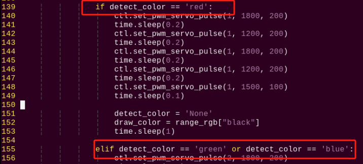
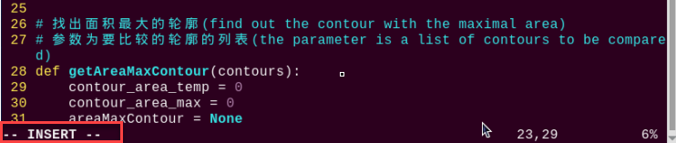

# AI视觉项目课程

## 1. 单个颜色识别

本节通过摄像头来识别颜色,识别到红色小球时，蜂鸣器发出滴滴报警声，并在回传画面中圈出，打印 "Color: red"。

### 1.1 实现原理

颜色识别的实现分为颜色识别和识别后的执行反馈两部分。

首先颜色识别部分，先进行高斯滤波（对图像中进行减噪），通过Lab颜色空间来对物品的颜色进行转换(关于Lab颜色空间的这个部分可以前往教程资料中 "**[OpenCV视觉基础课程]()**"进行详细学习)。

接着通过颜色阈值对圆圈中的物体颜色进行识别，再对图像部分进行掩膜（掩膜是用选定的图像、图形或物体，对处理的图像进行全局或者局部遮挡）。

然后经过对物品图片开闭运算处理后，最后将轮廓最大的物体用圆圈圈出。

开运算：先对图像腐蚀后膨胀。作用：用来消除小的物体，平滑形状边界，并且不改变其面积。可以去除小颗粒噪声，断开物体之间的粘连。

闭运算：先对图像膨胀后腐蚀。作用：用来填充物体内的小空洞，连接邻近的物体，连接断开的轮廓线，平滑其边界的同时不改变面积。

在识别后对蜂鸣器进行设置，使小车根据不同颜色来做出对应的反馈。比如识别红色，蜂鸣器响一声。

关于详细对应的反馈效果，可参考本文档[3.功能实现](#anchor_1_3)。

<p id="anchor_1_2"></p>

### 1.2 玩法开启及关闭步骤

:::{Note}
指令输入需严格区分大小写及空格，关键字可以使用"Tab"键进行补齐。
:::

1)  将设备开机，并参照课程资料的"**[远程工具安装与连接]()**"内容，通过VNC远程连接工具连接。


2)  点击系统桌面左上角的图标，或按下快捷键"**Ctrl+Alt+T**"打开LX终端。


3)  输入指令，按下回车，则可定位到存放玩法程序的目录。

```commandline
cd TonyPi/Functions/
```

4)  输入指令，然后按下回车键，玩法启动。

```commandline
python3 Color_Warning.py
```

5)  如需关闭此玩法，只需要在LX终端界面中按下"Ctrl+c"。若关闭失败，可多次按下。

<p id="anchor_1_3"></p>

### 1.3 实现效果

玩法开启后，通过摄像头来识别颜色,识别到红色小球时，蜂鸣器发出滴滴报警声，并在回传画面中圈出，打印 "**Color: red**"

:::{Note}
- 识别过程中，请尽量保证在光线充足环境下进行识别，避免因光线问题导致识别不准确。
- 识别过程中，摄像头视觉范围之内的背景中，不要出现与要识别颜色相近或相同的物体，避免误识别。
- 若颜色识别不准确可参照下文"**调节颜色阈值**"，对颜色阈值进行设置。
:::

### 1.4 功能延伸

- #### 1.4.1 调节颜色阈值

在玩法体验的过程中，如识别物体颜色效果不佳，则需调节颜色阈值。**本节以调节红色为例，其他颜色设置方法皆可参考，操作步骤如下：**

1)  双击系统桌面图标，在弹出的界面中点击"**执行**"。


2)  进入界面后，点击"**Connect**"。


3)  连接成功后，在界面右下角的颜色选项栏中选择"**red**"。


4)  若在弹出的界面中未出现回传画面，说明摄像头未连接成功，需检查一下摄像头连接线是否连接好。

下图界面右侧是实时回传画面，左侧是需要被采集的颜色。将摄像头对准红色色块，然后拖动下方的六个滑杆，使得左侧画面中红色色块的区域全部变为白色，其它区域为黑色。接着点击"Save"按钮保存数据。


<p id="anchor_1_4_2"> </p>

- #### 1.4.2 更换默认识别颜色

颜色识别程序内置了三种颜色：红色、绿色以及蓝色，其中默认识别到红色，蜂鸣器发出滴滴响声，并在回传画面中圈出，打印 "**Color: red**"。

**这里我们将识别颜色更换为绿色为例，具体修改步骤如下所示：**

1)  输入指令切换到源码路径下的指令，按下回车。

```commandline
cd TonyPi/Functions/
```

2. 然后再输入指令打开程序文件的指令，按下回车。

```commandline
sudo vim Color_Warning.py
```

3. 找到下图所示代码：


4. 按下键盘上的"**i**"键，进入到编辑模式。


5. 将下图中红框内代码改为"green"后面：


6)  接下来，保存我们修改的内容。按下"**Esc**"键，然后依次输入"**:wq**"（注意wq前为冒号：），回车即可保存并退出。

7)  输入开启颜色识别玩法的指令，按下回车。

```commandline
python3 Color_Warning.py
```

- #### 1.4.3 增加新的识别颜色

除了内置三种识别的颜色，我们还可以设置其它可识别的颜色，**比如我们以紫色作为新增的识别颜色为例，具体的修改步骤如下：**

1)  双击系统桌面图标，然后弹出的提示框内直接选择"**执行**"即可。


2)  在弹出的界面中依次选择"**Connect**"。


3)  点击"**Add**"，然后为新增颜色命名（这里以"**purple**"为例），再点击"**OK**"。


4)  然后点击颜色选框的下拉按钮，选择"**purple**"。


5)  将摄像头对准紫色物体，拖动L、A、B应的滑杆，直到左侧画面里要识别的颜色区域变为白色，其他区域变成黑色。


6)  最后，再点击"**Save**"，保存一下调节好的颜色阈值。


7)  修改完成后，我们可以检查一下修改的值是否成功被写入进去，输入指令，并按下回车，进入到程序代码所在目录。

```commandline
cd TonyPi
```

8)  再输入指令，并按下回车，打开程序文件。

```commandline
sudo vim lab_config.yaml
```

9)  打开颜色阈值程序文件后，即可查看紫色阈值参数。


10) 再按照"[**更换默认识别颜色**](#anchor_1_4_2)"1~4步骤，打开程序文件并按下"i"键进入编辑模式，接着找到如下图所示代码。


手动输入添加"**'purple':(255, 255, 114),**"，如下图所示：(255, 255, 114)为第9步查看的紫色阈值参数的max。

**'purple':(255, 255, 114),**


11) 接着找到下图代码。


12) 手动输入添加下图框中所示内容。


13) 保存我们修改的内容。按下"Esc"键，然后依次输入":wq"（注意wq前为冒号 : ），回车即可保存并退出。

14) 参照"[1.2 玩法开启及关闭步骤](#anchor_1_2)"再次启动该玩法，将紫色物品放置到摄像头前，课在回传画面中看到紫色框出，并打印"purple"。如果需要改为默认识别颜色，参照"[更换默认识别颜色](#anchor_1_4_2)"将颜色改为紫色即可。

15) 如果需要添加其他颜色作为可识别颜色，可参考前面步骤进行操作。

### 1.5 程序分析

该程序的源代码位于：**/home/pi/TonyPi/Functions/Color_Warning.py**

根据实现的效果，梳理程序的过程逻辑，如下图所示：


- #### 1.5.1 导入功能库

```py
#!/usr/bin/python3
# coding=utf8
import sys
import os
import cv2
import math
import time
import threading
import numpy as np

import hiwonder.Camera as Camera
import hiwonder.Misc as Misc
import hiwonder.ros_robot_controller_sdk as rrc
import hiwonder.yaml_handle as yaml_handle
```

1.  导入opencv、时间、数学、线程相关的库。我们如果想要调用功能库里的函数，就可以使用"功能库名+函数名（参数，参数...）"如：

```py
time.sleep(0.01)
```

就是调用"**time**"库中的"**sleep**"函数，sleep()的作用是延时。

在python中有一些已经内置的库，我们直接导入调用就可以，比如"**time**"、"**cv2**"、"**math**"等。我们也可以自己写一个库，比如上面的"**yaml_handle**"文件读取库。

2. 实例化函数库。

我们有些函数库的名称太长，并且不容易记忆，为了方便调用函数，我们经常会对函数库进行实例化，如：

```py
import hiwonder.ros_robot_controller_sdk as rrc
```

进行实例化后，在使用ros_robot_controller_sdk库中的函数，就可以像这样"**rrc.函数名(参数,参数...)**"直接调用了，非常方便。

```py
# 初始化机器人底层驱动    
board = rrc.Board()
```

- #### 1.5.2 主函数分析

python程序中"**\_\_name\_\_ == '\_\_main\_\_:'**"就是程序的主函数。

1. **读取摄像头图像**

```py
my_camera = cv2.VideoCaputure('http://127.0.0.1:8080/?action=stream?dummy=param.mjpg')
```

当玩法启动时，获取视频流并存储在"my_camera"中。

2. **进入图像处理**

读取到图像时，调用run()函数进行图像处理。

```py
if img is not None:
    frame = img.copy()
    frame = cv2.remap(frame, mapx, mapy, cv2.INTER_LINEAR)  # 畸变矫正
    Frame = run(frame)
```

函数img.copy()的作用是将"**img**"的内容复制给"**frame**"。

函数run()进行图像处理。

```py
def run(img):
    global draw_color
    global color_list
    global detect_color

    img_copy = img.copy()
    img_h, img_w = img.shape[:2]

    frame_resize = cv2.resize(img_copy, size, interpolation=cv2.INTER_NEAREST)
    frame_gb = cv2.GaussianBlur(frame_resize, (3, 3), 3)      
    frame_lab = cv2.cvtColor(frame_gb, cv2.COLOR_BGR2LAB)  # 将图像转换到LAB空间
```

- 对图片大小进行缩放，方便处理。

```py
frame_resize = cv2.resize(img_copy, size, interpolation=cv2.INTER_NEAREST)
```

第一个参数"**img_copy**"是输入图像。

第二个参数"**size**"是输出图像的大小。大小可以自己设定。

第三个参数"**interpolation=cv2.INTER_NEAREST**"是插值方式。INTER_NEAREST：最邻近插值。INTER_LINEAR：双线性插值，如果最后一个参数你不指定，将默认使用这种方法。INTER_CUBIC：4x4像素邻域内的双立方插值。INTER_LANCZOS4：8x8像素邻域内的Lanczos插值。

- 高斯滤波

图像中总是会混入噪声，影响图像的质量，让特征不明显。根据不同的噪声种类选择对应的滤波方法，常见的有：高斯滤波、中值滤波、均值滤波等。

高斯滤波是一种线性平滑滤波，适用于消除高斯噪声，广泛应用于图像处理的减噪过程。

```py
frame_gb = cv2.GaussianBlur(frame_resize, (3, 3), 3)
```

第一个参数"**frame_resize**"是输入图像。

第二个参数"**(3, 3)**"是高斯内核大小。

第三个参数"**3**"是X方向上的高斯核标准偏差。

- 将图像转换到LAB空间，其中函数cv2.cvtColor()是颜色空间转换函数。

```py
frame_lab = cv2.cvtColor(frame_gb, cv2.COLOR_BGR2LAB)  # 将图像转换到LAB空间
```

第一个参数"**frame_gb**"是输入图像。

第二个参数"**cv2.COLOR_BGR2LAB**"是转换格式。"**cv2.COLOR_BGR2LAB**"是将BGR格式转换到LAB格式。如果要转换到RGB就可以使用"**cv2.COLOR_BGR2RGB**"。

- 将图像转换成二值图像，只有0和1，图像变得简单并且数据量减小，更容易处理。

采用cv2库中的inRange()函数对图像进行二值化处理。

```py
for i in lab_data:
    if i != 'black' and i != 'white':
        frame_mask = cv2.inRange(frame_lab,
                                 (lab_data[i]['min'][0],
                                  lab_data[i]['min'][1],
                                  lab_data[i]['min'][2]),
                                 (lab_data[i]['max'][0],
                                  lab_data[i]['max'][1],
                                  lab_data[i]['max'][2]))  #对原图像和掩模进行位运算
```

第一个参数"**frame_lab**"是输入图像；

第二个参数"**(lab_data\[i\]\['min'\]\[0\],lab_data\[i\]\['min'\]\[1\],lab_data\[i\]\['min'\]\[2\])**"是颜色阈值下限；

第三个参数"**(lab_data\[i\]\['max'\]\[0\],lab_data\[i\]\['max'\]\[1\],lab_data\[i\]\['max'\]\[2\])**"是颜色阈值上限；

- 为了降低干扰，令图像更平滑，需要对图像进行腐蚀和膨胀操作，腐蚀（erosion）和膨胀（dilation）是两种基本的形态学操作，常用于图像处理，特别是在二值化图像的处理中。这两种操作通常用于去除小的噪声、分离和识别图像中的物体、以及调整图像的大小等。

```py
eroded = cv2.erode(frame_mask, cv2.getStructuringElement(cv2.MORPH_RECT, (3, 3)))  #腐蚀
dilated = cv2.dilate(eroded, cv2.getStructuringElement(cv2.MORPH_RECT, (3, 3))) #膨胀
```

第一个参数是输入图像；

第二个参数是结构元素（也称为内核），它定义了操作的性质。内核的大小和形状决定了腐蚀和膨胀的程度。

- 获取最大面积轮廓

完成上述的图像处理后，需要获取识别目标的轮廓，此处涉及cv2库中的findContours()函数。

```py
contours = cv2.findContours(dilated, cv2.RETR_EXTERNAL, cv2.CHAIN_APPROX_NONE)[-2]  #找出轮廓
```

第一个参数"dilated"是输入图像；

第二个参数"**cv2.RETR_EXTERNAL**"是轮廓的检索模式；

第三个参数"**cv2.CHAIN_APPROX_NONE)\[-2\]**"是轮廓的近似方法。

在获得的轮廓中寻找面积最大的轮廓，而为了避免干扰，需要设定一个最小值，仅当面积大于该值时，目标轮廓才有效。

```py
areaMaxContour, area_max = getAreaMaxContour(contours)  #找出最大轮廓
if areaMaxContour is not None:
    if area_max > max_area:#找最大面积
        max_area = area_max
        color_area_max = i
        areaMaxContour_max = areaMaxContour
```

3. **显示回传画面**

```py
Frame = run(frame)
cv2.imshow('Frame', Frame)
key = cv2.waitKey(1)
if key == 27:
    break
```

函数cv2.resize()的作用是把处理好的图像缩放到合适的大小。

函数cv2.imshow()的作用是在窗口显示图像，"**'frame'**"是窗口名称、"**frame_resize**"是显示内容。后面一定要有cv2.waitKey()，否则无法显示。

函数cv2.waitKey()的作用是等待按键输入，参数"**1**"是延迟时间。

- #### 1.5.3 子线程分析

1. **点亮RGB灯**

根据识别的颜色，RGB灯颜色与识别的颜色一致。

```py
if color_area_max == 'red':  #红色最大
    detect_color = 'red'
    draw_color = range_rgb["red"]         
elif color_area_max == 'green':  #绿色最大
    detect_color = 'green'
    draw_color = range_rgb["green"]           
elif color_area_max == 'blue':  #蓝色最大
    detect_color = 'blue'
    draw_color = range_rgb["blue"]
```

2. **驱动蜂鸣器**

```py
def buzzer():
    global di_once
    global detect_color
    while True:
        if detect_color == 'red' and di_once:
            board.set_buzzer(1900, 0.1, 0.9, 1)  # 以1900Hz的频率，持续响0.1秒，关闭0.9秒，重复1次
            di_once = False
        elif not di_once and detect_color != 'red':
            di_once = True
        else:
            time.sleep(0.01)
```

函数setBuzzer()是驱动蜂鸣器,函数setBuzzer()中，使用**Board.setBuzzer()**控制蜂鸣器的开关，"**0**"代表关，"**1**"代表开。

代码 **time.sleep(0.1)** 为延时函数，第一个参数"**0.1**"是响的时间。

## 2. 颜色识别

### 2.1 玩法简要说明

机器人对颜色进行识别，通过"点头"或"摇头"来对识别结果进行反馈。

我们看下本节课整体实现的流程：

首先需要对颜色进行识别，我们使用Lab颜色空间来进行处理(关于Lab颜色空间的这个部分可以前往 "第7章 OpenCV计算机视觉学习"进行详细学习)。

接着通过颜色阈值对圆圈中的物体颜色进行识别，再对图像部分进行掩膜（掩膜是用选定的图像、图形或物体，对处理的图像进行全局或者局部遮挡）。

然后经过对物品图片腐蚀膨胀处理后，最后将轮廓最大的物体用圆圈圈出。

腐蚀：通过遍历图像的每一个像素，检查其周围与结构元素的重叠部分。如果重叠部分的像素值都为1，则保持原像素值不变，否则将其置为0。主要用于消除图像中不重要的边缘信息，缩小图像中的区域。

膨胀：类似于腐蚀的逆过程，通过将图像与结构元素进行卷积，计算覆盖区域的像素点最大值，并把这个最大值赋值给参考点指定的像素。膨胀操作使图像中的高亮区域逐渐增长，通常用于填充图像中的孔洞或断裂。

接着根据识别的颜色进行判断，如果满足设定的颜色，即让头部舵机进行上下转动，否则进行左右转动。

### 2.2 程序开启及关闭

:::{Note}
指令输入需严格区分大小写及空格。
:::

1)  将机器人开机，然后通过VNC远程连接树莓派桌面。关于VNC的安装及连接，可参考"**[远程工具安装与连接]()**"。

2)  在树莓派的桌面双击的"**Terminator**"图标，打开命令行终端。

3)  输入指令，按下回车键则可定位到存放了玩法程序的目录。

```commandline
cd TonyPi/Functions
```

4. 输入指令，然后按下回车键将玩法启动。

```commandline
python3 ColorDetect.py
```

5. 如需关闭此玩法，只需要在终端界面中按下"**Ctrl+C**"。如果关闭失败，可多次按下。

### 2.3 实现效果

:::{Note}
程序默认识别颜色为红色。如需切换蓝色或绿色，可参考下文**更换默认识别颜色**。
:::

将红色小球放置到摄像头前，机器人在识别到后将会"**点头**"；将蓝色或绿色小球放置到摄像头前，机器人识别到后将会"**摇头**"。

### 2.4 功能延伸

<p id="anchor_2_4_1"></p>

- #### 2.4.1 更换默认识别颜色

颜色识别程序内置了三种颜色：红色、绿色以及蓝色，其中默认识别到红色，机器人便执行点头动作。

**这里我们将识别颜色更换为绿色为例，具体修改步骤如下所示：**

1)  首先需要切换至玩法程序所在的目录内，输入指令。

```commandline
cd TonyPi/Functions
```

2)  其次我们通过vim编辑器进入该玩法内，输入指令。

```commandline
vim ColorDetect.py
```

3)  找到代码"**if detect_color == 'red':**"和"**elif detect_color == 'green' or detect_color == 'blue':**"。



:::{Note}
在键盘输入代码位置序号后按下"Shift+G"键，可以直接跳转到对应位置。（本节旨在介绍快速跳转方法，故代码位置序号仅供参考，请以实际为准。）
:::

4)  接着按下"**i**"进入编辑模式，然后将（**if detect_color == 'red'**）的"**red**"直接修改为"**green**"，将第120行（**elif detect_color== 'green' or detect_color == 'blue'**）的"**green**"改为"**red**"即可。（如需更换为蓝色，同理）


5)  最后按下"**Esc**"进入末行命令模式，输入指令即可保存退出。（先输入英文:，再输入wq）

```commandline
:wq
```

- #### 2.4.2 增加新的识别颜色

除了内置三种识别的颜色，我们还可以设置其它可识别的颜色。**比如我们以橙色作为新增的识别颜色为例**，**具体的修改步骤如下：**

1.  打开VNC，输入指令，打开Lab颜色设置文件。

```commandline
vim TonyPi/lab_config.yaml
```

可使用截图或文件备份的方式记录初始数值。


2. 单击系统桌面调试工具图标，然后弹出的提示框内直接选择"**执行**"即可。


3. 点击左下角"**Connect**"按钮，当摄像头回传画面出现在界面上时表示连接成功，然后点击右侧方框内的"**red**"。


4. 然后将摄像头对准想要识别的颜色，拖动L、A、B应的滑杆，直到左侧画面里要识别的颜色区域变为白色，其他区域变成黑色。

例如我们想要识别橙色，可将橙色物体放到摄像头视野内，调整L、A、B对应滑杆，直到左侧画面里橙色部分变为白色，其他颜色都变为黑色，接着点击"**red**"下方的"**Save**"按钮写入修改的数据。


5. 修改完成后，我们可以检查一下修改的值是否成功被写入进去，再次输入命令，查看颜色设置参数。

```commandline
vim TonyPi/lab_config.yaml
```


为了避免对玩法造成影响，在后面修改完毕后，建议通过LAB_Tool工具将数值修改回初始值。

6. 观察上图红框位置，发现修改的值已经被写入配置程序中了，按"**Esc**"，在下方输入"**:wq**"，退出并保存。

7. 按照本文 **[更换默认识别颜色](#anchor_2_4_1)** 的内容将默认可识别的小球颜色设置为红色。


8. 再次启动该玩法，将橙色物品放置到摄像头前，可看到机器人将执行"点头"动作。

9. 如果需要添加其他颜色作为可识别颜色，可参考前面步骤进行操作。

### 2.5 程序简要分析

该程序的源代码位于：**/home/pi/TonyPi/Functions/ColorDetect.py**

<p id="anchor_2_5_1"></p>

- #### 2.5.1 导入参数模块

| **导入模块** | **作用** |
|:--:|:--:|
| import sys | 导入了Python的sys模块，用于访问系统相关的功能和变量 |
| import cv2 | 导入了OpenCV库，用于图像处理和计算机视觉相关的功能 |
| import time | 导入了Python的time模块，用于时间相关的功能，例如延时操作 |
| import math | math模块提供了对数学运算的底层访问，包含了许多常用的数学函数和常量 |
| import threading | 提供多线程运行的环境 |
| import np | 导入NumPy库，是Python的一个开源数值计算扩展库，用于处理数组和矩阵运算 |
| from hiwonder.PID import PID | 导入PID控制库 |
| from hiwonder import Misc as Misc | 导入了Misc模块，用于处理识别得到的矩形数据 |
| from hiwonder import Board as Board | 导入了Board模块，用机器人舵机、蜂鸣器等外设的控制 |
| import hiwonder.camera as camera | 导入相机库 |
| import hiwonder.ActionGroupControl as AGC | 导入动作组执行库 |
| import hiwonder.yaml_handle | 包含一些与处理YAML格式文件相关的功能或工具 |

- #### 2.5.2 功能逻辑

根据实现效果，梳理该玩法的实现逻辑如下图所示：


通过摄像头获取图像信息，再进行图像处理，即对图像进行二值化处理。同时为了降低干扰，令图像更平滑，对图像进行腐蚀和膨胀处理。

接着获取目标最大面积轮廓和最小外接圆，判断色块颜色，并且做出相应的反馈。

- #### 2.5.3 程序逻辑及对应的代码分析

从程序文件梳理得到程序逻辑流程图如下图所示。


从上图得到，程序的逻辑流程主要为图像处理与颜色追踪，以下的文档内容将依照上述程序逻辑流程图进行编写。

- #### 2.5.4 初始化

1. **导入功能库**

在初始化的这一步，首先就需要将功能库导入进来，方便后续程序的调用，关于导入进来的内容。可以前往**[导入参数模块](#anchor_2_5_1)**进行查看。

```py
import sys
import os
import cv2
import math
import time
import threading
import numpy as np
import hiwonder.Camera as Camera
import hiwonder.Misc as Misc
import hiwonder.ros_robot_controller_sdk as rrc
from hiwonder.Controller import Controller
import hiwonder.ActionGroupControl as AGC
import hiwonder.yaml_handle as yaml_handle
```

2. **设定初始状态**

设置初始状态，这里就包括了舵机的初始位置、颜色的阈值等。

```py
# 初始化机器人舵机初始位置
def initMove():
    ctl.set_pwm_servo_pulse(1, 1500, 500)
    ctl.set_pwm_servo_pulse(2, servo_data['servo2'], 500)
```

3. **图像预处理**

对图像进行尺寸调整与高斯模糊处理

```py
frame_resize = cv2.resize(img_copy, size, interpolation=cv2.INTER_NEAREST)
frame_gb = cv2.GaussianBlur(frame_resize, (3, 3), 3) 
```

cv2.resize(img_copy, size, interpolation=cv2.INTER_NEAREST) 是对图像进行尺寸调整的操作。

第一个参数"**img_copy**"是要调整尺寸的图像；

第二个参数"**size**"是目标尺寸；

第三个参数"**interpolation**"是插值方法，用于确定调整尺寸时使用的像素插值算法。

cv2.GaussianBlur(frame_resize, (3, 3), 3) 是对图像应用高斯模糊

第一个参数"**frame_resize**"是要进行模糊处理的图像；

第二个参数"**(3, 3)**"高斯核的大小，表示核的宽度和高度都为 3；

第三个参数"**3**"是高斯核的标准差，用于控制模糊程度。较大的值会产生更强的模糊效果。

4. **颜色空间转换**

将BGR图像转换为LAB图像

```py
frame_lab = cv2.cvtColor(frame_gb, cv2.COLOR_BGR2LAB)  # 将图像转换到LAB空间
```

**二值化处理**

采用cv2库中的inRange()函数对图像进行二值化处理。

```py
if i != 'black' and i != 'white':
    frame_mask = cv2.inRange(frame_lab,
                             (lab_data[i]['min'][0],
                              lab_data[i]['min'][1],
                              lab_data[i]['min'][2]),
                             (lab_data[i]['max'][0],
                              lab_data[i]['max'][1],
                              lab_data[i]['max'][2]))  #对原图像和掩模进行位运算
```

第一个参数"**frame_lab**"是输入图像；

第二个参数"**lab_data\[i\]\['min'\]\[0\]**"是阈值下限；

第三个参数"**lab_data\[i\]\['max'\]\[0\]**"是阈值上限；

5. **腐蚀与膨胀**

```py
eroded = cv2.erode(frame_mask, cv2.getStructuringElement(cv2.MORPH_RECT, (3, 3)))  #腐蚀
dilated = cv2.dilate(eroded, cv2.getStructuringElement(cv2.MORPH_RECT, (3, 3))) #膨胀
```

eroded = cv2.erode(frame_mask, cv2.getStructuringElement(cv2.MORPH_RECT, (3, 3))) 是对二值化图像进行腐蚀的操作。

第一个参数"**frame_mask**"是要进行形态学运算的二值图像；

第二个参数"**cv2.getStructuringElement(cv2.MORPH_RECT, (3, 3))**"是腐蚀操作的结构元素。这里使用了大小为 (3, 3) 的矩形结构元素。

膨胀函数同理。

6. **获取最大面积轮廓**

完成上述的图像处理后，需要获取识别目标的轮廓，此处涉及cv2库中的findContours()函数。

```py
contours = cv2.findContours(dilated, cv2.RETR_EXTERNAL, cv2.CHAIN_APPROX_NONE)[-2]  #找出轮廓
```

以代码"**contours = cv2.findContours(dilated, cv2.RETR_EXTERNAL, cv2.CHAIN_APPROX_NONE)\[-2\]**"为例：

第一个参数"**dilated**"是输入图像；

第二个参数"**cv2.RETR_EXTERNAL**"是轮廓的检索模式；

第三个参数"**cv2.CHAIN_APPROX_NONE)\[-2\]**"是轮廓的近似方法。

在获得的轮廓中寻找面积最大的轮廓，而为了避免干扰，需要设定一个最小值，仅当面积大于该值时，目标轮廓才有效。

```py
areaMaxContour, area_max = getAreaMaxContour(contours)  #找出最大轮廓
if areaMaxContour is not None:
    if area_max > max_area:#找最大面积
        max_area = area_max
        color_area_max = i
        areaMaxContour_max = areaMaxContour
```

7. **判断颜色最大的色块**

对最大面积轮廓的颜色进行判断，并将判断结果添加到color_list中。

```py
if color_area_max == 'red':  #红色最大
    color = 1
elif color_area_max == 'green':  #绿色最大
    color = 2
elif color_area_max == 'blue':  #蓝色最大
    color = 3
else:
    color = 0
    color_list.append(color)
```

8. **多次判断**

多次判断取平均值，确定识别到的颜色

```py
if len(color_list) == 3:  #多次判断
    # 取平均值
    color = int(round(np.mean(np.array(color_list))))
    color_list = []
    if color == 1:
        detect_color = 'red'
        draw_color = range_rgb["red"]
    elif color == 2:
        detect_color = 'green'
        draw_color = range_rgb["green"]
    elif color == 3:
        detect_color = 'blue'
        draw_color = range_rgb["blue"]
    else:
        detect_color = 'None'
        draw_color = range_rgb["black"]               
    else:
        detect_color = 'None'
        draw_color = range_rgb["black"]
```

9. **打印识别结果**

采用cv2库中的cv2.putText()函数来将文本绘制在图像上。

```py
cv2.putText(img, "Color: " + detect_color, (10, img.shape[0] - 10), cv2.FONT_HERSHEY_SIMPLEX, 0.65, draw_color, 2)
```

以代码"**cv2.putText(img, "Color: " + detect_color, (10, img.shape\[0\] - 10), cv2.FONT_HERSHEY_SIMPLEX, 0.65, draw_color, 2)**"为例：

第一个参数"**img**"是绘制的图像；

第二个参数"**"Color: " + detect_color**"在图像上绘制的信息；

第三个参数"**(10, img.shape\[0\] - 10)**"是文本的起始坐标，即文本左下角的位置。这里文本距离图像左边缘和底部边缘分别为 10 个像素；

第四个参数"**cv2.FONT_HERSHEY_SIMPLEX**"是字体类型；

第五个参数"**0.65**"是文本的大小缩放因子；

第六个参数"**draw_color**"是文本的颜色；

第七个参数"2"是文本的线条粗细。

- **颜色识别**

1)  识别到红色小球后，控制机器人舵机1，让机器人连续点头两次，再回 到中位：

```py
if __isRunning:
    if detect_color != 'None':
        action_finish = False

        if detect_color == 'red':
            ctl.set_pwm_servo_pulse(1, 1800, 200)
            time.sleep(0.2)
            ctl.set_pwm_servo_pulse(1, 1200, 200)
            time.sleep(0.2)
            ctl.set_pwm_servo_pulse(1, 1800, 200)
            time.sleep(0.2)
            ctl.set_pwm_servo_pulse(1, 1200, 200)
            time.sleep(0.2)
            ctl.set_pwm_servo_pulse(1, 1500, 100)
            time.sleep(0.1)
```

以"**ctl.set_pwm_servo_pulse(1, 1800, 200)**"代码为例：

第一个参数"**1**"表示控制ID为1的舵机；

第二个参数"**1800**"表示控制ID为1舵机的脉冲宽度，1500控制舵机回到中位；

第三个参数"**200**"表示舵机的运动时间为100ms。

2)  识别到绿色或蓝色小球后，控制机器人舵机2，让机器人连续摇头两次， 再回到中位：

```py
elif detect_color == 'green' or detect_color == 'blue':
    ctl.set_pwm_servo_pulse(2, 1800, 200)
    time.sleep(0.2)
    ctl.set_pwm_servo_pulse(2, 1200, 200)
    time.sleep(0.2)
    ctl.set_pwm_servo_pulse(2, 1800, 200)
    time.sleep(0.2)
    ctl.set_pwm_servo_pulse(2, 1200, 200)
    time.sleep(0.2)
    ctl.set_pwm_servo_pulse(2, 1500, 100)
    time.sleep(0.1)
    detect_color = 'None'
    draw_color = range_rgb["black"]                    
    time.sleep(1)
```

## 3. 颜色位置识别

本节课可以通过摄像头进行颜色识别红绿蓝三色小球，并在回传画面中圈出，显示其XY坐标位置。

### 3.1 实现原理

目标追踪的实现可分为颜色识别和位置标记两部分。

首先颜色识别部分，先进行高斯滤波（对图像中进行减噪），通过Lab颜色空间来对物品的颜色进行转换(关于Lab颜色空间的这个部分可以前往"**[OpenCV视觉基础课程]()**"课程进行详细学习)。

接着通过颜色阈值对圆圈中的物体颜色进行识别，再对图像部分进行掩膜（掩膜是用选定的图像、图形或物体，对处理的图像进行全局或者局部遮挡）。

然后经过对物品图片开闭运算处理后，最后将轮廓最大的物体用圆圈圈出。

**开运算** ：先对图像腐蚀后膨胀。作用：用来消除小的物体，平滑形状边界，并且不改变其面积。可以去除小颗粒噪声，断开物体之间的粘连。

**闭运算** ：先对图像膨胀后腐蚀。作用：用来填充物体内的小空洞，连接邻近的物体，连接断开的轮廓线，平滑其边界的同时不改变面积。

位置标记需要使用特定的检测算法。其基本原理是在图像中寻找符合预定义特征或模式的区域，然后返回这些区域的位置和边界框。

### 3.2 玩法开启及关闭步骤

:::{Note}
指令的输入需严格区分大小写和空格，另外可按键盘"Tab"键进行关键词补齐。
:::

1. 将设备开机，并参照课程资料的"**[远程工具安装与连接]()**"内容，通过VNC远程连接工具连接。


2. 点击系统桌面左上角的图标，或按下快捷键"Ctrl+Alt+T"打开LX终端。


3. 在打开的界面中，输入进入玩法程序所在目录的指令，按下回车键。

```commandline
cd TonyPi/Functions
```

4)  输入指令，然后按下回车，启动玩法。

```commandline
python3 ColorPositionRecognition.py
```

5. 如需关闭此玩法，只需要在LX终端界面中按下"**Ctrl+c**"。若关闭失败，可多次按下。

### 3.3 实现效果

**程序默认的追踪颜色为红绿蓝三色小球，识别完成后在回传画面中圈出，并显示其XY坐标位置**。

:::{Note}
- 识别过程中，请尽量保证在光线充足环境下进行识别，避免因光线问题导致识别不准确。
- 识别过程中，摄像头视觉范围之内的背景中，不要出现与要识别颜色相近或相同的物体，避免误识别。
- 若颜色识别不准确可参照下文"**颜色调节阈值**"，对颜色阈值进行设置。
:::

### 3.4 功能延伸

- #### 3.4.1 调节颜色阈值

在玩法体验的过程中，如识别物体颜色效果不佳，则需调节颜色阈值。**本节以调节红色为例，其他颜色设置方法皆可参考，操作步骤如下：**

1)  双击系统桌面图标，在弹出的界面中点击"**执行**"。


2)  进入界面后，点击"**Connect**"。


3)  连接成功后，在界面右下角的颜色选项栏中选择"**red**"。


4)  若在弹出的界面中未出现回传画面，说明摄像头未连接成功，需检查一下摄像头连接线是否连接好。

下图界面右侧是实时回传画面，左侧是需要被采集的颜色。将摄像头对准红色色块，然后拖动下方的六个滑杆，使得左侧画面中红色色块的区域全部变为白色，其它区域为黑色。接着点击"Save"按钮保存数据。


- #### 增加新的识别颜色

除了内置三种识别的颜色，我们还可以设置其它可识别的颜色，**比如我们以紫色作为新增的识别颜色为例，具体的修改步骤如下：**

1)  双击系统桌面图标，然后弹出的提示框内直接选择"**执行**"即可。


2)  在弹出的界面中依次选择"**Connect**"。


3)  点击"**Add**"，然后为新增颜色命名（这里以"**purple**"为例），再点击"**OK**"。


4)  然后点击颜色选框的下拉按钮，选择"**purple**"。


5)  将摄像头对准紫色物体，拖动L、A、B应的滑杆，直到左侧画面里要识别的颜色区域变为白色，其他区域变成黑色。


6)  最后，再点击"**Save**"，保存一下调节好的颜色阈值。


7)  修改完成后，我们可以检查一下修改的值是否成功被写入进去，输入指令，并按下回车，进入到程序代码所在目录。

```commandline
cd TonyPi
```

8)  再输入指令，并按下回车，打开程序文件。

```commandline
sudo vim lab_config.yaml
```

9)  打开颜色阈值程序文件后，即可查看紫色阈值参数。


10. 输入":q"按下回车，退出此文件。

11. 再输入"**cd Functions**"进入玩法目录。

```commandline
cd Functions
```

12. 然后再输入指令打开程序文件的指令，按下回车。

```commandline
sudo vim ColorPositionRecognition.py
```

13. 接着找到如下图所示代码。


14) 按下"i"键，进入编辑模式。



15) 手动输入添加"**'purple':(255, 255, 114),**"，如下图所示：(255, 255, 114)为第9步查看的紫色阈值参数的max。

**'purple':(255, 255, 114),**


16) 接着找到下图代码。


17) 手动输入添加下图框中所示内容。


18) 保存我们修改的内容。按下"Esc"键，然后依次输入":wq"（注意wq前为冒号 : ），回车即可保存并退出。

19) 如果需要添加其他颜色作为可识别颜色，可参考前面步骤进行操作。

### 3.5 程序说明

该程序的源代码于：**/home/pi/TonyPi/Functions/Color_Recognize.py**

根据实现的效果，梳理程序的过程逻辑，如下图所示：


- #### 3.5.1 导入功能库

```py
#!/usr/bin/python3
# coding=utf8
import sys
import os
import cv2
import math
import time
import numpy as np

import hiwonder.Camera as Camera
import hiwonder.Misc as Misc
import hiwonder.yaml_handle as yaml_handle
```

1)  导入opencv、时间、数学、线程、逆运动学相关的库。我们如果想要调用功能库里的函数，就可以使用"**功能库名+函数名（参数，参数...）**"如：

```py
time.sleep(0.01)
```

就是调用"**time**"库中的"**sleep**"函数。sleep()的作用是延时。

在python中有一些已经内置的库，我们直接导入调用就可以，比如"**time**"、"**cv2**"、"**math**"等。我们也可以自己写一个库，比如上面的"**yaml_handle**"文件读取库等。

2)  实例化函数库

    我们有些函数库的名称太长，并且不容易记忆，为了方便调用函数，我们经常会对函数库进行实例化，如：

```py
import hiwonder.Misc as misc
```

进行实例化后，在使用Misc库中的函数，就可以像这样"**Misc.函数名(参数,参数...)**"直接调用了，非常方便。

- #### 3.5.2 主函数分析

python程序中"**\_\_name\_\_ == '\_\_main\_\_:'**"就是程序的主函数。首先要打开摄像头，并读取视频流通过read方法可以读取到每一帧的图片，查找并标记小球颜色并显示结果。通过循环读取显示就可以实现视频的播放，在视频读取展示结束后使用release函数释放资源。

```py
if __name__ == '__main__':#用于加载回传画面参数，删除则执行程序无法调用回传
    from CameraCalibration.CalibrationConfig import *
    from hiwnder.ros_robot_controller_sdk import Board
    board = Board()
    #加载参数
    param_data = np.load(calibration_param_path + '.npz')

    #获取参数
    mtx = param_data['mtx_array']
    dist = param_data['dist_array']
```

1. **读取摄像头图像**


当玩法启动时，首先读取摄像头。

2. **进入图像处理**

- 函数run()进行图像处理。

```py
def run(img):

    detect_color = 'None'  
    draw_color = range_rgb["black"]	

    img_copy = img.copy()
    img_h, img_w = img.shape[:2]

    frame_resize = cv2.resize(img_copy, size, interpolation=cv2.INTER_NEAREST)
    frame_gb = cv2.GaussianBlur(frame_resize, (3, 3), 3)
```

- 对图片大小进行缩放，方便处理。

```py
frame_resize = cv2.resize(img_copy, size, interpolation=cv2.INTER_NEAREST)
```

第一个参数"**img_copy**"是输入图像。

第二个参数"**size**"是输出图像的大小。大小可以自己设定。

第三个参数"**interpolation=cv2.INTER_NEAREST**"是插值方式。INTER_NEAREST：最邻近插值。INTER_LINEAR：双线性插值，如果最后一个参数你不指定，将默认使用这种方法。INTER_CUBIC：4x4像素邻域内的双立方插值。INTER_LANCZOS4：8x8像素邻域内的Lanczos插值。

- 高斯滤波

图像中总是会混入噪声，影响图像的质量，让特征不明显。根据不同的噪声种类选择对应的滤波方法，常见的有：高斯滤波、中值滤波、均值滤波等。

高斯滤波是一种线性平滑滤波，适用于消除高斯噪声，广泛应用于图像处理的减噪过程。

```py
frame_gb = cv2.GaussianBlur(frame_resize, (3, 3), 3)
```

第一个参数"**frame_resize**"是输入图像。

第二个参数"**(3, 3)**"是高斯内核大小。

第三个参数"**3**"是X方向上的高斯核标准偏差。

- 将图像转换到LAB空间，其中函数cv2.cvtColor()是颜色空间转换函数。

```py
frame_lab = cv2.cvtColor(frame_gb, cv2.COLOR_BGR2LAB)  # 将图像转换到LAB空间
```

第一个参数"**frame_gb**"是输入图像。

第二个参数"**cv2.COLOR_BGR2LAB**"是转换格式。"**cv2.COLOR_BGR2LAB**"是将BGR格式转换到LAB格式。如果要转换到RGB就可以使用"**cv2.COLOR_BGR2RGB**"。

- 将图像转换成二值图像，只有0和1，图像变得简单并且数据量减小，更容易处理。

采用cv2库中的inRange()函数对图像进行二值化处理。

```py
frame_mask = cv2.inRange(frame_lab,
                         (lab_data['red']['min'][0],
                          lab_data['red']['min'][1],
                          lab_data['red']['min'][2]),
                         (lab_data['red']['max'][0],
                          lab_data['red']['max'][1],
                          lab_data['red']['max'][2]))#对原图像和掩模进行位运算
```

第一个参数"**frame_lab**"是输入图像；

第二个参数"**(lab_data\[i\]\['min'\]\[0\],lab_data\[i\]\['min'\]\[1\],lab_data\[i\]\['min'\]\[2\])**"是颜色阈值下限；

第三个参数"**(lab_data\[i\]\['max'\]\[0\],lab_data\[i\]\['max'\]\[1\],lab_data\[i\]\['max'\]\[2\])**"是颜色阈值上限；

- 为了降低干扰，令图像更平滑，需要对图像进行腐蚀和膨胀操作，腐蚀和膨胀是一种形态学操作，腐蚀通常用于减小图像中前景对象的尺寸或消除小的对象；膨胀通常用于增大图像中前景对象的尺寸或填补对象内部的小洞。

```py
eroded = cv2.erode(frame_mask, cv2.getStructuringElement(cv2.MORPH_RECT, (3, 3)))  #腐蚀
dilated = cv2.dilate(eroded, cv2.getStructuringElement(cv2.MORPH_RECT, (3, 3))) #膨胀
```

- 获取最大面积轮廓

完成上述的图像处理后，需要获取识别目标的轮廓，此处涉及cv2库中的findContours()函数。

```py
contours = cv2.findContours(dilated, cv2.RETR_EXTERNAL, cv2.CHAIN_APPROX_NONE)[-2]  #找出轮廓
```

第一个参数"dilated"是输入图像；

第二个参数"**cv2.RETR_EXTERNAL**"是轮廓的检索模式；

第三个参数"**cv2.CHAIN_APPROX_NONE)\[-2\]**"是轮廓的近似方法。

在获得的轮廓中寻找面积最大的轮廓，而为了避免干扰，需要设定一个值，仅当面积大于该值时，目标轮廓才有效。

```py
contours = cv2.findContours(dilated, cv2.RETR_EXTERNAL, cv2.CHAIN_APPROX_NONE)[-2]  #找出轮廓
areaMaxContour, area_max = getAreaMaxContour(contours)  #找出最大轮廓
if areaMaxContour is not None:
    if area_max > max_area:#找最大面积
        max_area = area_max
        areaMaxContour_max = areaMaxContour
        if max_area > 200:  # 有找到最大面积
```

- 获取位置信息

采用cv2库中的cv2.putText() 函数在图像上绘制文本

```py
cv2.putText(img, "Color: " + detect_color, (10, img.shape[0] - 10), cv2.FONT_HERSHEY_SIMPLEX, 0.65, draw_color, 2)
cv2.putText(img, f"({centerX}, {centerY})", (centerX, centerY - 20),  cv2.FONT_HERSHEY_SIMPLEX, 1.0, range_rgb[color_area_max], 2)
```

第一个参数"img"是输入图像；

第二个参数 "Color: " + detect_color"是要绘制的文本内容，通常以字符串形式传入；f'({centerX}, {centerY})' 是要绘制的文本，显示圆心 (centerX, centerY) 的坐标。

第三个参数"(10, img.shape\[0\] - 10)"与"(centerX, centerY - 20)"是文本在图像中的起始坐标点，即文本左下角的位置（x, y）；

第四个参数"cv2.FONT_HERSHEY_SIMPLEX"表示使用简单的字体；

第五个参数"0.65" 字体大小的缩放因子，指定文本字体的大小缩小到默认大小的0.65倍，参数"1.0"表示文本字体为默认颜色；

第六个参数"draw_color"是文本的颜色；range_rgb\[color_area_max\]是指识别到的最大颜色范围；

第六个参数"2"是文本字体的线条粗细。

3. **显示回传画面**

```py
while True:
    ret, img = my_camera.read()
    if img is not None:
        frame = img.copy()
        frame = cv2.remap(frame, mapx, mapy, cv2.INTER_LINEAR)  # 畸变矫正
        Frame = run(frame)
        cv2.imshow('Frame', Frame)
        key = cv2.waitKey(1)
        if key == 27:
            break
```

函数cv2.imshow()的作用是在窗口显示图像，"**'Frame'**"是窗口名称、"**frame**"是显示内容。后面一定要有cv2.waitKey()，否则无法显示。

函数cv2.waitKey()的作用是等待按键输入，参数"**1**"是延迟时间。

## 4. 颜色追踪

### 4.1 玩法简要说明

机器人对颜色进行识别，头部云台舵机可根据目标颜色的移动而移动。

我们看下本节课整体实现的流程：

首先需要对颜色进行识别，接着通过颜色阈值对圆圈中的物体颜色进行识别，再对图像部分进行掩膜（掩膜是用选定的图像、图形或物体，对处理的图像进行全局或者局部遮挡）。

然后经过对物品图片腐蚀膨胀处理后，最后将轮廓最大的物体用圆圈圈出。

腐蚀：通过遍历图像的每一个像素，检查其周围与结构元素的重叠部分。如果重叠部分的像素值都为1，则保持原像素值不变，否则将其置为0。主要用于消除图像中不重要的边缘信息，缩小图像中的区域。

膨胀：类似于腐蚀的逆过程，通过将图像与结构元素进行卷积，计算覆盖区域的像素点最大值，并把这个最大值赋值给参考点指定的像素。膨胀操作使图像中的高亮区域逐渐增长，通常用于填充图像中的孔洞或断裂。

接着在识别到后对云台部分进行处理，以图像的中心点的x、y坐标作为设定值，以当前获取的x、y坐标作为输入值进行更新pid。

然后根据图像位置的反馈进行计算，最后通过目标位置的变化使云台舵机跟随转动，从而达到颜色跟踪的效果。

### 4.2 程序开启及关闭

:::{Note}
指令输入需严格区分大小写及空格。
:::

1)  将机器人开机，然后通过VNC远程连接树莓派桌面。关于VNC的安装及连接，可参考"**[远程工具安装与连接]()**"。

2)  在树莓派的桌面双击的"**Terminator**"图标，打开命令行终端。

3)  输入指令，按下回车键则可定位到存放了玩法程序的目录。

```commandline
cd TonyPi/Functions
```

4. 输入指令，然后按下回车键将玩法启动。

```commandline
python3 ColorTrack.py
```

5. 如需关闭此玩法，只需要在终端界面中按下"**Ctrl+C**"。如果关闭失败，可多次按下。

### 4.3 实现效果

:::{Note}
程序默认识别和追踪的颜色为红色。如需切换蓝色或绿色，可参考本文**[4.1 更换默认识别颜色](#anchor_1.4)**。另外手持彩色小球移动时不宜过快，并应满足摄像头识别的范围。
:::

玩法开启后，手持红色小球进行缓慢移动，机器人头部将随着目标颜色的移动而跟随转动。

### 4.4 功能延伸

<p id="anchor_4_4_1"></p>

- #### 4.4.1 更换默认识别颜色

颜色追踪程序内置了三种颜色：红色、绿色以及蓝色，其中默认识别到红色，机器人头部便跟随红色物体的移动而转动。

**这里我们将识别颜色更换为绿色为例，具体修改步骤如下所示：**

1)  首先需要切换至玩法程序所在的目录内，输入指令。

```commandline
cd TonyPi/Functions
```

2. 其次我们通过vim编辑器进入该玩法内，输入指令。

```commandline
vim ColorTrack.py
```

3)  找到代码"**\_\_target_color = ('red')**"。


:::{Note}
在键盘输入代码位置序号后按下"Shift+G"键，可以直接跳转到对应位置。（本节旨在介绍快速跳转方法，故代码位置序号仅供参考，请以实际为准。）**
:::

4. 接着按下"**i**"进入编辑模式，然后将（**\_target_color = ('red')**）内的"**red**"直接修改为"**green**"即可。（如需更换为蓝色，修改为"**blue**"）


5. 最后按下"**Esc**"进入末行命令模式，输入指令即可保存退出。（先输入英文:，再输入wq）

```commandline
:wq
```

- #### 4.4.2 增加新的识别颜色

除了内置三种识别的颜色，我们还可以设置其它可识别的颜色。**比如我们以橙色作为新增的识别颜色为例**，**具体的修改步骤如下：**

1.  打开VNC，输入指令，打开Lab颜色设置文件。

```commandline
vim TonyPi/lab_config.yaml
```

可使用截图或文件备份的方式记录初始数值。


2. 单击系统桌面调试工具图标，然后弹出的提示框内直接选择"**执行**"即可。


3. 点击左下角"**Connect**"按钮，当摄像头回传画面出现在界面上时表示连接成功。右侧方框选择"**black**"。


4. 然后将摄像头对准想要识别的颜色，拖动L、A、B应的滑杆，直到左侧画面里要识别的颜色区域变为白色，其他区域变成黑色。

例如我们想要识别橙色，可将橙色物体放到摄像头视野内，调整L、A、B对应滑杆，直到左侧画面里橙色部分变为白色，其他颜色都变为黑色，接着点击"**red**"下方的"**Save**"按钮写入修改的数据。


为了避免对玩法造成影响，在后面修改完毕后，建议通过LAB_Tool工具将数值修改回初始值。

5. 修改完成后，我们可以检查一下修改的值是否成功被写入进去，再次输入命令，查看颜色设置参数。

```commandline
vim TonyPi/lab_config.yaml
```


6. 观察上图红框位置，发现修改的值已经被写入配置程序中了，按"**Esc**"，在下方输入指令，退出并保存。

```commandline
:wq
```

7. 按照本文[更换默认识别颜色](#anchor_4_4_1)的内容将默认追踪的颜色设置为红色。


8. 再次启动该玩法，将橙色物品放置到摄像头前，可手持物品进行缓慢移动，TonyPi头部将随着目标颜色的移动而跟随转动。如果需要添加其他颜色作为可识别颜色，可参考前面步骤进行操作。

### 4.5 程序简要分析

该程序的源代码位于：**/home/pi/TonyPi/Functions/ColorTrack.py**


<p id="anchor_4_5_1"></p>

- #### 4.5.1 导入参数模块

| **导入模块** | **作用** |
|:--:|:--:|
| import sys | 导入了Python的sys模块，用于访问系统相关的功能和变量 |
| import cv2 | 导入了OpenCV库，用于图像处理和计算机视觉相关的功能 |
| import time | 导入了Python的time模块，用于时间相关的功能，例如延时操作 |
| import math | math模块提供了对数学运算的底层访问，包含了许多常用的数学函数和常量 |
| import threading | 提供多线程运行的环境 |
| import np | 导入NumPy库，是Python的一个开源数值计算扩展库，用于处理数组和矩阵运算 |
| from hiwonder.PID import PID | 导入PID控制库 |
| from hiwonder import Misc as Misc | 导入了Misc模块，用于处理识别得到的矩形数据 |
| from hiwonder import Board as Board | 导入了Board模块，用机器人舵机、蜂鸣器等外设的控制 |
| import hiwonder.camera as camera | 导入相机库 |
| import hiwonder.ActionGroupControl as AGC | 导入动作组执行库 |
| import hiwonder.yaml_handle | 包含一些与处理YAML格式文件相关的功能或工具 |

- #### 4.5.2 功能逻辑

根据实现效果，梳理该玩法的实现逻辑如下图所示：


通过摄像头获取图像信息，再进行图像处理，即对图像进行二值化处理。同时为了降低干扰，令图像更平滑，对图像进行腐蚀和膨胀处理。

接着获取目标最大面积轮廓和最小外接圆，然后获取最大面积中心位置坐标，利用PID算法进行舵机控制实现颜色追踪。

- #### 4.5.3 程序逻辑及对应的代码分析

从程序文件梳理得到程序逻辑流程图如下图所示。


从上图得到，程序的逻辑流程主要为图像处理与颜色追踪，以下的文档内容将依照上述程序逻辑流程图进行编写。

1. **初始化**

- **导入功能库**

在初始化的这一步，首先就需要将功能库导入进来，方便后续程序的调用，关于导入进来的内容。可以前往[导入参数模块](#anchor_4_5_1)进行查看。

```py
#!/usr/bin/python3
# coding=utf8
import sys
import os
import cv2
import math
import time
import threading
import numpy as np

import hiwonder.PID as PID
import hiwonder.Misc as Misc
import hiwonder.Camera as Camera
import hiwonder.ros_robot_controller_sdk as rrc
from hiwonder.Controller import Controller
import hiwonder.ActionGroupControl as AGC
import hiwonder.yaml_handle as yaml_handle
```

- **设定初始状态**

设置初始状态，这里就包括了舵机的初始位置、PID、颜色的阈值等。

```py
# 初始位置
def initMove():
    ctl.set_pwm_servo_pulse(1, y_dis, 500)
    ctl.set_pwm_servo_pulse(2, x_dis, 500)
    
x_pid = PID.PID(P=0.145, I=0.00, D=0.0007)#pid初始化
y_pid = PID.PID(P=0.145, I=0.00, D=0.0007)
```

2. **图像处理**

- **图像预处理**

对图像进行尺寸调整与高斯模糊处理

```py
frame_resize = cv2.resize(img_copy, size, interpolation=cv2.INTER_NEAREST)
frame_gb = cv2.GaussianBlur(frame_resize, (5, 5), 5)
```

cv2.resize(img_copy, size, interpolation=cv2.INTER_NEAREST) 是对图像进行尺寸调整的操作。

第一个参数"**img_copy**"是要调整尺寸的图像；

第二个参数"**size**"是目标尺寸；

第三个参数"**interpolation**"是插值方法，用于确定调整尺寸时使用的像素插值算法。

cv2.GaussianBlur(frame_resize, (3, 3), 3) 是对图像应用高斯模糊

第一个参数"**frame_resize**"是要进行模糊处理的图像；

第二个参数"**(3, 3)**"高斯核的大小，表示核的宽度和高度都为 3；

第三个参数"**3**"是高斯核的标准差，用于控制模糊程度。较大的值会产生更强的模糊效果。

- **颜色空间转换**

将BGR图像转换为LAB图像

```py
frame_lab = cv2.cvtColor(frame_gb, cv2.COLOR_BGR2LAB)  # 将图像转换到LAB空间
```

- **二值化处理**

采用cv2库中的inRange()函数对图像进行二值化处理。

```py
if i in __target_color:
    detect_color = i
    frame_mask = cv2.inRange(frame_lab,
                             (lab_data[i]['min'][0],
                              lab_data[i]['min'][1],
                              lab_data[i]['min'][2]),
                             (lab_data[i]['max'][0],
                              lab_data[i]['max'][1],
                              lab_data[i]['max'][2]))  #对原图像和掩模进行位运算
```

第一个参数"**frame_lab**"是输入图像；

第二个参数"**lab_data\[i\]\['min'\]\[0\]**"是阈值下限；

第三个参数"**lab_data\[i\]\['max'\]\[0\]**"是阈值上限；

- **腐蚀与膨胀**

```py
eroded = cv2.erode(frame_mask, cv2.getStructuringElement(cv2.MORPH_RECT, (3, 3)))  #腐蚀
dilated = cv2.dilate(eroded, cv2.getStructuringElement(cv2.MORPH_RECT, (3, 3))) #膨胀
```

eroded = cv2.erode(frame_mask, cv2.getStructuringElement(cv2.MORPH_RECT, (3, 3))) 是对二值化图像进行腐蚀的操作。

第一个参数"**frame_mask**"是要进行形态学运算的二值图像；

第二个参数"**cv2.getStructuringElement(cv2.MORPH_RECT, (3, 3))**"是腐蚀操作的结构元素。这里使用了大小为 (3, 3) 的矩形结构元素。

膨胀函数同理。

- **获取最大面积轮廓**

完成上述的图像处理后，需要获取识别目标的轮廓，此处涉及cv2库中的findContours()函数。

```py
contours = cv2.findContours(dilated, cv2.RETR_EXTERNAL, cv2.CHAIN_APPROX_NONE)[-2]  # 找出轮廓
```

以代码"**contours = cv2.findContours(dilated, cv2.RETR_EXTERNAL, cv2.CHAIN_APPROX_NONE)\[-2\]**"为例：

第一个参数"**dilated**"是输入图像；

第二个参数"**cv2.RETR_EXTERNAL**"是轮廓的检索模式；

第三个参数"**cv2.CHAIN_APPROX_NONE)\[-2\]**"是轮廓的近似方法。

在获得的轮廓中寻找面积最大的轮廓，而为了避免干扰，需要设定一个最小值，仅当面积大于该值时，目标轮廓才有效。

```py
areaMaxContour, area_max = getAreaMaxContour(contours)  # 找出最大轮廓
if area_max > 20:  # 有找到最大面积
    (centerX, centerY), radius = cv2.minEnclosingCircle(areaMaxContour) #获取最小外接圆
    centerX = int(Misc.map(centerX, 0, size[0], 0, img_w))
    centerY = int(Misc.map(centerY, 0, size[1], 0, img_h))
    radius = int(Misc.map(radius, 0, size[0], 0, img_w))
    cv2.circle(img, (int(centerX), int(centerY)), int(radius), range_rgb[detect_color], 2)
```

- **获取色块中心位置坐标**

使用misc函数将对象中心的 x 和 y 坐标以及半径从原始尺寸（size）的范围映射到新的图像尺寸（img_w和img_h）的范围，并使用cv2.circle函数识别色块用圆圈圈出来。

```py
object_center_x = int(misc.map(object_center_x, 0, size[0], 0, img_w))
object_center_y = int(misc.map(object_center_y, 0, size[1], 0, img_h))
radius = int(misc.map(radius, 0, size[0], 0, img_w))
cv2.circle(img, (int(object_center_x), int(object_center_y)), int(radius), range_rgb[detect color], 2)
```

3. **颜色追踪**

1)  识别到红色小球后，控制机器人舵机1，让机器人连续点头两次，再回到中位：

```py
if robot is_running:
    if detect color ≠ 'None':
        action_finish = False

        if detect_color ='red':
            ctl.set_pwm_servo_pulse(1，1800，200)
            time.sleep(0.2)
            ctl.set_pwm_servo_pulse(1,1200，200)
            time.sleep(0.2)
            ctl.set_pwm_servo_pulse(1,1800，200)
            time.sleep(0.2)
            ctl.set_pwm_servo_pulse(1，1200，200)
            time.sleep(0.2)
            ctl.set_pwm_servo_pulse(1,1500,100)
            time.sleep(0.1)
```

以"**ctl.set_pwm_servo_pulse(1, 1800, 200)**"代码为例：

第一个参数"**1**"表示控制ID为1的舵机；

第二个参数"**1800**"表示控制ID为1舵机的脉冲宽度，1500控制舵机回到中位；

第三个参数"**200**"表示舵机的运动时间为100ms。

2)  识别到绿色或蓝色小球后，控制机器人舵机2，让机器人连续摇头两次，再回到中位：

```py
elif detect_color = 'green' or detect_color = 'blue':
    ctl.set_pwm_servo_pulse(2，1800，200)
    time.sleep(0.2)
    ctl.set_pwm_servo_pulse(2,1200，200)
    time.sleep(0.2)
    ctl.set_pwm servo pulse(2，1800，200)
    time.sleep(0.2)
    ctl.set_pwm_servo_pulse(2，1200，200)
    time.sleep(0.2)
    ctl.set_pwm_servo_pulse(2,1500，100)
    time.sleep(0.1)
    detect color ='None'
    draw_color = range_rgb["black"]
    time.sleep(1)
```

## 5. 自动踢球

:::{Note}
请使用产品配套的小球来进行，若自备小球，建议使用直径为3cm的小球。
:::

### 5.1 玩法简要说明

将红色小球放置在机器人摄像头识别区域下，机器人会根据小球的位置调整自身位置，然后将小球踢出。

我们看下本节课整体实现的流程：

首先需要对颜色进行识别，我们使用Lab颜色空间来进行处理(关于Lab颜色空间的这个部分可以前往 "第7章 OpenCV计算机视觉学习"进行详细学习)。

接着通过颜色阈值对圆圈中的物体颜色进行识别，再对图像部分进行掩膜（掩膜是用选定的图像、图形或物体，对处理的图像进行全局或者局部遮挡）。

然后经过对物品图片开闭运算处理后，最后将轮廓最大的物体用圆圈圈出。

**腐蚀** ：通过遍历图像的每一个像素，检查其周围与结构元素的重叠部分。如果重叠部分的像素值都为1，则保持原像素值不变，否则将其置为0。主要用于消除图像中不重要的边缘信息，缩小图像中的区域。

**膨胀** ：类似于腐蚀的逆过程，通过将图像与结构元素进行卷积，计算覆盖区域的像素点最大值，并把这个最大值赋值给参考点指定的像素。膨胀操作使图像中的高亮区域逐渐增长，通常用于填充图像中的孔洞或断裂。

接着在识别到后根据图像位置的反馈，进行判断目标是否处于中心位置。若为中心位置，则控制机器人向前靠近目标，直到到达设定的范围时，便执行踢球动作；否则机器人便先执行向左或向右的动作移至目标中心位置后，再执行前一情况相同的操作。

### 5.2 程序开启及关闭

:::{Note}
指令输入需严格区分大小写及空格。
:::

1)  将机器人开机，然后通过VNC远程连接树莓派桌面。关于VNC的安装及连接，可参考"**[远程工具安装与连接]()**"。

2)  在树莓派的桌面双击的"**Terminator**"图标，打开命令行终端。

3)  输入指令，按下回车键则可定位到存放了玩法程序的目录。

```commandline
cd TonyPi/Functions
```

4. 输入指令，然后按下回车键将玩法启动。

```commandline
python3 KickBall.py
```

5. 如需关闭此玩法，只需要在终端界面中按下"**Ctrl+C**"。如果关闭失败，可多次按下。

### 5.3 实现效果

:::{Note}
请将机器人和小球放置在平整的环境下进行。
:::

将红色小球放置在机器人摄像头前，在识别到后机器人将会调整位置靠向小球，并将其踢向前方。

### 5.4 功能延伸

<p id="anchor_5_4_1"></p>

- #### 5.4.1 更换默认识别颜色

自动踢球程序内置了三种颜色：红色、绿色以及蓝色，其中默认识别的颜色为红色。**这里我们将识别颜色更换为绿色为例，具体修改步骤如下所示：**

1)  首先需要切换至玩法程序所在的目录内，输入指令。

```commandline
cd TonyPi/Functions
```

2. 其次我们通过vim编辑器进入该玩法内，输入指令。

```commandline
vim KickBall.py
```

3)  找到代码"**ball_color = ('red')**"。


:::{Note}
在键盘输入代码位置序号后按下"Shift+G"键，可以直接跳转到对应位置。（本节旨在介绍快速跳转方法，故代码位置序号仅供参考，请以实际为准。）
:::

4. 接着按下"**i**"进入编辑模式，然后将（**ball_color = ('red')**）内的"**red**"直接修改为"**green**"即可。（如需更换为蓝色，修改为"**blue**"）


5. 最后按下"**Esc**"进入末行命令模式，输入指令，即可保存退出。（先输入英文:，再输入wq）

```commandline
:wq
```

- #### 5.4.2 增加新的识别颜色

除了内置三种识别的颜色，我们还可以设置其它可识别的颜色。**比如我们以橙色作为新增的识别颜色为例**，**具体的修改步骤如下：**

1.  打开VNC，输入指令，打开Lab颜色设置文件。

```commandline
vim TonyPi/lab_config.yaml
```

可使用截图或文件备份的方式记录初始数值。


2.  单击系统桌面调试工具图标，然后弹出的提示框内直接选择"**执行**"即可。


3. 点击左下角"**Connect**"按钮，当摄像头回传画面出现在界面上时表示连接成功。右侧方框选择"**red**"。


4. 然后将摄像头对准想要识别的颜色，拖动L、A、B应的滑杆，直到左侧画面里要识别的颜色区域变为白色，其他区域变成黑色。

例如我们想要识别橙色，可将橙色小球放到摄像头视野内，调整L、A、B对应滑杆，直到左侧画面里橙色部分变为白色，其他颜色都变为黑色，接着点击"**red**"下方的"**保存**"按钮写入修改的数据。


5. 修改完成后，我们可以检查一下修改的值是否成功被写入进去，再次输入命令，查看颜色设置参数。

```commandline
vim TonyPi/lab_config.yaml
```


为了避免对玩法造成影响，在后面修改完毕后，建议通过LAB_Tool工具将数值修改回初始值。

6. 观察上图红框位置，发现修改的值已经被写入配置程序中了，按"**Esc**"，在下方输入"**:wq**"，退出并保存。

7. 按照本文 **[更换默认识别颜色](#anchor_5_4_1)** 的内容将默认可识别的小球颜色设置为红色。


8. 再次启动该玩法，将橙色小球放置到摄像头前，机器人在识别到后将会调整位置靠近小球，并将其踢向前方。

9. 如果需要添加其他颜色作为可识别颜色，可参考前面步骤进行操作。

### 5.5 程序简要分析

该程序的源代码位于：**/home/pi/TonyPi/Functions/KickBall.py**


<p id="anchor_5_5_1"></p>

- #### 5.5.1 导入参数模块

| **导入模块** | **作用** |
|:--:|:--:|
| import sys | 导入了Python的sys模块，用于访问系统相关的功能和变量 |
| import cv2 | 导入了OpenCV库，用于图像处理和计算机视觉相关的功能 |
| import time | 导入了Python的time模块，用于时间相关的功能，例如延时操作 |
| import math | math模块提供了对数学运算的底层访问，包含了许多常用的数学函数和常量 |
| import threading | 提供多线程运行的环境 |
| import np | 导入NumPy库，是Python的一个开源数值计算扩展库，用于处理数组和矩阵运算 |
| from hiwonder.PID import PID | 导入PID控制库 |
| from hiwonder import Misc as Misc | 导入了Misc模块，用于处理识别得到的矩形数据 |
| from hiwonder import Board as Board | 导入了Board模块，用机器人舵机、蜂鸣器等外设的控制 |
| import hiwonder.camera as camera | 导入相机库 |
| import hiwonder.ActionGroupControl as AGC | 导入动作组执行库 |
| import hiwonder.yaml_handle | 包含一些与处理YAML格式文件相关的功能或工具 |

- #### 5.5.2 功能逻辑

根据实现效果，梳理该玩法的实现逻辑如下图所示：


通过摄像头获取图像信息，再进行图像处理，即对图像进行二值化处理。同时为了降低干扰，令图像更平滑，对图像进行腐蚀和膨胀处理。

接着获取目标最大面积轮廓和最小外接圆，得到色块中心点坐标，接着调用动作组进行踢球。

- #### 5.5.3 程序逻辑及对应的代码分析

从程序文件梳理得到程序逻辑流程图如下图所示。


从上图得到，程序的逻辑流程主要为图像处理与颜色追踪，以下的文档内容将依照上述程序逻辑流程图进行编写。

1. **初始化**

- **导入功能库**

在初始化的这一步，首先就需要将功能库导入进来，方便后续程序的调用，关于导入进来的内容。可以前往[导入参数模块](#anchor_5_5_1)进行查看。

```py
#!/usr/bin/python3
# coding=utf8
import sys
import os
import cv2
import time
import math
import threading
import numpy as np

import hiwonder.PID as PID
import hiwonder.Misc as Misc
import hiwonder.Camera as Camera
import hiwonder.ros_robot_controller_sdk as rrc
from hiwonder.Controller import Controller
import hiwonder.ActionGroupControl as AGC
import hiwonder.yaml_handle as yaml_handle
```

- **设定初始状态**

设置初始状态，这里就包括了舵机的初始位置、PID、颜色的阈值等。

```py
# 设置舵机位置
x_dis = servo_data['servo2']
y_dis   = servo_data['servo1']
```

```py
# 设置需要检测的球的颜色，默认为红色
__target_color = ('red')
```

```py
# 初始化机器人上一步的状态
last_status = ''

# 初始化开始计时的标志量
start_count= True

# 初始化球的中心坐标
CenterX, CenterY = -2, -2

# 初始化 PID 控制器
x_pid = PID.PID(P=0.145, I=0.00, D=0.0007)
y_pid = PID.PID(P=0.145, I=0.00, D=0.0007)
```

2. **图像处理**

- **图像预处理**

对图像进行尺寸调整与高斯模糊处理

```py
# 重新调整图像大小
frame_resize = cv2.resize(img_copy, size, interpolation=cv2.INTER_NEAREST)
# 高斯模糊
frame_gb = cv2.GaussianBlur(frame_resize, (3, 3), 3)
```

cv2.resize(img_copy, size, interpolation=cv2.INTER_NEAREST) 是对图像进行尺寸调整的操作。

第一个参数"**img_copy**"是要调整尺寸的图像；

第二个参数"**size**"是目标尺寸；

第三个参数"**interpolation**"是插值方法，用于确定调整尺寸时使用的像素插值算法。

cv2.GaussianBlur(frame_resize, (3, 3), 3) 是对图像应用高斯模糊

第一个参数"**frame_resize**"是要进行模糊处理的图像；

第二个参数"**(3, 3)**"高斯核的大小，表示核的宽度和高度都为 3；

第三个参数"**3**"是高斯核的标准差，用于控制模糊程度。较大的值会产生更强的模糊效果。

- **颜色空间转换**

将BGR图像转换为LAB图像

```py
# 将图像转换到LAB色彩空间   
frame_lab = cv2.cvtColor(frame_gb, cv2.COLOR_BGR2LAB)  
```

- **二值化处理**

采用cv2库中的inRange()函数对图像进行二值化处理。

```py
if i in __target_color:
    detect_color = i
    #对原图像和掩模进行位运算
    frame_mask = cv2.inRange(frame_lab,
                             (lab_data[i]['min'][0],
                              lab_data[i]['min'][1],
                              lab_data[i]['min'][2]),
                             (lab_data[i]['max'][0],
                              lab_data[i]['max'][1],
                              lab_data[i]['max'][2])) 
```

第一个参数"**frame_lab**"是输入图像；

第二个参数"**lab_data\[i\]\['min'\]\[0\]**"是阈值下限；

第三个参数"**lab_data\[i\]\['max'\]\[0\]**"是阈值上限；

- **腐蚀与膨胀**

```py
#腐蚀
eroded = cv2.erode(frame_mask, cv2.getStructuringElement(cv2.MORPH_RECT, (3, 3)))  
#膨胀
dilated = cv2.dilate(eroded, cv2.getStructuringElement(cv2.MORPH_RECT, (3, 3)))
```

eroded = cv2.erode(frame_mask, cv2.getStructuringElement(cv2.MORPH_RECT, (3, 3))) 是对二值化图像进行腐蚀的操作。

第一个参数"**frame_mask**"是要进行形态学运算的二值图像；

第二个参数"**cv2.getStructuringElement(cv2.MORPH_RECT, (3, 3))**"是腐蚀操作的结构元素。这里使用了大小为 (3, 3) 的矩形结构元素。

膨胀函数同理。

- **获取最大面积轮廓**

完成上述的图像处理后，需要获取识别目标的轮廓，此处涉及cv2库中的findContours()函数。

```py
contours = cv2.findContours(dilated, cv2.RETR_EXTERNAL, cv2.CHAIN_APPROX_NONE)[-2]  # 找出轮廓
```

以代码"**contours = cv2.findContours(dilated, cv2.RETR_EXTERNAL, cv2.CHAIN_APPROX_NONE)\[-2\]**"为例：

第一个参数"**dilated**"是输入图像；

第二个参数"**cv2.RETR_EXTERNAL**"是轮廓的检索模式；

第三个参数"**cv2.CHAIN_APPROX_NONE)\[-2\]**"是轮廓的近似方法。

在获得的轮廓中寻找面积最大的轮廓，而为了避免干扰，需要设定一个最小值，仅当面积大于该值时，目标轮廓才有效。

```py
# 找出设定范围内的最大轮廓，返回轮廓和轮廓的面积
areaMaxContour, area_max = getAreaMaxContour(contours)  
if area_max:  # 如果找到最大面积的轮廓    
    try:
        (CenterX, CenterY), radius = cv2.minEnclosingCircle(areaMaxContour) #获取最小外接圆
        except:
            img = cv2.remap(img, mapx, mapy, cv2.INTER_LINEAR)  # 畸变矫正
            return img
```

- **获取色块中心位置坐标**

使用misc函数将对象中心的 x 和 y 坐标以及半径从原始尺寸（size）的范围映射到新的图像尺寸（img_w和img_h）的范围，并使用cv2.circle函数识别色块用圆圈圈出。

```py
object_center_x = int(misc.map(object_center_x, 0, size[0], 0, img_w))
object_center_y = int(misc.map(object_center_y, 0, size[1], 0, img_h))
radius = int(misc.map(radius, 0, size[0], 0, img_w))
cv2.circle(img, (int(object_center_x), int(object_center_y)), int(radius), range_rgb[detect color], 2)
```

3. **自动踢球**

如果检测到了球，程序将初始化子步骤和步伐大小，并设置计时开始标志。如果球不在画面中心，将根据球的位置调整机器人的转向，执行相应的转向动作，直到球在画面中心。

```py
if CenterX >= 0:      # 如果检测到了球
    step_ = 1                      
    d_x, d_y = 20, 20
    start_count= True            # 开始计时标志置为True，在后面找不到球的情况下使用

    if step == 1:      
        # 球不在画面中心，则根据方向让机器人转向一步，直到满足条件进入步骤2       
        if x_dis - servo_data['servo2'] > 150:
            AGC.runActionGroup('turn_left_small_step')
        elif x_dis - servo_data['servo2'] < -150:
            AGC.runActionGroup('turn_right_small_step')
        else:
            step = 2
```

如果垂直舵机位置等于设定位置，则根据当前水平舵机位置调整机器人运动。如果水平舵机位置在设定位置左侧或右侧400个单位，则执行相应的转向动作；如果球在画面中心上方，则向前移动一步；如果球在画面中心下方，则向前移动。如果球在画面中心下方且水平舵机位置与设定位置相差不超过200个单位，则快速向前移动；否则，执行第三步动作。

```py
elif step == 2:
    # 当控制头部垂直运动的舵机位置等于设定的位置
    if y_dis == servo_data['servo1']:     
        # 根据当前水平舵机位置调整机器人运动
        if x_dis == servo_data['servo2'] - 400:
            AGC.runActionGroup('turn_right',2)
        elif x_dis == servo_data['servo2'] + 400:
            AGC.runActionGroup('turn_left',2)
        elif 350 < CenterY <= 380:    # ball_center_y值越大，与球的距离越近
            AGC.runActionGroup('go_forward_one_step')
            last_status = 'go'        # 记录上一步的状态是往前走
            step = 1
        elif 120 < CenterY <= 350:
            AGC.runActionGroup('go_forward')
            last_status = 'go'
            step = 1
        elif 0 <= CenterY <= 120 and abs(x_dis - servo_data['servo2']) <= 200:
            AGC.runActionGroup('go_forward_fast')
            last_status = 'go'
            step = 1
        else:
            step = 3
        else:
            # 当控制头部垂直运动的舵机位置不等于设定的位置，机器人调整位置往前走，直到两个位置相等
            if x_dis == servo_data['servo2'] - 400:
                AGC.runActionGroup('turn_right',2)
            elif x_dis == servo_data['servo2'] + 400:
                AGC.runActionGroup('turn_left',2)
            else:
                AGC.runActionGroup('go_forward_fast')
                last_status = 'go'
```

在第三步中，如果垂直舵机位置等于设定位置，则根据球在画面中的水平位置调整机器人位置。如果球的水平位置与画面中心的偏移量小于等于40个单位，则向左移动；如果球的水平位置在画面中心的左侧并且偏移量大于40个单位，则快速向左移动；如果球的水平位置在画面中心的右侧并且偏移量大于40个单位，则快速向右移动；否则，执行第四步动作。

如果垂直舵机位置不等于设定位置，则根据水平舵机位置与设定位置的差值进行调整：如果差值在270到480之间，则快速向左移动；如果差值小于170，则向左移动；如果差值在-480到-270之间，则快速向右移动；否则，执行第四步动作。

```py
elif step == 3:
    if y_dis == servo_data['servo1']:
        # 根据球在画面的x坐标左右平移调整位置
        if abs(CenterX - CENTER_X) <= 40:
            AGC.runActionGroup('left_move')
        elif 0 < CenterX < CENTER_X - 50 - 40:
            AGC.runActionGroup('left_move_fast')
            time.sleep(0.2)
        elif CENTER_X + 50 + 40 < CenterX:                      
            AGC.runActionGroup('right_move_fast')
            time.sleep(0.2)
        else:
            step = 4 
        else:
            if 270 <= x_dis - servo_data['servo2'] < 480:
                AGC.runActionGroup('left_move_fast')
                time.sleep(0.2)
            elif abs(x_dis - servo_data['servo2']) < 170:
                AGC.runActionGroup('left_move')
            elif -480 < x_dis - servo_data['servo2'] <= -270:                      
                AGC.runActionGroup('right_move_fast')
                time.sleep(0.2)
            else:
                step = 4 
```

在第四步中，如果垂直舵机位置等于设定位置，则执行以下操作：如果球的垂直位置在380到440之间，则向前移动一小步；如果球的垂直位置在0到380之间，则向前移动；否则，根据球的水平位置决定使用哪只脚进行射门动作：如果球的水平位置在画面中心的左侧，则使用左脚快速射门；否则，使用右脚快速射门，并将主步骤重置为1。如果垂直舵机位置不等于设定位置，则将主步骤重置为1。

```py
elif step == 4:
    if y_dis == servo_data['servo1']:
        # 小步伐靠近到合适的距离
        if 380 < CenterY <= 440:
            AGC.runActionGroup('go_forward_one_step')
            last_status = 'go'
        elif 0 <= CenterY <= 380:
            AGC.runActionGroup('go_forward')
            last_status = 'go'
        else:   # 根据最后球的x坐标，采用离得近的脚去踢球
            AGC.runActionGroup('go_forward_one_step')
            if CenterX < CENTER_X:
                AGC.runActionGroup('left_shot_fast')
            else:
                AGC.runActionGroup('right_shot_fast')
                step = 1
            else:
                step = 1
```

如果没有检测到球，检查机器人的上一个状态是否是"前进"。如果是，则向后快速退一步。如果已经开始计时，则将计时标志重置为False，并记录当前时间作为开始计时的时间。否则，如果距离上次开始计时超过0.5秒，则根据子步骤执行以下操作：

如果子步骤为5，则移动水平舵机位置，如果水平舵机位置与设定位置的偏差小于等于水平步伐大小的绝对值，则执行向右转的动作，并将子步骤重置为1。

如果子步骤为1或3，则移动水平舵机位置，如果水平舵机位置超过设定位置加400，则将子步骤重置为2，并且水平步伐大小取反；如果水平舵机位置小于设定位置减400，则将子步骤重置为4，并且水平步伐大小取反。

如果子步骤为2或4，则移动垂直舵机位置，如果垂直舵机位置超过1200，则将子步骤重置为3，并且垂直步伐大小取反；如果垂直舵机位置小于设定位置，则将子步骤重置为5，并且垂直步伐大小取反。最后，将舵机的脉冲宽度设置为垂直舵机位置和水平舵机位置，然后休眠0.02秒。

```py
elif CenterX == -1:   # 如果没检测到球
    # 如果机器人上次状态为"前进"，快速后退一步
    if last_status == 'go':
        last_status = ''
        AGC.runActionGroup('back_fast', with_stand=True)                   
    elif start_count:  # 开始计时的标志变量为True
        start_count= False
        t1 = time.time()    # 记录当前的时间，开始计时
    else:
        if time.time() - t1 > 0.5:

            if step_ == 5:
                x_dis += d_x
                if abs(x_dis - servo_data['servo2']) <= abs(d_x):
                    AGC.runActionGroup('turn_right')
                    step_ = 1
                    if step_ == 1 or step_ == 3:
                        x_dis += d_x            
                        if x_dis > servo_data['servo2'] + 400:
                            if step_ == 1:
                                step_ = 2
                                d_x = -d_x
                            elif x_dis < servo_data['servo2'] - 400:
                                if step_ == 3:
                                    step_ = 4
                                    d_x = -d_x
                                elif step_ == 2 or step_ == 4:
                                    y_dis += d_y
                                    if y_dis > 1200:
                                        if step_ == 2:
                                            step_ = 3
                                            d_y = -d_y
                                        elif y_dis < servo_data['servo1']:
                                            if step_ == 4:                                
                                                step_ = 5
                                                d_y = -d_y
                                                ctl.set_pwm_servo_pulse(1, y_dis, 20)
                                                ctl.set_pwm_servo_pulse(2, x_dis, 20)

                                                time.sleep(0.02)
```

## 6. 智能巡线

### 6.1 玩法简要说明

巡线是机器人比赛中的常见项目，传统的巡线项目通过二路或者四路巡线传感器来进行实现，而在TonyPi机器人中仅需通过视觉模块识别线条颜色，再经过图像算法处理，即可实现巡线移动。

我们看下本节课整体实现的流程：

首先需要对颜色进行识别，我们使用Lab颜色空间来进行处理(关于Lab颜色空间的这个部分可以前往 "第7章 OpenCV计算机视觉学习"进行详细学习)。

接着通过颜色阈值对圆圈中的物体颜色进行识别，再对图像部分进行掩膜（掩膜是用选定的图像、图形或物体，对处理的图像进行全局或者局部遮挡）。

然后经过对物品图片腐蚀膨胀处理后，最后将轮廓最大的物体用圆圈圈出。

腐蚀：通过遍历图像的每一个像素，检查其周围与结构元素的重叠部分。如果重叠部分的像素值都为1，则保持原像素值不变，否则将其置为0。主要用于消除图像中不重要的边缘信息，缩小图像中的区域。

膨胀：类似于腐蚀的逆过程，通过将图像与结构元素进行卷积，计算覆盖区域的像素点最大值，并把这个最大值赋值给参考点指定的像素。膨胀操作使图像中的高亮区域逐渐增长，通常用于填充图像中的孔洞或断裂。

接着在识别到后对云台部分进行处理，以图像的中心点的x、y坐标作为设定值，以当前获取的x、y坐标作为输入值进行更新pid。

然后根据图像中线条位置的反馈进行计算，最后通过位置的变化使机器人跟随线条轨迹进行移动，从而达到智能巡线的效果。

### 6.2 程序开启及关闭

:::{Note}
指令输入需严格区分大小写及空格。
:::

1)  将机器人开机，然后通过VNC远程连接树莓派桌面。关于VNC的安装及连接，可参考"**[远程工具安装与连接]()**"。

2)  在树莓派的桌面双击的"**Terminator**"图标，打开命令行终端。

3)  输入指令，按下回车键则可定位到存放了玩法程序的目录。

```commandline
cd TonyPi/Functions
```

4. 输入指令，然后按下回车键将玩法启动。

```commandline
python3 VisualPatrol.py
```

5. 如需关闭此玩法，只需要在终端界面中按下"**Ctrl+C**"。如果关闭失败，可多次按下。

### 6.3 功能实现

:::{Note}
程序默认识别颜色为红色。如需切换黑色或白色，可参考本下文 **更换默认巡线的颜色**。
:::

可通过电工胶带铺设红色线条，然后将机器人放置在红色线条上面，机器人可沿红色轨迹的方向前进。

### 6.4 功能延伸

<p id="anchor_6_4_1"></p>

- #### 6.4.1 更换默认巡线的颜色

程序内置了三种颜色：红色、黑色以及白色，其中巡线默认颜色为黑色。**这里我们以更换为红色线条为例，修改步骤如下所示：**

1)  首先需要切换至玩法程序所在的目录内，输入指令。

```commandline
cd TonyPi/Functions
```

2. 其次我们通过vim编辑器进入该玩法内，输入指令。

```commandline
vim VisualPatrol.py
```

3)  找到代码"**line_color = ('black')**"。


:::{Note}
在键盘输入代码位置序号后按下"Shift+G"键，可以直接跳转到对应位置。（本节旨在介绍快速跳转方法，故代码位置序号仅供参考，请以实际为准。）
:::

4. 接着按下"**i**"进入编辑模式，然后将（**line_color = ('black')**）内的"**black**"直接修改为"**res**"即可。（如需更换为白色，修改为"**white**"）


5. 最后按下"**Esc**"进入末行命令模式，输入指令即可保存退出。（先输入英文:，再输入wq）

```commandline
:wq
```

- #### 6.4.2 增加新的巡线颜色

除了内置三种识别的颜色，我们还可以设置其它可识别的颜色。**比如我们以蓝色作为新增的识别颜色为例**，**具体的修改步骤如下：**

1.  打开VNC，输入指令，打开Lab颜色设置文件。

```commandline
vim TonyPi/lab_config.yaml
```

可使用截图或文件备份的方式记录初始数值。


2.  单击系统桌面调试工具图标，然后弹出的提示框内直接选择"**执行**"即可。


3. 点击左下角"**Connect**"按钮，当摄像头回传画面出现在界面上时表示连接成功。右侧方框选择"**black**"。


4. 然后将摄像头对准想要识别的颜色，拖动L、A、B应的滑杆，直到左侧画面里要识别的颜色区域变为白色，其他区域变成黑色。

例如我们想要识别蓝色，可将蓝色线条置于摄像头视野内，调整L、A、B对应滑杆，直到左侧画面里蓝色部分变为白色，其他颜色都变为黑色，接着点击"**black**"下方的"**保存**"按钮写入修改的数据。


为了避免对玩法造成影响，在后面修改完毕后，建议通过LAB_Tool工具将数值修改回初始值。

5. 修改完成后，我们可以检查一下修改的值是否成功被写入进去，再次输入命令，查看颜色设置参数。

```commandline
vim TonyPi/lab_config.yaml
```


为了避免对玩法造成影响，在后面修改完毕后，建议通过LAB_Tool工具将数值修改回初始值。

6. 观察上图红框位置，发现修改的值已经被写入配置程序中了，按"**Esc**"，在下方输入指令，退出并保存。

```commandline
:wq
```

7. 按照本文 **[更换默认巡线的颜色](#anchor_6_4_1)** 的内容将默认巡线颜色设置为黑色。


8. 当再次启动该玩法，便可以看到机器人将沿着蓝色的线前进。如果需要添加其他颜色作为可识别颜色，可参考前面步骤进行操作。

### 6.5 程序简要分析

该程序的源代码位于：**/home/pi/TonyPi/Functions/VisualPatrol.py**


<p id="anchor_6_5_1"></p>

- #### 6.5.1 导入参数模块

| **导入模块** | **作用** |
|:--:|:--:|
| import sys | 导入了Python的sys模块，用于访问系统相关的功能和变量 |
| import cv2 | 导入了OpenCV库，用于图像处理和计算机视觉相关的功能 |
| import time | 导入了Python的time模块，用于时间相关的功能，例如延时操作 |
| import math | math模块提供了对数学运算的底层访问，包含了许多常用的数学函数和常量 |
| import threading | 提供多线程运行的环境 |
| import np | 导入NumPy库，是Python的一个开源数值计算扩展库，用于处理数组和矩阵运算 |
| from hiwonder.PID import PID | 导入PID控制库 |
| from hiwonder import Misc as Misc | 导入了Misc模块，用于处理识别得到的矩形数据 |
| from hiwonder import Board as Board | 导入了Board模块，用机器人舵机、蜂鸣器等外设的控制 |
| import hiwonder.camera as camera | 导入相机库 |
| import hiwonder.ActionGroupControl as AGC | 导入动作组执行库 |
| import hiwonder.yaml_handle | 包含一些与处理YAML格式文件相关的功能或工具 |

- #### 6.5.2 功能逻辑

根据实现效果，梳理该玩法的实现逻辑如下图所示：


通过摄像头获取图像信息，再进行图像处理，即对图像进行二值化处理。同时为了降低干扰，令图像更平滑，对图像进行腐蚀和膨胀处理。

接着获取目标最大面积轮廓和最小外接矩形，然后对三个外接矩形的中心点进行求和，根据最终求得的中心点位置调用动作组进行巡线。

- #### 6.5.3 程序逻辑及对应的代码分析

从程序文件梳理得到程序逻辑流程图如下图所示。


从上图得到，程序的逻辑流程主要为图像处理与智能巡线，以下的文档内容将依照上述程序逻辑流程图进行编写。

1. **初始化**

- **导入功能库**

在初始化的这一步，首先就需要将功能库导入进来，方便后续程序的调用，关于导入进来的内容。可以前往[5.1导入参数模块](#anchor_6_5_1)进行查看。

```py
#!/usr/bin/python3
# coding=utf8
import sys
import os
import cv2
import time
import math
import threading
import numpy as np

import hiwonder.Camera as Camera
import hiwonder.Misc as Misc
import hiwonder.ros_robot_controller_sdk as rrc
from hiwonder.Controller import Controller
import hiwonder.ActionGroupControl as AGC
import hiwonder.yaml_handle as yaml_handle
```

**设定初始状态**

设置初始状态，这里就包括了舵机的初始位置、roi区域等。

```py
# 初始化机器人舵机初始位置
def initMove():
    ctl.set_pwm_servo_pulse(1, servo_data['servo1'], 500)
    ctl.set_pwm_servo_pulse(2, servo_data['servo2'], 500)
```

```py
roi = [ # [ROI, weight]
        (240, 280,  0, 640, 0.1), 
        (340, 380,  0, 640, 0.3), 
        (440, 480,  0, 640, 0.6)
       ]

roi_h1 = roi[0][0]
roi_h2 = roi[1][0] - roi[0][0]
roi_h3 = roi[2][0] - roi[1][0]

roi_h_list = [roi_h1, roi_h2, roi_h3]

size = (640, 480)
```

2. **图像处理**

- **图像预处理**

对图像进行尺寸调整与高斯模糊处理

```py
frame_resize = cv2.resize(img_copy, size, interpolation=cv2.INTER_NEAREST)
frame_gb = cv2.GaussianBlur(frame_resize, (3, 3), 3)
```

cv2.resize(img_copy, size, interpolation=cv2.INTER_NEAREST) 是对图像进行尺寸调整的操作。

第一个参数"**img_copy**"是要调整尺寸的图像；

第二个参数"**size**"是目标尺寸；

第三个参数"**interpolation**"是插值方法，用于确定调整尺寸时使用的像素插值算法。

cv2.GaussianBlur(frame_resize, (3, 3), 3) 是对图像应用高斯模糊

第一个参数"**frame_resize**"是要进行模糊处理的图像；

第二个参数"**(3, 3)**"高斯核的大小，表示核的宽度和高度都为 3；

第三个参数"**3**"是高斯核的标准差，用于控制模糊程度。较大的值会产生更强的模糊效果。

- **设置roi区域**

从frame_gb中根据roi列表中的每个元素（即每个ROI的坐标范围）和roi_h_list中对应的高度值，裁剪出相应的ROI区域，并将这些区域保存在blobs变量中。

```py
#将图像分割成上中下三个部分，这样处理速度会更快，更精确
for r in roi:
    roi_h = roi_h_list[n]
    n += 1       
    blobs = frame_gb[r[0]:r[1], r[2]:r[3]]
```

- **颜色空间转换**

将BGR图像转换为LAB图像

```py
frame_lab = cv2.cvtColor(blobs, cv2.COLOR_BGR2LAB)  # 将图像转换到LAB空间
```

- **二值化处理**

采用cv2库中的inRange()函数对图像进行二值化处理。

```py
for i in lab_data:
    if i in __target_color:
        detect_color = i
        frame_mask = cv2.inRange(frame_lab,
                                 (lab_data[i]['min'][0],
                                  lab_data[i]['min'][1],
                                  lab_data[i]['min'][2]),
                                 (lab_data[i]['max'][0],
                                  lab_data[i]['max'][1],
                                  lab_data[i]['max'][2]))  #对原图像和掩模进行位运算
```

第一个参数"**frame_lab**"是输入图像；

第二个参数"**lab_data\[i\]\['min'\]\[0\]**"是阈值下限；

第三个参数"**lab_data\[i\]\['max'\]\[0\]**"是阈值上限；

- **腐蚀与膨胀**

```py
eroded = cv2.erode(frame_mask, cv2.getStructuringElement(cv2.MORPH_RECT, (3, 3)))  #腐蚀
dilated = cv2.dilate(eroded, cv2.getStructuringElement(cv2.MORPH_RECT, (3, 3))) #膨胀
dilated[:, 0:160] = 0
dilated[:, 480:640] = 0 
```

eroded = cv2.erode(frame_mask, cv2.getStructuringElement(cv2.MORPH_RECT, (3, 3))) 是对二值化图像进行腐蚀的操作。

第一个参数"**frame_mask**"是要进行形态学运算的二值图像；

第二个参数"**cv2.getStructuringElement(cv2.MORPH_RECT, (3, 3))**"是腐蚀操作的结构元素。这里使用了大小为 (3, 3) 的矩形结构元素。

膨胀函数同理。

dilated\[:, 0:160\] = 0将图像左侧的前160列（即第0列到第159列）的所有像素值设置为0，即变为黑色，用于去除图像中不需要识别的部分。

dilated\[:, 480:640\] = 0将图像右侧从第480列到第639列的所有像素值设置为0，即变为黑色，用于去除图像中不需要识别的部分。

- **获取最大面积轮廓**

完成上述的图像处理后，需要获取识别目标的轮廓，此处涉及cv2库中的findContours()函数。

```py
cnts = cv2.findContours(dilated , cv2.RETR_EXTERNAL, cv2.CHAIN_APPROX_TC89_L1)[-2]#找出所有轮廓
```

以代码"**contours = cv2.findContours(dilated, cv2.RETR_EXTERNAL, cv2.CHAIN_APPROX_NONE)\[-2\]**"为例：

第一个参数"**dilated**"是输入图像；

第二个参数"**cv2.RETR_EXTERNAL**"是轮廓的检索模式；

第三个参数"**cv2.CHAIN_APPROX_NONE)\[-2\]**"是轮廓的近似方法。

在获得的轮廓中寻找面积最大的轮廓，而为了避免干扰，需要设定一个最小值，仅当面积大于该值时，目标轮廓才有效。

```py
cnt_large, area = getAreaMaxContour(cnts)#找到最大面积的轮廓
if cnt_large is not None:#如果轮廓不为空
    rect = cv2.minAreaRect(cnt_large)#最小外接矩形
    box = np.int0(cv2.boxPoints(rect))#最小外接矩形的四个顶点
    for i in range(4):
        box[i, 1] = box[i, 1] + (n - 1)*roi_h + roi[0][0]
        box[i, 1] = int(Misc.map(box[i, 1], 0, size[1], 0, img_h))
        for i in range(4):                
            box[i, 0] = int(Misc.map(box[i, 0], 0, size[0], 0, img_w))

            cv2.drawContours(img, [box], -1, (0,0,255,255), 2)#画出四个点组成的矩形
```

- **获取线条中心位置坐标**

使用misc函数将对象中心的 x 和 y 坐标以及半径从原始尺寸（size）的范围映射到新的图像尺寸（img_w和img_h）的范围，并使用cv2.circle函数识别色块用圆圈圈出来。

```py
if cnt_large is not None:#如果轮廓不为空
    rect = cv2.minAreaRect(cnt_large)#最小外接矩形
    box = np.int0(cv2.boxPoints(rect))#最小外接矩形的四个顶点
    for i in range(4):
        box[i, 1] = box[i, 1] + (n - 1)*roi_h + roi[0][0]
        box[i, 1] = int(Misc.map(box[i, 1], 0, size[1], 0, img_h))
        for i in range(4):                
            box[i, 0] = int(Misc.map(box[i, 0], 0, size[0], 0, img_w))

            cv2.drawContours(img, [box], -1, (0,0,255,255), 2)#画出四个点组成的矩形

            #获取矩形的对角点
            pt1_x, pt1_y = box[0, 0], box[0, 1]
            pt3_x, pt3_y = box[2, 0], box[2, 1]            
            center_x, center_y = (pt1_x + pt3_x) / 2, (pt1_y + pt3_y) / 2#中心点       
            cv2.circle(img, (int(center_x), int(center_y)), 5, (0,0,255), -1)#画出中心点

            center_.append([center_x, center_y])                        
            #按权重不同对上中下三个中心点进行求和
            centroid_x_sum += center_x * r[4]
            weight_sum += r[4]

            if weight_sum != 0:
                #求最终得到的中心点
                cv2.circle(img, (line_center_x, int(center_y)), 10, (0,255,255), -1)#画出中心点
                line_center_x = int(centroid_x_sum / weight_sum)  
            else:
                line_center_x = -1
```

3. **智能巡线**

根据计算得到的线条中心点X坐标与画面中心X坐标的差值，调用不同动作组进行巡线。

```py
def move():
    global line_center_x

    while True:
        if __isRunning:
            if line_center_x != -1:
                if abs(line_center_x - img_centerx) <= 50:
                    AGC.runActionGroup('go_forward')
                elif line_center_x - img_centerx > 50:
                    AGC.runActionGroup('turn_right_small_step')
                elif line_center_x - img_centerx < -50:
                    AGC.runActionGroup('turn_left_small_step')
                else:
                    time.sleep(0.01)
                else:
                    time.sleep(0.01)
```

如果差值在±50像素点范围内，机器人执行"**go_forward**"前进动作组；

如果差值大于50像素点范围，机器人执行"**turn_right_small_step**"右转动作组；

如果差值大于-50像素点范围，机器人执行"**turn_left_small_step**"左转动作组。

## 7. 标签检测

### 7.1 玩法简要说明

机器人通过识别到标签时，蜂鸣器发出声音，并返回回传画面。

AprilTag 作为一种视觉定位标志符，类似于二维码或者条形码，可以用于快速地检测标志 并计算出相对位置，能够满足实时性的要求。

同时，它也可被应用于各种任务，包括 AR、机器人和相机校准等。目前，AprilTag 可以直 接用打印机打印出来，并且其检测程序可以计算相对于相机的精确 3D 位置、方向和 ID。

本节课我们通过结合 OpenCV 与 AprilTag，完成一个检测 AprilTag 标签的小项目。当摄 像头识别到标签时，机器人板载蜂鸣器则发出声音作为提示，并返回回传画面。

### 7.2 玩法开启及关闭

:::{Note}
指令的输入需严格区分大小写及空格。
:::

1)  将机器人开机，然后通过VNC远程连接树莓派桌面。关于VNC的安装及连接，可参考"**[远程工具安装与连接]()**"。


2)  点击系统桌面左上角的图标，或按下快捷键"Ctrl+Alt+T"打开LX终端。


3)  在打开的界面中，输入进入玩法程序所在目录的指令，按下回车键。

```commandline
cd TonyPi/Functions/
```

4. 输入指令，然后按下回车键将玩法启动。

```commandline
python3 Tag_Detect.py
```

5. 如需关闭此玩法，只需要在LX终端界面中按下"**Ctrl+C**"。如果关闭失败，可多次按下。

### 7.3 实现效果

:::{Note}
本玩法标签放置位置尽量在纯色背景或白色背景下进行，深色背景（例如黑色）会影响标签识别的效果。
:::

开启玩法后，可将自带的 AprilTag 标签放置在摄像头前。当机器人识别到后，蜂鸣器会发声提示。回传画面将显示捕捉到的标签画面并将标签圈出，同时显示标签的 tag_id 及 tag\_ family 信息。

### 7.4 程序参数说明

该程序的源代码位于：/home/pi/TonyPi/Functions/Tag_Detect.py

1. **图像获取及处理**

首先对图像进行处理，所谓对图像的处理即对数字的处理。我们先导入包：

```PY
#!/usr/bin/python3
# coding=utf8
import sys
import cv2
import math
import time
import numpy as np

import hiwonder.Camera as Camera
import hiwonder.ros_robot_controller_sdk as rrc
import hiwonder.yaml_handle as yaml_handle
import hiwonder.apriltag as apriltag
# 检测apriltag
```

其次，初始化并开启摄像头，进行图像获取，然后对图像进行复制、重映射、显示。

```py
ret, img = my_camera.read()
if img is not None:
    frame = img.copy()
    frame = cv2.remap(frame, mapx, mapy, cv2.INTER_LINEAR)  # 畸变矫正
    Frame = run(frame)           
    cv2.imshow('Frame', Frame)
    key = cv2.waitKey(1)
    if key == 27:
        break
```

接着，我们需要将RGB格式图像转换为灰度图像信息。代码如下：

```py
gray = cv2.cvtColor(img, cv2.COLOR_BGR2GRAY)
```

2. **标签检测**


在图像处理完毕后，我们需要对标签进行检测处理。通过调用 tag 的库文件对获取的图像 进行检测。代码实现如下所示：

```py
detections = detector.detect(gray, return_image=False)
```

在检测后将会获取标签码四个角点的信息：

```py
corners = np.int0(detection.corners)  # 获取四个角点
```

接下来需要绘制 Tag 标签的轮廓。在 OpenCV 中我们通过 cv2.drawContours 函数来实现， 程序如下所示：

```py
cv2.drawContours(img, [np.array(corners, int)], -1, (0, 255, 255), 2)
```

这个函数一共有五个参数，各个参数的含义如下所示：

第一个参数"img"：代表一张图片；

第二个参数"\[np.array(corners, np.int)\]"：代表轮廓；

第三个参数"-1"：代表轮廓的索引，-1 表示绘制所有轮廓；

第四个参数"(0, 255, 255)"：代表轮廓的颜色；

第五个参数"2"：代表轮廓的厚度。

3. **获取标签信息**

程序通过直接调用 Apriltag 库来进行编码与解码，以获取标签的信息。根据编码方式的不同， 生成不同的内点坐标。

在确定的四边形中明确点阵坐标，为了进一步确定编码是否可靠，要同时与已知的编码库 进行匹配。

```py
tag_family, tag_id = apriltagDetect(img) # apriltag检测

if tag_id is not None:
    cv2.putText(img, "tag_id: " + str(tag_id), (10, img.shape[0] - 30), cv2.FONT_HERSHEY_SIMPLEX, 0.65, [0, 0, 255], 2)
    cv2.putText(img, "tag_family: " + tag_family, (10, img.shape[0] - 10), cv2.FONT_HERSHEY_SIMPLEX, 0.65, [0, 0, 255], 2)
    if beer == True:
        board.set_buzzer(1900, 0.1, 0.9, 1) # 以1900Hz的频率，持续响0.1秒，关闭0.9秒，重复1次

        beer = False

    else:
        cv2.putText(img, "tag_id: None", (10, img.shape[0] - 30), cv2.FONT_HERSHEY_SIMPLEX, 0.65, [0, 0, 255], 2)
        cv2.putText(img, "tag_family: None", (10, img.shape[0] - 10), cv2.FONT_HERSHEY_SIMPLEX, 0.65, [0, 0, 255], 2)

        beer = True

        return img
```

## 8. 标签识别

### 8.1 玩法简要说明

机器人通过识别不同ID的标签，执行对应的动作组。

AprilTag作为一种视觉定位标志符，类似于二维码或者条形码，可以快速地检测标志并计算相对位置，它主要可应用于各种任务，包括AR、机器人和相机校准等。

下面我们看下本节课整体实现的流程：

首先需要对AprilTag标签进行检测，通过定位、图像分割、轮廓查找来实现。接着在轮廓定位后进行四边形的检测，通过对四个角点的获取，将直线拟合形成一个闭环。

然后对检测的标签进行编码与解码处理，最后根据解码不同ID的标签下，依次添加对应的执行动作即可。

### 8.2 玩法开启及关闭

:::{Note}
指令输入需严格区分大小写及空格。
:::

1)  将机器人开机，然后通过VNC远程连接树莓派桌面。关于VNC的安装及连接，可参考"**[远程工具安装与连接]()**"。

2)  在树莓派的桌面双击的"**Terminator**"图标，打开命令行终端。

3)  输入指令，按下回车键则可定位到存放了玩法程序的目录。

```commandline
cd TonyPi/Functions
```

4. 输入指令，然后按下回车键将玩法启动。

```commandline
python3 ApriltagDetect.py
```

5. 如需关闭此玩法，只需要在终端界面中按下"**Ctrl+C**"。如果关闭失败，可多次按下。

### 8.3 实现效果

:::{Note}
本玩法标签放置位置尽量在纯色背景或白色背景下进行，深色背景（例如黑色）会影响标签识别的效果。
:::

玩法开启后，取出附带的标签卡片，依次对准摄像头模块进行识别。当识别到后，机器人便执行对应的动作。

| **标签ID** | **执行动作** |
|:----------:|:------------:|
|     1      |     鞠躬     |
|     2      |  原地踏步走  |
|     3      |     扭腰     |

### 8.4 功能延伸

<p id="anchor_8.4.1"></p>

- #### 8.4.1 修改标签对应的动作

**程序默认识别到标签ID为1时，机器人便执行鞠躬动作，这里示例将这个动作修改为招手，具体步骤如下：**

1)  首先需要切换至玩法程序所在的目录内，输入指令。

```commandline
cd TonyPi/Functions/
```

2. 其次我们通过vi编辑器进入该玩法内，输入指令。

```commandline
vim ApriltagDetect.py
```

3. 找到代码"**AGC.runActionGroup(bow)**"。


:::{Note}
在键盘输入代码位置序号后按下"Shift+G"键，可以直接跳转到对应位置。（本节旨在介绍快速跳转方法，故代码位置序号仅供参考，请以实际为准。）
:::

4. 根据动作组所在路径"**/home/pi/TonyPi/ActionGroups**"内的"**TonyPi动作组列表说明**"，得知"**bow**"为鞠躬。


5. 回到程序，首先按下"**i**"进入编辑模式，然后将AGC.runActionGroup('bow')内的('wave')直接进行修改即可，修改后为AGC.runActionGroup('wave')。


6. 最后按下"**Esc**"进入末行命令模式，输入指令即可保存退出。（先输入英文:，再输入wq）

```commandline
:wq
```

- #### 8.4.2 修改/增加识别的标签

可在本节目录下的"**ApirlTag标签集合**"文件夹内找到标签汇总素材。（该目录需要先解压）

另外还需要注意以下几点：

- 用户无需网上下载素材，请前往本节目录下找到"**ApirlTag 标签集合**"，使用我们提供的标签素材即可。（我们提供的素材标签一共有 200 张）

- 标签自行打印的尺寸没有绝对大小要求，但需保证玩法开启后能识别到，因此不建议过大或过小。（识别到后画面会黄框圈出）

- 标签旁边区域最好为白色背景或全为白色背景，深色背景可能会影响识别。

**这里我们以将标签ID4作为新增标签，然后机器人在识别到执行欢呼的动作，修改步骤如下所示：**

1)  首先按照[修改标签对应的动作](#anchor_8.4.1)所学，进入玩法所在的目录并打开程序文件。


2)  接着需要复制elif分支内的代码。这里我们可复制下图中代码，将鼠标光标移动到对应elif前，键盘直接输入"**5yy**"（复制5行），可以看到下方会出现"**5 lines yanked**"的提示代表复制成功。


3)  接着需要把这5行代码进行粘贴，将鼠标光标移动如下图所示的位置上：


4)  键盘输入"**p**"即可将前面复制的5行代码粘贴至下方：


5)  然后可对复制的代码进行修改，输入"**i**"进入编辑模式，将tag_id修改为4，AGC.runActionGroup内的动作组修改为chest（欢呼动作）。

可前往路径"**/home/pi/TonyPi/ActionGroups**"查看内置动作组文件。


6)  至此我们已完成标签增加及对应动作的修改，最后按下"**Esc**"进入末行命令模式，输入"**:wq**"即可保存退出。（先输入英文:，再输入wq）

7)  在本节目录下的"**ApirlTag标签集合**"文件夹内找到ID4标签，可自行打印出来。


8)  通过前面所学命令行执行本节程序，验证效果：


### 8.5 程序简要说明

该程序的源代码位于：**/home/pi/TonyPi/Functions/ApriltagDetect.py**


- #### 8.5.1 导入参数模块

| **导入模块** | **作用** |
|:--:|:--:|
| import sys | 导入了Python的sys模块，用于访问系统相关的功能和变量 |
| import cv2 | 导入了OpenCV库，用于图像处理和计算机视觉相关的功能 |
| import time | 导入了Python的time模块，用于时间相关的功能，例如延时操作 |
| import math | math模块提供了对数学运算的底层访问，包含了许多常用的数学函数和常量 |
| import threading | 提供多线程运行的环境 |
| import np | 导入NumPy库，是Python的一个开源数值计算扩展库，用于处理数组和矩阵运算 |
| from hiwonder.PID import PID | 导入PID控制库 |
| from hiwonder import Misc as Misc | 导入了Misc模块，用于处理识别得到的矩形数据 |
| from hiwonder import Board as Board | 导入了Board模块，用机器人舵机、蜂鸣器等外设的控制 |
| import hiwonder.camera as camera | 导入相机库 |
| import hiwonder.ActionGroupControl as AGC | 导入动作组执行库 |
| import hiwonder.yaml_handle | 包含一些与处理YAML格式文件相关的功能或工具 |

- #### 8.5.2 功能逻辑

根据实现效果，梳理该玩法的实现逻辑如下图所示：


通过摄像头获取图像信息，再进行图像处理，即对图像进行颜色空间转化，将RGB图像转化GRAY灰度图像，为方便进行标签检测。

接着使用apriltag库的进行标签检测，获取标签ID并调用动作组进行反馈。

- #### 8.5.3 程序逻辑及对应的代码分析

从程序文件梳理得到程序逻辑流程图如下图所示。


从上图得到，程序的逻辑流程主要为图像处理与标签识别，以下的文档内容将依照上述程序逻辑流程图进行编写。

1. **初始化**

- **导入功能库**

在初始化的这一步，首先就需要将功能库导入进来，方便后续程序的调用，关于导入进来的内容。可以前往[5.1导入参数模块](#_5.1导入参数模块)进行查看。

```py
#!/usr/bin/python3
# coding=utf8
import sys
import cv2
import math
import time
import threading
import numpy as np

import hiwonder.Camera as Camera
import hiwonder.Misc as Misc
import hiwonder.ros_robot_controller_sdk as rrc
from hiwonder.Controller import Controller
import hiwonder.ActionGroupControl as AGC
import hiwonder.yaml_handle as yaml_handle
import hiwonder.apriltag as apriltag
```

- **设定初始状态**

设置初始状态，这里就包括了舵机的初始位置、标签ID。

```py
# 初始化机器人舵机初始位置
def initMove():
    ctl.set_pwm_servo_pulse(1, 1500, 500)
    ctl.set_pwm_servo_pulse(2, 1500, 500)
```

2. **图像处理**

- **创建AprilTag检测器**

使用apriltag库自带的默认标记图案进行视觉标记的检测。可以使用它来检测图像中的AprilTag标记，并获取有关这些标记的信息（如位置坐标、ID）

```py
# 检测apriltag
detector = apriltag.Detector(searchpath=apriltag._get_demo_searchpath())
```

- **颜色空间转换**

将BGR图像转换为GRAY图像

```py
gray = cv2.cvtColor(img, cv2.COLOR_BGR2GRAY)
```

- **检测标签**

使用创建的detector对象（即AprilTag检测器）来检测灰度图像gray中的AprilTag标记。

```py
detections = detector.detect(gray, return_image=False)
```

- **获取标签信息**

获取标签ID角点信息，使用cv2.drawContours函数在图像中将标签圈出来；获取标签ID和标签类。

```py
if len(detections) != 0:
    for detection in detections:                       
        corners = np.int0(detection.corners)  # 获取四个角点
        cv2.drawContours(img, [np.array(corners, int)], -1, (0, 255, 255), 2)

        tag_family = str(detection.tag_family, encoding='utf-8')  # 获取tag_family
        tag_id = int(detection.tag_id)  # 获取tag_id
```
- **打印标签信息**

使用cv2.putText函数将检测到的ID信息打印出来。

```py
if tag_id is not None:
    cv2.putText(img, "tag_id: " + str(tag_id), (10, img.shape[0] - 30), cv2.FONT_HERSHEY_SIMPLEX, 0.65, [0, 255, 255], 2)
    cv2.putText(img, "tag_family: " + tag_family, (10, img.shape[0] - 10), cv2.FONT_HERSHEY_SIMPLEX, 0.65, [0, 255, 255], 2)
else:
    cv2.putText(img, "tag_id: None", (10, img.shape[0] - 30), cv2.FONT_HERSHEY_SIMPLEX, 0.65, [0, 255, 255], 2)
    cv2.putText(img, "tag_family: None", (10, img.shape[0] - 10), cv2.FONT_HERSHEY_SIMPLEX, 0.65, [0, 255, 255], 2)
```

3. **标签识别**

根据检测到的标签ID，用agc.run_action_group函数调用对应的动作组文件，控制机器人运动。

```py
if __isRunning:
    if tag_id is not None:
        action_finish = False
        time.sleep(0.5)
        if tag_id == 1:#标签ID为1时                
            AGC.runActionGroup('bow')#鞠躬
            tag_id = None
            time.sleep(1)                  
            action_finish = True                
        elif tag_id == 2:                    
            AGC.runActionGroup('stepping')#原地踏步
            tag_id = None
            time.sleep(1)
            action_finish = True          
        elif tag_id == 3:                   
            AGC.runActionGroup('twist')#扭腰
            tag_id = None
            time.sleep(1)
            action_finish = True
        else:
            action_finish = True
            time.sleep(0.01)
        else:
            time.sleep(0.01)
```

## 9. 人脸检测

### 9.1 玩法简要说明

识别到人脸后，蜂鸣器发声滴滴报警，并在回传画面中圈出人脸。

人工智能中最为一个广泛的应用当属图像识别，而图像识别中的人脸识别是最火热的应用，常常应用于门锁和手机人脸解锁等场景。

本节我们训练好的人脸模型，首先进行缩放画面检测人脸。然后将识别到的人脸坐标转换为未缩放前的坐标，进而判断是否为最大的人脸，并将识别到的人脸框出，蜂鸣器发出滴滴声。

### 9.2 玩法开启及关闭

:::{Note}
指令的输入需严格区分大小写及空格。
:::

1)  将机器人开机，然后通过VNC远程连接树莓派桌面。关于VNC的安装及连接，可参考"**[远程工具安装与连接]()**"。

2)  点击系统桌面左上角的图标，或按下快捷键"Ctrl+Alt+T"打开LX终端。


3)  在打开的界面中，输入进入玩法程序所在目录的指令，按下回车键。

```commandline
cd TonyPi/Functions/
```

4. 输入指令，然后按下回车键将玩法启动。

```commandline
python3 Face_Detect.py
```

5. 如需关闭此玩法，只需要在LX终端界面中按下"**Ctrl+C**"。如果关闭失败，可多次按下。

### 9.3 实现效果

:::{Note}
本玩法请尽量避免在强光照射下进行，如太阳光、近距离白炽灯照射等，强光会影响人脸识别的效果，因此建议本玩法在室内进行，并且人脸距离摄像头范围以50cm-1m内为佳。
:::

玩法开启后，当检测到人脸时，蜂鸣器发声滴滴报警，并在回传画面中圈出人脸

### 9.4 程序简要分析

该程序的源代码位于：**/home/pi/TonyPi/Functions/FaceRecognition.py**


- #### 9.4.1 功能逻辑

根据实现效果，梳理该玩法的实现逻辑如下图所示：


通过摄像头获取图像信息，再进行图像处理，即对图像进行颜色空间转化，方便进行人脸检测。

接着使用mediapipe的人脸模型库对图像进行人脸检测，获取人脸检测结果并调用动作组进行反馈。

- #### 9.4.2 程序逻辑及对应的代码分析

1. **初始化**

- **导入功能库**

在初始化的这一步，首先就需要将功能库导入进来，方便后续程序的调用，关于导入进来的内容。os和sys用于操作系统功能和系统参数。cv2（OpenCV库）用于图像处理。time用于时间控制。hiwonder.Misc和hiwonder.Board是特定于硬件的库，用于控制硬件组件，如蜂鸣器。

```py
#!/usr/bin/python3
# coding=utf8
import sys
import cv2
import math
import time
import threading
import numpy as np
import mediapipe as mp
import hiwonder.ros_robot_controller_sdk as rrc
import hiwonder.yaml_handle as yaml_handle
import hiwonder.Camera as Camera
```

- **设定初始状态**

首先导入人脸识别模块,自定义人脸识别方法，最小的人脸检测置信度0.5。

```py
# 初始化机器人底层驱动    
board = rrc.Board()

# 导入人脸识别模块
face = mp.solutions.face_detection
# 自定义人脸识别方法，最小的人脸检测置信度0.5
face_detection = face.FaceDetection(min_detection_confidence=0.5)
```

2. **图像处理**

- **颜色空间转换**

将BGR图像转换为RGB图像

```py
image_rgb = cv2.cvtColor(img_copy, cv2.COLOR_BGR2RGB) # 将BGR图像转为RGB图像
```

- **使用mediapipe人脸模型识别**

进行人脸检测，并在检测到的人脸位置绘制矩形框。

```py
results = face_detection.process(image_rgb) # 将每一帧图像传给人脸识别模块
if results.detections:   # 如果检测不到人脸那就返回None
    for index, detection in enumerate(results.detections): # 返回人脸索引index(第几张脸)，和关键点的坐标信息
        bboxC = detection.location_data.relative_bounding_box # 设置一个边界框，接收所有的框的xywh及关键点信息

        # 将边界框的坐标点,宽,高从比例坐标转换成像素坐标
        bbox = (int(bboxC.xmin * img_w), int(bboxC.ymin * img_h),  
                int(bboxC.width * img_w), int(bboxC.height * img_h))
        cv2.rectangle(img, bbox, (0,255,0), 2)  # 在每一帧图像上绘制矩形框

        detect_count += 1
        if detect_count > 20:
            detect_people = True
        else:
            detect_count = 0
            detect_people = False
            miss_count += 1
            if miss_count > 20:
                di_once = True

                return img
```

2. **人脸识别**

如果识别到人脸，则驱动蜂鸣器发出响声。board.set_buzzer(1900, 0.3, 0.7, 1)为驱动蜂鸣器鸣响的函数。

```py
if detect_people and di_once:
    board.set_buzzer(1900, 0.3, 0.7, 1) # 以1900Hz的频率，持续响0.3秒，关闭0.7秒，重复1次 
    di_once = False
else:
    time.sleep(0.01)
```

## 10. 人脸识别

### 10.1 玩法简要说明

机器人对人脸进行识别，识别后将执行"打招呼"的动作。

人工智能中最为一个广泛的应用当属图像识别，而图像识别中的人脸识别是最火热的应用，常常应用于门锁和手机人脸解锁等场景。

本节我们训练好的人脸模型，首先进行缩放画面检测人脸。然后将识别到的人脸坐标转换为未缩放前的坐标，进而判断是否为最大的人脸，并将识别到的人脸框出。

然后设定云台舵机进行左右转动来获取人脸，通过调用动作组让机器人来执行识别后的反馈。

### 10.2 程序开启及关闭

:::{Note}
指令输入需严格区分大小写及空格。
:::

1)  将机器人开机，然后通过VNC远程连接树莓派桌面。关于VNC的安装及连接，可参考"**[远程工具安装与连接]()**"。

2)  在树莓派的桌面双击的"**Terminator**"图标，打开命令行终端。

3)  输入指令，按下回车键则可定位到存放了玩法程序的目录。

```commandline
cd TonyPi/Function
```

4. 输入指令，然后按下回车键将玩法启动。

```commandline
python3 FaceDetect.py
```

5. 如需关闭此玩法，只需要在终端界面中按下"**Ctrl+C**"。如果关闭失败，可多次按下。

### 10.3 实现效果

:::{Note}
本玩法请尽量避免在强光照射下进行，如太阳光、近距离白炽灯照射等，强光会影响人脸识别的效果，因此建议本玩法在室内进行，并且人脸距离摄像头范围以50cm-1m内为佳。
:::

玩法开启后，摄像头云台将进行左右转动。当识别到人脸后，云台会停止转动，此时机器人将执行招手动作。

### 10.4 修改识别人脸后的动作

内置动作组文件可在下面的路径内找到。

**/home/pi/TonyPi/ActionGroups**

程序默认设置为：当识别到人脸后，机器人将执行招手动作。这里我们将识别后的动作修改为鞠躬，可参考下方步骤进行：

1. 首先需要切换至玩法程序所在的目录内，输入指令。

```commandline
cd TonyPi/Functions/
```

2. 通过vi编辑器进入该玩法内，输入指令。

```commandline
vim FaceDetect.py
```

3.  找到代码"**AGC.runActionGroup('wave')**"。

:::{Note}
可在键盘输入代码位置序号后按下"Shift+G"键，可以直接跳转到对应位置。（本节旨在介绍快速跳转方法，故代码位置序号仅供参考，请以实际为准。）
:::


上图的"**wave**"是机器人招手的名称，例如我们让机器人执行鞠躬动作，根据动作组所在路径"**/home/pi/TonyPi/ActionGroups**"内的"**TonyPi动作组列表说明**"，则需要将"**wave**"修改为"**bow**"。

可前往动作组目录打开"**TonyPi动作组列表**"参考动作组名称和文件的对应关系。

4)  点击"**i**"键进入编辑模式，将"**wave**"修改为"**bow**"。


5)  最后输入指令即可保存退出。（先输入英文:，再输入wq）

```commandline
:wq
```


### 10.5 程序简要分析 

该程序的源代码位于：**/home/pi/TonyPi/Functions/FaceDetect.py**


<p id="anchor_10_5_1"></p>

- #### 10.5.1 导入参数模块

| **导入模块** | **作用** |
|:--:|:--:|
| import sys | 导入了Python的sys模块，用于访问系统相关的功能和变量 |
| import cv2 | 导入了OpenCV库，用于图像处理和计算机视觉相关的功能 |
| import time | 导入了Python的time模块，用于时间相关的功能，例如延时操作 |
| import math | math模块提供了对数学运算的底层访问，包含了许多常用的数学函数和常量 |
| import threading | 提供多线程运行的环境 |
| import np | 导入NumPy库，是Python的一个开源数值计算扩展库，用于处理数组和矩阵运算 |
| from hiwonder.PID import PID | 导入PID控制库 |
| from hiwonder import Misc as Misc | 导入了Misc模块，用于处理识别得到的矩形数据 |
| from hiwonder import Board as Board | 导入了Board模块，用机器人舵机、蜂鸣器等外设的控制 |
| import hiwonder.camera as camera | 导入相机库 |
| import hiwonder.ActionGroupControl as AGC | 导入动作组执行库 |
| import hiwonder.yaml_handle | 包含一些与处理YAML格式文件相关的功能或工具 |
| **导入模块** | **作用** |

- #### 10.5.2 功能逻辑

根据实现效果，梳理该玩法的实现逻辑如下图所示：


通过摄像头获取图像信息，再进行图像处理，即对图像进行颜色空间转化，方便进行人脸检测。

接着使用mediapipe的人脸模型库对图像进行人脸检测，获取人脸检测结果并调用动作组进行反馈。

- #### 10.5.3 程序逻辑及对应的代码分析

从程序文件梳理得到程序逻辑流程图如下图所示。


从上图得到，程序的逻辑流程主要为图像处理与人脸识别，以下的文档内容将依照上述程序逻辑流程图进行编写。

1. **初始化**

- **导入功能库**

在初始化的这一步，首先就需要将功能库导入进来，方便后续程序的调用，关于导入进来的内容。可以前往[导入参数模块](#anchor_10_5_1)进行查看。

```py
#!/usr/bin/python3
# coding=utf8
import sys
import os
import cv2
import math
import time
import threading
import numpy as np

import mediapipe as mp
import hiwonder.Camera as Camera
import hiwonder.Misc as Misc
import hiwonder.ros_robot_controller_sdk as rrc
from hiwonder.Controller import Controller
import hiwonder.ActionGroupControl as AGC
import hiwonder.yaml_handle as yaml_handle
```

- **设定初始状态**

设置初始状态，这里就包括了舵机的初始位置、人脸识别模块、最小人脸置信度等。

```py
# 初始化机器人舵机初始位置
def initMove():
    ctl.set_pwm_servo_pulse(1, 1800, 500)
    ctl.set_pwm_servo_pulse(2, servo2_pulse, 500)
```

```py
# 导入人脸识别模块
face = mp.solutions.face_detection
# 自定义人脸识别方法，最小的人脸检测置信度0.5
face_detection = face.FaceDetection(min_detection_confidence=0.7)
```

2. **图像处理**

- **颜色空间转换**

将BGR图像转换为RGB图像

```py
image_rgb = cv2.cvtColor(img_copy, cv2.COLOR_BGR2RGB) # 将BGR图像转为RGB图像
```

- **使用mediapipe人脸模型识别**

进行人脸检测，并在检测到的人脸位置绘制矩形框。然后，根据判断人脸中心的位置是否在画面中心，如果是则将start_greet设置为True,用来执行动作组。

```py
results = face_detection.process(image_rgb) # 将每一帧图像传给人脸识别模块
if results.detections:   # 如果检测不到人脸那就返回None
    for index, detection in enumerate(results.detections): # 返回人脸索引index(第几张脸)，和关键点的坐标信息
        bboxC = detection.location_data.relative_bounding_box # 设置一个边界框，接收所有的框的xywh及关键点信息

        # 将边界框的坐标点,宽,高从比例坐标转换成像素坐标
        bbox = (int(bboxC.xmin * img_w), int(bboxC.ymin * img_h),  
                int(bboxC.width * img_w), int(bboxC.height * img_h))
        cv2.rectangle(img, bbox, (0,255,0), 2)  # 在每一帧图像上绘制矩形框
        x, y, w, h = bbox  # 获取识别框的信息,xy为左上角坐标点
        center_x =  int(x + (w/2))

        if abs(center_x - img_w/2) < img_w/4:
            if action_finish:
                start_greet = True
```

3. **人脸识别**

如果识别到人脸，使用agc.run_action_group函数调用"**wave**"动作组。

```py
while True:
    if __isRunning:
        if start_greet:
            start_greet = False
            action_finish = False
            AGC.runActionGroup('wave') # 识别到人脸时执行的动作
            action_finish = True
            time.sleep(0.5)
```

如果没有识别到人脸，控制云台舵机左右转动来寻找人脸。

```py
        else:
            if servo2_pulse > 2000 or servo2_pulse < 1000:
                d_pulse = -d_pulse

                servo2_pulse += d_pulse 
                ctl.set_pwm_servo_pulse(2, servo2_pulse, 50)
                time.sleep(0.05)
```
