# 8. Vision Gripping Lessons

<p id="anchor_8_1"></p>

## 8.1 Assembly


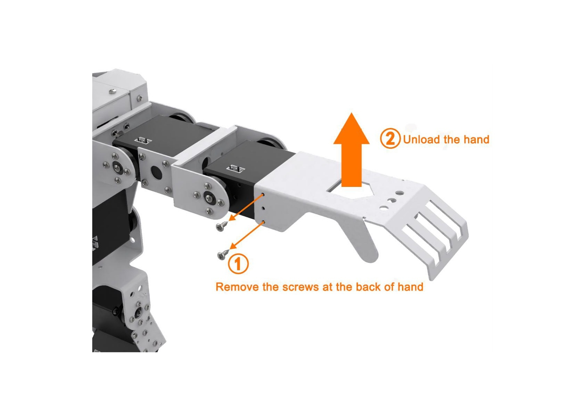

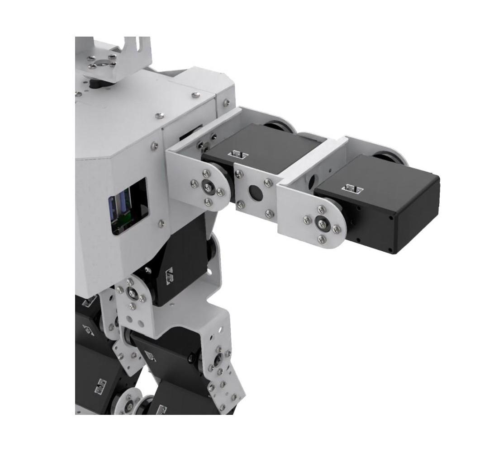

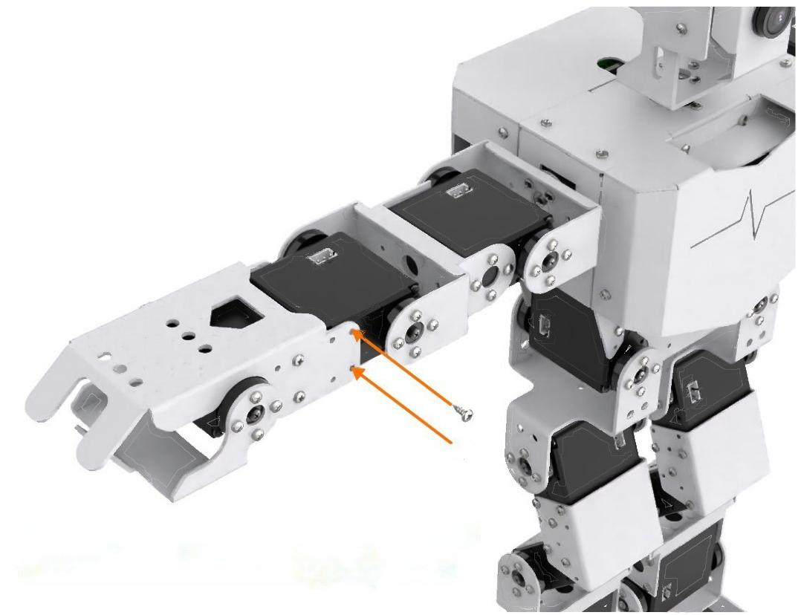

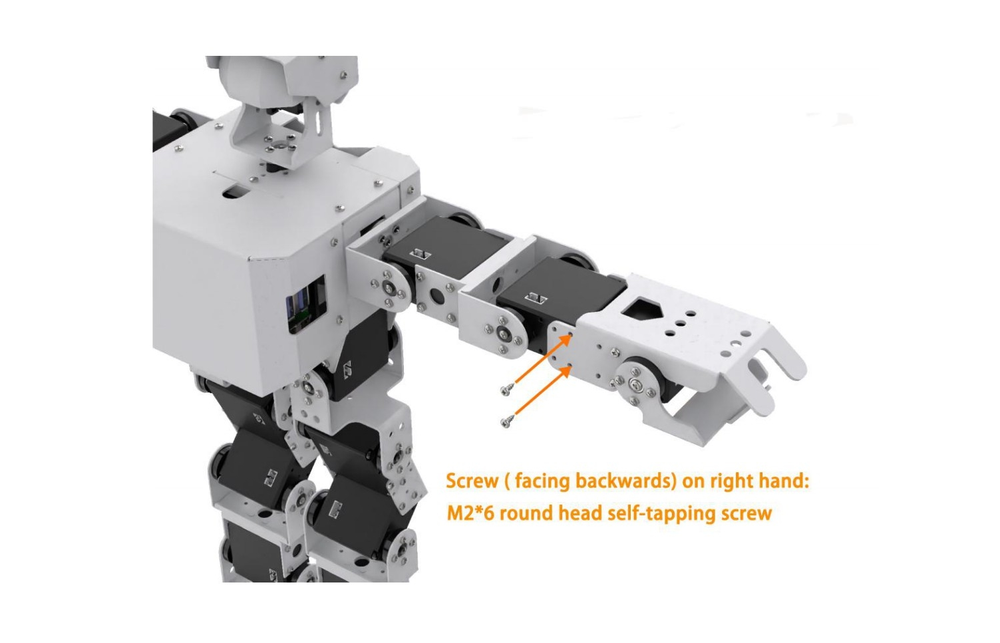

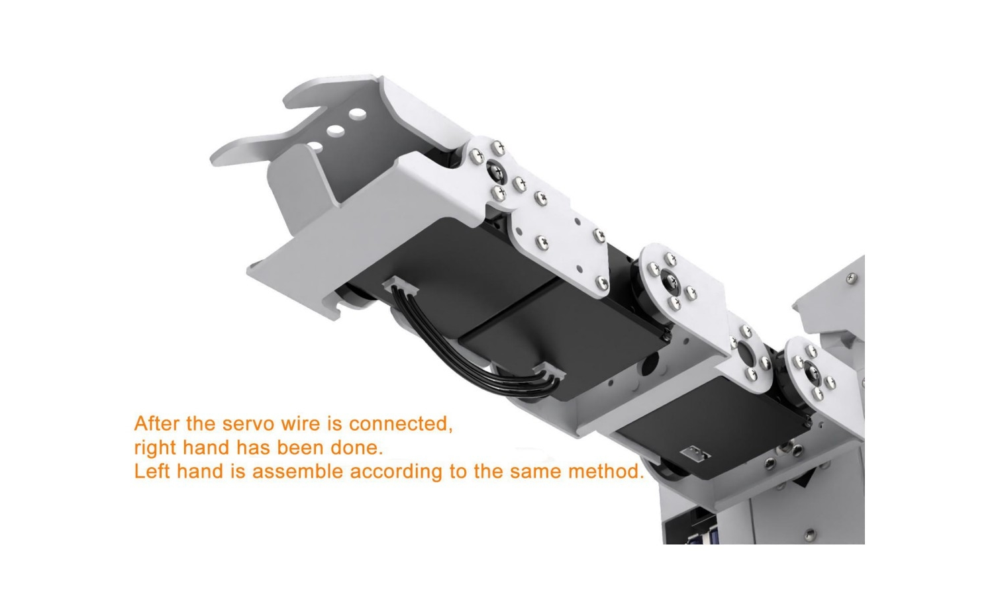

## 8.2 Color Sorting

:::{Note}
The servo on robotic hand has been set with corresponding ID and limited angle before delivery. If the ID and the limited angle change due to other operations, please refer to the official documentation to adjust.
:::

### 8.2.1 Getting Ready

(1) This lesson can be started after the robotic hands are assembled. The specific assembly method refers to [**"8.1 Assembly"**](#anchor_8_1).

(2) Place the colored block on the surface at the height of 15 cm and the error of height can not exceed 1 cm, otherwise it will affect the performance. You can use the product package box to experience this game directly.

### 8.2.2 Working Principle

The working principle of this lesson is as follow:

The color is recognized through Lab color space firstly. Then convert RGB color into Lab color space, and proceed with binarization, dilation and erosion to obtain the contour of the target color.

Then, filter out the largest contour among red, green and blue three colors through he traversal function, and circle it, so that the color of the object can be recognized.

At last, judge according to the recognized color. and control the robot to grip and place or shake its head after recognizing the corresponding color object.

### 8.2.3 Operation Step

:::{Note}
The entered command must be pay attention to case sensitivity and space.
:::

(1) Turn on the robot and connect to Raspberry Pi desktop with VNC.

(2) Click the icon  on the upper left corner of the desktop to open command line terminal.

(3) Enter the command to come to the directory of game programs:

```
cd /home/pi/TonyPi/Extend/vision_grab_course/
```

(4) Enter command to start the game:

```
python3 color_classify.py
```

(5) If want to exit the game, press **"Ctrl+C"** in the LX terminal. Please try multiple times if fail to exit.

### 8.2.4 Project Outcome

After the program is started, TonyPi Pro will squat first. When the red block is recognized, it will grip the block with right hand and place it to the right. When the blue block is recognized, it will grip the block and place it to the left. When the green block is recognized, it will shake head.

<p id="anchor_8_2_5"></p>

### 8.2.5 Function Extension

* **Modify Default Recognized Color**

The program of color sorting has three built-in colors by default, which are red, green and blue. When red and blue are recognized, TonyPi Pro will grip the corresponding object. When green is recognized, TonyPi Pro will shake its head.

Take the robot nods when recognizing red and grip when recognizing green and blue as example. The specific modification steps are as follow:

(1) Enter command to come to the directory of the game programmings:

```
cd /home/pi/TonyPi/Extend/vision_grab_course/
```

(2) Enter command to edit the file:

```
vim color_classify.py
```

(3) Find the code shown in the figure below:

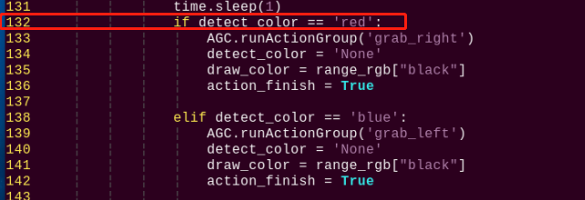

(4) Press **"i"** to enter the editing mode. Then modify **"red"** in **"`if detect_color == 'red':`"** to **"green"**.

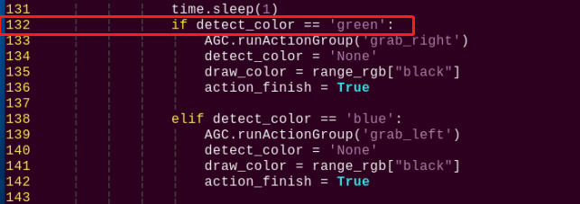

(5) Locate line 123, and then modify **"green"** in **"`elif detect_color == 'green':`"** to **"red"**.

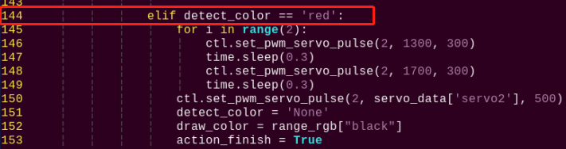

(6) After modification, press **"Esc"** and then enter **":wq"** (Please note that the colon is in front of wq). Then press **"Enter"** to save and exit the modified content.

(7) After the game is restarted, the robot will shake its head after recognizing the red block. When recognizing the blue or green block, the robot will grip and sort the block.

* **Add New Recognized Color**

In addition to three built-in recognized colors, you can add other recognized colors. This section takes orange as example and the specific operation steps are as follow:

(1) Open VNV and enter command to open Lab color setting file:

```
sudo vim TonyPi/lab_config.yaml
```

The initial value can be recorded by screenshot or file backup.

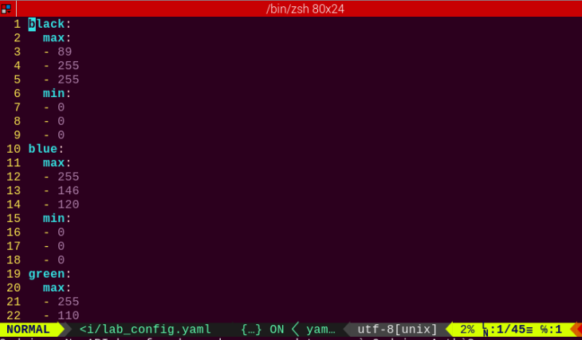

(2) Click **"LAB_Tool"** on system desktop, and then click **"Execute"** in the pop-up prompt window.


(3) Click **"Connect"** button in the lower left corner. When the picture transmitted by the camera is displayed in the interface, it means that the connection is successful. Then select **"red"** in the right frame.

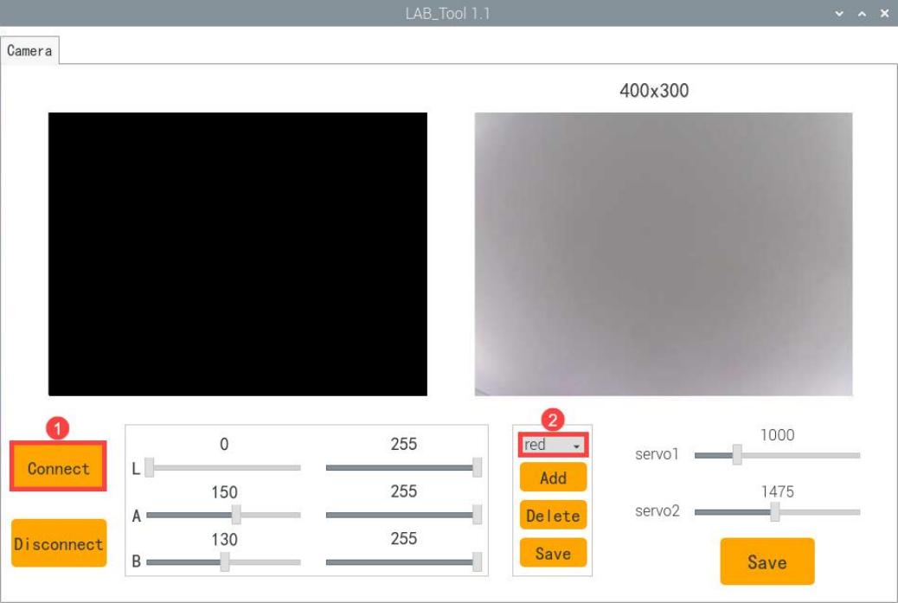

(4) Point the camera at the color you want to recognize and drag the corresponding sliders of L, A and B until the orange part in left interface becomes white and other colors become black. Then click **"save"** button behind the **"red"** to save the modified data.

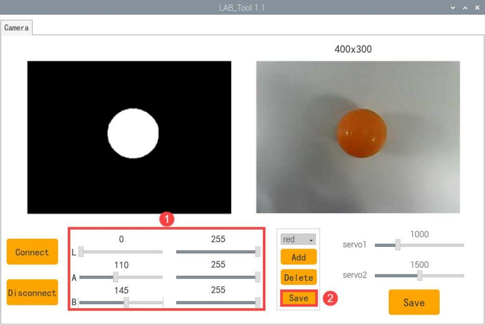

(5) After modification, enter command to view whether the color setting parameters are modified:

```
vim /home/pi/TonyPi/lab_config.yaml
```

To avoid any impact on the game, it's recommended to use the LAB_Tool to modify the value back to the initial value after the modification is completed.

(6) Check the data in red frame above. If the edited value was written in the configuration program, press **"Esc"** and enter **":wq"** to save it and exit.

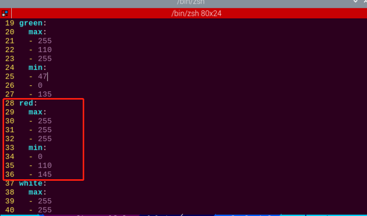

(7) According to the content in [**"8.2.5 Function Extension"**](#anchor_8_2_5), set the default color that make TonyPi Pro shake its head after recognition as red.


(8) After the game is started, place the orange object in front of the camera, you can see that TonyPi Pro performs **"shake head"** action.

(9) If want to add other colors as the recognition color, please refer to the same operation steps.

<p id="anchor_8_2_6"></p>

### 8.2.6 Program Analysis

[Source Code](../_static/source_code/Functions.zip)

The source code of this program is locate in: [/home/pi/TonyPi/Functions/ColorDetect.py](../_static/source_code/Functions.zip)

* **Import Parameter Module**

| **Import module** | **function** |
|----|----|
| `import sys` | The Python **"sys"** module has been imported for accessing system-related functions and variables. |
| `import os` | The Python **"os"** module has been imported, providing functions and methods for interacting with the operating system. |
| `import cv2` | The OpenCV library has been imported for image processing and computer vision-related functionalities |
| `import time` | The Python **"time"** module has been imported for time-related functionalities, such as delay operations. |
| `import math` | The **"math"** module provides low-level access to mathematical operations, including many commonly used mathematical functions and constants. |
| `import threading` | Provides an environment for running multiple threads concurrently. |
| `import np` | The NumPy library has been imported. It is an open-source numerical computing extension for Python, used for handling array and matrix operations. |
| `import sensor.camera as camera` | Import camera library |
| `from common import misc` | The **"Misc"** module has been imported for handling recognized rectangular data. |
| `import common.ros_robot_controller_sdk as rrc` | The robot's underlying control library has been imported for controlling servos, motors, RGB lights, and other hardware. |
| `import common.yaml_handle` | Contains functionalities or tools related to processing YAML format files. |
| `from common.controller import Controller` | Import action group execution library |

* **Function Logic**

Based on the implementation outcome, the program logic can be summarized as below:

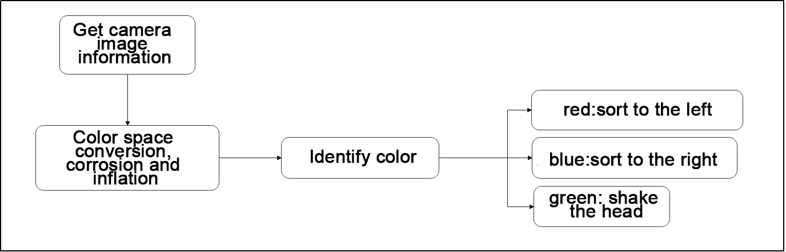

Capture image information through the camera, then process the image, specifically by performing binarization. At the same time, to reduce interference and make the image smoother, perform erosion and dilation operations on the image.

Next, obtain the maximum area contour of the target and the minimum enclosing rectangle. Then judge the color of the blocks and make some corresponding feedback.

* **Program Logic and Related Code Analysis**

From the program files, the logical flowchart of the program is as pictured:

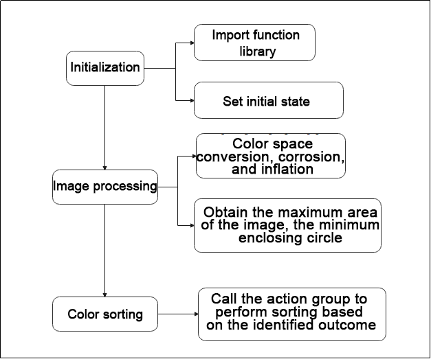

Based on the above diagram, the program's logical flow mainly consists of image processing and color sorting. The following document will be written in accordance with the program logic.

* **Initialization**

(1) Import function library

In this initialization step, the first task is to import the required libraries for subsequent program calls. For details on the imports, refer to [**"8.2.6 Import parameter module"**](#anchor_8_2_6).

{lineno-start=4}
```python
import sys
import cv2
import math
import time
import threading
import numpy as np
import hiwonder.ros_robot_controller_sdk as rrc
from hiwonder.Controller import Controller
import hiwonder.Misc as Misc
import hiwonder.Camera as Camera
import hiwonder.ActionGroupControl as AGC
import hiwonder.yaml_handle as yaml_handle
```

(2) Set initial state

Set initial state, including the initial position of servo, color threshold, etc.

{lineno-start=49}
```python
lab_data = None
servo_data = None
def load_config():
    global lab_data, servo_data
    
    lab_data = yaml_handle.get_yaml_data(yaml_handle.lab_file_path)
    servo_data = yaml_handle.get_yaml_data(yaml_handle.servo_file_path)

board = rrc.Board()
ctl = Controller(board)

# 初始位置(initial position )
def initMove():
    servo1 = servo_data['servo1']
    ctl.set_bus_servo_pulse(17, 500, 500)
    ctl.set_bus_servo_pulse(18, 500, 500)
    ctl.set_pwm_servo_pulse(1, servo1, 500)
    ctl.set_pwm_servo_pulse(2, servo_data['servo2'], 500)
```

* **Image processing**

(1) Image pre-processing

Resizing and Gaussian blur processing of the image.

{lineno-start=182}
```python
frame_resize = cv2.resize(img_copy, size, interpolation=cv2.INTER_NEAREST)
frame_gb = cv2.GaussianBlur(frame_resize, (3, 3), 3)
```

`cv2.resize(img_copy, size, interpolation=cv2.INTER_NEAREST)` is an operation to resize the image.

① The first parameter `img_copy` is the image to be resized.

② The second parameter `size` is the target size.

③ The third parameter `interpolation` is the interpolation method, which is used to determine the pixel interpolation algorithm used for resizing.

`cv2.GaussianBlur(frame_resize, (3, 3), 3)` applies Gaussian blur to the image.

① The first parameter `frame_resize` is the image to be blurred.

② The second parameter `(3, 3)` is the size of the Gaussian kernel, indicating that the width and height of the kernel are both 3.

③ The third parameter `3` is the standard deviation of the Gaussian kernel, used to control the degree of blur.

(2) Color space conversion

Convert the BGR image to LAB image.

{lineno-start=184}
```python
frame_lab = cv2.cvtColor(frame_gb, cv2.COLOR_BGR2LAB)  # 将图像转换到LAB空间(Convert the image to LAB space)
```

(3) Binarization processing

Use `inRange()` function in cv2 library to process binarization.

{lineno-start=193}
```python
frame_mask = cv2.inRange(frame_lab,
                         (lab_data[i]['min'][0],
                          lab_data[i]['min'][1],
                          lab_data[i]['min'][2]),
                         (lab_data[i]['max'][0],
                          lab_data[i]['max'][1],
                          lab_data[i]['max'][2]))  #对原图像和掩模进行位运算(Perform positional operations on the original image and mask)
```

① The first parameter `frame_lab` is inputting image.

② The second parameter `lab_data[i]['min'][0]` is the lower limit of the threshold.

③ The third parameter `lab_data[i]['max'][0]` is the upper limit of the threshold.

(4) Corrosion and inflation

{lineno-start=200}
```python
eroded = cv2.erode(frame_mask, cv2.getStructuringElement(cv2.MORPH_RECT, (3, 3)))  #腐蚀(corrosion)
dilated = cv2.dilate(eroded, cv2.getStructuringElement(cv2.MORPH_RECT, (3, 3))) #膨胀(expand)
```

`eroded = cv2.erode(frame_mask, cv2.getStructuringElement(cv2.MORPH_RECT, (3, 3)))` is the operation to perform corrosion on the binary image.

① The first parameter `frame_mask` is the binary image on which morphological operations are to be performed.

② The second parameter `cv2.getStructuringElement(cv2.MORPH_RECT, (3, 3))` is the structuring element for the corrosion operation. A rectangular structuring element of size (3, 3) is used here.

The dilation function follows the same principle.

(5) Get the contour with the largest area

After completing the above image processing, it is necessary to obtain the contours of the recognized targets. This involves using the `findContours()` function from the cv2 library.

{lineno-start=204}
```python
contours = cv2.findContours(dilated, cv2.RETR_EXTERNAL, cv2.CHAIN_APPROX_NONE)[-2]  #找出轮廓(Find the outline)
areaMaxContour, area_max = getAreaMaxContour(contours)  #找出最大轮廓(Find the maximum contour)
```

Take code `contours = cv2.findContours(dilated, cv2.RETR_EXTERNAL, cv2.CHAIN_APPROX_NONE)[-2]` as example:

① The first parameter `dilated` is inputting image.

② The second parameter `cv2.RETR_EXTERNAL` is the contour retrieval mode.

③ The third parameter `cv2.CHAIN_APPROX_NONE)[-2]` is the contour approximation method.

Find the contour with the largest area in the obtained contour. In order to avoid interference, you need to set a minimum value. The target contour is considered valid only if its area is greater than this value.

{lineno-start=35}
```python
def getAreaMaxContour(contours):
    contour_area_temp = 0
    contour_area_max = 0
    area_max_contour = None

    for c in contours:  # 历遍所有轮廓(Go through all the contours)
        contour_area_temp = math.fabs(cv2.contourArea(c))  # 计算轮廓面积(Calculate contour area)
        if contour_area_temp > contour_area_max:
            contour_area_max = contour_area_temp
            if contour_area_temp > 50:  # 只有在面积大于50时，最大面积的轮廓才是有效的，以过滤干扰(Only when the area is greater than 50, the contour of the maximum area is effective to filter out interference)
                area_max_contour = c

    return area_max_contour, contour_area_max  # 返回最大的轮廓(Return the largest contour)
```

Judge the color block with the largest color area.

Judge the color with the largest area contour and add the result to `color_list`.

{lineno-start=206}
```python
if areaMaxContour is not None:
    if area_max > max_area:#找最大面积(Find the maximum area)
        max_area = area_max
        color_area_max = i
        areaMaxContour_max = areaMaxContour
```

(6) Multiple judgement

Perform multiple judgement to get the average value, and ensure the identified color.

{lineno-start=226}
```python
color_list.append(color)

if len(color_list) == 3:  #多次判断(Multiple judgments)
    # 取平均值(averaging)
    color = round(np.mean(np.array(color_list)))
    color_list = []
    if color == 1:
        detect_color = 'red'
        draw_color = range_rgb["red"]
    elif color == 2:
        detect_color = 'green'
        draw_color = range_rgb["green"]
    elif color == 3:
        detect_color = 'blue'
        draw_color = range_rgb["blue"]
    else:
        detect_color = 'None'
        draw_color = range_rgb["black"]
```

Print the identified result

Use the `cv2.putText()` function in the cv2 library to draw the text on an image.

{lineno-start=249}
```python
cv2.putText(img, "Color: " + detect_color, (10, img.shape[0] - 10), cv2.FONT_HERSHEY_SIMPLEX, 0.65, draw_color, 2)
```

Take the code `cv2.putText(img, "Color: " + detect_color, (10, img.shape[0] - 10), cv2.FONT_HERSHEY_SIMPLEX, 0.65, draw_color, 2)` as example:

① The first parameter `img` is the image being drawn.

② The second parameter `'Color: ' + detect_color` is the information drawn on the image.

③ The third parameter `(10, img.shape[0] - 10)` is the starting coordinate of the text, i.e., the position of the bottom-left corner of the text. Here, the text is 10 pixels away from the left and bottom edges of the image, respectively.

④ The fourth parameter `cv2.FONT_HERSHEY_SIMPLEX` is the font type.

⑤ The fifth parameter `0.65` is the size scaling factor for the text.

⑥ The sixth parameter `draw_color` is the color of the text.

⑦ The seventh parameter `2` is the thickness of the text.

* **Color block sorting**

If the color recognition result is not empty, make the buzzer beep once. After recognizing red or blue, control the robot to execute the corresponding action group as shown in the figure below.

{lineno-start=127}
```python
if detect_color != 'None':
    board.set_buzzer(1900, 0.1, 0.9, 1)
    action_finish = False
    
    time.sleep(1)
    if detect_color == 'red':
        AGC.runActionGroup('grab_right')
        detect_color = 'None'
        draw_color = range_rgb["black"]                     
        action_finish = True
        
    elif detect_color == 'blue':
        AGC.runActionGroup('grab_left')
        detect_color = 'None'
        draw_color = range_rgb["black"]                     
        action_finish = True
```

Take code `AGC.runActionGroup('grab_right')` as example:

Use the `AGC.runActionGroup` function to call action group. `grab_right` is the name of action group.

If green is detected, control servo 2 of the robot to move, making the robot shake its head, then return to the neutral position, as shown in the figure below.

{lineno-start=144}
```python
elif detect_color == 'green':
    for i in range(2):
        ctl.set_pwm_servo_pulse(2, 1300, 300)
        time.sleep(0.3)
        ctl.set_pwm_servo_pulse(2, 1700, 300)
        time.sleep(0.3)
    ctl.set_pwm_servo_pulse(2, servo_data['servo2'], 500)
    detect_color = 'None'
    draw_color = range_rgb["black"]                     
    action_finish = True
```

Take the code `ctl.set_pwm_servo_pulse(2, 1300, 300)` as example:

① The first parameter `2` indicates the servo ID being controlled.

② The second parameter `1300` represents the pulse width for servo ID 2. 1500 controls the servo to return to the neutral position.

③ The third parameter `300` represents the servo's movement time, which is 300 milliseconds.

## 8.3 AprilTag Tracking

:::{Note}
The servo on robotic hand has been set with corresponding ID and limited angle before delivery. If the ID and the limited angle change due to other operations, please refer to the tutorial in [**"Servo Debugging Method"**](resources_download.md) to adjust.
:::

### 8.3.1 Getting Ready

This lesson can be started after the robotic hands are assembled. The specific assembly method refers to [**"8.1 Assembly"**](#anchor_8_1).

### 8.3.2 Working Principle

The working principle of this lesson is as follow:

The color is recognized through Lab color space firstly. Then convert RGB color into Lab color space, and proceed with binarization, dilation and erosion to obtain the contour of the target color. Then frame the color with rectangle to realize the color recognition.

Next, call the action group that has been set and let the robot pick up the object.

Then, control the robot's head in motion to search AprilTag within the visual range. The screen is processed by positioning, image segmentation and contour finding first. After the contour is positioned, quadrilateral detection is performed. Through the acquisition of the four corner points, the straight line is fitted to form a closed loop, and the identification and position acquisition of AprilTag are completed.

The source code of the program is located in: [/home/pi/TonyPi/Extend/vision_grab_course/apriltag_track.py](../_static/source_code/vision_grab_course.zip)

### 8.3.3 Operation Steps

:::{Note}
The entered command must be pay attention to case sensitivity and space.
:::

(1) Turn on the robot and connect to Raspberry Pi desktop with VNC.

(2) Click the icon  on the upper left corner of the desktop to open command line terminal.

(3) Enter command to go to the directory of game program:

```
cd /home/pi/TonyPi/Extend/vision_grab_course/
```

(4) Enter command to start the game:

```
python3 apriltag_track.py
```

(5) If want to exit the game, press **"Ctrl+C"** in the LX terminal. Please try multiple times if fail to exit.

### 8.3.4 Project Outcome

After starting the game, TonyPi Pro will detect the object within the visual range. When one of colored blocks is recognized, TonyPi Pro will pick up the block, and then move to the AprilTag and put it down.

<p id="anchor_8_3_5"></p>

### 8.3.5 Program Analysis

[Source Code](../_static/source_code/vision_grab_course.zip)

The source code of this program is locate in: [/home/pi/TonyPi/Extend/vision_grab_course/apriltag_track.py](../_static/source_code/vision_grab_course.zip)

* **Import Parameter Module**

| **Import module** | **function** |
|----|----|
| `import sys` | The Python **"sys"** module has been imported for accessing system-related functions and variables. |
| `import os` | The Python **"os"** module has been imported, providing functions and methods for interacting with the operating system. |
| `import cv2` | The OpenCV library has been imported for image processing and computer vision-related functionalities. |
| `import time` | The Python **"time"** module has been imported for time-related functionalities, such as delay operations. |
| `import math` | The **"math"** module provides low-level access to mathematical operations, including many commonly used mathematical functions and constants. |
| `import threading` | Provides an environment for running multiple threads concurrently. |
| `import np` | The NumPy library has been imported. It is an open-source numerical computing extension for Python, used for handling array and matrix operations. |
| `import sensor.camera as camera` | Import camera library |
| `from common import misc` | The **"Misc"** module has been imported for handling recognized rectangular data. |
| `import common.ros_robot_controller_sdk as rrc` | The robot's low-level control library has been imported for controlling servos, motors, RGB lights, and other hardware. |
| `import common.yaml_handle` | Contains functionalities or tools related to processing YAML format files. |
| `from common.controller import Controller` | Import action group execution library |

* **Function Logic**

Based on the implementation outcome, the program logic can be summarized as below:

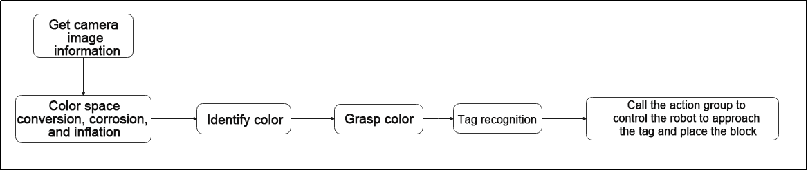

Capture image information through the camera, then process the image, specifically by performing binarization. At the same time, to reduce interference and make the image smoother, perform erosion and dilation operations on the image.

Next, proceed with color recognition for block grabbing. Then, based on the label recognition results, control the robot to approach and place the block.

* **Program Logic and Related Code Analysis**

From the program files, the logical flowchart of the program is as pictured:

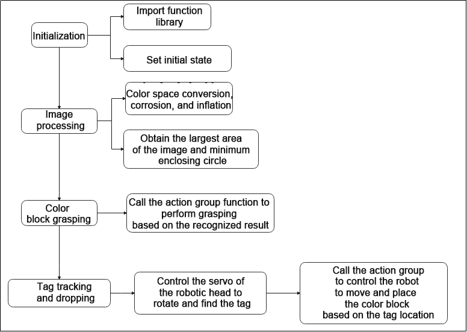

Based on the above diagram, the program's logical flow mainly consists of image processing and color tracking. The following document will be written in accordance with the program logic.

* **Initialization**

(1) Import function library

In this initialization step, the first task is to import the required libraries for subsequent program calls. For details on the imports, refer to [**"8.3.5 Import parameter module"**](#anchor_8_3_5).

{lineno-start=4}
```python
import sys
import cv2
import math
import time
import threading
import numpy as np
import hiwonder.ros_robot_controller_sdk as rrc
from hiwonder.Controller import Controller
import hiwonder.Misc as Misc
import hiwonder.apriltag as apriltag
import hiwonder.ActionGroupControl as AGC
import hiwonder.yaml_handle as yaml_handle
```

(2) Set initial state

Set initial state, including the initial position of servo, PID, color threshold value, etc.

{lineno-start=23}
```python
debug = False
tag_id = None
action_finish = False
CentreX = 320

objective_x, objective_y = 0, 0
color, color_x, color_y, angle = None, 0, 0, 0

lab_data = None
servo_data = None
def load_config():
    global lab_data , servo_data
    
    lab_data = yaml_handle.get_yaml_data(yaml_handle.lab_file_path)
    servo_data = yaml_handle.get_yaml_data(yaml_handle.servo_file_path)

load_config()
servo1, servo2 = servo_data['servo1'], servo_data['servo2']

board = rrc.Board()
ctl = Controller(board)
```

Set the different action function to facilitate subsequent robot motion calls.

{lineno-start=54}
```python
def initMove():
    ctl.set_pwm_servo_pulse(1, servo1, 1000)
    ctl.set_pwm_servo_pulse(2, servo2, 1000)
    ctl.set_bus_servo_pulse(17, 500, 1000)
    ctl.set_bus_servo_pulse(18, 500, 1000)

def right_splay():
    ctl.set_bus_servo_pulse(17, 760, 1000)
    time.sleep(1)
    
def right_grasp():
    ctl.set_bus_servo_pulse(17, 500, 1000)
    time.sleep(1)
    
def up_hand():
    ctl.set_bus_servo_pulse(16, 650, 1000)
    time.sleep(0.5)
    ctl.set_bus_servo_pulse(15, 260, 1000)
    ctl.set_bus_servo_pulse(14, 180, 1000)
    ctl.set_bus_servo_pulse(17, 500, 1000)
    time.sleep(1)

def down_hand():
    ctl.set_bus_servo_pulse(15, 200, 1000)
    ctl.set_bus_servo_pulse(14, 460, 1000)
    ctl.set_bus_servo_pulse(17, 500, 1000)
    time.sleep(0.6)
    ctl.set_bus_servo_pulse(16, 275, 1000)
    time.sleep(1)
```

* **Tag recognition**

(1) Create AprilTag detector

Use the default tag patterns provided by the AprilTag library for visual marker detection. It can be utilized to detect AprilTag tags in images and obtain information about these tags, such as their position coordinates and IDs.

{lineno-start=212}
```python
detector = apriltag.Detector(searchpath=apriltag._get_demo_searchpath())
```

(2) Color space conversion

Convert the BGR image to LAB image.

{lineno-start=215}
```python
gray = cv2.cvtColor(img, cv2.COLOR_BGR2GRAY)
```

(3) Detect tag

Utilize the created detector object (i.e., AprilTag detector) to detect AprilTag tags in the grayscale image `gray`.

{lineno-start=216}
```python
detections = detector.detect(gray, return_image=False)
```

(4) Get tag information

Obtain the corner information of the tag ID, use the `cv2.drawContours` function to encircle the tag in the image; retrieve the tag ID, tag class, obtain the tag center point, and rotation angle.

{lineno-start=218}
```python
if len(detections) != 0:
    for detection in detections:                        
        corners = np.int0(detection.corners)  
        cv2.drawContours(img, [np.array(corners, int)], -1, (0, 255, 255), 2)

        tag_family = str(detection.tag_family, encoding='utf-8')
        tag_id = int(detection.tag_id)  

        objective_x, objective_y = int(detection.center[0]), int(detection.center[1])  
        
        object_angle = int(math.degrees(math.atan2(corners[0][1] - corners[1][1], corners[0][0] - corners[1][0])))  
        
        return [tag_family, tag_id, objective_x, objective_y]
        
return None, None, None, None
```

* **Image processing**

(1) Image pre-processing

Resizing and Gaussian blur processing of the image.

{lineno-start=237}
```python
frame_resize = cv2.resize(img, size, interpolation=cv2.INTER_NEAREST)
frame_gb = cv2.GaussianBlur(frame_resize, (3, 3), 3)
```

`cv2.resize(img_copy, size, interpolation=cv2.INTER_NEAREST)` is an operation to resize the image.

① The first parameter `img_copy` is the image to be resized.

② The second parameter `size` is the target size.

③ The third parameter `interpolation` is the interpolation method, which is used to determine the pixel interpolation algorithm used for resizing.

`cv2.GaussianBlur(frame_resize, (3, 3), 3)` applies Gaussian blur to the image.

① The first parameter `frame_resize` is the image to be blurred.

② The second parameter `(3, 3)` is the size of the Gaussian kernel, indicating that the width and height of the kernel are both 3.

③ The third parameter `3` is the standard deviation of the Gaussian kernel, used to control the degree of blur.

(2) Color space conversion

Convert the BGR image to LAB image.

{lineno-start=240}
```python
frame_lab = cv2.cvtColor(frame_gb, cv2.COLOR_BGR2LAB)  # 将图像转换到LAB空间(Convert the image to LAB space)
```

(3) Binarization processing

Use `inRange()` function in cv2 library to process binarization.

{lineno-start=246}
```python
frame_mask = cv2.inRange(frame_lab,
                         (lab_data[i]['min'][0],
                          lab_data[i]['min'][1],
                          lab_data[i]['min'][2]),
                         (lab_data[i]['max'][0],
                          lab_data[i]['max'][1],
                          lab_data[i]['max'][2]))  #对原图像和掩模进行位运算(Perform positional operations on the original image and mask)
```

① The first parameter `frame_lab` is inputting image.

② The second parameter `lab_data[i]['min'][0]` is the lower limit of the threshold.

③ The third parameter `lab_data[i]['max'][0]` is the upper limit of the threshold.

(4) Corrosion and inflation

{lineno-start=253}
```python
eroded = cv2.erode(frame_mask, cv2.getStructuringElement(cv2.MORPH_RECT, (3, 3)))  #腐蚀(corrosion)
dilated = cv2.dilate(eroded, cv2.getStructuringElement(cv2.MORPH_RECT, (3, 3))) #膨胀(expand)
```

`eroded = cv2.erode(frame_mask, cv2.getStructuringElement(cv2.MORPH_RECT, (3, 3)))` is the operation to perform corrosion on the binary image.

① The first parameter `frame_mask` is the binary image on which morphological operations are to be performed.

② The second parameter `cv2.getStructuringElement(cv2.MORPH_RECT, (3, 3))` is the structuring element for the corrosion operation. A rectangular structuring element of size (3, 3) is used here.

The dilation function follows the same principle.

(5) Get the contour with the largest area

After completing the above image processing, it is necessary to obtain the contours of the recognized targets. This involves using the `findContours()` function from the cv2 library.

{lineno-start=255}
```python
contours = cv2.findContours(dilated, cv2.RETR_EXTERNAL, cv2.CHAIN_APPROX_NONE)[-2]  # 找出轮廓(Find the outline)
areaMaxContour, area_max = getAreaMaxContour(contours)  # 找出最大轮廓(Find the maximum contour)
```

Take code `contours = cv2.findContours(dilated, cv2.RETR_EXTERNAL, cv2.CHAIN_APPROX_NONE)[-2]` as example:

① The first parameter `dilated` is inputting image.

② The second parameter `cv2.RETR_EXTERNAL` is the contour retrieval mode.

③ The third parameter `cv2.CHAIN_APPROX_NONE)[-2]` is the contour approximation method.

Find the contour with the largest area in the obtained contour. In order to avoid interference, you need to set a minimum value. The target contour is considered valid only if its area is greater than this value.

{lineno-start=91}
```python
def getAreaMaxContour(contours):
    contour_area_temp = 0
    contour_area_max = 0
    area_max_contour = None

    for c in contours:  # 历遍所有轮廓(Go through all the contours)
        contour_area_temp = math.fabs(cv2.contourArea(c))  # 计算轮廓面积(Calculate contour area)
        if contour_area_temp > contour_area_max:
            contour_area_max = contour_area_temp
            if contour_area_temp > 50:  # 只有在面积大于50时，最大面积的轮廓才是有效的，以过滤干扰(Only when the area is greater than 50, the contour of the maximum area is effective to filter out interference)
                area_max_contour = c

    return area_max_contour, contour_area_max  # 返回最大的轮廓(Return the largest contour)
```

(6) Get and return the recognized result, center coordinates and angle

Get the four vertices of the minimum rectangle of the largest area contour, use the `cv2.drawContours` function to draw the rectangular border on the returned image. Obtain the diagonal points of the rectangle and calculate the coordinates of the center point.

{lineno-start=258}
```python
if area_max > 500: 
    rect = cv2.minAreaRect(areaMaxContour)
    angle_ = rect[2]

    box = np.int0(cv2.boxPoints(rect))
    for j in range(4):
        box[j, 0] = int(Misc.map(box[j, 0], 0, size[0], 0, img_w))
        box[j, 1] = int(Misc.map(box[j, 1], 0, size[1], 0, img_h))

    cv2.drawContours(img, [box], -1, range_rgb[i], 2)
    
    #获取矩形的对角点(Get the diagonal points of the rectangle)
    ptime_start_x, ptime_start_y = box[0, 0], box[0, 1]
    pt3_x, pt3_y = box[2, 0], box[2, 1]             
    center_x_, center_y_ = int((ptime_start_x + pt3_x) / 2), int((ptime_start_y + pt3_y) / 2)#中心点(Center point)
    cv2.circle(img, (center_x_, center_y_), 5, (0, 255, 255), -1)#画出中心点(Draw the center point)
    
    distance = pow(center_x_ - img_w/2, 2) + pow(center_y_ - img_h, 2)
    if distance < center_max_distance:  # 寻找距离最近的物体来搬运(Find the nearest object to transport)
        center_max_distance = distance
        color = i
        center_x, center_y, angle = center_x_, center_y_, angle_
```

* **Tag tracking and placing**

(1) Call the buzzer and action group function to grasp color block based on the color recognition result.

{lineno-start=115}
```python
if color_y >= 300:
    board.set_buzzer(1900, 0.1, 0.9, 1)
    up_hand()
    right_splay()
    time.sleep(2)
    board.set_buzzer(1900, 0.1, 0.9, 1)
    time.sleep(0.1)
    board.set_buzzer(1900, 0.1, 0.9, 1)
    right_grasp()
    down_hand()
    action_finish = True
```

(2) Control the servo of robot heat to rotate to find the tag card in the field of vision.

{lineno-start=181}
```python
if servo1 >= 1250:
    servo1_st = False
elif servo1 <= servo_data['servo1']:
    servo1_st = True    
if servo1_st:
    servo1 += 5
else:
    servo1 -= 5
    
if servo2 >= 1700:
    servo2_st = False
elif servo2 <= 1300:
    servo2_st = True
    
if servo2_st:
    servo2 += 5
else:
    servo2 -= 5
ctl.set_pwm_servo_pulse(1, servo1, 30)
ctl.set_pwm_servo_pulse(2, servo2, 30)
```

Take code `ctl.set_pwm_servo_pulse(1, servo1, 30)` as example:

① The first parameter `1` indicates the servo ID being controlled.

② The second parameter `servo1` represents the pulse width for servo ID 1. 1500 controls the servo to return to the neutral position.

③ The third parameter `30` represents the servo's movement time, which is 30 milliseconds.

(3) Based on the difference between the center point coordinates of the tag and CentreX, call the action group to control the robot to move closer to the tag.

{lineno-start=134}
```python
if objective_x - CentreX >= 50 and objective_y < 240:
    AGC.runAction('turn_right')
    
elif objective_x - CentreX <= -50 and objective_y < 240:
    AGC.runAction('turn_left')

elif objective_y <= 280:
    AGC.runAction('go_forward')

elif objective_x - CentreX >= 30:
    AGC.runAction('right_move_20')
    
elif objective_x - CentreX <= -30:
    AGC.runAction('left_move_20')

elif 30 > objective_x - CentreX >= 10:
    AGC.runAction('right_move')
    
elif -30 < objective_x - CentreX <= -10:
    AGC.runAction('left_move')
    
elif 280 < objective_y < 320:
    AGC.runAction('go_forward_one_step')

elif objective_y >= 320:
    board.set_buzzer(1900, 0.1, 0.9, 1)
    AGC.runAction('put_down_object')
    right_splay()
    time.sleep(0.5)
    right_grasp()
    AGC.runAction('put_up_object')
    time.sleep(2)
    action_finish = False
```

Take the code `AGC.runAction('turn_right')` as example:

Use the `AGC.runAction` function to call the action group. `turn_right` is the name of action group.

## 8.4 Voice-Controlled Object Gripping

### 8.4.1 Preparation

:::{Note}

The palm's servo ID and limits have already been preconfigured before shipment, so users do not need to set them manually. 

:::

(1) This lesson can be started after the robotic hands are assembled. The specific assembly method refers to [8.1 Assembly](#anchor_8_1).

(2) Install the WonderEchoPro module. Installation instructions can be found in [6.1.2 WonderEcho Pro Installation](6_ai_voice_interaction_course.md#introduction-to-wonderecho-pro).

(3) Place the color block on a platform 15 cm high. The height deviation must not exceed 1 cm, as it may affect functionality. You may use the robot's packaging box as a platform for this activity.

### 8.4.2 Feature Overview

The workflow for this feature is as follows:

First, the WonderEchoPro module is activated to receive and interpret voice commands. Based on the interpreted result, the system identifies the target color to locate.

Next, color recognition is performed using the Lab color space. The RGB color input is converted to Lab, and then a series of image processing steps—such as binarization, dilation, and erosion—are applied to isolate contours that match the target color. A rectangular bounding box is drawn around the detected color area, and the center coordinates of the object are extracted to determine its position.

Finally, using the object's coordinates, the robot is guided to move close to the object and execute an action group to grasp it, completing the voice-controlled object-grabbing task.

### 8.4.3 Operation Steps

:::{Note}

The entered command must be pay attention to case sensitivity and space.

:::

(1) Turn on the robot and connect to Raspberry Pi desktop with VNC.

(2) Click the icon  on the upper left corner of the desktop to open command line terminal.

(3) Enter command to go to the directory of game program:

```bash
cd /home/pi/TonyPi/Extend/vision_grab_course/
```

(4) Enter the command below, and then press " **Enter**" to start the game.

```bash
python3 asr_color_detect.py
```

(5) If want to exit the game, press "**Ctrl+C**" in the LX terminal. Please try multiple times if fail to exit.

### 8.4.4 Project Outcome

Once the feature is activated, the user can speak a specific command, and the robot will grasp the corresponding color block.

Before using this function, please ensure the wake word is set to either "**小幻小幻(Chinese)**" or "**TonyPi**". For detailed instructions on setting the wake word, refer to  [6.1.3 Firmware Flashing Method](6_ai_voice_interaction_course.md#firmware-flashing-method) .

The following table outlines the relationship between voice commands and the robot's corresponding actions:

<table class="docutils-nobg" border="1">
  <thead>
    <tr>
      <th>NO.</th>
      <th>Command</th>
      <th>Function</th>
    </tr>
  </thead>
  <tbody>
    <tr>
      <td>1</td>
      <td>小幻小幻/Tonypi</td>
      <td>Wake word (must be spoken)</td>
    </tr>
    <tr>
      <td>2</td>
      <td>na hong se (pick red)</td>
      <td>Robot picks up the red block</td>
    </tr>
    <tr>
      <td>3</td>
      <td>na lv se (pick green)</td>
      <td>Robot picks up the green block</td>
    </tr>
    <tr>
      <td>4</td>
      <td>na lan se (pick blue)</td>
      <td>Robot picks up the blue block</td>
    </tr>
  </tbody>
</table>

:::{Note}

* Always say the wake word before giving a pick-up command.

* After saying the wake word, if the WonderEchoPro module responds with "**I'm here**", it means the wake-up was successful.

:::

### 8.4.5 Program Analysis

The source code for this program is located at: [/home/pi/TonyPi/Extend/vision_grab_course/asr_color_detect.py](../_static/source_code/vision_grab_course.zip).

* **Import Parameter Modules**

(1) `import sys`:Imports Python's sys module to access system-specific functions and variables.

(2) `import os`:Imports the os module for interacting with the operating system.

(3) `import cv2`:Imports the OpenCV library for image processing and computer vision tasks.

(4) `import time`:Imports Python's time module for time-related functions, such as delays.

(5) `import serial`:Used for serial communication with hardware devices.

(6) `import threading`:Provides a multithreading environment.

(7) `import numpy as np`:Imports the NumPy library for numerical operations on arrays and matrices.

(8) `from hiwonder import fps`:Calculates frames per second (FPS).

(9) `from speech import speech`:Imports speech recognition and synthesis modules.

(10) `import hiwonder.ros_robot_controller_sdk as rrc`:Imports the robot control SDK for controlling servos, motors, RGB lights, etc.

(11) `import hiwonder.yaml_handle as yaml_handle`:Provides tools for handling YAML-formatted files.

(12) `from hiwonder.Controller import Controller`:Imports the motion control library.

* **Feature Logic**

The camera captures image data, which is then processed through binarization. To reduce noise and make the image smoother, erosion and dilation operations are applied.

Next, based on the voice recognition result, the robot is controlled to approach the color block, perform a grasping action, and place the block accordingly.

* **Program Logic and Code Analysis**

(1) Initialization:

① Import Function Library

The first step in initialization is to import all the necessary libraries. This ensures that the required functions and modules are available for use throughout the program and lays the foundation for the subsequent operations.

{lineno-start=4}

```python
import os
import sys
import cv2
import math
import time
import serial
import threading
import numpy as np
from hiwonder import fps
from speech import speech
import hiwonder.ros_robot_controller_sdk as rrc
from hiwonder.Controller import Controller
import hiwonder.Misc as Misc
import hiwonder.ActionGroupControl as AGC
import hiwonder.yaml_handle as yaml_handle
```

② Set the Initial Status

Configure the initial state, including servo starting positions, color threshold settings, and voice command keywords.

{lineno-start=38}

```python
lab_data = None
servo_data = None
def load_config():
    global lab_data
    global servo_data
    lab_data = yaml_handle.get_yaml_data(yaml_handle.lab_file_path)
    servo_data = yaml_handle.get_yaml_data(yaml_handle.servo_file_path)

load_config()

range_rgb = {
    'red': (0, 0, 255),
    'blue': (255, 0, 0),
    'green': (0, 255, 0),
    'black': (0, 0, 0),
    'white': (255, 255, 255),
    'None': (255, 255, 255)}

board = rrc.Board()
ctl = Controller(board)

# 初始位置(initial position)
def initMove():
    ctl.set_pwm_servo_pulse(1,servo_data['servo1'],1000)
    ctl.set_pwm_servo_pulse(2,servo_data['servo2'],1000) 
    ctl.set_bus_servo_pulse(17, 500, 1000)
    ctl.set_bus_servo_pulse(18, 500, 1000)
```

(2) Image Processing

① Image Preprocessing

The image undergoes resizing and Gaussian blur to prepare it for further analysis.

{lineno-start=155}

```python
    frame_resize = cv2.resize(img, size, interpolation=cv2.INTER_NEAREST)
    frame_gb = cv2.GaussianBlur(frame_resize, (3, 3), 3)   
```

`cv2.resize(img_copy, size, interpolation=cv2.INTER_NEAREST)`: This function resizes the input image.

* `img_copy`: The image to be resized.

* `size`: The target dimensions (width, height).

* `interpolation`: The interpolation method used for resizing. cv2.INTER_NEAREST applies nearest-neighbor interpolation.

cv2.GaussianBlur(frame_resize, (3, 3), 3): This applies Gaussian blur to the image to reduce noise and smooth the result.

* `frame_resize`: The image to be blurred.

* `(3, 3)`: The size of the Gaussian kernel (width and height both set to 3).

* `3`: The standard deviation of the Gaussian kernel. Larger values result in a stronger blur effect.

② Color Space Conversion

Convert the image from BGR to LAB color space.

{lineno-start=157}

```python
    frame_lab = cv2.cvtColor(frame_gb, cv2.COLOR_BGR2LAB)  # 将图像转换到LAB空间(convert the image to LAB space)
```

③ Binarization Processing

The cv2.inRange() function from the OpenCV library is used to perform binarization on the image.

{lineno-start=162}

```python
        frame_mask = cv2.inRange(frame_lab,
                                 (lab_data[target_color]['min'][0],
                                  lab_data[target_color]['min'][1],
                                  lab_data[target_color]['min'][2]),
                                 (lab_data[target_color]['max'][0],
                                  lab_data[target_color]['max'][1],
                                  lab_data[target_color]['max'][2]))  #对原图像和掩模进行位运算(perform bitwise operation to original image and mask)
```

**First parameter**: frame_lab — the input image in LAB color space

**Second parameter**: lab_data[i]['min'][0] — the lower threshold

**Third parameter**: lab_data[i]['max'][0] — the upper threshold

④ Corrosion and Dilation

{lineno-start=169}

```python
        eroded = cv2.erode(frame_mask, cv2.getStructuringElement(cv2.MORPH_RECT, (3, 3)))  #腐蚀(corrosion)
        dilated = cv2.dilate(eroded, cv2.getStructuringElement(cv2.MORPH_RECT, (3, 3))) #膨胀(dilation)
```

`eroded = cv2.erode(frame_mask, cv2.getStructuringElement(cv2.MORPH_RECT, (3, 3)))`:This line performs erosion on a binary image.

**First parameter**: `frame_mask` — the binary image to be processed using morphological operations.

**Second parameter**: `cv2.getStructuringElement(cv2.MORPH_RECT, (3, 3))` — the structuring element used for erosion. In this case, a rectangular kernel of size (3, 3) is applied.

The same logic applies to the dilation function (cv2.dilate()), which uses a similar structuring element to expand white areas in the binary image.

⑤ Obtaining the Largest Contour

After completing the image processing steps above, the next task is to find the contour of the target object using the `cv2.findContours()` function from the OpenCV library.

{lineno-start=171}

```python
        contours = cv2.findContours(dilated, cv2.RETR_EXTERNAL, cv2.CHAIN_APPROX_NONE)[-2]  # 找出轮廓(find out contours)
```

For example, consider the code:

`contours = cv2.findContours(dilated, cv2.RETR_EXTERNAL, cv2.CHAIN_APPROX_NONE)[-2]`

**First parameter:** `dilated` — the input image (usually a processed binary image)

**Second parameter:** `cv2.RETR_EXTERNAL` — contour retrieval mode, which retrieves only the external contours

**Third parameter:** `cv2.CHAIN_APPROX_NONE` — contour approximation method, which stores all the points of the contour

Among the retrieved contours, the one with the largest area is selected. To avoid interference from noise or irrelevant contours, a minimum area threshold is set, and only contours exceeding this threshold are considered valid targets.

⑥ Obtain and Return Recognition Results, Center Coordinates, and Angle

Find the minimum-area bounding rectangle of the largest contour. Use the `cv2.drawContours()` function to draw this rectangle on the output image. Then, determine the diagonal points of the rectangle and calculate the coordinates of its center point.

{lineno-start=177}

```python
            box = np.int0(cv2.boxPoints(rect))#最小外接矩形的四个顶点(the four vertices of the minimum bounding rectangle)
            for j in range(4):
                box[j, 0] = int(Misc.map(box[j, 0], 0, size[0], 0, img_w))
                box[j, 1] = int(Misc.map(box[j, 1], 0, size[1], 0, img_h))
            cv2.drawContours(img, [box], -1, range_rgb[target_color], 2)#画出四个点组成的矩形(draw the rectangle formed by the four points)
            #获取矩形的对角点(get the diagonal points of the rectangle)
            ptime_start_x, ptime_start_y = box[0, 0], box[0, 1]
            pt3_x, pt3_y = box[2, 0], box[2, 1]            
            center_x_, center_y_ = int((ptime_start_x + pt3_x) / 2), int((ptime_start_y + pt3_y) / 2)#中心点(center point)
            cv2.circle(img, (center_x_, center_y_), 5, (0, 255, 255), -1)#画出中心点(draw center point)
            distance = pow(center_x_ - img_w/2, 2) + pow(center_y_ - img_h, 2)
            if distance < center_max_distance:  # 寻找距离最近的物体来搬运(find the nearest object for transportation)
                center_max_distance = distance
                color = target_color
                center_x, center_y, angle = center_x_, center_y_, angle_
```

(3) Color Block Grasping

① Determine the direction of the color block based on the comparison between the block's center X-coordinate and CentreX, then assign the result to the variable dire.

{lineno-start=98}

```python
                    if color_x > CentreX:
                        dire = 'right'
                    elif color_x < CentreX:
                        dire = 'left'
```

② Calculate the difference between the color block's center X-coordinate and CentreX, and use this value to control the robot's movement toward the block by calling the corresponding action group.

For example, the code `AGC.runActionGroup('grab_right')` calls an action group, where 'grab_right' is the name of the action group.

③ After approaching the color block, call the appropriate action group to grasp and place the block according to the value of dire.

{lineno-start=111}

```python
                    board.set_buzzer(1900, 0.1, 0.9, 1)
                    if dire == 'left':
                        AGC.runAction('grab_squat_left')
                        time.sleep(0.5)
                        AGC.runAction('grab_squat_up_left')
                        time.sleep(0.5)
                        AGC.runAction('grab_stand_left')
                    elif dire == 'right':
                        AGC.runAction('grab_squat_right')
                        time.sleep(0.5)
                        AGC.runAction('grab_squat_up_right')
                        time.sleep(0.5)
                        AGC.runAction('grab_stand_right')
                    dire = None
                    state = False
                    target_color = 'None'
```

Again, using the example `AGC.runActionGroup('grab_right')`, the function calls the action group named 'grab_right'.