# AI视觉结合开合手掌抓取课程

<p id="anchor_1"></p>

## 1. 开合手掌的安装

### step 1

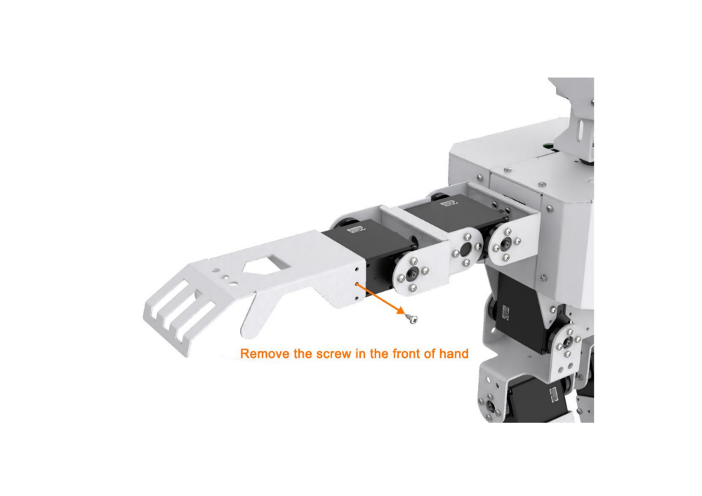

### step 2

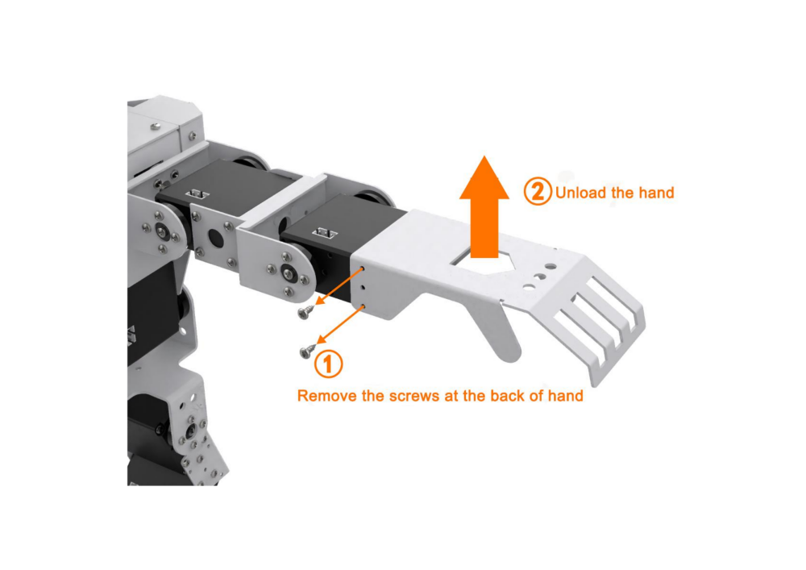

### step 3

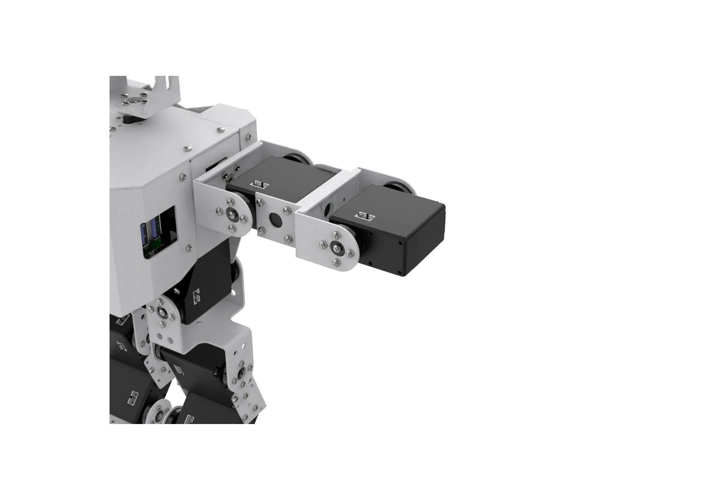

### step 4

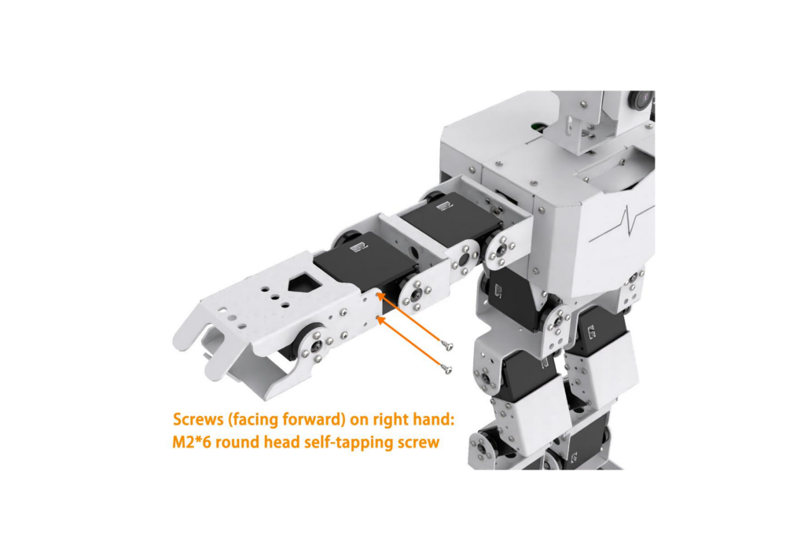

### step 5

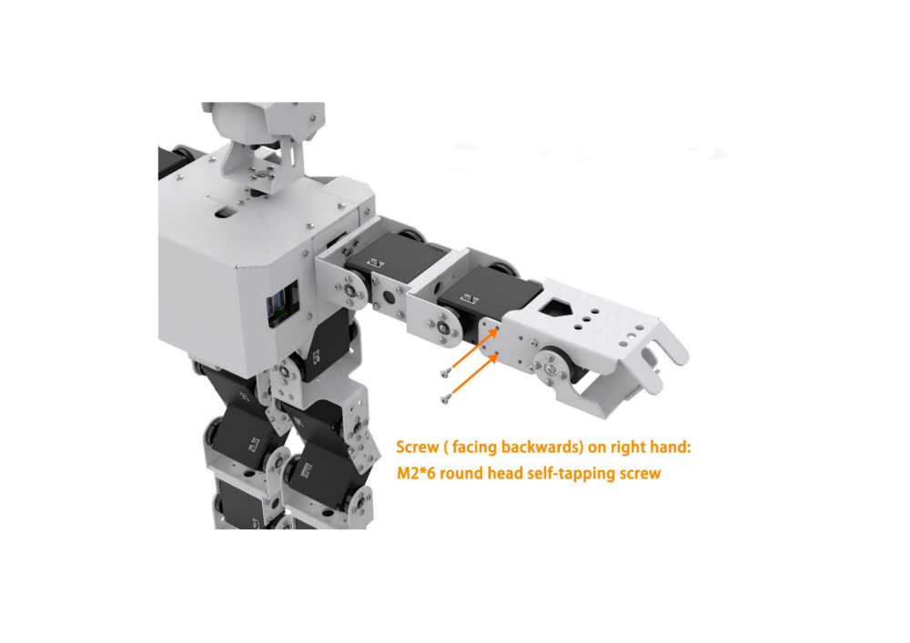

### step 6


### step 7

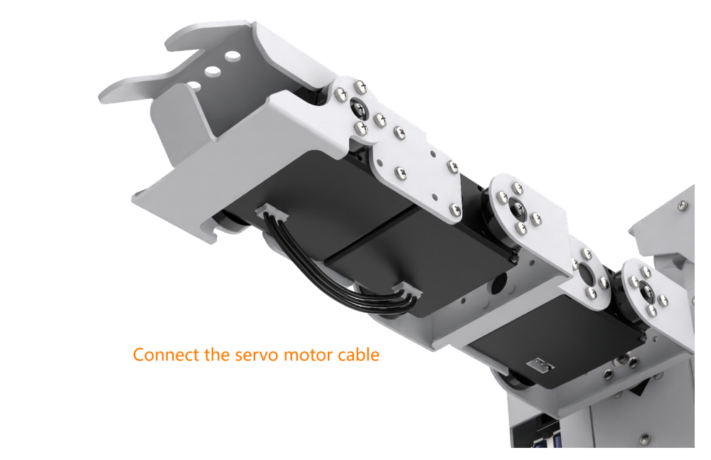

### step 8

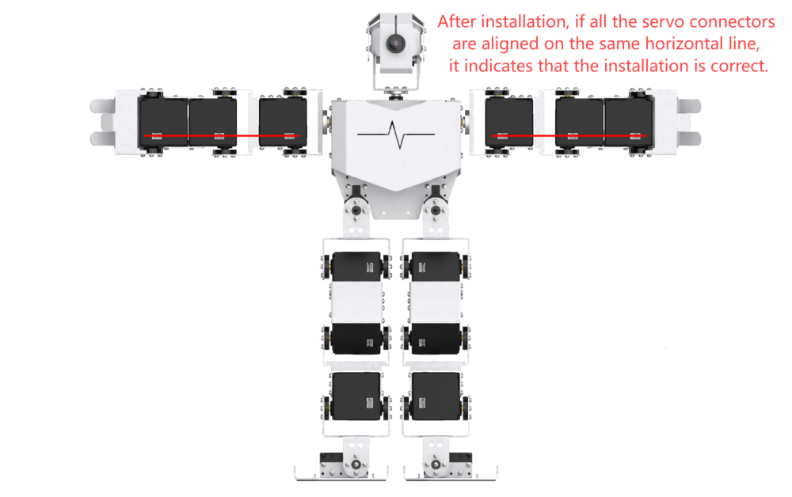

## 2. 色块分拣

:::{Note}
开合手掌在出厂前已经设置好了对应的ID和限位，用户无需自行设置。若因其它操作导致其ID和限位发生变化，可参考"[6 拓展资料\4.舵机调试方法（选看，适用于更换维修）](https://docs.hiwonder.com/projects/TonyPi_Pro/en/latest/docs/6.remote.html)"内容，进行相应的设置。
:::

### 2.1 准备工作

1)  将机器人组装为开合手掌形态下进行，手掌的具体安装方法可参照上文"**[1. 开合手掌的安装](#anchor_1)**"内容。

2)  将色块放置在15cm高度的台面上，高度误差切勿超过1cm，否则影响玩法效果，用户可直接使用机器人包装盒来体验此玩法。

### 2.2 玩法简要说明

本节课整体实现的流程如下所示：

首先，需要对颜色进行识别，这里使用Lab颜色空间来进行处理。先将RGB颜色空间转换为Lab颜色空间，后通过二值化处理，再经过膨胀腐蚀等操作，即可获得包含目标颜色的轮廓。

然后，使用遍历函数筛选出红、绿、蓝三种颜色中最大的轮廓，并用圆圈框起，便可实现物体颜色的识别。

最后，根据识别的颜色进行判断，控制机器人在识别到对应的颜色物体后，进行抓取放置或者摇头动作。

### 2.3 玩法开启及关闭

:::{Note}
指令输入需严格区分大小写及空格。
:::

1)  将机器人开机，然后通过VNC远程连接树莓派桌面。

2)  点击桌面左上角的图标，打开命令行终端， 输入指令，按下回车，则可定位到存放了玩法程序的目录。

```commandline
cd /home/pi/TonyPi/Extend/vision_grab_course/
```

3. 输入指令，然后按下回车键将玩法启动。

```commandline
python3 color_classify.py
```

4. 如需关闭此玩法，只需要在LX终端界面中按下"**Ctrl+C**"。如果关闭失败，可多次按下。

### 2.4 功能实现

玩法开启后，机器人先下蹲。在识别到红色方块后，机器人用右手将色块夹起，放置到右侧；当识别到蓝色方块后，机器人将色块夹起，放置到左边；当识别到绿色方块时，机器人将摇头。

### 2.5 功能延伸

<p id="anchor_2_5_1"></p>

- #### 2.5.1 更换默认识别颜色

色块分类程序默认内置三种颜色：红色、绿色以及蓝色，其中识别到红色和蓝色会进行抓取，识别到绿色会摇头。

**这里以机器人识别到红色会摇头，识别到绿色和蓝色执行抓取为例进行修改。具体修改步骤如下所示：**

1)  输入指令，按下回车，则可定位到存放了玩法程序的目录。

```commandline
cd /home/pi/TonyPi/Extend/vision_grab_course/
```

2. 通过vi编辑器进入该玩法内，输入指令，按下回车。

```commandline
vim color_classify.py
```

3)  找到如下图框出的代码。

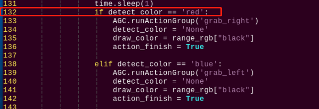

4. 接着按下"**i**"，进入编辑模式，然后将（**if detect_color == ‘red’:**）内的"**red**"直接修改为"**green**"。


5. 找到第144行，然后将（**elif detect_color == ‘green’:**）内的"**green**"直接修改为"**red**"。

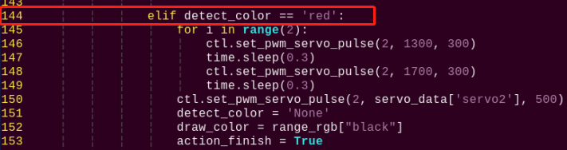

6. 最后按下"**Esc**"退出编辑模式，输入指令即可保存退出。（先输入英文:，再输入wq）

```commandline
:wq
```

7. 再次启动玩法后，机器人识别到红色色块会摇头，识别到蓝色或者绿色色块会夹取分拣。

- #### 2.5.2 增加新的识别颜色

除了内置三种可识别的颜色，用户还可以设置其它可识别颜色。**这里以橙色作为新增的识别颜色为例**，**具体的修改步骤如下：**

1.  打开VNC，输入指令，打开Lab颜色设置文件。

```commandline
vim /home/pi/TonyPi/lab_config.yaml
```

**可使用截图或文件备份的方式记录初始数值。**

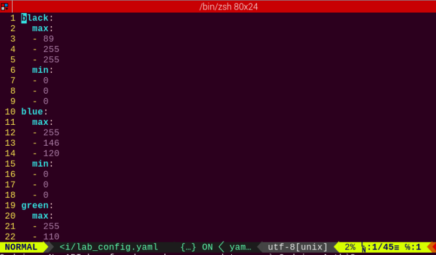

2.  单击系统桌面调试工具图标，然后在弹出的提示框内点击"**执行**"。


3. 点击左下角"**Connect**"按钮，当摄像头回传画面出现在界面上时表示连接成功，然后在右侧方框内选择的"**red**"。

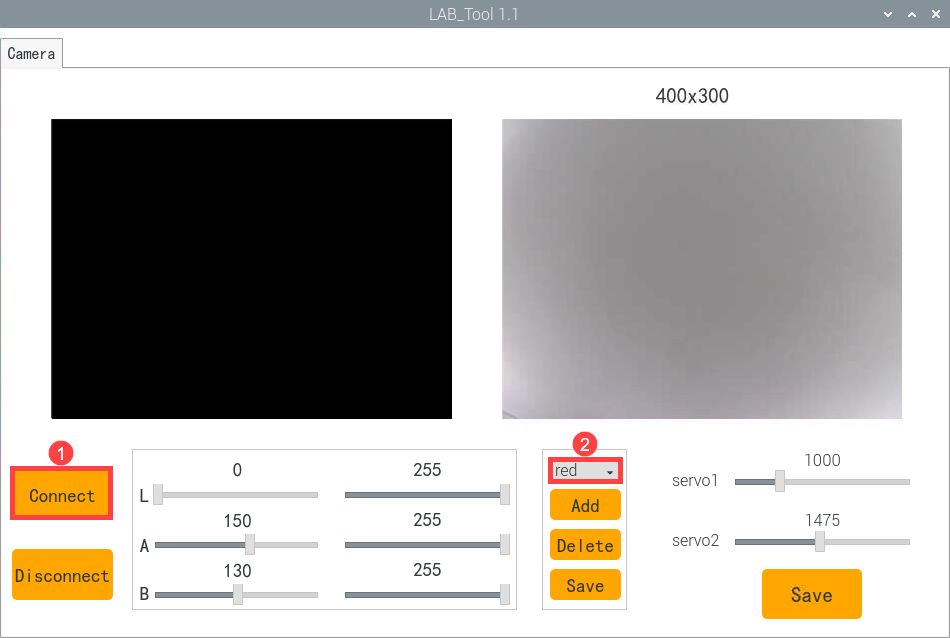

4. 将橙色物体放到摄像头视野内，调整L、A、B对应滑杆，直到左侧画面里橙色部分变为白色，其它颜色都变为黑色，接着点击"**red**"下方的"**Save**"按钮，写入修改的数据。

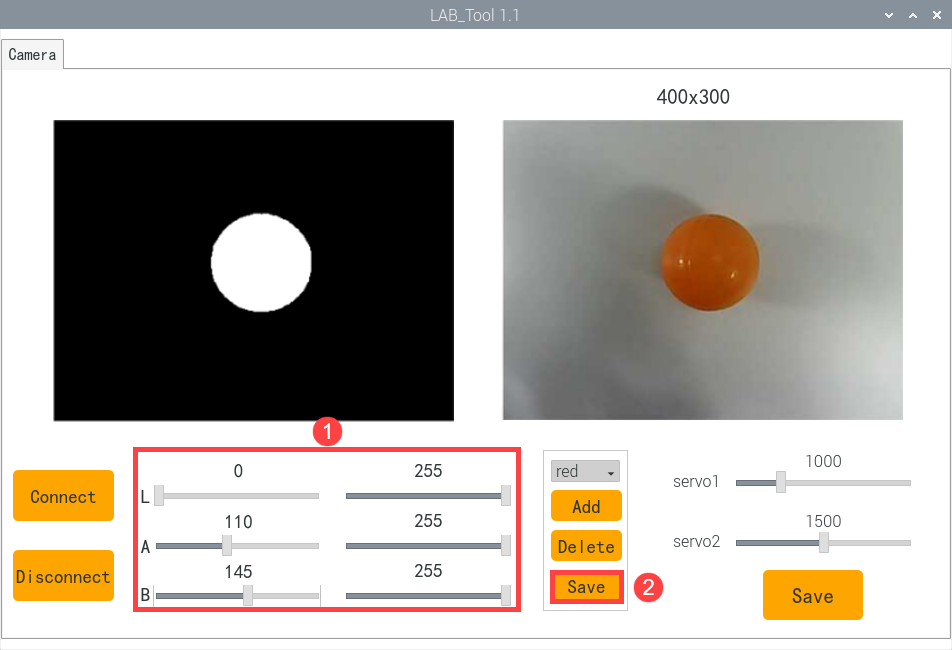

5. 修改完成后，再次使用命令，查看颜色设置参数的值是否成功被修改。

```commandline
vim /home/pi/TonyPi/lab_config.yaml
```


**为了避免对玩法造成影响，在后面修改完毕后，建议通过LAB_Tool工具将数值修改回初始值。**

6.  观察上图红框位置，发现修改的值已经被写入配置程序，按下"**Esc**"，输入指令，然后按下回车键，退出并保存。

```commandline
:wq
```

7. 按照[更换默认识别颜色](#anchor_2_5_1)的内容将默认识别到后让TonyPi摇头的颜色设置为红色。

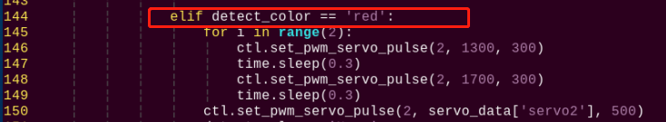

8. 再次启动该玩法，将橙色物品放置到摄像头前，可看到机器人将执行"摇头"动作。

9. 如果需要添加其他颜色作为可识别颜色，可参考以上步骤进行操作。

### 2.6 程序简要分析

该程序的源代码位于：**/home/pi/TonyPi/Functions/ColorDetect.py**

<p id="anchor_2_6_1"></p>

- #### 2.6.1 导入参数模块

| **导入模块** | **作用** |
|:--:|:--:|
| import sys | 导入了Python的sys模块，用于访问系统相关的功能和变量 |
| import os | 导入Python的os模块，提供了与操作系统交互的函数和方法 |
| import cv2 | 导入了OpenCV库，用于图像处理和计算机视觉相关的功能 |
| import time | 导入了Python的time模块，用于时间相关的功能，例如延时操作 |
| import math | math模块提供了对数学运算的底层访问，包含了许多常用的数学函数和常量 |
| import threading | 提供多线程运行的环境 |
| import np | 导入NumPy库，是Python的一个开源数值计算扩展库，用于处理数组和矩阵运算 |
| import sensor.camera as camera | 导入相机库 |
| from common import misc | 导入了Misc模块，用于处理识别得到的矩形数据 |
| import common.ros_robot_controller_sdk as rrc | 导入机器人底层控制库，用于控制舵机、电机、RGB灯等硬件 |
| import common.yaml_handle | 包含一些与处理YAML格式文件相关的功能或工具 |
| from common.controller import Controller | 导入了运动控制库 |

- #### 2.6.2 功能逻辑

根据实现效果，梳理该玩法的实现逻辑如下图所示：

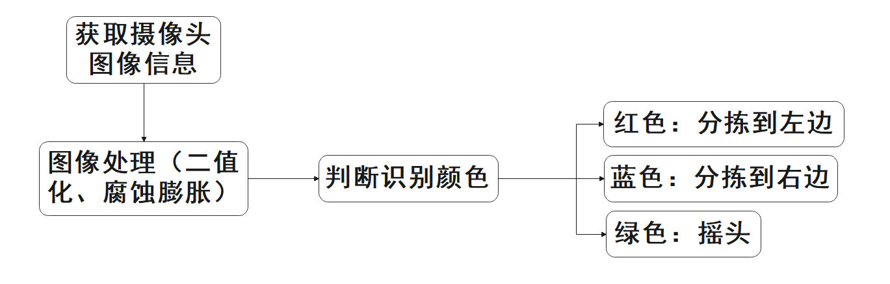

通过摄像头获取图像信息，再进行图像处理，即对图像进行二值化处理。同时为了降低干扰，令图像更平滑，对图像进行腐蚀和膨胀处理。

接着获取目标最大面积轮廓和最小外接圆，判断色块颜色，并且做出相应的反馈。

- #### 2.6.3 程序逻辑及对应的代码分析

从程序文件梳理得到程序逻辑流程图如下图所示。

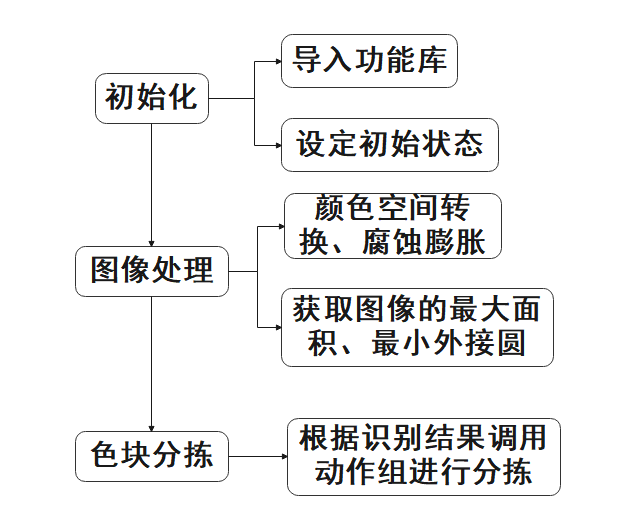

从上图得到，程序的逻辑流程主要为图像处理与色块分拣，以下的文档内容将依照上述程序逻辑流程图进行编写。

1. **初始化**

- **导入功能库**

在初始化的这一步，首先就需要将功能库导入进来，方便后续程序的调用，关于导入进来的内容。可以前往[导入参数模块](#anchor_2_6_1)进行查看。

```py
#!/usr/bin/python3
# coding=utf8
import sys
import os
import cv2
import math
import time
import threading
import numpy as np
import hiwonder.Camera as Camera
import hiwonder.Misc as Misc
import hiwonder.ros_robot_controller_sdk as rrc
from hiwonder.Controller import Controller
import hiwonder.ActionGroupControl as AGC
import hiwonder.yaml_handle as yaml_handle
```

- **设定初始状态**

设置初始状态，这里就包括了舵机的初始位置、颜色的阈值等。

```py
# 初始化机器人舵机初始位置
def initMove():
    ctl.set_pwm_servo_pulse(1, 1500, 500)
    ctl.set_pwm_servo_pulse(2, servo_data['servo2'], 500)
```

2. **图像处理**

- **图像预处理**

对图像进行尺寸调整与高斯模糊处理

```py
frame_resize = cv2.resize(img_copy, size, interpolation=cv2.INTER_NEAREST)
frame_gb = cv2.GaussianBlur(frame_resize, (3, 3), 3)
```

cv2.resize(img_copy, size, interpolation=cv2.INTER_NEAREST) 是对图像进行尺寸调整的操作。

第一个参数"**img_copy**"是要调整尺寸的图像；

第二个参数"**size**"是目标尺寸；

第三个参数"**interpolation**"是插值方法，用于确定调整尺寸时使用的像素插值算法。

cv2.GaussianBlur(frame_resize, (3, 3), 3) 是对图像应用高斯模糊

第一个参数"**frame_resize**"是要进行模糊处理的图像；

第二个参数"**(3, 3)**"高斯核的大小，表示核的宽度和高度都为 3；

第三个参数"**3**"是高斯核的标准差，用于控制模糊程度。较大的值会产生更强的模糊效果。

- **颜色空间转换**

将BGR图像转换为LAB图像

```py
frame_lab = cv2.cvtColor(frame_gb, cv2.COLOR_BGR2LAB)  # 将图像转换到LAB空间
```

- **二值化处理**

采用cv2库中的inRange()函数对图像进行二值化处理。

```py
if i != 'black' and i != 'white':
    frame_mask = cv2.inRange(frame_lab,
                             (lab_data[i]['min'][0],
                              lab_data[i]['min'][1],
                              lab_data[i]['min'][2]),
                             (lab_data[i]['max'][0],
                              lab_data[i]['max'][1],
                              lab_data[i]['max'][2]))  #对原图像和掩模进行位运算
```

第一个参数"**frame_lab**"是输入图像；

第二个参数"**lab_data\[i\]\['min'\]\[0\]**"是阈值下限；

第三个参数"**lab_data\[i\]\['max'\]\[0\]**"是阈值上限；

- **腐蚀与膨胀**

```py
eroded = cv2.erode(frame_mask, cv2.getStructuringElement(cv2.MORPH_RECT, (3, 3)))  #腐蚀
dilated = cv2.dilate(eroded, cv2.getStructuringElement(cv2.MORPH_RECT, (3, 3))) #膨胀
```

eroded = cv2.erode(frame_mask, cv2.getStructuringElement(cv2.MORPH_RECT, (3, 3))) 是对二值化图像进行腐蚀的操作。

第一个参数"**frame_mask**"是要进行形态学运算的二值图像；

第二个参数"**cv2.getStructuringElement(cv2.MORPH_RECT, (3, 3))**"是腐蚀操作的结构元素。这里使用了大小为 (3, 3) 的矩形结构元素。

膨胀函数同理。

- **获取最大面积轮廓**

完成上述的图像处理后，需要获取识别目标的轮廓，此处涉及cv2库中的findContours()函数。

```py
contours = cv2.findContours(dilated, cv2.RETR_EXTERNAL, cv2.CHAIN_APPROX_NONE)[-2]  #找出轮廓
```

以代码"**contours = cv2.findContours(dilated, cv2.RETR_EXTERNAL, cv2.CHAIN_APPROX_NONE)\[-2\]**"为例：

第一个参数"**dilated**"是输入图像；

第二个参数"**cv2.RETR_EXTERNAL**"是轮廓的检索模式；

第三个参数"**cv2.CHAIN_APPROX_NONE)\[-2\]**"是轮廓的近似方法。

在获得的轮廓中寻找面积最大的轮廓，而为了避免干扰，需要设定一个最小值，仅当面积大于该值时，目标轮廓才有效。

```py
areaMaxContour, area_max = getAreaMaxContour(contours)  #找出最大轮廓
if areaMaxContour is not None:
    if area_max > max_area:#找最大面积
        max_area = area_max
        color_area_max = i
        areaMaxContour_max = areaMaxContour
```

- **判断颜色最大的色块**

对最大面积轮廓的颜色进行判断，并将判断结果添加到color_list中。

```py
if color_area_max == 'red':  #红色最大
    color = 1
elif color_area_max == 'green':  #绿色最大
    color = 2
elif color_area_max == 'blue':  #蓝色最大
    color = 3
else:
    color = 0
    color_list.append(color)
```

- **多次判断**

多次判断取平均值，确定识别到的颜色

```py
if len(color_list) == 3:  #多次判断
    # 取平均值
    color = int(round(np.mean(np.array(color_list))))
    color_list = []
    if color == 1:
        detect_color = 'red'
        draw_color = range_rgb["red"]
    elif color == 2:
        detect_color = 'green'
        draw_color = range_rgb["green"]
    elif color == 3:
        detect_color = 'blue'
        draw_color = range_rgb["blue"]
    else:
        detect_color = 'None'
        draw_color = range_rgb["black"]               
    else:
        detect_color = 'None'
        draw_color = range_rgb["black"]
```

- **打印识别结果**

采用cv2库中的cv2.putText()函数来将文本绘制在图像上。

```py
cv2.putText(img, "Color: " + detect_color, (10, img.shape[0] - 10), cv2.FONT_HERSHEY_SIMPLEX, 0.65, draw_color, 2)
```

以代码"**cv2.putText(img, "Color: " + detect_color, (10, img.shape\[0\] - 10), cv2.FONT_HERSHEY_SIMPLEX, 0.65, draw_color, 2)**"为例：

第一个参数"**img**"是绘制的图像；

第二个参数"**"Color: " + detect_color**"在图像上绘制的信息；

第三个参数"**(10, img.shape\[0\] - 10)**"是文本的起始坐标，即文本左下角的位置。这里文本距离图像左边缘和底部边缘分别为 10 个像素；

第四个参数"**cv2.FONT_HERSHEY_SIMPLEX**"是字体类型；

第五个参数"**0.65**"是文本的大小缩放因子；

第六个参数"**draw_color**"是文本的颜色；

第七个参数"2"是文本的线条粗细。

2. **色块分拣**

1)  如果获取到色识别结果不为空，则控制蜂鸣器滴一声，识别为红色或者蓝色后，控制机器人执行对应的动作组：

```py
if __isRunning:
    if detect_color != 'None':
        action_finish = False

        if detect_color == 'red':
            ctl.set_pwm_servo_pulse(1, 1800, 200)
            time.sleep(0.2)
            ctl.set_pwm_servo_pulse(1, 1200, 200)
            time.sleep(0.2)
            ctl.set_pwm_servo_pulse(1, 1800, 200)
            time.sleep(0.2)
            ctl.set_pwm_servo_pulse(1, 1200, 200)
            time.sleep(0.2)
            ctl.set_pwm_servo_pulse(1, 1500, 100)
            time.sleep(0.1)

            detect_color = 'None'
            draw_color = range_rgb["black"]                    
            time.sleep(1)

        elif detect_color == 'green' or detect_color == 'blue':
            ctl.set_pwm_servo_pulse(2, 1800, 200)
            time.sleep(0.2)
            ctl.set_pwm_servo_pulse(2, 1200, 200)
            time.sleep(0.2)
            ctl.set_pwm_servo_pulse(2, 1800, 200)
            time.sleep(0.2)
            ctl.set_pwm_servo_pulse(2, 1200, 200)
            time.sleep(0.2)
            ctl.set_pwm_servo_pulse(2, 1500, 100)
            time.sleep(0.1)
            detect_color = 'None'
            draw_color = range_rgb["black"]                    
            time.sleep(1)
```

以"**AGC.runActionGroup('grab_right')**"代码为例：

使用AGC.runActionGroup函数调用动作组，"**grab_right**"为动作组名称。

2)  识别到绿色，控制机器人舵机2移动，让机器人摇头：

```py
elif detect_color == 'green' or detect_color == 'blue':
    ctl.set_pwm_servo_pulse(2, 1800, 200)
    time.sleep(0.2)
    ctl.set_pwm_servo_pulse(2, 1200, 200)
    time.sleep(0.2)
    ctl.set_pwm_servo_pulse(2, 1800, 200)
    time.sleep(0.2)
    ctl.set_pwm_servo_pulse(2, 1200, 200)
    time.sleep(0.2)
    ctl.set_pwm_servo_pulse(2, 1500, 100)
    time.sleep(0.1)
    detect_color = 'None'
    draw_color = range_rgb["black"]                    
    time.sleep(1)
```

以"**ctl.set_pwm_servo_pulse(2, 1300, 300)**"代码为例：

第一个参数"1"表示控制ID为1的舵机；

第二个参数"1800"表示控制ID为1舵机的脉冲宽度，1500控制舵机回到中位；

第三个参数"200"表示舵机的运动时间为100ms。

## 3. 标签追踪投放

:::{Note}
开合手掌在出厂前已经设置好了对应的ID和限位，用户无需自行设置。若因其它操作导致其ID和限位发生变化，可参考"[拓展资料\4.舵机调试方法（选看，适用于更换维修）]()"内容，进行相应的设置。
:::

### 3.1 准备工作

将机器人组装为开合手掌形态下进行，手掌的具体安装方法可参照"**[1. 开合手掌的安装](#anchor_1)**"内容。

### 3.2 玩法简要说明

本节课整体实现的流程如下所示：

首先，需要对颜色进行识别，这里使用Lab颜色空间来进行处理。先将RGB颜色空间转换为Lab，后通过二值化、膨胀腐蚀等操作，即可获得只包含目标颜色的轮廓，同时将该颜色轮廓用矩形框起，便可实现物体颜色的识别。

接着，调用设置好的动作组，让机器人将物体夹起。

然后，控制机器人的头部舵机转动，寻找视野范围内的标签卡片。先通过定位、图像分割、轮廓查找对画面进行处理。在轮廓定位后进行四边形的检测，通过对四个角点的获取，将直线拟合形成一个闭环，完成对标签的识别及位置获取。

最后，控制机器人向标签卡片的位置运动，当移动到标签附近时，再控制机器人将物体放下。

### 3.3 玩法开启及关闭

:::{Note}
指令输入需严格区分大小写及空格。
:::

1)  将机器人开机，然后通过VNC远程连接树莓派桌面。

2)  点击桌面左上角的图标，打开命令行终端 ， 输入指令，按下回车，则可定位到存放了玩法程序的目录。

```commandline
cd /home/pi/TonyPi/Extend/vision_grab_course/
```

3. 输入指令，然后按下回车键将玩法启动。

```commandline
python3 apriltag_track.py
```

4. 如需关闭此玩法，只需要在LX终端界面中按下"**Ctrl+C**"。如果关闭失败，可多次按下。

### 3.4 功能实现

玩法开启后，机器人将检测摄像头范围内的物体。当识别到红、绿、蓝任意一种颜色色块后，机器人将色块抓起，然后移动到标签卡片附近，并将色块放下。

### 3.5 程序简要分析

该程序的源代码位于：**/home/pi/TonyPi/Extend/vision_grab_course/apriltag_track.py**

<p id="anchor_3_5_1"></p>

- #### 3.5.1 导入参数模块

| **导入模块** | **作用** |
|:--:|:--:|
| import sys | 导入了Python的sys模块，用于访问系统相关的功能和变量 |
| import os | 导入Python的os模块，提供了与操作系统交互的函数和方法 |
| import cv2 | 导入了OpenCV库，用于图像处理和计算机视觉相关的功能 |
| import time | 导入了Python的time模块，用于时间相关的功能，例如延时操作 |
| import math | math模块提供了对数学运算的底层访问，包含了许多常用的数学函数和常量 |
| import threading | 提供多线程运行的环境 |
| import np | 导入NumPy库，是Python的一个开源数值计算扩展库，用于处理数组和矩阵运算 |
| import sensor.camera as camera | 导入相机库 |
| from common import misc | 导入了Misc模块，用于处理识别得到的矩形数据 |
| import common.ros_robot_controller_sdk as rrc | 导入机器人底层控制库，用于控制舵机、电机、RGB灯等硬件 |
| import common.yaml_handle | 包含一些与处理YAML格式文件相关的功能或工具 |
| from common.controller import Controller | 导入了运动控制库 |

- #### 3.5.2 功能逻辑

根据实现效果，梳理该玩法的实现逻辑如下图所示：

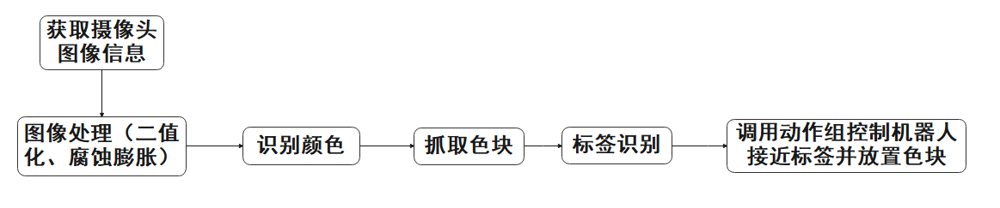

通过摄像头获取图像信息，再进行图像处理，即对图像进行二值化处理。同时为了降低干扰，令图像更平滑，对图像进行腐蚀和膨胀处理。

接着进行颜色识别进行色块抓取，然后根据标签识别结果控制机器人接近并放置色块。

- #### 3.5.3 程序逻辑及对应的代码分析

从程序文件梳理得到程序逻辑流程图如下图所示。

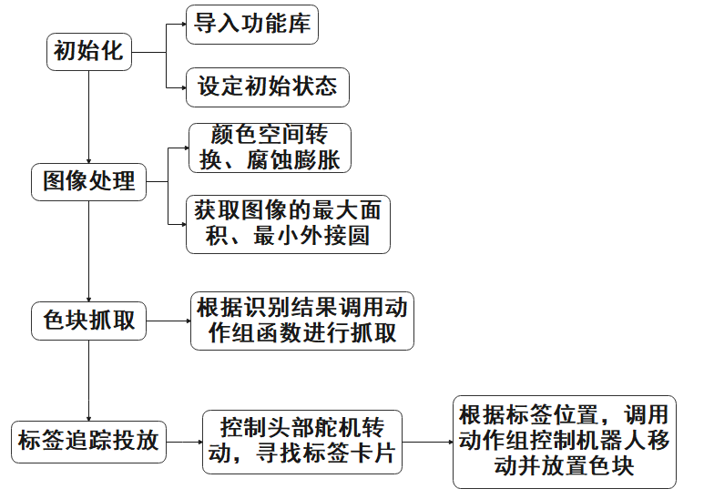

从上图得到，程序的逻辑流程主要为图像处理与颜色追踪，以下的文档内容将依照上述程序逻辑流程图进行编写。

1. **初始化**

- **导入功能库**

在初始化的这一步，首先就需要将功能库导入进来，方便后续程序的调用，关于导入进来的内容。可以前往[导入参数模块](#anchor_3_5_1)进行查看。

```py
#!/usr/bin/python3
# coding=utf8
# 4.拓展课程学习\10.拓展课程之视觉抓取课程\第4课 Apriltag追踪投放
import sys
import cv2
import math
import time
import threading
import numpy as np
import hiwonder.ros_robot_controller_sdk as rrc
from hiwonder.Controller import Controller
import hiwonder.Misc as Misc
import hiwonder.apriltag as apriltag
import hiwonder.ActionGroupControl as AGC
import hiwonder.yaml_handle as yaml_handle
```

- **设定初始状态**

设置初始状态，这里就包括了舵机的初始位置、颜色的阈值等。

```py
# 初始位置
def initMove():
    ctl.set_pwm_servo_pulse(1, servo1, 1000)
    ctl.set_pwm_servo_pulse(2, servo2, 1000)
    ctl.set_bus_servo_pulse(17, 500, 1000)
    ctl.set_bus_servo_pulse(18, 500, 1000)
```

设置不同的动作函数，方便后续机器人动作的调用。

```py
def right_splay():
    ctl.set_bus_servo_pulse(17, 760, 1000)
    time.sleep(1)
    
def right_grasp():
    ctl.set_bus_servo_pulse(17, 500, 1000)
    time.sleep(1)
    
def up_hand():
    ctl.set_bus_servo_pulse(16, 650, 1000)
    time.sleep(0.5)
    ctl.set_bus_servo_pulse(15, 260, 1000)
    ctl.set_bus_servo_pulse(14, 180, 1000)
    ctl.set_bus_servo_pulse(17, 500, 1000)
    time.sleep(1)

def down_hand():
    ctl.set_bus_servo_pulse(15, 200, 1000)
    ctl.set_bus_servo_pulse(14, 460, 1000)
    ctl.set_bus_servo_pulse(17, 500, 1000)
    time.sleep(0.6)
    ctl.set_bus_servo_pulse(16, 275, 1000)
    time.sleep(1)
    
def runBuzzer(sleep):
    Board.setBuzzer(1) # 打开
    time.sleep(sleep) # 延时
    Board.setBuzzer(0) #关闭
```

2. **标签识别**

- **创建AprilTag检测器**

使用apriltag库自带的默认标记图案进行视觉标记的检测。可以使用它来检测图像中的AprilTag标记，并获取有关这些标记的信息（如位置坐标、ID）

```py
# 检测apriltag
detector = apriltag.Detector(searchpath=apriltag._get_demo_searchpath())
```

- **颜色空间转换**

将BGR图像转换为GRAY图像

```py
gray = cv2.cvtColor(img, cv2.COLOR_BGR2GRAY)
```

- **检测标签**

使用创建的detector对象（即AprilTag检测器）来检测灰度图像gray中的AprilTag标记。

```py
detections = detector.detect(gray, return_image=False)
```

- **获取标签信息**

获取标签ID角点信息，使用cv2.drawContours函数在图像中将标签圈出来；获取标I签D、标签类、获取标签中心点和旋转角。

```py
tag_family = str(detection.tag_family, encoding='utf-8')  # 获取tag_family
tag_id = int(detection.tag_id)  # 获取tag_id

objective_x, objective_y = int(detection.center[0]), int(detection.center[1])  # 中心点
object_angle = int(math.degrees(math.atan2(corners[0][1] - corners[1][1], corners[0][0] - corners[1][0])))  # 计算旋转角
return [tag_family, tag_id, objective_x, objective_y]
return None, None, None, None
```

2. **图像处理**

- **图像预处理**

对图像进行尺寸调整与高斯模糊处理

```py
frame_resize = cv2.resize(img, size, interpolation=cv2.INTER_NEAREST)
frame_gb = cv2.GaussianBlur(frame_resize, (3, 3), 3) 
```

cv2.resize(img_copy, size, interpolation=cv2.INTER_NEAREST) 是对图像进行尺寸调整的操作。

第一个参数"**img_copy**"是要调整尺寸的图像；

第二个参数"**size**"是目标尺寸；

第三个参数"**interpolation**"是插值方法，用于确定调整尺寸时使用的像素插值算法。

cv2.GaussianBlur(frame_resize, (3, 3), 3) 是对图像应用高斯模糊

第一个参数"**frame_resize**"是要进行模糊处理的图像；

第二个参数"**(3, 3)**"高斯核的大小，表示核的宽度和高度都为 3；

第三个参数"**3**"是高斯核的标准差，用于控制模糊程度。较大的值会产生更强的模糊效果。

- **颜色空间转换**

将BGR图像转换为LAB图像

```py
frame_lab = cv2.cvtColor(frame_gb, cv2.COLOR_BGR2LAB)  # 将图像转换到LAB空间
```

- **二值化处理**

采用cv2库中的inRange()函数对图像进行二值化处理。

```py
if i in color_list:
    frame_mask = cv2.inRange(frame_lab,
                             (lab_data[i]['min'][0],
                              lab_data[i]['min'][1],
                              lab_data[i]['min'][2]),
                             (lab_data[i]['max'][0],
                              lab_data[i]['max'][1],
                              lab_data[i]['max'][2]))  #对原图像和掩模进行位运算 
```

第一个参数"**frame_lab**"是输入图像；

第二个参数"**lab_data\[i\]\['min'\]\[0\]**"是阈值下限；

第三个参数"**lab_data\[i\]\['max'\]\[0\]**"是阈值上限；

- **腐蚀与膨胀**

```py
eroded = cv2.erode(frame_mask, cv2.getStructuringElement(cv2.MORPH_RECT, (3, 3)))  #腐蚀
dilated = cv2.dilate(eroded, cv2.getStructuringElement(cv2.MORPH_RECT, (3, 3))) #膨胀
```

eroded = cv2.erode(frame_mask, cv2.getStructuringElement(cv2.MORPH_RECT, (3, 3))) 是对二值化图像进行腐蚀的操作。

第一个参数"**frame_mask**"是要进行形态学运算的二值图像；

第二个参数"**cv2.getStructuringElement(cv2.MORPH_RECT, (3, 3))**"是腐蚀操作的结构元素。这里使用了大小为 (3, 3) 的矩形结构元素。

膨胀函数同理。

- **获取最大面积轮廓**

完成上述的图像处理后，需要获取识别目标的轮廓，此处涉及cv2库中的findContours()函数。

```py
contours = cv2.findContours(dilated, cv2.RETR_EXTERNAL, cv2.CHAIN_APPROX_NONE)[-2]  # 找出轮廓
```

以代码"**contours = cv2.findContours(dilated, cv2.RETR_EXTERNAL, cv2.CHAIN_APPROX_NONE)\[-2\]**"为例：

第一个参数"**dilated**"是输入图像；

第二个参数"**cv2.RETR_EXTERNAL**"是轮廓的检索模式；

第三个参数"**cv2.CHAIN_APPROX_NONE)\[-2\]**"是轮廓的近似方法。

在获得的轮廓中寻找面积最大的轮廓，而为了避免干扰，需要设定一个最小值，仅当面积大于该值时，目标轮廓才有效。

```py
areaMaxContour, area_max = getAreaMaxContour(contours)  # 找出最大轮廓

if area_max > 500:  # 有找到最大面积
    rect = cv2.minAreaRect(areaMaxContour)#最小外接矩形
    angle_ = rect[2]
```

- **获取并返回识别结果、中心坐标与角度**

获取最大面积轮廓的最小矩形四个顶点，用cv2.drawContours函数将矩形边框在回

传图像上绘制出来。获取矩形的对角点，计算出中心点的坐标。

```py
box = np.int0(cv2.boxPoints(rect))#最小外接矩形的四个顶点
for j in range(4):
    box[j, 0] = int(Misc.map(box[j, 0], 0, size[0], 0, img_w))
    box[j, 1] = int(Misc.map(box[j, 1], 0, size[1], 0, img_h))

    cv2.drawContours(img, [box], -1, range_rgb[i], 2)#画出四个点组成的矩形

    #获取矩形的对角点
    ptime_start_x, ptime_start_y = box[0, 0], box[0, 1]
    pt3_x, pt3_y = box[2, 0], box[2, 1]            
    center_x_, center_y_ = int((ptime_start_x + pt3_x) / 2), int((ptime_start_y + pt3_y) / 2)#中心点       
    cv2.circle(img, (center_x_, center_y_), 5, (0, 255, 255), -1)#画出中心点

    distance = pow(center_x_ - img_w/2, 2) + pow(center_y_ - img_h, 2)
    if distance < center_max_distance:  # 寻找距离最近的物体来搬运
        center_max_distance = distance
        color = i
        center_x, center_y, angle = center_x_, center_y_, angle_
```

3. **标签追踪投放**

根据颜色识别结果调用蜂鸣器和动作组函数抓取色块。

```py
if color is not None:
    if color_y >= 300:
        board.set_buzzer(1900, 0.1, 0.9, 1)
        up_hand()
        right_splay()
        time.sleep(2)
        board.set_buzzer(1900, 0.1, 0.9, 1)
        time.sleep(0.1)
        board.set_buzzer(1900, 0.1, 0.9, 1)
        right_grasp()
        down_hand()
        action_finish = True
    else:
        time.sleep(0.01)
    else:
        time.sleep(0.01)
```

控制机器人的头部舵机转动，寻找视野范围内的标签卡片。

```py
if servo1 >= 1250:
    servo1_st = False
elif servo1 <= servo_data['servo1']:
    servo1_st = True   
    if servo1_st:
        servo1 += 5
    else:
        servo1 -= 5

        if servo2 >= 1700:
            servo2_st = False
        elif servo2 <= 1300:
            servo2_st = True

            if servo2_st:
                servo2 += 5
            else:
                servo2 -= 5
                ctl.set_pwm_servo_pulse(1, servo1, 30)
                ctl.set_pwm_servo_pulse(2, servo2, 30)
                time.sleep(0.05)
```

以"**ctl.set_pwm_servo_pulse(2, 1300, 300)**"代码为例：

第一个参数"1"表示控制ID为1的舵机；

第二个参数"1800"表示控制ID为1舵机的脉冲宽度，1500控制舵机回到中位；

第三个参数"200"表示舵机的运动时间为100ms。

根据标签的中心点坐标与CentreX的差值，调用动作组控制机器人移动接近标签。

```py
if tag_id is not None:
    if objective_x - CentreX >= 50 and objective_y < 240:
        AGC.runAction('turn_right')

    elif objective_x - CentreX <= -50 and objective_y < 240:
        AGC.runAction('turn_left')

    elif objective_y <= 280:
        AGC.runAction('go_forward')

    elif objective_x - CentreX >= 30:
        AGC.runAction('right_move_20')

    elif objective_x - CentreX <= -30:
        AGC.runAction('left_move_20')

    elif 30 > objective_x - CentreX >= 10:
        AGC.runAction('right_move')

    elif -30 < objective_x - CentreX <= -10:
        AGC.runAction('left_move')

    elif 280 < objective_y < 320:
        AGC.runAction('go_forward_one_step')

    elif objective_y >= 320:
        board.set_buzzer(1900, 0.1, 0.9, 1)
        AGC.runAction('put_down_object')
        right_splay()
        time.sleep(0.5)
        right_grasp()
        AGC.runAction('put_up_object')
        time.sleep(2)
        action_finish = False
```

以"**AGC.runActionGroup('grab_right')**"代码为例：

使用AGC.runActionGroup函数调用动作组，"**grab_right**"为动作组名称。

## 4. TonyPi Pro语音控制抓取

### 4.1 准备工作

:::{Note}
开合手掌在出厂前已经设置好了对应的ID和限位，用户无需自行设置。若因其它操作导致其ID和限位发生变化，可参考"[6 拓展资料\4.舵机调试方法（选看，适用于更换维修）]()"内容，进行相应的设置。
:::

1)  将机器人组装为开合手掌形态下进行，手掌的具体安装方法可参照"**[1. 开合手掌的安装](#anchor_1)**"内容。

2)  安装语音识别模块，具体的安装方法可参照"**[传感器的安装与接线]()**"视频内容。

3)  将色块放置在15cm高度的台面上，高度误差切勿超过1cm，否则影响玩法效果，用户可直接使用机器人包装盒来体验此玩法。

### 4.2 玩法简要说明

本节整体实现的流程如下所示：

首先，开启语音识别模块的功能（即ASR）对语言指令进行收集、解析，再根据解析得到的结果寻找目标颜色。

接着，需要对颜色进行识别，这里使用Lab颜色空间来进行处理。先通过将RGB颜色空间转换为Lab，然后通过二值化、膨胀腐蚀等操作，获得只包含目标颜色的轮廓，再将该颜色轮廓用矩形框起并获取其中心点位置坐标，从而实现物体颜色的识别。

最后，根据物体的坐标位置，控制机器人移动至附近，再调用动作组将物体夹起，实现语音抓取功能。

### 4.3 玩法开启及关闭

:::{Note}
指令输入需严格区分大小写及空格。
:::

1)  将机器人开机，然后通过VNC远程连接树莓派桌面。

2)  点击桌面左上角的图标，打开命令行终端 ， 输入指令，按下回车，则可定位到存放了玩法程序的目录。

```commandline
cd /home/pi/TonyPi/Extend/vision_grab_course/
```

3. 输入指令，然后按下回车键将玩法启动。

```commandline
python3 asr_color_detect.py
```

4. 如需关闭此玩法，只需要在LX终端界面中按下"**Ctrl+C**"。如果关闭失败，可多次按下。

### 4.4 功能实现

玩法开启后，用户说出对应的口令，机器人将会夹取对应的色块。

控制指令和机器人动作的对应关系如下表所示：

| **序号** |         **指令**         |        **作用**        |
|:--------:|:------------------------:|:----------------------:|
|  **1**   |   **kai shi（开始）**    |   **唤醒词（必说）**   |
|  **2**   | **na hong se（拿红色）** | **机器人夹取红色方块** |
|  **3**   |  **na lv se（拿绿色）**  | **机器人夹取绿色方块** |
|  **4**   | **na lan se（拿蓝色）**  | **机器人夹取蓝色方块** |

:::{Note}
①每次说出夹取指令前，都要先说唤醒词。
②说出唤醒词后，若语音识别模块上的STA指示灯亮起，说明唤醒成功。
:::

### 4.5 功能延伸

- #### 4.5.1 修改唤醒词条

程序设置的默认模式为口令模式。在口令模式下，每次执行语音识别，都需要先说出唤醒的词条（默认唤醒词为"**开始**"），再接着说出其它词条，机器人才会执行检测词条对应的动作。

**本小节将唤醒词修改为"准备"为例，具体修改步骤如下所示：**

1)  按照"3.玩法开启及关闭"步骤（2）、（3），进入玩法程序所在目录，通过输入指令进入程序内。

```commandline
vim asr_color_detect.py
```

2. 键盘输入"**219**"，然后按下"**Shift+G**"直接跳转到唤醒词条所在的代码位置。

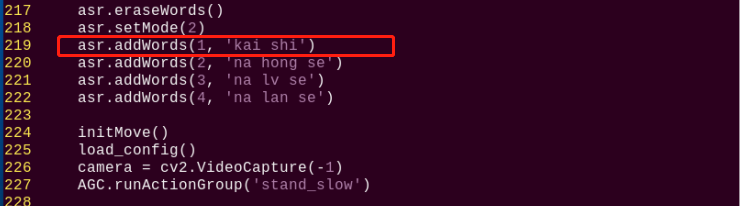

3. 程序中设置编号为1的词条为唤醒词条，修改该词条内容即可修改唤醒词。键盘输入"**i**"进入vi编辑模式，然后将词条内容修改为"**zhun bei**"。

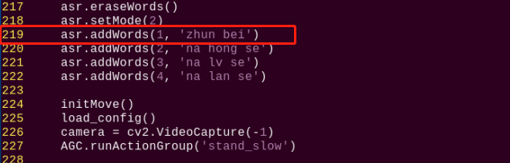

4)  修改完成后，按下"**Esc**"键，输入指令，然后按下回车键，保存并退出即可。

```py
:wq
```

- #### 4.5.2 修改识别模式

语音识别模块支持 3 种语音识别模式，分别是：循环识别模式、口令模式、按键模式。

- 循环模式是让语音识别模块一直循环检测词条；

- 口令模式是每次检测前，都需要说出第一个词条作为启动检测的口令，然后再说出检测的词条；

- 按键模式是只有按下语音识别模块上的按键，才会开始检测词条；

**这里以识别模式修改为循环模式为例，具体修改步骤如下所示：**

1)  参照按照"3.玩法开启及关闭"步骤（2）、（3），进入玩法程序所在目录，输入指令进入程序内。

```commandline
vim asr_color_detect.py
```

2. 程序中默认为口令模式，即asr.setMode()的值为 2，这里将该参数修改为1，修改如下图所示：

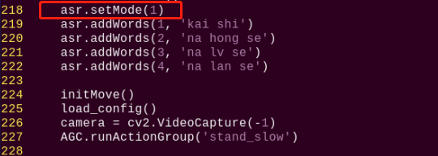

3)  如果要设置为按键模式，需要将 asr.setMode()值修改为 3。

### 4.6 程序简要分析

该程序的源代码位于：**/home/pi/TonyPi/Functions/ColorDetect.py**

<p id="anchor_4_6_1"></p>

- #### 4.6.1 导入参数模块

| **导入模块** | **作用** |
|:--:|:--:|
| import sys | 导入了Python的sys模块，用于访问系统相关的功能和变量 |
| import os | 导入Python的os模块，提供了与操作系统交互的函数和方法 |
| import cv2 | 导入了OpenCV库，用于图像处理和计算机视觉相关的功能 |
| import time | 导入了Python的time模块，用于时间相关的功能，例如延时操作 |
| import math | math模块提供了对数学运算的底层访问，包含了许多常用的数学函数和常量 |
| import threading | 提供多线程运行的环境 |
| import np | 导入NumPy库，是Python的一个开源数值计算扩展库，用于处理数组和矩阵运算 |
| import sensor.camera as camera | 导入相机库 |
| from common import misc | 导入了Misc模块，用于处理识别得到的矩形数据 |
| import common.ros_robot_controller_sdk as rrc | 导入机器人底层控制库，用于控制舵机、电机、RGB灯等硬件 |
| import common.yaml_handle | 包含一些与处理YAML格式文件相关的功能或工具 |
| from common.controller import Controller | 导入了运动控制库 |

- #### 4.6.2 功能逻辑

根据实现效果，梳理该玩法的实现逻辑如下图所示：

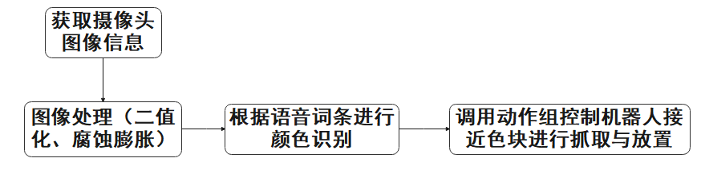

通过摄像头获取图像信息，再进行图像处理，即对图像进行二值化处理。同时为了降低干扰，令图像更平滑，对图像进行腐蚀和膨胀处理。

接着根据语音识别结果，控制机器人接近色块并进行色块的抓取与放置。

- #### 4.6.3 程序逻辑及对应的代码分析

从程序文件梳理得到程序逻辑流程图如下图所示。


从上图得到，程序的逻辑流程主要为图像处理与语音控制抓取，以下的文档内容将依照上述程序逻辑流程图进行编写。

1. **初始化**

- **导入功能库**

在初始化的这一步，首先就需要将功能库导入进来，方便后续程序的调用，关于导入进来的内容。可以前往[导入参数模块](#anchor_4_6_1)进行查看。

```py
#!/usr/bin/python3
# coding=utf8
import sys
import os
import cv2
import math
import time
import threading
import numpy as np
import hiwonder.Camera as Camera
import hiwonder.Misc as Misc
import hiwonder.ros_robot_controller_sdk as rrc
from hiwonder.Controller import Controller
import hiwonder.ActionGroupControl as AGC
import hiwonder.yaml_handle as yaml_handle
```

- **设定初始状态**

设置初始状态，这里就包括了舵机的初始位置、颜色的阈值、语音词条等。

```py
# 初始化机器人舵机初始位置
def initMove():
    ctl.set_pwm_servo_pulse(1, 1500, 500)
    ctl.set_pwm_servo_pulse(2, servo_data['servo2'], 500)
```

```py
asr.eraseWords()
asr.setMode(2)
asr.addWords(1, 'kai shi')
asr.addWords(2, 'na hong se')
asr.addWords(3, 'na lv se')
asr.addWords(4, 'na lan se')
```

2. **图像处理**

- **图像预处理**

对图像进行尺寸调整与高斯模糊处理

```py
frame_resize = cv2.resize(img_copy, size, interpolation=cv2.INTER_NEAREST)
frame_gb = cv2.GaussianBlur(frame_resize, (3, 3), 3)
```

cv2.resize(img_copy, size, interpolation=cv2.INTER_NEAREST) 是对图像进行尺寸调整的操作。

第一个参数"**img_copy**"是要调整尺寸的图像；

第二个参数"**size**"是目标尺寸；

第三个参数"**interpolation**"是插值方法，用于确定调整尺寸时使用的像素插值算法。

cv2.GaussianBlur(frame_resize, (3, 3), 3) 是对图像应用高斯模糊

第一个参数"**frame_resize**"是要进行模糊处理的图像；

第二个参数"**(3, 3)**"高斯核的大小，表示核的宽度和高度都为 3；

第三个参数"**3**"是高斯核的标准差，用于控制模糊程度。较大的值会产生更强的模糊效果。

- **颜色空间转换**

将BGR图像转换为LAB图像

```py
frame_lab = cv2.cvtColor(frame_gb, cv2.COLOR_BGR2LAB)  # 将图像转换到LAB空间
```

- **二值化处理**

采用cv2库中的inRange()函数对图像进行二值化处理。

```py
if i != 'black' and i != 'white':
    frame_mask = cv2.inRange(frame_lab,
                             (lab_data[i]['min'][0],
                              lab_data[i]['min'][1],
                              lab_data[i]['min'][2]),
                             (lab_data[i]['max'][0],
                              lab_data[i]['max'][1],
                              lab_data[i]['max'][2]))  #对原图像和掩模进行位运算
```

第一个参数"**frame_lab**"是输入图像；

第二个参数"**lab_data\[i\]\['min'\]\[0\]**"是阈值下限；

第三个参数"**lab_data\[i\]\['max'\]\[0\]**"是阈值上限；

- **腐蚀与膨胀**

```py
eroded = cv2.erode(frame_mask, cv2.getStructuringElement(cv2.MORPH_RECT, (3, 3)))  #腐蚀
dilated = cv2.dilate(eroded, cv2.getStructuringElement(cv2.MORPH_RECT, (3, 3))) #膨胀
```

eroded = cv2.erode(frame_mask, cv2.getStructuringElement(cv2.MORPH_RECT, (3, 3))) 是对二值化图像进行腐蚀的操作。

第一个参数"**frame_mask**"是要进行形态学运算的二值图像；

第二个参数"**cv2.getStructuringElement(cv2.MORPH_RECT, (3, 3))**"是腐蚀操作的结构元素。这里使用了大小为 (3, 3) 的矩形结构元素。

膨胀函数同理。

- **获取最大面积轮廓**

完成上述的图像处理后，需要获取识别目标的轮廓，此处涉及cv2库中的findContours()函数。

```py
contours = cv2.findContours(dilated, cv2.RETR_EXTERNAL, cv2.CHAIN_APPROX_NONE)[-2]  #找出轮廓
```

以代码"**contours = cv2.findContours(dilated, cv2.RETR_EXTERNAL, cv2.CHAIN_APPROX_NONE)\[-2\]**"为例：

第一个参数"**dilated**"是输入图像；

第二个参数"**cv2.RETR_EXTERNAL**"是轮廓的检索模式；

第三个参数"**cv2.CHAIN_APPROX_NONE)\[-2\]**"是轮廓的近似方法。

在获得的轮廓中寻找面积最大的轮廓，而为了避免干扰，需要设定一个最小值，仅当面积大于该值时，目标轮廓才有效。

```py
areaMaxContour, area_max = getAreaMaxContour(contours)  #找出最大轮廓
if areaMaxContour is not None:
    if area_max > max_area:#找最大面积
        max_area = area_max
        color_area_max = i
        areaMaxContour_max = areaMaxContour
```

- **获取并返回识别结果、中心坐标与角度**

获取最大面积轮廓的最小矩形四个顶点，用cv2.drawContours函数将矩形边框在回

传图像上绘制出来。获取矩形的对角点，计算出中心点的坐标。

```py
box = np.int0(cv2.boxPoints(rect))#最小外接矩形的四个顶点
for j in range(4):
    box[j, 0] = int(Misc.map(box[j, 0], 0, size[0], 0, img_w))
    box[j, 1] = int(Misc.map(box[j, 1], 0, size[1], 0, img_h))

    cv2.drawContours(img, [box], -1, (0,255,255), 2)#画出四个点组成的矩形

    #获取矩形的对角点
    ptime_start_x, ptime_start_y = box[0, 0], box[0, 1]
    pt3_x, pt3_y = box[2, 0], box[2, 1]            
    center_x_, center_y_ = int((ptime_start_x + pt3_x) / 2), int((ptime_start_y + pt3_y) / 2)#中心点       
    cv2.circle(img, (center_x_, center_y_), 5, (0, 255, 255), -1)#画出中心点

    distance = pow(center_x_ - img_w/2, 2) + pow(center_y_ - img_h, 2)
    if distance < center_max_distance:  # 寻找距离最近的物体来搬运
        center_max_distance = distance
        color = i
        center_x, center_y, angle = center_x_, center_y_, angle_
```

3. **色块抓取**

根据色块中心点X坐标与CentreX的大小来判断色块所在的方向，并赋值给dire。

```py
if dire is None:
    if color_x > centreX:
        dire ='right'
    elif color_x < centreX:
        dire ='left'
```

根据色块中心点X坐标与CentreX的差值，调用动作组控制机器人移动接近色块。

```py
if 15 > color_x - centreX > 8:
    AGc.runAction('right move_10')
elif -15 < color_x - centreX < -8:
    AGc.runAction('left_move_10')
elif color_x - centrex >= 20:
    AGc.runAction('right_move_20')
elif color_x - centreX <= -20:
    AGc.runAction('left_move_20')
```

以"**AGC.runActionGroup('grab_right')**"代码为例：

使用AGC.runActionGroup函数调用动作组，"**grab_right**"为动作组名称。

在靠近色块后根据dire的值调用动作组抓取放置色块。

```py
else:
    board.set_buzzer(1900, 0.1, 0.9, 1)
    if dire = 'left':
        AGC.runAction('grab_squat_left')
        time.sleep(0.5)
        AGC.runAction('grab_squat_up_left')
        time.sleep(0.5)
        AGC.runAction('grab_stand_left')
    elif dire ='right':
        AGC.runAction('grab_squat_right')
        time.sleep(0.5)
        AGc.runAction('grab_squat_up_right')
        time.sleep(0.5)
        AGc.runAction('grab_stand right')
```

以"**AGC.runActionGroup('grab_right')**"代码为例：

使用AGC.runActionGroup函数调用动作组，"**grab_right**"为动作组名称。
