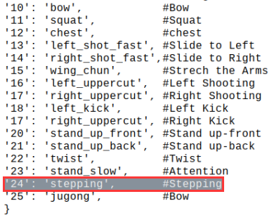
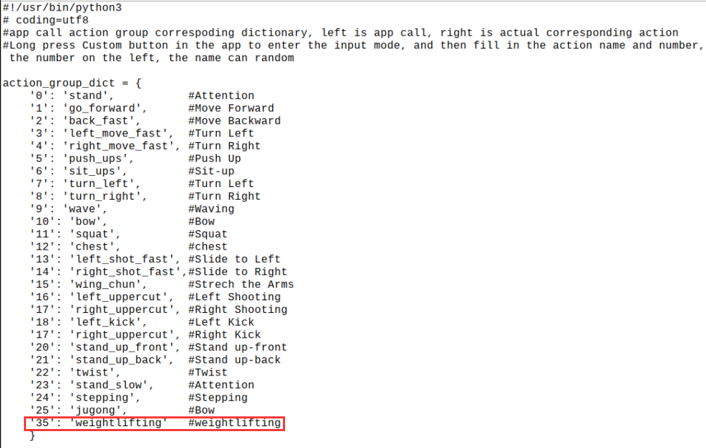

#  4. PC Software and Action Programming

## 4.1 PC Software Introduction

In this section, you will quickly learn the TonyPi PC software.

First connect to VNC remote desktop and double-click "**TonyPi**" to start it. (Click "**Run**" in the pop-up window )


The main interface of the TonyPi PC software in "**Chinese**" mode can be divided into the following areas:


###  4.1.1 Servo operation area:

Drag the corresponding slider to adjust the servo position:

| Icon |                 Function                |
|:--:|:---------------------------------------:|
|  |   ID number.Take NO.1 servo as example  |
|  |   Adjust servo position from 0 to 1000  |
|  | Adjust servo deviation from -125 to 125 |

### 4.1.2 Action data list

Action list display the running time and servo data of the current action.


| Icon |                                                                   Function                                                                   |
|:--:|:--------------------------------------------------------------------------------------------------------------------------------------------:|
|  |                                                               Action group NO                                                                |
|  |                                                          Running time of the action                                                          |
|  | Action data of the corresponding servo. Double click the figure  to revise |

### 4.1.3 Action group setting

|                             Icon                             | Function                                                     |
| :----------------------------------------------------------: | :----------------------------------------------------------- |
|  | Duration time of the running action.  <br/>Note: the "Update Action" button is needed to take effect. In addition, the value range of the time is 20-9999 |
|  | The total running time of all the actions in the group action |
|  | Click to add the new action.                                 |
|  | Delete action is delete the selected action in the list.     |
|  | Update the selected action                                   |
|  | Insert the new action on the action list. Action time(ms)    |
|  | Move up the selected action.                                 |
|  | Move down the selected action.                               |
|  | Click to run all the actions on the edited list once.        |
|  | If "**Loop**" is ticked, TonyPi will repeat the action.          |
|  | Click to open and select the provided action groups.         |
|  | Save the current actions in the action list into the computer. |
|  | Click to integrate provided action group. Choose one action group, click integrate and then choose another one. |
|  | Display the saved action groups.                             |
|  | Delete the current action group file.                        |
|  | (Be careful!)Deleted all the action group files.             |
|  | Run the selected action group once.                          |
|  | Stop running the action group.                               |

### 4.1.4 Servo deviation setting area

|                           **Icon**                           |                         **Function**                         |
| :----------------------------------------------------------: | :----------------------------------------------------------: |
|  |          Click to read the save the servo deviation          |
|  | Click to download the deviation adjustment in the PC software |
|  |   Click to return all the servos the middle position(500)    |

## 4.2 Call Action Group

### 4.2.1 Goal

This section focuses on how to call the built-in action group via TonyPi PC software.

### 4.2.2 Call Action Group

(1) Power on the robot. Refer to the relevant tutorial in "**[Remote Desktop Installation and Connection](https://docs.hiwonder.com/projects/TonyPi_Pro/en/latest/docs/6.remote.html)**" to connect it to system desktop via the VNC.


(2) Click . Select "**Execute**" to open the PC software.


(3) Click "**Open action file**" to open the action group file located in the same directory as this lesson.


(4) The action data list will display the opened action group.


(5) Click "**Run**".


(6) You can click the dropdown button of the action group, and select the action group to be run. Then, click "**Run action group**".


<p id="anchor_3"></p>

## 4.3 Action Group Programming

### 4.3.1 Program Description 

Program an action group consisting of 8 actions to allow the TonyPi to "**Bow**".

### 4.3.2 Complete Program 

* **Action Programming** 

(1) After the TonyPi robot is started, revise action data of the 16 servos according to figure below. Click the "**Add action**" button to save the first action.


(2) Program to straighten the robot arms and knees. Take the data in below picture for reference. Then click "**Add action**" button to add the action as No.2. Do not forget to add each single action into the list. 


(3) Modify the servo data as shown in the figure below to raise the arm as the No.3 action. 


(4) Adjust the arm for the "**Bow**" post. 


(5) Allow the robot "**Bow**", and according to the servo value shown in the figure below to adjust, make it the No.5 action.


(6) To make the action more natural, the No.6 action is the same as No.5 action. Here we continue to click "**Add action**". 


(7) Then make the robot straighten its body, but keep its arms in a bowing position. According to the servo value shown in the figure below.


(8) Finally, allow the robot recover its initial posture, and modify each servo data to be consistent with the action No.1, then click "**Add action**", As shown in the figure below.


(9) The all parameter of the action groups as shown in table below: The red value is the servo data needed to be adjusted. 

* **Save Action group** 

After programming, please save the action group for future debugging. Click "**Save action file**", choose the path "**/home/pi/TonyPi/ActionGroups**", name it (suck as"**1_bow**") and then click "**Save**" button.


## 4.4 Integrate Action Groups

### 4.4.1 Program Description 

Integrate the provided basic actions to become a new action group. This section takes the integrate No.1 action and No.2 action as an example.

### 4.4.2 Complete Program 

(1) Connect VNC and open TonyPi PC software.


(2) Click "**Integrate file**", choose and double click "**1.d6a**" to open.


(3) Then the action list will display the data of No.1 action group.


(4) Click "**Integrate file**" again, choose "**2.d6a**" and double click to select it.


(5) Click "**Run**" to execute the new integrated actions online. 


(6) Click "**Save action file**" button and enter new action group name (such as "**3**" ) to save the new integrated action group for the future debugging. 


## 4.5 App Custom

Achieving goal：Execute the action group in the folder "[**Action Programming**](#anchor_3)" through mobile APP custom function. Here, we take the example of performing weightlifting actions.

### 4.5.1 Getting Ready

(1) After connecting VNC, open the file manager of the system desktop.


(2) Go to folder "**/home/pi/TonyPi**" path and open ActionGroupDict.py. Take the example of Text Editor:


(3) Then, copy the line containing action number 24. Right-click or press "**Ctrl+C**" to copy the No. 24 action.



(4) Paste the program to a new line and set the number to 35. Name as "**weightlifting**" (refer to the action group file name in /home/pi/TonyPi/ActionGroups)



:::{Note}
Do not use the defined number and No.255. The name of the action group should be consistent with the name in the storage directory (/home/pi/TonyPi/ActionGroups).
:::

(4) Press Ctrl+S to save and exit it.

(5) Enter the command "**sudo reboot**" to restart the Raspberry Pi. (This step must be done)

```bash
sudo reboot
```

### 4.5.2 Operation Steps

(1) Open mobile app and enter "Model Control".


(2) Click "**action**" button, select "**custom**" in the pop-up interface, and long press to enter.

<p class="common_img" style="text-align:center;">

 


</p>

(3) Enter the name and number of the saved action group in the pop-up interface. Click "**ok**" to save it.


The action group name can be filled in arbitrarily, but the action group number must be filled in correctly, otherwise it cannot be realized.

(4) After adding, click the action group name to execute it once.


(5) If you need to modify or delete action group, please long press the action name button to modify the action group name as the default "**Custom**". Set the number as "**255**".

## 4.6 Call Action Group Using Command

### 4.6.1 Goal

In addition to calling TonyPi's action groups via the PC software, you can also run action groups by executing commands in the terminal.

:::{Note}
The action group files must be saved in the directory "**/home/pi/TonyPi/ActionGroups**".
:::

Click  on the system status bar to open the file manager. Access the directory "/home/pi/TonyPi/ActionGroups", and verify if the desired action group file is in the directory.


### 4.6.2 Call Action Group

(1) Click  on the Raspberry Pi desktop to open the command line terminal.

(2) Run the following command to navigate to the directory where the game program is located.

```bash
cd TonyPi/Example/
```

(3) Input the following command, and press "**Enter**" to enable the game.

```bash
python3 ActionGroupControlDemo.py
```

The robot will first execute the "**stand**" action group, followed by two executions of the "**go_forward**" action group. After that, the terminal will automatically close the program.

### 4.6.3 Modify Program

<p id="anchor_6_3_1"></p>

* **Call a Single Action** 

If you want the robot to execute a single action, you can modify the program.

(1) Click  on the Raspberry Pi desktop to open the command line terminal.

(2) Run the following command to navigate to the directory where the game program is located.

```bash
cd TonyPi/Example/
```

(3) Input the following command, and press "**Enter**" to open the program file.

```bash
vim ActionGroupControlDemo.py
```

(4) Press the "**I**" key on the keyboard to enter the editing mode.


Locate the following code:


(5) Add a "**#**" symbol at the beginning of line 28 to comment out this line of code, leaving only the code for executing action group 1. Keeping line 15 will only execute the action group once. If you want to execute the action group multiple times, you can comment out line 15 and keep line 16.


(6) Within the single quotes on line 15, enter the action group to be executed. For example, let's execute the "**back**" action group.

:::{Note}
The action group file must be saved in the directory "/home/pi/TonyPi/ActionGroups". If you want to call a custom action group, please refer to "[**Action Group Programming**](#anchor_3)" for action editing.
:::


(7) After modifying, press the "**Esc**" to exit editing mode. Input the following command and press "**Enter**" to save and exit the program.

```bash
:wq
```

(8) Run the command to enable the game. The robot will execute the "**back**" action group once.

```bash
python3 ActionGroupControlDemo.py
```

* Call Multiple Action Groups 

**The following operations are based on "[Call a Single Action](#anchor_6_3_1)".**

The robot can be controlled to execute multiple action groups sequentially by copying and pasting codes. In this section, let’s call the "**go**" and "**move_up**" action groups. Here are the specific steps:

(1) Follow steps 1-3 in "[**Call a Single Action**](#anchor_6_3_1)"  to open the program file.Do not enter editing mode. Otherwise, the copy process will fail. If the current program is in the editing mode, press the "Esc".

(2) Use the arrow keys to adjust the cursor to the beginning of the line 15, and then press "**yy**". （Pressing "**yy**" will copy the current line. The number indicates how many lines to copy. If you want to copy two lines, you can press "**2yy**". If you want to copy five lines, you can press "**5yy**".）

(3) Use the arrow keys to move the cursor to the end of line 15, and then press "**p**" to paste the copied lines.


(4) Press the "**i**" key to enter editing mode. Modify the action name in lines 15 and 16 to "**go**" and "**move_up**", respectively.


:::{Note}
The action group files must be saved in the directory **"/home/pi/ArmPi_mini/ActionGroups**". The names of the action groups in the program must match the names of the files stored in the folder. Otherwise, the calling will fail!
:::

(5) After modifying, press the "**Esc**" to exit editing mode. Input the following command and press "Enter" to save and exit the program.

```bash
:wq
```

(6) Run the command to enable the game. The robot will execute the "**go**" and "**move_up**" action groups in turn.

```bash
python3 ActionGroupControlDemo.py
```
