# 9. Athletics Sport Lessons

<p id="anchor_9_1"></p>

## 9.1 Tools Assembly and Map Placement

### 9.1.1 Packing List

We need to prepare a map before athletics and place step and hurdle on the corresponding position on the map. All the required stuffs are as follow:

|                                          Picture                                          | Name | Quantity |
|:-----------------------------------------------------------------------------------------:|:----:|:--------:|
| 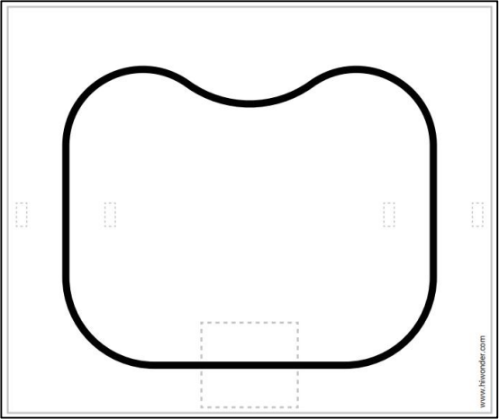  | map | 1 |
|  | white hurdle accessory | 4 |
| 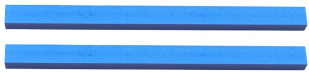  | blue hurdle accessories | 2 |
| 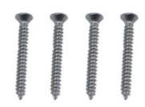 | M3*25 flat head self-tapping screw | 4 |
| 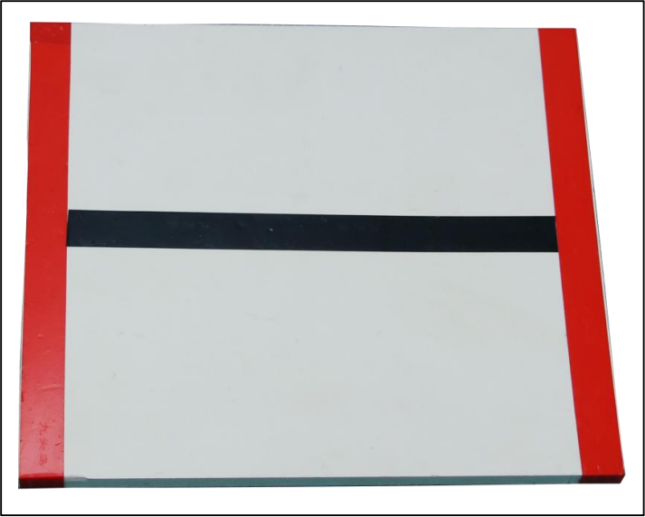  | Stair (the electrical tape has been laid out) | 1 |

### 9.1.2 Step Assembly

Stick the corresponding tapes on the white step. The effect is as follow:


### 9.1.3 Hurdle Assembly

The assembly steps are as follow:

(1) Place the white hurdle accessory at the end of the blue hurdle accessory.

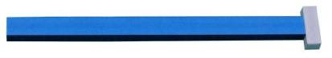

(2) Fix the white hurdle accessory to the end of the blue hurdle with M3*20 flat head self-tapping screw, as the figure shown below:

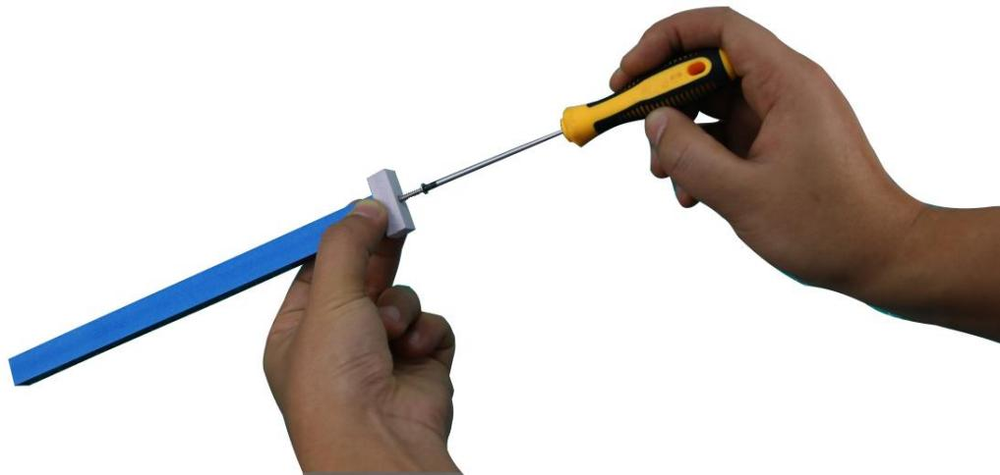

(3) Then, assemble the other white hurdle accessory, as the figure shown below:

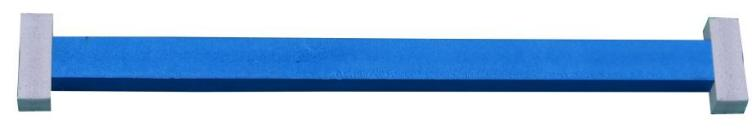

<p id="anchor_9_1_4"></p>

### 9.1.4 Map Placement

Before playing this game, let's have a look at the map. The map is composed of three parts: ①step placement area ②hurdle placement area ③black track Its distribution is as follow:

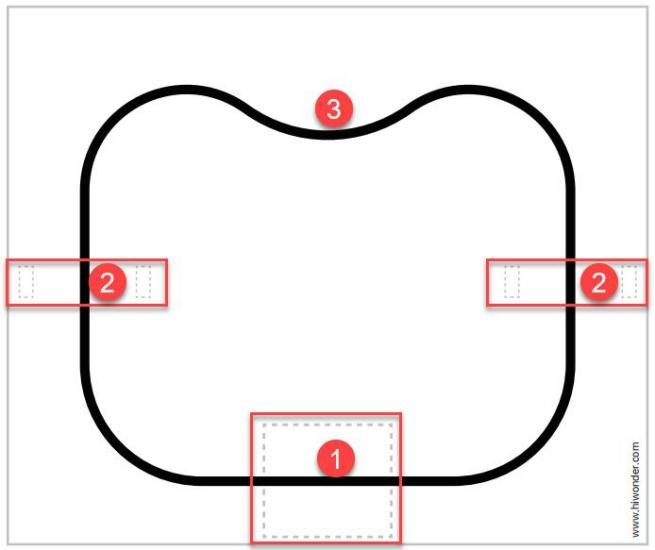

* **Step Placement Area**

This area is used to place step that has been stuck with tape and the specific placement position is as follow:

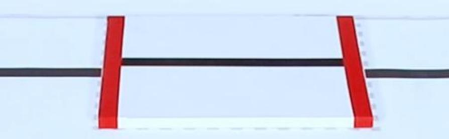

* **Hurdle Placement Area**

This hurdle placement area is used to place two assembled hurdles and the specific placement position is as follows:

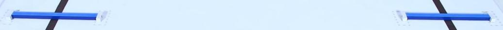

## 9.2 Go Up and Down Stair

### 9.2.1 Getting Ready

Place the map on a flat and smooth surface and set the step in the corresponding position.

The specific placement method for the map and tools can refer to the video and tutorial in [9.1 Tools Assembly and Map Placement](#anchor_9_1).

### 9.2.2 Working Principle

The working principle of this this lesson is as follow:

The color is recognized through Lab color space firstly. Then convert RGB color into Lab color space, and proceed binarization, and dilation and erosion process to obtain the contour of the target color. Mark the target color with blue line, and obtain the coordinate parameter of the target to complete the color recognition.

Next, control the robot to move toward the step. According to the target coordinate to judge, if the robot is in the middle position of the target red line, it will be controlled to move forward and approach the step. When it reaches to the set range, the action of going up and down step will be executed. Otherwise, control robot to move left or right to the middle of the target, and then execute the action of going up and down the step.

The source code of the program is located in: [/home/pi/TonyPi/Extend/athletics_course/stairway.py](../_static/source_code/athletics_course.zip)


### 9.2.3 Operation Steps

:::{Note}
The entered command must pay attention to case sensitivity and space.
:::

(1) Turn on the robot and connect to Raspberry Pi desktop with VNC.

(2) Click the icon  on the upper left corner of the desktop to open command line terminal.

(3) Input the following command and press Enter to locate the directory of game program:

```
cd /home/pi/TonyPi/Extend/athletics_course/
```

(4) Input command and press Enter to start the game:

```
python3 stairway.py
```

(5) If want to exit the game, press **"Ctrl+C"** in the LX terminal. Please try multiple times if fail to exit.

### 9.2.4 Project Outcome

Place the step within the TonyPi Pro's vision range and it can adjust the position according to the recognized red line, and then slowly move forward and approach the step. When the robot approaches to the middle of step, it will go up and down step.

### 9.2.5 Function Extension

* **Modify Climbing Position**

The program defaults that the robot starts going up and down step at a distance of 1000 from the line after the robot detects the red line on the step. If you want the robot to get closer to the stairs before starting to climbing, the data needs to be decreased; If you want the robot to move further away from the step before starting to climbing, the data needs to be increased. This section takes set the distance from the line at position 1020 where the robot starts climbing the stair. You can refer to the following steps to operate:

(1) Input the following command and press Enter to go to the directory of the game program:

```
cd /home/pi/TonyPi/Extend/athletics_course/
```

(2) Enter command and press Enter to open the game programming file:

```
vim Stairway.py
```

(3) Find the code framed in the following figure:

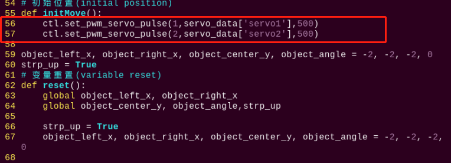

(4) Press **"i"** on keyboard. When **"Insert"** appears in the lower left corner, which means it has entered the editing mode.


(5) Modify the **servo_data\['servo1'\]** in **ctl.set_pwm_servo_pulse (1,servo_data\['servo1'\],500)** to **1020** as pictured:

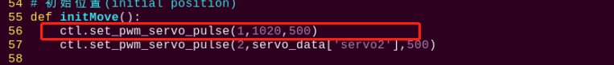

(6) After modification, press **"Esc"** and then enter **":wq"** (Please note that the colon is in front of wq). Then press **"Enter"** to save and exit the modified content.

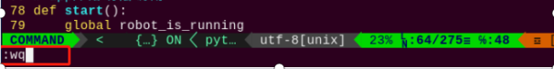

* **Modify Recognition Color**

When making step, we put the red insulated rubber tape on it. The robot will climb the step after detecting the red line. Therefore, we can stick other colored tapes such as green, and let the robot climb the step after detecting the green line. The specific steps are as follows:

(1) Refer to the steps (1), (2) and (4) in folder **"Modify Climbing Position"**, enter the program editing interface to find the code framed in the following figure:

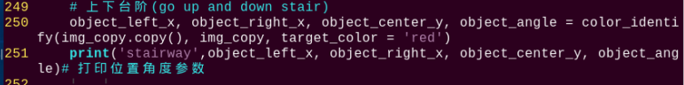

(2) Press **"i"** on keyboard to enter the editing mode. Modify `red` in `object_left_x, object_right_x, object_center_y, object_angle = color_identify(img, img_copy, target_color = 'red')` to **green**.

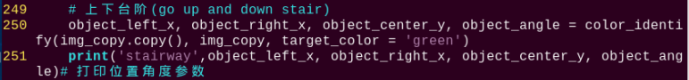

(3) After modification, refer to step (6) in **"Modify Climbing Position"** to save the modified code.

### 9.2.6 Program Analysis

The source code of this program is locate in: [/home/pi/TonyPi/Functions/ColorDetect.py](../_static/source_code/Functions.zip)


* **Import parameter module**

| Import module | function |
|:-------------:|:--------:|
| `import sys` | The Python "**sys**" module has been imported for accessing system-related functions and variables. |
| `import os` | The Python "**os**" module has been imported, providing functions and methods for interacting with the operating system. |
| `import cv2` | The OpenCV library has been imported for image processing and computer vision-related functionalities |
| `import time` | The Python "**time**" module has been imported for time-related functionalities, such as delay operations. |
| `import math` | The "**math**" module provides low-level access to mathematical operations, including many commonly used mathematical functions and constants. |
| `import threading` | Provides an environment for running multiple threads concurrently. |
| `import np` | The NumPy library has been imported. It is an open-source numerical computing extension for Python, used for handling array and matrix operations. |
| `import sensor.camera as camera` | Import camera library |
| `from common import misc` | The "**Misc**" module has been imported for handling recognized rectangular data. |
| `import common.ros_robot_controller_sdk as rrc` | The robot's underlying control library has been imported for controlling servos, motors, RGB lights, and other hardware. |
| `import common.yaml_handle` | Contains functionalities or tools related to processing YAML format files. |
| `from common.controller import Controller` | Import action group execution library |

* **Function logic**

Based on the implementation effect, the logical flaw chart is as follows:

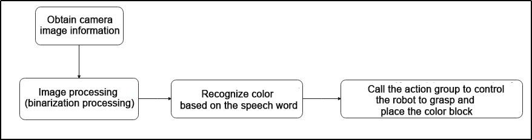

Capture image information through the camera, then process the image, specifically by performing binarization. At the same time, to reduce interference and make the image smoother, perform erosion and dilation operations on the image.

Then, based on the voice recognition result, control the robot to grasp and place the color block.

* **Program Logic and Related Code Analysis**

From the program files, the logical flowchart of the program is as pictured:

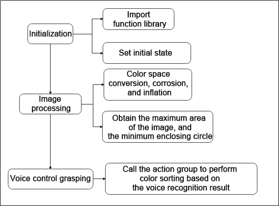

Based on the above diagram, the program's logical flow mainly consists of image processing and voice control grasping. The following document will be written in accordance with the program logic.

* **Initialization**

(1) **Import function library**

In this initialization step, the first task is to import the required libraries for subsequent program calls. For details on the imports, refer to **"Import parameter module"**.

{lineno-start=4}
```python
import os
import sys
import cv2
import time
import math
import threading
import numpy as np
import hiwonder.ros_robot_controller_sdk as rrc
from hiwonder.Controller import Controller
import hiwonder.PID as PID
import hiwonder.Misc as Misc
import hiwonder.Camera as Camera
import hiwonder.ActionGroupControl as AGC
import hiwonder.yaml_handle as yaml_handle
```

(2) **Set initial state**

Set initial state, including the initial position of servo, color threshold, action group name, etc.

{lineno-start=45}
```python
def load_config():
    global lab_data, servo_data
    
    lab_data = yaml_handle.get_yaml_data(yaml_handle.lab_file_path)
    servo_data = yaml_handle.get_yaml_data(yaml_handle.servo_file_path)
```

{lineno-start=55}
```python
def initMove():
    ctl.set_pwm_servo_pulse(1,servo_data['servo1'],500)
    ctl.set_pwm_servo_pulse(2,servo_data['servo2'],500)
```

* **Image processing**

(1) **Image pre-processing**

Resizing and Gaussian blur processing of the image.

{lineno-start=121}
```python
img_resize = cv2.resize(img, (size[0], size[1]), interpolation = cv2.INTER_CUBIC)
GaussianBlur_img = cv2.GaussianBlur(img_resize, (3, 3), 3)
```

`cv2.resize(img_copy, size, interpolation=cv2.INTER_NEAREST)` is an operation to resize the image.

The first parameter `img_copy` is the image to be resized.

The second parameter `size` is the target size.

The third parameter `interpolation` is the interpolation method, which is used to determine the pixel interpolation algorithm used for resizing.

`cv2.GaussianBlur(frame_resize, (3, 3), 3)` applies Gaussian blur to the image.

The first parameter `frame_resize` is the image to be blurred.

The second parameter `(3, 3)` is the size of the Gaussian kernel, indicating that the width and height of the kernel are both 3.

The third parameter `3` is the standard deviation of the Gaussian kernel, used to control the degree of blur.

(2) **Color space conversion**

Convert the BGR image to LAB image.

{lineno-start=123}
```python
frame_lab = cv2.cvtColor(GaussianBlur_img, cv2.COLOR_BGR2LAB)
```

(3) **Binarization processing**

Use `inRange()` function in cv2 library to process binarization.

{lineno-start=124}
```python
frame_mask = cv2.inRange(frame_lab,
                             (lab_data[target_color]['min'][0],
                              lab_data[target_color]['min'][1],
                              lab_data[target_color]['min'][2]),
                             (lab_data[target_color]['max'][0],
                              lab_data[target_color]['max'][1],
                              lab_data[target_color]['max'][2]))
```

The first parameter `frame_lab` is inputting image.

The second parameter `lab_data[i]['min'][0]` is the lower limit of the threshold.

The third parameter `lab_data[i]['max'][0]` is the upper limit of the threshold.

(4) **Opening and closing operation**

{lineno-start=131}
```python
opened = cv2.morphologyEx(frame_mask, cv2.MORPH_OPEN, np.ones((3,3),np.uint8))
closed = cv2.morphologyEx(opened, cv2.MORPH_CLOSE, np.ones((3,3),np.uint8))
```

`eroded = cv2.erode(frame_mask, cv2.getStructuringElement(cv2.MORPH_RECT, (3, 3)))` is the operation to perform corrosion on the binary image.

The first parameter `frame_mask` is the binary image on which morphological operations are to be performed.

The second parameter `cv2.MORPH_OPEN` specifies performing the opening operation.

The third parameter `np.ones((3, 3), np.uint8)` is the structuring element for morphological operations, used to define the shape and size of the operation. Here, a 3x3 matrix filled with ones is used as the structuring element.

The same logic applies to the closing operation function.

(5) **Get the contour with the largest area**

After completing the above image processing, it is necessary to obtain the contours of the recognized targets. This involves using the `findContours()` function from the cv2 library.

{lineno-start=133}
```python
contours = cv2.findContours(closed, cv2.RETR_EXTERNAL, cv2.CHAIN_APPROX_NONE)[-2]
areaMax_contour = getAreaMaxContour(contours, area_min=50)[0]
```

Take code `contours = cv2.findContours(dilated, cv2.RETR_EXTERNAL, cv2.CHAIN_APPROX_NONE)[-2]` as example:

The first parameter `dilated` is inputting image.

The second parameter `cv2.RETR_EXTERNAL` is the contour retrieval mode.

The third parameter `cv2.CHAIN_APPROX_NONE)[-2]` is the contour approximation method.

Find the contour with the largest area in the obtained contour. In order to avoid interference, you need to set a minimum value. The target contour is considered valid only if its area is greater than this value.

(6) **Obtain the coordinates of the bottom and left/right sides of the contour, then perform mapping**

Use the `areaMax_contour` function to obtain the coordinates of the bottom and left/right sides. Then, calculate the distances from the bottom to the left and right sides using the Euclidean distance formula.

{lineno-start=139}
```python
down_x = (areaMax_contour[areaMax_contour[:,:,1].argmax()][0])[0]
down_y = (areaMax_contour[areaMax_contour[:,:,1].argmax()][0])[1]

left_x = (areaMax_contour[areaMax_contour[:,:,0].argmin()][0])[0]
left_y = (areaMax_contour[areaMax_contour[:,:,0].argmin()][0])[1]

right_x = (areaMax_contour[areaMax_contour[:,:,0].argmax()][0])[0]
right_y = (areaMax_contour[areaMax_contour[:,:,0].argmax()][0])[1]
```

(7) **Draw line contour**

Use the OpenCV function `cv2.line` to draw a line segment on the image.

`img_draw`: the image on which the line segment is to be drawn.

`(left_x, left_y)` and `(right_x, right_y)`: the coordinates of the starting and ending points of the line segment.

`(255, 0, 0)`: the color of the line segment, which is blue here (in the BGR color space).

`2`: The thickness of the line segment.

{lineno-start=162}
```python
cv2.line(img_draw, (left_x, left_y), (right_x, right_y), (255, 0, 0), 2)
```

* **Go up and down stair**

(1) Detecting stair: detect the position of the stair using the value of `object_center_y`.

(2) Slightly adjust the position: calculate the center x coordinate `object_x`.

(3) Quick approach: If the center y coordinate is less than 320 and the difference between the center x and the robot's center x is less than 150, the robot will execute a forward action to quickly approach the steps.

(4) Angle adjustment: based on the value of `object_angle`, the robot will decide whether to turn right or left to adjust the angle with the stair.

(5) Left and right adjustment: if the difference between the center x and the robot's center x exceeds a certain threshold, the robot will execute a left or right movement action to adjust its lateral position.

(6) Slightly adjust the angle: within the range of 3 to 20 degrees, the robot will execute slightly adjustment to more precisely adjust the angle with the stair.

(7) At the center of the steps: If the object's center y coordinate is between 320 and 430, the robot will execute a step forward action.

(8) Approaching the stair: If the object's center y coordinate is greater than or equal to 430, the robot will wait for a period of time and check if the y coordinate is still greater than or equal to 430. If it is, the robot will emit an audible alert and execute a series of small step forward actions.

(9) Ascending and descending stairs: If the robot was previously flagged as ready to ascend the stairs (`strp_up` is True), it will execute the action to ascend the stairs and reset the `strp_up` flag. Otherwise, it will execute the default action to descend the stairs.

The purpose of this code is to enable the robot to automatically identify and handle stairs, whether ascending or descending, in a relatively safe and precise manner. Through a series of conditional checks and action executions, the robot can respond appropriately based on the position of the stairs and its own relative position.

{lineno-start=174}
```python
while True:
    if robot_is_running:
        if object_center_y >= 0:
            object_x = object_left_x + (object_right_x - object_left_x)/2
            
            if object_center_y < 320 and abs(object_x - centreX) < 150:
                AGC.runActionGroup(go_forward)
                time.sleep(0.2)
            
            elif 20 <= object_angle < 90:
                AGC.runActionGroup(go_turn_right)
                time.sleep(0.2)
            elif -20 >= object_angle > -90:
                AGC.runActionGroup(go_turn_left)
                time.sleep(0.2)
                
            elif object_x - centreX > 15:
                AGC.runActionGroup(right_move)
            elif object_x - centreX < -15:
                AGC.runActionGroup(left_move)
            
            elif 3 < object_angle < 20:
                AGC.runActionGroup(turn_right)
                time.sleep(0.2)
            elif -5 > object_angle > -20:
                AGC.runActionGroup(turn_left)
                time.sleep(0.2)
                
            elif 320 <= object_center_y < 450:
                AGC.runActionGroup(go_forward_one_step)
                time.sleep(0.2)
                
            elif object_center_y >= 450:
                time.sleep(0.8)
                if object_center_y >= 450:
                    board.set_buzzer(1900, 0.1, 0.9, 1)
                    for i in range(2):
                        AGC.runActionGroup(go_forward_one_small_step)
                        time.sleep(0.5)
                
                    if strp_up:
                        AGC.runActionGroup('climb_stairs')
                        strp_up = False
                    else:
                        for i in range(2):
                            AGC.runActionGroup(go_forward_one_small_step)
                        time.sleep(0.5)
                        AGC.runActionGroup('down_floor')
                        strp_up = True
                    time.sleep(0.5)
                    object_center_y = -1
```

Take code `AGC.runActionGroup('grab_right')` as example:

Use `AGC.runActionGroup` function to call action group. **grab_right** is the name of action group.

## 9.3 Hurdle Clearing

### 9.3.1 Getting Ready

Place the map on a flat and smooth surface and set the hurdle in the corresponding position on the map.

The specific placement method for the map and tool can refer to the video and file in [9.1 Tools Assembly and Map Placement](#anchor_9_1).

### 9.3.2 Working Principle

The working principle of this this lesson is as follow:

The color is recognized through Lab color space firstly. Then convert RGB color into Lab color space, and proceed binarization, and dilation and erosion process to obtain the contour of the target color. Mark the target color with blue line, and obtain the coordinate parameter of the target to complete the color recognition.

Next, control the robot to move toward the hurdle. According to the target coordinate to judge, if the robot is in the middle of the target hurdle, it will move forward. When reaching to the set range, it will execute the hurdling action. Otherwise, control robot to move left or right to the middle of the target, and then execute the hurdling action.

### 9.3.3 Operation Steps

:::{Note}
The entered command must pay attention to case sensitivity and space.
:::

(1) Turn on the robot, and connect to Raspberry Pi desktop through VNC.

(2) Click the icon  on the upper left corner of the desktop to open command line terminal.


(3) Enter the following command and press Enter to go to the directory of the game program:

```
cd /home/pi/TonyPi/Extend/athletics_course/
```

(4) Enter command and then press Enter to start the game:

```
python3 hurdles.py
```

(5) If want to exit the game, press **"Ctrl+C"** in the LX terminal. Please try multiple times if fail to exit.

### 9.3.4 Project Outcome

Place hurdle within TonyPi Pro's vision range. TonyPi Pro will adjust the position according to the blue line recognized, and then slowly approach the hurdle. When the line in the image transmitted by camera overlaps the blue line on hurdle, the robot will lift its foot over the hurdle.

### 9.3.5 Function Extension

* **Modify Hurdling Position**

The program defaults that after the robot detects the blue hurdle, it starts hurdling at a distance of 1000 from the line. If the robot starts hurdling at a closer distance, the data should be decreased; If the robot starts hurdling at a farther distance, the data should be increased. In this section, robot start hurdling at the distance of 1020 from the line. You can refer to the following steps to operate:

(1) Input the following command and press Enter to go to the directory of the game program:

```
cd /home/pi/TonyPi/Extend/athletics_course/
```

(2) Enter command and press Enter to open the game programming file:

```
vim hurdles.py
```

(3) Find the code framed in the following figure:

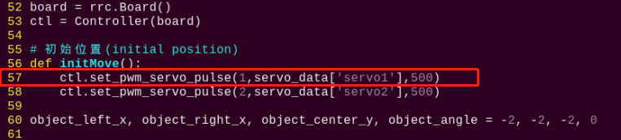

(4) Press **"i"** on keyboard. When **"Insert"** appears in the lower left corner, which means it has entered the editing mode.

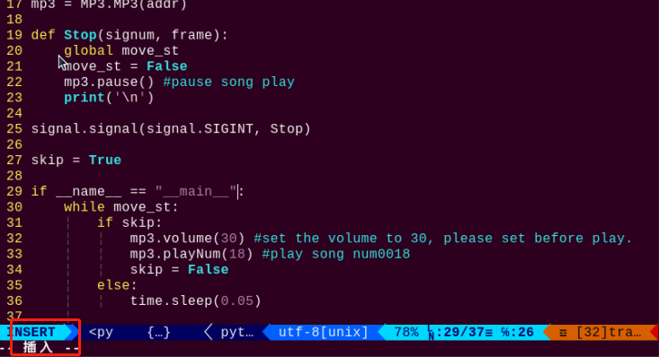

(5) Modify `servo_data['servo1']` in `ctl.set_pwm_servo_pulse(1,servo_data['servo1'],500)` to `1020`, as the figure shown below:


(6) After modification, press **"Esc"** and then enter **":wq"** (Please note that the colon is in front of wq). Then press **"Enter"** to save and exit the modified content.

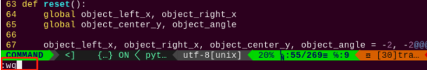

* **Modify Recognition Color**

The color of hurdle is blue. We can stick other colored tapes on hurdle, such as green, and let robot cross hurdle after detecting the green hurdle. The specific steps are as follows:

(1) Refer to the steps (1), (2) and (4) in **"Modify Hurdling Position"**, enter the program editing interface to find the code framed in the following figure:

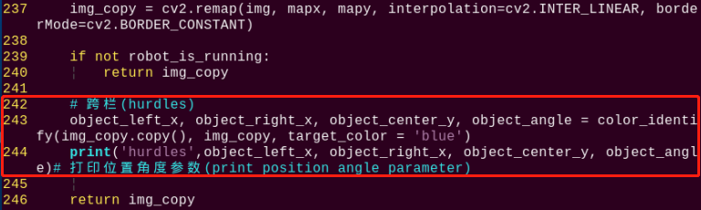

(2) Press **"i"** on keyboard to enter the editing mode, and then modify `blue` in `object_left_x, object_right_x, object_center_y, object_angle = color_identify(img, img_copy, target_color = 'blue')` to **green**.

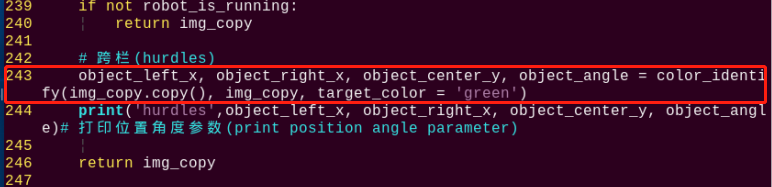

(3) After modification, refer to step (6) in **"Modify Hurdling Position"** to save the modified code.

### 9.3.6 Program Analysis

The source code of this program is locate in: [/home/pi/TonyPi/Extend/athletics_course/hurdles.py](../_static/source_code/athletics_course.zip)


* **Import parameter module**

| Import module | function |
|:-------------:|:--------:|
| `import sys` | The Python "**sys**" module has been imported for accessing system-related functions and variables. |
| `import os` | The Python "**os**" module has been imported, providing functions and methods for interacting with the operating system. |
| `import cv2` | The OpenCV library has been imported for image processing and computer vision-related functionalities |
| `import time` | The Python "**time**" module has been imported for time-related functionalities, such as delay operations. |
| `import math` | The "**math**" module provides low-level access to mathematical operations, including many commonly used mathematical functions and constants. |
| `import threading` | Provides an environment for running multiple threads concurrently. |
| `import np` | The NumPy library has been imported. It is an open-source numerical computing extension for Python, used for handling array and matrix operations. |
| `import sensor.camera as camera` | Import camera library |
| `from common import misc` | The "**Misc**" module has been imported for handling recognized rectangular data. |
| `import common.ros_robot_controller_sdk as rrc` | The robot's underlying control library has been imported for controlling servos, motors, RGB lights, and other hardware. |
| `import common.yaml_handle` | Contains functionalities or tools related to processing YAML format files. |
| `from common.controller import Controller` | Import action group execution library |

* **Function logic**

Based on the implementation effect, the logical flaw chart is as follows:

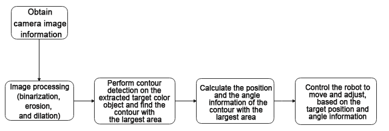

Capture image information through the camera, then process the image, specifically by performing binarization. At the same time, to reduce interference and make the image smoother, perform erosion and dilation operations on the image.

Next, in the **color_identify** function, calculate the position and angle information of the color block based on the contour with the largest area. Specifically, calculate the left and right boundaries and the center point position of the color block based on the contour's lowest, leftmost, and rightmost points, as well as the angle of the color block.

Then, based on the target position and angle information, control the robot's movement and adjustment to orient it towards the target and approach the target.

* **Program Logic and Related Code Analysis**

From the program files, the logical flowchart of the program is as pictured:

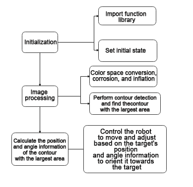

Based on the above diagram, the program's logical flow mainly consists of image processing and hurdle movement. The following document will be written in accordance with the program logic.

* **Initialization**

(1) Import function library

In this initialization step, the first task is to import the required libraries for subsequent program calls. For details on the imports, refer to **"Import parameter module"**.

{lineno-start=4}
```python
import os
import sys
import cv2
import time
import math
import threading
import numpy as np

import hiwonder.PID as PID
import hiwonder.Misc as Misc
import hiwonder.ros_robot_controller_sdk as rrc
from hiwonder.Controller import Controller
import hiwonder.Camera as Camera
import hiwonder.ActionGroupControl as AGC
import hiwonder.yaml_handle as yaml_handle
```

(2) Set initial state

Set initial state, including the initial position of servo, color threshold, etc.

{lineno-start=46}
```python
def load_config():
    global lab_data, servo_data
    
    lab_data = yaml_handle.get_yaml_data(yaml_handle.lab_file_path)
    servo_data = yaml_handle.get_yaml_data(yaml_handle.servo_file_path)
```

* **Image processing**

(1) Image pre-processing

Resizing and Gaussian blur processing of the image.

{lineno-start=122}
```python
img_resize = cv2.resize(img, (size[0], size[1]), interpolation = cv2.INTER_CUBIC)
GaussianBlur_img = cv2.GaussianBlur(img_resize, (3, 3), 0)
```

`cv2.resize(img_copy, size, interpolation=cv2.INTER_NEAREST)` is an operation to resize the image.

The first parameter `img_copy` is the image to be resized.

The second parameter `size` is the target size.

The third parameter `interpolation` is the interpolation method, which is used to determine the pixel interpolation algorithm used for resizing.

`cv2.GaussianBlur(frame_resize, (3, 3), 3)` applies Gaussian blur to the image.

The first parameter `frame_resize` is the image to be blurred.

The second parameter `(3, 3)` is the size of the Gaussian kernel, indicating that the width and height of the kernel are both 3.

The third parameter `3` is the standard deviation of the Gaussian kernel, used to control the degree of blur.

(2) Color space conversion

Convert the BGR image to LAB image.

{lineno-start=124}
```python
frame_lab = cv2.cvtColor(GaussianBlur_img, cv2.COLOR_BGR2LAB)
```

(3) Binarization processing

Use `inRange()` function in cv2 library to process binarization.

{lineno-start=125}
```python
frame_mask = cv2.inRange(frame_lab,
                             (lab_data[target_color]['min'][0],
                              lab_data[target_color]['min'][1],
                              lab_data[target_color]['min'][2]),
                             (lab_data[target_color]['max'][0],
                              lab_data[target_color]['max'][1],
                              lab_data[target_color]['max'][2]))
```

The first parameter `frame_lab` is inputting image.

The second parameter `lab_data[i]['min'][0]` is the lower limit of the threshold.

The third parameter `lab_data[i]['max'][0]` is the upper limit of the threshold.

(4) Corrosion and inflation

{lineno-start=132}
```python
opened = cv2.morphologyEx(frame_mask, cv2.MORPH_OPEN, np.ones((3,3),np.uint8))
closed = cv2.morphologyEx(opened, cv2.MORPH_CLOSE, np.ones((3,3),np.uint8))
```

`eroded = cv2.erode(frame_mask, cv2.getStructuringElement(cv2.MORPH_RECT, (3, 3)))` is the operation to perform corrosion on the binary image.

The first parameter `frame_mask` is the binary image on which morphological operations are to be performed.

The second parameter `cv2.getStructuringElement(cv2.MORPH_RECT, (3, 3))` is the structuring element for the corrosion operation. A rectangular structuring element of size (3, 3) is used here.

The dilation function follows the same principle.

(5) Specify the color of the item to obtain angle information

{lineno-start=243}
```python
object_left_x, object_right_x, object_center_y, object_angle = color_identify(img_copy.copy(), img_copy, target_color = 'blue')
```

(6) **Get the contour with the largest area**

After completing the above image processing, it is necessary to obtain the contours of the recognized targets. This involves using the `findContours()` function from the cv2 library.

{lineno-start=134}
```python
contours = cv2.findContours(closed, cv2.RETR_EXTERNAL, cv2.CHAIN_APPROX_NONE)[-2]
areaMax_contour = getAreaMaxContour(contours, area_min=50)[0]
```

Take code `contours = cv2.findContours(dilated, cv2.RETR_EXTERNAL, cv2.CHAIN_APPROX_NONE)[-2]` as example:

The first parameter `dilated` is inputting image.

The second parameter `cv2.RETR_EXTERNAL` is the contour retrieval mode.

The third parameter `cv2.CHAIN_APPROX_NONE)[-2]` is the contour approximation method.

Find the contour with the largest area in the obtained contour. In order to avoid interference, you need to set a minimum value. The target contour is considered valid only if its area is greater than this value.

(7) Detect the hurdle and perform fine-tuning of its position

{lineno-start=175}
```python
if object_center_y >= 0:
    
    object_x = object_left_x + (object_right_x - object_left_x)/2
```

Continuously monitor the robot's operating status (`robot_is_running`) and the position information of the object (`object_center_y`) through a loop. If a hurdle is detected (`object_center_y >= 0`), perform position fine-tuning and action control based on the position and angle information of the object.

(8) If far from the railing, approach quickly

{lineno-start=180}
```python
if object_center_y < 320 and abs(object_x - centreX) < 150:
    AGC.runActionGroup(go_forward)
    time.sleep(0.2)
```

If far from the railing, call the forward action group to approach quickly

(9) Perform position slightly adjustment and action control based on the object's position and angle information, approaching the railing, turning, and adjusting left and right

{lineno-start=184}
```python
elif 20 <= object_angle < 90:
    AGC.runActionGroup(go_turn_right)
    time.sleep(0.2)
elif -20 >= object_angle > -90:
    AGC.runActionGroup(go_turn_left)
    time.sleep(0.2)
    
elif object_x - centreX > 15:
    AGC.runActionGroup(right_move)
elif object_x - centreX < -15:
    AGC.runActionGroup(left_move)

elif 3 < object_angle < 20:
    AGC.runActionGroup(turn_right)
    time.sleep(0.2)
elif -5 > object_angle > -20:
    AGC.runActionGroup(turn_left)
    time.sleep(0.2)
    
elif 320 <= object_center_y < 450:
    AGC.runActionGroup(go_forward_one_step)
    time.sleep(0.5)
```

① If the angle is between 20 and 90 degrees, it indicates that the angle needs a slight adjustment to the right, and the robot turns right.

② If the angle is between -90 and -20 degrees, it indicates that the angle needs a slight adjustment to the left, and the robot turns left.

③ If the difference between the object's center x coordinate (`object_x`) and the center point (`centreX`) is greater than 15 pixels, it indicates that the color block is on the right side of the center point. The robot moves to the right.

④ If the difference between the object's center x coordinate (`object_x`) and the center point (`centreX`) is less than -15 pixels, it indicates that the color block is on the left side of the center point. The robot moves to the left.

⑤ If the angle of the color block is between 3 and 20 degrees, it indicates that the angle needs a slight adjustment to the right. The robot turns right.

⑥ If the angle of the color block is between -20 and -5 degrees, it indicates that the angle needs a slight adjustment to the left. The robot turns left.

If the color block's center point position is between 320 and 430 pixels, it indicates that the robot is relatively close to the railing. The robot slowly approaches forward.

(10) Close to the position, cross the hurdle

{lineno-start=207}
```python
elif object_center_y >= 450:
    time.sleep(0.8)
    if object_center_y >= 450:
        board.set_buzzer(1900, 0.1, 0.9, 1)
        for i in range(3):
            AGC.runActionGroup(go_forward_one_small_step)
            time.sleep(0.5)
        
        AGC.runActionGroup('hurdles')
        time.sleep(0.5)
        object_center_y = -1
```

① If the color block's center point position is greater than or equal to 430 pixels, it indicates that the robot is close to the railing. Execute the hurdle-crossing action and reset `object_center_y` to -1 to indicate that the hurdle-crossing is completed.

## 9.4 Athletics Performance

### 9.4.1 Getting Ready

Place the map on a flat and smooth surface and set the stair in the corresponding position on the map.

The specific placement method for the map and tool can refer to the video and file in [9.1.4 Map Placement](#anchor_9_1_4).

### 9.4.2 Working Principle

As we all know, a robot is a device imitating human. In this lesson, we combine **"Climb Stair"** and **"Hurdle"** to simulate robots to learn human athletics sport.

The color is recognized through Lab color space firstly. Then convert RGB color into Lab color space, and proceed binarization, and dilation and erosion process to obtain the contour of the target color. Mark the target color with blue line, and obtain the coordinate parameter of the target to complete the color recognition.

Then process the servo on the pan-tilt of the head after recognition, the x and y coordinates of the center point of the image are used as set values, and the currently acquired x and y coordinates are used as input values to update the pid.

Then calculate according to the feedback of the line position in the image, and finally make the robot move along the line through the change of position, so as to control the robot to walk along the black line.

Then, if you encounter step or hurdle in the middle, please refer to **"Lesson 2 Climb step"** and **"Lesson 3 Hurdle"**.

### 9.4.3 Operation Steps

:::{Note}
The entered command must pay attention to case sensitivity and space.
:::

(1) Turn on the robot and connect to Raspberry Pi desktop with VNC.

(2) Click the icon  on the upper left corner of the desktop to open command line terminal.


(3) Enter the following command and press Enter to go to the directory of the game program:

```
cd /home/pi/TonyPi/Extend/athletics_course/
```

(4) Enter command and press Enter to start the game:

```
python3 athletics_perform.py
```

(5) If want to exit the game, press **"Ctrl+C"** in the LX terminal. Please try multiple times if fail to exit.

### 9.4.4 Project Outcome

:::{Note}
* In this game, the robot's hands can not be replaced with novel robotic hands. Otherwise, it will change robot's center of mass and affect experience.
* The robot needs to be placed in a smooth and flat surface to avoid falling.
* The background color does not be similar to red, black and blue to get better experience.
* The height of the step and hurdle should be kept at 1cm, and the two ends of step need to be affixed with the red tape.
:::

Place the map on a flat and smooth surface, and place step and hurdle on the corresponding position on the map. Then place the robot on the black line of map.

After starting this game, the robot will walk along the black line. When encounter a step, it will automatically go up and down step. When encounters a hurdle, it will go over it.

### 9.4.5 Function Extension

* **Modify Climbing and Hurdling Position**

After the program is started, if the realization effect of going up and down step or hurdling is not good enough, we can change the distance where the robot starts performing action.

The program defaults that the robot starts going up and down step or hurdling at a distance of 1000 from the line. If the distance needs to be closer, the data should be decreased; if the distance needs to be farther, the data should be increased. This section takes robot starts climbing step or hurdling at a distance of 1020 as example. Please refer to the following steps:

(1) Input the following command and press Enter to go to the directory of game program:

```
cd /home/pi/TonyPi/Extend/athletics_course/
```

(2) Enter command and press Enter to open the game programming file:

```
vim athletics_perform.py
```

(3) Find the code framed in the following figure:

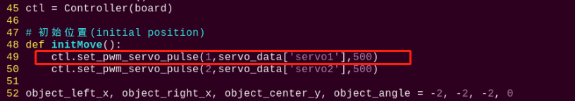

(4) Press **"i"** on keyboard. When **"Insert"** appears in the lower left corner, which means it has entered the editing mode.


(5) Modify `servo_data['servo1']` in `ctl.set_pwm_servo_pulse(1,servo_data['servo1'],500)` to `1020`, as shown in the follows:

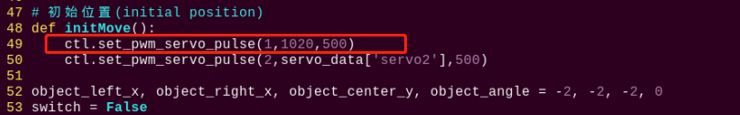

(6) After modification, press **"Esc"** and then enter **":wq"** (Please note that the colon is in front of wq). Then press **"Enter"** to save and exit the modified content.

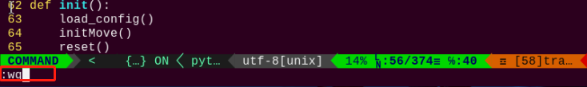

* **Modify Line Color**

It is black line on the provided map. After starting program, the robot will walk along the black line. You can change the line with other colored tape, for example, green tape is used to affix on the map and the robot is set to walk along the green line. The specific steps are as follows:

(1) Refer to steps (1), (2), (4) in **"Modify Climbing and Hurdling Position"** to enter the program editing interface and find the code framed in the figure below:

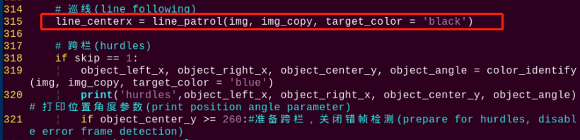

(2) Press **"i"** to enter the editing mode. Modify **black** in `line_centerx = line_patrol(img, img_copy, target_color = 'black')` to **green**.

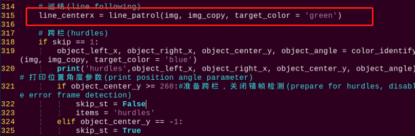

(3) After modification, refer to step (6) in **"Modify Climbing and Hurdling Position"** to save the modified code.

### 9.4.6 Program Analysis

The source code of this program is locate in: [/home/pi/TonyPi/Extend/athletics_course/athletics_perform.py](../_static/source_code/athletics_course.zip)

* **Import parameter module**

| Import module | function |
|:-------------:|:--------:|
| `import sys` | The Python "**sys**" module has been imported for accessing system-related functions and variables. |
| `import os` | The Python "**os**" module has been imported, providing functions and methods for interacting with the operating system. |
| `import cv2` | The OpenCV library has been imported for image processing and computer vision-related functionalities |
| `import time` | The Python "**time**" module has been imported for time-related functionalities, such as delay operations. |
| `import math` | The "**math**" module provides low-level access to mathematical operations, including many commonly used mathematical functions and constants. |
| `import threading` | Provides an environment for running multiple threads concurrently. |
| `import np` | The NumPy library has been imported. It is an open-source numerical computing extension for Python, used for handling array and matrix operations. |
| `import sensor.camera as camera` | Import camera library |
| `from common import misc` | The "**Misc**" module has been imported for handling recognized rectangular data. |
| `import common.ros_robot_controller_sdk as rrc` | The robot's underlying control library has been imported for controlling servos, motors, RGB lights, and other hardware. |
| `import common.yaml_handle` | Contains functionalities or tools related to processing YAML format files. |
| `from common.controller import Controller` | Import action group execution library |

* **Function logic**

Based on the implementation effect, the logical flaw chart is as follows:

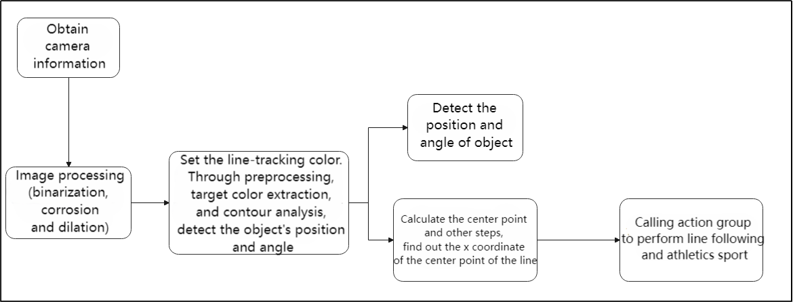

Capture image information through the camera, then process the image, specifically by performing binarization. At the same time, to reduce interference and make the image smoother, perform erosion and dilation operations on the image.

Next, in the **color_identify** function, calculate the position and angle information of the color block based on the contour with the largest area. Calculate the left boundary x-coordinate, right boundary x-coordinate, center point y-coordinate, and angle of the object based on the vertex information of the largest contour.

Then, based on the target position and angle information, control the robot's movement and adjustment to orient it towards the target and achieve athletics.

* **Program Logic and Related Code**

From the program files, the logical flowchart of the program is as pictured:

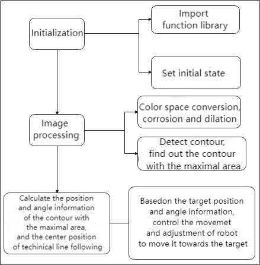

Based on the above diagram, the program's logical flow mainly consists of image processing and hurdle movement. The following document will be written in accordance with the program logic.

* **Initialization**

(1) **Import function library**

In this initialization step, the first task is to import the required libraries for subsequent program calls. For details on the imports, refer to **"Import parameter module"**.

{lineno-start=4}
```python
import os
import sys
import cv2
import time
import math
import threading
import numpy as np
import hiwonder.ros_robot_controller_sdk as rrc
from hiwonder.Controller import Controller
import hiwonder.Misc as Misc
import hiwonder.PID as PID
import hiwonder.ActionGroupControl as AGC
import hiwonder.yaml_handle as yaml_handle
```

(2) **Set initial state**

Set initial state, including the initial position of servo, color threshold, etc.

{lineno-start=36}
```python
def load_config():
    global lab_data, servo_data
    
    lab_data = yaml_handle.get_yaml_data(yaml_handle.lab_file_path)
    servo_data = yaml_handle.get_yaml_data(yaml_handle.servo_file_path)
```

* **Image processing**

(1) Image pre-processing

Resizing and Gaussian blur processing of the image.

{lineno-start=107}
```python
frame_resize = cv2.resize(img_draw, size, interpolation=cv2.INTER_NEAREST)
frame_gb = cv2.GaussianBlur(frame_resize, (3, 3), 3)
```

`cv2.resize(img_copy, size, interpolation=cv2.INTER_NEAREST)` is an operation to resize the image.

The first parameter `img_copy` is the image to be resized.

The second parameter `size` is the target size.

The third parameter `interpolation` is the interpolation method, which is used to determine the pixel interpolation algorithm used for resizing.

`cv2.GaussianBlur(frame_resize, (3, 3), 3)` applies Gaussian blur to the image.

The first parameter `frame_resize` is the image to be blurred.

The second parameter `(3, 3)` is the size of the Gaussian kernel, indicating that the width and height of the kernel are both 3.

The third parameter `3` is the standard deviation of the Gaussian kernel, used to control the degree of blur.

Convert the BGR image to LAB image.

{lineno-start=115}
```python
frame_lab = cv2.cvtColor(blobs, cv2.COLOR_BGR2LAB)
```

(2) Binarization processing

Use `inRange()` function in cv2 library to process binarization.

{lineno-start=117}
```python
frame_mask = cv2.inRange(frame_lab,
                             (lab_data[target_color]['min'][0],
                              lab_data[target_color]['min'][1],
                              lab_data[target_color]['min'][2]),
                             (lab_data[target_color]['max'][0],
                              lab_data[target_color]['max'][1],
                              lab_data[target_color]['max'][2]))
```

The first parameter `frame_lab` is inputting image.

The second parameter `lab_data[i]['min'][0]` is the lower limit of the threshold.

The third parameter `lab_data[i]['max'][0]` is the upper limit of the threshold.

(3) Corrosion and inflation

{lineno-start=124}
```python
opened = cv2.morphologyEx(frame_mask, cv2.MORPH_OPEN, np.ones((6, 6), np.uint8))
closed = cv2.morphologyEx(opened, cv2.MORPH_CLOSE, np.ones((6, 6), np.uint8))
```

`eroded = cv2.erode(frame_mask, cv2.getStructuringElement(cv2.MORPH_RECT, (3, 3)))` is the operation to perform corrosion on the binary image.

The first parameter `frame_mask` is the binary image on which morphological operations are to be performed.

The second parameter `cv2.getStructuringElement(cv2.MORPH_RECT, (3, 3))` is the structuring element for the corrosion operation. A rectangular structuring element of size (3, 3) is used here.

The dilation function follows the same principle.

(4) Specify the color of the item to obtain angle information and set the line-following color

{lineno-start=315}
```python
line_centerx = line_patrol(img, img_copy, target_color = 'black')
```

(5) Get the contour with the largest area

After completing the above image processing, it is necessary to obtain the contours of the recognized targets. This involves using the `findContours()` function from the cv2 library.

{lineno-start=126}
```python
cnts = cv2.findContours(closed , cv2.RETR_EXTERNAL, cv2.CHAIN_APPROX_TC89_L1)[-2]
cnt_large, area = getAreaMaxContour(cnts)
```

Take code `contours = cv2.findContours(dilated, cv2.RETR_EXTERNAL, cv2.CHAIN_APPROX_NONE)[-2]` as example:

The first parameter `dilated` is inputting image.

The second parameter `cv2.RETR_EXTERNAL` is the contour retrieval mode.

The third parameter `cv2.CHAIN_APPROX_NONE)[-2]` is the contour approximation method.

Find the contour with the largest area in the obtained contour. In order to avoid interference, you need to set a minimum value. The target contour is considered valid only if its area is greater than this value.

{lineno-start=129}
```python
rect = cv2.minAreaRect(cnt_large)
box = np.int0(cv2.boxPoints(rect))
```

(6) Detect the hurdle and perform fine-tuning of its position

{lineno-start=223}
```python
if object_center_y >= 300:
```

Continuously monitor the robot's operating status (`robot_is_running`) and the position information of the object (`object_center_y`) through a loop. If a hurdle is detected (`object_center_y >= 0`), perform position fine-tuning and action control based on the position and angle information of the object.

If far from the railing, approach quickly

{lineno-start=319}
```python
object_left_x, object_right_x, object_center_y, object_angle = color_identify(img, img_copy, target_color = 'blue')
```

Perform position slightly adjustment, line following, and execute actions such as crossing hurdles or ascending/descending stairs based on the object's position and angle

{lineno-start=226}
```python
if 20 <= object_angle < 90:
    AGC.runActionGroup(go_turn_right)
    time.sleep(0.2)
elif -20 >= object_angle > -90:
    AGC.runActionGroup(go_turn_left)
    time.sleep(0.2)

elif line_centerx - x_center > 15:
    AGC.runAction(right_move)
elif line_centerx - x_center < -15:
    AGC.runAction(left_move)

elif 3 < object_angle < 20:
    AGC.runActionGroup(turn_right)
    time.sleep(0.2)
elif -5 > object_angle > -20:
    AGC.runActionGroup(turn_left)
    time.sleep(0.2)
    
elif 300 <= object_center_y < 430:
    AGC.runActionGroup(go_forward_one_step)
    time.sleep(0.2)

elif object_center_y >= 430:
    time.sleep(0.5)
    if object_center_y >= 430:
        board.set_buzzer(1900, 0.1, 0.9, 1)
        AGC.runActionGroup(go_forward_one_step)
        time.sleep(0.5)
        AGC.runActionGroup(go_forward_one_step)
        time.sleep(0.5)
        
        if items == 'hurdles':
            
            AGC.runActionGroup('hurdles')
            skip_st = True
            strp_up = True
            items = None
        elif items == 'stairway':
            if strp_up:
                AGC.runActionGroup('climb_stairs')
                strp_up = False
            else:
                for i in range(2):
                    AGC.runActionGroup(go_forward_one_step)
                time.sleep(0.2)
                AGC.runActionGroup('down_floor')
                strp_up = True
            items = None
            skip_st = True
        time.sleep(0.5)
        object_center_y = -1
```

① If the object's angle is between 20 and 90 degrees, execute the `go_turn_righ` action group and delay for 0.2 seconds.

② If the object's angle is between -20 and -90 degrees, execute the `go_turn_left` action group and delay for 0.2 seconds.

③ If the center X coordinate of the line differs from the center X coordinate by more than 15, execute the `right_move` action.

④ If the center X coordinate of the line differs from the center X coordinate by less than -15, execute the `left_move` action.

⑤ If the object's angle is between 3 and 20 degrees, execute the `turn_righ` action group and delay for 0.2 seconds.

⑥ If the object's angle is between -5 and -20 degrees, execute the `turn_left` action group and delay for 0.2 seconds.

⑦ If the object center's Y coordinate is between 300 and 420 degrees, execute the `go_forward_one_step` action group and delay for 0.2 seconds.

⑧ If the object's center Y coordinate is greater than or equal to 430, it indicates proximity to position, allowing for crossing hurdles or ascending/descending stairs:

⑨ Delay for 0.5 seconds

⑩ If the object's center Y coordinate is still greater than or equal to 430, activate the buzzer to sound and execute the `go_forward_one_step` action group to move forward one step, with a delay of 0.5 seconds.

⑪ If the value of the `items` variable is `hurdles`, indicating it is a hurdle type: execute the `hurdles` action group.

⑫ Then set the `skip_st` and `strp_up` variables to True. Set the `items` variable to None.

⑬ If the value of the `items` variable is `stairway`, indicating it is a stairway type:

⑭ If the `strp_up` variable is True, indicating it is an ascending stairs type: execute the `climb_stairs` action group.

⑮ Set the `strp_up` variable to False. Otherwise, indicating it is a descending stairs type: execute the `go_forward_one_step` action group to move forward one step.

⑯ Delay for 0.2 seconds.

⑰ Perform `down_floor` action group.

⑱ Set the `strp_up` variable to True. Set the `items` variable to None. Set the `skip_st` variable to True.

⑲ Delay for 0.5 seconds.

⑳ Set the object's center Y coordinate to -1.

(7) Line patrol

{lineno-start=282}
```python
elif line_st and line_centerx != 8888:
    if abs(line_centerx - x_center) <= 20:
        AGC.runAction(go_forward)
        time.sleep(0.2)
    elif line_centerx - x_center > 20:
        AGC.runAction(go_turn_right)
        time.sleep(0.2)
    elif line_centerx - x_center < -20:
        AGC.runAction(go_turn_left)
        time.sleep(0.2)
    else:
        time.sleep(0.01)
```

① If the `line_st` variable is true and the center X coordinate of the line is not equal to 8888, indicating line following:

② If the difference between the center X coordinate of the line and the center X coordinate is less than or equal to 20, execute the `go_forward` action and delay for 0.2 seconds.

③ If the difference between the center X coordinate of the line and the center X coordinate is greater than 20, execute the `go_turn_right` action and delay for 0.2 seconds.

④ If the difference between the center X coordinate of the line and the center X coordinate is less than -20, execute the `go_turn_left` action and delay for 0.2 seconds.

⑤ Otherwise, delay for 0.01 seconds.